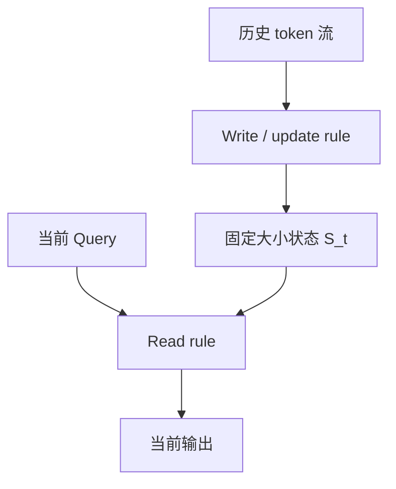
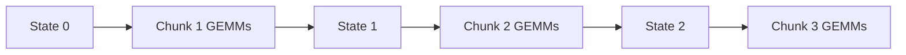
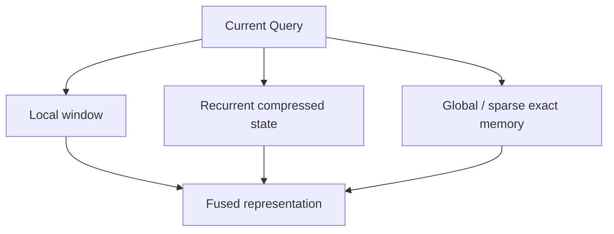

# Linear Attention：从 Attention 矩阵到可更新的有限状态记忆

> 本文承接 `MLA.md` 与 `Sparse-Attention.md`。MLA 减少每个历史 token 的 KV byte；Sparse Attention 减少每个 Query 实际读取的历史位置；Linear Attention 走得更远：不再把全部历史保存为 token-level KV，而是把历史持续压缩进固定大小的 recurrent state。
>
> 本文面向模型架构、训练系统和推理 Infra 学习者。公式首先解释结构本身，再落到 prefill、decode、GPU kernel、状态管理和 Serving runtime。论文或模型报告中的速度数字只作为作者特定实验的结果，不直接外推到其他模型、硬件和工作负载。
>
> **资料版本：截至 2026-09-02。** 其中 GDN-2、DART、Qwen3.8-Flash-Next、GLM-5.3-Flash 等属于快速演进中的近期工作；文中会区分论文结论、作者报告和本文推导，具体 kernel 支持范围以对应仓库当前版本为准。

## 缩写与术语

| 缩写 | 全称 | 中文解释 |
|---|---|---|
| LA | Linear Attention | 线性注意力；本文狭义上指可用结合律改写为线性复杂度的 Attention |
| RNN | Recurrent Neural Network | 循环神经网络，通过递推状态处理序列 |
| FWP | Fast Weight Programmer | 快速权重编程器，把序列状态看成在线更新的权重矩阵 |
| SSM | State Space Model | 状态空间模型，用状态转移描述序列动态 |
| GLA | Gated Linear Attention | 带门控的线性注意力 |
| GDN | Gated DeltaNet | 将 forget gate 与 delta rule 组合的线性递推结构 |
| KDA | Kimi Delta Attention | Kimi 的细粒度 gated delta attention |
| SSD | State Space Duality | 状态空间对偶，把 SSM 与结构化 Attention 联系起来 |
| DPLR | Diagonal Plus Low Rank | 对角加低秩矩阵结构 |
| KV | Key-Value | Attention 中保存历史 Key/Value 的状态 |
| MLA | Multi-head Latent Attention | 多头潜变量注意力，用 latent KV 压缩 Cache |
| DSA | DeepSeek Sparse Attention | DeepSeek 的可学习动态稀疏注意力 |
| GQA / MQA | Grouped-Query / Multi-Query Attention | 分组查询 / 多查询注意力，通过共享 KV 降低 Cache |
| MoE | Mixture of Experts | 混合专家网络，每个 token 只激活少量专家 |
| RoPE / NoPE | Rotary Position Embedding / No Position Encoding | 旋转位置编码 / 不使用显式位置编码 |
| HBM | High Bandwidth Memory | GPU 高带宽显存 |
| SRAM | Static Random-Access Memory | GPU 片上共享内存/缓存语境中的高速存储 |
| TTFT | Time To First Token | 首 token 延迟，通常由排队和 prefill 主导 |
| ITL / TPOT | Inter-Token Latency / Time Per Output Token | 连续输出 token 间延迟 |
| CP / TP | Context / Tensor Parallelism | 上下文并行 / 张量并行 |

这里的 “Linear” 指对序列长度 $L$ 的时间复杂度近似为 $O(L)$，不是“这一层只有 Linear/全连接算子”，也不代表所有维度上的成本都是常数。

---

## 0. 先给结论：Linear Attention 把历史从 token 列表变成了一个程序状态

标准 Attention 的历史记忆是：

$$
\mathcal M_t^{\text{softmax}}
=\{(k_1,v_1),(k_2,v_2),\ldots,(k_t,v_t)\}.
$$

每生成一个 token，都对这张不断增长的 token-level memory 做一次查询。即使使用 MLA 压缩每条 KV record，状态仍随 $t$ 增长。

Linear Attention 的历史记忆是：

$$
S_t=f(S_{t-1},k_t,v_t,g_t),
\qquad
y_t=r(q_t,S_t).
$$

新 token 不只是“追加到 Cache”，而是对有限大小的状态执行一次写操作；Query 则从该状态读出结果。



因此它最诱人的性质是：

| 阶段 | Softmax Attention | Linear/Recurrent Attention |
|---|---:|---:|
| Training/Prefill 计算 | $O(L^2d)$ | 通常 $O(Ld^2)$ 或 $O(Ld_kd_v)$ |
| Decode 单步序列成本 | $O(Ld)$ | 与 $L$ 无关 |
| 序列方向 Cache | $O(Ld)$ | 相对 $L$ 为 $O(1)$ |
| 历史表示 | 每个 token 独立保存 | 多个 token 叠加在有限 state |
| 精确随机访问 | 强 | 天然受限 |

但这里的“固定状态”会把新的瓶颈暴露出来：

1. **容量冲突**：越来越多关联写进同一个矩阵；
2. **遗忘策略**：什么该保留、什么该清除；
3. **写入规则**：如何覆盖同一个 Key 的旧 Value，而不是只叠加；
4. **Prefill 并行性**：递推看似必须逐 token 执行；
5. **状态带宽**：decode 每步仍要读写完整 matrix state；
6. **精确检索**：有限状态不能无损容纳无限 token identity；
7. **回滚与分支**：speculative decoding 不能只截断一个 KV page table。

所以 Linear Attention 的完整演化不是“把 softmax 换成 kernel trick”，而是：

$$
\boxed{
\text{Associative factorization}
\rightarrow
\text{Fast-weight memory}
\rightarrow
\text{Decay / Delta update}
\rightarrow
\text{Hardware-efficient chunking}
\rightarrow
\text{Linear + exact Attention hybrid}
}
$$

---

## 1. 先划清边界：哪些结构可以叫 Linear Attention

今天“Linear Attention”常被用作三个不同层次的词。

### 1.1 狭义：Kernelized Linear Attention

把相似度函数写成 feature map 内积：

$$
\operatorname{sim}(q,k)=\phi(q)^\top\phi(k),
$$

再利用矩阵乘法结合律把 $(QK^\top)V$ 改写为 $Q(K^\top V)$。Linear Transformer、Performer 属于这条主线。

### 1.2 中义：Matrix-state Linear RNN / Fast-weight model

状态通常为矩阵：

$$
S_t\in\mathbb R^{d_k\times d_v}.
$$

每个 token 通过 outer product 或 delta rule 更新它。GLA、DeltaNet、Gated DeltaNet、KDA 属于这条主线，也是现代 Hybrid LLM 最直接采用的结构。

### 1.3 广义：线性时间 recurrent token mixer

RetNet、RWKV、S4/Mamba、Hyena 也具有线性或近线性序列计算、固定 recurrent state 或卷积等价形式，工程讨论中常与 Linear Attention 放在同一类比较。但它们并不都来自同一个 kernel factorization。

本文会纳入这些里程碑工作，因为它们共同推动了：

- parallel training 与 recurrent inference 的双重形式；
- selective forgetting；
- scan/chunk kernel；
- Hybrid Attention 架构。

但公式会明确标注属于 LA、RNN、SSM 还是 convolution 路线。

---

## 2. 为什么 Softmax Attention 不能直接交换乘法顺序

标准因果 Attention：

$$
a_{t,s}
=\frac{\exp(q_t^\top k_s/\sqrt d)}
{\sum_{j\le t}\exp(q_t^\top k_j/\sqrt d)},
\qquad
y_t=\sum_{s\le t}a_{t,s}v_s.
$$

矩阵形式：

$$
Y=\operatorname{Softmax}(QK^\top)V.
$$

如果没有 Softmax，结合律允许：

$$
(QK^\top)V=Q(K^\top V).
$$

两种计算顺序的中间张量是：

| 顺序 | 中间张量 | 大小 |
|---|---|---:|
| $(QK^\top)V$ | $QK^\top$ | $L\times L$ |
| $Q(K^\top V)$ | $K^\top V$ | $d_k\times d_v$ |

当 $L\gg d_k,d_v$ 时，后者显著更小。但 row-wise Softmax 依赖每个 Query 对全部 Key 的 logits，不能简单穿过括号：

$$
\operatorname{Softmax}(QK^\top)V
\ne
Q\operatorname{Softmax}(K^\top V).
$$

Linear Attention 的关键是换一种可分解的相似度，或者设计一个能以递推状态实现的 token mixer。

---

## 3. Kernelized Linear Attention 的完整推导

设非负相似度：

$$
\operatorname{sim}(q,k)=\phi(q)^\top\phi(k),
\qquad
\phi(x)\in\mathbb R^{d_\phi}.
$$

则：

$$
y_t
\mathrel{=}
\frac{
\sum_{s\le t}\phi(q_t)^\top\phi(k_s)v_s
}{
\sum_{s\le t}\phi(q_t)^\top\phi(k_s)
}.
$$

利用结合律定义两个前缀状态：

$$
S_t
=\sum_{s\le t}\phi(k_s)v_s^\top
\in\mathbb R^{d_\phi\times d_v},
$$

$$
z_t
=\sum_{s\le t}\phi(k_s)
\in\mathbb R^{d_\phi}.
$$

输出为：

$$
y_t
=\frac{\phi(q_t)^\top S_t}
{\phi(q_t)^\top z_t+\epsilon}.
$$

### 3.1 Recurrent form

$$
S_t=S_{t-1}+\phi(k_t)v_t^\top,
$$

$$
z_t=z_{t-1}+\phi(k_t),
$$

$$
y_t=\frac{\phi(q_t)^\top S_t}
{\phi(q_t)^\top z_t+\epsilon}.
$$

每个 token 只更新固定大小状态。这正是 2020 年 **Transformers are RNNs** 的核心洞察：线性化 Attention 可以用 RNN 形式做自回归推理。

### 3.2 Parallel form

对非因果场景：

$$
S=\Phi(K)^\top V,
\qquad
Y=\Phi(Q)S.
$$

因果场景要用 prefix sum 或 chunkwise causal mask：

$$
S_t=\operatorname{PrefixSum}_t
\left(\phi(k_t)v_t^\top\right).
$$

所以 Linear Attention 同时具有：

- 训练/prefill 的批量矩阵形式；
- decode 的 recurrent 形式。

这叫 **sequential-parallel duality**：同一个算子既能并行处理长序列，又能以常数状态逐 token 更新。

### 3.3 状态到底有多大

对于 $H$ 个 state heads：

$$
N_{state}
=H(d_\phi d_v+d_\phi).
$$

若 $H=32$、$d_\phi=d_v=128$，仅矩阵状态元素数为：

$$
32\times128\times128=524,288.
$$

BF16 大约：

$$
524,288\times2\text{ B}=1\text{ MiB/layer/request}.
$$

它与 context length 无关，但绝不是“状态很小”。40 个 Linear Attention 层、batch 1 就可能约 40 MiB；若状态用 FP32，翻倍。

---

## 4. Feature Map：线性化 Softmax 的代价在哪里

### 4.1 简单正值 feature map

Linear Transformer 常用：

$$
\phi(x)=\operatorname{ELU}(x)+1,
$$

保证 feature 非负，使归一化分母更稳定。

它不等价于 Softmax kernel：

$$
\exp(q^\top k)
$$

与：

$$
\phi(q)^\top\phi(k)
$$

具有不同归纳偏置。效率来自改变 Attention，而不是免费重排同一个 Softmax。

### 4.2 Performer 与 FAVOR+

Performer 使用 FAVOR+（Fast Attention Via positive Orthogonal Random features），用正交随机特征近似 Softmax kernel：

$$
\exp(q^\top k)
\approx
\phi(q)^\top\phi(k).
$$

它的重要里程碑意义是：

- 尝试保留 Softmax kernel 的性质；
- 给出近似误差与方差方面的理论保证；
- 不依赖预定义 sparsity pattern；
- 时间和空间随 $L$ 线性增长。

但 random feature dimension 越小，近似误差越大；越大，状态 $d_\phi\times d_v$ 和每 token 计算越贵。

### 4.3 Linear Attention 的低秩视角

隐式 Attention matrix：

$$
A=\Phi(Q)\Phi(K)^\top.
$$

其 rank 不超过 $d_\phi$：

$$
\operatorname{rank}(A)\le d_\phi.
$$

当 $L\gg d_\phi$，所有 token-to-token 交互被限制在低维 feature subspace 中。这既是效率来源，也是表达瓶颈。

---

## 5. 从 Attention 到 Fast Weight Programmer

2021 年 **Linear Transformers Are Secretly Fast Weight Programmers** 给出了非常有用的解释：

$$
S_t=S_{t-1}+k_tv_t^\top
$$

不是普通 hidden state 更新，而是在在线编程一个“快速权重矩阵”。

### 5.1 写入

outer product：

$$
\Delta S_t=k_tv_t^\top
$$

表示“把 Key pattern $k_t$ 映射到 Value $v_t$”。

### 5.2 读取

$$
y_t=q_t^\top S_t.
$$

Query 与多个 Key pattern 的相似度决定从矩阵中读出哪些 Value 成分。

### 5.3 为什么叫 fast weight

- 模型参数 $W_Q,W_K,W_V$ 通过训练慢慢更新，是 slow weights；
- 序列内的 $S_t$ 每个 token 都更新，是 fast weights；
- 输入 token 生成对 fast weights 的读写指令。

这把 Linear Attention 与 test-time learning 联系起来：模型不是只做一次前向，而是在上下文中持续执行一个受学习控制的在线学习算法。

### 5.4 容量冲突

若两个 Key 相似：

$$
k_a^\top k_b\approx1,
$$

那么它们写入的 Value 会相互干扰。读 $k_a$ 时可能得到：

$$
S^\top k_a
\approx v_a+(k_b^\top k_a)v_b+\cdots.
$$

状态是 superposition memory，不是哈希表。随着 token 增加，collision 和 interference 自然累积。

---

## 6. Vanilla additive update 为什么不够

最简单的更新：

$$
S_t=S_{t-1}+k_tv_t^\top
$$

有三个核心问题。

### 6.1 不会忘

所有 token 永久同权叠加。长序列中无关信息越来越多，状态幅度和干扰增长。

### 6.2 不会覆写

若上下文先出现：

```text
key = city, value = Beijing
```

后来出现：

```text
key = city, value = Shanghai
```

加法更新会把两个 Value 都叠加，不能自然表达“最新映射替换旧映射”。

### 6.3 写入强度不可控

每个 token 都以同一种方式写入。噪声 token 与关键 token 竞争有限状态容量。

后续结构的演化几乎都围绕三种操作：

| 操作 | 问题 | 结构工具 |
|---|---|---|
| Forget | 清除无关或陈旧状态 | decay / forget gate |
| Correct | 覆写某个 Key 对应的旧映射 | delta rule |
| Route | 把不同信息写到不同通道/状态 | channel gate、heads、slots、mixture memory |

---

## 7. RetNet：把 decay、并行、递推和 chunkwise 统一

RetNet（Retentive Network，保留网络）在 2023 年系统化展示了三种等价/对应计算范式：

1. parallel representation：训练并行；
2. recurrent representation：$O(1)$ 序列方向 decode；
3. chunkwise recurrent representation：块内并行、块间递推。

简化的 retention 状态：

$$
S_t=\gamma S_{t-1}+k_tv_t^\top,
$$

$$
y_t=q_t^\top S_t,
$$

其中 $0<\gamma<1$ 是 decay。展开后：

$$
S_t
=\sum_{s\le t}\gamma^{t-s}k_sv_s^\top.
$$

于是隐式 Attention 权重包含指数衰减：

$$
A_{t,s}\propto(q_t^\top k_s)\gamma^{t-s}.
$$

多尺度 retention 让不同 heads 使用不同 $\gamma_h$：

- 小 $\gamma$：快速遗忘，关注局部；
- 大 $\gamma$：慢速遗忘，维持长期信息。

它的重要贡献不是“第一个 decay”，而是把模型表达和三种计算路径一起定义，明确训练与推理可以使用不同执行形态。

---

## 8. RWKV：Transformer 训练形态与 RNN 推理形态的另一条路线

RWKV 是 Receptance Weighted Key Value。其早期核心 token mixer 常称 WKV，将：

- receptance：类似输入相关读门；
- time decay：历史衰减；
- key/value：写入内容

组合成可并行训练、可 recurrent inference 的结构。

RWKV 的里程碑意义：

- 展示纯 recurrent 语言模型可扩展到十亿级、百亿级；
- 推理状态不随 context 增长；
- 模型层保持类似 Transformer 的 block stacking 与训练方式；
- 后续 RWKV-6/7 进一步走向 matrix-valued state、动态 recurrence 与更强 state evolution。

RWKV 与 kernelized LA 的共同点是固定状态与并行/递推双形态；不同点是其具体 WKV recurrence、time mixing 和 receptance 设计并非简单 $\phi(Q)(\phi(K)^\top V)$。

---

## 9. S4、Mamba 与 Mamba-2：为什么必须写进 Linear Attention 演化史

### 9.1 SSM 的基本式

连续时间状态空间模型：

$$
x'(t)=Ax(t)+Bu(t),
$$

$$
y(t)=Cx(t)+Du(t).
$$

离散化后：

$$
x_t=\bar A x_{t-1}+\bar B u_t,
\qquad
y_t=Cx_t+Du_t.
$$

这看起来像 RNN，也可以在特定条件下转为卷积。S4 通过结构化参数化让长序列 SSM 可高效计算，是后续选择性 SSM 的关键基础。

### 9.2 Mamba 的选择性

固定 $A,B,C$ 难以根据内容决定保留或忽略。Mamba 让一部分 SSM 参数依赖输入，使模型能执行 content-dependent selection：

$$
x_t=\bar A_t x_{t-1}+\bar B_t u_t,
\qquad
y_t=C_t x_t.
$$

代价是无法再直接使用一个固定 convolution kernel，于是 Mamba 设计了硬件感知的 selective scan。

### 9.3 Mamba-2 与 SSD

Mamba-2 通过 State Space Duality 说明一类 SSM 和结构化 masked Attention 可以用同一数学框架理解。其价值是把：

- recurrent state update；
- semiseparable matrix；
- block/chunk matrix multiplication

统一起来，并用更适合 GPU 的 state dimension 与算法重构 Mamba 核心层。

### 9.4 与真正 Linear Attention 的边界

| 路线 | State | Update | Read | 典型工作 |
|---|---|---|---|---|
| Kernel LA | $d_k\times d_v$ | outer product sum | Query 左乘 state | Linear Transformer |
| Fast-weight delta | $d_k\times d_v$ | corrective outer product | Query 左乘 state | DeltaNet/GDN/KDA |
| Diagonal/selective SSM | state channels | input-dependent transition | input-dependent projection | Mamba |
| Retention/RWKV | vector或矩阵状态 | decay + content update | gated read | RetNet/RWKV |

它们不是完全相同的结构，但在 GPU 上共享“prefill 用 scan/chunk、decode 用 recurrent state”的 Infra 主题。

---

## 10. Hyena：别把所有线性时间模型都叫 Attention

Hyena 使用隐式长卷积与 data-controlled gating，是 subquadratic sequence mixer。它没有显式 token-to-token Softmax matrix，也不等于 fast-weight matrix update。

把 Hyena 纳入里程碑的原因是：它推动了“Attention 并非唯一 scalable token mixer”的探索，并强化一个事实：

> 复杂度低只是第一步，模型还需要 content selectivity、recall、训练吞吐和硬件算子共同成立。

文档后续比较 Hybrid 架构时会将 Hyena/SSM 列为 adjacent recurrent/convolution family，而不把它们的公式偷换成 Linear Attention。

---

## 11. GLA：让忘记多少由当前数据决定

GLA（Gated Linear Attention）给 matrix state 加入 data-dependent gate。一个通用的 key-channel gate 形式为：

$$
S_t=\operatorname{Diag}(\alpha_t)S_{t-1}+k_tv_t^\top,
$$

其中：

$$
\alpha_t\in(0,1)^{d_k}.
$$

它比 RetNet 的固定 scalar decay 更灵活：

- 每个 token 可决定遗忘速度；
- 每个 key channel 可有不同 decay；
- 某些通道存长期信息，另一些快速刷新。

GLA 论文的另一项关键贡献是 FlashLinearAttention：不只提出 gate，还设计 IO-aware chunkwise algorithm，使 Linear Attention 不再因为糟糕的数据搬运而输给高度优化的 FlashAttention。

### 11.1 为什么“理论 $O(L)$”可能仍比 FlashAttention 慢

- state 为二维矩阵，读写量不小；
- 朴素 recurrent kernel 串行，GPU 并行度低；
- 物化每个 token 的 state 会产生 $O(Ld_kd_v)$ activation traffic；
- 多个小 elementwise/kernel launch 破坏吞吐；
- decay prefix product 可能有数值范围问题；
- FlashAttention 已经把 dense Attention 的 HBM IO 优化得很强。

所以复杂度优势只有通过 chunk GEMM、fused gate、state recomputation 和 IO-aware scheduling 才能变成 wall-clock 优势。

---

## 12. Delta Rule：从“追加记忆”变成“纠错写入”

设 state 读取当前 Key 的预测为：

$$
\widehat v_t=S_{t-1}^\top k_t.
$$

定义 prediction error：

$$
e_t=v_t-\widehat v_t.
$$

Delta update：

$$
S_t
=S_{t-1}+\beta_t k_te_t^\top,
$$

即：

$$
S_t
=S_{t-1}
+\beta_tk_t
\left(v_t-S_{t-1}^\top k_t\right)^\top.
$$

若 $k_t$ 已 L2-normalized，$\beta_t=1$，更新后在相同 Key 上读取会更接近新 Value。它不是盲目叠加 $k_tv_t^\top$，而是先减去旧预测再写新残差。

### 12.1 Online learning 视角

定义序列内的 regression loss：

$$
\mathcal L_t(S)
=\frac12\left\|S^\top k_t-v_t\right\|_2^2.
$$

一次 SGD 更新：

$$
S_t=S_{t-1}-\beta_t\nabla_S\mathcal L_t(S_{t-1}),
$$

恰好得到 delta rule。因此模型在每个 token 上生成 Key、Value 和 learning rate $\beta_t$，对 fast weight 做一次 test-time SGD。

### 12.2 Matrix form

$$
S_t
=\left(I-\beta_tk_tk_t^\top\right)S_{t-1}
+\beta_tk_tv_t^\top.
$$

状态转移矩阵是 identity 减 rank-1 outer product，具有 Householder-like / low-rank structure。这为后续 WY representation 和 chunkwise parallel algorithm 提供了入口。

---

## 13. DeltaNet：质量提高后，训练并行成为新瓶颈

Delta rule 的 recurrent 实现很自然，但每个 $S_t$ 依赖 $S_{t-1}$，逐 token kernel 对 GPU 很不友好。

2024 年 **Parallelizing Linear Transformers with the Delta Rule over Sequence Length** 的关键贡献是利用 rank-1 transition products 的紧凑表示，把一段序列的更新重写为适合矩阵乘法的 chunk algorithm，并减少中间状态物化。

其结构性意义是：

1. Delta rule 提升 associative recall；
2. WY/Householder product 表示恢复 sequence parallelism；
3. Tensor Core GEMM 替代大量串行小向量更新；
4. Linear Attention 的研究从“复杂度公式”进入“硬件可训练结构”阶段。

这也是现代 GDN/KDA 的直接技术基础。

---

## 14. Gated DeltaNet：全局忘记与定向覆写结合

Gated DeltaNet 把 scalar data-dependent decay $\alpha_t$ 与 delta rule 组合。论文给出的形式可写为：

$$
S_t
=\alpha_t
\left(I-\beta_tk_tk_t^\top\right)S_{t-1}
+\beta_tk_tv_t^\top,
$$

其中：

$$
\alpha_t\in(0,1),
\qquad
\beta_t\in(0,1).
$$

也可以先定义 decayed state：

$$
\widetilde S_{t-1}=\alpha_tS_{t-1},
$$

再对它做 delta correction：

$$
S_t
=\left(I-\beta_tk_tk_t^\top\right)\widetilde S_{t-1}
+\beta_tk_tv_t^\top.
$$

### 14.1 两类控制分别做什么

- $\alpha_t\rightarrow0$：快速清空整个 head 的旧状态；
- $\alpha_t\rightarrow1$：保留状态，接近 pure delta rule；
- $\beta_t\rightarrow0$：几乎不修改当前 Key 的关联；
- $\beta_t\rightarrow1$：更强地把当前 Key 映射修正为新 Value。

GDN 的核心洞察是：

> decay 擅长过滤无关历史，delta rule 擅长精确修改关联；二者解决的是互补问题。

### 14.2 仍然存在的限制

GDN 的 $\alpha_t$ 常是 per-head scalar。整个 $d_k\times d_v$ state 同时以同一速度 decay，粒度比较粗：某些 key channels 想长期保留，另一些想快速忘记时会产生冲突。

这正是 KDA 继续演化的入口。

---

## 15. KDA：把 forget gate 从每个 Head 细化到每个 Channel

KDA（Kimi Delta Attention）将 GDN 的 scalar decay 替换为 channel-wise decay：

$$
\alpha_t\in(0,1)^{d_k}.
$$

先衰减：

$$
\widetilde S_{t-1}
=\operatorname{Diag}(\alpha_t)S_{t-1},
$$

再执行 delta correction：

$$
S_t
=\left(I-\beta_tk_tk_t^\top\right)
\widetilde S_{t-1}
+\beta_tk_tv_t^\top.
$$

与 GDN 相比：

| 结构 | Forget gate | Delta write | 记忆控制粒度 |
|---|---|---|---|
| DeltaNet | 无 | 有 | 只定向改写，不全局清除 |
| GDN | per-head scalar | 有 | 一个 head 同速遗忘 |
| KDA | per-key-channel vector | 有 | 每个 channel 独立遗忘 |

### 15.1 为什么 channel-wise 有意义

不同 channel 可以形成不同 time scale，类似多频率位置/记忆通道：

- 一部分 channel 追踪局部状态；
- 一部分记录中程主题；
- 一部分尽量保存长期关联。

它提高表达力，但让 chunk transition 从简单 scalar decay 变成 diagonal + low-rank 结构。Kimi 报告用专门的 DPLR 变体和 bespoke chunkwise algorithm 控制计算成本。

### 15.2 2026 的进一步演化：Gated DeltaNet-2

GDN/KDA 中的 $\beta_t$ 同时影响“擦除旧映射”和“写入新 Value”。Gated DeltaNet-2 将两者解耦为 channel-wise erase gate 与 write gate：

- erase：控制沿 Key 方向移除多少旧关联；
- write：控制新 Value 各通道提交多少。

这是一条很自然的演化：

$$
\text{additive write}
\rightarrow
\text{corrective write}
\rightarrow
\text{decay + corrective write}
\rightarrow
\text{fine-grained decay}
\rightarrow
\text{erase/write decoupling}.
$$

GDN-2 截至本文时间仍属于较新的研究工作，是否在大规模生产模型中广泛验证，应与 KDA/GDN 的公开规模分开看待。

---

## 16. 三种执行模式：Recurrent、Parallel、Chunkwise

### 16.1 Recurrent mode

逐 token 更新：

```python
for t in range(T):
    state = transition(state, k[t], v[t], gate[t], beta[t])
    out[t] = read(q[t], state)
```

优点：

- 不保存 token-level KV；
- decode 天然适配；
- state 与 $T$ 无关。

缺点：

- Prefill/训练串行；
- 每 token 一个 kernel 时 launch 开销巨大；
- GPU 无法充分利用 Tensor Core。

### 16.2 Fully parallel / materialized form

直接构造隐式 lower-triangular Attention 或所有 prefix states，可获得并行性，但可能重新引入：

$$
O(T^2)
$$

中间量，或：

$$
O(Td_kd_v)
$$

状态物化。因此通常只适合短序列或作为 reference。

### 16.3 Chunkwise mode

把序列分成长度 $C$ 的 chunks。对第 $m$ 块：

- 块开始状态 $S_m$ 由前一块传入；
- 块内使用矩阵乘法并行计算；
- 只在块边界传递 state。



Chunkwise 是现代 Linear Attention kernel 的核心平衡：

$$
\boxed{
\text{块内并行度}
\quad\leftrightarrow\quad
\text{块间状态递推与 IO}
}
$$

---

## 17. Vanilla Linear Attention 的 Chunk 公式

先看最简单 additive state，便于理解 kernel。

一个 chunk 的 $Q_c,K_c,V_c$，初始状态 $S_{in}$。块内输出可分为两部分：

### 17.1 来自前块的 inter-chunk contribution

$$
O_{inter}=Q_cS_{in}.
$$

### 17.2 来自当前块前缀的 intra-chunk contribution

$$
O_{intra}
=\left(Q_cK_c^\top\odot M_C\right)V_c,
$$

其中 $M_C$ 是 $C\times C$ causal mask。

### 17.3 更新块尾状态

$$
S_{out}=S_{in}+K_c^\top V_c.
$$

于是：

$$
O_c=O_{inter}+O_{intra}.
$$

这组公式非常适合 GPU：

- $Q_cS_{in}$：GEMM；
- $Q_cK_c^\top$：小块 GEMM；
- attention-like $AV$：GEMM；
- $K_c^\top V_c$：GEMM。

没有物化整个 $L\times L$ matrix，只在 chunk 内产生 $C\times C$ 局部结构。

---

## 18. Chunk size 怎么选

设 chunk size 为 $C$。

### C 较小

- 块间 state 次数多；
- recurrent dependency 更长；
- GEMM 较小，Tensor Core 利用率差；
- activation/workspace 小。

### C 较大

- GEMM 规整、并行度好；
- intra-chunk $C^2$ 成本上升；
- SRAM/寄存器压力和临时张量更大；
- padding waste 增加；
- 变长 packed sequence 更难装箱。

一个简化成本模型：

$$
T(C)
\approx
\frac{L}{C}T_{state-boundary}
+L\cdot C\cdot c_{intra}
+T_{launch}(C)
+T_{padding}(C).
$$

最佳 $C$ 依赖：

- $d_k,d_v,H$；
- dtype；
- GPU 架构；
- batch/sequence 分布；
- forward 还是 backward；
- 是否需要 final state；
- gate/delta transition 的复杂度。

因此 `chunk_size=64` 或 `128` 不能脱离具体 backend 当作通用真理。

---

## 19. Gated/Delta Chunk 算法为什么更难

Additive LA 的块尾状态只是：

$$
S_{out}=S_{in}+K^\top V.
$$

加入 gate 后，不同 token 对旧状态施加不同衰减。加入 delta rule 后，每一步还左乘：

$$
I-\beta_tk_tk_t^\top.
$$

一个 chunk 的整体状态转移变成多个 transition matrices 的有序乘积：

$$
P_{1:C}=A_C A_{C-1}\cdots A_1.
$$

矩阵乘法一般不交换：

$$
A_iA_j\ne A_jA_i.
$$

因此不能把 token 更新任意重排。

### 19.1 低秩结构是突破口

Delta transition：

$$
A_t=I-\beta_tk_tk_t^\top
$$

是 identity 加 rank-1 correction。多个此类矩阵的乘积可用紧凑 WY-like representation 表示，而不必物化每个 $d_k\times d_k$ dense transition。

KDA 再加入 diagonal decay：

$$
A_t=\left(I-\beta_tk_tk_t^\top\right)
\operatorname{Diag}(\alpha_t),
$$

成为 diagonal-plus-low-rank 结构。算法设计目标是保留这种结构，让 chunk transition 能用 GEMM、triangular solve 和 elementwise scaling 实现。

### 19.2 为什么论文算法不等于高性能 kernel

即使已经得到 $O(L)$ 或 chunkwise 数学公式，生产 kernel 还要解决：

- Q/K L2 normalization 是否融合；
- gate activation 是否融合；
- $\beta$ sigmoid 是否融合；
- transition factor 是否写回 HBM；
- state layout 是 `[B,H,K,V]` 还是 `[B,H,V,K]`；
- variable-length `cu_seqlens`；
- initial/final state dtype；
- forward/backward workspace；
- split state dimension 和 CTA mapping。

Linear Attention 的实现难点往往不是 `einsum` 写不出来，而是避免 intermediate state、gate 和 transition factor 在 HBM 之间反复往返。

---

## 20. Prefill 的真正目标：用 FLOPs 换掉长序列状态 IO

Prefill 有大量 Query，可以使用 Tensor Core 做大矩阵乘法。对 Linear Attention 来说，一个反直觉现象是：

> 更高 FLOPs 的 chunk algorithm 可能比更少 FLOPs 的逐 token recurrent algorithm 更快。

原因是 GPU 的峰值矩阵计算增长快，而 HBM 和 kernel launch 更稀缺。逐 token recurrence 具有：

- 低 arithmetic intensity；
- 强串行依赖；
- 大量 state read/write；
- 小矩阵/向量运算。

Chunk kernel 则主动构造较大的 GEMM：

$$
Q_cK_c^\top,quad
Q_cS,quad
K_c^\top V_c.
$$

因此优化目标不是单纯减少 FLOPs，而是：

$$
\boxed{
\text{让更多工作进入 Tensor Core，减少状态与中间量经过 HBM}
}
$$

### 20.1 Prefill 输出与 final state 是两个产品

Prefill 必须同时产生：

1. 所有 prompt tokens 的 layer outputs，供后续层继续前向；
2. 每层 final recurrent state，供 decode 的第一个 token 接续。

如果只算 outputs 而没有正确导出 final state，首个 decode token 就与整段 prompt 脱节。

### 20.2 Chunked prefill

Serving 中可能只给模型一个 prompt chunk。此时 kernel contract 是：

$$
(X_{chunk},S_{initial})
\rightarrow
(Y_{chunk},S_{final}).
$$

下一 chunk 必须接上完全相同语义和布局的 $S_{final}$。这比普通 KV append 更容易出现 layout、dtype 或 request mapping 错误。

---

## 21. Decode：复杂度不再随 Context 增长，但 State 本身成为带宽瓶颈

对每个 token、每层、每个 head，至少要：

1. 读 state；
2. 计算 readout；
3. 计算 transition/update；
4. 写新 state。

若状态大小为 $B_S$ byte，理想单层单 token 流量至少近似：

$$
\text{Bytes}_{layer/token}\gtrsim2B_S
$$

——一次读、一次写，尚未算 Q/K/V/gate 与临时量。

### 21.1 数量级示例

设：

- $H_v=32$ 个 Value-state heads；
- $d_k=d_v=128$；
- BF16 state。

状态大小：

$$
B_S=32\times128\times128\times2
=1\text{ MiB/layer/request}.
$$

若 30 个 Linear 层，batch 1 每 token 仅 state round-trip 就约：

$$
2\times30\text{ MiB}=60\text{ MiB}.
$$

它不随 context length 增长；但在较短 context 下，可能比一个高度压缩的 MLA Cache 读取更贵。

### 21.2 Linear Attention 的关键 break-even

Dense/MLA decode 流量随 $L$ 增长：

$$
B_{attn}(L)=L\cdot b_{KV}.
$$

Linear state 流量近似固定：

$$
B_{linear}=2B_S.
$$

忽略效率差异的 break-even context：

$$
L^*\approx\frac{2B_S}{b_{KV}}.
$$

实际还要乘有效带宽、kernel fusion、batch reuse 等因素。Linear Attention 对百万 context 极具优势，不代表对 1K context 必然更快。

### 21.3 Persistent state 的硬件想象

如果 state 能在多个 token 间留在片上 SRAM，而不是每 token 从 HBM round-trip，decode 会显著受益。但 GPU serving 同时有：

- 多层模型；
- 多请求 continuous batch；
- MoE/Attention/MLP 交替；
- kernel 间调度；
- state 总量远超单个 SM SRAM。

因此跨完整模型长期 resident 很难。2026 年已有专用 dataflow/FPGA 工作探索把 GDN state 常驻片上，这说明新瓶颈已经从“长 KV Cache”迁移到“固定 matrix state 的每 token 搬运”。

---

## 22. State Layout：一个转置就能让长上下文静默损坏

同一个 state 可存为：

$$
[B,H,d_k,d_v]
$$

或：

$$
[B,H,d_v,d_k].
$$

数学上只差转置，kernel 的连续维、向量化 load、Tensor Core tile 和 readout 方向全部不同。

### 22.1 为什么短 prompt 可能看不出 bug

若 initial state 为零，错误 layout 在最开始若干 token 可能仍产生数值“像语言”的输出。随着 chunked prefill 写入越来越多关联，错误转置、错误 stride 或错误 head mapping 才逐渐放大，表现为：

- nearby filler 被错误召回；
- needle retrieval 失败；
- 长 prompt 后生成突然泛化；
- prefill 一次完成正常，分 chunk 执行异常。

### 22.2 接口必须明确

- state orientation；
- dtype：BF16/FP32/FP8；
- contiguous axis；
- Query/Key/Value head mapping；
- batch 与 packed sequence 的 state index；
- `initial_state=None` 的语义；
- final state 是否包含当前 chunk 最后 token；
- in-place update 是否允许。

这类 bug 不能只用 next-token PPL 验证，必须加入长序列 chunk equivalence test。

---

## 23. Variable-length batching 与 `cu_seqlens`

训练和 Serving 常把多条序列拼成：

$$
X\in\mathbb R^{T_{total}\times d}.
$$

`cu_seqlens` 给出边界：

$$
[0,L_1,L_1+L_2,\ldots,T_{total}].
$$

Linear Attention 必须在每条序列开始时：

- 使用对应 initial state；
- 或将 state 清零；
- 禁止前一请求的 state 泄漏。

### 23.1 与 Attention packing 的不同

Softmax Attention 用 block-diagonal causal mask 防止跨序列 Attention。Linear recurrence 没有显式 $L\times L$ mask；它必须在 scan/chunk state transfer 处重置边界。

### 23.2 Chunk 跨序列边界

若一个物理 chunk 包含两条序列，不能让一个 chunk-level transition 直接跨过边界。可选方案：

- padding 到 chunk boundary；
- segmented scan；
- varlen 专用 kernel；
- 按长度 bucket 重排。

Segmented scan 最节省 padding，但 control flow 和 metadata 更复杂。

---

## 24. Backward：为什么训练显存不会自动变成 $O(1)$

Decode 只需要最终 state；训练反向需要知道每个位置的局部输入、gate 和状态影响。

若保存所有 $S_t$：

$$
O(LHd_kd_v)
$$

activation memory 会非常大，违背固定状态的直觉。

### 24.1 常见策略

| 策略 | 保存内容 | 计算/显存 trade-off |
|---|---|---|
| Save every state | 每 token state | 反向快，显存巨大 |
| Save chunk boundary | 每块 state | 块内重算，平衡 |
| Full recompute | 少量输入/seed | 显存低，计算高 |
| Custom backward | 紧凑 transition factor | 实现复杂，性能好 |

### 24.2 Reverse recurrence

Backward 本身常有反向时间递推，需要专门 chunk/scan 算法。不能只优化 forward kernel 就推断训练吞吐。

### 24.3 Numerics

State 与 gate 的长期乘积可能出现：

- underflow：长期信息消失；
- overflow：state norm 爆炸；
- BF16 accumulation error；
- forward/recompute 的不一致放大梯度误差。

生产实现可能用 FP32 state/accumulator、log-domain gate、clamp/lower bound 或分块 renormalization。具体做法必须与模型训练定义一致。

---

## 25. Position：没有显式 Token Cache 后，顺序从哪里来

标准 Transformer 通过 RoPE、ALiBi 或其他位置编码让 $q_t,k_s$ 感知相对位置。Linear recurrent models 还可以通过 transition 本身表达顺序：

$$
S_t=A_tS_{t-1}+B_t.
$$

展开后，位置 $s$ 的贡献被后续 transition 连续变换：

$$
S_t
=A_tA_{t-1}\cdots A_{s+1}B_s+\cdots.
$$

因此顺序编码可以来自：

- fixed/data-dependent decay；
- channel-wise time constants；
- short convolution；
- explicit position feature / RoPE 变体；
- transition products 的非交换性。

这也是部分 Hybrid 模型在 global attention 层使用 NoPE 的原因之一：位置已经由 recurrent path 和层间结构提供，但具体结论依模型训练验证，不能泛化为“Linear Attention 不需要位置编码”。

---

## 26. 为什么 Fixed State 天然不擅长 Exact Retrieval

### 26.1 信息容量

若长度 $L$ 无限增长，而 state dimension 固定：

$$
S_t\in\mathbb R^D,
\qquad D\text{ fixed},
$$

所有历史被压入同一个有限表示。无损恢复任意 token identity 不可能无限扩展。

### 26.2 State-size / recall trade-off

BASED 工作系统地强调：固定 state 模型的 recall 与 state size 存在 trade-off。增大 $d_k,d_v$、增加 heads 或 local window 可改善 recall，但同时增加：

- state HBM；
- 每 token state read/write；
- transition FLOPs；
- chunk workspace。

### 26.3 Retrieval 不是 Perplexity 的同义词

模型可以有很好的平均 PPL，却在以下任务失败：

- UUID/随机字符串复制；
- multi-key needle；
- code symbol 精确引用；
- 长 agent trace 中某次工具返回；
- 同一个 Key 多次更新后的最后值。

因此评估需同时覆盖 language modeling、associative recall、state tracking 和真实 long-context tasks。

### 26.4 为什么 Delta Rule 只是缓解，不是消灭容量上限

Delta rule 能定向覆盖旧关联、减少同 Key 冲突；gate 能清理无关内容。但有限 matrix state 仍然有限，多个相似 Key 和大量独立 associations 最终仍会竞争容量。

---

## 27. Hybrid Attention：不是过渡方案，而是 Memory Hierarchy

现代架构越来越少采用纯 Linear Attention，而是把不同记忆路径分工。

| 路径 | 适合的信息 | 状态形态 | 序列成本 |
|---|---|---|---:|
| Local window | 最近语法、局部推理 | 最近 token KV | $O(w)$ |
| Linear state | 主题、累积状态、可压缩关联 | 固定 matrix/vector state | $O(1)$ decode |
| Full/MLA | 任意 token 精确交互 | 全量 token KV | $O(L)$ decode |
| Sparse exact | 远程精确 retrieval | 全量/分层 KV + index | $O(K)$ 主 Attention |



Hybrid 的本质是：

$$
\boxed{
\text{大部分 token 走固定成本路径，少部分层/信息走精确高成本路径}
}
$$

---

## 28. Hybrid 的三种组织方式

### 28.1 Layer-wise interleaving

若每四层中三层 Linear、一层 Full/MLA：

```text
Linear → Linear → Linear → Full → ...
```

优点：

- 实现和 checkpoint 结构清晰；
- Full 层周期性恢复 token-level global interaction；
- KV Cache 只存在于部分层。

缺点：

- Full 层仍是长 context bottleneck；
- 信息必须通过 residual stream 在不同 memory system 间传递；
- Full 层放在哪些深度会影响 recall。

### 28.2 Within-layer parallel hybrid

同一层并行执行 Attention 与 SSM/Linear path，再融合：

$$
y_t=g_t\odot y_t^{attn}+(1-g_t)\odot y_t^{linear}.
$$

优点是每层都能访问两种 memory；代价是两条路径都执行，节省取决于 attention path 宽度与频率。

### 28.3 Token/block-adaptive hybrid

模型学习哪些 token 需要 exact attention、哪些可压入 state。潜在效率更高，但带来：

- 动态 routing；
- ragged kernel；
- 负载不均；
- 离散决策训练；
- Serving 成本难预测。

截至 2026，这仍是活跃研究方向，工程成熟度通常低于固定 layer ratio。

---

## 29. 现代开源模型路线对比

### 29.1 DeepSeek：MLA + Sparse exact route，而不是 recurrent LA

截至 DeepSeek-V3.2 的公开结构，DeepSeek 的主线是：

$$
\text{MLA latent KV}
+\text{DSA learned sparse selection}.
$$

它仍保留 token-level latent memory，强调 exact retrieval 与减少实际扫描。与 KDA/GDN 的区别是：

- DSA：历史 token 仍在，按 Query 找 Top-K；
- Linear state：历史被持续压缩，不再逐 token 保存。

因此 DeepSeek 是非常有价值的对照组：同样解决百万 context，选择了“压窄 + 稀疏检索”，而不是“固定 recurrent state”。

### 29.2 Qwen：Gated DeltaNet + Gated/Global Attention

Qwen3-Next 引入以 GDN 为主、周期性 global attention 的 Hybrid 结构，后续 Qwen3.5 等版本延续。常见公开比例为约 3:1：

$$
3\times\text{GDN}+1\times\text{Global Attention}.
$$

它的 Infra 逻辑：

- 约四分之三层用固定 matrix state；
- 约四分之一层保留 exact/global interaction；
- KV Cache 层数相应减少；
- decode 的主 Attention 成本下降，但 GDN state update 成为新 kernel 热点。

Qwen3.8-Flash-Next 的公开架构说明继续保留 GDN 主干，并把 global layer 进一步替换/升级为 Qwen Sparse Attention，形成：

$$
\text{Linear compressed state}
+\text{Sparse exact memory}.
$$

这与本文的 memory hierarchy 主线完全一致。

### 29.3 Kimi Linear：KDA + periodic MLA

Kimi Linear 使用约 3:1 的 KDA-to-global MLA layer ratio。公开 48B total / 3B active 模型以 KDA 作为大多数 token mixer，用 periodic MLA 保留精确全局交互。

Kimi 报告的关键创新点：

- KDA 的 channel-wise forget gate；
- specialized DPLR chunk algorithm；
- NoPE/global MLA Hybrid；
- 公开 KDA kernel、checkpoint 与 vLLM 集成。

论文报告在其 matched experiment 中，1M context decode throughput 相对 full MLA 可达到最高约 6.3×，并把 KV Cache 使用量最多降低约 75%。这些是作者报告的特定模型/硬件结果，不是 KDA 的理论固定倍率。

### 29.4 GLM：从 DSA 到 Sparse + Linear Hybrid

GLM-5 采用 DSA；GLM-5.2 继续通过 IndexShare 降低稀疏 Indexer 成本；GLM-5.3-Flash 官方说明首次在 GLM 系列采用 Sparse + Linear Attention Hybrid。

演化非常清楚：

$$
\text{Full/MLA}
\rightarrow
\text{Sparse exact}
\rightarrow
\text{Sparse exact + fixed recurrent state}.
$$

Linear path 负责大部分低成本历史压缩，Sparse path 保留精确 long-context capability。

### 29.5 MiniMax：Lightning Attention 的大规模验证

MiniMax-01 将 Lightning Attention 与 MoE 结合，公开训练/推理到百万级 context；MiniMax-M1 继续使用 Hybrid/Lightning Attention 支撑长 reasoning 输出。

其里程碑意义在于：

- 不是只在 1B 小模型上验证线性 token mixer；
- 把长序列算子、MoE parallelism 与通信重叠共同设计；
- 展示 Linear/Hybrid Attention 与 ultra-long context、reasoning serving 的系统结合。

后续 MiniMax-M2 系列报告也公开讨论了 Hybrid 模型在更难 multi-hop reasoning 上暴露的质量差距，这再次说明标准 benchmark parity 不等于精确长程推理完全等价。

---

## 30. 其他具有里程碑意义的 Hybrid 模型

### 30.1 BASED：明确提出 Recall–Throughput Pareto Frontier

BASED 组合简单 Linear Attention 与 Sliding Window Attention，重点不是复杂 gate，而是系统研究 state size、window size、recall 和 generation throughput 的关系。

它提供了一个很重要的评估框架：

> 不要只问 Linear Attention 的 PPL；要画出 recall–memory–throughput 的 Pareto frontier。

### 30.2 Griffin / RecurrentGemma

Griffin 把 gated linear recurrence 与 local attention 组合；Google 后续发布 RecurrentGemma。它证明 local exact path + recurrent global-ish state 是另一种可扩展 Hybrid 配方。

### 30.3 Jamba

Jamba 将 Transformer Attention、Mamba 与 MoE 混合。它的重要性在于把 Hybrid token mixer 与 conditional FFN capacity 一起放进大模型，展示架构不再是单一 operator 的选择。

### 30.4 Samba、Zamba、Nemotron-H 等

这些路线以不同层调度混合 Mamba/SSM 与 Attention：

- 固定周期插入 Attention；
- 不同深度使用不均匀比例；
- 共享 Attention blocks；
- Mamba/Attention 并行或串行融合。

它们共同说明行业收敛点不是“SSM 取代 Transformer”，而是寻找 exact memory 与 recurrent memory 的最佳配比。

### 30.5 DART：从 Recurrent State 再解码出可检索 Memory

2026 年 DART 从 Mamba-2/SSD chunk states 中解码 Key/Value，再对 state memories 做 Attention，尝试在“每 token KV”与“单一 final state”之间建立中间层级。

这条方向值得关注，因为它把 Hybrid 从“不同层放不同算子”推进到：

$$
\text{同一 recurrent memory}
\rightarrow
\text{按 chunk 保存}
\rightarrow
\text{按 Query 检索 state memories}.
$$

它仍是较新的研究结果，但很能代表下一阶段：不是回到完整 KV，而是让 compressed states 本身成为可检索层级。

---

## 31. 里程碑时间线

| 年份 | 工作 | 关键推进 |
|---:|---|---|
| 1992 | Fast Weight Programmers | 用慢网络生成指令，在线编程快速权重记忆 |
| 2018–2020 | Efficient Attention | 用结合律改变 Attention 计算顺序 |
| 2020 | Transformers are RNNs | Kernel LA 的 recurrent form 与 $O(1)$-in-$L$ decode state |
| 2020–2021 | Performer / FAVOR+ | 随机特征近似 Softmax kernel |
| 2021 | Linear Transformers are FWP | 统一 Linear Attention 与 fast-weight memory，指出容量限制 |
| 2021–2022 | Delta-rule FWP / ABC / S4 | 纠错写入、bounded memory、结构化 SSM |
| 2023 | RWKV、RetNet、Hyena、Mamba | 并行训练 + recurrent inference、selective state、长卷积 |
| 2024 | GLA、BASED、Mamba-2/SSD、DeltaNet parallel | 数据门控、recall Pareto、SSM-Attention 对偶、硬件化 delta rule |
| 2024 | Griffin、Jamba、Samba | Hybrid Attention/SSM 成为模型级路线 |
| 2025 | Gated DeltaNet | decay 与 delta correction 统一 |
| 2025 | MiniMax-01、Qwen3-Next | 大规模 Hybrid/Linear 模型公开验证 |
| 2025 | Kimi Linear / KDA | channel-wise forget、DPLR chunk、KDA+MLA 3:1 Hybrid |
| 2026 | GLM-5.3-Flash | Sparse + Linear Hybrid 进入 GLM 系列 |
| 2026 | GDN-2、DART | erase/write 解耦；可检索 recurrent state memory |

---

## 32. Serving Runtime：Linear State 不是普通 KV Cache

### 32.1 分配

KV Cache 以 pages 随 context 增长；Linear state 通常每个 request 在 admission 时一次性分配固定块：

$$
B_{request}
=\sum_{l\in linear\ layers}H_l d_{k,l}d_{v,l}b_{state}.
$$

优点是容量预测稳定；缺点是短请求也要占完整 state slot。

### 32.2 Prefix caching

Attention prefix cache 可共享一组只读 KV pages。Linear state 对 prefix 的压缩结果也可缓存：

$$
\text{prefix hash}\rightarrow\{S_l^{prefix}\}_{l=1}^{N}.
$$

命中后从 prefix final states 开始处理 suffix。但 state snapshot 是每层的 dense matrix，总 byte 可能不小；共享、copy-on-write 和版本一致性需要独立设计。

### 32.3 Preemption / swap

抢占请求时：

- Attention：保存/转移 KV pages；
- Linear：保存每层 recurrent states；
- Hybrid：两者都要处理。

Linear state 固定大小让 swap 时间可预测，但每次抢占都可能搬运几十 MiB dense state。

### 32.4 P/D disaggregation

Prefill 节点必须把：

- periodic Attention layers 的 KV Cache；
- Linear layers 的 final states；
- dtype/layout/version metadata

一起交给 Decode 节点。只传 KV 会使 Linear 层忘掉 prompt；只传 state 会使 exact layers 丢历史。

### 32.5 Continuous batching

每个 active request 有独立 state slot。batch compaction 时要更新 request-to-state mapping，不能像 stateless activation 一样随意重排而不搬 metadata。

---

## 33. Speculative Decoding：回滚 Recurrent State 为什么困难

Attention-only speculative decoding 对 draft 的多个 token append KV；拒绝后截断 page table 即可。

Recurrent state 是破坏性更新：

$$
S_{t+1}=f(S_t,x_{t+1}).
$$

验证 $m$ 个 draft tokens 后得到 $S_{t+m}$。若只接受前 $r<m$ 个，需要恢复：

$$
S_{t+r}.
$$

常见方案：

| 方案 | 优点 | 缺点 |
|---|---|---|
| 每 draft token snapshot state | 简单 | state memory 乘 draft length/branch |
| 只存 transition factors | 较小 | commit/reconstruct 复杂 |
| 从 base state 重放 accepted tokens | 少存储 | 增加计算与延迟 |
| 可逆/结构化 update | 理论优雅 | 数值和实现限制 |

Tree speculative decoding 更难：每个分支都有自己的 state evolution，不能像 KV page 那样轻松共享 immutable prefix。2026 年已有工作利用 gated delta rule 的 WY 结构减少 per-node state snapshot，说明 speculative serving 必须与 Linear Attention update rule 协同设计。

---

## 34. Context Parallelism：状态转移的组合比 KV All-Gather 更微妙

把序列分到 $P$ 个 rank。每个 rank 可先计算本地 chunk transition：

$$
S_{out}^{(p)}
=A^{(p)}S_{in}^{(p)}+B^{(p)}.
$$

若局部摘要可表示为 pair $(A^{(p)},B^{(p)})$，两个相邻段的组合是：

$$
(A_2,B_2)\circ(A_1,B_1)
=\left(A_2A_1,A_2B_1+B_2\right).
$$

这个组合是 associative 的，可做 parallel prefix scan。但：

- $A$ 可能是 dense/diagonal-plus-low-rank；
- 摘要大小与计算可能很大；
- backward 也要反向传播段边界；
- packed variable-length sequence 需要 segmented scan。

因此 Linear Attention CP 的关键不是传 token KV，而是高效组合 **state transition summaries**。

FLA 的公开实现已经加入 KDA/GDN context-parallel 支持，这一方向说明百万 context 训练仍需要序列并行；$O(L)$ 不代表单卡就能承受所有 activation 和 compute。

---

## 35. Tensor/Head Parallelism：State 应该怎么切

状态：

$$
S\in\mathbb R^{H\times d_k\times d_v}.
$$

常见 sharding：

### 35.1 Head sharding

每个 TP rank 保存部分 heads。最自然，state update 局部；输出投影前/后进行 collective。

### 35.2 Value-dimension sharding

沿 $d_v$ 切 state。Key/read score 可共享，Value output 分片；可能需要 Q/K duplication。

### 35.3 Key-dimension sharding

沿 $d_k$ 切会影响：

$$
k^\top S,quad kk^\top S
$$

的 reduction，通信更频繁。

### 35.4 Grouped Value Attention

一些现代 GDN 配置让一组 Q/K heads 服务多个 Value-state heads，类似 GQA 的反向组织。目标是复用 Query/Key projection 与 transition datapath，同时扩充 Value/state capacity。

选择并行布局时，不能只看参数 GEMM；还要让 state update 尽可能局部。

---

## 36. Kernel Fusion 清单

一个 Linear Attention block 常包含：

1. RMSNorm；
2. Q/K/V projection；
3. short convolution；
4. Q/K normalization；
5. gate projection + activation；
6. beta projection + sigmoid；
7. chunk/recurrent core；
8. output gate；
9. output projection。

若每项一个 kernel，launch 和 HBM round-trip 会吞掉理论优势。常见融合机会：

- conv + activation；
- Q/K L2 norm + core；
- gate parameterization + state transition；
- beta sigmoid + delta update；
- RMSNorm + output gate；
- final state write 与 output epilogue。

FlashKDA 当前公开 kernel API 直接接收 `q/k/v/g/beta`，可在 kernel 内处理 gate、QK normalization 与 beta activation；这就是从算法模块走向 production primitive 的典型形态。

---

## 37. FlashKDA 与 FLA：从研究公式到可部署算子

### 37.1 FLA

FLA（Flash Linear Attention）已经成为 Linear Attention 研究的重要实现集合，覆盖 RetNet、GLA、DeltaNet、GDN、KDA、Mamba-2、RWKV 等模型/算子，并提供：

- chunk/recurrent/fused kernels；
- variable-length 输入；
- Hybrid model 组件；
- NVIDIA/AMD/Intel 等后端支持；
- Context Parallel；
- Transformers 风格模型封装。

它也说明这个领域版本变化极快：安装依赖、默认 tensor layout、backend dispatch 与支持矩阵不能靠旧 blog 推断，部署时应核对当前 release。

### 37.2 FlashKDA

Moonshot 的 FlashKDA 使用 CUTLASS 构建高性能 KDA kernel。当前公开 README 的一个接口示例：

| Tensor | Shape | 含义 |
|---|---|---|
| `q` | `[B,T,H,K]` | Query |
| `k` | `[B,T,H,K]` | Key |
| `v` | `[B,T,H,V]` | Value |
| `g` | `[B,T,H,K]` | channel-wise gate logits |
| `beta` | `[B,T,H]` | delta learning-rate logits |
| state | `[B,H,V,K]` | initial/final recurrent state |

该版本 README 标注 kernel 需要 SM90+，并对 $K=V=128$ 做了特化。这个限制是当前实现 contract，不是 KDA 数学上的必然限制。

### 37.3 Backend dispatch

运行时需要按：

- GPU capability；
- dtype；
- head dimensions；
- inference/training mode；
- varlen/packed；
- initial/final state；
- chunk size

选择 FlashKDA、Triton FLA 或 reference fallback。同名 `chunk_kda` 不代表所有输入都命中最快 backend。

---

## 38. 数值稳定性

### 38.1 Gate product underflow

若：

$$
\prod_{i=s+1}^{t}\alpha_i
$$

跨很长距离，BF16/FP16 下可能迅速下溢。解决思路包括 log-space 累积、chunk renormalization、FP32 transition summary 或 gate lower bound。

### 38.2 State norm

Additive write 可能让 state norm 随长度增长；delta/gate 能缓解但不自动保证稳定。应监控：

$$
\|S_t\|_F,
\quad
\|S_t^\top k_t\|,
\quad
\alpha_t,\beta_t\text{ distribution}.
$$

### 38.3 Q/K normalization

Delta rule 常依赖 normalized Key，使 $kk^\top$ 的更新尺度可控。若 fused kernel 漏做 L2 normalization，短序列可能勉强运行，长序列 state 会明显漂移。

### 38.4 State dtype

- BF16：省带宽，长程累积误差更大；
- FP32：更稳，state byte 与 bandwidth 翻倍；
- mixed：输入/output BF16，内部 accumulator 或 persistent state FP32；
- FP8：需要更复杂 scale 与误差评估，目前不能简单类比 KV Cache FP8。

KV Cache 是“存后读取”；recurrent state 每 token 被读写和累积，量化误差会递归传播，因此低精度风险更高。

---

## 39. 性能模型

### 39.1 Prefill

简化为：

$$
T_{prefill}
=T_{proj}
+T_{local-GEMM}(L,C)
+T_{state-transition}(L/C)
+T_{state-IO}
+T_{other}.
$$

需要测：

- tokens/s；
- Tensor Core utilization；
- chunk boundary state byte；
- temporary workspace；
- backward/recompute；
- padding/varlen waste。

### 39.2 Decode

$$
T_{decode}
\approx
\frac{2B_SB}{BW\eta_S}
+T_{transition-compute}
+T_{projection}
+T_{launch}.
$$

其中 $\eta_S$ 是 state read/write 的有效带宽效率。若 batch 增大，矩阵 projection 利用率提升，但每个请求有独立 state，state working set 也线性增加。

### 39.3 Hybrid

若 $r$ 为 Linear layers 占比：

$$
T_{hybrid}
\approx
rT_{linear}
+(1-r)T_{exact-attn}
+T_{handoff}.
$$

长 context 下 exact layers 仍可能主导；因此将 full exact layer 升级为 Sparse exact，是 Qwen/GLM 等路线继续演化的自然结果。

---

## 40. 正确的 Benchmark 方法

### 40.1 三类模式分别测

1. Full-sequence training forward/backward；
2. Prefill，包含 final state；
3. Recurrent decode，包含 state read/write。

### 40.2 必须报告

- GPU、CUDA/Triton/CUTLASS/FLA 版本；
- batch、sequence length、chunk size；
- $H,d_k,d_v$；
- state dtype 与 accumulator dtype；
- packed/varlen；
- 是否输出 final state；
- 是否包含 projection/conv/gates；
- dense/MLA baseline 的同等范围；
- correctness tolerance；
- p50/p95/p99。

### 40.3 不能混淆的数字

- layer kernel speedup；
- whole-model tokens/s；
- TTFT；
- TPOT/ITL；
- 最大可服务 batch；
- state/KV memory savings；
- quality-matched speedup。

Linear kernel 快 $6\times$ 不等于整模型快 $6\times$；Hybrid 中的 MoE、MLP、exact layers 和通信都可能主导。

---

## 41. Quality Evaluation

### 41.1 基础能力

- validation loss / perplexity；
- knowledge、reasoning、code；
- in-context learning；
- instruction following。

### 41.2 状态记忆专项

- single/multi-key associative recall；
- key overwrite：同 Key 的 Value 多次改变；
- state tracking；
- selective copying；
- distractor filtering。

### 41.3 长上下文

- NIAH/RULER 按距离和 needle 数分桶；
- code repository symbol retrieval；
- multi-document QA；
- multi-hop reasoning；
- agent/tool trajectory recall；
- 长输出 reasoning，不只长输入。

### 41.4 关键曲线

不要只给单点，应画：

$$
\text{Quality}
\leftrightarrow
\text{State bytes}
\leftrightarrow
\text{Exact-layer ratio}
\leftrightarrow
\text{Context length}
\leftrightarrow
\text{TPOT}.
$$

---

## 42. Troubleshooting：按症状定位

### 42.1 Full prefill 正常，chunked prefill 错

检查：

1. final/initial state 是否衔接；
2. chunk boundary 的 gate cumulative product；
3. state orientation；
4. chunk 内 causal mask；
5. sequence boundary reset；
6. final state 是否 off-by-one。

### 42.2 Prefill 正常，第一个 decode token 就错

- Prefill final state 未写回 Serving cache；
- Decode kernel state layout 不同；
- state dtype/scale 不同；
- Hybrid layer index 对不上；
- prompt 最后 token 被重复 update 或漏 update。

### 42.3 只有长序列 recall 崩

- gate product underflow；
- state accumulation 精度；
- Q/K norm 漏掉；
- packed sequence state 泄漏；
- finite-state capacity 本身不足；
- exact attention layer/window 比例不够。

先用 FP32 state/reference recurrence 判断是数值/实现问题还是结构容量问题。

### 42.4 Loss 正常，但生成速度没有优势

- 实际 fallback 到 reference/Triton 慢路径；
- chunk/head dim 未命中特化；
- state 每个小算子重复读写；
- projection/conv/gate kernel 未融合；
- context 未超过 break-even；
- exact layers 仍主导；
- batch/state working set 让 L2 cache 失效。

### 42.5 Speculative decoding 显存暴增

检查是否为每个 draft token/branch 保存完整 state snapshot。需要 transition-factor、replay 或针对 gated delta 的专用 verification algorithm。

### 42.6 Continuous batching 偶发串请求

- request-to-state slot mapping 更新非原子；
- freed slot 被过早复用；
- `cu_seqlens` 或 sequence id 错；
- CUDA Graph replay 使用旧 mapping；
- preemption restore 只恢复了 KV，未恢复 recurrent state。

---

## 43. 常见误区

### 误区 1：Linear Attention 与 Softmax Attention 完全等价

通常不等价。简单 feature map 改变 kernel；Performer 是近似；GDN/KDA 更是新的 recurrent memory architecture。

### 误区 2：Decode 是 $O(1)$，所以成本几乎为零

$O(1)$ 只相对于 context length。每 token 仍需读写 $H d_kd_v$ matrix state，可能 memory-bound。

### 误区 3：固定状态意味着每个 request 只占几 KB

实际 state 常是每层数百 KB 到数 MiB。模型几十层后仍可能是几十 MiB/request。

### 误区 4：训练显存也是 $O(1)$

反向需要 activation 或重算。若保存每 token state，显存会随 $L$ 增长得很快。

### 误区 5：Mamba 就是 Linear Attention

Mamba 是 selective SSM。它与 Linear Attention 有 state-space duality 和类似执行模式，但具体状态更新、参数化和 kernel 不同。

### 误区 6：越大的 state 一定越好

容量可能提升，但 decode state bandwidth、transition FLOPs、训练 workspace 也同步增长。

### 误区 7：有 Delta Rule 就解决了 exact retrieval

Delta Rule 改善定向覆写和 associative recall，不会消除固定 state 的容量上限。

### 误区 8：Hybrid 只是模型还没发展成熟的妥协

Hybrid 对应不同记忆需求的分层组织，可能长期存在，就像 CPU cache hierarchy 不是“主存尚未成熟”的临时方案。

### 误区 9：Prefill 快就代表 decode 快

Prefill 依赖大 GEMM；decode 依赖 state read/write。两者 kernel 和 roofline 完全不同。

### 误区 10：同一个 KDA/GDN kernel 到处都能跑

head dim、state layout、GPU capability、dtype、varlen、training/inference mode 和依赖版本都会影响 backend dispatch。

---

## 44. 实现检查表

### 数学语义

- state 是 $K\times V$ 还是 $V\times K$？
- read 在 update 前还是 update 后？
- $\alpha$ 作用于 scalar、key channel 还是 value channel？
- delta residual 使用 decayed state 还是原 state？
- Key 是否 L2-normalized？
- $\beta$ activation 和范围是什么？

### Prefill

- recurrent reference 与 chunk output 一致吗？
- arbitrary chunk split 一致吗？
- final state 一致吗？
- packed sequence 边界是否 reset？
- short sequence 是否选择更合适 backend？

### Decode

- state 是否原地更新？
- output 与 state write 是否存在 race？
- batch compaction 后 slot mapping 正确吗？
- FP32/BF16 state 是否与 checkpoint recipe 一致？
- CUDA Graph 的地址和 shape contract 是否稳定？

### Hybrid

- exact layers 的 KV Cache 分配正确吗？
- layer schedule 与 checkpoint config 一致吗？
- P/D transfer 同时传 state 和 KV 吗？
- prefix cache key 是否包含模型与 state-layout version？
- speculative rollback 覆盖两类 memory 吗？

---

## 45. 一个最小 Reference 实现

下面用 $S\in\mathbb R^{B\times H\times K\times V}$ 表示 state，仅用于澄清语义。

```python
def recurrent_gated_delta(q, k, v, alpha, beta, state):
    """
    q, k:   [B, H, K]
    v:      [B, H, V]
    alpha:  [B, H, K]  # KDA; GDN 可广播 [B,H,1]
    beta:   [B, H, 1]
    state:  [B, H, K, V]
    """
    k = l2_normalize(k, dim=-1)
    q = l2_normalize(q, dim=-1)

    # 1. channel-wise forget
    decayed = alpha[..., :, None] * state

    # 2. read current mapping at key
    predicted_v = einsum("bhk,bhkv->bhv", k, decayed)

    # 3. corrective delta write
    residual_v = v - predicted_v
    new_state = decayed + beta[..., None] * einsum(
        "bhk,bhv->bhkv", k, residual_v
    )

    # 4. query readout
    out = einsum("bhk,bhkv->bhv", q, new_state)
    return out, new_state
```

高性能实现不会逐行 materialize `decayed`、`predicted_v` 和 outer product；它会融合并按 chunk/state tile 调度。

---

## 46. 一个端到端数量级算例

假设 Hybrid 模型有：

- 32 个 token-mixing layers；
- 24 个 KDA layers，8 个 MLA layers；
- KDA：$H=32,d_k=d_v=128$，BF16 state；
- MLA Cache record 假设 656 byte/token/layer；
- context $L=1\text{M}$；
- batch 1。

### 46.1 KDA states

每层：

$$
32\times128\times128\times2=1\text{ MiB}.
$$

24 层固定状态：

$$
24\text{ MiB/request}.
$$

### 46.2 八个 MLA layers 的 token cache

$$
8\times1,048,576\times656
\approx5.1\text{ GiB/request}.
$$

### 46.3 如果 32 层全部 MLA

$$
32\times1,048,576\times656
\approx20.5\text{ GiB/request}.
$$

Hybrid 把 token-level Cache 层数减少约 75%，固定 KDA state 相比百万 token KV 很小。但 decode 时 24 MiB state 每 token 仍要 round-trip，而 8 个 MLA layers 仍扫描长 context；因此：

- KDA kernel/state bandwidth 是新热点；
- MLA layers 最适合进一步 Sparse 化；
- 这自然形成 `3/4 Linear + 1/4 Sparse exact`。

数字只用于数量级直觉，实际模型维度、KV record 和量化方案不同。

---

## 47. 如何选择架构

| 场景 | 更适合的路线 | 原因 |
|---|---|---|
| 短 context、高 batch | FlashAttention/GQA | 大 GEMM 规整，固定 state 未必占优 |
| 超长输入、短输出 | Sparse/Linear prefill 需按 TTFT 比较 | 主要瓶颈在 prefill |
| 超长输入、长 reasoning 输出 | Linear/Hybrid | 避免每个输出 token 重读全历史 |
| UUID/code exact recall | 保留 Full/MLA/Sparse exact | fixed state 风险大 |
| 无限 streaming | Pure recurrent/window | 状态容量固定 |
| 不能重新训练 checkpoint | Sparse retrofit / eviction | Linear architecture 不能后处理无损替换 |
| 专用边缘设备 | recurrent state 可能更有利 | 可让 state 常驻片上 |
| 大规模 agent serving | Linear + Sparse/MLA Hybrid | 长输入、长输出和精确工具记忆同时存在 |

---

## 48. Infra 学习路线

### 第一层：数学

1. $Q(K^\top V)$ 结合律；
2. kernel feature map 和 normalization state；
3. recurrent matrix state；
4. decay；
5. delta rule；
6. diagonal-plus-low-rank transition。

### 第二层：算法

1. parallel prefix scan；
2. chunkwise decomposition；
3. WY representation；
4. segmented scan；
5. custom backward/recomputation。

### 第三层：Kernel

1. state tile 和 layout；
2. Tensor Core GEMM；
3. fused gates/QK norm/beta；
4. persistent vs HBM state；
5. varlen 和 backend dispatch。

### 第四层：Runtime

1. recurrent state allocator；
2. prefix state cache；
3. P/D state transfer；
4. continuous batching slot mapping；
5. speculative rollback；
6. Hybrid KV + state scheduling。

### 第五层：模型质量

1. state size–recall curve；
2. overwrite 与 multi-key retrieval；
3. Hybrid ratio；
4. exact layer placement；
5. long-input + long-output agent traces。

---

## 49. 最终心智模型

Linear Attention 的本质不是“把 Attention 算快一点”，而是改变模型的内存抽象：

- Softmax/MLA：历史是 token-addressable memory；
- Sparse Attention：历史仍是 token memory，但只检索少数地址；
- Linear Attention：历史成为被程序化更新的有限 fast-weight state。

它的瓶颈迁移链：

$$
\text{KV grows with }L
\rightarrow
\text{fixed recurrent state}
\rightarrow
\text{memory collision}
\rightarrow
\text{decay + delta correction}
\rightarrow
\text{chunkwise training}
\rightarrow
\text{state bandwidth + exact recall}
\rightarrow
\text{Linear + Sparse/MLA Hybrid}.
$$

如果只记住六句话：

1. Linear Attention 的 $O(1)$ 只相对于 context length；matrix state 本身可能每层约 MiB。
2. Kernel factorization、Fast-weight Linear RNN、SSM/Mamba 是相关但不同的数学家族。
3. Delta rule 先读旧映射再写 residual，比 additive outer product 更会“覆写”。
4. GDN 加 scalar forget，KDA 把 forget 细化到 channel，GDN-2 再解耦 erase 与 write。
5. Prefill 靠 chunk/GEMM，decode 靠 recurrent state；两条路径必须分别优化和验证。
6. Linear state 擅长压缩长期状态，Sparse/MLA 擅长精确检索，Hybrid 很可能是长期稳定形态。

---

## 50. 参考资料与推荐阅读顺序

### A. Linear Attention 与 Fast Weight 基础

1. [Efficient Attention: Attention with Linear Complexities](https://arxiv.org/abs/1812.01243)  
   重点：通过结合律改变 Attention 的中间张量与复杂度。

2. [Transformers are RNNs: Fast Autoregressive Transformers with Linear Attention](https://arxiv.org/abs/2006.16236)  
   重点：kernelized Attention、prefix state、parallel/recurrent duality。

3. [Rethinking Attention with Performers](https://arxiv.org/abs/2009.14794)  
   重点：FAVOR+ 随机特征近似 Softmax kernel。

4. [Linear Transformers Are Secretly Fast Weight Programmers](https://arxiv.org/abs/2102.11174)  
   重点：outer-product state 的 fast-weight 解释、容量限制与 delta update。

5. [Going Beyond Linear Transformers with Recurrent Fast Weight Programmers](https://arxiv.org/abs/2106.06295)  
   重点：更一般的 recurrent fast-weight program。

6. [ABC: Attention with Bounded-memory Control](https://arxiv.org/abs/2110.02488)  
   重点：把多种固定内存 Attention 统一为 memory organization 问题。

### B. Retention、RNN、SSM 与长卷积

7. [Efficiently Modeling Long Sequences with Structured State Spaces（S4）](https://arxiv.org/abs/2111.00396)  
   重点：结构化 SSM、高效长序列建模。

8. [RWKV: Reinventing RNNs for the Transformer Era](https://arxiv.org/abs/2305.13048)  
   重点：Transformer-like parallel training 与 RNN inference。

9. [Retentive Network](https://arxiv.org/abs/2307.08621)  
   重点：parallel、recurrent、chunkwise recurrent 三种形态。

10. [Hyena Hierarchy](https://arxiv.org/abs/2302.10866)  
    重点：隐式长卷积与 gated sequence mixer。

11. [Mamba](https://arxiv.org/abs/2312.00752)  
    重点：input-dependent selective SSM 与 hardware-aware scan。

12. [Transformers are SSMs / Mamba-2](https://arxiv.org/abs/2405.21060)  
    重点：State Space Duality、semiseparable matrix 与 chunk algorithm。

### C. Gated / Delta 系列

13. [Gated Linear Attention Transformers with Hardware-Efficient Training](https://arxiv.org/abs/2312.06635)  
    重点：data-dependent diagonal gate 与 FlashLinearAttention。

14. [Simple Linear Attention Models Balance the Recall-Throughput Tradeoff（BASED）](https://arxiv.org/abs/2402.18668)  
    重点：state size、local window、recall 与吞吐 Pareto。

15. [Parallelizing Linear Transformers with the Delta Rule over Sequence Length](https://arxiv.org/abs/2406.06484)  
    重点：DeltaNet 的 WY representation 与硬件高效训练。

16. [Gated Delta Networks](https://arxiv.org/abs/2412.06464)  
    重点：scalar decay + delta correction、chunkwise algorithm 与 Hybrid。

17. [Kimi Linear](https://arxiv.org/abs/2510.26692)  
    官方仓库：[MoonshotAI/Kimi-Linear](https://github.com/MoonshotAI/Kimi-Linear)  
    重点：KDA channel-wise gate、DPLR chunk、3:1 KDA+MLA。

18. [Gated DeltaNet-2](https://arxiv.org/abs/2605.22791)  
    重点：erase/write gate 解耦与新一代 gated delta rule。

### D. Hybrid 模型与工程实现

19. [Griffin](https://arxiv.org/abs/2402.19427) 与 [RecurrentGemma](https://arxiv.org/abs/2404.07839)  
    重点：gated recurrence + local attention。

20. [Jamba](https://arxiv.org/abs/2403.19887)  
    重点：Transformer + Mamba + MoE 的模型级 Hybrid。

21. [MiniMax-01](https://arxiv.org/abs/2501.08313) 与 [MiniMax-M1](https://arxiv.org/abs/2506.13585)  
    重点：Lightning Attention、MoE 与百万上下文规模验证。

    延伸：[MiniMax-M2 Series](https://arxiv.org/abs/2605.26494)，重点关注大规模 Hybrid 模型在 multi-hop reasoning 中暴露的质量边界。

22. [Qwen3-Next official blog](https://qwen.ai/blog?from=research.latest-advancements-list&id=4074cca80393150c248e508aa62983f9cb7d27cd)  
    重点：Gated DeltaNet + Gated Attention Hybrid。

23. [DeepSeek-V3.2](https://arxiv.org/abs/2512.02556)  
    重点：作为非 recurrent 对照，理解 MLA + DSA 的 token-level sparse exact memory。

24. [GLM-5 official repository](https://github.com/zai-org/GLM-5)  
    重点：DSA → IndexShare → Sparse + Linear Hybrid 的公开路线。

25. [DART: Decoded Attention over Recurrent States](https://arxiv.org/abs/2608.02032)  
    重点：从 Mamba-2 chunk states 构造可检索 state memory。

26. [FLA: Flash Linear Attention](https://github.com/fla-org/flash-linear-attention)  
    重点：GLA/DeltaNet/GDN/KDA/RetNet/Mamba 等训练与推理 kernel、varlen 和 CP 支持。

27. [FlashKDA](https://github.com/MoonshotAI/FlashKDA)  
    重点：CUTLASS KDA kernel、state layout、gate/beta/QK normalization 融合与 backend dispatch。

---

## 51. 与下一专题的接口

Linear Attention 解决了 sequence memory 随 $L$ 增长的问题，但它把压力迁移到固定 state 的表达容量、state bandwidth、跨 chunk 信息流和模型深度中的 representation routing。

下一篇 `Residual-Evolution.md` 可以从这里接上：

- 当 GDN/KDA、Sparse Attention、MLA、MoE 在不同层交替时，普通 $x_{l+1}=x_l+F_l(x_l)$ 是否仍足够；
- 为什么早期 representation 会在深层异构网络中被冲淡；
- Hyper-Connections、mHC、AttnRes、Gated Residual 如何重构跨层信息流；
- residual state 本身怎样形成另一种 depth-direction memory；
- residual routing 如何与激活显存、通信、低精度 state 和 kernel fusion 协同。
