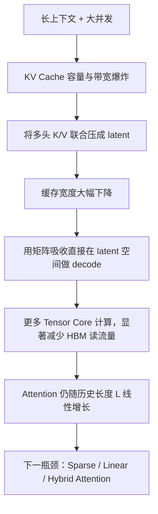
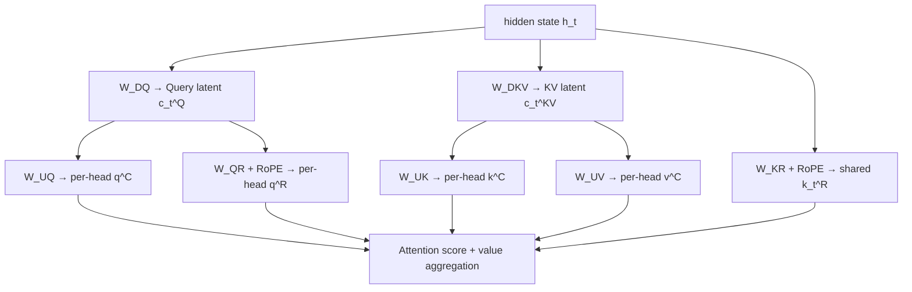
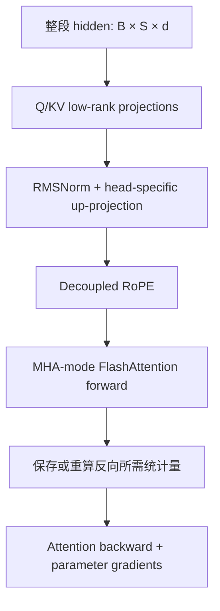
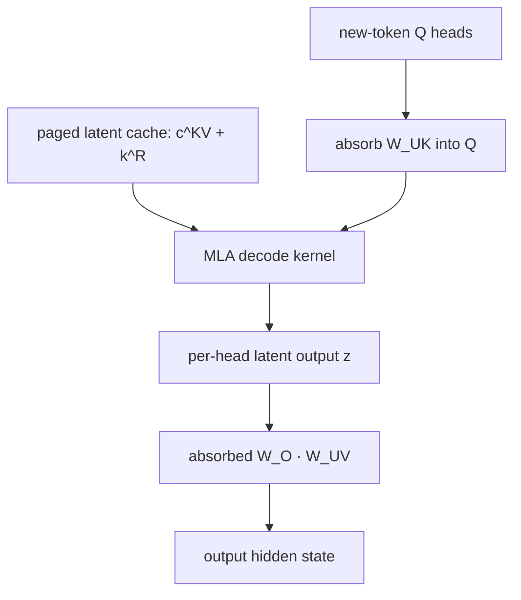
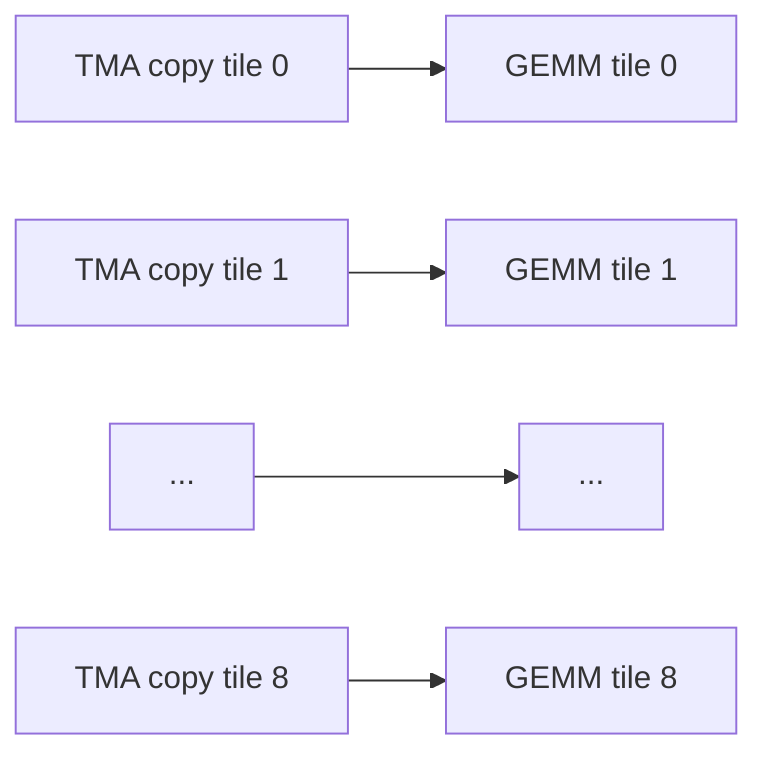
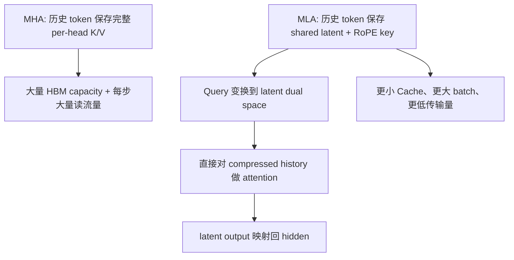

# MLA：从 KV Cache 压缩到推理内核的完整 Infra 解析

> Multi-head Latent Attention（多头潜变量注意力）专题  
> 版本：2026-09-02  
> 定位：`AI_Infra_Model_Architecture_Evolution_DeepSeek_Kimi_Qwen_GLM_2024_2026.md` 的 MLA 深入篇  
> 阅读目标：不仅知道“MLA 能压缩 KV Cache”，还要能推导其公式、画出训练与推理的数据流、算清显存与带宽，并理解为什么生产实现会区分 MHA mode 与 MQA mode。

---

## 0. 先给结论

MLA 的核心并不是“又一种减少 KV head 数量的方法”，而是把每个历史 token 原本需要保存的多头 Key/Value，联合编码成一个低维 latent：

$$
c_t^{KV}=W^{DKV}h_t
$$

推理时持久缓存：

$$
\boxed{c_t^{KV}+k_t^R}
$$

而不是：

$$
\boxed{K_t^{1:n_h}+V_t^{1:n_h}}
$$

其中，$k_t^R$ 是单独承担 Rotary Position Embedding（RoPE，旋转位置编码）的共享位置 Key。之所以必须把它拆出来，是因为位置相关的旋转矩阵会破坏后续最关键的“矩阵吸收”。

完整的 Infra 因果链是：



一句话概括：

> **MLA 用额外、规则且适合 Tensor Core 的计算，换取更少的 KV Cache 容量、更低的 HBM 流量和更大的可服务 batch。它改变的是每个历史 token 的状态宽度，没有消除历史长度 $L$。**

这也是理解它的正确入口：MLA 首先是一次 **data movement optimization（数据搬运优化）**，其次才是一种 attention 参数化形式。

---

## 1. 为什么标准 Attention 在 decode 阶段需要 KV Cache？

### 1.1 自回归生成中，哪些量会重复使用？

设第 $t$ 个 token 进入某层 Attention 后得到：

$$
q_t=W_Qh_t,\qquad k_t=W_Kh_t,\qquad v_t=W_Vh_t
$$

生成第 $t+1$ 个 token 时，需要用新 Query 与所有历史 Key 做相关性计算：

$$
s_{t+1,j}=\frac{q_{t+1}^{\mathsf T}k_j}{\sqrt{d_h}},\qquad j\le t+1
$$

再以 softmax 权重汇聚历史 Value：

$$
o_{t+1}=\sum_{j=1}^{t+1}\operatorname{softmax}(s_{t+1,:})_jv_j
$$

历史 token 的 $k_j,v_j$ 在它们被生成之后就不会变化，因此没有理由每一步都从 $h_j$ 重新投影。KV Cache 就是把这些历史 Key/Value 保留下来。

它消除了重复 projection，却引入了另一种成本：

- 容量：上下文越长、并发越高，占用 HBM 越多；
- 带宽：每个 decode step 都要再次读取整段历史 KV；
- 调度：请求长度不同，KV 页分配、回收、共享和迁移变复杂；
- 通信：做 Tensor Parallel（TP）、Context Parallel（CP）或 Prefill–Decode Disaggregation（PD 分离）时，KV 可能需要复制、分片或跨节点传输。

### 1.2 为什么 decode 经常不是“算不动”，而是“喂不饱”？

prefill 一次处理很多 Query token，矩阵通常较大：

$$
Q\in\mathbb{R}^{L\times d},\qquad K,V\in\mathbb{R}^{L\times d}
$$

同一份 K/V tile 会被多个 Query 重用，数据复用率较高。

普通单 token decode 中：

$$
Q\in\mathbb{R}^{1\times d}
$$

历史 K/V 读进来后，往往只服务一个新 Query。每读一个 byte 能完成的 FLOPs 较少，Arithmetic Intensity（算术强度，FLOPs/byte）低，因此容易受 HBM bandwidth 限制。

这解释了一个看似反直觉的现象：

> GPU 的 Tensor Core 峰值很高，但单 token decode 仍可能很慢，因为时间花在从 HBM 搬历史 KV，而不是做矩阵乘法。

---

## 2. 先把 MHA、MQA、GQA、MLA 放在同一个坐标系里

定义：

| 符号 | 含义 |
|---|---|
| $N$ | Transformer 层数 |
| $L$ | 每个请求已缓存的 token 数 |
| $n_h$ | Query head 数 |
| $n_{kv}$ | KV head 数 |
| $d_k,d_v$ | 每个 Key/Value head 的维度 |
| $d_c$ | MLA 的 KV latent rank |
| $d_r$ | MLA 中解耦 RoPE 分支维度 |
| $b$ | 每个缓存元素字节数，例如 BF16 为 2 |

忽略 page padding、scale 与元数据后，单请求 KV Cache 近似为：

### MHA

$$
M_{\mathrm{MHA}}
=bNLn_h(d_k+d_v)
$$

每个 Query head 有自己的 K/V head，表达力强，但缓存最宽。

### MQA

$$
M_{\mathrm{MQA}}
=bNL(d_k+d_v)
$$

所有 Query heads 共用一组 K/V，缓存最省，但共享程度很强。

### GQA

$$
M_{\mathrm{GQA}}
=bNLn_{kv}(d_k+d_v),\qquad 1<n_{kv}<n_h
$$

它在 MHA 与 MQA 之间折中，是今天大量 Dense LLM 的常见选择。

### MLA

$$
M_{\mathrm{MLA}}
=bNL(d_c+d_r)
$$

MLA 只缓存联合 latent 和共享 RoPE Key。它看似也只有“一份缓存”，但不能因此说它等于 MQA：

- MQA 直接让所有 Query heads 使用同一组显式 K/V；
- MLA 保存的是一个共享 latent；
- 每个 head 仍拥有不同的 $W_i^{UK}$、$W_i^{UV}$，可以从同一 latent 解码出不同的 head-specific K/V；
- 通过矩阵吸收，decode kernel 又可以把它等价重写成 MQA-shaped computation。

因此更准确的表述是：

> **MLA 在模型语义上仍保留多头解码能力，在推理执行上可以转写成“一份 latent KV 被多 Query heads 共享”的 MQA mode。**

| 机制 | 压缩的对象 | 多头差异保留在哪里 | Cache 宽度 | 主要风险 |
|---|---|---|---:|---|
| MHA | 不压缩 | 显式 K/V heads | $n_h(d_k+d_v)$ | Cache 最大 |
| MQA | KV head 数 | Query heads | $d_k+d_v$ | KV 共享过强 |
| GQA | KV head 数 | KV groups + Query heads | $n_{kv}(d_k+d_v)$ | 质量/内存折中 |
| MLA | K/V 联合 latent rank | 每头 up-projection 与 Query | $d_c+d_r$ | 结构、内核和 RoPE 更复杂 |

DeepSeek-V2 的消融中，报告作者在相近参数量的实验设置里观察到 MHA 优于 GQA/MQA，而 MLA 同时获得更小 Cache 与更好的基准结果。这里应理解为该论文实验的结果，不应外推成“MLA 在任意模型和训练预算下必然优于 MHA”。

原论文还有一个很方便的换算。DeepSeek-V2 设置：

$$
d_c=4d_h,\qquad d_r=\frac{1}{2}d_h
$$

所以 MLA 每 token、跨 $N$ 层的缓存元素数为：

$$
(d_c+d_r)N=4.5d_hN
$$

而一个 GQA group 的 K+V 为：

$$
2d_hN
$$

因此：

$$
\frac{4.5d_hN}{2d_hN}=2.25
$$

即 DeepSeek-V2 的 MLA Cache 宽度等价于约 **2.25 个 GQA KV groups**。它同时仍保留 head-specific 的解码矩阵，这正是论文强调其能力不等于只有 2.25 个显式 KV heads 的原因。

---

## 3. 从一个“天真的 Low-rank KV”开始

### 3.1 联合压缩，而不是分别缓存低秩 K 和 V

标准 MHA 先直接投影出完整 K/V：

$$
k_t=W_Kh_t,\qquad v_t=W_Vh_t
$$

MLA 改成两段式：

$$
c_t^{KV}=W^{DKV}h_t,\qquad c_t^{KV}\in\mathbb{R}^{d_c}
$$

$$
k_t^C=W^{UK}c_t^{KV},\qquad
v_t^C=W^{UV}c_t^{KV}
$$

其中：

$$
W^{DKV}\in\mathbb{R}^{d_c\times d}
$$

$$
W^{UK}\in\mathbb{R}^{(n_hd_k)\times d_c},\qquad
W^{UV}\in\mathbb{R}^{(n_hd_v)\times d_c}
$$

关键不是 $W_K$ 或 $W_V$ 各自低秩，而是 K 与 V 共享同一个 $c_t^{KV}$。每个 token 只需保存一份 latent。

这是一种端到端学习的参数化，不是模型训练完以后对 KV Cache 做一次 SVD 压缩。训练会共同学习：

- 哪些 token 信息应该进入 latent；
- 哪些维度对 Key 的匹配有用；
- 哪些维度对 Value 的内容传递有用；
- 不同 head 应该如何从共享 latent 中解码出自己的子空间。

### 3.2 Query 为什么也做低秩压缩？

完整 MLA 还可以写：

$$
c_t^Q=W^{DQ}h_t
$$

$$
q_t^C=W^{UQ}c_t^Q
$$

Query 是当前步临时量，不进入历史 Cache，因此压缩 Query **不直接减少 KV Cache**。DeepSeek-V2 报告给出的目的主要是减少训练阶段 activation memory。

这也解释了不同规模实现可以做不同选择：DeepSeek-V2 大模型使用 Query low-rank projection，而报告中的 V2-Lite 不压 Query；官方 V3 配置则包含 `q_lora_rank=1536`。

注意这里配置名中的 `q_lora_rank` 是 Attention 内部的低秩结构 rank，不等同于参数高效微调里的 LoRA adapter。二者都使用低秩分解，但角色不同：前者是基础模型架构，后者通常是冻结基座后的增量参数。

### 3.3 Latent bottleneck 为什么通常还要 Norm？

低秩瓶颈会改变激活分布和输出尺度。DeepSeek-V2/V3 的实际实现会在压缩 latent 后加 RMSNorm，并在宽度瓶颈处使用额外 scaling。官方参考实现实际缓存的是：

$$
\operatorname{RMSNorm}(c_t^{KV})
$$

而不是未经归一化的原始 latent。

这提醒我们：论文中为了表达核心思想写出的最简公式，与稳定训练所需的工程实现之间，通常还隔着 normalization、scaling、precision policy 和并行切分。

---

## 4. 完整 MLA：Content 分支与 RoPE 分支

### 4.1 一张张量形状表

以下使用 batch $B$、本次 token 数 $S$、模型维度 $d$、Query heads $n_h$：

| 张量 | 典型形状 | 是否跨历史缓存 | 含义 |
|---|---:|---|---|
| $h$ | $[B,S,d]$ | 否 | Attention 输入 |
| $c^Q$ | $[B,S,d_c']$ | 否 | Query latent |
| $q^C$ | $[B,S,n_h,d_{nope}]$ | 否 | 不带位置旋转的 Query content |
| $q^R$ | $[B,S,n_h,d_r]$ | 否 | 每头 RoPE Query |
| $c^{KV}$ | $[B,S,d_c]$ | **是** | 联合 KV latent |
| $k^C$ | $[B,S,n_h,d_{nope}]$ | naive 路径才显式展开 | 每头 content Key |
| $v^C$ | $[B,S,n_h,d_v]$ | naive 路径才显式展开 | 每头 Value |
| $k^R$ | $[B,S,1,d_r]$ | **是** | 所有 heads 共享的 RoPE Key |

DeepSeek-V3 的公开配置给出：

| 参数 | 数值 |
|---|---:|
| hidden size | 7168 |
| attention heads | 128 |
| Query latent rank | 1536 |
| KV latent rank $d_c$ | 512 |
| NoPE head dim $d_{nope}$ | 128 |
| RoPE head dim $d_r$ | 64 |
| Value head dim $d_v$ | 128 |

因此一个完整 Query head 的打分维度是：

$$
d_q=d_{nope}+d_r=192
$$

但持久缓存宽度只有：

$$
d_{cache}=d_c+d_r=512+64=576
$$

这里的 576 是**每 token、每 layer 的总宽度**，不再乘 128 个 KV heads。

### 4.2 完整前向公式

Query 路径：

$$
c_t^Q=W^{DQ}h_t
$$

$$
[q_{t,1}^C;\ldots;q_{t,n_h}^C]=W^{UQ}c_t^Q
$$

$$
[q_{t,1}^R;\ldots;q_{t,n_h}^R]
=\operatorname{RoPE}(W^{QR}c_t^Q)
$$

KV 路径：

$$
c_t^{KV}=W^{DKV}h_t
$$

$$
[k_{t,1}^C;\ldots;k_{t,n_h}^C]=W^{UK}c_t^{KV}
$$

$$
[v_{t,1}^C;\ldots;v_{t,n_h}^C]=W^{UV}c_t^{KV}
$$

$$
k_t^R=\operatorname{RoPE}(W^{KR}h_t)
$$

每个 head 的 Query 与 Key 由拼接组成：

$$
q_{t,i}=[q_{t,i}^C;q_{t,i}^R]
$$

$$
k_{j,i}=[k_{j,i}^C;k_j^R]
$$

注意 $k_j^R$ 没有 head 下标：它由所有 Query heads 共享。

Attention：

$$
p_{t,j,i}
=\operatorname{softmax}_j\left(
\frac{
(q_{t,i}^C)^{\mathsf T}k_{j,i}^C
+(q_{t,i}^R)^{\mathsf T}k_j^R
}{\sqrt{d_{nope}+d_r}}
\right)
$$

$$
o_{t,i}=\sum_{j\le t}p_{t,j,i}v_{j,i}^C
$$

$$
u_t=W^O[o_{t,1};\ldots;o_{t,n_h}]
$$

### 4.3 结构图



推理时图中真正需要跨 step 保留的只有 `c_t^KV` 与 `k_t^R`。`k^C`、`v^C` 是否显式构造，取决于当前采用 MHA mode 还是矩阵吸收后的 MQA mode。

---

## 5. 为什么 RoPE 会破坏矩阵吸收？

这是 MLA 最容易“记住结论、没有理解原因”的部分。

### 5.1 没有 RoPE 时，Key projection 可以移到 Query 一侧

对 content 分支：

$$
(q_{t,i}^C)^{\mathsf T}k_{j,i}^C
=(q_{t,i}^C)^{\mathsf T}W_i^{UK}c_j^{KV}
$$

利用矩阵乘法结合律：

$$
(q_{t,i}^C)^{\mathsf T}W_i^{UK}c_j^{KV}
=\left((W_i^{UK})^{\mathsf T}q_{t,i}^C\right)^{\mathsf T}c_j^{KV}
$$

定义 absorbed query：

$$
\widetilde q_{t,i}^C=(W_i^{UK})^{\mathsf T}q_{t,i}^C
\in\mathbb{R}^{d_c}
$$

于是无需为每个历史 token 恢复 $k_{j,i}^C$，直接算：

$$
(\widetilde q_{t,i}^C)^{\mathsf T}c_j^{KV}
$$

### 5.2 把 RoPE 粗暴放进 content Key 后发生什么？

把位置 $j$ 的旋转矩阵记为 $R_j$。若：

$$
k_j=R_jW^{UK}c_j^{KV}
$$

Query 也旋转：

$$
q_t=R_tq_t^{raw}
$$

打分变成：

$$
(q_t^{raw})^{\mathsf T}R_t^{\mathsf T}R_jW^{UK}c_j^{KV}
$$

$R_j$ 依赖历史位置 $j$，位于 Query 与 $W^{UK}$ 之间。你无法构造一个与 $j$ 无关的 absorbed query，一次变换后就和所有历史 latent 做点积。

若强行保留这种结构，只能：

- 为每个位置保存展开后的 rotated K，失去 Cache 压缩；或
- 每个 decode step 为所有历史 token 重新展开 K，计算代价不可接受。

### 5.3 Decoupled RoPE 的解决方式

MLA 把注意力 score 拆为：

$$
\underbrace{(q_{t,i}^C)^{\mathsf T}k_{j,i}^C}_{\text{content / NoPE}}
+
\underbrace{(q_{t,i}^R)^{\mathsf T}k_j^R}_{\text{position / RoPE}}
$$

content 分支不做旋转，因此可以吸收 $W^{UK}$；位置分支维度较小，直接缓存 $k_j^R$。

它本质上是在说：

> **把“内容寻址”和“相对位置寻址”放到两个子空间中；只让较小的位置子空间承担不可吸收的 position-dependent 运算。**

这并不意味着 content 与 position 完全独立，因为两部分 logits 在 softmax 前相加，共同决定最终注意力权重。

---

## 6. 矩阵吸收：为什么不用把历史 K/V 解压出来？

### 6.1 Key-side absorption

上一节已经得到：

$$
\widetilde q_{t,i}^C=(W_i^{UK})^{\mathsf T}q_{t,i}^C
$$

完整 score 可写为：

$$
s_{t,j,i}
\mathrel{=}
(\widetilde q_{t,i}^C)^{\mathsf T}c_j^{KV}
+(q_{t,i}^R)^{\mathsf T}k_j^R
$$

将二者拼接：

$$
\widetilde q_{t,i}=[\widetilde q_{t,i}^C;q_{t,i}^R]
$$

$$
\widetilde k_j=[c_j^{KV};k_j^R]
$$

则：

$$
s_{t,j,i}=\widetilde q_{t,i}^{\mathsf T}\widetilde k_j
$$

这时缓存只有一个共享的 $\widetilde k_j$，多个 Query heads 去读它，执行形态类似 MQA。

### 6.2 Value-side absorption

原本：

$$
o_{t,i}=\sum_j p_{t,j,i}W_i^{UV}c_j^{KV}
$$

因为 $W_i^{UV}$ 与历史位置无关：

$$
o_{t,i}
=W_i^{UV}\left(\sum_jp_{t,j,i}c_j^{KV}\right)
$$

先在 latent 空间聚合：

$$
z_{t,i}=\sum_jp_{t,j,i}c_j^{KV}
\in\mathbb{R}^{d_c}
$$

再恢复 head output：

$$
o_{t,i}=W_i^{UV}z_{t,i}
$$

最后的 $W_i^{UV}$ 还可以与输出投影 $W_i^O$ 合并：

$$
u_t=\sum_iW_i^OW_i^{UV}z_{t,i}
$$

于是可以预先构造：

$$
\widetilde W_i^O=W_i^OW_i^{UV}
$$

这就是论文所说的：$W^{UK}$ 可以吸收到 Query 路径，$W^{UV}$ 可以吸收到输出投影。

### 6.3 “吸收”不是删掉参数

需要区分：

- 训练时：$W^{UK}$、$W^{UV}$ 仍是模型的可学习参数；
- 推理初始化或权重加载时：可以根据它们构造等价的 absorbed weights；
- 权重更新、LoRA merge、量化布局改变后：absorbed weights 也必须同步重建或使用相应 fused path；
- 数学等价不保证浮点逐 bit 一致，运算顺序与精度会带来小的数值差异。

---

## 7. MHA mode 与 MQA mode：同一个 MLA 为什么有两套执行图？

DeepSeek-V3.2 附录和当前 FlashMLA 文档明确区分两种 MLA 计算模式。

### 7.1 MHA mode：展开 K/V 再调用高效 MHA

本次计算先从 latent 得到：

$$
k^C=W^{UK}c^{KV},\qquad v^C=W^{UV}c^{KV}
$$

再按普通多头 Attention 计算。对 DeepSeek-V3 型维度：

- `head_dim_k = 128 + 64 = 192`；
- `head_dim_v = 128`；
- heads = 128。

优点：

- head dimension 较小；
- prefill 有很多 Query，展开成本可以被摊薄；
- 能直接利用高度成熟的 FlashAttention MHA kernel；
- training/prefill 的大矩阵形态更容易得到高 Tensor Core 利用率。

缺点：若对历史 Cache 每步都展开完整 K/V，会把 MLA 的 decode 优势抵消。因此 MHA mode 更适合训练和 prefill，而不是长历史单 token decode。

### 7.2 MQA mode：在 latent 空间直接做 Attention

吸收后：

- `head_dim_k = d_c + d_r = 576`；
- `head_dim_v = d_c = 512`；
- 只有一份共享 latent KV；
- 128 个 Query heads 读取同一份历史 latent。

优点：

- 不展开所有历史 K/V；
- 历史 Cache 读流量大幅下降；
- 对长 context decode 尤其有利。

代价：

- core attention 的 K/V 维度从 192/128 变成 576/512；
- 计算 FLOPs 明显增加；
- 每个 head 的 latent output 很宽，register pressure 很大；
- 需要专门 kernel，而不是把标准 MQA kernel 原样套上去。

| 阶段 | 常见模式 | 为什么 |
|---|---|---|
| Training | MHA mode | 多 Query、大 GEMM；反向传播与现有 FA kernel 更成熟 |
| Prefill | MHA mode | 展开一次并处理整段 Query，计算利用率高 |
| Decode | MQA mode | 避免每一步展开/读取完整历史多头 K/V |
| 短序列或特殊硬件 | 动态选择 | 启动开销、shape、带宽/算力比可能改变最优点 |

这不是两种不同模型，而是同一组权重在结合律下的两种等价执行计划，类似数据库优化器为同一个查询选择不同 physical plan。

---

## 8. Training、Prefill、Decode 三条完整数据流

### 8.1 Training



训练没有跨请求生命周期的“持久 KV Cache”，但仍有 activation memory。Query/KV low-rank bottleneck、FlashAttention 的不落地 attention matrix、activation checkpointing/recomputation 是三种不同层面的节省：

- low-rank：减少特定投影路径的中间激活宽度；
- FlashAttention：不把完整 $S\times S$ attention matrix 写入 HBM；
- recomputation：反向时重做部分前向，少保存 activation。

不能把这三者都笼统称为“KV Cache 优化”。

### 8.2 Prefill

prefill 接收一段 prompt，一次产生很多 Query/KV token：

1. 计算 $c^{KV}$ 与 $k^R$；
2. 将 $c^{KV}+k^R$ 写入分页 latent cache，供未来 decode；
3. 在本次 prefill 内临时展开 $k^C,v^C$；
4. 以 MHA mode 调用 FlashAttention；
5. 临时展开量在该层计算完成后即可释放。

核心点是：

> **使用 MHA mode 做 prefill，不等于把完整 MHA K/V 永久写入 Cache。持久状态仍可以是 compressed latent。**

### 8.3 Decode

每个 decode step：

1. 新 token 生成 $c_t^{KV}$ 与 $k_t^R$，追加到 cache；
2. 生成每个 head 的 $q_{t,i}^C,q_{t,i}^R$；
3. 对 $q^C$ 做 Key-side absorption，得到 $\widetilde q^C$；
4. 读取历史 $[c_j^{KV};k_j^R]$；
5. 用 online softmax 分块计算 score；
6. 在 latent Value 空间累计 $z_{t,i}$；
7. 通过 absorbed output projection 返回 hidden state。



---

## 9. KV Cache 账本：MLA 到底省了多少？

### 9.1 通用公式

对一批不同长度的请求 $L_1,\ldots,L_B$：

$$
M_{\mathrm{MLA}}
=bN(d_c+d_r)\sum_{r=1}^{B}L_r
$$

真实系统还要加：

$$
M_{real}=M_{payload}+M_{page\ padding}+M_{scales}+M_{metadata}+M_{workspace}
$$

其中：

- `page padding`：每个请求最后一页未填满的空间；
- `scales`：FP8/INT8 KV quantization 的 scale；
- `metadata`：block table、sequence length、slot mapping 等；
- `workspace`：split-KV partial outputs、LSE、scheduler metadata 等临时区。

### 9.2 DeepSeek-V3 维度的 BF16 示例

使用：

$$
N=61,\quad d_c=512,\quad d_r=64,\quad b=2
$$

每 token、每 layer：

$$
(512+64)\times2=1152\ \text{bytes}
$$

每 token、跨 61 层：

$$
1152\times61=70{,}272\ \text{bytes}
\approx68.625\ \text{KiB}
$$

单个 128K-token 请求：

$$
70{,}272\times131{,}072
\approx8.58\ \text{GiB}
$$

这仍然不是一个“小数字”，但比完整多头 Cache 小得多。

为了说明口径差异，可以使用两种 MHA baseline：

| 口径 | 每 token 每层元素数 | 128K × 61 层 BF16 |
|---|---:|---:|
| MLA | $512+64=576$ | 8.58 GiB |
| 论文传统 MHA 口径：$2n_hd_h$，$d_h=128$ | 32,768 | 488 GiB |
| 与 MLA QK/V 形状完全对齐：$n_h(192+128)$ | 40,960 | 610 GiB |

相应理论宽度比约为：

$$
\frac{32768}{576}\approx56.9\times
$$

或在形状对齐口径下：

$$
\frac{40960}{576}\approx71.1\times
$$

为什么 DeepSeek-V2 摘要写的是 “KV Cache 减少 93.3%”，而这里理论宽度能减少 98% 以上？因为二者不是同一个比较口径：前者是论文针对具体模型/基线的系统级报告数字，后者是固定本专题假设后的纯 payload 维度比。严谨分析必须同时写清 baseline、层数、head 维度、精度和是否包含系统开销。

### 9.3 平均 5K context 的量级

若单请求平均缓存约 5,000 tokens，则仅 MLA BF16 payload：

$$
68.625\ \text{KiB/token}\times5000
\approx335\ \text{MiB/request}
$$

这直接决定单卡能维持多少 decode sequences。MLA 节省出的 HBM 不只是“能放更长的单请求”，更常被用来增加并发 batch，从而把权重读取和 MoE expert GEMM 摊到更多 token 上。

### 9.4 FP8 latent cache

FlashMLA 当前文档给出一种每 token 656 bytes 的 FP8 Cache layout：

| 区域 | 大小 | 内容 |
|---|---:|---|
| NoPE latent | 512 B | 512 个 FP8 E4M3 值 |
| scales | 16 B | 每 128 维一个 FP32 scale，共 4 个 |
| RoPE | 128 B | 64 个 BF16 值，不量化 |
| 合计 | 656 B | 每 token 每 layer |

相比全 BF16 的 1152 B：

$$
1-\frac{656}{1152}\approx43.1\%
$$

额外 payload reduction。

保留 RoPE 分支为 BF16 是一个很典型的 selective precision policy：容量大头的 512 维 content latent 使用 FP8，而只有 64 维、对位置打分敏感的部分保持 BF16。

### 9.5 各维度不是随便设的：一张设计旋钮表

| 设计量 | 增大后可能获得什么 | 增大后付出什么 | 主要影响阶段 |
|---|---|---|---|
| $d_c$：KV latent rank | 更强的联合 K/V 表达容量 | Cache、PD 传输、MQA-mode QK/PV FLOPs、register 压力都增加 | 全部，尤其 decode |
| $d_r$：RoPE dim | 更大的相对位置信号子空间 | 不可吸收 Cache 增大；QK FLOPs 增加 | 长上下文 |
| $d_c'$：Query rank | Query projection 容量 | 参数、projection FLOPs 与训练 activation 增加 | training/prefill |
| $d_{nope}$ | 每个 head 的 content matching 容量 | MHA-mode QK FLOPs、$W^{UK}$ 参数增加 | training/prefill |
| $d_v$ | 每个 head 的 value/output 容量 | MHA-mode PV、$W^{UV}$ 与 $W^O$ 成本增加 | 全部 |
| $n_h$ | 更多 attention subspaces；MQA mode 复用 latent 的次数增加 | Query/output 参数与 core attention FLOPs 增加 | 全部 |

这些维度还会受 kernel tile 约束。64、128、512、576 之类的数字不仅是模型表达力选择，也与 Tensor Core tile、TMA copy 粒度、vectorized load、register layout 和并行切分有关。

因此 MLA 的 rank 搜索不能只看 validation loss，也不能只看理论 Cache：

$$
\text{目标函数}
\mathrel{=}
\text{quality}
+\lambda_1\text{HBM bytes}
+\lambda_2\text{decode latency}
+\lambda_3\text{prefill FLOPs}
+\lambda_4\text{kernel realizability}
$$

最后一项非常重要：一个纸面上更小的奇怪 rank，如果导致 Tensor Core padding、大量尾块或没有成熟 kernel，端到端可能反而更差。

---

## 10. Paged Latent Cache：MLA 如何进入 vLLM / SGLang 一类运行时？

PagedAttention 的核心思想与 Attention 类型无关：把逻辑连续的序列 Cache 映射到不要求物理连续的固定大小 pages/blocks。

标准 GQA page 里的 token record 可能是：

$$
[K^{1:n_{kv}},V^{1:n_{kv}}]
$$

MLA page 里的 token record 变为：

$$
[c^{KV},k^R]
$$

运行时仍需要：

- block table：逻辑 block 到物理 page 的映射；
- slot mapping：新 token 写入哪个物理位置；
- cache sequence lengths：每个请求有效历史长度；
- prefix-cache 引用计数：多个请求共享前缀页；
- eviction / offload / transfer policy。

变化最大的是每个 token record 的宽度显著缩小，因此：

- 同样 HBM 能容纳更多 pages；
- Prefix Cache 能保留更多热门前缀；
- PD 分离时需要传输的 Cache payload 更小；
- CPU/NVMe offload 的读写字节数下降；
- 但 page table、长度数组等元数据占比相对上升。

FlashMLA 的 decode 接口接收 `block_table`、`cache_seqlens` 与 tile scheduler metadata，说明生产 kernel 不是面对一个规整的 $[B,L,D]$ 张量，而是在处理 continuous batching 下不同长度、分页存储的 ragged KV。

---

## 11. Roofline 视角：MLA 为什么是“以算换存”而不只是“少算”？

### 11.1 MQA-mode MLA 的近似算术强度

设：

- $h_q$：本 GPU 上 Query heads 数；
- $s_q$：每个请求本步 Query token 数，普通 decode 为 1，MTP/speculative decode 可大于 1；
- $s_k$：历史 KV token 数；
- $d_k=576$；
- $d_v=512$。

core attention 的主要 FLOPs 近似：

$$
F\approx2h_qs_qs_k(d_k+d_v)
$$

当 $s_k\gg h_qs_q$ 时，主要 HBM 读取近似为：

$$
Bytes\approx2s_kd_k
$$

这里假设 BF16 为 2 bytes。于是：

$$
AI=\frac{F}{Bytes}
\approx h_qs_q\frac{d_k+d_v}{d_k}
$$

带入 576/512：

$$
AI\approx1.89h_qs_q\ \text{FLOPs/byte}
$$

若单卡保留 128 个 Query heads，普通 decode 的 $s_q=1$：

$$
AI\approx242\ \text{FLOPs/byte}
$$

这已经远高于传统单 Query、每头各读一份 KV 的低复用 decode。FlashMLA 团队用近似 $d_k\approx d_v$ 得到约 $2h_qs_q$，并指出其 H800 部署在 $h_qs_q\approx128$ 时接近或进入 compute-bound 区间。

### 11.2 为什么“Cache 更小”反而可能让 kernel 计算更重？

因为 MQA mode 不展开 head-specific K/V，而让每个 Query head 直接与 576 维 latent key 做打分、在 512 维 latent value 上累加：

$$
\text{少读很多 byte}
\quad\Longleftrightarrow\quad
\text{对共享 byte 做更多 head-wise compute}
$$

这正是现代 GPU 喜欢的交换：

- HBM bandwidth 增长慢于 Tensor Core FLOPs；
- 规则 GEMM/FMA 比跨 HBM 搬大体积 KV 更容易扩展；
- 共享 latent 被大量 Query heads 重用，提高数据复用。

但“计算相对便宜”不是无条件真理。最优模式会受这些因素影响：

- GPU 的 ridge point；
- 本地 Query head 数；
- $s_q$ 是否因 MTP 增大；
- 序列长度与 batch；
- KV 精度；
- Tensor Parallel 切分；
- kernel 对目标架构是否充分优化。

因此生产系统需要 backend selection，而不是看到 MLA 就固定使用同一条 kernel 路径。

---

## 12. FlashMLA：算法变成高性能 kernel 时发生了什么？

### 12.1 它与 FlashAttention 的关系

两者共同使用的核心思想是：

- 分块读取 Q/K/V；
- 不把完整 attention score matrix 写回 HBM；
- 使用 online softmax，在扫描 KV blocks 时维护 running max、normalizer 与 output accumulator；
- 尽量在 registers/shared memory 中完成中间计算。

但 MLA decode 的形状很特殊：

- Query heads 多；
- 共享 KV head 少；
- K 维 576、V 维 512；
- Query length 通常为 1 或一个很小的 speculative group；
- 请求长度 ragged；
- output accumulator 很宽，register pressure 高。

所以 FlashAttention 的通用 schedule 不能直接照搬。

### 12.2 为什么一个 $64\times512$ output tile 会带来 register 压力？

FlashMLA 的 deep-dive 以一个 $64\times512$ output matrix 为例：若 accumulator 使用 32-bit registers：

$$
64\times512=32{,}768
$$

个 32-bit registers。Hopper 每个 SM 的寄存器资源有限，单个 output tile 已经占据巨大空间，难以像 FlashAttention-3 的传统 ping-pong 那样同时保留两份完整 output accumulator。

### 12.3 Seesaw scheduling

FlashMLA 将 512 宽的 output 分成左右两半：

$$
O=[O_L,O_R]
$$

两个 warpgroups 交错处理相邻 KV blocks 的：

- $QK^{\mathsf T}$ Tensor Core 运算；
- max / exp / rescale 等 CUDA Core 运算；
- $PV$ Tensor Core 运算；
- 下一批数据的 TMA 搬运。

因为不再需要两份完整 output matrix，团队把这种单 output、两侧交替的 schedule 称为 seesaw（跷跷板）调度。

需要认识的硬件术语：

| 术语 | 含义 |
|---|---|
| Warpgroup | Hopper 上协同执行 WGMMA 的一组 warps，通常为 128 threads |
| WGMMA | Warpgroup-level Matrix Multiply-Accumulate，Hopper Tensor Core 矩阵指令 |
| TMA | Tensor Memory Accelerator，异步搬运多维 tensor tile 的硬件单元 |
| Registers | 每线程最快的片上存储；容量有限，过度使用会降低 occupancy |
| L2 cache hint | 给数据缓存/驱逐策略的提示，减少不必要的 cache 污染 |

### 12.4 细粒度 TMA–GEMM pipeline

对于 $64\times576$ 的 K block，FlashMLA 文档描述为 9 次 $64\times64$ TMA copy。第一小块到达后就启动对应 GEMM，不等待完整 576 维全部搬完：



本质是把“加载 576 维，再计算”改成细粒度生产者–消费者流水，降低 memory latency 暴露。

### 12.5 Split-KV 与 tile scheduler

长序列 decode 若只给一个 thread block 扫完整个 $s_k$，并行度不足。常见做法是把 KV sequence 切成多个 splits：

1. 多个 blocks 分别计算局部 max、LSE 与 partial output；
2. combine kernel 按 online-softmax 规则合并；
3. tile scheduler 根据不同请求长度，把 jobs 分给 SM，降低长短请求造成的尾部不均衡。

FlashMLA 还使用 Programmatic Dependent Launch 去重叠 split-KV 与 combine 的启动/执行。它优化的不只是 GEMM，而是：

$$
\text{ragged requests}
+\text{KV splitting}
+\text{SM load balance}
+\text{kernel launch dependency}
$$

### 12.6 如何看待性能数字

FlashMLA 官方仓库报告过 H800 SXM5 特定软件版本和 shape 下：

- memory-bound 配置最高约 3000 GB/s；
- compute-bound 配置最高约 660 TFLOPS；
- deep-dive 报告约 80% 的受降频后 Tensor Core 峰值利用率。

这些是 kernel benchmark，不等于端到端 serving 提升，也不能直接迁移到任意 GPU、batch、长度分布或量化设置。端到端还包括 projection、MoE、通信、调度、采样和框架开销。

---

## 13. 并行策略：为什么 MLA 与 TP 的关系很微妙？

### 13.1 Head-parallel TP 会改变算术强度

假设 128 Query heads 做 TP=8，则每 rank 只有：

$$
h_q^{local}=16
$$

若共享 latent cache 在各 TP ranks 上复制，则每个 rank 都要读同一份历史 cache，但只用 16 个 heads 复用它：

$$
AI\propto h_q^{local}s_q
$$

算术强度约下降 8 倍，更容易重新变成 memory-bound。

同时，单份 latent KV 不像 128 个独立 KV heads 那样容易沿 head 维均匀切分。常规 head-parallel TP 往往会复制 latent KV，除非引入 sequence/context sharding 或专门的数据布局。

所以 MLA 的“小 Cache”并不自动意味着“TP 越大越好”。

### 13.2 为什么 DeepSeek decode 的 MLA 使用 DP 而不是 TP？

DeepSeek 公开的 V3/R1 在线推理概览中：

- prefill：Routed Expert EP32，MLA/Shared Expert DP32；
- decode：Routed Expert EP144，MLA/Shared Expert DP144。

也就是说 MoE experts 跨卡切分，而 Attention 在不同 DP ranks 上复制、各自处理不同请求。对 MLA decode，这带来两个好处：

- 每张卡保留完整 128 Query heads，提高共享 latent 的复用与算术强度；
- 避免每层 Attention 的 TP collectives。

代价是每张 Attention rank 都要放完整 MLA 参数，并独立承担自己请求的 KV Cache。系统借助大规模 Expert Parallel（EP）解决 MoE 参数与计算分布，再通过调度在 DP instances 间平衡 KV 占用和请求数。

### 13.3 Context Parallel 能否切 latent Cache？

可以沿 sequence 维把历史 latent 分到多个设备，但每步需要：

1. 各 rank 计算局部 attention max/LSE/output；
2. 跨 rank 合并全局 softmax 统计；
3. 处理负载不均、网络延迟与 page ownership。

MLA 减小了 Cache payload，也会减少 cache migration/offload 流量；但 exact dense attention 仍需要扫描所有 shard。是否使用 CP 取决于单请求长度是否已经超出单卡容量，以及互联带宽/延迟能否接受。

---

## 14. MLA 与 Prefill–Decode Disaggregation

PD 分离把两种硬件画像不同的阶段放到不同 workers：

| 阶段 | 特征 | 更关心什么 |
|---|---|---|
| Prefill | 多 Query、大 GEMM、计算密集 | TTFT、compute throughput |
| Decode | 少 Query、反复读历史、请求持续存在 | TPOT、HBM capacity/bandwidth |

MLA 同时改善两者之间的“交接”：prefill 完成后，需要将新生成的 KV state 交给 decode worker。传输 compressed latent 而不是完整多头 K/V，可以降低：

$$
T_{transfer}\approx\frac{KV\ bytes}{Network\ bandwidth}+latency
$$

中的 payload 项。

但 MLA 不会消除：

- request routing；
- cache location tracking；
- 网络拥塞；
- prefix-cache 命中一致性；
- decode worker 的 HBM 容量上限。

所以它是 PD 系统的重要 enabler，而不是完整解决方案。

---

## 15. 一个接近官方实现的简化伪代码

下面刻意保留 tensor shape 和两种执行路径，省略 bias、mask broadcasting、并行 Linear、量化和 fused kernel：

```python
def mla_forward(x, cache, mode):
    # x: [B, S, d]

    # Query low-rank path
    cq = rms_norm(x @ W_DQ.T)                         # [B, S, q_rank]
    q = cq @ W_UQ_ALL.T                              # [B, S, H*(d_nope+d_rope)]
    q = q.view(B, S, H, d_nope + d_rope)
    q_nope, q_rope = split(q, [d_nope, d_rope])
    q_rope = apply_rope(q_rope, positions)            # [B, S, H, d_rope]

    # Joint KV compression + shared positional key
    kv_and_pe = x @ W_DKV_AND_KR.T                    # [B, S, d_latent+d_rope]
    c_kv, k_rope = split(kv_and_pe, [d_latent, d_rope])
    c_kv = rms_norm(c_kv)                             # [B, S, d_latent]
    k_rope = apply_rope(k_rope[:, :, None, :], positions)

    # Persistent cache always stores compressed states
    cache.append(c_kv, k_rope)

    if mode == "mha":
        # Training / prefill physical plan
        kv_full = c_kv @ W_UKV_ALL.T
        kv_full = kv_full.view(B, S, H, d_nope + d_value)
        k_nope, value = split(kv_full, [d_nope, d_value])
        key = concat(k_nope, expand_heads(k_rope))
        query = concat(q_nope, q_rope)
        out = flash_attention(query, key, value)

    elif mode == "mqa":
        # Decode physical plan
        # Per head: W_UK_i.T maps d_nope -> d_latent
        q_abs = einsum("bshd,hdc->bshc", q_nope, W_UK)
        scores = (
            einsum("bshc,btc->bsht", q_abs, cache.c_kv)
            + einsum("bshr,btr->bsht", q_rope, cache.k_rope)
        ) * softmax_scale
        probs = softmax(scores, dim=-1)
        z = einsum("bsht,btc->bshc", probs, cache.c_kv)
        out = einsum("bshc,hdc->bshd", z, W_UV)

    return out.flatten_heads() @ W_O.T
```

真实高性能 decode 会把 score、online softmax、latent value accumulation、split-KV 和部分输出变换融合，避免像伪代码那样产生巨大中间张量。

---

## 16. 训练侧需要注意什么？

### 16.1 参数量不等于 Cache 量

MLA 可能增加或重排 projection 参数，但 KV Cache 由每 token 需要保存的动态状态决定。不要用“Attention 参数更多/更少”直接推断 Cache。

静态权重：

$$
W^{DKV},W^{UK},W^{UV},W^{DQ},W^{UQ},W^{QR},W^{KR},W^O
$$

动态 Cache：

$$
c_t^{KV},k_t^R
$$

两者是不同账本。

### 16.2 Query compression 主要影响 activation 与 projection

Query 不跨 step 缓存，降低 Query rank 不会改变 KV Cache 公式，却可能：

- 降低训练中间激活宽度；
- 改变 Q projection FLOPs/参数；
- 形成额外 bottleneck，需要 Norm/scale 保持稳定；
- 影响 Tensor Parallel 的列切/行切方式。

### 16.3 低精度策略要区分权重、激活、Cache、core attention

一个系统可能同时存在：

- FP8 projection GEMM；
- BF16 core MLA；
- FP8 latent Cache；
- FP32 online-softmax accumulators/LSE；
- BF16 RoPE cache。

因此“模型是 FP8”远远不够描述真实 precision path。DeepSeek 的公开在线系统说明中，projection/dispatch 使用 FP8，而 core MLA 与 combine 使用 BF16；FlashMLA 的 FP8 cache path也是读 FP8、反量化到 BF16 后做 attention。

### 16.4 Activation recomputation 仍然重要

MLA 没有让训练 Attention 变成 $O(S)$。dense training/prefill 的 score interactions 仍是：

$$
O(S^2)
$$

FlashAttention 解决的是 IO 与中间矩阵落盘，activation checkpointing 解决保存哪些层输出，而 MLA 的核心收益主要落在推理 Cache。三者可以叠加，但不能互相替代。

---

## 17. MLA 的收益边界与新瓶颈

### 17.1 它解决了什么？

| 问题 | MLA 的作用 |
|---|---|
| KV Cache HBM 容量 | 将每 token 多头 K/V 压成固定 latent + 小 RoPE key |
| decode HBM 流量 | 每步读取更窄的历史状态 |
| 可服务 batch | 同样 HBM 容纳更多请求，通常有利于吞吐 |
| PD Cache transfer | 降低 prefill→decode 的状态传输 payload |
| Prefix Cache capacity | 相同空间能保留更多前缀 token |
| 多头质量损失 | 用 head-specific 解码矩阵保留比直接共享 KV 更丰富的表达 |

### 17.2 它没有解决什么？

| 问题 | 原因 |
|---|---|
| prefill 的 $O(L^2)$ interactions | dense Attention 仍计算 Query 与历史 token 的全连接 |
| decode 的 $O(L)$ 扫描 | 每生成一个 token 仍需扫描全部历史 latent |
| 单请求无限长 | Cache 仍按 $O(L)$ 增长，只是常数更小 |
| exact retrieval 的计算量 | 仍需对所有历史位置打分，除非叠加 Sparse Attention |
| MoE All-to-All | Attention Cache 与 expert dispatch 是两条独立瓶颈 |
| kernel 通用性 | 特殊维度、RoPE 拆分、吸收和 ragged pages 需要专门 backend |

### 17.3 瓶颈如何迁移？

MLA 之前：

$$
\boxed{KV\ capacity+HBM\ bandwidth}
$$

MLA 之后，缓存宽度下降，但：

$$
\boxed{history\ length\ L}
$$

仍存在；MQA-mode core attention 甚至可能转向 compute-bound。于是下一代结构继续处理：

- Sparse Attention：只与 Top-K 历史 token 精确交互；
- Linear/Recurrent Attention：把历史压入固定大小 state；
- Hybrid Attention：用 recurrent state 承担长期摘要，用 sparse/full attention 做精确召回；
- KV quantization/offload：继续降低每 token byte 或把冷 Cache 放到更低层存储。

所以正确的演化关系是：

$$
\text{MHA}
\rightarrow
\text{MLA: reduce bytes/token}
\rightarrow
\text{Sparse/Linear: reduce tokens scanned}
$$

---

## 18. MLA 与相邻技术的区别

| 技术 | 主要压缩哪一维 | 是否保留所有历史 token | 是否改变 attention interaction 数 | 主要收益 |
|---|---|---|---|---|
| GQA/MQA | KV head 数 | 是 | 否 | 更小 KV Cache |
| MLA | 每 token KV 表示宽度 | 是 | 否 | 更小 Cache/带宽，较强多头表达 |
| KV quantization | 每元素 bit 数 | 是 | 否 | 容量与带宽继续下降 |
| Sliding Window | 可见历史范围 | 否 | 是 | 固定局部窗口成本 |
| Sparse Attention | 被选中的历史位置数 | 通常 Cache 仍保留 | 是 | 从 $L$ 降到 $K$ 次精确交互 |
| Linear Attention | 历史表示方式 | 通常不保留全部显式 KV | 是 | sequence state 近似 $O(1)$ |
| PagedAttention | 物理内存分配方式 | 是 | 否 | 降低碎片、支持动态 batching |
| Prefix Caching | 跨请求重复前缀 | 是，共享 pages | 否 | 避免重复 prefill 与重复存储 |

最容易混淆的两组概念：

1. **MLA vs PagedAttention**：前者改变每个 token 存什么，后者改变这些 token records 如何分配物理内存；
2. **MLA vs Sparse Attention**：前者缩窄每个历史 token，后者减少每个 Query 实际访问多少历史 token。

它们是正交、可组合的。

---

## 19. 常见误区

### 误区 1：MLA 就是对 KV Cache 做压缩算法

不准确。它是模型训练时就确定的 attention parameterization；latent 是端到端学习出来的。推理后处理压缩属于另一类技术。

### 误区 2：decode 时要把所有历史 latent 还原成 K/V

naive 路径会这么做，但矩阵吸收正是为了避免它。生产 decode 通常在 latent 空间执行 MQA mode。

### 误区 3：MLA 把 Attention 复杂度从 $O(L^2)$ 变成 $O(L)$

错误。dense prefill 仍是 $O(L^2)$；单 token decode 本来就是 $O(L)$，MLA 主要降低其中的状态宽度和字节常数。

### 误区 4：Cache 只剩 512 维

不完整。DeepSeek-V2/V3 型 MLA 还要缓存 64 维 decoupled RoPE key，因此 BF16 dense MLA 常见逻辑宽度是 576。

### 误区 5：MLA 与 MQA 完全相同

模型表达结构不同；只是矩阵吸收后的 decode physical plan 呈现 MQA shape。

### 误区 6：Query low-rank 能减少 decode KV Cache

不能。Query 不作为历史 KV 保存。它主要影响参数、projection 和训练 activation。

### 误区 7：KV Cache 减少 50×，吞吐就一定增加 50×

端到端速度还受权重读取、MoE、网络、sampling、batch、scheduler、kernel efficiency 和 TTFT/TPOT 目标约束。容量比、带宽比和吞吐比不能互换。

### 误区 8：TP 可以天然把 MLA Cache 均匀切开

常规 head-parallel TP 会切 Query heads，但共享 latent stream 可能复制。要切 Cache 往往需要 sequence/context parallel 或专门布局。

---

## 20. Profiling：如何判断 MLA 真的帮到了你的服务？

### 20.1 先分阶段

不要只看总 tokens/s。至少分开：

- TTFT（Time To First Token）：主要受排队与 prefill 影响；
- TPOT（Time Per Output Token）：主要受 decode 影响；
- prefill tokens/s；
- decode tokens/s；
- average/max cache length；
- active sequences / batch size。

### 20.2 Cache 账本

记录：

- 每 token 每 layer 的实际 bytes；
- page size 与最后一页碎片；
- Cache dtype 与 scale overhead；
- prefix cache hit rate；
- GPU/CPU/offload 各层的 cache occupancy；
- OOM 前最大并发，而不只是最大单序列长度。

### 20.3 Kernel 账本

用 profiler 观察：

- HBM throughput 是否接近硬件可达上限；
- Tensor Core utilization；
- achieved occupancy 与 register usage；
- split-KV 数量；
- combine kernel 占比；
- kernel launch gaps；
- ragged request 尾部是否导致 SM 空闲；
- prefill 是否误走 decode backend，反之亦然。

### 20.4 系统账本

还要检查：

- TP 后本地 Query heads 是否过少；
- DP instances 之间 cache/request 是否失衡；
- PD transfer 是否真的因 latent cache 缩小；
- MoE All-to-All 是否已经成为主瓶颈；
- batch 增大后 expert token 数是否改善 Grouped GEMM；
- MTP 使 $s_q$ 增大后，MLA kernel 是否从带宽瓶颈跨到计算瓶颈。

一个可靠的结论应该长这样：

> 在固定模型、请求长度分布、精度和 SLO 下，MLA backend 将每请求 Cache 从 X 降至 Y，使稳定 active sequences 从 A 增至 B；decode TPOT 从 C 降至 D。Nsight 指标显示瓶颈由 HBM throughput 转向 Tensor Core/其他模块。

而不是只说：

> MLA 理论 Cache 小，所以一定更快。

---

## 21. 实现与排障清单

### 正确性

- [ ] NoPE 与 RoPE 维度切分顺序一致；
- [ ] $k^R$ 在 heads 间共享，broadcast 方向正确；
- [ ] RoPE position offset 与 paged slot 一致；
- [ ] absorbed 与 naive 路径输出在合理容差内一致；
- [ ] softmax scale 使用完整 QK 打分维度并考虑长上下文 scaling；
- [ ] causal mask、chunked prefill、prefix sharing 边界正确；
- [ ] FP8 scale 分组、存储布局和 dequant 一致。

### 性能

- [ ] prefill/decode 分别选择适合的 physical plan；
- [ ] 没有在 decode 中显式重建全部历史 K/V；
- [ ] 没有落地 $B\times H\times Q\times L$ score matrix；
- [ ] Cache 是 paged/ragged-aware，而不是为最大长度预分配大矩形；
- [ ] split-KV 不过少也不过多；
- [ ] TP 没有把本地 Query heads 切得过碎；
- [ ] absorbed weights 在量化/权重更新后正确刷新；
- [ ] profiler 中不存在 projection 与 core attention 之间的大 launch gap。

### 容量

- [ ] payload 计算包含所有 layers；
- [ ] 计算包含 RoPE cache，不只算 latent rank；
- [ ] 计算包含 quant scales、page padding、metadata 与 workspace；
- [ ] 区分模型 weights、CUDA graph pools、activations 与 KV Cache；
- [ ] 以真实请求长度分布评估，而不只用 max context。

---

## 22. FAQ

### Q1：为什么 latent rank 512 比单头 128 还大，仍叫“压缩”？

因为 baseline 是所有 heads 的 K/V 总宽度，不是单头。128 heads 的显式 K/V 是数万维，而 512+64 是每 token 全部 heads 共用的缓存宽度。

### Q2：共享一个 latent 会不会像 MQA 一样损失多头能力？

共享 latent 是一个信息瓶颈，确实可能有容量风险；但每个 head 通过不同 $W_i^{UK},W_i^{UV}$ 解码，表达力强于直接共享一组显式 K/V。最终质量取决于 rank、训练预算和模型整体设计。

### Q3：为什么 Value 也能用同一个 latent？

因为 $W^{UV}$ 可以从联合 latent 中学习恢复 Value 所需特征。联合 bottleneck 迫使 Key 匹配信息与 Value 内容信息共享基础表征，但之后仍走不同 up-projection。

### Q4：为什么不把 RoPE key 也压进 latent？

位置相关旋转会阻断 Key-side matrix absorption。把小 RoPE 分支单独缓存，用少量额外 bytes 保住可吸收性，是整体更优的折中。

### Q5：MLA 对短上下文也一定更快吗？

不一定。短序列时 Cache 流量不是主导，专用 kernel 启动、宽 latent compute 和 projection overhead 可能抵消收益，所以 runtime 需要按阶段、硬件和 shape 选择 backend。

### Q6：为什么 FlashMLA decode 能是 compute-bound？decode 不都 memory-bound 吗？

因为共享的 576 维 latent K/V 会被大量 Query heads 重用。每读一份 Cache byte，执行约 $h_q$ 份 head-wise 计算，算术强度随本地 head 数增长。

### Q7：MLA 能和 Sparse Attention 组合吗？

能。MLA 缩小每个历史 token 的 KV record，Sparse Attention 减少每个 Query 实际访问的历史 token 数。DeepSeek-V3.2 的 DSA 正是在 MLA 上继续做 token-level sparse selection。

### Q8：为什么现实引擎有很多 MLA backends？

因为 prefill/decode、Dense/Sparse、BF16/FP8、Hopper/Blackwell/ROCm、page size、head dims、DCP 支持各不相同。算法名字相同，不代表最佳 kernel schedule 相同。

---

## 23. 最终心智模型

可以把标准 MHA 理解为：每个历史 token 在 HBM 中保存一大排“已经解码好的多头档案”。

MLA 改成：每个历史 token 只保存一份“压缩档案”和一个小的位置索引。当前 Query 到来后，不是把所有历史档案全部解压，而是把自己的查询算子换一个基底，直接在压缩档案上检索；检索得到的 latent 结果再通过吸收后的输出矩阵回到 hidden space。



最值得记住的四句话：

1. **MLA 压的是每个 token 的 KV 表示宽度，不是 sequence length。**
2. **Decoupled RoPE 的核心目的，是保住矩阵吸收。**
3. **MHA mode 与 MQA mode 是同一 MLA 的两种物理执行计划：前者适合训练/prefill，后者适合 decode。**
4. **MLA 把瓶颈从 HBM data movement 推向 Tensor Core compute、kernel scheduling，以及最终仍未消失的历史长度 $L$。**

---

## 24. 参考资料与阅读顺序

### 第一层：先读模型结构

1. [DeepSeek-V2 Technical Report](https://arxiv.org/abs/2405.04434)  
   重点：§2.1、Appendix C、Appendix D。MLA 的原始完整公式、Decoupled RoPE、Cache 对比与消融。

2. [DeepSeek-V3 Technical Report](https://arxiv.org/abs/2412.19437)  
   重点：V3 延续 MLA；模型配置、latent 后 RMSNorm/scale 与整体训练/系统背景。

3. [DeepSeek-V3 官方参考推理实现：`inference/model.py`](https://github.com/deepseek-ai/DeepSeek-V3/blob/main/inference/model.py)  
   重点：`attn_impl = "naive" / "absorb"` 两条路径、实际 cache tensor、Query/NoPE/RoPE 切分。

4. [DeepSeek-V3-Base `config.json`](https://huggingface.co/deepseek-ai/DeepSeek-V3-Base/blob/main/config.json)  
   重点：`kv_lora_rank=512`、`q_lora_rank=1536`、`qk_nope_head_dim=128`、`qk_rope_head_dim=64`、`v_head_dim=128`。

### 第二层：再读 kernel

5. [FlashMLA 官方仓库](https://github.com/deepseek-ai/FlashMLA)  
   重点：dense/sparse、prefill/decode 支持矩阵、MHA/MQA mode、paged cache 接口与 FP8 Cache layout。

6. [A Deep-Dive Into the New Flash MLA Kernel](https://github.com/deepseek-ai/FlashMLA/blob/main/docs/20250422-new-kernel-deep-dive.md)  
   重点：Roofline、seesaw scheduling、TMA–GEMM pipeline、split-KV 与 tile scheduler。

7. [DeepSeek-V3.2 Technical Report](https://arxiv.org/abs/2512.02556)  
   重点：Appendix A 的 MLA MHA/MQA modes；Sparse MLA 留到 `Sparse-Attention.md` 展开。

### 第三层：最后读 serving/runtime

8. [DeepSeek-V3/R1 Inference System Overview](https://github.com/deepseek-ai/open-infra-index/blob/main/202502OpenSourceWeek/day_6_one_more_thing_deepseekV3R1_inference_system_overview.md)  
   重点：PD 分离、MLA DP + routed-expert EP、通信计算重叠、KV/request load balance。

9. [vLLM Attention Backend Feature Support](https://docs.vllm.ai/en/stable/design/attention_backends/)  
   重点：MLA 分离选择 prefill/decode backend，以及不同硬件、dtype、page size、Dense/Sparse 能力矩阵。该页面随版本变化，部署前应以当前版本为准。

---

## 25. 与后续专题的接口

本专题停在：

$$
\text{MLA 降低 bytes/token，但仍扫描 }L\text{ 个 token}
$$

下一篇 `Sparse-Attention.md` 应从这里接上，重点回答：

- 如何从 $L$ 个历史位置中选择 Top-K；
- Indexer 自己为什么会成为新瓶颈；
- prefill 与 decode 的 sparse layout 为什么不同；
- token sparse、block sparse、sliding window、sink token 如何组合；
- Sparse MLA 如何与 paged latent cache、FP8、continuous batching 协同；
- 为什么最终又会走向 Sparse + Linear Hybrid。
