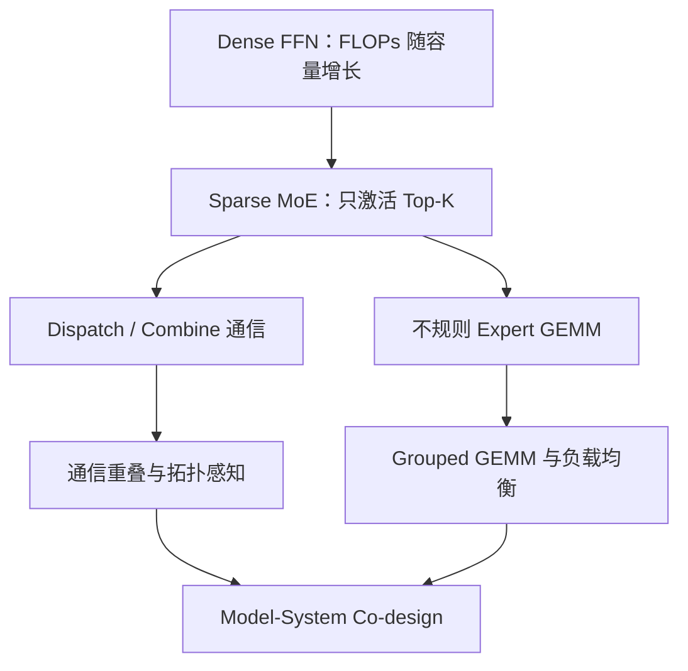
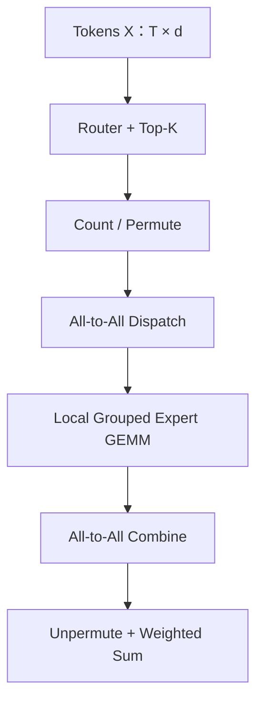
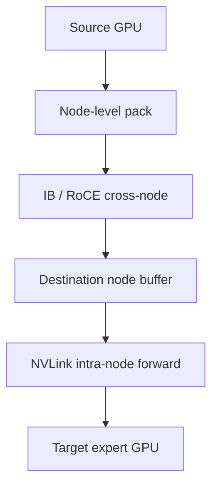

# MoE Infra：从条件计算到 All-to-All、Grouped GEMM 与专家并行系统

> 本文承接 `MLA.md`、`Sparse-Attention.md` 与 `Linear-Attention.md`。前三篇讨论的是如何减少序列记忆和历史交互成本；本文转向 Transformer 的另一条主轴：如何让模型拥有极大的参数容量，却只为每个 token 激活其中一小部分参数。
>
> 本文面向模型架构、训练系统和推理 Infra 学习者。内容按“结构是什么 → 张量如何流动 → 为什么产生通信和小 GEMM → 训练与 Serving 如何实现 → 如何建模、测量和排障”组织。论文或技术报告中的加速数字只代表作者的特定模型、硬件和软件配置，不能直接外推。
>
> **资料版本：截至 2026-09-02。** DeepEP V2、MoonEP、Qwen3.8-Flash-Next、DeepSeek-V4、Kimi K3、GLM-5.3 等仍在快速演进，具体 backend、dtype 和硬件支持以相应仓库当前版本为准。

---

## 缩写与术语

| 缩写 | 全称 | 中文解释 |
|---|---|---|
| MoE | Mixture of Experts | 混合专家；由 Router 为输入选择少量 Expert |
| FFN / MLP | Feed-Forward Network / Multi-Layer Perceptron | Transformer 中逐 token 的前馈网络 |
| Router / Gate | Routing Network / Gating Network | 计算 token 与专家匹配分数并选择专家的模块 |
| EP | Expert Parallelism | 专家并行；不同设备保存不同专家 |
| DP | Data Parallelism | 数据并行；不同副本处理不同数据 |
| TP | Tensor Parallelism | 张量并行；把一个算子内部张量切到多设备 |
| PP / VP | Pipeline / Virtual Pipeline Parallelism | 流水线并行 / 虚拟流水段 |
| CP / SP | Context / Sequence Parallelism | 上下文并行 / 序列并行 |
| A2A | All-to-All | 全互换通信；每个 rank 都可能向其他 rank 发送不同数据 |
| P2P | Point-to-Point | 点对点通信 |
| GEMM | General Matrix Multiplication | 通用矩阵乘法 |
| Grouped GEMM | Grouped General Matrix Multiplication | 一次调度一组形状可不同的 GEMM |
| SM | Streaming Multiprocessor | NVIDIA GPU 的流式多处理器 |
| CTA | Cooperative Thread Array | CUDA thread block 在硬件调度语境中的名称 |
| HBM | High Bandwidth Memory | GPU 高带宽显存 |
| RDMA | Remote Direct Memory Access | 远程直接内存访问 |
| IB / RoCE | InfiniBand / RDMA over Converged Ethernet | 常见跨节点高性能网络 |
| NVLink / NVSwitch | NVIDIA GPU 高速互联 / 交换芯片 | 节点内或大 NVLink 域中的 GPU 互联 |
| IBGDA | InfiniBand GPU Direct Async | GPU 发起和推进网络通信的技术路径 |
| EPLB | Expert Parallel Load Balancing | Serving 中通过专家重排或副本均衡 EP rank 负载 |
| SLO | Service-Level Objective | 服务延迟、可用性等目标 |
| TTFT | Time To First Token | 首 token 延迟 |
| TPOT / ITL | Time Per Output Token / Inter-Token Latency | 每输出 token 时间 / token 间延迟 |
| MFU | Model FLOPs Utilization | 模型有效 FLOPs 相对硬件峰值的利用率 |
| FP8 / NVFP4 / MXFP8 | 低精度浮点格式 | 用更少 byte 和更高 Tensor Core 吞吐完成计算 |
| CDF / CV | Cumulative Distribution Function / Coefficient of Variation | 累积分布函数 / 变异系数，用于描述负载分布 |
| MTP | Multi-Token Prediction | 多 token 预测，可辅助模型训练和推测解码 |

---

# 0. 先给结论：MoE 不是“免费增加参数”，而是一次瓶颈迁移

Dense FFN 的主要矛盾是：

$$
\text{参数容量增加}
\Rightarrow
\text{每个 token 的 FLOPs 同步增加}.
$$

Sparse MoE 将它改成：

$$
\text{Total Parameters}\uparrow
\quad\text{while}\quad
\text{Activated Parameters per Token}\approx\text{constant}.
$$

这就是 **Conditional Computation（条件计算）**：不同 token 使用不同参数路径。

但 FLOPs 被压低以后，系统要付出新的代价：

1. Router 必须决定 token 去哪里；
2. token 必须在 GPU 之间重新分发；
3. 每个专家只拿到不规则数量的 token，形成许多小 GEMM；
4. 最慢专家或最慢 rank 决定整层延迟；
5. 总权重仍然必须驻留、分片、加载、保存和恢复；
6. Serving 的真实流量可能与训练时完全不同，热专家会制造尾延迟。

所以 MoE 的核心等式不是：

$$
\text{MoE}=\text{Dense}/N.
$$

更接近：

$$
T_{\text{MoE}}
=T_{\text{router}}
+T_{\text{permute}}
+T_{\text{dispatch}}
+T_{\text{expert}}
+T_{\text{combine}}
+T_{\text{unpermute}}
+T_{\text{imbalance}}.
$$

在理想重叠下，部分加法可以变成最大值：

$$
T_{\text{layer}}
\approx
\max(T_{\text{compute}},T_{\text{communication}})
+T_{\text{unhidden}}.
$$

因此，本篇最重要的心智模型是：

> **MoE 用参数稀疏换取算力效率，又把瓶颈从规则的大 GEMM 迁移到动态路由、All-to-All、负载均衡、权重带宽和不规则小 GEMM。**



---

# 1. 先从 Dense FFN 开始：MoE 到底替换了什么？

一个常见的 SwiGLU FFN 可以写成：

$$
\operatorname{FFN}(x)
=W_{\text{down}}
\left(
\operatorname{SiLU}(xW_{\text{gate}})
\odot
xW_{\text{up}}
\right).
$$

设：

- token hidden size 为 $d$；
- FFN intermediate size 为 $d_{ff}$；
- 不考虑 bias。

三个权重矩阵的参数量近似为：

$$
P_{\text{dense-ffn}}
\approx 3d d_{ff}.
$$

若一个乘加记作 2 FLOPs，则每 token 前向 FLOPs 近似为：

$$
F_{\text{dense-ffn}}
\approx 6d d_{ff}.
$$

这里的关键是：同一层内所有 token 都经过同一套 $W_{\text{gate}},W_{\text{up}},W_{\text{down}}$。

假设一个 batch 展平后有 $T$ 个 token：

$$
X\in\mathbb{R}^{T\times d}.
$$

Dense FFN 形成的是几个很规整的大 GEMM：

$$
[T,d]\times[d,d_{ff}].
$$

这对 GPU 很友好：

- $M=T$ 较大；
- 权重可被很多 token 复用；
- kernel launch 数量少；
- tile 规则；
- 容易使用 Tensor Core；
- 没有 token 重排和跨设备 dispatch。

MoE 替换的通常就是这个 FFN，而 Attention、Norm、Residual 仍是 dense 路径。

---

# 2. Sparse MoE 的数学结构

设一层有 $E$ 个 routed experts，每个 token 选择 $K$ 个专家：

$$
s(x)=xW_r\in\mathbb{R}^{E},
$$

其中 $W_r\in\mathbb{R}^{d\times E}$ 是 Router 权重。

取 Top-$K$ 专家集合：

$$
\mathcal{I}(x)=\operatorname{TopK}(s(x),K).
$$

MoE 输出为：

$$
y=
\sum_{e\in\mathcal{I}(x)}g_e(x)\operatorname{FFN}_e(x),
$$

其中 $g_e(x)$ 是选中专家的 mixture weight。

若还有 $E_s$ 个 shared experts：

$$
y=
\sum_{j=1}^{E_s}\operatorname{FFN}^{(s)}_j(x)
+
\sum_{e\in\mathcal{I}(x)}g_e(x)\operatorname{FFN}^{(r)}_e(x).
$$

Shared expert 对所有 token 执行；routed expert 只对选中 token 执行。

## 2.1 Total parameters 与 activated parameters

若每个 routed expert 的 intermediate size 是 $d_e$，忽略 Router 和 dense 部分：

$$
P_{\text{routed,total}}
\approx E\cdot 3dd_e,
$$

而每 token 激活：

$$
P_{\text{routed,active}}
\approx K\cdot 3dd_e.
$$

稀疏度常粗略写成：

$$
S=\frac{E}{K}.
$$

但是只比较 $E/K$ 不够，因为模型还可能有：

- shared experts；
- dense attention 与 embedding；
- 前几层 dense FFN；
- 不同的 expert intermediate size；
- latent projection；
- 每层不同的 MoE frequency。

因此“1T 总参数、32B 激活”不能简单理解为每次只读整个模型的 $3.2\%$；必须看权重放置、EP 切分和每层激活路径。

---

# 3. 一个 MoE 层的完整张量数据流

输入：

$$
X\in\mathbb{R}^{T\times d}.
$$

完整过程是：

1. Router 计算 $[T,E]$ 分数；
2. Top-$K$ 得到 expert id 和 gate weight；
3. 统计每个 expert 的 token 数量；
4. 按 expert 对 token 排序或 permute；
5. 若使用 EP，把 token dispatch 到持有相应 expert 的 rank；
6. 各 rank 对本地 experts 执行 Grouped GEMM；
7. 将 expert 输出 combine 回 token 原属 rank；
8. 按原 token 顺序 unpermute；
9. 按 gate weight 求和并进入 residual。



这张图里，真正的 Expert FFN 只有中间一步。其余步骤都是 Dense FFN 不需要承担的 MoE tax。

---

# 4. 用具体 shape 看 token 如何被复制

假设：

- $T=8192$ tokens；
- hidden size $d=4096$；
- $E=64$ experts；
- Top-$K=2$；
- EP size $R=8$；
- 每个 rank 保存 8 个专家。

Router 输出：

$$
S\in\mathbb{R}^{8192\times64}.
$$

Top-2 后共有：

$$
T_{\text{assign}}=T\times K=16384
$$

个 token-expert assignments。

注意：物理 token 仍有 8192 个，但 routed activation 被复制为 16384 份。平均每个专家：

$$
\bar m=\frac{TK}{E}=256
$$

个 token。

本地第 $e$ 个专家收到：

$$
X_e\in\mathbb{R}^{m_e\times4096},
$$

其中 $m_e$ 并不等于 256，而是由真实路由决定。

一个 rank 的专家负载为：

$$
M_r=\sum_{e\in\mathcal{E}_r}m_e.
$$

整层同步完成时间近似受：

$$
\max_r M_r
$$

而不是平均值控制。这就是为什么 5%～10% 的路由偏斜可能造成更明显的 step-time 恶化。

---

# 5. 为什么“激活 FLOPs 少”不等于“运行一定快”

MoE 与 Dense 比较时，至少要分开四个尺度：

| 维度 | Dense | Sparse MoE |
|---|---|---|
| 总参数容量 | 与每 token 计算绑定 | 可远大于每 token 激活量 |
| Active FLOPs | 规则、全部执行 | 只执行 Top-K experts |
| 权重内存 | 相对集中 | 总权重可能极大，需要切分或量化 |
| 数据移动 | 主要是本地 HBM | token permutation + 跨 GPU dispatch/combine |
| GEMM shape | 少量大 GEMM | 多个可变 $M$ 的 expert GEMM |
| 尾延迟 | shape 通常一致 | 由热专家、慢 rank 和网络拥塞放大 |

MoE 的实际收益依赖：

$$
\text{Net Benefit}
=\text{saved dense compute}
-\text{routing tax}
-\text{communication tax}
-\text{fragmentation tax}.
$$

当 batch 很小、expert 很多、Top-K 较大或跨节点网络较慢时，MoE 甚至可能比 active FLOPs 相近的 Dense 更慢。

---

# 6. MoE 的历史演化：每一步都在解决上一代的系统问题

| 时间 | 里程碑 | 关键意义 |
|---|---|---|
| 1991 | Adaptive Mixtures of Local Experts | Gate 与专家竞争学习的早期基础 |
| 2017 | Sparsely-Gated MoE | 将稀疏条件计算扩展到数千专家与大规模集群 |
| 2020 | GShard | 自动分片与 Transformer MoE，扩到 600B 级 |
| 2021 | Switch Transformer | Top-1 routing，简化通信和路由 |
| 2021 | BASE Layers | 将均衡路由写成 balanced assignment |
| 2021–2022 | GLaM / ST-MoE | 万亿参数语言模型与稳定、可迁移训练 |
| 2022 | Expert Choice | 从“token 选专家”改为“专家选 token” |
| 2022 | DeepSpeed-MoE / Tutel | 训练与推理系统、动态并行和通信优化 |
| 2022 | MegaBlocks | block-sparse dropless MoE，摆脱 drop/padding 二选一 |
| 2024 | Mixtral / DBRX / DeepSeekMoE | 开源 decoder-only MoE、细粒度和 shared experts |
| 2024 | OLMoE | 权重、数据、代码和训练日志更完整的开放研究基线 |
| 2024–2025 | DeepSeek-V2/V3 | fine-grained MoE、aux-loss-free、node-limited routing、DeepEP/DualPipe |
| 2025 | Qwen3 / Qwen3-Next | global-batch balance 与 ultra-sparse MoE |
| 2025–2026 | Kimi K2/K3 | sparsity scaling、LatentMoE、Quantile Balancing、MoonEP |
| 2026 | DeepSeek-V4 / Qwen3.8 / GLM-5.x | 更高总容量、更少 active params，并与长上下文 Hybrid 架构协同 |

早期工作主要回答：

> 能否让不同输入选择不同子网络？

现代 MoE 则必须同时回答：

> 如何在数百到上千专家、数千 GPU、FP8/FP4 和在线低延迟环境中，把动态稀疏真正变成系统收益？

---

# 7. Router：一个看似很小、实际决定全系统形状的模块

Router 常只是一个线性层：

$$
S=XW_r,
\qquad
X\in\mathbb{R}^{T\times d},
\quad
W_r\in\mathbb{R}^{d\times E}.
$$

它的参数和 FLOPs 通常远小于 Expert FFN，但输出 $[T,E]$ 会决定：

- 每个 expert 的 $m_e$；
- 每个 EP rank 的发送量与接收量；
- Grouped GEMM 的全部 $M$ 维；
- 是否发生 token drop；
- buffer 需要多大；
- 哪个 rank 成为 straggler；
- 专家是否真正形成分工。

因此 Router 是模型结构与运行时调度的接口。

## 7.1 Softmax Router

常见做法：

$$
p_e(x)=\frac{\exp(s_e)}{\sum_j\exp(s_j)}.
$$

再取 Top-$K$。Softmax 在所有专家间产生竞争，一个 expert 分数上升会压低其他 expert 概率。

## 7.2 Sigmoid affinity

DeepSeek-V3 使用独立 sigmoid affinity：

$$
a_e(x)=\sigma(x^\top c_e),
$$

先按 affinity 加 bias 选择 Top-$K$，再对选中的原始 affinity 归一化形成 mixture weight。

Sigmoid 允许每个 expert 先独立估计相关性；但最终固定 Top-$K$ 仍产生离散竞争。

## 7.3 Top-1、Top-2 与更大的 Top-K

| 路由 | 优点 | 代价 |
|---|---|---|
| Top-1 | 最少激活计算和通信；Switch 路线简洁 | 单一路径容量、鲁棒性和组合性受限 |
| Top-2 | 常见的质量/成本折中；Mixtral 使用 | assignment、通信和 FFN 近似翻倍 |
| Top-K，$K>2$ | 更强的专家组合能力 | dispatch、权重计算、combine 与 imbalance 都增大 |
| Shared + Top-K | 公共知识走共享路径，routed experts 更专门 | shared 路径始终计算，降低稀疏率 |

Top-K 不只是算法超参数，也是通信放大因子：

$$
T_{\text{assign}}=T\cdot K.
$$

---

# 8. Top-K 不可导，Router 是怎样训练的？

Top-K 的 expert id 是离散选择，无法像普通连续算子一样对“未选专家”直接反向传播。

实践中通常：

- 对选中专家的 gate weight 正常求梯度；
- 未选专家在该 token 上没有 Expert FFN 梯度；
- Router 通过选中概率、主任务损失和 balance loss 更新；
- 路由边界附近会出现 route churn：微小分数变化导致 expert id 跳变。

这带来三个问题：

1. **Winner-takes-more**：早期更常被选中的专家获得更多训练信号；
2. **Dead expert**：长期收不到 token 的专家几乎无法学习；
3. **Router instability**：分数尺度膨胀、Top-K 过于确定，探索消失。

常见稳定手段包括：

- router logits 使用更高精度；
- router z-loss；
- 输入 jitter/noise；
- 合理初始化；
- auxiliary balance loss 或非梯度 bias；
- 限制单 expert 容量；
- warmup、监控 entropy 和 route churn。

---

# 9. Capacity Factor：为什么早期 MoE 会丢 token？

若平均每 expert assignment 数为：

$$
\bar m=\frac{TK}{E},
$$

早期实现常给每个 expert 预分配固定容量：

$$
C=\left\lceil \alpha\frac{TK}{E}\right\rceil,
$$

其中 $\alpha$ 是 capacity factor。

如果某 expert 收到：

$$
m_e>C,
$$

超出部分有两种处理：

- drop token/assignment；
- padding 或扩大 buffer。

这是一个质量与效率的矛盾：

| 选择 | 结果 |
|---|---|
| 小 capacity factor | buffer 小，但更容易 drop，信息路径被破坏 |
| 大 capacity factor | drop 少，但 padding、显存和空算增加 |
| 动态 dropless | 质量好，但需要能处理 ragged shape 的 kernel 和通信系统 |

Switch Transformer 的 Top-1 简化了容量管理；MegaBlocks 则把动态 MoE 写成 block-sparse computation，目标是既不 drop，也不为最大容量做大量 padding。

现代大模型通常倾向 dropless，但“无 token drop”并不意味着没有 buffer 上界和 OOM 风险：极端路由偏斜仍会扩大 activation、通信 workspace 和局部 expert batch。

---

# 10. Auxiliary Load-Balancing Loss

常见 balance loss 同时考虑：

- expert 实际接收 token 的比例 $f_e$；
- Router 给 expert 的平均概率 $p_e$。

一种常见形式为：

$$
\mathcal{L}_{\text{bal}}
=\lambda E\sum_{e=1}^{E}f_ep_e.
$$

当所有专家均匀时：

$$
f_e\approx p_e\approx\frac{1}{E}.
$$

问题是 balance loss 与语言建模目标不完全一致：

$$
\mathcal{L}
=\mathcal{L}_{\text{LM}}
+\mathcal{L}_{\text{bal}}.
$$

若 $\lambda$ 太小，负载仍不平衡；若太大，Router 为“平均分配”牺牲 token-expert affinity，可能影响模型质量和自然专家分工。

## 10.1 batch-wise、sequence-wise 与 global-batch balance

平衡发生在哪个统计范围很重要：

- **micro-batch-wise**：反馈及时，但噪声大，短 batch 很难均衡；
- **sequence-wise**：防止单序列极端偏斜，但可能限制领域专门化；
- **step/batch-wise**：对整步 token 统计，更稳定；
- **global-batch-wise**：跨 DP rank 汇总，统计更准确，但需要额外 collective。

Qwen3 报告使用 global-batch load balancing loss；DeepSeek-V3 主要使用非梯度 bias，同时保留较弱的 sequence-wise 辅助约束。这说明“是否使用 aux loss”不是简单二选一，而是主平衡机制与安全约束的组合。

---

# 11. Router z-loss：它解决的不是负载，而是 logits 尺度

ST-MoE 推广了 Router z-loss，其典型形式是惩罚 log-partition：

$$
\mathcal{L}_{z}
=\lambda_z
\left(
\log\sum_{e=1}^{E}\exp(s_e)
\right)^2.
$$

它主要抑制 Router logits 无限制变大，改善低精度训练的数值稳定性。

不要混淆：

- balance loss 关注专家利用率；
- z-loss 关注 logits 数值尺度；
- entropy regularization 关注路由分布尖锐程度；
- capacity/drop 关注运行时容量约束。

四者解决的是不同问题。

---

# 12. DeepSeek 的 Auxiliary-Loss-Free Balancing

DeepSeek-V3 为每个 expert 维护一个 routing bias $b_e$：

$$
\tilde s_e=s_e+b_e.
$$

Top-K 根据 $\tilde s_e$ 选择，但 mixture weight 仍使用原始 $s_e$。若 expert 过载，则降低其 bias；若欠载，则提高 bias：

$$
b_e\leftarrow
b_e+\gamma\cdot
\operatorname{sign}(\bar m-m_e).
$$

关键点是：

> bias 改变“谁被选中”，但不直接改变选中 expert 输出乘的语义权重。

因此它把系统层面的负载控制，从主任务梯度中部分解耦出来。

## 12.1 优点

- 不需要用较大的 aux loss 扭曲 LM objective；
- bias 更新规则易于实现；
- 可直接针对观测 load 反馈；
- inference 时可冻结 bias，仍是普通 Top-K。

## 12.2 局限

- 固定步长 $\gamma$ 太小会跟不上负载漂移；
- 太大会在目标负载附近振荡；
- expert 数接近上千时，各 expert 的 margin 分布差异显著；
- 只看 load direction，没有利用“需要多大 bias 才能跨过 Top-K 边界”。

这正是 Kimi K3 继续发展 Quantile Balancing 的背景。

---

# 13. Kimi K3 的 Quantile Balancing

Kimi K3 的 Stable LatentMoE 有 896 个 routed experts，每 token 激活 16 个。固定步长 sign update 在近千专家下更难快速稳定。

Quantile Balancing（QB）把均衡路由看成带约束的 assignment 问题：

$$
\max_{x_{i,e}\in\{0,1\}}
\sum_{i,e}x_{i,e}s_{i,e}
$$

满足：

$$
\sum_e x_{i,e}=K,
\qquad
\sum_i x_{i,e}=\frac{TK}{E}.
$$

对每个 expert，不再只问“过载还是欠载”，而是估计一个分位点：需要把 bias 调到哪里，才能使它恰好获得目标 token 数。

大规模训练不可能 gather 全部 $T\times E$ margins。Kimi K3 的做法是：

1. 每个 rank 本地为每个 expert 累积 margin histogram；
2. 每步末用一次 All-Reduce 汇总 bin counts；
3. 从全局 histogram 恢复目标 quantile；
4. 更新 expert bias；
5. inference 只保留冻结后的 bias，不需要在线算 quantile。

QB 的 Infra 意义很强：

> 它用固定大小的统计摘要替代收集数百万 token 的完整 margin，同时让负载控制从慢速 sign feedback 变成接近目标 coordinate update。

---

# 14. Expert specialization：MoE 的质量收益来自哪里？

MoE 不只是“把一个大 FFN 切成多个小 FFN”。理想状态是不同 experts 学到不同功能：

- 语言或领域；
- 代码、数学、知识；
- 句法或语义模式；
- token 频率区间；
- 不同抽象层级的变换。

但 specialization 不是自动保证的。可能出现：

- 多个 routed experts 重复学习公共知识；
- 少数 expert 成为 universal hot experts；
- 专家按 token identity 而非高层语义分工；
- 训练负载均匀，但线上领域分布导致偏斜；
- expert 只在部分层形成明显分工。

因此需要同时看：

$$
\text{quality specialization}
\neq
\text{load balance}.
$$

负载完全均匀不代表分工合理；分工明显也不代表系统负载可接受。

推荐分析：

- expert-token mutual information；
- expert 对语言/领域/token type 的条件概率；
- layer-wise routing entropy；
- expert co-activation matrix；
- 路由随训练阶段的 churn；
- ablate 单 expert 后的能力变化；
- 训练与线上路由分布的 KL divergence。

---

# 15. Fine-Grained Experts：为什么专家越来越多、每个越来越小？

传统 MoE 可能有 $E$ 个较大 experts，每 token 选 $K$ 个。DeepSeekMoE 的思路是把专家细分：

$$
E\rightarrow mE,
\qquad
K\rightarrow mK,
$$

同时缩小每个 expert 的 intermediate size，使 active compute 大体可控。

## 15.1 模型侧收益

- 组合空间从“选少数大模块”变成“组合更多小模块”；
- 一个 token 可以拼出更细的功能组合；
- routed experts 更容易专门化；
- 在固定 active compute 下增加 total expert parameters。

## 15.2 Infra 侧代价

- assignment 数 $TK$ 增加；
- 每个 expert 的 $m_e$ 变小；
- GEMM 的 $M$ 更 skinny；
- expert metadata 和 scheduling 占比上升；
- 路由平衡难度上升；
- 更多专家可能跨更多 rank 或节点。

因此 fine-grained MoE 与 Grouped GEMM、通信融合和低精度权重是天然绑定的。

---

# 16. Shared Experts：把公共知识从 routed experts 中隔离出来

Shared expert 对所有 token 都执行。其目标是承载跨领域通用变换，让 routed experts 不必重复学习相同公共模式。

可以把输出写成：

$$
y=y_{\text{shared}}+y_{\text{routed}}.
$$

## 16.1 为什么可能提高质量？

没有 shared expert 时，所有 token 都必须经过 routed experts。为了服务通用 token，多个专家容易学习冗余的基础知识。

Shared path 提供稳定公共 backbone，routed path 专注差异化容量。

## 16.2 为什么它也是一个 Infra opportunity？

Shared expert 无需 Router，且所有 token 都使用，GEMM 较大而规则。可以让：

$$
\text{shared expert compute}
\parallel
\text{routed expert dispatch}.
$$

Megatron Core 等系统提供 shared-expert overlap：通信 routed tokens 时，同时计算 shared expert。

## 16.3 代价

- shared compute 始终发生；
- shared 权重可能需要复制或 TP；
- shared path 太大将侵蚀稀疏收益；
- combine 与 residual 的融合更复杂。

---

# 17. LatentMoE：把 full model width 与 routed expert width 解耦

Kimi K3 的 LatentMoE 不让 routed experts 直接在完整 hidden width $d$ 上工作，而是先投影到较小 latent width $\ell$：

$$
x\in\mathbb{R}^{d}
\xrightarrow{W_{\text{down}}}
z\in\mathbb{R}^{\ell}
\xrightarrow{\text{routed experts}}
z'
\xrightarrow{W_{\text{up}}}
y\in\mathbb{R}^{d},
$$

其中 $\ell<d$。Kimi K3 报告中 $d=7168$、latent dimension $\ell=3584$。

这使 routed expert bank 可以在较窄空间扩到 896 experts，而 shared experts 保留 full-width 公共路径。

## 17.1 为什么叫 Stable LatentMoE？

极端稀疏和额外投影形成较长的矩阵乘链，内部 activation 可能爆炸。Kimi K3 加入：

- up-projection 前 RMSNorm；
- 有界的 SiTU-GLU；
- Quantile Balancing。

这说明容量 scaling 继续暴露出优化稳定性与负载控制的新瓶颈。

## 17.2 Infra trade-off

Latent width 降低每个 routed expert 的输入/输出 byte 与 GEMM 维度，但增加公共 down/up projection。它是否更快取决于：

$$
T_{\text{projection}}
+T_{\text{latent experts}}
+T_{\text{routing}}
<T_{\text{full-width experts}}.
$$

不能只按 active expert 参数量推断。

---

# 18. 不同路由范式：谁选择谁？

## 18.1 Token Choice

每个 token 选择固定 $K$ 个 experts。现代 decoder-only LLM 最常见。

优点：每 token compute 可预测；适合 autoregressive serving。

缺点：每 expert 的 token 数不固定，需要额外平衡。

## 18.2 Expert Choice

每个 expert 从所有 tokens 中选择固定容量的 Top tokens。这样每 expert 的 GEMM shape 天然固定，但每 token 可能被 0、1 或多个 experts 选择。

它把负载平衡内建进选择规则，却改变了每 token compute 和 causal serving 的语义，因此在主流自回归 LLM 中不如 token-choice 普遍。

## 18.3 BASE balanced assignment

BASE Layers 将 token-to-expert 写成线性分配问题，保证每 expert 收到相同 token 数。优点是严格均衡；代价是需要全局 assignment，跨 rank 协调和在线低延迟并不简单。

## 18.4 Hash Routing

按 token id 或固定 hash 选择专家，省掉学习 Router 和平衡问题。缺点是输入上下文适应性弱，专家分工受 hash 规则约束。

## 18.5 Threshold / variable-K routing

按阈值选择所有超过门槛的 experts，$K$ 可变。它更贴近 affinity，但使每 token compute 和 buffer 更难预测。

对大规模 Serving 来说，固定 Top-K 的可预算性仍是非常强的工程优势。

---

# 19. Expert Parallelism：为什么 MoE 通常不能只用 Tensor Parallel？

如果总 expert 权重太大，无法在每张 GPU 上复制，就把 experts 分到不同 rank：

$$
\mathcal{E}
=\mathcal{E}_0\cup\mathcal{E}_1\cup\cdots\cup\mathcal{E}_{R-1}.
$$

rank $r$ 只保存 $\mathcal{E}_r$。

这就是 EP。

TP 是把一个 expert 的矩阵切开；EP 是把不同 experts 分开：

| 并行方式 | 切分对象 | 典型通信 |
|---|---|---|
| DP | 样本 / batch | gradient All-Reduce / Reduce-Scatter |
| TP | 单层权重和 activation channel | All-Reduce、Reduce-Scatter、All-Gather |
| EP | expert bank | token All-to-All dispatch/combine |
| PP | layer | stage 间 P2P activation |
| CP | sequence | Attention 所需 KV/partial result 通信 |

大模型通常组合：

$$
N_{GPU}
=DP\times PP\times TP\times CP\times EP
$$

但这些维度不一定完全独立相乘；实现会复用 rank 维度或形成嵌套 process groups，必须以框架的 group construction 为准。

---

# 20. EP 之后为什么出现 All-to-All？

假设 token 最初位于其 DP/TP rank，但 Router 选中的 expert 可能在任意 EP rank。

每个源 rank 都有一组不同目的地的数据：

$$
X_{r\rightarrow0},X_{r\rightarrow1},\ldots,X_{r\rightarrow R-1}.
$$

Dispatch 要完成：

$$
\forall r,j:\quad
X_{r\rightarrow j}
\text{ 从 rank }r
\text{ 发送到 rank }j.
$$

这正是 All-to-All/All-to-All-v，而不是 All-Reduce。

Expert 计算完成后，输出还要沿相反关系返回原 token rank，即 Combine。

所以 MoE 前向至少有两个方向：

$$
\text{Dispatch A2A}
\rightarrow
\text{Expert Compute}
\rightarrow
\text{Combine A2A}.
$$

反向传播还会重复相应的数据交换。

---

# 21. MoE 通信量的第一阶成本模型

设：

- 本 rank 原始 token 数 $T_r$；
- Top-K 为 $K$；
- hidden size 为 $d$；
- activation 每元素 $b$ bytes；
- assignment 远程比例为 $p_{remote}$。

仅计算主 activation，不含 scale、expert id、offset、padding：

$$
B_{\text{dispatch}}
\approx T_rKdbp_{remote}.
$$

Combine 同量级：

$$
B_{\text{combine}}
\approx T_rKdbp_{remote}.
$$

因此前向主流量近似：

$$
B_{\text{forward}}
\approx2T_rKdbp_{remote}.
$$

如果 experts 均匀分布且每 rank 保存 $1/R$ experts，粗略有：

$$
p_{remote}\approx1-\frac1R.
$$

这揭示出几个事实：

1. EP 越大，远程比例越接近 1；
2. Top-K 直接线性放大通信；
3. hidden size 决定每 assignment payload；
4. activation FP8 可近似减半 byte，但 scale/metadata 和转化也有成本；
5. 通信量不等于通信时间，消息粒度、拥塞、拓扑和 SM 占用同样重要。

---

# 22. All-to-All 为什么比 All-Reduce 更难优化？

All-Reduce 的每个 rank 通常发送相同 shape 的 tensor，通信模式规则。

MoE All-to-All-v 则具有：

- 每个 source-destination pair 数据量不同；
- 每层、每步都可能变化；
- 小消息多；
- 同时跨 NVLink、PCIe、IB/RoCE；
- 最慢 pair 或拥塞路径拖累整体；
- token 顺序和 metadata 必须可逆；
- 通信前需要 count、prefix sum 和 buffer planning。

因此带宽峰值不是充分指标。实际时间近似：

$$
T_{comm}
\approx
T_{setup}
+T_{metadata}
+\max_{links}\frac{B_{link}}{BW_{effective}}
+T_{sync}.
$$

小 batch decode 中，$T_{setup}$ 和 RTT 可能比 payload 传输更重要；大 batch prefill/training 中，有效带宽和拥塞更重要。

---

# 23. 拓扑感知：NVLink 很快，但跨节点 token 仍要经过网络

一个典型 8-GPU 节点：

- GPU 间通过 NVLink/NVSwitch；
- 节点间通过 IB 或 RoCE；
- NIC 与 GPU 通过 PCIe、GPUDirect RDMA 等路径连接。

如果逻辑 All-to-All 完全忽略物理拓扑，会产生：

- 同一个 token 多次跨节点；
- NIC rail 不均衡；
- 节点内转发与跨节点流量互相干扰；
- 某些 GPU 到 NIC 的路径更长；
- 多种 collective 争用同一网络。

DeepSeek-V3 的实现将跨节点与节点内转发分层：先利用 IB 完成节点间传输，再利用 NVLink 在节点内送到具体 GPU，并通过 node-limited routing 限制一个 token 涉及的节点数量。



这不是固定协议；不同 NVLink domain、NIC 数量和 backend 会选择不同 hierarchy。

---

# 24. Node-Limited / Group-Limited Routing

如果 Top-$K$ experts 分散在很多节点，一个 token 会产生广泛 fan-out。可以先把 experts 分组，例如一组对应一个节点或一个拓扑域：

1. 计算每组的代表分数；
2. 先选少数 groups；
3. 只在这些 groups 内选 Top-$K$ experts。

这样约束：

$$
N_{remote\ nodes\ per\ token}\leq G_{top}.
$$

收益：

- 减少跨节点目标数量；
- 聚合更大消息；
- 提高 locality；
- 让通信更容易重叠。

代价：

- Router 搜索空间受拓扑约束；
- 最相关 experts 可能位于未选 group；
- group placement 会影响模型质量与负载；
- 硬件拓扑变更可能要求重新设计 expert mapping。

这体现了典型 Model–System Co-design：路由规则开始感知集群拓扑。

---

# 25. Token permutation：一个经常被低估的 HBM 成本

在 dispatch 前，需要把原始 token-major layout：

$$
[t_0,t_1,t_2,\ldots]
$$

重排为 expert-major layout：

$$
[X_0;X_1;\ldots;X_{E-1}].
$$

典型步骤：

1. histogram：统计每 expert count；
2. prefix sum：计算每 expert buffer offset；
3. scatter：把 token copy 到目标位置；
4. 保存 inverse map；
5. combine 后 gather/unpermute。

如果 Top-K 大于 1，同一 token 会被 scatter 多次。

Permutation 常受 HBM bandwidth 和随机访存限制，且中间 tensor 可能包括：

- permuted activation；
- expert ids；
- gate weights；
- source rank；
- local offset；
- send/recv counts；
- inverse permutation index。

因此高性能实现会考虑：

- fused count + prefix metadata；
- fused permute + quantize；
- zero-copy communication buffer；
- combine + dequantize + weighted reduction；
- 预分配 workspace，避免每层 allocator 同步。

---

# 26. Expert GEMM 为什么变成了“小而碎”的计算？

第 $e$ 个 expert 的第一组投影是：

$$
X_e[m_e,d]
\times
W_e[d,2d_e].
$$

down projection 是：

$$
H_e[m_e,d_e]
\times
W^{down}_e[d_e,d].
$$

在 Dense FFN 中 $m_e=T$；在 MoE 中平均：

$$
\bar m=\frac{TK}{E}.
$$

当 $E$ 增长得比 $TK$ 快时，$m_e$ 迅速变小。

小 $M$ GEMM 的问题：

- Tensor Core tile 填不满；
- CTA 数不足，无法占满所有 SM；
- kernel launch 占比上升；
- 权重被很少 token 复用，算术强度下降；
- 不同 $m_e$ 造成 SM worker makespan 不均；
- 某些 expert 为 0 token，kernel 和指针表仍要正确处理。

这就是 Ultra-Sparse MoE 时代的核心矛盾：

> FLOPs 很少，但每个 FLOP 越来越难高效执行。

---

# 27. Grouped GEMM：它不是一种固定 kernel，而是一种 workload abstraction

对本地 $E_{local}$ 个 experts，需要计算：

$$
C_e=A_eB_e,
\qquad e=1,\ldots,E_{local},
$$

其中各组 $M_e$ 不同，但 $K,N$ 往往相同。

最朴素实现：

```python
for expert in local_experts:
    y_e = x_e @ w_e
```

会产生一个 expert 一个 kernel launch。Grouped GEMM 把这组 GEMM 交给一个统一调度器：

- 一次 launch 处理多个 experts；
- CTA 动态领取不同 expert tiles；
- 减少 host launch overhead；
- 让小 GEMM 共同填满 GPU；
- 可以按 workload 调整 tile schedule。

## 27.1 Grouped GEMM 与 Batched GEMM 的区别

Strided Batched GEMM 通常要求每组矩阵形状和 stride 规则一致；Grouped GEMM 允许 $M_e$ 不同，并通过 pointer/offset/shape metadata 描述各组。

## 27.2 它为什么不是万能的？

统一 tile configuration 必须同时服务不同 $M_e$：

- 对大 expert 最优的 tile 未必适合小 expert；
- 固定调度顺序可能让最后一个大 expert 拖尾；
- metadata 读取和全局工作队列有开销；
- 极端小 batch 时，weight load 仍是主导；
- shape 分布变化时，离线最优配置会失效。

所以 Grouped GEMM 是问题抽象，不等于某个实现永远最快。

---

# 28. 四种 Expert GEMM 实现路线

## 28.1 Per-expert loop

优点：简单、每 expert 可选不同 kernel。

缺点：launch 多；小 GEMM 利用率差。

适合少量大 experts，或作为正确性 baseline。

## 28.2 Multi-stream GEMM

多个 CUDA streams 并发执行不同 expert GEMM。可以利用 cuBLAS/cuBLASLt 的成熟 kernel，但：

- stream 调度有开销；
- 并发 GEMM 争用 SM/L2/HBM；
- 很难保证不同 shape 公平调度；
- CUDA Graph 与动态 shape 处理复杂。

## 28.3 Unified Grouped GEMM

一个 persistent/grouped kernel 在内部调度所有 expert tiles。适合 many-small-GEMM，但需高质量 scheduler。

## 28.4 Block-Sparse GEMM

MegaBlocks 把所有 expert token blocks 组织成 block-sparse matrix，用稀疏 kernel 执行。它避免 capacity padding 和 token dropping，但 block size、稀疏 metadata 与模型 shape 共同决定效率。

没有一条路线对所有 $E,m_e,d,d_e,dtype,GPU$ 都最优。正确方法是根据真实 route trace benchmark。

---

# 29. PyTorch `grouped_mm`、Transformer Engine 与自定义 Kernel 怎么选？

截至 2026-09，PyTorch 已提供 `torch.nn.functional.grouped_mm` 和 scaled grouped MM 接口；Transformer Engine 提供 `GroupedLinear`、低精度 recipe 和 MoE 相关融合；Triton、CUTLASS/CuTe DSL、TileLang 也常用于定制 kernel。

它们的定位不同：

| 路线 | 强项 | 需要验证 |
|---|---|---|
| PyTorch grouped_mm | 框架原生、compile 集成、接口统一 | GPU 架构、dtype、dynamic offsets、CUDA Graph、版本成熟度 |
| Transformer Engine | FP8/MXFP8/NVFP4、训练模块、Megatron 集成 | shape 对齐、recipe、版本/硬件约束、额外转换 |
| CUTLASS/CuTe DSL | 精细控制 tile、TMA、Tensor Core | 开发复杂度、维护与 shape coverage |
| Triton/TileLang | 迭代快、易做 persistent scheduler/fusion | 编译时间、极端 shape、跨硬件性能 |
| cuBLASLt multi-stream | 单 GEMM kernel 成熟 | launch/stream overhead、many-small-GEMM 效率 |

不能根据某个旧 issue 或单一 microbenchmark 宣布“PyTorch 一定慢”或“TE 一定快”。至少固定：

- 精确 PyTorch/TE/CUDA/CUTLASS 版本；
- A100/H100/H200/B200 等 GPU；
- BF16/FP8/FP4；
- $m_e$ 分布而不是只用平均 $m$；
- 是否包含 permute、quantize、activation、down GEMM；
- forward、dgrad、wgrad；
- eager、`torch.compile`、CUDA Graph；
- warmup 与 workspace/autotune 成本。

---

# 30. Expert GEMM 的调度问题：总 token 平衡仍不够

即使每个 rank 的总 token 数完全相同，rank 内不同 experts 的 $m_e$ 仍可能高度偏斜。

假设两个 rank 都有 1024 assignments：

- rank A：8 个 experts 各 128；
- rank B：一个 expert 800，其余合计 224。

如果 grouped kernel 的 worker 按固定 expert 顺序领取任务，rank B 可能出现长尾。

因此 scheduler 需要考虑：

- largest-first 或 cost-aware ordering；
- tile-level work stealing；
- persistent CTA 数；
- Split-K / Split-M；
- L2 weight locality；
- expert 与 SM cluster affinity；
- up/gate/down GEMM 的融合与依赖。

Kimi K3 的 MoonEP 即使实现 rank-level perfect balance，仍使用 workload-aware expert-GEMM scheduler，因为 rank 内 skew 不会自动消失。

---

# 31. Fusion：MoE 不是只融合 activation function

MoE 数据流中存在大量中间 tensor。可融合方向包括：

- Router projection + Top-K；
- count + prefix sum；
- permute + FP8 quantize；
- gate/up projection + SwiGLU；
- expert output + gate weight；
- combine receive + reduction；
- unpermute + residual；
- shared expert compute 与 routed dispatch overlap；
- down GEMM 输出分块产生后立即发送 combine。

融合收益主要来自减少：

$$
\text{HBM round-trip}
+\text{kernel launches}
+\text{synchronization}.
$$

但过度 mega-fusion 也会：

- register pressure 增大；
- occupancy 降低；
- shape coverage 变窄；
- 编译时间增加；
- 调试和数值校验困难；
- 通信与计算资源无法独立调节。

应通过 end-to-end trace 判断，而不是只追求 kernel 数最少。

---

# 32. MoE 前向与反向到底有哪些计算？

对一个 expert 线性层：

$$
Y=XW.
$$

反向包括：

$$
dX=dYW^\top,
$$

$$
dW=X^\top dY.
$$

所以训练不仅要优化 forward GEMM，还要优化：

- dgrad：对输入梯度；
- wgrad：对 expert 权重梯度；
- Router gradient；
- dispatch/combine 的 backward；
- expert gradient 在对应 DP group 内的同步。

不同阶段的 shape 不同。特别是 wgrad 的 $M=m_e$ 仍然 ragged，且 gradient accumulation 可能改变最佳调度。

如果只 benchmark forward grouped GEMM，无法代表训练性能。

---

# 33. Expert 参数的 Data-Parallel Group 很容易建错

假设 EP group 内每个 expert 只存在一份，而整个模型有多个 DP replicas。

同一个 expert 的梯度只需要在“保存同一 expert 的副本 ranks”之间同步，而不是对所有 GPU All-Reduce。

可区分：

- dense parameter DP group；
- expert parameter DP group；
- TP group；
- EP group；
- PP/CP group。

如果 process group 建错，可能出现：

- 不同 experts 的梯度被错误相加；
- expert 梯度未同步；
- checkpoint 重载后权重不一致；
- 通信量远超预期；
- 某些 rank collective 次序不一致而 hang。

调试时应打印每类参数的：

$$
(\text{name},\text{global rank},\text{TP group},\text{EP group},\text{DP group},\text{owner expert ids}).
$$

---

# 34. MoE 的显存：Active parameters 少，并不代表模型容易装下

推理显存至少包括：

$$
M_{infer}
=M_{dense\ weights}
+M_{local\ expert\ weights}
+M_{KV/state}
+M_{workspace}
+M_{activations}.
$$

训练还包括：

$$
M_{train}
=M_{weights}
+M_{grads}
+M_{optimizer}
+M_{master\ weights}
+M_{saved\ activations}
+M_{comm\ buffers}.
$$

如果 BF16 权重 2 bytes、FP32 gradient buffer 4 bytes、Adam states 至少若干 FP32 tensor，总参数即使每 token 不激活，也仍会形成巨大的静态存储成本。

常见手段：

- EP 分片 expert weights；
- ZeRO-1/2/3 或 FSDP 分片 optimizer/gradient/parameter；
- selective recomputation；
- activation FP8 storage；
- CPU offload / prefetch；
- expert weight quantization；
- 减少 TP，避免额外 activation collective；
- 预分配并复用通信 workspace。

Kimi K2 报告中在 1T 参数规模下结合 PP16、EP16、ZeRO-1，并对 activation 使用 recomputation、FP8 storage 和 CPU offload；这说明“MoE 省 FLOPs”与“训练显存容易”是两回事。

---

# 35. Expert imbalance 为什么会引发 OOM，而不只是变慢？

某 rank 收到更多 assignments 时，会扩大：

- recv buffer；
- permuted activation；
- expert intermediate activation；
- backward saved tensors；
- temporary GEMM workspace；
- combine buffer。

所以：

$$
M_{peak,r}
\propto
M_r
\quad\text{or}\quad
\max_{e\in r}m_e,
$$

而不是全局平均负载。

典型现象：

- 大多数 step 正常，某领域 batch 突然 OOM；
- 训练早期 Router 尚未稳定时更容易 OOM；
- 增大 micro-batch 后不是线性增长，而是出现偏斜放大；
- activation checkpointing 开启后仍 OOM，因为通信 buffer 未被覆盖。

需要记录 per-layer/per-rank max token count，而不只是平均 expert load。

---

# 36. Communication–Computation Overlap：目标是把加法变成最大值

串行 MoE：

$$
T=T_{dispatch}+T_{expert}+T_{combine}.
$$

理想重叠：

$$
T\approx\max(T_{comm},T_{compute}).
$$

常见 overlap 来源：

- 当前 micro-batch Attention 与另一个 micro-batch MoE 通信；
- shared expert compute 与 routed dispatch；
- forward 与 backward chunk；
- PP P2P 与 wgrad；
- down GEMM tile 与 combine send；
- CPU activation offload 与 GPU compute。

但重叠不是免费的。通信 kernel 也会占用：

- SM；
- register/shared memory；
- HBM bandwidth；
- copy engine；
- PCIe/NVLink/IB；
- stream priority 和 launch slots。

如果通信占用过多 SM，compute 会变慢；如果只给通信很少 SM，网络无法被喂满。因此要调的是资源配额，不只是创建第二条 CUDA stream。

---

# 37. DualPipe：用双向流水隐藏 MoE 通信

DeepSeek-V3 把每个 chunk 拆为：

- Attention；
- All-to-All Dispatch；
- Expert MLP；
- All-to-All Combine；
- PP communication。

Backward 还将 input-gradient 和 weight-gradient 计算拆开。DualPipe 从流水线两端同时注入 micro-batches，并重排 forward/backward components，使一侧的计算覆盖另一侧的通信。

DeepSeek-V3 报告的关键背景是：跨节点 EP 的 compute-to-communication 时间比接近 1:1；若串行执行，通信几乎将 MoE 时间翻倍。

## 37.1 DualPipe 的代价

- 双向 stage placement 更复杂；
- 参数和 gradient memory 可能增加；
- 需要更多 in-flight micro-batches；
- schedule 必须匹配具体模型和通信 kernel；
- overlap 后 profiler 上 kernel 变慢不一定是回退，可能是资源共享结果；
- 负载不均会破坏原本精心匹配的 overlap window。

DualPipe 不是“所有 MoE 训练都应该打开”的通用开关。

---

# 38. 为什么 Kimi K2 没有照搬 DualPipe？

Kimi K2 使用 PP16、EP16 和 interleaved 1F1B，通过增加 warm-up micro-batches 重叠 EP communication，并将 wgrad 与 PP communication 重叠。

其报告明确说明：DualPipe 会增加参数和 gradient memory，1T 参数模型需要进一步增加并行度补偿；更大的 PP 会增加 bubble，更大的 EP 又会增加通信，所以 K2 选择较小 EP=16 和 interleaved 1F1B。

这个案例很重要，因为它说明：

> 同一优化在不同模型 shape、attention compute、内存预算和集群规模下，最优结论可能相反。

DeepSeek-V3 的 Attention 头数、EP64、H800 IB 集群与 Kimi K2 的 attention shape、EP16、RoCE 集群不同。不能把某个 schedule 脱离模型结构复制。

---

# 39. DeepEP：MoE All-to-All 不只是调用 NCCL

DeepEP 是面向 Expert Parallel dispatch/combine 的通信库，区分：

- **normal/throughput-oriented**：训练与 prefill，payload 较大，追求带宽；
- **low-latency**：decode，token 较少，追求低 RTT 和小消息效率。

关键设计方向包括：

- IB/RoCE 与 NVLink 的分层传输；
- GPU-direct 数据路径；
- dispatch/combine 专用 layout；
- FP8 dispatch 与 BF16 combine 等混合精度；
- 控制通信使用的 SM 数；
- zero-copy buffer；
- 与 Expert GEMM 的细粒度 overlap；
- 拓扑、rail、virtual lane、adaptive routing 感知。

截至本文版本，DeepEP 仓库还包含 zero-copy、Hybrid-EP、NVFP4、AMD/MORI 等实验或社区路径。它们不应被视作所有环境默认稳定支持。

## 39.1 为什么不是直接 `all_to_all_single` 就够？

通用 collective 不知道：

- expert id；
- node-limited routing；
- combine 时的 gate reduction；
- FP8 scale；
- 上游 permute layout；
- 下游 Grouped GEMM consumer；
- decode 小消息的 latency target。

专用 EP backend 可以围绕 producer/consumer layout 做跨层 co-design。

---

# 40. MoonEP：从“统计均衡”推进到“每个 rank 精确等量”

Kimi K3 的 MoonEP 使用动态 redundant experts：

1. 根据当前 micro-batch、当前 layer 的 Router 输出在线规划；
2. 必要时把某些 expert 临时复制/迁移到其他 rank；
3. 让每个 rank 收到完全相同数量的 assignments；
4. forward 前 prefetch redundant expert；
5. backward 后将副本 gradient reduce 回 home rank。

报告给出的保证是：每 rank 预留至多 $E/R$ 个 redundant-expert slots，可保证存在可行均衡计划。

## 40.1 系统收益

- rank-level compute 完全均衡；
- 每层总输入 shape 静态；
- 避免 host 每层读取动态 shape 后再 launch；
- activation buffer 更可预测；
- zero-copy communication 更容易组织。

## 40.2 新代价

- 在线 planner；
- expert weight prefetch/migration；
- redundant weight slots 占显存；
- backward gradient reduction；
- rank 内 expert skew 仍需 workload-aware GEMM scheduler。

MoonEP 说明负载均衡已经从“Router loss”发展成“路由 + placement + migration + kernel schedule”的全栈问题。

---

# 41. Low Precision 与 Ultra-Sparse MoE 为什么天然结合？

MoE 越稀疏，单 expert 收到的 token 越少，权重复用越低。decode 时常呈现 memory-bound：

$$
T_{expert}
\approx
\frac{B_{weights}+B_{activation}}{BW_{HBM}}.
$$

若权重从 BF16 变 FP8：

$$
2\ \text{bytes}\rightarrow1\ \text{byte};
$$

若变为 4-bit：

$$
2\ \text{bytes}\rightarrow0.5\ \text{byte}
$$

的理想 raw storage。实际还要加 scale、zero-point、alignment 和 packing。

低精度同时帮助：

- expert weight HBM capacity；
- expert weight HBM bandwidth；
- Tensor Core throughput；
- dispatch activation 网络 byte。

但 MoE 低精度更复杂，因为：

- 每 expert/token-group 的 amax 分布不同；
- ragged groups 需要对应 scale metadata；
- 小 $m_e$ 下 quantization kernel 占比更高；
- combine reduction 对数值更敏感；
- Grouped GEMM backend 的 dtype/shape coverage 不统一。

DeepSeek-V3 报告中 dispatch activation 可使用 FP8，而 combine 保留 BF16 以保护关键累加精度。这个选择体现了“发送前压缩”与“聚合时保真”的不同需求。

---

# 42. Prefill 中的 MoE：大 token batch，有机会把通信隐藏掉

Prefill 一次处理很多 input tokens：

- $T$ 大；
- 平均 $m_e=TK/E$ 较大；
- Expert GEMM 更容易达到 Tensor Core 高利用率；
- payload 大，网络更容易跑到高带宽；
- 可以双 batch overlap Attention 与 MoE；
- Router 统计更平滑。

但长上下文并不一定使每个 expert 都足够大：如果 E 和 K 也很大，或 sequence/CP 把 token 切得很碎，本地 $m_e$ 仍可能小。

DeepSeek-V3 的公开 deployment 使用 prefill/decode 分离。其 prefill MoE 使用 EP32，以保证每 expert 有足够 batch，并用 redundant experts 周期性平衡在线热度。

Prefill 优化优先级通常是：

1. Grouped GEMM throughput；
2. A2A bandwidth；
3. communication overlap；
4. activation memory；
5. 与 Attention/CP 的资源竞争。

---

# 43. Decode 中的 MoE：小 batch、低复用、低延迟

Decode 每个 request 每步只产生一个 token。Continuous batching 聚合后总 token 数仍可能远小于 prefill。

于是：

- $m_e$ 很小；
- Router/permute/kernel launch 占比上升；
- A2A 变成许多小消息；
- weight reuse 低；
- Expert GEMM memory-bound；
- hot expert 更容易成为尾延迟来源；
- 大 EP 提高权重分片能力，却扩大远程比例和部署单元。

DeepSeek-V3 报告的 decode 部署把 MoE 扩到 EP320，每 GPU 主要托管一个 expert，并用 direct P2P/IBGDA 降低 dispatch/combine latency。这是面向大规模在线集群的设计，不是单机通用配置。

Decode 优化优先级通常变成：

1. weight bytes/token；
2. 小消息 latency；
3. kernel launch 与 CUDA Graph；
4. expert redundancy/EPLB；
5. attention 与 MoE 的双 batch overlap；
6. TPOT 的 P95/P99，而不是平均 throughput。

---

# 44. 为什么 MoE Serving 经常需要 Redundant Experts？

训练通过 balance objective 让训练分布上的专家负载接近均匀，但线上请求可能集中在代码、某种语言或 Agent 工具调用，形成 hot experts。

如果一个 expert 只有一个物理副本：

$$
T_{layer}\ge T_{hot\ expert\ rank}.
$$

Serving 可以复制热 expert，并把其 tokens 分到多个副本：

$$
e_{hot}\rightarrow
\{e_{hot}^{(1)},e_{hot}^{(2)},\ldots\}.
$$

## 44.1 静态冗余

根据历史统计周期性选择 hot experts，加载副本并重排 placement。简单稳定，但跟不上快速流量漂移。

## 44.2 动态冗余

每个 GPU 保存更多候选 experts，每个 step 动态选择由哪个副本服务。更灵活，但 planner 和 dispatch fusion 必须足够快。

## 44.3 显存代价

冗余 expert 会挤占 KV Cache。大致额外显存：

$$
M_{redundant}
\approx
N_{moe\ layers}\cdot
N_{redundant}\cdot
B_{expert\ weights}.
$$

所以 EPLB 不是无条件开启：memory-constrained serving 可能更愿意接受部分不均衡。

---

# 45. EPLB：训练平衡与 Serving 平衡是两个不同问题

vLLM 等 Serving 系统提供 Expert Parallel Load Balancer，基于在线窗口统计重新映射 experts 到 ranks，并可配置 redundant experts。

要区分：

- **Router balance**：模型决定每个 expert 被选多少；
- **Expert placement balance**：系统决定每个 expert 放在哪；
- **Replica selection balance**：同一 expert 多副本之间如何分流；
- **Request scheduling balance**：哪些请求被送到哪个 DP engine。

一个 Router 完全不变，单靠 placement 也能降低 rank-level max load：

$$
\min_{placement}
\max_r\sum_{e\in\mathcal{E}_r}\lambda_e,
$$

其中 $\lambda_e$ 是在线 expert load。

但重新移动权重可能造成 stop-the-world、HBM 峰值和 TTFT/TPOT 抖动。生产系统应监控 rebalance duration、迁移 byte 和前后 P99，而不只看 balance score。

---

# 46. Expert Placement：Round-Robin 并不总比连续放置好

常见放置：

- **linear/contiguous**：相邻 expert ids 放在同 rank；
- **round-robin**：expert ids 轮转分布；
- **group-aware**：同 Router group 对应拓扑域；
- **load-aware**：按历史热度做 bin packing；
- **replica-aware**：热 expert 多副本，冷 expert 单副本。

如果 expert co-activation 强，应该避免经常一起被选的 experts 全落在同一 rank。可用 co-activation matrix：

$$
C_{ij}=P(i,j\text{ simultaneously selected})
$$

辅助 placement。

但是 locality 与负载存在冲突：把协作 experts 放在同节点能减少跨节点通信，却可能集中热点。最优 placement 是多目标问题：

$$
\min
\alpha T_{max-load}
+\beta B_{cross-node}
+\gamma M_{replica}.
$$

---

# 47. Expert Offload：为什么本地运行 MoE 常常没有想象中快？

MoE 的 active compute 少，但 total weights 很大。单机显存放不下时，会把 experts 放到 CPU RAM/SSD，按需搬入 GPU。

问题是 Router 在当前层才知道 expert id，留给预取的时间很短：

$$
T_{layer}
\ge
T_{PCIe\ load\ expert}.
$$

如果一个 expert 数十到数百 MB，PCIe 传输可远慢于 Expert GEMM。

常见方法：

- 常驻 hot experts；
- CPU pinned memory；
- expert LRU/LFU cache；
- pre-gating / 下一层专家预测；
- 多层异步 prefetch；
- 量化 expert weights；
- 合并小 experts 的传输；
- request affinity，让相似流量提高 cache hit。

但错误预测会浪费 PCIe 带宽，且 route 依赖每层 hidden state，不能简单提前很多层精确知道。

因此消费级部署中，Dense 小模型有时比 total size 巨大的 MoE 更实用。

---

# 48. Continuous Batching、CUDA Graph 与动态 MoE

Serving runtime 喜欢固定 shape，以便：

- CUDA Graph capture/replay；
- 预分配 buffer；
- 稳定 kernel selection；
- 减少 CPU launch overhead。

MoE 却天然产生动态：

$$
(m_0,m_1,\ldots,m_{E-1}).
$$

解决思路：

- 固定总 assignment buffer，上层用 offsets 表示 ragged groups；
- capacity bucket；
- grouped_mm 接受 cumulative offsets；
- perfect rank balance 形成静态 rank-level shape；
- 将 dynamic metadata 作为 graph input，而不动态分配；
- 多个 batch-size graph buckets；
- persistent kernel 内部处理动态 work queue。

测试 CUDA Graph 时必须覆盖：

- 0-token expert；
- 单 hot expert；
- 每步 offsets 变化；
- EP 多节点；
- FP8 scale buffer 地址稳定；
- graph replay 多次，而不是只 capture 成功。

---

# 49. Speculative Decoding 与 MoE

Speculative decoding 一次 verify 多个 tokens，可以增大单次 Expert GEMM 的 $M$，理论上改善 MoE 权重复用。

但同时：

- 每个 draft token 的路由可能不同；
- verify batch 的 assignment 数增加；
- 被拒 tokens 的计算已经发生；
- acceptance length 波动导致 shape 动态；
- MTP/draft model 也可能包含 MoE；
- 主模型 verify 的 Attention 与 MoE 最佳 overlap 发生变化。

真正收益取决于：

$$
\text{accepted tokens per verify}
\times
\text{expert batch efficiency}
$$

是否超过额外 verify FLOPs 和通信。不能只用 Dense 模型的 acceptance speedup 推断 MoE Serving。

---

# 50. 现代开源模型的 MoE 路线对比

下表只用于理解结构趋势。Activated parameters 的统计口径可能包含 attention、shared expert、embedding 或其他模块，不能直接横向当作 FLOPs。

| 模型 | 总参数 / 激活参数 | Expert 设计 | Infra 含义 |
|---|---:|---|---|
| Mixtral 8×7B | 约 47B / 13B | 8 experts，Top-2 | 开源 decoder-only sparse MoE 普及的重要节点 |
| DBRX | 132B / 36B | 16 experts，Top-4，细粒度 | 更细专家组合，依赖 MegaBlocks |
| OLMoE-1B-7B | 7B / 1B | 完全开放研究基线 | 可研究路由、训练日志和 specialization |
| DeepSeek-V3 | 671B / 37B | 256 routed、Top-8、1 shared | aux-loss-free、node-limited、EP64、DeepEP/DualPipe |
| DeepSeek-V4-Pro | 1.6T / 49B | 官方继续采用极稀疏大容量路线 | MoE 与压缩/稀疏长上下文共同扩展 |
| DeepSeek-V4-Flash | 284B / 13B | 更小 active footprint | 面向低成本 Serving 的另一硬件 envelope |
| Kimi K2 | 1.04T / 32.6B | 384 routed、Top-8、1 shared | sparsity 48；PP16+EP16；未照搬 DualPipe |
| Kimi K3 | 2.78T / 104.2B | LatentMoE：896 routed、Top-16、2 shared | QB + MoonEP + workload-aware Expert GEMM |
| Qwen3-235B-A22B | 235B / 22B | 128 experts、Top-8、无 shared | fine-grained + global-batch balancing |
| Qwen3-Next-80B-A3B | 80B / 3B | 512 total、10 routed + 1 shared | Ultra-Sparse MoE 与 GDN Hybrid |
| Qwen3.8-Flash-Next | 125B / 6B，另有 n-gram/MTP 参数 | 512 experts、10 routed + 1 shared，$d_e=640$ | MoE 与 QSA/GDN/CPU-friendly embedding 分层容量 |
| GLM-4.5 | 355B / 32B | 首个公开大规模 GLM MoE | 从 Dense 转向稀疏容量扩展 |
| GLM-5 | 744B / 40B | 更高 total/active ratio | MoE 与 DSA、Agent/RL Infra 协同 |

---

# 51. DeepSeek 路线：MoE 是整套硬件协同的中心

## 51.1 DeepSeekMoE

核心结构：

- fine-grained expert segmentation；
- shared experts；
- routed expert specialization。

## 51.2 DeepSeek-V2/V3

V3 将 MoE 继续扩到 671B total / 37B active，并增加：

- sigmoid affinity；
- auxiliary-loss-free bias；
- complementary sequence-wise loss；
- node-limited routing；
- no token dropping；
- FP8 training/communication；
- EP64 跨 8 节点；
- DeepEP 类专用 A2A；
- DualPipe overlap。

这是一条完整的因果链：

$$
\text{fine-grained experts}
\rightarrow
\text{small GEMM + more assignments}
\rightarrow
\text{EP A2A}
\rightarrow
\text{node-limited + DeepEP}
\rightarrow
\text{DualPipe overlap}.
$$

## 51.3 DeepSeek-V4

官方公开规格为 V4-Pro 1.6T/49B active、V4-Flash 284B/13B active。MoE 容量继续扩大，同时长上下文侧改用 token-wise compression + DSA。

这说明 Attention memory 和 expert parameter memory 正在共同形成层次化模型系统：不是所有历史 token、也不是所有参数都走最昂贵路径。

---

# 52. Kimi 路线：把 sparsity scaling 推到 3T 级

## 52.1 Kimi K2

K2 的 scaling law 结论是：在固定 active compute 下，提高专家总数、增加 sparsity 可以继续降低 loss。最终采用：

$$
E=384,
\qquad K=8,
\qquad S=48.
$$

Infra 侧选择 PP16、EP16、ZeRO-1、interleaved 1F1B，并通过 activation FP8 storage 和 CPU offload 控制显存。

## 52.2 Kimi K3

K3 将 width scaling 进一步推进：

$$
E=896,
\qquad K=16,
\qquad S=56,
$$

并用 latent dimension 将 routed path 与完整 hidden width 解耦。

新的瓶颈随之出现：

- 长矩阵乘链 activation 不稳定 → RMSNorm + SiTU-GLU；
- 近千 expert 难平衡 → Quantile Balancing；
- EP rank 动态 shape/imbalance → MoonEP；
- rank 内 experts 仍不均 → workload-aware Grouped GEMM scheduler。

K3 是 Amdahl's Law 的典型案例：算法每解决一个 scaling 限制，系统中的下一个小部分就成为大问题。

---

# 53. Qwen 路线：Ultra-Sparse MoE 服务于异构部署

Qwen2 的 MoE 已采用 routed + shared experts。Qwen3 转向 128 experts、Top-8，并去掉 shared expert，使用 global-batch load balancing。

Qwen3-Next 又扩到 512 experts、10 routed + 1 shared，形成 80B total / 3B active 的 Ultra-Sparse MoE，并与 Gated DeltaNet + Gated Attention Hybrid 配合。

Qwen3.8-Flash-Next 延续 512 experts、10 routed + 1 shared，expert intermediate size 640；同时加入：

- GDN + QSA；
- Gated Residual；
- 20M bigram/trigram lookup table；
- 可更容易 CPU offload 的 n-gram embedding。

它表达出一种 serving-oriented capacity hierarchy：

$$
\text{Model Capacity}
=\text{active GPU experts}
+\text{conditional experts}
+\text{offload-friendly lookup memory}.
$$

MoE 不再独自承担所有容量 scaling，参数本身也开始分层。

---

# 54. GLM 路线：快速扩大 MoE，再与长上下文系统融合

GLM-4.5 是 GLM 路线公开的大规模 MoE 节点：355B total / 32B active；GLM-5 扩到 744B / 40B active，并采用 DSA 降低长上下文 Attention 成本。

随后 GLM-5.2/5.3 又在 IndexShare、Sparse + Linear Hybrid、mHC 等方向演进。

从 Infra 角度看，GLM 的 MoE 不是孤立结构：

- MoE 控制 width/parameter compute；
- Sparse/Linear Attention 控制 sequence compute；
- Async RL 控制长 Agent rollout 的系统吞吐；
- runtime fusion 和多硬件 backend 控制部署成本。

这说明现代模型的效率不能再靠单个 kernel 或单个架构 trick 解释。

---

# 55. 其他有里程碑意义的模型与系统工作

## 55.1 GShard

把 MoE Transformer 自动分片扩到 600B 级和 2048 TPU，确立了“模型表达 + compiler sharding”共同扩展的路线。

## 55.2 Switch Transformer

Top-1 routing 减少每 token expert 数和通信复杂度，同时系统化讨论 capacity、token dropping、低精度与训练稳定性。

## 55.3 GLaM

将 sparse MoE generalist language model 扩到 1.2T，证明总参数远大于 active compute 可以成为大语言模型 scaling 轴。

## 55.4 ST-MoE

关注训练稳定性与下游迁移，Router z-loss 成为重要实践。

## 55.5 BASE Layers / Expert Choice

两者都从路由约束本身保证专家负载，而不是只依赖 auxiliary loss，为后来的最优分配、quantile/bias 和 placement 方法提供思想基础。

## 55.6 DeepSpeed-MoE / Tutel / FasterMoE

将 MoE 从模型论文推进为训练与推理系统问题：并行分组、通信调度、动态 placement、inference latency 都成为核心。

## 55.7 MegaBlocks

用 block-sparse kernels 解决 token drop 与 padding 浪费的冲突，是 MoE kernel/system co-design 的代表。

## 55.8 Mixtral / DBRX

Mixtral 让开源 decoder-only MoE 大规模普及；DBRX 使用更细的 16 experts、Top-4，并依赖 MegaBlocks 训练，推动 fine-grained open MoE。

## 55.9 OLMoE

提供权重、数据、代码、训练日志和路由分析，为研究 expert specialization、collapse 和 training dynamics 提供可复现基线。

---

# 56. 一个完整的数值成本例子

假设：

- 每 rank 有 $T_r=4096$ tokens；
- Top-$K=8$；
- hidden size $d=7168$；
- dispatch 使用 FP8，$b=1$ byte；
- EP size $R=16$；
- 均匀 expert placement。

远程比例粗略：

$$
p_{remote}=1-\frac1{16}=0.9375.
$$

单次 dispatch 主 activation byte：

$$
B_{dispatch}
\approx4096\times8\times7168\times1\times0.9375
\approx210\ \text{MiB}.
$$

若 combine 使用 BF16：

$$
B_{combine}
\approx420\ \text{MiB}.
$$

仅前向两次主 payload 已约：

$$
630\ \text{MiB/rank/layer},
$$

还未计 metadata、scale、协议、padding 和 backward。

这个例子解释了为什么：

- Top-K 很大时 A2A 极重；
- FP8 dispatch 很有价值；
- combine 保持 BF16 会使反向流量更大；
- 必须依赖 overlap；
- 需要限制跨节点 fan-out；
- “只激活少量参数”没有直接消除 activation communication。

数字只是第一阶估算；真实系统可能在 EP 前先做 TP/SP、按节点聚合或使用 reduce-in-combine，需按实际 layout 修正。

---

# 57. MoE 的 Roofline：训练与 decode 可能落在完全不同区域

GEMM 算术强度近似：

$$
AI=\frac{FLOPs}{Bytes\ moved}.
$$

对 $[m,d]\times[d,n]$：

$$
F\approx2mdn.
$$

当 $m$ 大，权重被很多 rows 复用，$AI$ 高，可能 compute-bound；当 $m$ 小，权重读入主导：

$$
AI\rightarrow O(m).
$$

因此：

- training/prefill：更可能 compute-bound 或通信带宽受限；
- decode：更可能 weight-HBM-bandwidth、launch 和 network-latency 受限；
- Ultra-Sparse：即使总 FLOPs 更低，也更容易 memory-bound。

不要用 training grouped-GEMM TFLOPS 预测 decode TPOT。

---

# 58. 如何正确 Benchmark 一个 MoE 系统

## 58.1 四层指标

### Router 层

- Top-K latency；
- entropy；
- route churn；
- max/mean expert load；
- dead/overloaded experts；
- token drop rate。

### Kernel 层

- permute/unpermute GB/s；
- Grouped GEMM TFLOPS；
- $m_e$ histogram；
- zero-token expert 数；
- launch 数；
- HBM/L2 hit；
- active warps/occupancy。

### Communication 层

- dispatch/combine payload；
- effective bandwidth；
- P50/P95/P99 latency；
- intra-node / inter-node byte；
- per-rail utilization；
- SM used by comm；
- overlap efficiency。

### End-to-end 层

- tokens/s/GPU；
- step time；
- MFU；
- TTFT/TPOT；
- request P99；
- memory peak；
- cost per million tokens。

## 58.2 必须使用真实 route trace

均匀随机路由只适合测理想上界。至少准备：

1. perfectly balanced；
2. 真实训练 trace；
3. 代码/中文等单领域 trace；
4. hot-expert stress；
5. 0-token experts；
6. 路由突然漂移；
7. prefill 与 decode 两套 token counts。

DeepSeek 公开 profile 特别说明使用绝对均衡路由模拟，因此读 trace 时不能把理想 overlap 直接当作线上负载结论。

---

# 59. 如何测 Communication–Computation Overlap

只看 profiler 上红色通信 kernel 与 GEMM 重叠还不够。建议计算：

$$
\eta_{overlap}
=\frac{T_{comm}+T_{compute}-T_{joint}}
{\min(T_{comm},T_{compute})}.
$$

其中：

- $T_{comm}$：通信单独运行；
- $T_{compute}$：计算单独运行；
- $T_{joint}$：共同运行。

理想情况下 $\eta_{overlap}\approx1$。

但还要观察共同运行后：

- GEMM 是否变慢；
- 通信有效带宽是否下降；
- HBM bandwidth 是否饱和；
- SM 分配是否合适；
- PP bubble 是否变化；
- P99 是否因偶发 imbalance 变差。

“时间线上重叠”不等于“通信被免费隐藏”。

---

# 60. 常见故障排查

## 60.1 loss 正常，但 step time 周期性尖峰

检查：

- per-layer max/mean expert load；
- 某领域 batch 是否形成热专家；
- EPLB/placement 更新周期；
- IB congestion、adaptive routing、rail imbalance；
- allocator 是否因动态 buffer 扩容同步；
- checkpoint/日志是否与网络争用。

## 60.2 某些 ranks OOM，其他 ranks 显存充足

检查：

- recv assignments 与 intermediate activation；
- capacity 是否按平均而非 max 估计；
- backward saved activation 是否 dropless；
- redundant experts 是否在同 rank 过多；
- Grouped GEMM workspace 是否随最大 expert shape 分配；
- activation offload 与 EP traffic 是否互相堵塞。

## 60.3 MFU 很低，但网络利用率也不高

可能不是带宽瓶颈，而是：

- messages 太小，RTT/launch 主导；
- host 在读取 counts 后同步；
- permute kernel 慢；
- Grouped GEMM $M$ 太小；
- CUDA Graph 未生效；
- 0-token expert 导致分支或 launch 浪费；
- collective 次序有 barrier。

## 60.4 Grouped GEMM 不如 for-loop

检查：

- 是否只有少量大 experts；
- grouped kernel tile 是否适合当前 $M$ 分布；
- pointer/offset metadata 是否每次 CPU 构造；
- autotune 是否包括 warmup；
- weight layout/transpose 是否额外 copy；
- FP8 quantization 是否单独产生多个 kernel；
- GPU 架构是否属于优化路径；
- 比较是否包含相同 activation/fusion。

## 60.5 Router collapse

检查：

- load histogram、entropy、top1 share；
- balance coefficient；
- aux-free bias update speed；
- Router logits scale/z-loss；
- 数据顺序是否长时间单领域；
- dead expert 初始化；
- global-batch statistics 是否正确跨 DP 汇总。

## 60.6 多节点 hang

检查：

- 所有 ranks 的 send/recv count 总和是否匹配；
- process group 建立顺序；
- EP/TP/DP group 是否一致；
- 某 rank 是否在 OOM 后未进入 collective；
- CUDA stream event 依赖是否形成环；
- varlen/empty expert 是否跳过了必须参与的 collective；
- NCCL/RDMA timeout 前的第一处 rank divergence。

## 60.7 训练均衡，线上 P99 仍很差

检查：

- 线上领域分布与训练分布差异；
- expert placement 是否按在线 $\lambda_e$；
- hot expert 是否需要副本；
- request-level batching 是否把同类流量集中；
- decode batch 是否太小；
- EPLB weight migration 是否阻塞请求；
- 单 expert 的量化/kernel 路径是否不同。

---

# 61. 推荐监控面板

每层记录：

$$
\{m_e\}_{e=1}^{E}.
$$

然后聚合：

| 指标 | 解释 |
|---|---|
| max/mean expert load | 最直接的 expert skew |
| max/mean rank load | 真正影响同步 step 的 rank skew |
| CV | $\sigma/\mu$，描述离散程度 |
| Top-1 expert share | 检测 collapse |
| zero-token experts | 检测 dead experts/过度稀疏 |
| route entropy | 路由尖锐程度 |
| route churn | 相似输入或相邻 step 的 expert id 变化 |
| cross-node assignment ratio | 网络成本 |
| dispatch/combine P99 | 小消息或拥塞异常 |
| Grouped GEMM utilization | expert compute 效率 |
| redundant expert hit rate | 副本是否真正缓解热点 |
| dropped assignment rate | 质量风险 |
| per-layer buffer peak | OOM 风险 |

还应把指标按：

- 语言；
- 数据域；
- sequence length；
- prefill/decode；
- thinking/non-thinking；
- Agent 工具类型；
- 时间窗口

切片。只看全局平均会掩盖线上热点。

---

# 62. 配置 MoE 训练前的检查清单

## 模型侧

- [ ] $E,K,d,d_e$ 与 shared expert 数量明确；
- [ ] MoE layer frequency 与 dense warmup layers 明确；
- [ ] Router softmax/sigmoid、normalization 和 precision 明确；
- [ ] balance、z-loss、capacity/drop 策略明确；
- [ ] 是否 node/group-limited；
- [ ] total/active parameter 口径明确。

## 并行侧

- [ ] EP/TP/DP/PP/CP process groups 验证；
- [ ] 同 expert 的 DP gradient group 正确；
- [ ] 每 GPU expert ownership 可打印；
- [ ] checkpoint 能在不同 EP size reshard；
- [ ] empty expert 与非整除 expert 数可处理。

## Kernel 侧

- [ ] 使用真实 $m_e$ trace；
- [ ] forward/dgrad/wgrad 都 benchmark；
- [ ] permute/unpermute 包含在端到端测试；
- [ ] BF16/FP8/FP4 shape 和 alignment 合法；
- [ ] Grouped GEMM 与 loop/multi-stream baseline 对比；
- [ ] CUDA Graph/compile 多次 replay 验证。

## 通信侧

- [ ] 节点内/跨节点 byte 拆分；
- [ ] send/recv buffer 预分配；
- [ ] throughput 与 low-latency protocol 分开；
- [ ] 通信 SM 配额调优；
- [ ] overlap 用 joint time 验证；
- [ ] NIC rail、VL/QoS 和拥塞监控。

## 稳定性侧

- [ ] 训练早期 Router imbalance 压测；
- [ ] 单领域 batch 压测；
- [ ] max buffer headroom；
- [ ] loss spike、router entropy 和 dead expert 告警；
- [ ] checkpoint 恢复后 routing/optimizer state 一致。

---

# 63. 配置 MoE Serving 前的检查清单

- [ ] 权重、KV Cache、workspace 和 redundant experts 能同时放入 HBM；
- [ ] prefill 与 decode 分别选择 EP/TP/DP；
- [ ] continuous batch 下真实 expert $m_e$ 分布已采集；
- [ ] EPLB window、interval、replica 数和迁移策略已压测；
- [ ] P50/P95/P99 TTFT/TPOT 都评估；
- [ ] 热专家、领域漂移和突发流量压测；
- [ ] 低 batch decode 使用 low-latency dispatch；
- [ ] CUDA Graph 覆盖动态 offsets 和 empty experts；
- [ ] 量化质量与 kernel coverage 验证；
- [ ] CPU offload 测量 PCIe stall 与 cache hit；
- [ ] 故障 rank、网络抖动和 expert migration 可观测；
- [ ] 成本比较包含最小部署单元，而不只看 active params。

---

# 64. 常见误区

## 误区 1：MoE 只有 active parameters 需要放显存

错误。所有本地 expert weights 都必须驻留或被按需搬运；total parameters 决定集群最小存储规模。

## 误区 2：MoE FLOPs 是 Dense 的 $K/E$

只对 expert bank 的理想计算近似成立，还需加入 shared/dense paths、Router、通信、padding 和 kernel 低利用率。

## 误区 3：负载均衡就是每 expert token 数相同

系统真正受 rank makespan、跨节点流量、rank 内 GEMM schedule 和在线 placement 共同影响。

## 误区 4：All-to-All 只取决于网络带宽

小消息 RTT、metadata、permute、SM 占用、拓扑和拥塞都可能主导。

## 误区 5：Grouped GEMM 一定优于多个 GEMM

少量大 experts、错误 tile 或不成熟 backend 下可能相反，必须按真实 shape 测量。

## 误区 6：训练时平衡，Serving 就平衡

线上流量分布不同，需要 placement、replica 和 EPLB。

## 误区 7：更大的 EP 一定更快

EP 越大，每 GPU 权重越少，但 remote ratio、部署规模和通信参与者越多，expert batch 也可能更小。

## 误区 8：DualPipe 是通用最优流水

Kimi K2 的公开选择已说明，内存和模型 shape 不同时，interleaved 1F1B + 小 EP 可能更合适。

## 误区 9：只优化 Expert GEMM 就够了

在 Ultra-Sparse 模型中，permute、dispatch、combine、weight load 和 host scheduling 常占更大比例。

---

# 65. Dense 还是 MoE？从 Hardware Envelope 选择

## 更适合 MoE

- 大规模训练集群；
- 总容量是能力瓶颈；
- 有高带宽 GPU 互联；
- batch 足以形成可用 expert GEMM；
- Serving 能承担 EP 最小部署单元；
- 有专用 kernel/communication/runtime 团队；
- 希望 active compute 远小于 total capacity。

## 更适合 Dense

- 单机或小集群；
- 低 batch、低并发；
- 网络慢或无 NVLink；
- 权重必须完整本地驻留；
- 追求简单故障恢复和部署；
- active parameter 规模本身不大；
- 规则大 GEMM 更容易达到高利用率。

未来不是 Dense 被 MoE 淘汰，而是架构按部署边界分化：

$$
\text{Cloud frontier}\rightarrow\text{Ultra-Sparse MoE},
$$

$$
\text{Local / edge / low-batch}\rightarrow\text{Dense or compressed MoE}.
$$

---

# 66. 一条推荐的 MoE Infra 学习路径

1. **Dense SwiGLU FFN**：参数、FLOPs、GEMM shape；
2. **Router + Top-K**：token-choice 与 load metrics；
3. **Permutation**：count、prefix sum、scatter/gather；
4. **Expert Parallel**：dispatch/combine 与 process groups；
5. **Grouped GEMM**：ragged $M$ 与 tile scheduler；
6. **Load balancing**：aux loss、bias、QB、EPLB；
7. **Network topology**：NVLink/NVSwitch、PCIe、IB/RoCE、RDMA；
8. **Overlap**：CUDA streams、SM partition、PP schedule；
9. **Serving**：prefill/decode、redundancy、CUDA Graph；
10. **Low precision**：FP8/FP4、scale layout 与 communication compression；
11. **现代案例**：DeepSeek、Kimi、Qwen、GLM；
12. **Profiler**：从理想 balanced trace 走到真实 route trace。

学一个 Grouped GEMM kernel 时，应始终向上追问：

$$
\text{Ultra-Sparse MoE}
\rightarrow
\text{token fragmentation}
\rightarrow
\text{many ragged GEMMs}
\rightarrow
\text{Grouped GEMM scheduler}.
$$

这样 kernel 才会被放回完整系统中理解。

---

# 67. 最终心智模型

MoE 的四层本质：

1. **算法层**：Router 为 token 选择条件参数；
2. **张量层**：token 被复制、重排、按 expert 聚合；
3. **分布式层**：EP 用 All-to-All 把 token 送到权重所在处；
4. **硬件层**：许多 ragged small GEMMs 与网络争用 SM、HBM 和互联。

完整瓶颈迁移链：

$$
\text{Dense FFN FLOPs}
\rightarrow
\text{Sparse active experts}
\rightarrow
\text{A2A + load imbalance}
\rightarrow
\text{small Grouped GEMM}
\rightarrow
\text{weight bandwidth + placement}
\rightarrow
\text{low precision + redundancy + overlap}.
$$

如果只记住八句话：

1. Total parameters 决定容量和存储；activated parameters 只近似决定每 token 计算。
2. Top-K 同时放大 Expert FLOPs、token assignments 和通信量。
3. 最慢 rank 决定整层时间，所以 max load 比平均 load 更重要。
4. EP 节省每 GPU expert weight，却引入 dispatch/combine All-to-All。
5. Grouped GEMM 是 many-ragged-GEMM 的调度抽象，不是一个永远最快的固定 kernel。
6. Training/prefill 更关注吞吐和带宽；decode 更关注权重读取、小消息与 P99。
7. Router balance、expert placement、replica selection 是三个不同层次。
8. DeepEP、DualPipe、MoonEP、FP8/FP4 不是外围优化，而是 Ultra-Sparse MoE 能扩展的组成部分。

---

# 68. 参考资料与推荐阅读顺序

## A. 基础与早期里程碑

1. [Adaptive Mixtures of Local Experts](https://direct.mit.edu/neco/article/3/1/79/5560/Adaptive-Mixtures-of-Local-Experts)  
   Gate 与竞争专家的早期基础。

2. [Outrageously Large Neural Networks: The Sparsely-Gated Mixture-of-Experts Layer](https://arxiv.org/abs/1701.06538)  
   稀疏条件计算扩展到大规模语言与翻译模型。

3. [GShard](https://arxiv.org/abs/2006.16668)  
   自动分片、Transformer MoE 与 600B 级扩展。

4. [Switch Transformers](https://arxiv.org/abs/2101.03961)  
   Top-1 routing、capacity、稳定性和低精度训练。

5. [BASE Layers](https://arxiv.org/abs/2103.16716)  
   用 balanced assignment 保证专家负载。

6. [GLaM](https://arxiv.org/abs/2112.06905)  
   1.2T sparse language model 与条件容量 scaling。

7. [ST-MoE](https://arxiv.org/abs/2202.08906)  
   Router z-loss、稳定训练和迁移。

8. [Expert Choice Routing](https://arxiv.org/abs/2202.09368)  
   由 expert 选择固定容量 tokens。

## B. 系统与 Kernel

9. [DeepSpeed-MoE](https://arxiv.org/abs/2201.05596)  
   训练/推理并行与大规模 MoE 系统。

10. [Tutel](https://arxiv.org/abs/2206.03382)  
    自适应 MoE runtime 与通信优化。

11. [MegaBlocks](https://arxiv.org/abs/2211.15841)  
    Block-sparse dropless MoE。

12. [PyTorch grouped_mm documentation](https://docs.pytorch.org/docs/stable/generated/torch.nn.functional.grouped_mm.html)  
    原生 ragged Grouped MM 接口。

13. [Megatron Core MoE Guide](https://docs.nvidia.com/megatron-core/developer-guide/latest/user-guide/features/moe.html)  
    EP、Grouped GEMM、dispatcher、shared expert overlap 等工程配置。

14. [Transformer Engine](https://docs.nvidia.com/deeplearning/transformer-engine/user-guide/)  
    FP8/MXFP8/NVFP4 与 GroupedLinear。

## C. 开源模型结构

15. [Mixtral of Experts](https://arxiv.org/abs/2401.04088)  
    8 experts、Top-2 的开源 decoder-only MoE。

16. [DBRX](https://www.databricks.com/blog/introducing-dbrx-new-state-art-open-llm)  
    16 experts、Top-4 与 fine-grained MoE。

17. [OLMoE](https://arxiv.org/abs/2409.02060)  
    权重、数据、代码、日志完整开放的研究基线。

18. [Qwen2 Technical Report](https://arxiv.org/abs/2407.10671) 与 [Qwen3 Technical Report](https://arxiv.org/abs/2505.09388)  
    shared experts、fine-grained experts 与 global-batch balancing 的演化。

19. [GLM-4.5](https://arxiv.org/abs/2508.06471) 与 [GLM-5](https://arxiv.org/abs/2602.15763)  
    GLM 从 355B/32B active 扩到 744B/40B active。

## D. DeepSeek 全栈路线

20. [DeepSeekMoE](https://arxiv.org/abs/2401.06066)  
    Fine-grained expert segmentation 与 shared experts。

21. [DeepSeek-V2](https://arxiv.org/abs/2405.04434)  
    MLA + DeepSeekMoE 的模型系统协同。

22. [DeepSeek-V3 Technical Report](https://arxiv.org/abs/2412.19437)  
    Aux-loss-free、node-limited routing、EP64、FP8、DualPipe 与部署。

23. [DeepEP](https://github.com/deepseek-ai/DeepEP)  
    Expert Parallel dispatch/combine 通信库。

24. [DualPipe](https://github.com/deepseek-ai/DualPipe) 与 [profile-data](https://github.com/deepseek-ai/profile-data)  
    双向流水和通信计算重叠 trace。

25. [DeepSeek-V4 Official Release](https://api-docs.deepseek.com/news/news260424/)  
    1.6T/49B active 与 284B/13B active 两种部署边界。

## E. Kimi 与 Qwen 的新一代路线

26. [Kimi K2 Technical Report](https://arxiv.org/abs/2507.20534)  
    Sparsity scaling、EP16、interleaved 1F1B 与 activation memory。

27. [Kimi K3 Technical Report](https://arxiv.org/abs/2607.24653)  
    Stable LatentMoE、Quantile Balancing、MoonEP 与 workload-aware GEMM。

28. [MoonEP](https://github.com/MoonshotAI/MoonEP)  
    动态 redundant experts 与 perfect rank balance。

29. [Qwen3-Next](https://qwen.ai/blog?from=research.latest-advancements-list&id=4074cca80393150c248e508aa62983f9cb7d27cd)  
    512 experts 与 Ultra-Sparse MoE。

30. [Qwen3.8-Flash-Next model card](https://huggingface.co/Qwen/Qwen3.8-Flash-Next)  
    512 experts、10 routed + 1 shared，并与 QSA/GDN/n-gram memory 组合。

## F. Serving

31. [vLLM Expert Parallel Deployment](https://docs.vllm.ai/en/latest/serving/expert_parallel_deployment/)  
    EP、EPLB、redundant experts 与 placement。

32. [PyTorch MoE Grouped GEMM Optimization](https://pytorch.org/blog/accelerating-moes-with-a-triton-persistent-cache-aware-grouped-gemm-kernel/)  
    Persistent、cache-aware Grouped GEMM 的实现视角。

---

# 69. 与下一专题的接口

MoE 在 width 方向引入条件计算，Linear/Sparse Attention 在 sequence 方向引入条件记忆，但现代模型还面临另一个问题：不同性质的 operator 如何沿深度稳定交换信息。

下一篇 `Residual-Evolution.md` 可以从这里接上：

- 为什么 Attention、Linear Attention、Sparse Attention、MoE 交替后，简单 residual addition 不再理想；
- AttnRes 如何读取不同深度 representation；
- mHC/Hyper-Connections 如何扩大和约束 residual stream；
- Gated Residual 如何动态控制 read/write；
- residual state 的 activation memory、低精度、通信和 kernel fusion；
- width conditional compute 与 depth conditional routing 如何共同形成新的模型内部网络。
