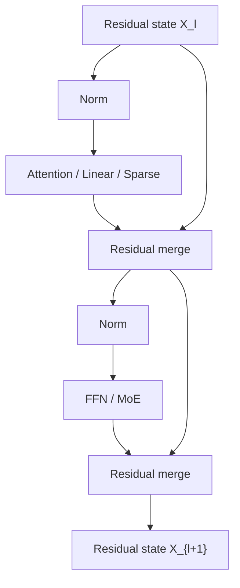
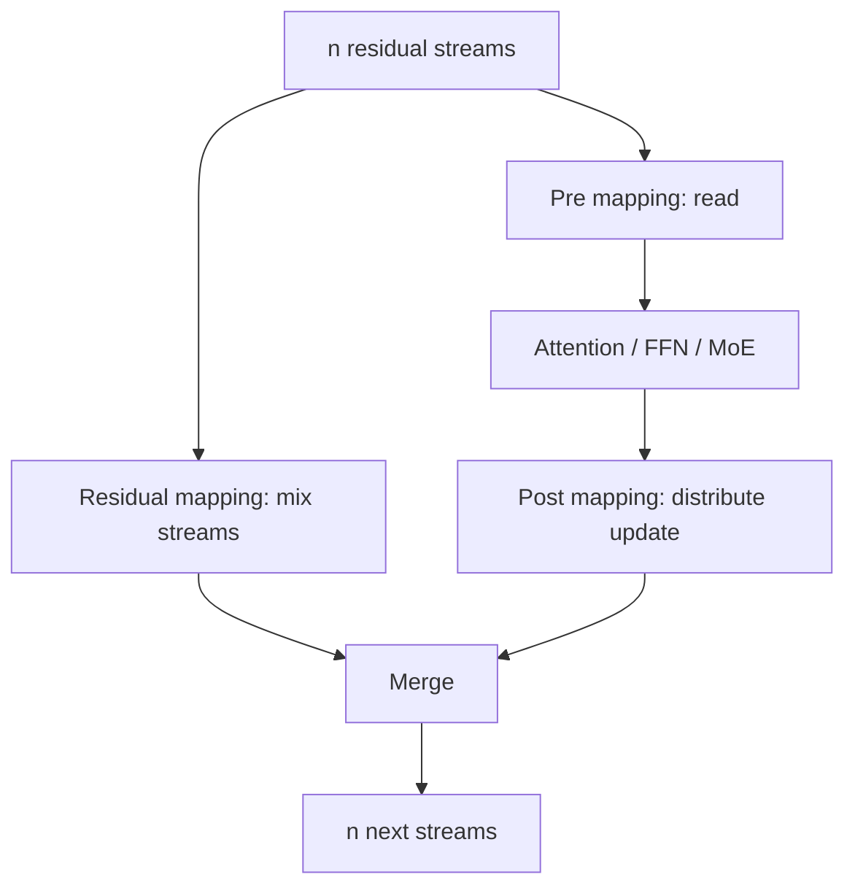
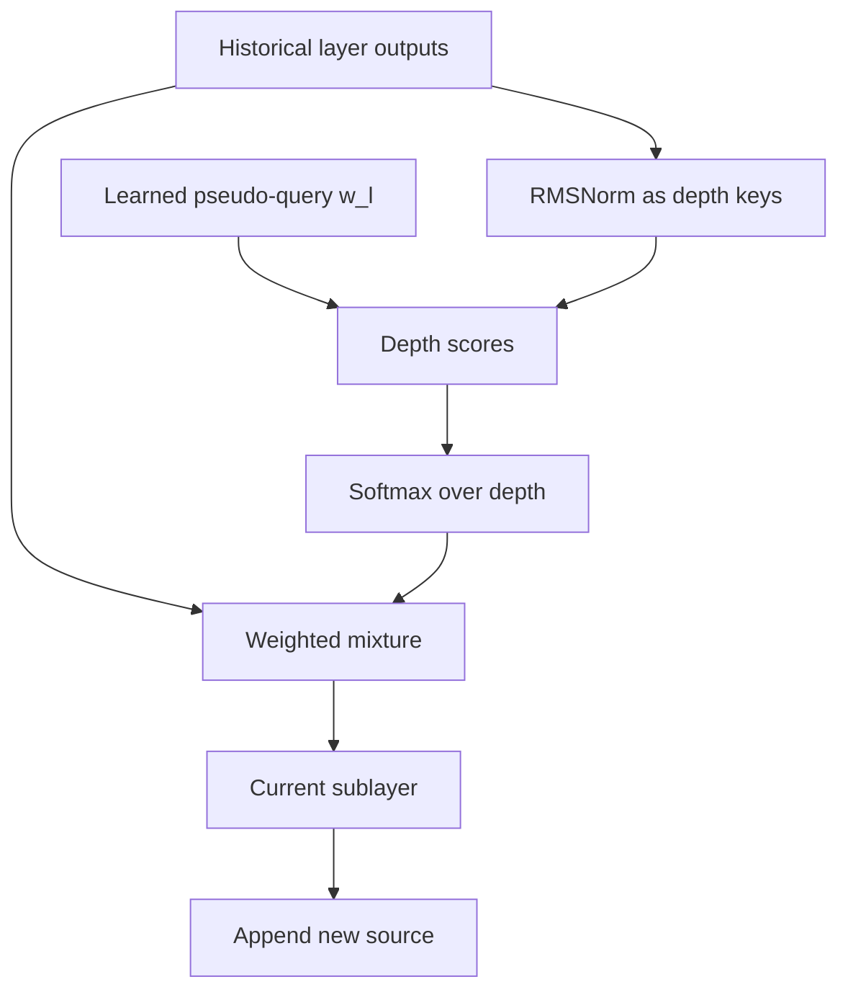
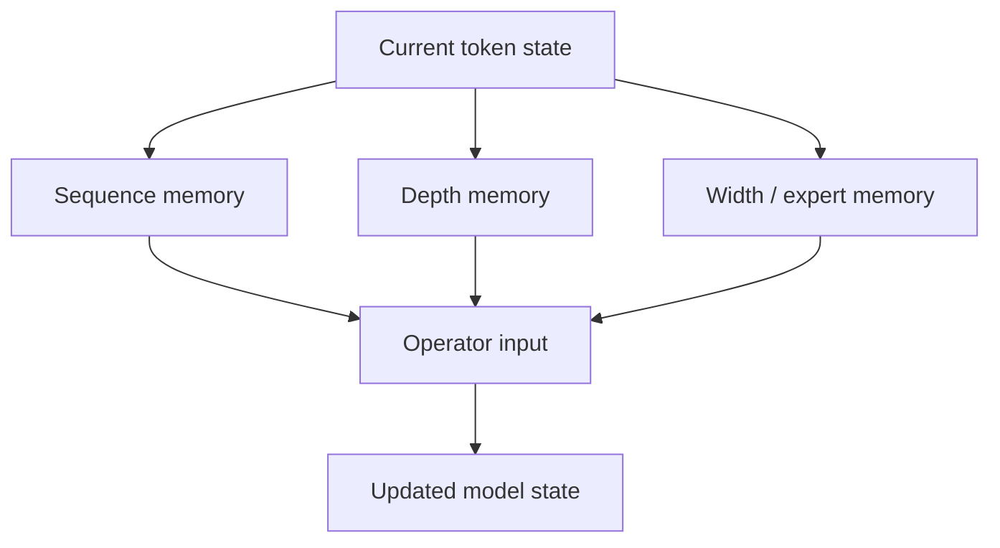

# Residual Evolution：从恒等捷径到多流状态、深度检索与硬件协同

> 本文承接 `Linear-Attention.md` 与 `MoE-Infra.md`。前者讨论沿 sequence 维度保存和检索历史，后者讨论沿 width 维度选择性激活参数；本文转向第三条轴：**信息如何沿 model depth 传播、保存、选择和更新**。
>
> 本文面向模型架构、训练系统与推理 Infra 学习者，按“结构是什么 → 张量如何流动 → 为什么改善训练 → 新的显存、带宽与通信代价 → Kernel/Runtime 如何实现 → 怎样 Benchmark 和排障”组织。论文中的 loss、加速或 token-equivalent 数字均属于作者给定配置，不能直接外推。
>
> **资料版本：截至 2026-09-02。** 2026 年的 AttnRes、mHC、Gated Residual、xHC、Delta AttnRes 等仍在快速演进；本文将公开论文结论、官方模型采用情况与本文推导明确分开。

---

## 缩写与术语

| 缩写 | 全称 | 本文含义 |
|---|---|---|
| ResNet | Residual Network | 通过 identity shortcut 学习残差函数的网络 |
| LN | Layer Normalization | 对单个 token 的 hidden channels 做均值与方差归一化 |
| RMSNorm | Root Mean Square Layer Normalization | 只按均方根缩放、不减均值的归一化 |
| Pre-LN / Post-LN | Pre-/Post-Layer Normalization | 归一化位于子层之前 / 残差合并之后 |
| FFN / MLP | Feed-Forward Network / Multi-Layer Perceptron | Transformer 的逐 token channel mixer |
| HC / DHC | Hyper-Connections / Dynamic Hyper-Connections | 多 residual stream 的静态 / 输入相关连接 |
| mHC | Manifold-Constrained Hyper-Connections | 将 residual mixing 约束到特定流形的 HC |
| GR | Gated Residual | Qwen3.8-Next 的多分支门控残差结构 |
| AttnRes | Attention Residuals | 对历史深度表示做 softmax 选择的残差结构 |
| DWA | Depth-Weighted Average | DenseFormer 的深度加权平均 |
| PP | Pipeline Parallelism | 流水线并行；不同设备负责不同层 |
| TP / CP | Tensor / Context Parallelism | 张量并行 / 上下文并行 |
| HBM | High Bandwidth Memory | GPU 高带宽显存 |
| I/O | Input/Output | 本文主要指 HBM 读写流量，而非磁盘 I/O |
| MFU | Model FLOPs Utilization | 有效模型 FLOPs 相对硬件峰值的利用率 |
| TTFT / TPOT | Time To First Token / Time Per Output Token | 首 token 延迟 / 每输出 token 延迟 |
| SK | Sinkhorn–Knopp | 将正矩阵迭代归一化为近似双随机矩阵的算法 |

---

# 0. 先给结论：Residual 正在从“加法”演化为“深度方向的 Memory System”

标准 Pre-Norm Transformer 使用：

$$
\mathbf{x}_{l+1}
\mathrel{=}
\mathbf{x}_{l}
+
\mathcal{F}_{l}(\operatorname{Norm}(\mathbf{x}_{l})).
$$

它有两个巨大优点：

1. 存在一条接近恒等映射的前向路径；
2. 梯度存在不穿过复杂子层的直接回传路径。

但它也做了一个极强的结构假设：

> 所有层的输出都以固定权重 1 写入同一条 residual stream；后续层只能读取这个不断累加的总和。

当 Transformer 只是重复堆叠相似的 Attention 和 FFN 时，这个假设足够好。现代模型开始混合：

- full / sparse / linear attention；
- shared / routed MoE；
- multimodal adapter；
- memory lookup；
- MTP 与其他 serving-oriented module。

不同 operator 写出的信息具有不同尺度、寿命和用途。继续把它们全部无条件相加，就会暴露三个瓶颈：

$$
\boxed{
\text{Scale Control}
+
\text{Residual Capacity}
+
\text{Depth-wise Addressability}
}
$$

于是出现三条技术路线：

| 路线 | 代表方法 | 核心问题 |
|---|---|---|
| 稳定单流 | Pre-LN、ReZero、LayerScale、Admin、DeepNorm、ResiDual | 怎样让很深的网络可优化 |
| 扩展多流 | AltUp、HC、mHC、Gated Residual、xHC | 一条 $d$ 维 stream 是否成为容量瓶颈 |
| 深度检索 | DenseFormer、AttnRes、Block AttnRes、Delta AttnRes | 后层能否直接选择更早的 representation |

从 Infra 看，瓶颈也随之迁移：

$$
\text{训练不稳定}
\rightarrow
\text{多流 HBM I/O}
\rightarrow
\text{activation memory / PP communication}
\rightarrow
\text{fusion、recompute、low precision、depth cache scheduling}.
$$

因此本文的总纲是：

> **Residual stream 不是无成本的数学符号，而是贯穿所有层、需要持续驻留 HBM、跨 PP stage 传输、被每个子层反复读取和写回的模型内部状态。**

---

# 1. Residual 到底解决了什么？

## 1.1 Plain network 学的是完整映射

没有 shortcut 时：

$$
\mathbf{x}_{l+1}=\mathcal{H}_{l}(\mathbf{x}_{l}).
$$

如果理想映射接近 identity，网络仍要用多个非线性层重新学出：

$$
\mathcal{H}_{l}(\mathbf{x})\approx\mathbf{x}.
$$

深度增加后，Jacobian 连乘：

$$
\frac{\partial \mathbf{x}_{L}}{\partial \mathbf{x}_{l}}
\mathrel{=}
\prod_{i=l}^{L-1}
\frac{\partial\mathcal{H}_{i}}{\partial\mathbf{x}_{i}},
$$

容易造成梯度消失、爆炸或极差的 condition number。

## 1.2 Residual block 只学“变化量”

ResNet 将它改写为：

$$
\mathbf{x}_{l+1}=\mathbf{x}_{l}+\mathcal{F}_{l}(\mathbf{x}_{l}).
$$

如果当前层暂时没有有用变换，只需让：

$$
\mathcal{F}_{l}(\mathbf{x}_{l})\approx0.
$$

这比重新构造 identity 容易得多。

## 1.3 展开以后，identity path 非常清楚

从第 $l$ 层展开到第 $L$ 层：

$$
\mathbf{x}_{L}
\mathrel{=}
\mathbf{x}_{l}
+
\sum_{i=l}^{L-1}\mathcal{F}_{i}(\mathbf{x}_{i}).
$$

反向传播为：

$$
\frac{\partial\mathcal{L}}{\partial\mathbf{x}_{l}}
\mathrel{=}
\frac{\partial\mathcal{L}}{\partial\mathbf{x}_{L}}
\left(
\mathbf{I}
+
\frac{\partial}{\partial\mathbf{x}_{l}}
\sum_{i=l}^{L-1}\mathcal{F}_{i}(\mathbf{x}_{i})
\right).
$$

关键是第一项 $\mathbf{I}$：即使 residual branches 的 Jacobian 暂时很糟，梯度仍有直接路径。

这也是为什么“加一个 skip connection”不是普通 feature fusion，而是在改变优化问题的几何结构。

---

# 2. Residual Stream 是一种什么数据结构？

在 decoder-only Transformer 中，可以把 residual stream 理解为每个 token 携带的工作内存：

$$
\mathbf{X}_{l}\in\mathbb{R}^{B\times T\times d}.
$$

其中：

- $B$：micro-batch size；
- $T$：当前序列 token 数；
- $d$：model hidden size。

每个 Attention、FFN 或 MoE 子层：

1. 从 residual state 读取输入；
2. 计算一个 update；
3. 将 update 写回 residual state。

它同时承担四个角色：

| 角色 | 含义 |
|---|---|
| Feature carrier | 把 token representation 从浅层带到深层 |
| Gradient highway | 提供稳定的反向传播捷径 |
| Cross-operator bus | 连接 Attention、MoE、Linear Attention 等不同算子 |
| Persistent activation | 训练时需要保存或重算，PP 时需要跨设备发送 |

最后一个角色常被架构讨论忽略，却是 Infra 最关心的部分。

---

# 3. Transformer 一层实际上有两次 Residual Update

典型 Pre-RMSNorm decoder block：

$$
\mathbf{H}_{l}
\mathrel{=}
\mathbf{X}_{l}
+
\operatorname{Attn}_{l}(\operatorname{RMSNorm}(\mathbf{X}_{l})),
$$

$$
\mathbf{X}_{l+1}
\mathrel{=}
\mathbf{H}_{l}
+
\operatorname{FFN}_{l}(\operatorname{RMSNorm}(\mathbf{H}_{l})).
$$

若有 $L$ 个 Transformer blocks，通常有约 $2L$ 个 residual-writing sublayers。

这一点对后面的 AttnRes 很重要：

- “48 层模型”可能意味着 96 个 residual sites；
- Full AttnRes 若按 sublayer 保存历史，source 数是 $O(2L)$；
- Block AttnRes 的 block size 也常按 sublayer 而不是 Transformer block 计数。

在 MoE 模型中，第二个 update 可能来自 routed experts；在 hybrid attention 模型中，第一个 update 可能轮流来自 GDN、Sparse Attention 和 MLA。Residual topology 必须容纳不同分布的 update。

---

# 4. Post-Norm 与 Pre-Norm：区别不只是 Norm 放在哪儿

## 4.1 Post-Norm

原始 Transformer 更接近：

$$
\mathbf{x}_{l+1}
\mathrel{=}
\operatorname{Norm}
\left(
\mathbf{x}_{l}+\mathcal{F}_{l}(\mathbf{x}_{l})
\right).
$$

identity path 必须穿过 Norm。优点是每层输出尺度受控，深层 representation 往往更有区分度；缺点是梯度直通路径不再是真正 identity，深层模型初始化和 warmup 更敏感。

## 4.2 Pre-Norm

现代 LLM 常用：

$$
\mathbf{x}_{l+1}
\mathrel{=}
\mathbf{x}_{l}
+
\mathcal{F}_{l}(\operatorname{Norm}(\mathbf{x}_{l})).
$$

identity path 完全绕过 Norm 与子层，因此显著改善深层训练稳定性。

## 4.3 二者的核心 trade-off

| 维度 | Post-Norm | Pre-Norm |
|---|---|---|
| 直通梯度 | 需要穿过 Norm | 存在显式 identity path |
| 初始训练稳定性 | 较敏感，常依赖 warmup/初始化 | 通常更稳 |
| hidden magnitude | 每层重新控制 | 可随深度累积增长 |
| 深层表示差异 | 通常较强 | 可能逐渐相似或贡献被稀释 |
| 现代 decoder LLM | 较少直接使用 | 主流默认 |

不能简单说谁绝对更好。Pre-Norm 用更强的优化稳定性换来了 residual accumulation 问题；后续 HC、mHC、AttnRes、GR 很大程度上是在偿还这笔债。

---

# 5. LayerNorm、RMSNorm 与 Residual 是三个不同层级

RMSNorm：

$$
\operatorname{RMSNorm}(\mathbf{x})
\mathrel{=}
\boldsymbol{\gamma}\odot
\frac{\mathbf{x}}
{\sqrt{\frac{1}{d}\sum_{j=1}^{d}x_{j}^{2}+\epsilon}}.
$$

它解决的是单个 token 内各 channel 的尺度问题。

Residual connection 解决的是跨 layer 的信息与梯度路径问题。

Initialization / residual scaling 解决的是训练早期每个 update 应该多大。

因此：

- 把 LayerNorm 换成 RMSNorm，不等于解决 residual dilution；
- 把 Post-Norm 换成 Pre-Norm，不等于增加 residual capacity；
- 给 residual branch 乘一个 scalar，不等于获得跨深度检索能力；
- 多 residual streams 也不自动保证数值稳定。

这是阅读 residual 论文时最重要的分类边界。

---

# 6. Pre-Norm 为什么会出现 Hidden-State Growth？

展开 Pre-Norm：

$$
\mathbf{x}_{L}
\mathrel{=}
\mathbf{x}_{0}
+
\sum_{i=0}^{L-1}\mathbf{v}_{i},
\qquad
\mathbf{v}_{i}=\mathcal{F}_{i}(\operatorname{Norm}(\mathbf{x}_{i})).
$$

如果各层 update 近似独立、方差相近，则粗略有：

$$
\operatorname{Var}(\mathbf{x}_{L})
\approx
\operatorname{Var}(\mathbf{x}_{0})
+
\sum_{i=0}^{L-1}\operatorname{Var}(\mathbf{v}_{i})
=O(L).
$$

于是 RMS 大约按：

$$
\operatorname{RMS}(\mathbf{x}_{L})=O(\sqrt{L})
$$

增长。若 update 存在强相关，增长还可能更快。

后层在进入子层前会 Norm，所以数值未必立刻爆炸；但一个早期 update 在总和中的相对占比会下降。

假设第 $j$ 层写入的 feature 大小为 $O(1)$，总 stream 大小为 $O(\sqrt{L})$，则其相对贡献粗略下降为：

$$
O\left(\frac{1}{\sqrt{L}}\right).
$$

这就是 residual dilution 的直觉：

> 早期信息并非被删除，而是失去独立地址，只能作为巨大总和中的一小部分继续存在。

---

# 7. Dilution、Representation Collapse 与 Over-Smoothing 不完全相同

这三个术语经常被混用。

## 7.1 Residual dilution

某个 layer update 在累计 state 中的相对权重越来越小。关注的是 **contribution magnitude**。

## 7.2 Representation collapse

相邻深度的 hidden states 余弦相似度越来越高，新层对 representation 的方向改变很小。关注的是 **cross-depth similarity**。

## 7.3 Over-smoothing

不同 token、node 或位置的 representation 逐渐趋同，常见于 GNN，也可出现在深层 Transformer。关注的是 **cross-token similarity**。

Pre-Norm 深层网络可能同时出现前两者，但它们不是同一个数学命题。诊断时至少分别记录：

$$
\cos(\mathbf{x}_{l},\mathbf{x}_{l+1}),
$$

$$
\frac{\lVert\mathbf{v}_{l}\rVert_{2}}
{\lVert\mathbf{x}_{l}\rVert_{2}},
$$

以及不同 token representation 的 pairwise similarity。

---

# 8. 为什么模型越来越异构后，Residual 问题突然变重要？

传统 Transformer 的 operator pattern 很规则：

$$
\text{Attention}\rightarrow\text{FFN}
\rightarrow\text{Attention}\rightarrow\text{FFN}.
$$

现代 hybrid model 可能是：

$$
\text{GDN}\rightarrow\text{MoE}
\rightarrow\text{GDN}\rightarrow\text{MoE}
\rightarrow\text{Sparse Attention}\rightarrow\text{MoE}.
$$

不同 operator 的 update 有不同性质：

| Operator | 写入 residual 的典型信息 |
|---|---|
| Local / recurrent mixer | 局部或压缩历史状态 |
| Full / sparse attention | 精确 token retrieval 和全局重组 |
| Dense FFN | 通用 channel transformation |
| MoE | token-conditional 专家知识 |
| External embedding | 确定性 lookup memory |

如果所有 update 都按单位权重写入一条 stream，模型必须依靠后续层从混合后的总和中重新分离它们。

Residual Evolution 的本质，就是让模型拥有更聪明的内部互联：

- 哪条信息通道应该长期保留；
- 当前 layer 应读取哪种深度特征；
- 新 update 应写入哪些通道；
- 不同 stream 是否需要彼此混合；
- 如何保证整个映射仍接近 identity。

---

# 9. 历史演化：先稳定深度，再扩展深度内存

| 时间 | 工作 | 关键变化 | 后续暴露的问题 |
|---|---|---|---|
| 2015 | Highway Networks | 用 gate 控制 transform/carry | gate 成本与优化复杂度 |
| 2015–2016 | ResNet / Identity Mappings | 固定 identity shortcut | 单流、固定单位写入 |
| 2017 | Transformer Post-LN | Residual + LayerNorm | 深层梯度不稳定 |
| 2018–2020 | Pre-LN | Norm 移入 residual branch | hidden growth、深层稀释 |
| 2019 | Fixup / RMSNorm | 初始化与更轻 Norm | 仍是固定 topology |
| 2020 | ReZero / Admin | 零初始化 gate / 控制 residual dependency | 标量调节表达力有限 |
| 2021 | LayerScale | channel-wise residual scale | 仍只连接相邻层 |
| 2022 | DeepNorm | 深度相关 scaling + initialization | 主要解决稳定性 |
| 2023 | ResiDual / AltUp | 双路径或多分支 state | activation 与带宽增加 |
| 2024 | DenseFormer / HC | 跨深度平均 / 多流动态连接 | HC 数值和 I/O 问题 |
| 2025–2026 | mHC | 双随机约束 + Infra 优化 | 多流 HBM、PP 通信 |
| 2026 | AttnRes | 将历史层变成可寻址 memory | depth cache 与历史读取 |
| 2026 | Gated Residual | 4 分支、逐元素读 gate、标量写 gate | 仍需搬运多流 state |
| 2026 | xHC / Delta AttnRes 等 | 扩展 stream 或改进 routed source | 设计空间快速扩大 |

这条线不是旧方法不断被淘汰。很多现代 LLM 仍使用最简单的 Pre-RMSNorm，因为它的软件成熟度、带宽成本和部署兼容性非常好。

---

# 10. Highway Networks：最早的“读写门控”视角

Highway layer 可以写成：

$$
\mathbf{y}
\mathrel{=}
\mathcal{H}(\mathbf{x})\odot\mathbf{T}(\mathbf{x})
+
\mathbf{x}\odot\mathbf{C}(\mathbf{x}),
$$

常见设置为：

$$
\mathbf{C}(\mathbf{x})=1-\mathbf{T}(\mathbf{x}).
$$

这已经包含现代 Gated Residual 的基本思想：

- transform gate 决定新信息写多少；
- carry gate 决定旧信息保留多少；
- gate 可以依赖当前 input。

ResNet 可以看作 Highway 的极简特例：carry 恒为 1，新分支不显式门控。

ResNet 的胜利提醒了一个工程规律：

> 更强表达力不一定胜过更简单、初始化天然接近 identity、容易做大规模优化的 topology。

2026 年的 GR 又重新引入 gate，但会非常重视 bounded sigmoid、初始化、I/O 和 fusion，正是对这个规律的延续。

---

# 11. ResNet 与 Identity Mapping：真正的里程碑是什么？

Residual Learning 常被概括成“加法”，但更重要的是 **unobstructed identity path**。

若 shortcut 本身引入投影、缩放或激活：

$$
\mathbf{x}_{l+1}
\mathrel{=}
\lambda_l\mathbf{x}_l
+
\mathcal{F}_l(\mathbf{x}_l),
$$

展开后 identity coefficient 变成：

$$
\prod_{i=l}^{L-1}\lambda_i.
$$

只要每层略小于 1，深层连乘就可能衰减；略大于 1，则可能放大。

因此后来的 HC/mHC 不能只说“矩阵很小，不会增加多少 FLOPs”。真正要问的是：

$$
\prod_{i=l}^{L-1}\mathbf{H}^{res}_{i}
$$

是否仍然保持良好条件数、均值和范数。

这正是 mHC 约束 residual mapping 的出发点。

---

# 12. Fixup、SkipInit、ReZero 与 LayerScale：先把 Update 变小

这些方法共享一个直觉：网络初始化时应该接近 identity。

## 12.1 Fixup

Fixup 通过深度相关的权重缩放、部分 zero initialization 和额外 scalar/bias，让无 Norm 的 residual network 也能稳定训练。

它说明：

> Normalization 的部分稳定作用可以由精心设计的参数化和初始化替代。

## 12.2 ReZero

ReZero 使用：

$$
\mathbf{x}_{l+1}
\mathrel{=}
\mathbf{x}_{l}
+
\alpha_l\mathcal{F}_l(\mathbf{x}_{l}),
\qquad
\alpha_l(0)=0.
$$

训练开始时整个网络严格等于 identity；随后 $alpha_l$ 学习打开各层。

## 12.3 LayerScale

LayerScale 把 scalar 扩成 channel-wise diagonal：

$$
\mathbf{x}_{l+1}
\mathrel{=}
\mathbf{x}_{l}
+
\boldsymbol{\gamma}_{l}\odot\mathcal{F}_{l}(\mathbf{x}_{l}),
$$

其中 $\boldsymbol{\gamma}_{l}\in\mathbb{R}^{d}$ 常以很小值初始化。

## 12.4 它们的能力边界

| 方法 | 可学习粒度 | 输入相关 | 增加 stream | 可直接读历史层 |
|---|---:|---:|---:|---:|
| ReZero | 每层 scalar | 否 | 否 | 否 |
| LayerScale | 每层每 channel | 否 | 否 | 否 |
| Highway gate | token/channel | 是 | 否 | 否 |
| HC/mHC | stream mixing | 可是 | 是 | 递归保留 |
| AttnRes | 历史 source | 是 | 历史 cache | 是 |

所以 residual scaling 主要解决 **稳定性和 update strength**，不是深度可寻址性。

---

# 13. Admin 与 DeepNorm：为深层 Transformer 专门控制 Residual Dependency

## 13.1 Admin

Admin 将 Post-LN 不稳定归因于 residual branch 对参数扰动的放大。它通过自适应初始化额外缩放参数，控制训练早期模型对 residual branch 的依赖。

可抽象为：

$$
\mathbf{x}_{l+1}
\mathrel{=}
\operatorname{Norm}
\left(
\omega_l\mathbf{x}_{l}
+
\mathcal{F}_{l}(\mathbf{x}_{l})
\right),
$$

其中 $\omega_l$ 的初始化由模型深度与统计量决定。

## 13.2 DeepNorm

DeepNorm 对 residual path 和参数初始化同时做深度相关缩放：

$$
\mathbf{x}_{l+1}
\mathrel{=}
\operatorname{Norm}
\left(
\alpha\mathbf{x}_{l}
+
\mathcal{F}_{l}(\mathbf{x}_{l};\beta\mathbf{W}_{l})
\right).
$$

$\alpha$ 和 $\beta$ 随层数配置，使模型 update 被理论上界约束。DeepNet 展示了训练超过 1000 层 Transformer 的可能性。

## 13.3 Infra 视角

这类方法非常便宜：

- 不扩大 activation shape；
- 不增加 PP payload；
- scaling 可融合进 residual add 或权重；
- Serving 几乎没有额外 state。

但它们主要让已有单流 topology 更稳定，并没有让后层获得更丰富的深度记忆。

---

# 14. ResiDual、Peri-LN 与 DenseFormer：连接和归一化开始一起变化

## 14.1 ResiDual

ResiDual 同时维护 Pre-LN 和 Post-LN 风格路径，希望获得：

- Pre-LN 的梯度下界；
- Post-LN 的 representation diversity。

它代表一种重要思路：不是在 Pre/Post 之间二选一，而是让两条路径并存。

## 14.2 Peri-LN / Sandwich-style Norm

在子层输入和输出附近同时使用 normalization，控制 Pre-LN 的 hidden-state magnitude growth。

代价是额外 Norm kernel 与 HBM traversal；是否值得取决于训练稳定收益能否覆盖 runtime 成本。

## 14.3 DenseFormer

DenseFormer 在部分层后对历史 hidden states 做 Depth-Weighted Average：

$$
\mathbf{x}_{l}
\mathrel{=}
\sum_{i\in\mathcal{S}_{l}}a_{l,i}\mathbf{h}_{i},
$$

其中 $a_{l,i}$ 是静态可学习权重，$\mathcal{S}_l$ 可用 dilation 降低成本。

DenseFormer 是 AttnRes 的重要前驱：它已经把“深度”视为一个可聚合维度，只是权重通常不依赖当前 token 内容。

---

# 15. 从标量到矩阵：Residual 设计空间如何统一表示？

把第 $l$ 层读入和写出统一写成：

$$
\mathbf{z}_{l}=\mathcal{R}_{l}(\mathcal{M}_{l}),
$$

$$
\mathbf{v}_{l}=\mathcal{F}_{l}(\mathbf{z}_{l}),
$$

$$
\mathcal{M}_{l+1}=\mathcal{W}_{l}(\mathcal{M}_{l},\mathbf{v}_{l}).
$$

$\mathcal{M}_{l}$ 是深度 memory。不同结构只是对它采用不同数据结构：

| 结构 | $\mathcal{M}_{l}$ | Read | Write |
|---|---|---|---|
| Standard residual | 单个向量 | identity / Norm | unit add |
| ReZero / LayerScale | 单个向量 | identity / Norm | scalar/diagonal add |
| HC/mHC | $n$ 条并行 stream | stream mixture | stream mixing + distributed write |
| GR | $n$ 条并行 stream | elementwise gated mixture | per-branch scalar add |
| AttnRes | 所有历史 sources | depth softmax | append new source |
| Block AttnRes | block summaries | block-depth softmax | block accumulation |

这个统一视角能直接导出系统问题：memory 的大小、每层读写次数、是否跨 PP stage、能否低精度存储、是否可块化。

---

# 16. Hyper-Connections：把一条 Residual Stream 扩成 $n$ 条

标准 residual state：

$$
\mathbf{x}_{l}\in\mathbb{R}^{d}.
$$

HC 将其扩为：

$$
\mathbf{X}_{l}\in\mathbb{R}^{n\times d}.
$$

每个 token 不再只有一个 hidden vector，而有 $n$ 条 residual streams。

一个 HC sublayer 可以抽象为：

$$
\mathbf{h}_{l}^{pre}
\mathrel{=}
\mathbf{H}_{l}^{pre}\mathbf{X}_{l},
$$

$$
\mathbf{v}_{l}
\mathrel{=}
\mathcal{F}_{l}(\mathbf{h}_{l}^{pre}),
$$

$$
\mathbf{X}_{l+1}
\mathrel{=}
\mathbf{H}_{l}^{res}\mathbf{X}_{l}
+
\mathbf{H}_{l}^{post}\mathbf{v}_{l}.
$$

其中：

- $\mathbf{H}^{pre}$：从多 stream 读取一个 layer input；
- $\mathbf{H}^{post}$：将 layer output 写回多个 stream；
- $\mathbf{H}^{res}$：在不经过 layer function 的情况下混合旧 streams。

关键点：主 operator $\mathcal{F}$ 的输入输出仍是 $d$，所以昂贵的 Attention/FFN FLOPs 不按 $n$ 倍增加；增加的主要是小投影、elementwise 运算与 residual state I/O。

---

# 17. Dynamic Hyper-Connections：每个 Token 可以拥有不同拓扑

DHC 的 mapping 由静态项和输入相关项组成：

$$
\mathbf{H}_{l}^{*}
\mathrel{=}
\mathbf{B}_{l}^{*}
+
\alpha_{l}^{*}
\phi(\boldsymbol{\Theta}_{l}^{*}\widetilde{\mathbf{X}}_{l}),
$$

其中 $*\in\{pre,post,res\}$，$\widetilde{\mathbf{X}}_l$ 是 normalized state。

如果 mapping 按 token 预测，则同一层中：

- 代码 token 可以偏向一组 stream；
- 自然语言 token 可以偏向另一组；
- 不同位置可以形成不同深度路径。

这相当于在 depth 方向做 soft routing。

但动态 topology 也带来系统代价：

1. mapping coefficients 成为 activation；
2. backward 需要保留或重算它们；
3. 每个 token 的 mixing 不同，难以提前折叠为静态矩阵；
4. 多 stream state 要反复从 HBM 读取；
5. PP stage boundary 的 activation payload 按 $n$ 扩大。

---

# 18. HC 的 Sequential–Parallel Duality

HC 的 connection matrix 可以学成接近串行：

$$
\mathcal{F}_{2}(\mathcal{F}_{1}(\mathbf{x})),
$$

也可以学成接近并行：

$$
\mathcal{F}_{1}(\mathbf{x})+\mathcal{F}_{2}(\mathbf{x}),
$$

还可以是二者之间的 soft mixture。

这说明残差 topology 不只是“信息保留多少”，它甚至在决定 operator 的有效组合方式。

从系统角度要注意：

- 物理执行顺序通常仍是静态的；
- “动态 rearrange layers”描述的是信息依赖强度，不代表 runtime 自动跳过 kernel；
- 若没有显式 sparse routing，DHC 不会像 MoD 那样直接减少 layer FLOPs；
- 它改善的是表示与优化，而非天然减少计算。

---

# 19. 为什么原始 HC 在大规模训练中不够稳定？

跨多层展开 HC：

$$
\mathbf{X}_{L}
\mathrel{=}
\left(
\prod_{i=l}^{L-1}\mathbf{H}_{i}^{res}
\right)\mathbf{X}_{l}
+
\text{all written updates}.
$$

即使每个 $\mathbf{H}_{i}^{res}$ 只是略微放大某些方向，连乘后也可能：

- 最大奇异值快速增长；
- 最小奇异值快速衰减；
- 某些 stream 吞噬其他 stream；
- forward signal 与 backward gradient 同时失稳。

小规模实验中，训练可能仍能适应；到了数十亿参数、长训练和低精度条件下，微小偏差会跨深度积累。

这与标准 residual 的 identity path 形成鲜明对比：

$$
\prod_{i=l}^{L-1}\mathbf{I}=\mathbf{I}.
$$

mHC 的核心不是“多做一次归一化”，而是恢复这种可组合的稳定性。

---

# 20. mHC：为什么使用双随机矩阵？

mHC 将 residual mapping 约束为：

$$
\mathbf{H}^{res}_{l}\ge0,
$$

$$
\mathbf{H}^{res}_{l}\mathbf{1}=\mathbf{1},
\qquad
\mathbf{1}^{\top}\mathbf{H}^{res}_{l}=\mathbf{1}^{\top}.
$$

即每一行、每一列之和都为 1。

这样的矩阵位于 Birkhoff polytope（双随机矩阵集合）中。

## 20.1 行和为 1

每条输出 stream 是输入 streams 的 convex combination，不会无界放大均值。

## 20.2 列和为 1

所有输入 stream 的总质量被守恒，避免某条输入被系统性复制或丢弃。

## 20.3 乘法闭包

两个双随机矩阵的乘积仍是双随机矩阵。因此跨很多层：

$$
\prod_i\mathbf{H}^{res}_{i}
$$

仍保持同类约束。

## 20.4 $n=1$ 的退化

唯一双随机标量就是 1，因此：

$$
n=1\Rightarrow\mathbf{H}^{res}=1,
$$

恢复标准 identity mapping。

---

# 21. Sinkhorn–Knopp 如何把任意 Logits 变成近似双随机矩阵？

设预测的 residual logits 为：

$$
\widetilde{\mathbf{H}}^{res}\in\mathbb{R}^{n\times n}.
$$

先变正：

$$
\mathbf{M}^{(0)}=\exp(\widetilde{\mathbf{H}}^{res}).
$$

然后反复执行列归一化和行归一化：

$$
\mathbf{M}^{(t)}
\mathrel{=}
\mathcal{T}_{row}
\left(
\mathcal{T}_{col}(\mathbf{M}^{(t-1)})
\right).
$$

最终：

$$
\mathbf{H}^{res}\approx\mathbf{M}^{(t_{max})}.
$$

mHC 论文实验采用 $t_{max}=20$。

需要注意：

- 有限次迭代只得到近似双随机；
- exp、除法与迭代 backward 对低精度敏感；
- $n$ 通常很小，例如 4，所以 FLOPs 不大；
- 真正成本常来自 kernel launch、intermediate 和 HBM traversal；
- 自定义 backward 可在片上重算迭代中间量，避免全部保存。

---

# 22. mHC 的完整前向张量流

对 batch 中所有 token，可将 state 写成：

$$
\mathbf{X}_{l}\in\mathbb{R}^{N_{tok}\times n\times d}.
$$

## 22.1 生成动态 mapping

将 streams 展平：

$$
\operatorname{vec}(\mathbf{X}_{l})
\in\mathbb{R}^{N_{tok}\times nd}.
$$

经 RMSNorm 和小线性投影得到：

$$
n+n+n^{2}
$$

个系数，分别对应 pre、post、res mapping。

## 22.2 约束 mapping

$$
\mathbf{H}^{pre}=\sigma(\widetilde{\mathbf{H}}^{pre}),
$$

$$
\mathbf{H}^{post}=2\sigma(\widetilde{\mathbf{H}}^{post}),
$$

$$
\mathbf{H}^{res}=\operatorname{SK}(\widetilde{\mathbf{H}}^{res}).
$$

## 22.3 Read

$$
\mathbf{h}^{pre}
\mathrel{=}
\sum_{s=1}^{n}H^{pre}_{s}\mathbf{X}_{l,s}
\in\mathbb{R}^{d}.
$$

## 22.4 Main operator

$$
\mathbf{v}_{l}=\mathcal{F}_{l}(\mathbf{h}^{pre})
\in\mathbb{R}^{d}.
$$

## 22.5 Residual mix 与 write

$$
\mathbf{X}_{l+1}
\mathrel{=}
\mathbf{H}^{res}\mathbf{X}_{l}
+
\mathbf{H}^{post}\mathbf{v}_{l}^{\top}.
$$

main operator 不变，但 residual wrapper 已经从一次 add 变成一个小型动态 network。

---

# 23. mHC 为什么是 Memory-Bound，而不是 Compute-Bound？

标准 residual merge 每 token 粗略需要：

- 读旧 state：$d$；
- 读 update：$d$；
- 写新 state：$d$。

约为：

$$
3d\ \text{elements of traffic}.
$$

HC/mHC 需要维护 $n$ 条 stream，并多次生成、读取、混合 mapping。论文给出的未融合分析中，I/O 近似按 $n$ 增长。

当 $n=4,d=7168$ 时，每 token residual state 本身为：

$$
4\times7168=28672\ \text{elements}.
$$

BF16 大约：

$$
56\ \text{KiB/token}.
$$

若一层对它做多次完整 traversal，算术强度很低：只有少量 multiply/add，却搬运大量 byte。因此：

$$
T_{mHC}
\approx
\max\left(
\frac{FLOPs}{P_{compute}},
\frac{Bytes}{BW_{HBM}}
\right)
$$

通常由第二项主导。

这也是为什么只报告“额外 FLOPs 很小”会严重误导。

---

# 24. mHC 的 Kernel Fusion 为什么不是可选优化？

若按 eager operators 实现：

1. RMSNorm 读取 $nd$ state；
2. Linear 再读取 normalized state；
3. sigmoid/tanh 各自 launch；
4. Sinkhorn 每轮多个 launch；
5. pre mix 重新读取 state；
6. residual mix 再次读取 state；
7. merge 和 write 又一次 traversal。

性能会被 launch 与 HBM traffic 吞噬。

mHC 的关键系统优化包括：

- 将 RMS 除法重排到小矩阵投影之后；
- 吸收 RMSNorm weight 到投影参数；
- 合并对 expanded state 的扫描；
- 在一个 kernel 内完成小系数的 sigmoid 与组合；
- 在一个 kernel 内完成全部 Sinkhorn iterations；
- backward 片上重算 SK intermediate；
- mixed precision：state 用 BF16，系数和关键累积用 FP32/TF32。

作者报告在 $n=4$ 的大模型训练中，通过这些设计将额外训练开销控制到约 6.7%。这是作者特定平台结果，不是朴素 PyTorch 实现的预期值。

---

# 25. mHC Backward：为什么需要分块 Recompute？

训练时需要求：

- main operator input 的梯度；
- $\mathbf{H}^{pre}$、$\mathbf{H}^{post}$、$\mathbf{H}^{res}$ 的梯度；
- mapping projection parameters 的梯度；
- expanded residual state 的梯度。

如果每层保存所有 mapping intermediate，activation memory 会很大。

mHC 采用跨 $L_r$ 个连续 layers 的分块重算。常驻保存 block 首状态：

$$
n d\left\lceil\frac{L}{L_r}\right\rceil,
$$

重算 active block 的瞬时 memory 约：

$$
(n+2)dL_r.
$$

总量近似：

$$
M(L_r)
\mathrel{=}
nd\left\lceil\frac{L}{L_r}\right\rceil
+
(n+2)dL_r.
$$

忽略取整，其最优 block size：

$$
L_r^{*}
\approx
\sqrt{\frac{nL}{n+2}}.
$$

这是一种很典型的 memory–compute trade-off：少存 intermediate，多做轻量重算。

---

# 26. mHC 与 Pipeline Parallelism：Residual State 直接变成通信 Payload

标准 PP stage boundary 传：

$$
B\times T\times d.
$$

$n$-stream mHC 需要传：

$$
B\times T\times n\times d.
$$

因此边界 activation byte 近似扩大 $n$ 倍。

对长 sequence、较大 micro-batch 和跨节点 PP，这会造成：

- P2P send/recv latency 上升；
- pipeline bubble 变大；
- 与 MoE All-to-All 竞争 NIC；
- activation buffer 占用增加；
- backward gradient payload 同样扩大。

mHC 的实现将 recompute block boundary 与 PP stage boundary 对齐，并扩展 DualPipe overlap：

- stage 首 state 已缓存，可让 recompute 与通信解耦；
- 部分 post/res kernel 使用高优先级 compute stream；
- 避免长时间 persistent kernel 阻塞需要抢占的通信路径；
- Attention、MoE communication、PP P2P 与 residual recompute 需要共同排程。

这说明模型 topology 已经直接决定 distributed schedule。

---

# 27. Attention Residuals：把 Depth 当成另一条 Attention 轴

标准 residual：

$$
\mathbf{h}_{l}
\mathrel{=}
\sum_{i=0}^{l-1}\mathbf{v}_{i},
$$

所有历史 update 权重固定为 1。

AttnRes 改成：

$$
\mathbf{h}_{l}
\mathrel{=}
\sum_{i=0}^{l-1}
\alpha_{i\rightarrow l}\mathbf{v}_{i},
$$

$$
\sum_{i=0}^{l-1}\alpha_{i\rightarrow l}=1.
$$

权重由 depth-wise softmax 决定。

这里的 attention 不是 token 对 token：

- sequence attention 的 key/value index 是历史 token；
- AttnRes 的 key/value index 是历史 layer output；
- 每个 token 独立地在 depth 维选择 source。

因此可以把现代模型看成二维 memory：

| 维度 | 被寻址对象 | 代表机制 |
|---|---|---|
| Sequence | 历史 token / compressed state | MLA、Sparse、Linear Attention |
| Depth | 历史 layer representation | AttnRes、DenseFormer、HC-family |

---

# 28. Full AttnRes 的公式与数据流

定义 sources：

$$
\mathbf{v}_{0}=\text{token embedding},
$$

$$
\mathbf{v}_{i}=\mathcal{F}_{i}(\mathbf{h}_{i}),\qquad i\ge1.
$$

第 $l$ 个 sublayer 有一个 learned pseudo-query：

$$
\mathbf{w}_{l}\in\mathbb{R}^{d}.
$$

对每个 token，score 为：

$$
s_{i\rightarrow l}
\mathrel{=}
\mathbf{w}_{l}^{\top}
\operatorname{RMSNorm}(\mathbf{v}_{i}).
$$

depth softmax：

$$
\alpha_{i\rightarrow l}
\mathrel{=}
\frac{\exp(s_{i\rightarrow l})}
{\sum_{j<l}\exp(s_{j\rightarrow l})}.
$$

read：

$$
\mathbf{h}_{l}
\mathrel{=}
\sum_{i<l}\alpha_{i\rightarrow l}\mathbf{v}_{i}.
$$

然后：

$$
\mathbf{v}_{l}=\mathcal{F}_{l}(\mathbf{h}_{l})
$$

作为一个新 source 追加到 depth memory。

---

# 29. Pseudo-Query 是静态参数，为什么 Attention Weight 仍是输入相关的？

$\mathbf{w}_l$ 对所有样本固定，但 key：

$$
\operatorname{RMSNorm}(\mathbf{v}_{i,b,t})
$$

依赖 batch $b$ 和 token $t$ 的实际 representation。

所以：

$$
\alpha_{i\rightarrow l,b,t}
$$

仍会随输入内容变化。

这是一种非常便宜的 content-dependent routing：

- 每层只增加一个 $d$ 维 query；
- 不需要再从 input 投影完整 Q；
- score 是 $O(N_{source}d)$；
- softmax 只沿很短的 depth 轴。

RMSNorm 的作用也很关键：如果不归一化，深层 source 可能仅因 magnitude 更大就获得更高 score，而非因为内容更匹配。

---

# 30. AttnRes 是 Replacement Routing，不是“在原 Residual 上再加 Attention”

标准 residual：

$$
\mathbf{x}_{l+1}=\mathbf{x}_{l}+\mathbf{v}_{l}.
$$

Full AttnRes 更接近：

$$
\mathbf{h}_{l}=\operatorname{DepthRead}(\mathbf{v}_{0:l-1}),
$$

$$
\mathbf{v}_{l}=\mathcal{F}_{l}(\mathbf{h}_{l}),
$$

然后将 $\mathbf{v}_{l}$ 作为独立 source 保存。

如果先把所有 source 累加，再做 depth attention，会重新制造冗余；如果同时保留普通 cumulative residual，又无约束地加 routed result，尺度控制也会更复杂。

因此实现时必须明确：

- routed sources 是 raw sublayer outputs 还是 cumulative states；
- update 是 append、replace 还是 additive write；
- embedding 是否作为 source 0；
- Attention 和 MLP 是否各自拥有 query；
- block boundary 如何形成 summary。

这些选择会改变算法语义，不能只看类名 `ResidualAttention`。

---

# 31. Full AttnRes 的真正问题：$O(Ld)$ Depth Memory

对于每个 token，Full AttnRes 保存所有历史 sublayer outputs：

$$
\mathcal{M}_{l}
\mathrel{=}
\{\mathbf{v}_{0},\ldots,\mathbf{v}_{l-1}\}.
$$

memory 随深度增长：

$$
M_{depth}=O(Ld).
$$

训练时若 batch tokens 为 $N_{tok}$、dtype bytes 为 $b$：

$$
B_{sources}
\approx
N_{tok}\times(2L+1)\times d\times b.
$$

例如：

- $N_{tok}=32768$；
- 48 Transformer blocks，即约 96 sublayers；
- $d=4096$；
- BF16 为 2 byte。

仅 raw sources 理论量级约：

$$
32768\times97\times4096\times2
\approx24.25\ \text{GiB}.
$$

这还未包括 main operator activations、gradients 和 optimizer state。

因此 Full AttnRes 很适合研究上界，但直接扩到大模型并不现实。

---

# 32. Block AttnRes：把深度历史压缩成 Block Summaries

将 $2L$ 个 sublayers 分为 $N_b$ 个 blocks。

block 内仍按普通 residual 累积：

$$
\mathbf{p}_{l}
\mathrel{=}
\sum_{i\in\text{current partial block}}\mathbf{v}_{i}.
$$

每个已完成 block 形成 summary：

$$
\mathbf{b}_{k}
\mathrel{=}
\sum_{i\in\mathcal{B}_{k}}\mathbf{v}_{i}.
$$

当前层只对以下 sources 做 depth attention：

1. token embedding；
2. 已完成 block summaries；
3. 当前 partial-block summary。

于是 source 数从：

$$
O(L)
$$

降到：

$$
O(N_b),\qquad N_b\ll L.
$$

Kimi 报告中约 8–10 个 sources 即可保留 Full AttnRes 的大部分收益。

这和长上下文中的 sequence compression 非常相似：

- Sparse/Linear Attention 压缩 token history；
- Block AttnRes 压缩 layer history。

---

# 33. Block Size 的 Trade-off

设每个 depth block 含 $S$ 个 sublayers，则：

$$
N_b\approx\frac{2L}{S}.
$$

## 小 $S$

- source 多；
- 深度检索粒度细；
- 更接近 Full AttnRes；
- memory、score 和 PP communication 更大。

## 大 $S$

- source 少；
- memory 与 I/O 更低；
- block 内不同 operator 被压成一个 sum；
- 可能丢失 Attention/MLP update 方向信息。

因此 $S$ 不是普通性能 knob，而是模型质量与 Infra 成本共同决定的 architecture hyperparameter。

可类比 sequence memory：

| Depth routing | Sequence routing |
|---|---|
| block size $S$ | token block / page size |
| block summary | compressed KV / recurrent state |
| depth softmax | sparse index / attention |
| partial block | recent local window |

---

# 34. Block AttnRes 的两阶段计算为什么重要？

朴素实现中，每个 sublayer 都重新读取所有历史 block summaries：

$$
\text{many small depth reads}
\Rightarrow
\text{repeated HBM traffic}.
$$

更高效的实现将计算拆为两部分：

## Phase 1：批量计算历史完整 blocks

同一 depth block 中多个 sublayers 的 pseudo-queries 一次性与历史 summaries 做 batched score / weighted read。

优点：

- 复用历史 summaries；
- 把多个小 GEMV/GEMM 合并；
- 提高 L2 cache reuse；
- 减少 kernel launches。

## Phase 2：顺序处理当前 partial block

当前 block 内 source 会随着 sublayer 执行而变化，必须按顺序更新 partial summary。

使用 online softmax 将：

- 已完成 blocks 的 score statistics；
- 当前 partial source 的 score/value

合并，而不重算全部历史。

这是 FlashAttention 思想在 depth 维的一个小型版本：让 mathematically global 的 softmax 通过分块、在线归并减少 memory traffic。

---

# 35. AttnRes 与 Pipeline Parallelism

普通 PP 只需将 stage 输出传给下一个 stage。AttnRes 的后续 stage 还可能读取更早 stage 的 block summaries。

朴素方案有两种，都不理想：

1. 每个 stage 把所有历史 summaries 转发下去；
2. 后续 stage 按需向前面的 stage 请求。

第一种增加 activation payload，第二种制造细粒度依赖与 latency。

Block AttnRes 可采用 cache-based pipeline communication：

- block summary 在经过 stage boundary 时发送并缓存；
- 同一 summary 不为每个后续 sublayer 重复发送；
- stage 内 query 对本地 cache 批量计算；
- backward 对 cache 的 gradient 按依赖反向汇聚；
- depth block boundary 最好与 PP partition 协同设计。

需要监控：

$$
B_{PP}^{AttnRes}
\mathrel{=}
B_{normal\ activation}
+
B_{depth\ summaries}.
$$

如果 depth summaries 与 MoE EP traffic 同时跨 NIC，必须将二者放进同一个网络带宽预算。

---

# 36. 标准 Residual、mHC 与 AttnRes 的 I/O 对比

以每 token、每 residual sublayer、hidden width $d$ 为单位，论文给出的一组代表性 forward memory I/O：

| 方法 | Depth state | 论文代表性 I/O | 主要成本 |
|---|---|---:|---|
| Standard residual | $d$ | $3d$ | 一次读旧 state、读 update、写新 state |
| Full AttnRes | $O(Ld)$ sources | 约 $24d$（给定配置） | 读取很多历史 sources |
| Block AttnRes | $O(N_bd)$ | 约 $5.5d$ | block summaries + partial state |
| mHC，$n=4$ | $4d$ persistent streams | 约 $34d$ | 多次多流 read/mix/write |

这些数字来自特定论文的 operation accounting，不等价于端到端 latency。真正 runtime 还取决于：

- dtype；
- source/block 数；
- fusion；
- batch tokens；
- cache hit；
- PP topology；
- main operator 是否足够大以隐藏 residual overhead。

但它清楚说明：

> residual module 的 FLOPs 可能很小，memory I/O 却足以成为新瓶颈。

---

# 37. Kimi K3 如何使用 AttnRes？

Kimi K3 将模型扩展拆成三个方向：

| 方向 | 结构 |
|---|---|
| Sequence mixing | KDA + Gated MLA hybrid |
| Width mixing | Stable LatentMoE |
| Depth mixing | Attention Residuals |

每个 architecture block 中有多种 token mixer 和 MoE operator。AttnRes 让当前 module 能从：

- embedding；
- 当前 partial block；
- 之前 completed blocks

中选择 representation。

这非常适合 hybrid attention：

- recurrent KDA 把长历史压进有限 state；
- MLA 保留精确 attention 路径；
- AttnRes 又允许后层重新读取包含某次全局 attention update 的较早 depth summary。

因此 sequence memory 与 depth memory 是互补的：某个 token-level 细节可能先由 MLA 检索出来，再被 AttnRes 沿深度保留给后续层。

Kimi K3 技术报告采用 Block AttnRes，而不是无法扩展的 Full AttnRes。

---

# 38. Qwen Gated Residual：先把 Stream 变宽，再把 Read 做细

Qwen3.8-Flash-Next 的出发点是：

1. 仅仅把 residual state 扩成多分支就有明显收益；
2. HC/mHC 的 full residual mixing $\mathbf{H}^{res}$ 会增加整份 state traversal；
3. 每 channel 对不同 stream 的需求可能不同；
4. 读写必须 bounded，才能兼顾稳定性与 FP8 state。

于是 GR 使用：

- $n_r=4$ residual branches；
- 每个 branch 独立 RMSNorm；
- elementwise、input-dependent read gate；
- per-branch scalar write gate；
- 不做 branch-to-branch $\mathbf{H}^{res}$ mixing。

它把表达力集中在“怎样读”，把“怎样写”保持便宜，把最昂贵的 stream mixing 删除。

---

# 39. Gated Residual 的完整公式

残差状态：

$$
\mathbf{R}^{(l)}
\in
\mathbb{R}^{n_r\times d}.
$$

## 39.1 Branch-wise RMSNorm

$$
\widehat{\mathbf{R}}_{i}
\mathrel{=}
\operatorname{RMSNorm}
(\mathbf{R}_{i};\boldsymbol{\gamma}_{i}).
$$

## 39.2 Elementwise read gate

将所有 branches 展平后经过 low-rank bottleneck：

$$
\mathbf{G}
\mathrel{=}
\operatorname{unvec}
\sigma
\left(
\mathbf{W}_{u}
\operatorname{SiLU}
\left(
\frac{1}{n_r}\mathbf{W}_{d}
\operatorname{vec}(\widehat{\mathbf{R}})
\right)
\right),
$$

$$
\mathbf{G}\in\mathbb{R}^{n_r\times d}.
$$

读取：

$$
\mathbf{x}
\mathrel{=}
\frac{1}{n_r}
\sum_{i=1}^{n_r}
\mathbf{G}_{i}\odot\widehat{\mathbf{R}}_{i}.
$$

每个 channel 可以从不同 branch 读取不同强度。

## 39.3 Main operator

$$
\mathbf{y}=\mathcal{F}_{l}(\mathbf{x}).
$$

## 39.4 Per-branch scalar write gate

$$
\mathbf{s}
\mathrel{=}
2\sigma
\left(
\frac{1}{n_r}\mathbf{W}_{w}
\operatorname{vec}(\widehat{\mathbf{R}})
\right),
$$

$$
\mathbf{R}'_{i}
\mathrel{=}
\mathbf{R}_{i}+s_i\mathbf{y}.
$$

$s_i\in(0,2)$，是 bounded write strength。

---

# 40. GR 与 HC/mHC 到底差在哪儿？

| 设计点 | HC/mHC | Gated Residual |
|---|---|---|
| Streams | 多流 | 多分支 |
| Read | 常为 per-stream scalar mixture | per-stream、per-channel elementwise gate |
| Write | per-stream coefficient | per-branch scalar gate |
| Stream mixing | 有 $\mathbf{H}^{res}$ | 删除 |
| 稳定约束 | mHC 用双随机 manifold | sigmoid-bounded gate + identity add |
| 主要 I/O | 生成并应用三类 mapping | 一次 fused read + 一次 fused write |
| 低精度 state | 可做但约束复杂 | 官方实现明确使用 FP8 state |

GR 的逻辑非常 Infra-oriented：

> 与其花一次 full-state traversal 在 branch mixing 上，不如把同样预算用于更细粒度的 read gate。

Qwen 的 ablation 显示，删除 $\mathbf{H}^{res}$ 在其设置中没有带来质量损失，同时减少一次完整 residual-state read。这个结论不能自动推广到所有模型，但它给出了清晰的设计方法：以 **accuracy per byte moved** 而非 accuracy per FLOP 评估 residual topology。

---

# 41. GR 为什么可以替代 Pre-Norm，而不是叠加在它前面？

GR read 已经包含：

1. 每 branch RMSNorm；
2. elementwise bounded gate；
3. branch aggregation。

所以 main operator 直接接收：

$$
\mathbf{x}=\operatorname{GRRead}(\mathbf{R}),
$$

而不再额外执行：

$$
\operatorname{RMSNorm}(\mathbf{x}).
$$

否则会：

- 多一次 HBM traversal；
- 多一个 Norm kernel；
- 改变 gate 所控制的尺度语义；
- 可能抵消 branch-specific gain。

这是典型的 architecture–kernel co-design：不是把新模块机械地插进旧 block，而是重新划分 operator boundary。

---

# 42. GR 的 FP8 Residual State 与 Fused Read/Write

多分支 state 的最大问题仍是 HBM byte。

BF16：

$$
2\ \text{bytes/element}.
$$

FP8：

$$
1\ \text{byte/element}.
$$

四分支 FP8 的 raw state bytes 等于两分支 BF16，也约为单流 BF16 的 2 倍，而不是 4 倍。

Qwen 的设计让多处 gate 限制写入 magnitude，使 state dynamic range 更适合 FP8。实现上：

- read kernel 一次加载 FP8 branches；
- 完成 dequant、RMS reduction、low-rank gate、weighted reduce；
- 输出 main operator 的 BF16/FP8 input；
- write kernel 计算 scalar gates、融合 add 和 requant；
- 每个方向只遍历 expanded state 一次。

风险包括：

- per-tensor scale 过粗导致某 branch 精度差；
- amax outlier 使有效 mantissa 利用率下降；
- scale update 不同步造成 train/infer mismatch；
- residual state 比普通 activation 生命周期更长，误差会跨层积累。

因此低精度 residual 需要单独的 error audit，而不能只看最终 logits 一次误差。

---

# 43. Qwen 的 Branch Analysis 给了什么启发？

由于 GR 删除了 branch mixing，每条 branch 都是可解释的 accumulator：

$$
\mathbf{R}^{(v)}_{c}
\mathrel{=}
\mathbf{R}^{(0)}_{c}
+
\sum_{u<v}s^{(u)}_{c}\mathbf{y}^{(u)}.
$$

Qwen 报告观察到：

- 某一 branch 主要保存浅层 attention output；
- 其余 branches 更偏局部更新；
- softmax attention layers 对长期 branch 的读取更强；
- GR 不是简单增加所有 long skip，而是重分配路径：强化相邻与很长路径，削弱部分中距离路径。

这说明多 stream 的价值不只是“宽一点”：

> 模型会自发形成不同时间常数或深度寿命的内部通道。

它与 sequence model 的 multi-timescale memory 非常相似。

---

# 44. DeepSeek V4、Kimi K3、Qwen3.8 的三种答案

| 模型 | Residual 结构 | Memory 形式 | 主要优点 | 主要 Infra 成本 |
|---|---|---|---|---|
| DeepSeek V4 | mHC | 4 条递归 multi-stream | 受约束的跨 stream mixing，稳定且表达力强 | expanded-state I/O、recompute、PP payload |
| Kimi K3 | Block AttnRes | 历史 block summaries | 可直接选择较早 depth representation | depth cache、历史 summary 读取、PP cache |
| Qwen3.8-Flash-Next | 4-branch GR | 独立 accumulators | elementwise read、bounded write、无 full mixing | 4 分支 state traffic，需 FP8 与 fusion |

它们并不是同一种结构的三个名字：

- mHC 是 **multi-stream recurrence**；
- AttnRes 是 **depth-wise retrieval**；
- GR 是 **multi-branch gated read/write**。

三者的共同点是：

$$
\text{Residual Capacity}
\not\equiv
\text{Model Hidden Width}.
$$

模型开始把 residual state 本身当作独立 scaling axis。

---

# 45. 为什么 GLM 不应被强行塞进同一条 Residual 路线？

截至本文资料边界，GLM-5 的公开技术报告重点是 DSA、MoE 与异步 Agent RL，并没有像 DeepSeek V4、Kimi K3、Qwen3.8-Next 那样把新的 residual topology 作为核心公开贡献。

这不意味着 GLM 系列没有训练稳定或 residual 工程，而是：

> 公开证据不足时，不应仅凭模型家族相近就推断其采用 mHC、AttnRes 或 GR。

阅读模型报告时需要区分：

- 明确写入 architecture/config 的采用事实；
- 某团队公开研究但未说明用于主模型；
- 社区实现或兼容代码；
- 本文基于系统趋势的推测。

Residual 结构对 checkpoint tensor layout 和 runtime 支持影响很大，错误归类会直接误导部署。

---

# 46. 其他有里程碑意义的 Depth-Mixing 工作

## 46.1 Transparent Attention / DLCL / ELC-BERT

让上层直接组合多个较低层 representation，是 depth aggregation 的早期路线。

## 46.2 DenseFormer

使用静态 learnable depth weights，是从固定 residual sum 到 depth-selective mixing 的关键过渡。

## 46.3 Alternating Updates

维护多个 residual branches，但每层只更新其中一部分，说明 widening 本身就是新的 capacity axis。

## 46.4 Residual Matrix Transformer

将 residual memory 扩展成矩阵状态，进一步探索 residual capacity 与 model width 解耦。

## 46.5 MUDDFormer

对不同 projection 和 residual 使用 dynamic dense cross-layer connectivity，代表更激进的多路深度读写。

## 46.6 Mixture-of-Depths

MoD 让 router 选择哪些 token 执行当前 layer，其余 token 只走 residual bypass。它改变的是 compute allocation：

$$
\text{Depth conditional compute},
$$

而 AttnRes/HC 改变的是：

$$
\text{Depth information routing}.
$$

两者可以组合，但不能混为一谈。

---

# 47. 2026 年快速扩展的后续路线

以下多为新论文，成熟度和大规模复现程度显著低于 ResNet、Pre-Norm 或已进入主模型的 mHC/AttnRes/GR。

## 47.1 mHC-lite / KromHC

尝试用 permutation matrices 的 convex combination 或 Kronecker parameterization，减少 Sinkhorn 迭代、保证精确双随机或降低参数成本。

## 47.2 xHC

指出 $n>4$ 时 mHC 收益递减且成本上升，使用 sparse stream update 与更丰富 write-back 扩展到更多 streams，并以 xHC-Flash 控制 I/O。

## 47.3 Delta Attention Residuals

不对 cumulative hidden states 做 routing，而对每个 sublayer 的 delta：

$$
\Delta_i=\mathbf{h}_{i+1}-\mathbf{h}_{i}
$$

做 depth attention。动机是 cumulative states 高度相似，容易让 depth softmax 接近均匀；delta 更具方向差异。

## 47.4 Multi-Head Attention Residuals

将 hidden channels 分为多个 heads，每个 head 使用不同 depth distribution，避免整个 width 共用一个深度选择。

## 47.5 Role-Decoupled AttnRes

让 Q/K 的 depth read 与 V 的 depth read 分离：匹配几何和内容检索未必应读取相同历史深度。

## 47.6 Dual Attention Residuals

结合多 stream 与历史深度检索，探索 residual recurrence 和 depth attention 的融合。

这些工作共同说明：Residual 已经从一个固定公式变成独立 architecture field。

---

# 48. 三条路线能否组合？

理论上可以。例如：

- 每个 AttnRes source 本身是多 stream；
- GR branches 读取 block-level depth summaries；
- mHC 中只对部分 streams 做 sparse write；
- MoD 决定是否执行 layer，AttnRes 决定执行时读哪个 depth；
- Linear Attention 保存 sequence state，AttnRes 保存 depth state。

但组合后的 state 可能变成：

$$
\text{tokens}
\times
\text{depth sources}
\times
\text{residual streams}
\times
d.
$$

这会迅速碰到 memory wall。

所以组合设计必须先确定预算：

$$
\boxed{
B_{residual}
+
B_{depth\ cache}
+
B_{PP}
+
B_{recompute}
}
$$

而不是先把算法模块全叠上，再期待 compiler 自动解决。

---

# 49. Training Activation Memory 成本模型

设：

- micro-batch token 数 $N$；
- hidden size $d$；
- Transformer block 数 $L$；
- residual streams $n$；
- depth summaries $N_b$；
- activation dtype byte $b$。

标准单流 state：

$$
M_{std}\sim Ndb.
$$

多流 state：

$$
M_{multi}\sim Nndb.
$$

Full AttnRes raw sources：

$$
M_{full}\sim N(2L+1)db.
$$

Block AttnRes summaries：

$$
M_{block}\sim N(N_b+1)db.
$$

训练峰值还需要加上：

$$
M_{peak}
\mathrel{=}
M_{persistent\ depth\ state}
+
M_{main\ operator\ saved}
+
M_{recompute\ workspace}
+
M_{comm\ buffers}.
$$

因此比较方法时必须统一 activation checkpointing policy；否则一种方法保存全部 intermediate、另一种重算，显存数字没有可比性。

---

# 50. PP、TP、CP 与 Residual Topology 的交互

## 50.1 Tensor Parallel

Residual state 通常在 TP ranks 上保持 replicated 或按 sequence/context 方式分片；Attention/MLP output 在 residual merge 前可能需要 All-Reduce / Reduce-Scatter。

多 stream 不一定增加 TP collective 次数，但会增加本地 residual I/O。如果 gate projection 做 TP sharding，还需保证 gate 与 state layout 一致。

## 50.2 Context Parallel

若 tokens 已按 CP 分片，residual state 也随 token 分片，多 stream 的 HBM 与 PP payload 可按 CP size 降低。但 depth routing 只在本地 token 上发生，通常不新增跨 CP 的 depth collective。

## 50.3 Pipeline Parallel

影响最大：多 stream 与历史 summaries 直接跨 stage 边界。需要联合决定：

- layer partition；
- depth block boundary；
- recompute boundary；
- P2P buffer；
- forward/backward schedule；
- 与 EP traffic 的 overlap。

## 50.4 Sequence Parallel

Norm 与 elementwise gate 可在 sequence-sharded tensor 上本地执行，有利于降低每 rank residual bytes；但 stage boundary 是否保持 sequence shard 取决于整个并行布局。

---

# 51. Prefill 与 Decode：Residual 成本有什么不同？

Residual operator 不保存跨 decode step 的 KV-like history。每生成一个新 token，只需处理该 token 当前通过各层时的 residual state。

因此相对 sequence attention：

- residual memory 不随 context length $T_{ctx}$ 线性增长；
- 但每个 decode step 的 batch tokens 很少；
- main GEMM 算术强度下降后，elementwise residual I/O 占比会上升。

## Prefill

- token 数大；
- gate projections 能形成较大 GEMM；
- memory traversal 连续；
- residual overhead 更容易被 Attention/MoE 计算摊薄。

## Decode

- 每 request 每步只有一个或少量 tokens；
- residual kernels 容易变成 launch-bound；
- expanded state 对每层都要读写；
- FP8 state 和 fusion 价值更大；
- CUDA Graph 对固定 branch count 很重要。

所以一个新 residual 结构可能训练开销很小，却显著拖慢低 batch decode。

---

# 52. Residual Kernel 应该融合到哪里？

常见 fusion 边界：

## 52.1 Norm + Input Projection

将 RMSNorm scale 融合进 QKV 或 FFN projection，减少一次 materialization。

## 52.2 Bias/Scale + Residual Add

将 output scale、dropout、bias、residual add 融成一个 epilogue。

## 52.3 Multi-stream Read

融合：

- dequant；
- branch RMS reduction；
- gate generation；
- weighted branch reduce；
- 输出 cast。

## 52.4 Multi-stream Write

融合：

- write gate；
- branch add；
- amax/scale update；
- FP8 quant；
- store。

## 52.5 Depth Attention

融合：

- source normalization；
- query dot product；
- online softmax；
- weighted value reduce。

理想目标不是 kernel 数最少，而是：

$$
\text{每份长期 residual/depth state 尽量只从 HBM 读取一次}.
$$

---

# 53. 为什么不能盲目使用 Persistent Kernel？

Persistent kernel 可以：

- 减少 launch；
- 把小 coefficient 留在 registers/shared memory；
- 提高 decode 小 batch 效率。

但大规模训练中，它也可能：

- 长时间占用 SM；
- 阻塞 PP communication kernel；
- 干扰 MoE dispatch/combine；
- 降低高优先级 stream 的抢占能力；
- 使 DualPipe overlap 变差。

mHC 的系统设计明确对部分 attention path 避免长时间 persistent execution，并让关键 post/res kernel 使用高优先级 stream。

所以 residual kernel 选择必须放到整条 timeline 中判断，而不是单独 microbenchmark 最快就采用。

---

# 54. 怎样正确 Benchmark Residual Architecture？

至少分四层测量。

## 54.1 算法层

- train/validation loss；
- downstream accuracy；
- scaling law slope；
- token-equivalent compute；
- post-training 后收益是否保留。

## 54.2 数值稳定层

- loss spike；
- gradient norm by depth；
- residual RMS / amax by branch；
- mapping row/column sum error；
- depth softmax entropy；
- branch utilization / collapse。

## 54.3 Kernel 层

- read/write latency；
- HBM bytes；
- L2 hit；
- kernel launches；
- achieved bandwidth；
- register/shared-memory pressure；
- forward/backward/recompute 分开测。

## 54.4 End-to-end 层

- tokens/s/GPU；
- MFU；
- peak memory；
- PP bubble；
- network utilization；
- prefill latency；
- TPOT 与 P99；
- cost per training token / generated token。

必须至少覆盖：

1. 训练长 sequence；
2. prefill 大 token batch；
3. decode batch 1；
4. continuous batching；
5. 多节点 PP + EP；
6. BF16 与目标低精度 state。

---

# 55. 关键诊断指标

## 55.1 单流 Pre-Norm

$$
r_l=\frac{\lVert\mathbf{v}_{l}\rVert_2}
{\lVert\mathbf{x}_{l}\rVert_2}.
$$

若深层 $r_l$ 持续趋近 0，可能存在 dilution 或 ineffective depth。

## 55.2 HC/mHC

- $\max$ row/column sum deviation；
- composite mapping spectral norm；
- 每 stream RMS 与 gradient norm；
- stream-to-stream cosine similarity；
- mapping entropy；
- Sinkhorn finite-iteration error。

## 55.3 AttnRes

- depth softmax entropy；
- top-1 depth distance；
- source load distribution；
- historical vs partial-block mass；
- query norm；
- block summary RMS；
- 不同 token/domain 的 depth path。

## 55.4 Gated Residual

- read gate mean/P1/P99 by branch/channel；
- write scalar distribution；
- branch RMS/amax；
- long-lived branch 更新频率；
- FP8 saturation/underflow；
- branch ablation sensitivity。

监控不能只看所有 layers 的平均值。Residual instability 往往先出现在少数深层、少数 stream 或特定 token domain。

---

# 56. 常见故障排查

## 56.1 Loss 正常，但加深模型几乎无收益

检查：

- 相邻层 cosine similarity 是否接近 1；
- $\lVert v_l\rVert/\lVert x_l\rVert$ 是否过小；
- LayerScale/ReZero gate 是否长期接近 0；
- AttnRes 是否只读最近 source；
- GR 是否只有一个 branch 被使用。

## 56.2 mHC 训练到中后期出现 loss spike

检查：

- residual mapping 是否满足双随机误差阈值；
- SK exp 是否溢出；
- coefficient accumulation 是否使用足够精度；
- custom backward 与 reference 是否一致；
- composite Amax gain 是否随深度上升；
- gradient clipping 是否掩盖早期异常。

## 56.3 启用多流后 MFU 显著下降，但 FLOPs 变化很小

通常是 memory wall：

- 查看 DRAM throughput；
- 统计 expanded state traversal 次数；
- 检查 eager Norm/sigmoid/add 是否碎成多个 kernels；
- 检查 tensor layout 是否导致非合并访问；
- 检查 read/write 是否真的 fused；
- decode 是否 launch-bound。

## 56.4 PP bubble 突然变大

检查：

- stage boundary payload 是否按 stream 数扩大；
- depth summary 是否被重复发送；
- recompute block 是否跨 PP boundary；
- residual communication 是否与 EP A2A 同时拥塞；
- persistent kernel 是否阻塞 comm stream。

## 56.5 AttnRes quality 下降

检查：

- source 是 raw delta 还是 cumulative hidden；
- RMSNorm 是否遗漏；
- mask 是否只允许读取已完成 sources；
- block boundary 是否错位；
- online softmax merge 是否数值等价；
- embedding source 是否存在；
- pseudo-query 初始化是否正确。

## 56.6 FP8 GR 推理出现逐层漂移

检查：

- scale granularity；
- saturation rate；
- branch-specific amax；
- read dequant 与 write requant 顺序；
- train/infer scale 更新规则；
- fused kernel 与 BF16 reference 的逐层误差。

---

# 57. 一个最小正确性验证流程

实现任何新 residual module，建议按以下顺序：

1. 用 FP32 eager reference 实现公式；
2. 在 2–4 层小模型比较 forward；
3. 使用 autograd reference 做 gradient check；
4. 验证 identity / baseline initialization；
5. 验证 causal/depth source mask；
6. 验证 activation checkpointing 前后等价；
7. 验证 PP stage split 前后 logits/gradients；
8. 再加入 BF16；
9. 再加入 fused kernel；
10. 最后加入 FP8 state 与 CUDA Graph。

建议阈值按模块分层设置：

- mapping coefficients 用更严格 FP32 tolerance；
- main activation 按 BF16/FP8 合理放宽；
- 比较逐层 error growth，不只比较最终 logits；
- backward 至少检查 input grad、operator weight grad 和 residual-routing parameter grad。

---

# 58. 常见误区

## 误区一：Residual 没有参数，所以没有性能成本

标准 residual add 也需要读写 HBM。多流 residual 更可能是 memory-bound。

## 误区二：Pre-Norm 完全解决了深层训练

它主要改善梯度直通路径，同时可能带来 hidden growth、dilution 与 representation similarity。

## 误区三：HC 的额外 FLOPs 很小，所以运行开销也小

FLOPs 不代表 HBM traffic、PP communication、activation memory 和 kernel launch。

## 误区四：mHC 就是给 HC 加 Sinkhorn

完整贡献还包括 manifold parameterization、mixed precision、fusion、custom backward、recompute 与 DualPipe overlap。

## 误区五：AttnRes 是在 token 维再做一次大 Attention

它沿 depth sources 做 attention；source 数远小于 context tokens，但 Full variant 仍有 $O(Ld)$ memory。

## 误区六：Block AttnRes block 越大越省，越值得

过度压缩会丢失细粒度 depth information，需要通过 scaling 和 downstream eval 决定。

## 误区七：多 residual branches 等于 ensemble

branches 共享同一组 main operators，并通过读写 gate 协同，是单模型内部 state，不是独立模型投票。

## 误区八：低精度 residual state 与普通 activation quantization 一样

Residual state 跨很多层持续存在，量化误差会递归累积，稳定要求更高。

## 误区九：训练 loss 更低就说明 residual 结构更好

还需看 downstream、post-training、training throughput、decode latency、PP 扩展与部署复杂度。

---

# 59. 如何选择 Residual 方案？

| 场景 | 优先考虑 | 原因 |
|---|---|---|
| 成熟通用 LLM、部署兼容优先 | Pre-RMSNorm residual | 最简单、kernel/runtime 最成熟 |
| 主要问题是极深训练稳定 | DeepNorm、LayerScale、初始化方案 | 不扩大 state，系统成本低 |
| 希望扩 residual capacity，训练集群强 | mHC / constrained multi-stream | 表达力强，但需要完整 Infra 支持 |
| Hybrid operator 需要直接读历史深度 | Block AttnRes | depth 可寻址且比 Full 更可扩展 |
| Serving latency敏感、愿做定制 kernel | GR + low-precision state | 用 gate/fusion 控制多分支成本 |
| 目标是减少部分 token 的 layer FLOPs | Mixture-of-Depths | 这是 conditional compute，不是普通 residual replacement |
| 小团队复现或 finetune | 先保持原 topology | 改 residual 会破坏 checkpoint layout 和训练假设 |

实际选择前先回答：

1. 当前瓶颈是 loss scaling、数值稳定还是硬件吞吐？
2. 是否从头预训练？
3. Runtime 是否有对应 fused kernel？
4. 是否使用 PP，跨节点边界有多大？
5. Serving 主要是高 batch prefill 还是低 batch decode？
6. residual state 能否使用 FP8？
7. 收益是否覆盖模型生态与部署适配成本？

---

# 60. 训练系统检查清单

## Architecture

- [ ] 明确每个 residual site，而不只统计 Transformer blocks；
- [ ] 明确 read/write source 语义；
- [ ] identity/baseline initialization 可验证；
- [ ] Norm 与 gate 顺序固定；
- [ ] block/stream 数写入 config 和 checkpoint metadata。

## Precision

- [ ] coefficient、norm reduction、SK 使用合适 accumulator；
- [ ] residual state dtype 与 main activation dtype 分开配置；
- [ ] 保存每 branch/source 的 amax；
- [ ] FP8 scale strategy 有 BF16 audit。

## Memory

- [ ] 统计 persistent state、saved activation、workspace；
- [ ] checkpoint/recompute policy 对所有 baseline 一致；
- [ ] block recompute 不跨 PP boundary；
- [ ] communication buffer 纳入 peak memory。

## Parallelism

- [ ] TP/CP layout 与 branch/source layout 一致；
- [ ] PP payload 按多流和 depth summaries 重算；
- [ ] 与 EP All-to-All 做 timeline overlap；
- [ ] high-priority stream 不被 persistent kernel 长时间阻塞。

## Validation

- [ ] eager FP32 reference；
- [ ] fused forward/backward equivalence；
- [ ] checkpoint resume；
- [ ] PP repartition；
- [ ] pretraining、post-training、inference 全链路验证。

---

# 61. Serving 系统检查清单

- [ ] Runtime 识别 checkpoint 中的 residual topology；
- [ ] CUDA Graph shape 包含固定 stream/source dimension；
- [ ] continuous batch 中 residual workspace 不按历史 context 错误扩张；
- [ ] fused read/write 支持目标 dtype；
- [ ] decode batch 1 有独立 benchmark；
- [ ] tensor/pipeline parallel 的 residual communication 正确；
- [ ] speculative/MTP 多步执行不会重复分配 residual buffers；
- [ ] prefix cache 只缓存 sequence states，不误把单步 residual state 当跨请求缓存；
- [ ] quantized state 的 scale 生命周期与 request 隔离；
- [ ] P99 latency 中单独标注 residual kernels 占比。

---

# 62. 我对下一阶段的判断

Residual Evolution 很可能沿四个方向继续：

## 62.1 Hierarchical Depth Memory

像 CPU cache 一样同时保存：

- 最近 sublayers；
- block summaries；
- 少量长期 anchors。

不同粒度通过同一 depth router 读取。

## 62.2 Sparse Multi-Stream Update

stream 数继续增加，但每层只写少量 streams；这与 Ultra-Sparse MoE 类似，会把瓶颈迁移到 router、load balance 和 scatter/gather。

## 62.3 Role-Decoupled Depth Routing

Attention 的 Q/K/V、MoE、memory layer 可能读取不同 depth mixture，而不是所有 operator 共用一个 residual input。

## 62.4 Train–Serve Co-designed Residual

训练时就约束：

- state dynamic range；
- stream sparsity；
- block size；
- low-rank gate；
- PP/cache layout。

目标不再只是最低 training loss，而是：

$$
\boxed{
\text{quality}
\times
\text{stability}
\times
\text{tokens/s}
\times
\text{serving efficiency}
}
$$

共同最优。

---

# 63. 最终心智模型：Transformer 内部也有一张“深度网络”

可以把一个现代 LLM 看成三张互相耦合的网络：

- Sequence memory 决定从哪些历史 token 取信息；
- Width memory 决定激活哪些参数或专家；
- Depth memory 决定复用哪些层级 representation。

三条路线分别出现类似演化：

| 轴 | 朴素方案 | 压缩/稀疏方案 | 新瓶颈 |
|---|---|---|---|
| Sequence | Full Attention | MLA、Sparse、Linear | Indexer、state quality |
| Width | Dense FFN | MoE | All-to-All、小 GEMM |
| Depth | Unit residual sum | mHC、AttnRes、GR | HBM I/O、PP、depth cache |

所以 Residual 不再只是 Transformer block 图里的一根细线。它正在成为：

> **模型内部沿深度方向传输、保存、隔离与检索信息的 network fabric。**

---

# 64. 推荐阅读顺序与资料索引

## A. Residual 与稳定性基础

1. [Highway Networks](https://arxiv.org/abs/1505.00387)  
   输入相关 transform/carry gate 的早期代表。

2. [Deep Residual Learning for Image Recognition](https://arxiv.org/abs/1512.03385)  
   Residual Learning 与 identity shortcut 的起点。

3. [Identity Mappings in Deep Residual Networks](https://arxiv.org/abs/1603.05027)  
   解释无阻碍 identity path 的前向与反向意义。

4. [Attention Is All You Need](https://arxiv.org/abs/1706.03762)  
   原始 Transformer 的 residual + Post-LN。

5. [On Layer Normalization in the Transformer Architecture](https://arxiv.org/abs/2002.04745)  
   Pre-LN 与 Post-LN 初始化梯度分析。

6. [Root Mean Square Layer Normalization](https://arxiv.org/abs/1910.07467)  
   RMSNorm 的定义、效率与 invariance。

## B. Initialization、Scaling 与 Norm 位置

7. [Fixup Initialization](https://arxiv.org/abs/1901.09321)  
   无 normalization 的 residual initialization。

8. [ReZero is All You Need](https://proceedings.mlr.press/v161/bachlechner21a.html)  
   zero-initialized residual gate。

9. [Understanding the Difficulty of Training Transformers](https://arxiv.org/abs/2004.08249)  
   residual dependency amplification 与 Admin。

10. [Going Deeper with Image Transformers](https://arxiv.org/abs/2103.17239)  
    LayerScale 与深层 ViT。

11. [DeepNet: Scaling Transformers to 1,000 Layers](https://arxiv.org/abs/2203.00555)  
    DeepNorm 与深度相关初始化。

12. [ResiDual](https://arxiv.org/abs/2304.14802)  
    Pre/Post 双 residual 路径。

## C. Depth Aggregation 与 Conditional Depth

13. [DenseFormer](https://arxiv.org/abs/2402.02622)  
    Depth-Weighted Average。

14. [Mixture-of-Depths](https://arxiv.org/abs/2404.02258)  
    token-level dynamic layer compute allocation。

## D. Hyper-Connections 路线

15. [Hyper-Connections](https://arxiv.org/abs/2409.19606)  
    多 residual streams、动态 depth/width connections。

16. [mHC: Manifold-Constrained Hyper-Connections](https://arxiv.org/abs/2512.24880)  
    双随机 manifold、Sinkhorn、fusion、recompute 与 DualPipe。

17. [mHC-lite](https://arxiv.org/abs/2601.05732)  
    通过 permutation mixture 简化双随机参数化。

18. [xHC: Expanded Hyper-Connections](https://arxiv.org/abs/2607.14530)  
    大 stream 数、sparse write 与 xHC-Flash。

## E. Attention Residuals 路线

19. [Attention Residuals](https://arxiv.org/abs/2603.15031) 与 [官方仓库](https://github.com/MoonshotAI/Attention-Residuals)  
    Full / Block AttnRes、depth softmax 与系统实现。

20. [Delta Attention Residuals](https://arxiv.org/abs/2605.18855)  
    对 residual deltas 而非 cumulative states 做 routing。

21. [Multi-Head Attention Residuals](https://arxiv.org/abs/2607.27230)  
    不同 feature subspaces 使用不同 depth distribution。

22. [Role-Decoupled Attention Residuals](https://arxiv.org/abs/2608.01075)  
    分离 Q/K matching depth 与 V retrieval depth。

## F. 现代模型采用

23. [DeepSeek-V4](https://arxiv.org/abs/2606.19348)  
    将 mHC 用于主模型并与压缩式长上下文架构结合。

24. [Kimi K3](https://arxiv.org/abs/2607.24653)  
    Block AttnRes + Hybrid Attention + Stable LatentMoE。

25. [Qwen3.8-Flash-Next Architecture Report](https://arxiv.org/abs/2608.30320)  
    四分支 Gated Residual、FP8 state、fused read/write 与系统化 ablation。

26. [GLM-5](https://arxiv.org/abs/2602.15763)  
    用于核对 GLM 当前公开结构边界，避免把其他团队 residual 方法误归于 GLM。

---

# 65. 与整套 AI Infra 笔记的接口

到这里，五个专题可以连成一条完整主线：

$$
\text{MLA}
\rightarrow
\text{压缩每个历史 token 的 KV bytes},
$$

$$
\text{Sparse Attention}
\rightarrow
\text{只选择少量历史 token},
$$

$$
\text{Linear Attention}
\rightarrow
\text{将 sequence history 压入有限 state},
$$

$$
\text{MoE}
\rightarrow
\text{只激活少量 width parameters},
$$

$$
\text{Residual Evolution}
\rightarrow
\text{选择、扩展或压缩 depth history}.
$$

它们最终都在回答同一个 Infra 问题：

> 什么信息需要一直保留？什么计算必须执行？什么状态值得占用 HBM？什么 byte 值得跨网络传输？

下一步可以继续拆出三个更底层的实现专题：

1. `Residual-Kernels.md`：RMSNorm、fused add、multi-stream read/write、online depth softmax；
2. `Activation-Memory-and-Recompute.md`：checkpointing、selective recompute、PP boundary；
3. `Low-Precision-State.md`：FP8 residual、linear state、KV Cache 与误差累积。
