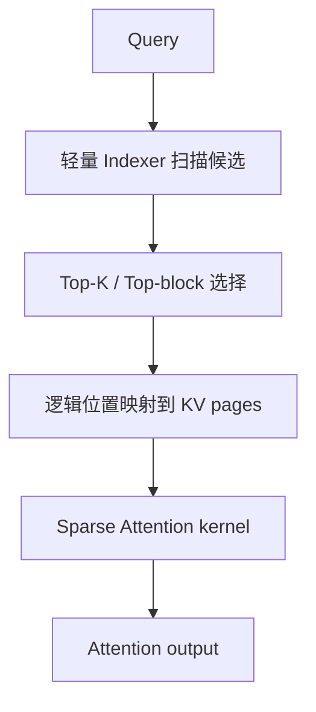
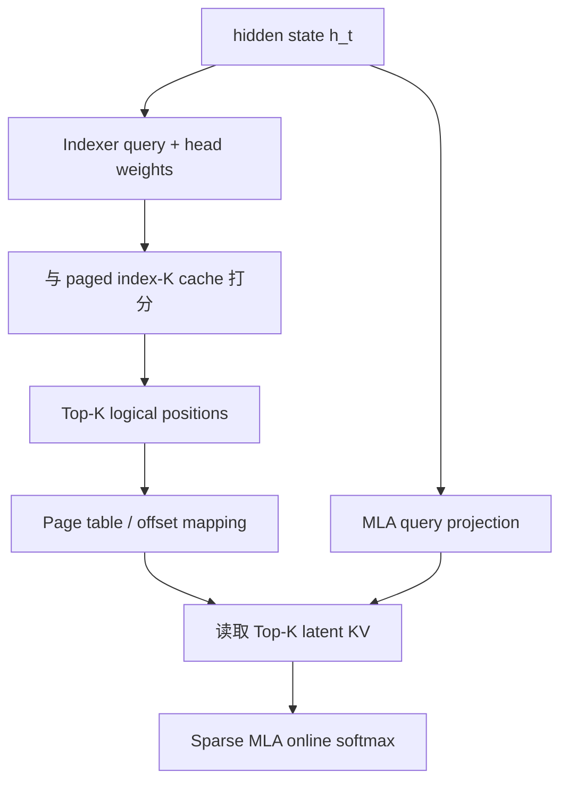
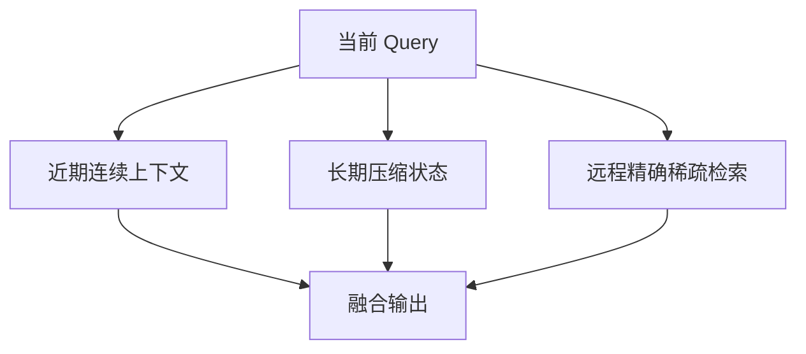

# Sparse Attention：从“扫描全部历史”到“检索少量有效记忆”

> 本文面向 AI Infra、推理系统与模型架构学习者。它承接 `MLA.md`：MLA 已经把每个历史 token 的 KV record 变窄，Sparse Attention 继续减少每个 Query 真正需要读取和计算的历史位置数。
>
> 文中的复杂度与字节估算用于建立数量级直觉；具体模型的 head 数、维度、page size、精度与 kernel 能力会随版本变化。涉及 DeepSeek-V3.2/DSA 的公开配置和训练数字，以论文与官方仓库当前公开内容为准。

### 缩写与术语

| 缩写 | 全称 | 本文中的含义 |
|---|---|---|
| KV | Key-Value | Attention 历史 Key/Value 状态 |
| HBM | High Bandwidth Memory | GPU 高带宽显存 |
| MLA | Multi-head Latent Attention | 多头潜变量注意力，以 latent KV 降低 Cache 宽度 |
| MHA | Multi-Head Attention | 每个 Query head 有独立 KV head |
| MQA | Multi-Query Attention | 多个 Query heads 共享一组 KV |
| GQA | Grouped-Query Attention | 每组 Query heads 共享一组 KV |
| DSA | DeepSeek Sparse Attention | DeepSeek 的 learned token-level sparse Attention |
| NSA | Native Sparse Attention | 原生可训练、面向硬件的分层 Sparse Attention |
| RoPE | Rotary Position Embedding | 旋转位置编码 |
| CP / TP | Context / Tensor Parallelism | 上下文并行 / 张量并行 |
| TTFT / ITL | Time To First Token / Inter-Token Latency | 首 token 延迟 / token 间延迟 |

本文的 “Sparse” 指 **Attention 访问图稀疏**，不是参数稀疏、MoE Expert 稀疏，也不是把数值为零的矩阵交给通用 sparse GEMM。

---

## 0. 先给结论：Sparse Attention 优化的不是 Cache 宽度，而是访问集合

标准因果 Attention 在位置 $t$ 生成 Query 后，要与所有历史位置交互：

$$
\mathcal H_t=\{1,2,\ldots,t\}.
$$

Sparse Attention 为当前 Query 构造一个小得多的集合：

$$
\mathcal S_t\subseteq\mathcal H_t,
\qquad
|\mathcal S_t|=K\ll t,
$$

再只对 $\mathcal S_t$ 中的 Key/Value 计算精确 Attention：

$$
o_t=
\sum_{s\in\mathcal S_t}
\operatorname{Softmax}_{s\in\mathcal S_t}
\left(\frac{q_tk_s^\top}{\sqrt{d_h}}+m_{t,s}\right)v_s.
$$

它与 MLA 的分工可以压缩成两句话：

- MLA：减少 **每个历史位置有多少 byte**；
- Sparse Attention：减少 **每个 Query 访问多少历史位置**。

因此二者不是替代关系，而是乘法关系。若每个历史位置的 Cache 从 $B_{\text{dense}}$ byte 压到 $B_{\text{latent}}$ byte，同时读取位置从 $L$ 个降到 $K$ 个，那么理想化的 decode KV 读流量从：

$$
L\cdot B_{\text{dense}}
$$

降为：

$$
K\cdot B_{\text{latent}}.
$$

但“如何从 $L$ 个候选中找到 $K$ 个位置”不会凭空免费。完整路径是：



所以真正的系统公式不是“Attention 从 $L$ 变成 $K$”这么简单，而是：

$$
T_{\text{sparse}}
=T_{\text{index}}
+T_{\text{select}}
+T_{\text{address}}
+T_{\text{sparse-attn}}
+T_{\text{launch/sync}}.
$$

Sparse Attention 把主 Attention 优化后，新的瓶颈往往会变成：

1. Indexer 仍需扫描长历史；
2. Top-K 选择和 logits 临时张量；
3. 稀疏位置导致不连续的 HBM 访问；
4. Paged KV 的逻辑到物理地址翻译；
5. prefill、decode 和 continuous batching 下完全不同的 kernel 形态；
6. 选择错误造成的精确记忆丢失。

这正是本文的主线：

$$
\boxed{
\text{Dense scan}
\rightarrow
\text{Sparse selection}
\rightarrow
\text{Indexer + irregular memory access}
}
$$

---

## 1. Dense Attention 的真实成本：Prefill 和 Decode 不是同一个问题

设：

- 序列长度为 $L$；
- Query head 数为 $H_q$；
- KV head 数为 $H_{kv}$；
- 每个 head 的 Key/Query 维度为 $d_k$；
- Value 维度为 $d_v$；
- batch size 为 $B$。

### 1.1 Prefill：主要问题是二次方计算与中间状态

训练或 prefill 中，所有 Query 同时出现。忽略常数项时，$QK^\top$ 与 $PV$ 的核心计算量都是：

$$
O(BH_qL^2d).
$$

FlashAttention 可以通过 online softmax 和 tiling 避免把完整 $L\times L$ attention matrix 写回 HBM，但它没有改变需要计算的有效 Query-Key pair 数：

$$
\frac{L(L+1)}{2}\approx O(L^2).
$$

因此：

> FlashAttention 解决的是 IO complexity 和中间张量物化；Sparse Attention 解决的是有多少 pair 根本不必计算。

二者仍然可以组合：稀疏方法定义需要访问的 blocks，Flash 风格 kernel 在每个被选 block 内做 fused tiled attention。

### 1.2 Decode：主要问题是反复读取长历史

Decode 每一步通常只有一个或少量 Query token。单步计算量是：

$$
O(BH_qLd),
$$

但更关键的是：每一步都要从 HBM 读取历史 Cache。若每层每 token 的 KV record 为 $B_{KV}$ byte，则生成一个 token 的 KV 读取下界近似为：

$$
\text{Bytes}_{\text{dense-decode}}
\approx B\cdot L\cdot B_{KV}.
$$

生成 $G$ 个新 token，忽略上下文增长的小项：

$$
\text{Bytes}\approx GBLB_{KV}.
$$

当 $L$ 很大、decode batch 不够大时，这个阶段往往 memory-bound。Sparse Attention 如果只读 $K$ 个位置，理想化下界变为：

$$
\text{Bytes}_{\text{sparse-decode}}
\approx B\cdot K\cdot B_{KV}.
$$

不过实际还要加上 Indexer cache 的读取、index 数组、page table 与不连续 gather 的代价：

$$
\text{Bytes}_{\text{actual}}
\approx
BLB_{\text{index}}
+BKB_{KV}
+\text{metadata}
+\text{wasted transactions}.
$$

### 1.3 为什么同一个 sparsity ratio 不代表同一个速度

假设 $L=128\text{K}$，$K=2\text{K}$，核心 Attention pair 数下降约 $64\times$。这不等于端到端快 $64\times$，因为：

- Indexer 可能仍扫描 $128\text{K}$；
- Top-K 需要 reduction / selection；
- 选中的 token 可能散落在数千个 page；
- 小工作量下 kernel launch 和同步占比上升；
- 一些 Query 的有效历史不足 $K$，需要 padding 与 mask；
- 多请求 batch 的每个 Query 有不同的合法区间；
- 其他层、MoE、通信与采样没有被这项优化。

Amdahl's Law 的端到端形式是：

$$
S_{\text{e2e}}
\mathrel{=}
\frac{1}
{(1-f)+\frac{f}{S_{\text{attn}}}+f_{\text{new-overhead}}},
$$

其中 $f$ 是原本 Attention 的时间占比，$S_{\text{attn}}$ 是核心 Attention 加速比，$f_{\text{new-overhead}}$ 是 Indexer、Top-K、gather 等新增时间占比。

---

## 2. “Sparse Attention”不是一种结构，而是一组设计轴

讨论 Sparse Attention 时，至少要同时说明下面六个维度。否则“用了稀疏注意力”几乎没有可操作的信息。

| 设计轴 | 常见选项 | 直接影响 |
|---|---|---|
| 稀疏模式 | 固定 / 动态 / 混合 | 是否依赖当前 Query；是否需要 Indexer |
| 选择粒度 | token / block / page / segment | 精度、访存连续性、Tensor Core 利用率 |
| 覆盖来源 | local / global / random / content-based / compressed | 召回能力与归纳偏置 |
| 生命周期 | 原生训练 / continued training / 推理后处理 | 质量、训练成本、kernel backward 支持 |
| Cache 策略 | 全量保留 / 淘汰 / 压缩 / 分层 | HBM 容量是否随 $L$ 增长 |
| Head 策略 | per-head / per-GQA-group / layer-shared | 选择质量与 KV 读取并集大小 |

### 2.1 固定模式与动态模式

固定模式不依赖内容。例如滑动窗口：

$$
\mathcal S_t^{\text{local}}
=\{\max(1,t-w+1),\ldots,t\}.
$$

它的优点是无需 Indexer、地址规则、易于做 block tiling；缺点是无法直接访问窗口外任意 token。

动态模式依赖当前 Query：

$$
\mathcal S_t
=\operatorname{TopK}_{s<t}\;I(q_t,z_s),
$$

其中 $I$ 是轻量相关性函数，$z_s$ 是历史位置的索引表示。动态模式更像检索系统，但必须为打分、选择与地址映射付费。

### 2.2 Token sparse 与 block sparse

Token-level 选择理论上最精确：

$$
\mathcal S_t=\{s_1,s_2,\ldots,s_K\}.
$$

但相邻 index 可能完全不连续，导致：

- HBM transaction 利用率低；
- page table 查找更多；
- 无法自然形成规整的矩阵 tile；
- backward 中 scatter/reduction 更复杂。

Block-level 先把历史划成长度 $b$ 的块，再选 $n$ 个块：

$$
K=nb.
$$

即使块内只有少数 token 真正重要，也把整个 block 读入和计算。这会产生 overfetch，却换来连续加载、Tensor Core tile 与更简单的调度。

因此它是一个典型的系统 trade-off：

$$
\boxed{
\text{少算几个 token}
\quad\text{vs}\quad
\text{让每次读取和 GEMM 更规整}
}
$$

### 2.3 稀疏计算与 Cache 淘汰不是一回事

两种方案都可能“只访问一小部分历史”，但语义不同：

| 方案 | 未选 token 是否仍在 Cache | 后续 Query 能否重新选中 | 主要优化 |
|---|---:|---:|---|
| 动态 Sparse Attention | 通常在 | 能 | 每步计算与读取 |
| KV eviction | 已删除 | 不能 | Cache 容量与后续读取 |
| Sliding-window cache | 窗口外删除 | 不能 | 容量固定、流式服务 |
| Compressed memory | 原 token 可能删除或分层 | 取决于架构 | 用有损状态代替原历史 |

动态稀疏保留全量 Cache 时，**HBM 容量仍可能是 $O(L)$**；它只把单次读取与精确交互降为 $O(K)$。这是非常常见的误区。

### 2.4 原生稀疏与推理 retrofit

- 原生稀疏：训练时就按稀疏结构前向/反向，模型学会把信息放到可被结构访问的位置；
- continued training：从 dense checkpoint 出发，先训练选择器，再切到稀疏主干继续训练；
- retrofit：不改模型权重或只做轻量校准，在推理时推断稀疏 pattern。

三者解决的工程场景不同，不能只比较 kernel microbenchmark。

---

## 3. 稀疏模式的“工具箱”

### 3.1 Sliding Window：最硬件友好的局部稀疏

每个 Query 只看最近 $w$ 个位置：

$$
|\mathcal S_t|\le w.
$$

Prefill 的 pair 数从 $O(L^2)$ 变为 $O(Lw)$；decode 单步从 $O(L)$ 变为 $O(w)$。如果窗口外 Cache 直接淘汰，序列方向容量也可成为 $O(w)$。

优点：

- 无 Indexer；
- 连续地址访问；
- causal mask 规则；
- 容易与 ring buffer、paged cache、FlashAttention 的 window 参数组合。

缺点：

- 对窗口外精确引用无能为力；
- 多层局部 Attention 虽能逐层扩大 receptive field，但路径变长；
- 需要 global、sink、summary 或周期性 full/sparse 层补足远程信息。

### 3.2 Global token：给远程通信建立枢纽

固定少量 global token 可与所有位置互相交互。BigBird 类模式常把 local、random 与 global 边组合起来：

$$
\mathcal S_t
=\mathcal S_t^{\text{local}}
\cup\mathcal S_t^{\text{global}}
\cup\mathcal S_t^{\text{random}}.
$$

Global token 类似图中的 hub，可以缩短远程 token 之间的信息路径；但它不是免费的：global token 自身仍需看全序列，也可能成为信息拥塞点。

### 3.3 Attention Sink：流式窗口为什么常保留开头几个 token

StreamingLLM 观察到，仅保留最近窗口会使模型质量快速崩坏；同时保留序列开头少量“attention sink” token 可恢复稳定流式行为。重要区别是：

- sink token 主要接收“无处安放”的注意力质量并稳定 softmax 行为；
- 它不是面向任意历史内容的精确检索索引；
- 它适合固定内存 streaming，不等价于长上下文完整 recall。

常见集合是：

$$
\mathcal S_t
=\{1,\ldots,s\}
\cup\{t-w+1,\ldots,t\}.
$$

### 3.4 Strided / Dilated / Random：规则或随机的远程捷径

这些方法通过固定间隔或随机连接扩大覆盖面，不需要内容索引。它们的优势是 pattern 可预计算，缺点是选中的位置未必与当前 Query 相关。

### 3.5 Content-based selection：把 Attention 变成检索

动态选择一般分两步：

1. 用便宜的代理分数 $I(q_t,z_s)$ 扫描候选；
2. 对 Top-K 候选计算昂贵、精确的主 Attention。

它类似 learned retrieval：Indexer 追求高 recall，主 Attention 负责高精度重排与聚合。

### 3.6 Compressed + Selected + Local：多级记忆

NSA（Native Sparse Attention）给出了很清晰的三分支结构：

| 分支 | 作用 | 粒度 | 典型成本 |
|---|---|---|---|
| Compression | 粗粒度全局理解与选择信号 | 压缩块 | 随 $L/d$ 增长 |
| Selection | 精确读取重要远程块 | 原始 token block | Top-$n$ blocks |
| Sliding window | 最近上下文 | 连续 token | 固定 $w$ |

最终输出由门控组合：

$$
o_t^*
=\sum_{c\in\{cmp,slc,win\}}
g_t^c\operatorname{Attn}
(q_t,\widetilde K_t^c,\widetilde V_t^c).
$$

这个结构的重要意义不是某一组超参数，而是把三类 memory requirement 拆开：

- 全局概貌；
- 远程精确内容；
- 近期连续语境。

---

## 4. 从图算法理解 Sparse Attention

把每个 token 当作节点，允许的 Attention pair 当作有向边。Dense causal Attention 有约 $L(L+1)/2$ 条边；Sparse Attention 只保留一部分边。

评估一种 pattern 时至少看四个图性质：

1. **Degree**：每个 Query 访问多少历史节点；
2. **Diameter / path length**：远程信息传到当前 token 需要经过多少层；
3. **Content adaptivity**：边是否随 Query 内容变化；
4. **Hardware locality**：相邻边是否映射到连续 KV 地址。

| Pattern | Degree | 远程路径 | 内容自适应 | 地址规则性 |
|---|---:|---:|---:|---:|
| Full | $O(L)$ | 1 | 是，由 softmax 决定权重 | 高 |
| Window | $O(w)$ | 约 $O(L/w)$ 层 | 否 | 很高 |
| Local+Global | $O(w+g)$ | 通常较短 | 部分 | 高 |
| Random/strided | 固定 | 概率性缩短 | 否 | 中等 |
| Token Top-K | $O(K)$ | 1 | 是 | 低 |
| Block Top-K | $O(nb)$ | 1 | 是 | 较高 |
| Compressed+Selected+Local | 分层 | 1 或短路径 | 是 | 中高 |

这张表解释了为什么没有单一 pattern 在质量和硬件上同时支配所有方案。

---

## 5. 动态 Sparse Attention 的通用数学

设主 Attention 的 Query 为 $q_{t,h}\in\mathbb R^{d_h}$，历史主 Key/Value 为 $k_{s,g},v_{s,g}$。Indexer 不必复用主 Attention 的高维表示，它可以使用低成本索引向量：

$$
q^I_{t,j}\in\mathbb R^{d_I},
\qquad
k^I_s\in\mathbb R^{d_I},
\qquad
j=1,\ldots,H_I.
$$

一个通用的打分形式是：

$$
I_{t,s}
=\sum_{j=1}^{H_I}
w^I_{t,j}\,\phi
\left(q^I_{t,j}\cdot k^I_s\right),
$$

其中：

- $H_I$ 是索引头数；
- $d_I$ 是索引 head 维度；
- $w^I_{t,j}$ 是 Query 相关的 head 权重；
- $\phi$ 可以是 ReLU 等便于高吞吐实现的函数。

选择集合：

$$
\mathcal S_t
=\operatorname{TopK}_{s\in\mathcal V_t} I_{t,s},
$$

其中 $\mathcal V_t$ 是满足 causal、request boundary、window 等约束的合法候选集合。

主 Attention 再使用原本的高质量表示：

$$
p_{t,s}
=\operatorname{Softmax}_{s\in\mathcal S_t}
\left(\frac{q_{t}k_s^\top}{\sqrt{d_h}}+m_{t,s}\right),
\qquad
o_t=\sum_{s\in\mathcal S_t}p_{t,s}v_s.
$$

这是一种典型的 coarse-to-fine 架构：

$$
\text{cheap recall over }L
\quad+\quad
\text{exact attention over }K.
$$

### 5.1 Indexer 的目标不是复现全部 logits，而是保住重要集合

若主 Attention 在 full context 上的高权重位置集合为 $\mathcal T_t$，Indexer 更关心：

$$
\operatorname{Recall@K}
=\frac{|\mathcal T_t\cap\mathcal S_t|}{|\mathcal T_t|},
$$

而不是每个低权重位置的分数都精确匹配。

但训练时使用 soft target distribution 往往更稳定，因为它能提供比离散 Top-K 更稠密的监督。

### 5.2 为什么不能直接用主 Attention logits 选 Top-K

若先完整计算：

$$
QK^\top\in\mathbb R^{L\times L},
$$

再做 Top-K，最昂贵的 $O(L^2)$ 部分已经发生。有效的稀疏结构必须让**用于选择的表示和算子明显比主 Attention 便宜**，或者先在块/压缩层面缩小候选数。

---

## 6. DeepSeek Sparse Attention（DSA）：结构与张量流

DSA 指 DeepSeek Sparse Attention。DeepSeek-V3.2 论文把它描述为在 MLA 上加入 lightning indexer 与 fine-grained token selection，并通过 continued training 从 dense 模型过渡到稀疏模型。

### 6.1 Index score

论文给出的 Indexer 分数是：

$$
I_{t,s}
=\sum_{j=1}^{H^I}
w^I_{t,j}
\operatorname{ReLU}
\left(q^I_{t,j}\cdot k^I_s\right).
$$

关键点：

- 一个历史位置只存轻量 $k^I_s$；
- 当前 Query 产生多个 $q^I_{t,j}$ 与权重 $w^I_{t,j}$；
- ReLU 后跨 index heads 加权汇总为每个历史 token 一个 scalar score；
- 再对历史位置做 Top-K；
- 主 Sparse MLA 只读取被选中的 latent KV。

官方公开推理配置中可见一组实例值：

| 参数 | 公开配置值 | 含义 |
|---|---:|---|
| `index_n_heads` | 64 | Indexer query heads |
| `index_head_dim` | 128 | Index head dimension |
| `index_topk` | 2048 | 每个 Query 选取的历史位置数 |

这些是该公开 checkpoint/实现的配置，不应被理解为所有 Sparse Attention 的固定常数。

### 6.2 为什么 DSA 在 MLA 的 MQA mode 上执行稀疏访问

MLA 的 latent KV 可在 kernel 层面被所有 Query heads 共享。若每个 Query head 独立选 token，真正需要从 HBM 读取的是各 head 选择集合的并集：

$$
\mathcal U_t
=\bigcup_{h=1}^{H_q}\mathcal S_{t,h}.
$$

即使每个 head 只选 $K$，$|\mathcal U_t|$ 也可能远大于 $K$。因此共享选择集合能让同一份 KV 载入后被多个 Query heads 复用，提高 arithmetic intensity。

这也是为什么“per-head sparsity 很高”未必意味着“KV traffic 很低”。真正要统计的是：

$$
\text{unique KV records loaded per GQA/MQA group}.
$$

### 6.3 DSA 的单个 decode token 数据流



这里至少有两套历史 Cache：

1. MLA latent KV cache：供精确主 Attention 使用；
2. Indexer K cache：供轻量候选打分使用。

“Sparse Attention 省 Cache”不是无条件成立。DSA 新增了 Indexer cache，但它希望通过一个明显更小、更便宜的索引表示，换取少读大量主 KV。

---

## 7. DSA 如何训练：不能把离散 Top-K 直接扔给模型自己摸索

离散 Top-K 对 index 不可导，而且随机初始化的 Indexer 一开始会漏掉重要 token。DSA 的公开训练路线分为两个阶段。

### 7.1 Dense warm-up：冻结主模型，只教 Indexer 模仿 Attention

这一阶段仍执行 full/dense Attention。把主 Attention 跨 heads 聚合并在序列维归一化，得到 teacher distribution：

$$
p_{t,:}.
$$

Indexer 的分布为：

$$
\widehat p_{t,:}
=\operatorname{Softmax}(I_{t,:}).
$$

训练目标使用 KL divergence：

$$
\mathcal L^I
=\sum_t D_{KL}
\left(p_{t,:}\,\|\,\widehat p_{t,:}\right).
$$

公开论文中的阶段配置为：

- 仅更新 Indexer，其余参数冻结；
- learning rate $10^{-3}$；
- 1000 steps；
- 每 step 为 $16\times128\text{K}$ tokens；
- 总量约 2.1B tokens。

这些数字用于理解训练规模，不能脱离 checkpoint 与 recipe 机械照搬。

### 7.2 Sparse stage：主模型适应“只能看到被选集合”

第二阶段真正启用 Top-K Sparse Attention：

- 主模型由 language modeling loss 更新；
- Indexer 仍由 $\mathcal L^I$ 更新；
- Indexer 输入从主干 detach，避免 Indexer loss 反向改变 backbone representation；
- teacher alignment 只在被选集合等相应定义域上处理；
- 公开配置使用 $K=2048$。

论文报告的该阶段配置为：

- learning rate $7.3\times10^{-6}$；
- 15,000 steps；
- 每 step 为 $480\times128\text{K}$ tokens；
- 总量约 943.7B tokens。

这个阶段的核心意义是：

> Indexer 学会召回，主模型同时学会在召回不完美的情况下重组信息。

只训练 Indexer 而不让 backbone 适应稀疏可见性，通常不能等价于原生或 continued-trained 稀疏模型。

### 7.3 为什么 detach 很重要

若 $\mathcal L^I$ 直接回传到 hidden states，主模型可能为了让 Indexer 更容易模仿而扭曲表示；与此同时 LM loss 希望表示服务于生成目标。detach 把优化职责分开：

$$
\nabla_{\theta_{\text{backbone}}}\mathcal L^I=0,
\qquad
\nabla_{\theta_{\text{indexer}}}\mathcal L_{LM}=0
\quad\text{（按该训练解耦理解）}.
$$

这不是唯一可能的训练策略，但它体现了选择器与主干之间需要明确的 gradient contract。

---

## 8. Indexer 为什么会成为新瓶颈

### 8.1 复杂度只是把昂贵算子换成便宜算子

对长度 $L$ 的 prefill，主 Sparse Attention 约为：

$$
O(LKd_{\text{main}}).
$$

但若 Indexer 为每个 Query 对全部历史打分，仍是：

$$
O(L^2d_I).
$$

Decode 单步：

$$
T_{\text{index}}=O(Ld_I),
\qquad
T_{\text{main}}=O(Kd_{\text{main}}).
$$

Indexer 的常数可以很小、可以 FP8、可共享 KV、可避免 Value 路径，因此仍能带来巨大收益；但随着主 Attention 被压到很小，Indexer 占比自然上升。

### 8.2 数量级示例

设：

- $L=1,048,576$；
- $K=2048$；
- Indexer dimension $d_I=128$；
- 主 Attention 有效 dimension 远大于 $d_I$ 且还需 Value 聚合。

候选数缩减比是：

$$
\frac{L}{K}=512.
$$

但 Indexer 仍需为每个 decode Query 看约 100 万个候选。即便每个候选只做较小点积和少量 reduction，它也不是 $O(1)$。

### 8.3 进一步优化 Indexer 的方向

| 方向 | 核心思想 | 新 trade-off |
|---|---|---|
| 降低 $d_I$ / 低精度 | 每个候选更便宜 | 选择 recall 下降风险 |
| Block index | 从 $L$ 个 token 降到 $L/b$ 个块 | 块内 overfetch |
| Compressed hierarchy | 先粗排 region，再细排 token | 多级状态与训练复杂度 |
| 跨层共享 index | 多层复用选择结果 | 各层需求不一致 |
| 跨相邻 Query 复用 | 利用选择集合时间局部性 | Query 变化时 stale |
| 近似 ANN / hashing | 减少全量扫描 | 可训练性、GPU irregularity |
| Fused score + Top-K | 不物化全部 logits | kernel 复杂、寄存器/共享内存压力 |

所以 Sparse Attention 的下一阶段常常不是“更稀疏”，而是：

$$
\boxed{\text{让找出稀疏集合的过程也分层、可复用、可融合}}
$$

---

## 9. Top-K 不是一个小算子：为什么 logits 物化会爆

### 9.1 朴素实现

对 $Q$ 个 Query、$N$ 个候选：

```text
scores = indexer(q, k_index)   # [Q, N]
indices = topk(scores, K)      # [Q, K]
output = sparse_attention(q_main, kv_main, indices)
```

仅 `scores` 临时张量就需要：

$$
Q\cdot N\cdot b_{score}\ \text{bytes}.
$$

例如 $Q=4096$、$N=128\text{K}$、score 为 FP16：

$$
4096\times131072\times2
=1\text{ GiB}.
$$

这还只是一个 batch 中的一个 Indexer 输出，不含 Q/K、Top-K workspace 与主 Attention。

### 9.2 Streaming Top-K

更合理的实现把候选按 tile 扫描：

1. 计算一个 $N_{tile}$ 的 score tile；
2. 与当前局部 Top-K 合并；
3. 丢弃非候选 score；
4. 扫完后只写 $[Q,K]$ indices。

临时状态从 $O(QN)$ 降到近似：

$$
O(QK+QN_{tile}).
$$

但 Top-K 并不是简单 associative reduction。实现需要在：

- 每 thread 局部候选；
- warp-level merge；
- CTA-level merge；
- 多 tile / 多 CTA 全局合并

之间权衡。$K=2048$ 时，候选状态本身已经很大，无法全部常驻寄存器。

### 9.3 Fused Indexer + Top-K 的收益与代价

收益：

- 不写完整 score matrix 到 HBM；
- 少一次 kernel launch；
- score 可在寄存器/共享内存中立即筛选；
- 可同时应用 causal/request mask。

代价：

- kernel 更难调优；
- selection 逻辑会降低纯 GEMM 吞吐；
- $K$、head 数、dtype、page layout 改变时可能需要不同特化；
- 多 CTA 合并需要额外 workspace 或第二阶段 reduction。

### 9.4 Top-K 结果需要排序吗

主 Attention 数学上不要求 indices 按时间排序，只要每个 Key/Value 与位置编码、mask 一致。但排序可能带来：

- 更好的 page locality；
- 更容易合并同 page token；
- 更规则的 prefetch；
- 更确定的 kernel 执行顺序。

另一方面，按 score 排序有利于 early pruning 或分层读取。选择何种顺序是 kernel contract，不应由上层随意假设。

---

## 10. 从逻辑 token 到物理 KV page

Serving 中 KV Cache 通常是 paged 的。Indexer 输出的是逻辑位置 $s$，Sparse Attention 需要定位物理 page 与 page offset。

设主 KV page size 为 $P$：

$$
\text{logical\_block}=\left\lfloor\frac{s}{P}\right\rfloor,
\qquad
\text{offset}=s\bmod P.
$$

再由请求的 block table 得到物理 page：

$$
\text{physical\_page}
=\text{block\_table}[request,\text{logical\_block}].
$$

最终地址近似为：

$$
\text{addr}
=\text{base}
+\text{physical\_page}\cdot\text{page\_stride}
+\text{offset}\cdot\text{token\_stride}.
$$

### 10.1 为什么不要先 gather 成连续临时 KV

最直观的两阶段实现：

```text
selected_kv = gather(paged_kv, indices)
out = dense_attention(q, selected_kv)
```

它容易验证，但多出：

1. 从 paged KV 读；
2. 向临时 buffer 写；
3. Dense Attention 再读临时 buffer。

更优的 Sparse Attention kernel 通常直接消费 indices，在 tile 循环中从 paged KV 载入被选位置并执行 online softmax，避免 materialized gather buffer。

### 10.2 但直接 indexed load 也不是免费

- 同一个 warp 的 threads 可能访问不同 pages；
- coalescing 变差；
- TLB/cache locality 变差；
- page table 读取和整数地址计算增加；
- 同 page 的重复位置若未去重会浪费带宽；
- 不同 Query 的 Top-K pages 几乎不重合时，batch reuse 很差。

因此需要统计的不只是 $K$，还包括：

$$
\text{unique pages},\quad
\text{tokens per selected page},\quad
\text{cross-query page reuse}.
$$

### 10.3 Page size 是算法与 allocator 的共同参数

大 page：

- block table 小；
- 地址翻译少；
- 更容易连续预取；
- 但动态稀疏可能只用 page 中少量 token，overfetch 大。

小 page：

- 精细分配与选择；
- 但 metadata、fragmentation、page-table traffic 增加。

因此 index block、KV page、kernel tile 三个粒度最好协同设计，而不是各自独立选择。

---

## 11. Prefill Sparse Attention：二维 ragged 问题

Decode 常可简化为“每个请求一个 Query”。Prefill 中却有 $Q$ 个 Query，每个 Query 的 causal 可见范围和 Top-K 都不同：

$$
\text{indices}\in\mathbb Z^{Q\times K}.
$$

对第 $i$ 个 Query，其合法 Key 范围可表示为：

$$
[k^{start}_i,k^{end}_i).
$$

在 packed batching 中，不同请求的 Query 和历史可能拼接在一起，`k_start/k_end` 防止跨请求读取。

### 11.1 Prefill 的三种典型形态

| 场景 | Query 数 | 历史长度 | 特点 |
|---|---:|---:|---|
| 初次长 prompt | 大 | 从短到长 | 因果三角、选择矩阵大 |
| Chunked prefill | 中等 | 已有 prefix + chunk | 每个 Query 看到 prefix 与 chunk 前缀 |
| Prefix cache hit | 中等 | 共享 prefix 很长 | page 共享、copy-on-write 与稀疏索引交叉 |

### 11.2 为什么短 prefill 可能回退 dense

在短序列下：

- Dense FlashAttention 的 tile 很规整；
- Indexer + Top-K overhead 占比高；
- $L\le K$ 时根本无稀疏空间；
- 稀疏 kernel 的 indirect load 可能比 dense 连续读更慢。

合理 runtime 应按 $L$、$Q$、$K$、dtype、GPU 与 cache layout 选择 dense 或 sparse backend，而不是所有长度强制走同一路径。

### 11.3 Prefill forward 只是训练支持的一半

原生 sparse training 还需要 backward：

- $dQ$ 对应多个 selected blocks 的累加；
- $dK/dV$ 会被许多 Query 稀疏写入；
- 同一历史 block 被多个 Query 选择时需要规约；
- selection 本身通常离散，梯度策略需另行定义；
- activation checkpointing 要重新执行 Indexer/Top-K，需保证确定性。

一个只有 decode kernel 的项目不能因此宣称“支持 Sparse Attention 训练”。

---

## 12. Decode Sparse Attention：低算术强度与大量小任务

Decode 的 Query 维通常很小。Sparse kernel 的基本循环近似：

```text
for each request/query:
    load q heads
    for each selected KV tile:
        resolve page addresses
        load/dequantize K
        update online-softmax max/sum
        load/dequantize V
        accumulate output
```

### 12.1 MQA/GQA group-centric 调度

如果多个 Query heads 共享同一 KV group 和同一 selected set，可以：

1. 把该组 Query heads 放入 SRAM/寄存器；
2. 每个 selected KV tile 只从 HBM 读取一次；
3. 对多个 Query heads 复用；
4. 在一个 fused loop 中完成 score、softmax 与 Value accumulation。

这比 per-head 独立 kernel 更能降低主 KV traffic。

### 12.2 为什么 batch 变大不一定线性变好

Dense decode 的不同请求虽读不同 KV，但每个请求内部连续。Sparse decode 下，每个请求的 page 列表不规则，batch 增大后：

- SM 并行度提升；
- 但 page working set 变大；
- L2 reuse 可能下降；
- 每个请求不同 $K_{valid}$ 导致负载不均；
- Top-K 与 Attention 两个阶段之间产生 pipeline bubble。

需要通过真实 continuous batching trace 测量，而不是只测固定 batch 的随机 indices。

---

## 13. Continuous Batching：每个 Query 都有自己的稀疏世界

在线服务的一个 batch 可能同时包含：

- 正在 decode 的长请求；
- 刚进入的短 prompt；
- chunked prefill；
- prefix cache 命中请求；
- 即将结束或被抢占的请求。

因此 runtime 需要维护 ragged metadata：

| 元数据 | 作用 |
|---|---|
| query-to-request mapping | Query 属于哪个请求 |
| sequence/context length | causal 上界 |
| `k_start/k_end` | packed tensor 中合法候选区间 |
| block table | 逻辑 block 到物理 page |
| selected indices | 每个 Query 的 Top-K |
| valid count / `-1` padding | 历史不足 K 或对齐 |
| cache dtype/scale layout | FP8/量化解码 |

### 13.1 常见 correctness bug

1. Query 误读到相邻 request 的 KV；
2. chunked prefill Query 读到未来 token；
3. `-1` padding 被当作最后一个位置；
4. prefix-shared page 的逻辑位置与 RoPE position 混淆；
5. request 重排后 index 与 block table 未同步；
6. 被抢占请求的 page 已释放但异步 kernel 仍引用；
7. CUDA Graph replay 时 metadata 地址或 shape 不满足捕获假设。

### 13.2 调度器必须知道 Sparse backend 的成本模型

仅按 token 数做 batch packing 不够。两个请求都有一个 Query，但一个 context 为 8K，另一个为 1M：Indexer 工作量差 125 倍。更合理的调度成本可包含：

$$
C_i
=\alpha L_i
+\beta K_i
+\gamma U_i,
$$

其中 $U_i$ 是预计 unique pages。这样调度器才能避免少数超长请求拖慢整个 decode step。

---

## 14. FP8 Indexer 与 FP8 KV：省带宽，但 scale 也属于 layout

低精度可同时作用于：

- Indexer query/key；
- Indexer score GEMM；
- 主 latent KV cache；
- 主 Sparse Attention load/dequant 路径。

### 14.1 一个 FP8 Indexer logits kernel 在做什么

DeepGEMM 公开的 V3.2 MQA indexer kernel 族可抽象为：

```text
q:       [num_query, H_I, d_I]    FP8
k_index: [num_kv, d_I]            FP8
k_scale: [num_kv]                 float scale
w:       [num_query, H_I]         float weights

for query i, candidate j:
    k_j = dequant(k_index[j], k_scale[j])
    per_head = q[i, :, :] @ k_j
    score[i, j] = sum(relu(per_head) * w[i, :])
```

生产实现还要处理 packed sequence 的合法区间、paged layout 与是否清理无效 logits。

### 14.2 Scale overhead 不能漏算

如果每 token 的 FP8 vector 需要 scale，实际 byte 不只是“元素数 × 1 byte”：

$$
B_{record}
=d_I\cdot1\text{B}
+B_{scale}
+B_{alignment/padding}.
$$

主 MLA Cache 也可能把 NoPE latent 部分与 RoPE 部分使用不同精度和布局。所有 byte ledger 都应以实际 cache record 结构为准。

### 14.3 写 Cache 时量化比每次读时量化更合理

新 token 的 K/latent KV 在 append 到 page 时量化一次；之后多个 decode step 只读取 FP8 并在 kernel 内反量化。如果每一步都先把整个 Cache 转成 FP8，反而会增加一次完整历史扫描。

### 14.4 RoPE layout 是 correctness contract

DeepSeek 官方仓库曾修复 Indexer RoPE 实现中的布局差异：Indexer 需要的 RoPE layout 与 MLA RoPE 的 interleaving 约定不能混用。教训是：

> “维度相同”不代表 tensor semantic layout 相同。

核对实现时要明确：

- rotary pair 是 interleaved 还是 split-half；
- position id 是绝对、相对还是经过 scaling；
- cached K 是否已应用 RoPE；
- Indexer 与主 MLA 是否复用同一 rotary helper；
- reference implementation 与 fused kernel 的 layout 是否一致。

---

## 15. Sparse MLA kernel：不只是把 Dense MLA 的 L 改成 K

Dense MLA decode 常假设 KV 沿 sequence 连续或按 page 顺序遍历。Sparse MLA 接收：

$$
\text{indices}\in\mathbb Z^{B\times Q\times K},
$$

每个 index 指向逻辑或编码后的 page/offset。kernel 还要完成：

1. invalid index mask；
2. page decode；
3. FP8 latent KV 与 scale 读取；
4. RoPE component 处理；
5. 多 Query heads 共享 latent KV；
6. online softmax；
7. Value/latent accumulation 与 up-projection contract。

FlashMLA 的公开仓库提供了 token-level sparse prefill/decode kernel 接口，并包含 FP8 KV cache 的 decode 路径。接口中 invalid index 使用 `-1`，这再次说明 padding 语义必须在上层和 kernel 间统一。

### 15.1 为什么需要不同的 prefill/decode kernel

| 维度 | Prefill | Decode |
|---|---|---|
| Query 数 | 大 | 小 |
| 主要瓶颈 | compute / scheduling | HBM bandwidth / latency |
| 稀疏结构 | 每行不同、二维 causal | 每请求少量行 |
| Query reuse | block 内可能有 | 较少 |
| 合适并行化 | Q tiles × heads × selected blocks | batch × groups × split-K |
| backward | 可能需要 | 不需要 |

试图用一个万能 kernel 覆盖两者，往往会牺牲其中一边。

### 15.2 Split-K / split selected range

当单个 Query 的 $K$ 仍较大而 batch 较小时，可把 selected range 分给多个 CTA：

- 每个 CTA 计算局部 max、sum、output；
- 第二阶段按 online softmax 合并；
- 增加并行度，但多一轮 partial buffer 和 reduction。

是否值得取决于 $B$、$K$、head dims 与 GPU SM 数。

---

## 16. NSA：为什么 block sparse 对硬件更自然

NSA 的三分支见第 3 节。这里重点看 selection branch 的实现理由。

### 16.1 压缩块

设压缩 block length 为 $l$、stride 为 $d$，学习函数 $\varphi$ 把一个块映射为一个压缩 Key：

$$
\widetilde K_t^{cmp}
=\left\{
\varphi(k_{id+1:id+l})
\right\}_{i=0}^{\lfloor(t-l)/d\rfloor}.
$$

通常 $d<l$，相邻压缩块重叠，以降低边界信息碎片。

### 16.2 复用 compression attention 作为 selection score

先计算 Query 对压缩 Key 的分布：

$$
p_t^{cmp}
=\operatorname{Softmax}
(q_t^\top\widetilde K_t^{cmp}).
$$

再根据压缩块与 selection block 的空间关系，把它映射为 block importance。这避免再建一套完全独立的 token-level indexer。

对于 GQA/MQA，共享 KV 的 Query heads 要聚合 block score：

$$
{p_t^{slc}}'
=\sum_{h=1}^{H}p_t^{slc,(h)},
$$

从而同一 KV group 选择相同 blocks，避免读取多个 head 选择集合的并集。

### 16.3 公开实验结构参数示例

NSA 论文的 27B/3B-active 实验模型中使用：

| 参数 | 值 |
|---|---:|
| compression block length $l$ | 32 |
| compression stride $d$ | 16 |
| selection block size $l'$ | 64 |
| selected block count $n$ | 16 |
| sliding window $w$ | 512 |

选择分支最多处理约：

$$
nl'=16\times64=1024
$$

个原始 token，另有压缩和窗口分支。论文还固定激活初始块和局部块，这是通过结构保障降低 selection miss 风险的一种做法。

### 16.4 Group-centric kernel

NSA 论文描述的 kernel 调度是：

1. 对一个位置加载同一 GQA group 的所有 Query heads；
2. 它们共享同一 selected block list；
3. 依次把连续 KV blocks 加载到 SRAM；
4. 在多个 Query heads 上复用该 KV tile；
5. 在 grid 维分配 Query/group 工作。

这是“算法结构为 kernel locality 服务”的典型例子：先在模型设计上规定 block selection 与 group-shared selection，再让 kernel 获得连续读和 KV reuse。

---

## 17. MInference：不重训模型时，怎样稀疏化长 Prefill

MInference 面向已有 dense 模型的 long-context prefill acceleration。它观察不同 heads 常呈现少数稳定的结构模式，使用离线识别的 head pattern 与在线索引构建，执行多种稀疏 kernel，例如：

- A-shape：局部对角带 + 初始列等结构；
- vertical-slash：若干重要竖列与对角斜线；
- block-sparse：选择重要块。

这类方法的价值是：

- 不必重新预训练模型；
- 专门优化超长 prompt 的 prefill；
- 可根据 head pattern 使用不同 kernel。

但它与 DSA/NSA 的边界也要说清：

| 项目 | MInference 类 retrofit | DSA continued-trained | NSA native-trained |
|---|---|---|---|
| 改模型训练 | 通常不需要 | 需要 continued training | 从训练期使用 |
| 主要阶段 | Prefill | Prefill + decode | Train + prefill + decode |
| 选择来源 | 从 dense attention 结构推断 | Learned Indexer | Compression/selection/window |
| backward sparse | 不是主目标 | 训练 recipe 特化 | 设计目标之一 |

因此不能用 MInference 的 prefill microbenchmark 直接推断在线 decode 的收益，也不能用原生 sparse 的训练成本否定 retrofit 对现有 checkpoint 的实用价值。

---

## 18. 稀疏选择的质量问题：不是平均分高就够了

### 18.1 Long-tail miss

自然语言中的大部分 Query 可能只需局部上下文，但极少数 Query 需要一个非常远、权重集中的 token，例如：

- 代码中的函数签名；
- 文档开头的约束；
- 随机 UUID、数字、变量名；
- 多轮对话里早期的一次否定；
- 工具输出中的单个错误码。

平均 recall 很高仍可能在这些 rare-but-critical cases 上失败。需要看 recall 的分位数、任务类型与距离分桶，而不是只看全局平均。

### 18.2 Selector recall 与主 Attention 质量的关系

若 full attention 的重要质量为 $p_{t,s}$，一个更相关的指标是被选集合覆盖的 attention mass：

$$
M_t(K)=\sum_{s\in\mathcal S_t}p_{t,s}.
$$

但即使 $M_t(K)$ 高，重新在 $\mathcal S_t$ 上 softmax 会改变归一化：

$$
\widetilde p_{t,s}
=\frac{e^{a_{t,s}}}
{\sum_{j\in\mathcal S_t}e^{a_{t,j}}}.
$$

Sparse output 不是简单把未选权重置零；被选位置的相对权重会被重新放大。

### 18.3 防止 catastrophic miss 的结构护栏

常见护栏包括：

- 强制保留 recent window；
- 强制保留 sink / BOS / system prompt blocks；
- 保留 compression/global branch；
- 不同层采用不同 pattern；
- 周期性 dense/full layers；
- 提高 retrieval heads 的 K；
- 对低置信度 Query 动态扩大 K；
- 把关键控制 token pin 到 global set。

### 18.4 动态 K

固定 $K$ 便于 kernel specialization 与负载均衡；动态 $K_t$ 可根据 score entropy 或 margin 适配难度。例如：

$$
K_t=f(H(\widehat p_t),\ \Delta_t,\ L_t).
$$

但动态 K 会制造 ragged workload、降低 CUDA Graph 稳定性，并让 batch tail latency 更难预测。实践中常选择少数 bucket，而不是完全任意的 K。

---

## 19. Head、Layer 与 Query 之间能否共享选择结果

### 19.1 Head sharing

共享 Top-K 的主要收益是 KV 读取复用。风险是不同 heads 负责不同关系：局部、语法、复制、检索等。可在 GQA/MQA group 内共享，而不是全模型所有 heads 共享。

### 19.2 Layer sharing

相邻层对重要位置可能相似。跨层共享 index 可减少 Indexer 调用与 index cache 读取，但会引入：

- 深浅层语义需求不同；
- 某层 selection error 在多层重复；
- residual/state 更新后 Query 已变化；
- shared index 的生产与消费形成流水依赖。

可以按 layer group 共享、周期性刷新，或复用候选池但让每层二次重排。

### 19.3 Query sharing

连续 decode token 的 Top-K 常有重合，可保留上一 token 的候选集并只增量搜索。但新 token 可能突然改变主题或触发精确 retrieval。需要用置信度或强制周期刷新控制 stale risk。

### 19.4 共享的系统收益公式

若 $G$ 层共享一次 Indexer，理想 Indexer 时间从 $G T_I$ 降到 $T_I$，但增加共享/等待与质量代价：

$$
T_{group}
=T_I+\sum_{l=1}^{G}T_{attn,l}+T_{sync}+T_{refine}.
$$

端到端是否获益取决于 Indexer 原占比，以及共享是否迫使主 Attention 使用更大的 K 来补质量。

---

## 20. 并行与分布式：Sparse Attention 并不会自动消除通信

### 20.1 Context Parallelism（CP）

若序列沿设备切分，历史 KV 分布在多个 rank。动态 Top-K 可采用两阶段：

1. 每个 rank 对本地候选计算 local Top-K；
2. 在 rank 间合并为 global Top-K；
3. 访问 winner 所在 rank 的 KV 或移动 Query/partial output。

global Top-K 合并比传完整 logits 小，但会引入同步。若选中 token 分散在多 rank，还需稀疏 all-to-all 或 remote gather。

### 20.2 Sequence Parallel / Ring Attention

Dense ring attention 让 Q block 依次访问各 rank 的 KV block。稀疏后若能先知道相关 blocks，可跳过多数传输；但索引本身需要全局摘要或分布式查询。

### 20.3 Prefill-Decode Disaggregation

P/D 分离中，Prefill 节点要把至少两类状态交给 Decode 节点：

- 主 KV / latent KV；
- Indexer K cache 及其 scale/metadata。

如果只传主 KV，Decode 无法执行同一选择器；如果 Decode 重算全部 index K，则增加切换延迟。状态传输协议必须版本化 cache layout。

### 20.4 Tensor Parallelism

若 Indexer heads 分布在 TP ranks，跨 head 加权汇总 score 可能需要 reduction。可通过让完整 Indexer group 局部化、复制小 Query 权重或选择合适 sharding 避免对 $[Q,L]$ score 做昂贵 all-reduce。

---

## 21. 性能模型：什么时候 Sparse 反而更慢

令：

- $L$：历史长度；
- $K$：选中 token 数；
- $b_I$：每个候选的 Indexer 读取 byte；
- $b_{KV}$：每个主 KV record 的读取 byte；
- $\eta_I,\eta_S$：Indexer 与 sparse gather 的有效带宽效率；
- $C_{topk}$：Top-K 成本；
- $C_{fixed}$：launch、metadata、同步固定成本。

一个简化 decode 模型：

$$
T_{sparse}
\approx
\frac{Lb_I}{BW\eta_I}
+C_{topk}
+\frac{Kb_{KV}}{BW\eta_S}
+C_{fixed}.
$$

Dense MLA 近似：

$$
T_{dense}
\approx
\frac{Lb_{KV}}{BW\eta_D}.
$$

只有当：

$$
T_{sparse}<T_{dense}
$$

才值得切换。短 context、$K/L$ 大、Indexer record 太宽、稀疏访存效率太差或 fixed overhead 太高时，Dense 可能更快。

### 21.1 不要只看理论 sparsity，要看 effective bytes

定义：

$$
\text{Overfetch factor}
=\frac{\text{实际从 HBM 事务读取的 byte}}
{K\cdot b_{KV}}.
$$

Token indices 随机散布、page 过大、cache line 利用率低时，这个数可能显著大于 1。

### 21.2 Break-even context length

实际 runtime 可通过离线 profile 建表：

$$
L^*(B,Q,K,dtype,GPU,page\_size).
$$

当 $L<L^*$ 走 Dense，当 $L\ge L^*$ 走 Sparse。这个阈值不是模型常数，而是 backend 与 workload 的函数。

### 21.3 Microbenchmark 需要报告什么

至少报告：

- GPU 型号、时钟/功耗模式；
- dtype、量化与 scale layout；
- $B,Q,L,K,H_q,H_{kv},d$；
- page size 和 indices 分布；
- warmup、迭代次数、同步位置；
- 是否包含 Indexer、Top-K、page mapping；
- 是否是 steady-state continuous batch；
- 输出正确性容差；
- p50/p95/p99，而不只是平均 kernel time。

只测 `sparse_attention(indices already prepared)` 是合法的 kernel 测试，但不能当作完整 DSA latency。

---

## 22. 一个可实现的 Reference Pipeline

下面的伪代码强调接口与正确性，不代表高性能生产实现。

```python
def sparse_decode_step(
    hidden,                 # [B, d_model]
    index_k_pages,          # paged index K cache
    index_scale_pages,
    latent_kv_pages,        # paged MLA KV cache
    latent_scale_pages,
    block_tables,
    context_lens,
    topk,
):
    # 1. 当前 token 产生主 Query 与 Indexer Query
    q_main = project_mla_query(hidden)
    q_index, head_weight = project_index_query(hidden)

    # 2. 扫描每个 request 的合法历史；高性能实现应融合 mask 和 Top-K
    scores = paged_index_logits(
        q_index,
        index_k_pages,
        index_scale_pages,
        block_tables,
        context_lens,
        head_weight,
    )

    # 3. 历史不足 topk 时使用明确 invalid sentinel
    logical_indices = masked_topk(scores, topk, invalid_value=-1)

    # 4. Sparse kernel 内部直接解析 page，不先 materialize gathered KV
    out = sparse_mla_attention(
        q_main,
        latent_kv_pages,
        latent_scale_pages,
        block_tables,
        logical_indices,
        context_lens,
    )
    return out
```

生产版通常进一步：

- score + Top-K 融合；
- Query projection 与 cache append 融合；
- 按 context length/K bucket；
- indices 按 page 重排；
- 使用 CUDA Graph 固定 workspace；
- 根据 break-even threshold 动态选择 dense/sparse；
- 与 scheduler 交换 cost estimate。

---

## 23. Kernel 设计检查表

### 23.1 Indexer logits kernel

- Q/K 精度和 scale 粒度是什么？
- Indexer K 是 contiguous 还是 paged？
- packed requests 如何提供合法区间？
- invalid logits 是否真正为 $-\infty$，还是依赖 clean buffer？
- ReLU 与 head weighting 的顺序是否与 reference 一致？
- accumulation 是 FP32 还是低精度？
- RoPE layout 是否正确？

### 23.2 Top-K kernel

- 是否物化 $[Q,L]$ logits？
- tie-break 是否确定？
- 历史少于 K 时如何 padding？
- indices 是 score order、time order 还是 page order？
- 多 CTA 合并的 workspace 多大？
- Graph capture 下 workspace 地址是否稳定？

### 23.3 Sparse Attention kernel

- index 表示逻辑 token 还是编码后的 page/offset？
- `-1` 和越界 index 如何 mask？
- 相同 index 是否允许重复？
- causal validity 是上层保证还是 kernel 再检查？
- MQA/GQA 的 KV reuse 是否实现？
- FP8 scale 是否与 vector 一起 coalesce？
- online softmax 跨 split 如何合并？
- selected K 非 tile 倍数时如何处理？

### 23.4 Runtime

- cache append 同时写主 KV 和 index K 吗？
- 两类 cache 的 page size 可否不同？
- request swap/preemption 是否原子更新两类 cache？
- prefix cache 是否包含 index K？
- P/D transfer 是否携带 scale 与 layout version？
- backend fallback 是否保证 numerical/semantic parity？

---

## 24. Profiling：把端到端耗时拆对

建议将每层/每 step 拆为：

$$
T=
T_{proj}
+T_{index-logits}
+T_{topk}
+T_{mapping}
+T_{sparse-attn}
+T_{other}.
$$

### 24.1 必看指标

| 层次 | 指标 |
|---|---|
| Model | LM loss、long-context retrieval、exact match、selector recall/mass coverage |
| Indexer | candidates/s、effective bandwidth、Top-K recall、score entropy |
| Top-K | GB/s、comparison count、workspace、p95 latency |
| Memory | 主 KV bytes、index cache bytes、unique pages、overfetch factor、L2 hit rate |
| Kernel | occupancy、registers、SM utilization、Tensor Core utilization |
| Runtime | TTFT、ITL、throughput、batch size、queue time、fallback ratio |
| Scheduler | step skew、超长请求占比、preemption、bucket occupancy |

### 24.2 Nsight 中常见现象

- Indexer GEMM 很快，但 logits 写 HBM 很大：需要 fused/streaming Top-K；
- Sparse Attention DRAM throughput 不高、stall memory dependency 高：随机 gather 和低 transaction 利用率；
- occupancy 低：寄存器中维护太多 Top-K 或 softmax state；
- kernel 数量暴增：prefill/decode、request、head 被过度拆分；
- Top-K 成为长尾：不同 context length 未 bucket；
- L2 hit 低：indices 未按 page/locality 排列或 batch working set 过大。

### 24.3 正确的对照组

至少比较：

1. Dense baseline（相同 MLA/GQA、相同量化）；
2. Sparse Attention only（indices 预生成）；
3. Indexer + Top-K + Sparse 完整链路；
4. 加入 runtime/continuous batching 的端到端链路。

否则很容易把“核心 kernel 快”误认为“服务快”。

---

## 25. Troubleshooting：按症状找根因

### 25.1 输出从第一 token 就明显错误

优先检查：

1. Indexer/MLA RoPE layout；
2. logical index 到 physical page 映射；
3. scale stride 与 dtype；
4. MQA/GQA head mapping；
5. invalid index mask；
6. causal/request boundary。

先用很短序列令 $K\ge L$，Sparse 路径应接近 Dense 路径。若此时仍不一致，问题多半不是 selector quality，而是 kernel/layout correctness。

### 25.2 短序列正常，长序列逐渐错误

检查：

- position scaling / RoPE extrapolation；
- block table 越界或整型宽度；
- page 回收后的 stale index；
- Top-K 多 CTA merge；
- very negative mask 在低精度下是否有效；
- online softmax 数值稳定性。

### 25.3 离线正确，continuous batching 错

检查：

- packed `k_start/k_end`；
- request 重排后的 metadata；
- prefix-shared page；
- preemption/swap；
- mixed prefill+decode 的 shape dispatch；
- CUDA Graph replay 使用了旧 context length。

### 25.4 Kernel 很快，端到端没收益

检查：

- Indexer 与 Top-K 是否计时；
- logits 是否物化；
- 是否先 gather 再 attention；
- CPU 构建 indices/page mapping 是否阻塞；
- 同步点与 launch 数；
- 其他模型部分已成为瓶颈；
- $L$ 尚未超过 break-even threshold。

### 25.5 HBM 明明少读，latency 仍很高

可能原因：

- 读取太随机，memory-level parallelism 不足；
- 单次 transaction 只用少量 byte；
- page-table dependency 串行；
- batch 太小，SM 不满；
- Top-K/softmax 状态导致 occupancy 低；
- split-K reduction 抵消收益。

---

## 26. 常见误区

### 误区 1：Sparse Attention 把 KV Cache 容量降到 $O(K)$

不一定。若为了未来 Query 的动态检索而保留所有历史 KV，容量仍是 $O(L)$；只是单步读取约为 $O(K)$。只有 eviction、window、compression 或分层 offload 才改变容量曲线。

### 误区 2：Top-K 后复杂度就是 $O(K)$

只看主 Attention 是；完整路径还包括找 Top-K。全扫描 Indexer 的 decode 仍是 $O(L)$，prefill 仍可能是 $O(L^2)$，只是维度和常数更小。

### 误区 3：越稀疏越快

当 K 太小，质量下降；当工作量太小，launch、addressing、underutilization 占比上升。最优 K 是模型质量与硬件效率的联合结果。

### 误区 4：Token-level 一定优于 block-level

Token-level 选择更精细，但 block-level 常能用连续读取、Tensor Core tiles 与 KV reuse 获得更高实际速度。

### 误区 5：有 FlashAttention 就不需要 Sparse Attention

FlashAttention 主要避免中间矩阵 HBM IO，仍计算 dense pattern；Sparse Attention 减少有效 pairs。二者可以组合。

### 误区 6：只要 Attention 权重本身稀疏，就能免费利用

Softmax 后许多权重很小，不代表在计算 logits 前就知道哪些位置小。可执行的 sparsity 需要可预测 pattern 或低成本 selector。

### 误区 7：Indexer 与主 Attention 应共享完全相同表示

共享可省参数，但可能让选择本身太贵。Indexer 的职责是高 recall 候选生成，不必复制主 Attention 的全部表达能力。

### 误区 8：Kernel 支持 sparse decode 就等于模型支持长上下文

还需要训练适配、position encoding、cache capacity、prefill、scheduler、P/D transfer、正确性与任务评测共同成立。

---

## 27. Sparse Attention 与 Linear Attention：最终为什么常走向 Hybrid

Sparse Attention 与 Linear Attention 解决的是不同 memory requirement。

| 维度 | Sparse Attention | Linear/Recurrent Attention |
|---|---|---|
| 历史表示 | 保留原 token KV 或其精确表示 | 压缩进固定/有限 state |
| 单步访问 | Top-K / Top-block | 固定 state |
| 序列容量 | 常仍为 $O(L)$ | 相对序列长度近似 $O(1)$ |
| 精确 retrieval | 强 | 通常较弱 |
| Indexer | 通常需要 | 不需要全历史 Indexer |
| 信息损失 | 主要来自 selection miss | 来自 state compression |

单纯 Sparse 的问题：Indexer 仍扫长历史，Cache 仍增长。

单纯 Linear 的问题：百万 token 被压入有限 state，难以恢复某个精确 UUID 或代码行。

Hybrid 的分工是：



- Sliding window：低延迟 recent memory；
- Linear/compressed state：低成本 global summary；
- Sparse exact attention：按需读取原始远程细节。

从系统角度，它越来越像 memory hierarchy：不是所有信息都在每一步走最昂贵的路径。

---

## 28. 一个数值算例：从 Dense MLA 到 Sparse MLA

这里只做示意，不绑定具体硬件峰值。

设：

- context $L=1,048,576$；
- $K=2048$；
- 主 latent KV record 为 656 byte/token（某公开 vLLM DSA 实现对其 FP8 MLA cache layout 的说明值）；
- Indexer record 假设为 $128$ byte FP8 vector 加 scale/alignment，这里仅用 $132$ byte 粗估；
- batch $B=1$。

### 28.1 Dense MLA 主 Cache 单层单步读取

$$
1,048,576\times656
\approx656\text{ MiB}.
$$

### 28.2 Sparse 主 Attention 读取

$$
2048\times656
\approx1.28\text{ MiB}.
$$

### 28.3 Indexer 扫描读取

$$
1,048,576\times132
\approx132\text{ MiB}.
$$

理想化合计约：

$$
132+1.28\approx133.3\text{ MiB},
$$

相比仅主 Cache dense 读取下降约：

$$
\frac{656}{133.3}\approx4.9\times.
$$

注意：

- 这不是端到端速度比；
- 未计 Q、weights、indices、page table、scale 实际布局和 transaction overfetch；
- Indexer 还有 dot products 与 Top-K；
- 主 Cache record 值来自特定公开实现说明；
- 不同模型/layout 会得到完全不同数字。

这个算例最重要的结论反而是：当主 Attention 从 656 MiB 降到 1.28 MiB 后，132 MiB 的 Indexer 扫描立刻成为主角。

---

## 29. 如何选择方案：一个工程决策表

| 目标场景 | 优先考虑 | 原因 |
|---|---|---|
| 固定内存无限流式输入 | window + sink / eviction | 容量真正固定 |
| 现有 dense 模型的长 prefill | MInference 类 retrofit | 无需重新训练，针对 prefill |
| 原生长上下文训练 | block/native sparse，如 NSA 路线 | forward/backward 与硬件共同设计 |
| 长上下文 decode + 精确 recall | learned dynamic sparse，如 DSA 路线 | 按 Query 选远程原 token |
| 极长 context、Indexer 扫描也贵 | hierarchical compressed index | 先缩候选空间 |
| 对精确 recall 和长期摘要都强需求 | Linear/Compressed + Sparse hybrid | 两种记忆互补 |
| 短 context / 小模型 | Dense FlashAttention | 固定 overhead 低、连续计算高效 |

工程上不要先问“哪种 Sparse Attention 最先进”，而应先问：

1. 要优化 prefill、decode 还是 training？
2. 要降低 FLOPs、HBM traffic 还是 Cache capacity？
3. 是否允许重新训练？
4. 是否必须精确召回任意历史 token？
5. 目标 GPU、page allocator 和 scheduler 支持什么 layout？
6. Indexer 的成本是否进入端到端测量？

---

## 30. 学习与实现路线

### 第一阶段：先写对

1. 用 dense reference 生成 full logits；
2. 离线 Top-K 得到 indices；
3. 写 `gather + dense attention` reference；
4. 校验 $K\ge L$ 时与 dense 等价；
5. 加入 causal、packed requests 与 `-1` padding。

### 第二阶段：直接消费 paged indices

1. 统一 logical index contract；
2. kernel 内做 page mapping；
3. online softmax，不物化 selected logits；
4. 支持 MQA/GQA group sharing；
5. 支持 FP8 KV 与 scale。

### 第三阶段：优化 Indexer + Top-K

1. paged index-K cache；
2. score tile + streaming Top-K；
3. 融合 mask；
4. bucket context lengths；
5. 测试 logits-materialized 与 fused 的 break-even。

### 第四阶段：接入 Serving runtime

1. continuous batching metadata；
2. chunked prefill；
3. prefix cache；
4. preemption/swap；
5. CUDA Graph；
6. scheduler cost model；
7. P/D disaggregation transfer。

### 第五阶段：再谈模型质量

1. selector recall / mass coverage；
2. passkey、needle、code retrieval 与真实 agent trace；
3. 距离分桶与 rare critical cases；
4. K、window、global/compression branch ablation；
5. dense fallback 或 confidence-based dynamic K。

---

## 31. 最终心智模型

Sparse Attention 不是“把 Attention matrix 里的零跳过去”。真正可部署的系统必须提前、低成本地知道哪些 pair 值得计算，并让这些 pair 映射到 GPU 友好的数据布局。

它的完整因果链是：

$$
\text{Long context}
\rightarrow
\text{Dense Attention scans all history}
\rightarrow
\text{Learned/fixed sparse access}
\rightarrow
\text{Main Attention drops to Top-K}
\rightarrow
\text{Indexer + Top-K + gather become bottlenecks}
\rightarrow
\text{block/compression/share/fusion}
\rightarrow
\text{Hierarchical memory + Hybrid Attention}.
$$

如果只记住五句话：

1. MLA 缩窄每个历史 token；Sparse Attention 减少实际访问的历史 token。
2. Sparse compute 不等于 Sparse Cache capacity，全量历史往往仍要保存。
3. 主 Attention 变便宜后，Indexer 与 Top-K 会成为新的 Amdahl bottleneck。
4. Token-level 选择更精确，block-level 选择通常更硬件友好。
5. 最终的架构很可能不是纯 Sparse，而是 recent window、compressed/linear state 与 sparse exact retrieval 的多级记忆系统。

---

## 32. 参考资料与阅读顺序

以下优先列论文、官方仓库和官方工程文章。版本相关实现细节应以实际部署版本为准。

1. **DeepSeek-V3.2: Pushing the Frontier of Open Large Language Models**  
   https://arxiv.org/abs/2512.02556  
   重点：DSA Indexer 公式、dense warm-up、sparse continued training、Top-K=2048 与 MLA MQA-mode 稀疏执行。

2. **DeepSeek-V3.2-Exp official repository**  
   https://github.com/deepseek-ai/DeepSeek-V3.2-Exp  
   重点：公开模型/算子入口，以及 Indexer RoPE layout 修复说明。

3. **DeepGEMM**  
   https://github.com/deepseek-ai/DeepGEMM  
   重点：V3.2 MQA Indexer logits kernel，包括 paged 与 non-paged 形态、FP8 输入和 head-weighted ReLU score。

4. **FlashMLA**  
   https://github.com/deepseek-ai/FlashMLA  
   重点：token-level sparse prefill/decode、indices contract、FP8 KV cache decode。

5. **vLLM: DeepSeek-V3.2-Exp / DSA engineering blog**  
   https://vllm.ai/blog/2025-09-29-deepseek-v3-2  
   重点：continuous batching、separate index K cache、Top-K、FP8 MLA cache layout 与 paged integration。

6. **SGLang: Running DeepSeek-V3.2-Exp**  
   https://www.lmsys.org/blog/2025-09-29-deepseek-V32/  
   重点：Native Sparse Attention backend、Indexer cache、FlashMLA/FA3 集成与当时版本的混合 page-size 约束。

7. **Native Sparse Attention: Hardware-Aligned and Natively Trainable Sparse Attention**  
   https://arxiv.org/abs/2502.11089  
   重点：compression + block selection + sliding window 三分支、GQA group-shared block selection 与训练期稀疏 kernel。

8. **MInference 1.0: Accelerating Pre-filling for Long-Context LLMs via Dynamic Sparse Attention**  
   https://arxiv.org/abs/2407.02490  
   官方实现：https://github.com/microsoft/minference  
   重点：无需重训的 prefill retrofit，以及 A-shape、vertical-slash、block-sparse pattern。

9. **Big Bird: Transformers for Longer Sequences**  
   https://arxiv.org/abs/2007.14062  
   重点：local + random + global 稀疏图结构及理论性质。

10. **StreamingLLM: Efficient Streaming Language Models with Attention Sinks**  
    https://arxiv.org/abs/2309.17453  
    重点：为什么单纯 recent window 会崩，以及 attention sink 对固定内存流式推理的作用。

11. **FlashAttention: Fast and Memory-Efficient Exact Attention with IO-Awareness**  
    https://arxiv.org/abs/2205.14135  
    重点：区分“精确 dense Attention 的 IO 优化”和“减少有效 pair 的 sparsity”。

---

## 33. 与下一专题的接口

本文停在一个尚未解决的问题：即使主 Attention 只读 Top-K，动态 Indexer 仍可能扫描全部历史，主 KV Cache 也可能继续按 $O(L)$ 增长。

下一篇 `Linear-Attention.md` 应从这里接上，重点回答：

- 如何把历史递推压缩为固定大小 state；
- kernelized linear attention、state-space recurrence 与 gated delta rule 有何关系；
- prefill 如何并行 scan，decode 如何常数状态更新；
- 为什么 sequence memory 能从 $O(L)$ 变为相对长度的 $O(1)$；
- fixed state 为什么损害 exact retrieval；
- GLA、DeltaNet、Gated DeltaNet、KDA 等结构怎样落到 fused recurrent/chunk kernels；
- 为什么最终仍需要 Sparse/MLA 层补充精确远程记忆。
