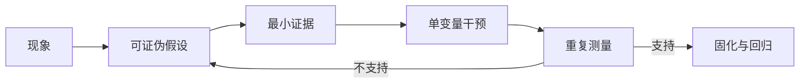

# 00 性能分析的基本语言

<details>
<summary>本篇分段导航：按首读范围进入，其余二读</summary>

- [1. 性能分析不是找最大的数字](#read-01)
- [2. 六个基础概念](#read-02)
- [3. 从 Python 到 GPU 的层次](#read-03)
- [4. GPU 为什么会慢：四个大类](#read-04)
- [5. 训练、推理、RL 分别测什么](#read-05)
- [6. 一次可信测量的七条规则](#read-06)
- [7. 症状到工具的第一棵决策树](#read-07)
- [8. 本章练习](#read-08)
- [参考资料](#read-09)
- [测量的深入边界与因果验证](#read-10)

</details>

<!-- learning-position -->
> **学习定位**：A1 · 必修。
> **前置**：[基础课程](<../../learn_docs/00_Foundations/README.md>)。
> **首读/二读**：延迟/吞吐/关键路径/测量边界，先于专业 profiler。
> **进度与实验**：[学习清单](<../../learn_docs/学习清单.md>) · [总入口](<../../learn_docs/README.md>)。
<!-- /learning-position -->

本章不使用 profiler。目标是先建立一套不会混淆的语言。你需要知道“测什么”“为什么慢”和“下一步该看哪里”。


<a id="read-01"></a>

## 1. 性能分析不是找最大的数字

假设 trace 中：

- GEMM kernel 累计 60 ms；
- NCCL 通信累计 30 ms；
- CPU 等待累计 20 ms；
- 整个 step 实际是 70 ms。

不能把三项相加得到 110 ms，因为计算、通信和 CPU 工作可能重叠。真正决定总时长的是**关键路径**：任何优化如果没有缩短关键路径，就不会缩短 step。

以后看到一个“很大的累计耗时”，先问：

1. 它在关键路径上吗？
2. 它是否与别的工作重叠？
3. 缩短它会让后续工作更早开始吗？


<a id="read-02"></a>

## 2. 六个基础概念

### 2.1 延迟 latency

完成一次操作花多长时间。

- 训练：一次 iteration/step 的秒数。
- 推理：一次请求的端到端时间。
- kernel：一次 launch 从开始到结束的微秒数。

延迟要报告分布，而不只是平均值：`p50` 是中位数，`p95` 表示 95% 样本不超过该值，`p99` 用来观察长尾。

### 2.2 吞吐 throughput

单位时间完成多少工作。

- 训练：samples/s、tokens/s、tokens/s/GPU。
- 推理：requests/s、input tokens/s、output tokens/s。
- 算子：TFLOP/s、GB/s。

提高并发常常能提高吞吐，但会增加排队和延迟。吞吐更高不代表用户体验更好。

### 2.3 利用率 utilization

某资源在采样窗口内有多忙。`nvidia-smi` 的 GPU 利用率只说明一段时间内 GPU 上是否有 kernel 活跃，不能证明 kernel 已接近硬件峰值。

下面几种情况都可能显示“GPU 利用率 100%”：

- 高效 Tensor Core GEMM；
- 很慢的低效率 kernel；
- 大量小 kernel 连续运行；
- 内存带宽已满但计算单元很闲。

所以利用率是报警器，不是诊断结论。

### 2.4 饱和 saturation

继续增加负载后，吞吐不再明显上升，但延迟和排队快速上升，此时系统达到容量拐点。推理服务一定要通过并发/RPS sweep 找到该点。

### 2.5 瓶颈 bottleneck

当前限制端到端性能的资源或阶段。瓶颈会随 workload 改变：小 batch 可能受 CPU launch 限制，大 batch 可能变成算力或显存带宽限制。

### 2.6 开销 overhead

为管理真正计算而付出的成本，例如 Python 调度、kernel launch、图编译、日志、checkpoint、序列化、HTTP 和 Ray object store。


<a id="read-03"></a>

## 3. 从 Python 到 GPU 的层次

以后看到“算子”一词，需要先问它指哪一层：

```text
业务/框架阶段
  例如 rollout、forward、backward、optimizer
        ↓
Python Module / Function
  例如 TransformerLayer、torch.matmul
        ↓
PyTorch ATen operator
  例如 aten::mm、aten::scaled_dot_product_attention
        ↓
后端库或生成代码
  例如 cuBLAS、cuDNN、FlashAttention、Triton、Inductor
        ↓
CUDA kernel
  Nsight/PyTorch trace 中看到的具体 kernel 名
        ↓
PTX / SASS 指令与 GPU 硬件
```

一个 Python 操作可能触发多个 ATen 算子；一个 ATen 算子也可能触发多个 CUDA kernel。`torch.compile` 还可能把多个 ATen 算子融合成一个 Triton kernel。因此不能只靠函数名猜测底层执行。


<a id="read-04"></a>

## 4. GPU 为什么会慢：四个大类

### 4.1 没有足够工作：latency/launch bound

特征：

- kernel 很短且数量很多；
- GPU 时间线有大量小间隙；
- CPU 线程持续发射 kernel；
- 增大 batch 后效率明显变好。

常见原因：micro-batch 太小、shape 太碎、Python/调度慢、没有融合、CUDA Graph 未命中。

### 4.2 计算受限：compute bound

特征：

- 大 GEMM/attention 占主导；
- Tensor Core/SM 吞吐接近硬件上限；
- 显存带宽没有满；
- 减少 FLOPs 或降低精度可能改善性能。

### 4.3 内存受限：memory bound

特征：

- DRAM/L2 吞吐高，计算吞吐相对低；
- elementwise、normalization、embedding、KV Cache 访问占比高；
- kernel fusion、减少读写、提高数据复用更可能有效。

### 4.4 等待受限：communication / synchronization / I/O bound

特征：

- GPU 时间线出现空洞或长 NCCL kernel；
- 某些 rank 先到 collective，等待最慢 rank；
- 数据加载、网络、存储或 checkpoint 与计算没有重叠；
- 单卡快，多卡扩展差。

NVIDIA 的 GPU 性能背景指南用算术强度和并行度来区分延迟、计算和内存限制；Nsight Compute 的 Roofline 是把这种判断数据化的工具。参见 [GPU Performance Background](https://docs.nvidia.com/deeplearning/performance/dl-performance-gpu-background/index.html) 与 [Nsight Compute Profiling Guide](https://docs.nvidia.com/nsight-compute/ProfilingGuide/index.html)。


<a id="read-05"></a>

## 5. 训练、推理、RL 分别测什么

### 5.1 训练

最低指标集：

- step time 的 p50/p95；
- tokens/s 和 tokens/s/GPU；
- data、forward、backward、optimizer、通信、checkpoint 分段；
- 每个 rank 的时间，至少保留 min/max 和最慢 rank；
- allocated/reserved/峰值显存；
- 正确性护栏：loss、grad norm、样本/token 数。

MFU（Model FLOPs Utilization）只有在 FLOPs 公式、精度峰值和统计范围一致时才可比较。不同文章中的 MFU 不能直接横比。

### 5.2 推理

最低指标集：

- TTFT：Time To First Token，首 token 等待时间；
- TPOT：首 token 之后平均每个输出 token 的处理时间；
- ITL：相邻 token 的间隔，用于观察抖动；
- E2E latency；
- request/input/output/total token throughput；
- p50/p95/p99；
- 并发、到达率、输入/输出长度分布、cache 命中率；
- 错误、超时、abort/retract。

同一框架在 `input=128/output=128` 和 `input=8192/output=128` 上不是同一个 workload，吞吐不能直接比较。

### 5.3 强化学习

RL 是训练和在线推理组成的流水线，还要测：

- rollout 生成时间；
- reward/tool/environment 的非生成时间；
- 训练等待 rollout 的时间；
- logprob/ref/teacher forward；
- actor train；
- 权重同步；
- 模型 offload/onload；
- 每轮有效 token 数与样本长度分布。

局部最快不等于端到端最快。给训练侧更多 GPU 可能让它更早结束，却更久地等待 rollout。


<a id="read-06"></a>

## 6. 一次可信测量的七条规则

1. **固定代码**：记录 commit，禁止边测边改。
2. **固定环境**：容器、驱动、CUDA、PyTorch、框架版本不变。
3. **固定 workload**：数据、seed、长度、batch、并发和采样参数不变。
4. **先 warmup**：排除模型加载、JIT 编译、autotune、CUDA Graph capture 和 allocator 初始化。
5. **CUDA 要同步**：普通 Python 计时会漏掉异步 GPU 工作。
6. **重复并看分布**：至少报告中位数和波动；长任务按 step 分布。
7. **一次只改一个变量**：否则无法知道哪个改动产生效果。


<a id="read-07"></a>

## 7. 症状到工具的第一棵决策树

```text
端到端变慢
├─ GPU 利用率低或有周期性空洞
│  ├─ CPU 忙：py-spy / PyTorch Profiler / Nsight Systems
│  ├─ data/IO 忙：pidstat / iostat / dataloader timer
│  └─ 多 rank 互等：rank timer / NCCL / Nsight Systems
├─ GPU 持续忙
│  ├─ 已锁定热点 op：PyTorch Profiler
│  └─ 已锁定热点 kernel：Nsight Compute / Roofline
├─ OOM 或显存逐步上涨
│  ├─ PyTorch allocator：Memory Snapshot
│  └─ Python/native host memory：Memray
├─ 推理延迟随并发爆炸
│  └─ benchmark sweep + scheduler/KV/queue metrics
└─ Slime 一轮很慢
   ├─ wait_time_ratio 高：分析 rollout
   └─ wait_time_ratio 低且 actor_train 慢：分析训练
```


<a id="read-08"></a>

## 8. 本章练习

找一个你正在运行的任务，用一句话填写：

```text
我要优化的用户可见指标是：________________
固定的 workload 是：________________________
当前基线是：________________________________
我怀疑的瓶颈层次是：________________________
验证该假设所需的最小工具是：________________
```

如果第一行写不出来，先不要打开 profiler。没有目标指标，就无法判断优化是否成功。


<a id="read-09"></a>

## 参考资料

- [NVIDIA GPU Performance Background](https://docs.nvidia.com/deeplearning/performance/dl-performance-gpu-background/index.html)
- [NVIDIA Deep Learning Performance](https://docs.nvidia.com/deeplearning/performance/index.html)
- [Nsight Compute Profiling Guide](https://docs.nvidia.com/nsight-compute/ProfilingGuide/index.html)
- [PyTorch Benchmark Recipe](https://docs.pytorch.org/tutorials/recipes/recipes/benchmark.html)
- [vLLM Benchmark CLI](https://docs.vllm.ai/en/latest/benchmarking/cli/)
- [SGLang Bench Serving Guide](https://docs.sglang.ai/developer_guide/bench_serving)


<a id="concept-01"></a>


<a id="read-10"></a>

## 测量的深入边界与因果验证

### 3. 用“假设—证据—干预”闭环



例：GPU 每 80 ms 出现 12 ms 空洞。

- 假设 A：DataLoader 供给不足。证据应是 CPU data range 延长、队列为空，且预生成 batch 后空洞消失。
- 假设 B：每步同步日志。证据应是空洞前出现 `cudaDeviceSynchronize` 或 `.item()` 对应 CPU stack，关闭同步日志后消失。
- 假设 C：gradient AllReduce 暴露。证据应是 NCCL kernel 占据该区间，而不是 GPU 完全空闲。

只根据一个截图猜原因，不构成闭环。


### 5. Warm-up 不是随便丢掉前几步

首轮可能包含：CUDA context 初始化、lazy module 初始化、memory pool 扩张、JIT（Just-In-Time，即时）编译、`torch.compile` tracing/compilation、autotuning、CUDA Graph capture、通信器建立与文件缓存升温。

正确做法是画出逐步时间，确认进入稳态后再选窗口。动态 shape 可能触发多次 recompilation；此时“第 10 步以后都是稳态”并不成立。


### 6. Profiler 会改变被测对象

- trace 事件越多，CPU 写缓冲和输出文件越大；Python stack、shape、memory 记录都有额外开销。
- Nsight Compute 采集硬件 counter 时可能多次 replay 同一个 kernel。
- Nsight Systems 和 DCGM 都可能竞争有限的 GPU performance counter；必要时暂停 DCGM profiling metrics，完成后恢复。
- profiler 本身消耗 GPU memory；接近显存上限的任务可能只在 profiling 时 OOM。
- 多 rank 同时写 trace 会放大共享文件系统抖动。

因此采用三级策略：常驻低开销 metric → 少量 rank 的短窗口 trace → 只对少量 kernel 做 counter replay。


### 7. 平均值会藏住最重要的问题

报告至少包含：median（中位数）、p90/p95/p99、min/max、变异系数和样本数。分布式 step 由最慢 rank 决定；在线服务由 tail latency 决定。平均 20 ms 的 collective 若每 200 步出现一次 300 ms 长尾，平均数仍可能很好看。

不要对不同输入长度直接聚合。Attention 复杂度、KV cache 占用和 batching 效率都随输入形状变化。应按 input sequence length（ISL，输入序列长度）、output sequence length（OSL，输出序列长度）、batch/concurrency 分桶。


### 8. 相关性不等于因果

GPU 功耗下降与网络通信变长同时发生，不代表降频导致通信慢：更可能是 GPU 在等网络，所以功耗下降。可用干预区分：固定时钟/功耗后是否仍慢；对通信做独立 microbenchmark；替换成 synthetic data；临时禁用某段 overlap。


### 9. 性能改动的完成定义

一个改动只有同时满足以下条件才算完成：

1. 目标指标在多次独立运行中稳定改善；
2. correctness/accuracy 不退化；
3. p99、峰值显存、功耗或错误率没有不可接受恶化；
4. 在至少两个代表性 shape 上成立；
5. 证据能解释为什么快，而非偶然波动；
6. 有自动化回归阈值和回退方案。
