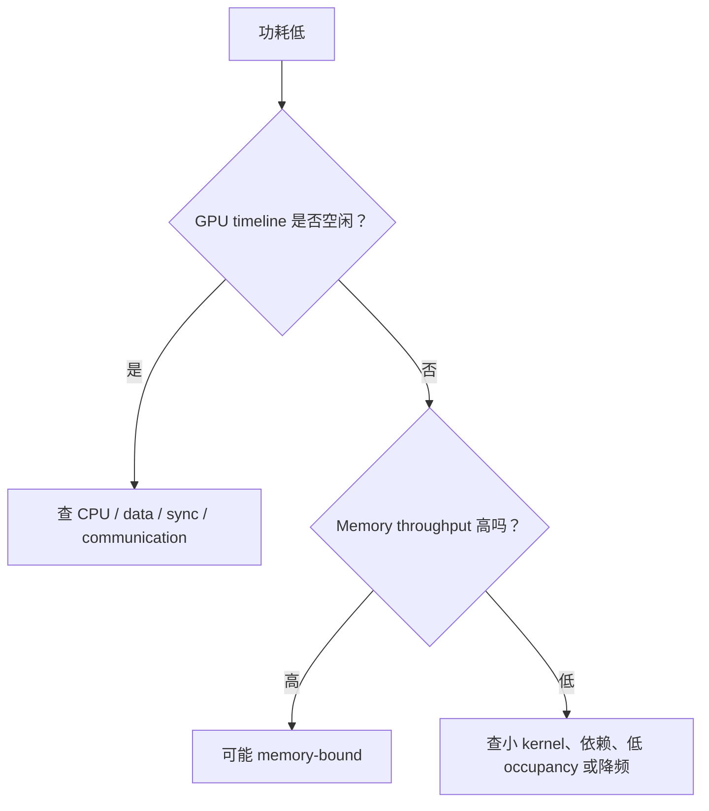

# 01 建立环境清单与可信基线

<details>
<summary>本篇分段导航：按首读范围进入，其余二读</summary>

- [1. 建立实验目录](#read-01)
- [2. 记录软件与硬件环境](#read-02)
- [3. 保存完整启动命令和 workload](#read-03)
- [4. 先用 nvidia-smi 看“生命体征”](#read-04)
- [5. 同时观察 CPU、内存、磁盘和网络](#read-05)
- [6. 正确做 warmup 和测量](#read-06)
- [7. 基线结果必须包含正确性](#read-07)
- [8. A/B 实验模板](#read-08)
- [9. 什么时候进入下一层工具](#read-09)
- [本章完成标准](#read-10)
- [参考资料](#read-11)
- [理解 GPU 遥测而不误读利用率](#read-12)

</details>

<!-- learning-position -->
> **学习定位**：A1 · 必修。
> **前置**：[基础课程](<../../learn_docs/00_Foundations/README.md>)。
> **首读/二读**：固定环境、workload、重复统计；建立 H20 环境记录。
> **进度与实验**：[学习清单](<../../learn_docs/学习清单.md>) · [总入口](<../../learn_docs/README.md>)。
<!-- /learning-position -->

本章完成后，你会得到一个不依赖高级 profiler 的基线包：环境、启动命令、workload、端到端指标和系统资源曲线。后续所有分析都从它开始。


<a id="read-01"></a>

## 1. 建立实验目录

不要把 trace 和日志散落在源码目录。下面的路径只是示例，放在有足够空间的磁盘：

```bash
RUN_ID="baseline_$(date +%Y%m%d_%H%M%S)"
ARTIFACT_DIR="/tmp/perf_artifacts/${RUN_ID}"
mkdir -p "${ARTIFACT_DIR}"
printf '%s\n' "${ARTIFACT_DIR}"
```

生产环境应使用持久化共享存储，而不是 `/tmp`。trace 可能达到 GB 级，先检查：

```bash
df -h "${ARTIFACT_DIR}"
df -i "${ARTIFACT_DIR}"
```


<a id="read-02"></a>

## 2. 记录软件与硬件环境

把下面命令的输出保存到实验目录。`tee` 既显示也保存：

```bash
git rev-parse HEAD | tee "${ARTIFACT_DIR}/git_commit.txt"
git status --short --branch | tee "${ARTIFACT_DIR}/git_status.txt"

python - <<'PY' | tee "${ARTIFACT_DIR}/python_env.txt"
import os
import platform
import torch

print("platform:", platform.platform())
print("python:", platform.python_version())
print("torch:", torch.__version__)
print("torch cuda runtime:", torch.version.cuda)
print("cudnn:", torch.backends.cudnn.version())
print("cuda available:", torch.cuda.is_available())
print("CUDA_VISIBLE_DEVICES:", os.environ.get("CUDA_VISIBLE_DEVICES"))
if torch.cuda.is_available():
    for i in range(torch.cuda.device_count()):
        p = torch.cuda.get_device_properties(i)
        print(i, p.name, p.total_memory, p.major, p.minor)
PY

nvidia-smi -q | tee "${ARTIFACT_DIR}/nvidia_smi_q.txt"
nvidia-smi topo -m | tee "${ARTIFACT_DIR}/gpu_topology.txt"
lscpu | tee "${ARTIFACT_DIR}/lscpu.txt"
numactl -H 2>&1 | tee "${ARTIFACT_DIR}/numa.txt"
```

多节点任务每个节点都要记录。不要假设同一集群的节点完全同构；驱动、GPU clock、NIC mapping 或故障状态差异都可能制造 straggler。

如果使用容器，还要记录镜像 digest，而不只是可变 tag。


<a id="read-03"></a>

## 3. 保存完整启动命令和 workload

至少保存：

- 完整命令与所有参数；
- 环境变量；
- 模型、checkpoint、数据集及其版本；
- seed；
- batch/micro-batch/sequence length；
- 并行配置和 rank placement；
- 推理的输入/输出长度分布、并发或 RPS；
- 是否启用 cache、CUDA Graph、compile、quantization。

环境变量中可能有 token、密码、代理凭据。保存前只筛选与性能有关的变量：

```bash
env | sort | rg '^(CUDA|NCCL|TORCH|PYTORCH|OMP|MKL|RAY|SGLANG|VLLM)_' \
  | tee "${ARTIFACT_DIR}/performance_env.txt"
```

不要把完整 `env` 直接上传到 issue 或 PR。


<a id="read-04"></a>

## 4. 先用 nvidia-smi 看“生命体征”

### 4.1 一次性查询

```bash
nvidia-smi --query-gpu=timestamp,index,name,uuid,pci.bus_id,pstate,temperature.gpu,power.draw,clocks.sm,clocks.mem,utilization.gpu,utilization.memory,memory.used,memory.total \
  --format=csv
```

关注：

- 某张卡利用率明显低于其他卡；
- 功耗和 SM clock 被限制；
- 温度过高导致降频；
- 显存分布不符合 PP/TP/EP 预期；
- GPU UUID 与 rank placement 不一致。

### 4.2 连续采样

```bash
nvidia-smi dmon -s pucvmet -d 1 \
  | tee "${ARTIFACT_DIR}/nvidia_dmon.txt"
```

不同驱动支持的 `dmon` metric group 可能不同，先运行 `nvidia-smi dmon --help`。官方文档说明了 `p/u/c/v/m/e/t` 等组的含义：[nvidia-smi 文档](https://docs.nvidia.com/deploy/nvidia-smi/index.html)。

`nvidia-smi` 的一秒采样会掩盖毫秒级空洞，所以它只能判断“哪张卡或哪个阶段可疑”，不能替代时间线 profiler。

### 4.3 DCGM：长任务与集群监控

如果机器安装 DCGM，可以低开销持续观察 SM、Tensor Core、DRAM、PCIe/NVLink 等指标。先查询本机支持字段：

```bash
dcgmi profile --list --entity-id gpu:0
```

示例字段必须按查询结果选择；官方示例用 1002（SM activity）和 1005（DRAM activity）：

```bash
dcgmi dmon --entity-id gpu:0 --field-id 1002,1005 --delay 1000
```

DCGM 的 profiling counter 可能与 Nsight 冲突。使用 Nsight 前暂停、完成后恢复：

```bash
dcgmi profile --pause
# 运行 nsys 或 ncu
dcgmi profile --resume
```

参见 [DCGM Profiling](https://docs.nvidia.com/datacenter/dcgm/latest/learn/modules/profiling.html)。


<a id="read-05"></a>

## 5. 同时观察 CPU、内存、磁盘和网络

GPU 空闲不一定是 GPU 问题。

### 5.1 进程级 CPU 和 I/O

```bash
PID=<目标进程PID>
pidstat -dur -p "${PID}" 1
top -H -p "${PID}"
```

解释：

- 单线程 100% 且 GPU 有空洞：Python、tokenizer、scheduler 或数据预处理可能串行；
- 大量 context switch：线程/进程过多或锁竞争；
- `iodelay`/读写持续高：数据或 checkpoint 可能在关键路径上。

### 5.2 系统级内存和磁盘

```bash
vmstat 1
iostat -xz 1
```

关注 swap、page fault、磁盘 `%util`、await 和队列。不要只看磁盘带宽；很多小文件会受 IOPS/metadata 限制。

### 5.3 网络与拓扑

```bash
nvidia-smi topo -m
ip -s link
```

多节点还应使用集群提供的 InfiniBand/RoCE 工具。通信慢时，先用 `nccl-tests` 建立硬件/网络基线，再分析框架。官方示例：

```bash
./build/all_reduce_perf -b 8 -e 128M -f 2 -g 8
```

多节点构建和 `busbw` 解释见 [NVIDIA nccl-tests](https://github.com/NVIDIA/nccl-tests)。


<a id="read-06"></a>

## 6. 正确做 warmup 和测量

第一次运行常包含：

- CUDA context 初始化；
- 权重 page-in；
- JIT/Triton/Inductor 编译；
- cuBLAS/cuDNN autotune；
- CUDA Graph capture；
- PyTorch allocator 扩容；
- 文件系统 cache 冷启动。

除非目标就是冷启动，否则把这些步骤与稳态分开报告。

推荐：

```text
初始化
-> warmup 5~20 次（直到 step time 稳定）
-> 测量 30~100 次
-> 报告 p50/p95/min/max
```

长训练不必人为跑 100 步，但应剔除启动阶段，并覆盖正常的数据长度变化。


<a id="read-07"></a>

## 7. 基线结果必须包含正确性

性能优化可能让结果变错。每个基线保存：

- loss/grad norm 或输出 logits 摘要；
- 生成 token 和 EOS 行为；
- 有效样本/token 数；
- 错误、超时、丢请求数；
- 若改精度，保存误差阈值和比较方式。

只有“更快且正确”才是有效优化。


<a id="read-08"></a>

## 8. A/B 实验模板

在实验前写，不要在结果出来后补故事：

```text
目标指标：tokens/s/GPU
基线：TP=8, PP=1, MBS=1
观察：GPU 时间线中 NCCL 暴露，GEMM 很小
假设：TP 过大导致通信占关键路径且 GEMM 利用率低
唯一改动：TP=4, PP=2
保持不变：GBS、token budget、模型、数据、精度、GPU 数
正确性护栏：前 20 step loss 和 grad norm
性能窗口：warmup 10 step，测量 50 step
成功门槛：p50 tokens/s/GPU 提升 >= 5%，p95 step 不退化
回滚：恢复原并行配置
```


<a id="read-09"></a>

## 9. 什么时候进入下一层工具

完成本章后，先根据基线分流：

| 观察 | 下一步 |
|---|---|
| GPU 低、CPU 高 | 第 2 章 PyTorch/Python；必要时 py-spy |
| GPU 高但吞吐低 | 第 2 章找 op，再到第 3 章找 kernel 原因 |
| 卡间差异大 | 第 4 章 rank timer、NCCL、拓扑 |
| OOM/显存上涨 | 第 2 章 Memory Snapshot |
| 推理随并发崩坏 | 第 5 章容量 sweep、scheduler/KV 指标 |
| Slime 训练在等待 | 第 6 章先分析 rollout |


<a id="read-10"></a>

## 本章完成标准

只有同时具备以下文件，才算完成：

- commit/镜像/依赖版本；
- 完整命令和筛选后的性能环境变量；
- workload 描述；
- warmup 和测量窗口；
- 端到端指标分布；
- GPU/CPU/内存/IO 的低开销监控；
- 正确性结果；
- 下一步的一个明确假设。


<a id="read-11"></a>

## 参考资料

- [nvidia-smi 官方文档](https://docs.nvidia.com/deploy/nvidia-smi/index.html)
- [NVIDIA DCGM Profiling](https://docs.nvidia.com/datacenter/dcgm/latest/learn/modules/profiling.html)
- [NVIDIA nccl-tests](https://github.com/NVIDIA/nccl-tests)
- [PyTorch Benchmark Recipe](https://docs.pytorch.org/tutorials/recipes/recipes/benchmark.html)
- [PyTorch Performance Tuning Guide](https://docs.pytorch.org/tutorials/recipes/recipes/tuning_guide.html)


<a id="concept-02"></a>


<a id="read-12"></a>

## 理解 GPU 遥测而不误读利用率

#### 1. 三种常被混淆的“利用率”

| 名称 | 大致含义 | 能说明什么 | 不能说明什么 |
|---|---|---|---|
| GPU utilization | 采样窗口内是否有 kernel 在执行 | GPU 是否经常完全空闲 | kernel 是否高效、Tensor Core 是否吃满 |
| SM activity/throughput | Streaming Multiprocessor（SM，流式多处理器）的活跃/吞吐 | 执行单元忙碌程度 | 单独不能区分有用工作与低效指令 |
| MFU | 有效模型 FLOPs / 理论峰值 FLOPs | 端到端模型计算效率 | 依赖 FLOPs 口径，跨报告未必可比 |

因此出现 `GPU-Util=100%`、Model FLOPs Utilization（MFU，模型浮点运算利用率）仅 25% 并不矛盾：GPU 一直在执行，但可能在运行小 kernel、访存等待、低效 layout conversion 或通信 kernel。


#### 3. DCGM：集群级 GPU 遥测

DCGM（Data Center GPU Manager，数据中心 GPU 管理器）提供 health、diagnostics、statistics 与 profiling metrics。`dcgm-exporter` 把指标暴露给 Prometheus。Exporter 从 hostengine 已 watch 的缓存样本读取，所以 Prometheus scrape interval 不是硬件 counter 的真实采样周期。

推荐四组指标：

| 组 | 例子 | 用途 |
|---|---|---|
| 资源 | GPU/显存利用率、framebuffer used | 容量与空闲检测 |
| 计算/内存 | SM active、Tensor active、DRAM active、PCIe/NVLink throughput | 判断工作类型和链路压力 |
| 热与功耗 | clocks、power、temperature、throttle reason | 发现降频和散热问题 |
| 可靠性 | Xid、ECC、NVLink error、row remap | 发现硬件/driver 异常 |

ECC = Error-Correcting Code（纠错码）。Xid 是 NVIDIA driver 报告的 GPU 错误事件编号；它是定位入口，不应脱离具体编号和上下文笼统解释。


#### 4. 从“低功耗”推断时要谨慎

可能路径：



Memory-bound kernel 可能占满时间线但功耗低于大型 Tensor Core GEMM。反过来，高功耗也不证明模型有效吞吐高。


#### 5. 时钟与降频

记录 SM clock、memory clock、power limit、temperature 与 throttle reason。性能突然出现平台期时：

- power cap：功耗达到上限，时钟被限制；
- thermal throttle：温度导致降频；
- application clock/locked clock 配置不一致；
- 不同节点 GPU firmware 或 power policy 不一致。

锁定时钟适合可控 benchmark，但会改变能效和生产策略，必须记录并在实验后恢复。新 GPU 上具体命令与支持状态应以对应 `nvidia-smi` 手册为准。


#### 6. 采样粒度与 aliasing

若每 100 ms 有一次 5 ms 空洞，而遥测每 1 秒采一个均值，它可能完全不可见。这叫 aliasing（混叠）：采样频率不足导致真实周期被误表示。

长期监控用秒级 metric；短时 bubble 用微秒级 timeline。不要试图用 Prometheus 替代 profiler，也不要把 30 秒 trace 当线上容量趋势。


#### 7. Counter 资源冲突

DCGM profiling metrics、Nsight Systems GPU metrics 与 Nsight Compute 可能使用同一组硬件性能计数器。若 profiler 提示 counter unavailable，可用：

```bash
dcgmi profile --pause
# 运行短时 profiler
dcgmi profile --resume
```

暂停会影响集群遥测，必须在维护窗口执行并确保恢复。不同 GPU 支持的 field group 不同，可先用 `dcgmi profile --list` 查询。


#### 8. 一个最小 dashboard

每 GPU 至少同时画：

1. job/rank identity 与 GPU UUID；
2. GPU、SM、Tensor、DRAM activity；
3. framebuffer used 与 allocator-reported memory；
4. PCIe、NVLink、NIC throughput；
5. power、clock、temperature、throttle；
6. Xid/ECC/NVLink error；
7. 应用 step/TTFT/queue/KV-cache 指标。

只有硬件图没有应用 phase，常常只能看到“慢了”，看不到“哪一步慢了”。
