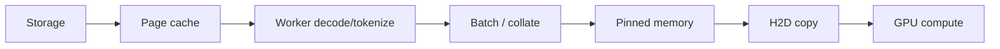
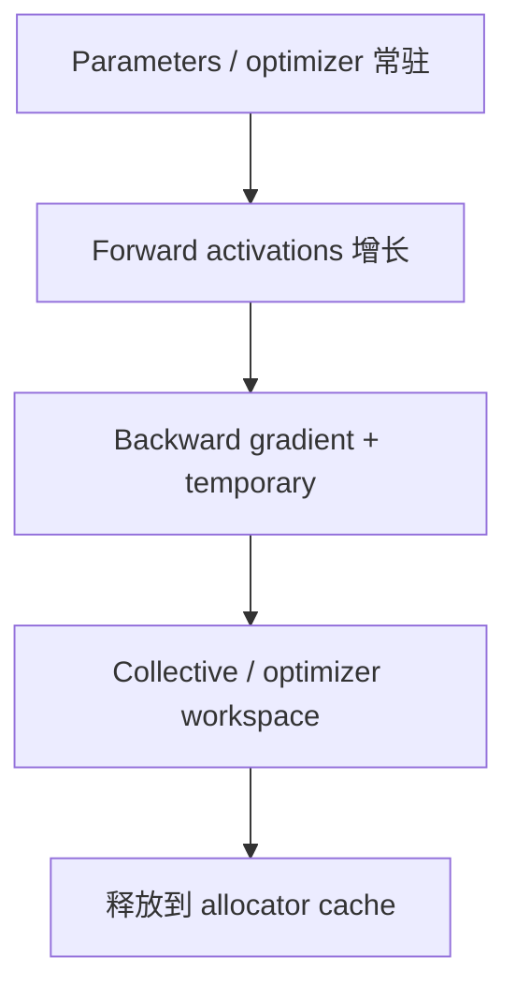

# 02 PyTorch：从 Python 代码看到算子和 kernel

<details>
<summary>本篇分段导航：按首读范围进入，其余二读</summary>

- [1. 先理解三个名字](#read-01)
- [2. 第一个正确的 CUDA 计时实验](#read-02)
- [3. 用 torch.utils.benchmark 比较实现](#read-03)
- [4. 用 PyTorch Profiler 看 operator 与 kernel](#read-04)
- [5. trace 应该怎么看](#read-05)
- [6. 从 operator 找到底层实现](#read-06)
- [7. 显存：allocated、reserved 和非 PyTorch 分配](#read-07)
- [8. 用 Memory Snapshot 定位 OOM](#read-08)
- [9. CPU Python：cProfile、py-spy 和 Memray](#read-09)
- [10. torch.compile：看 graph break、重编译和生成 kernel](#read-10)
- [11. 一个完整的 PyTorch 排查流程](#read-11)
- [本章完成标准](#read-12)
- [参考资料](#read-13)
- [Profiler 的语义标注与编译边界](#read-14)
- [CPU 数据供应与 GPU 等待](#read-15)
- [显存峰值与资源生命周期](#read-16)

</details>

<!-- learning-position -->
> **学习定位**：A1/A6 · 必修。
> **前置**：[基础课程](<../../learn_docs/00_Foundations/README.md>)。
> **首读/二读**：从 CUDA 正确计时到首份 operator/kernel/memory trace。
> **进度与实验**：[学习清单](<../../learn_docs/学习清单.md>) · [总入口](<../../learn_docs/README.md>)。
<!-- /learning-position -->

本章从一个 `torch.matmul` 出发，依次看到 Python 调用、ATen operator、CUDA kernel、调用栈和显存分配。先完成单卡小实验，再把方法搬到大框架。


<a id="read-01"></a>

## 1. 先理解三个名字

在 profiler 中常同时出现：

- `model_forward`：你用 `record_function` 标记的业务区间；
- `aten::mm` / `aten::matmul`：PyTorch dispatcher 中的 operator；
- `ampere_*gemm*`、`sm90_*gemm*` 或 Triton 生成名：GPU 实际执行的 CUDA kernel。

它们不是重复记录，而是同一执行链的不同层。


<a id="read-02"></a>

## 2. 第一个正确的 CUDA 计时实验

Python 的 `time.perf_counter()` 只测 CPU。CUDA 默认异步：Python 发出 kernel 后可能立即返回。最直接的正确写法是在测量边界同步：

```python
import statistics
import time
import torch

device = "cuda"
a = torch.randn(4096, 4096, device=device, dtype=torch.float16)
b = torch.randn(4096, 4096, device=device, dtype=torch.float16)

# warmup：排除 context、allocator、库初始化等
for _ in range(10):
    torch.mm(a, b)
torch.cuda.synchronize()

times_ms = []
for _ in range(50):
    torch.cuda.synchronize()
    start = time.perf_counter()
    torch.mm(a, b)
    torch.cuda.synchronize()
    times_ms.append((time.perf_counter() - start) * 1000)

times_ms.sort()
print("median ms:", statistics.median(times_ms))
print("p95 ms:", times_ms[int(len(times_ms) * 0.95) - 1])
```

同步会改变高频小操作的执行方式，所以做 microbenchmark 更推荐 `torch.utils.benchmark`、CUDA Event 或 Triton 的 `do_bench`。但端到端边界同步是理解异步语义的第一步。


<a id="read-03"></a>

## 3. 用 torch.utils.benchmark 比较实现

PyTorch 官方 benchmark 模块会处理 warmup、重复和线程数等常见陷阱：

```python
import torch
import torch.utils.benchmark as benchmark

a = torch.randn(2048, 2048, device="cuda", dtype=torch.float16)
b = torch.randn(2048, 2048, device="cuda", dtype=torch.float16)

measurement = benchmark.Timer(
    stmt="torch.mm(a, b)",
    globals={"torch": torch, "a": a, "b": b},
    label="matmul",
    sub_label="fp16",
    description="2048x2048",
).blocked_autorange(min_run_time=2.0)

print(measurement)
```

比较两个实现时必须使用同样的 shape、dtype、layout、device 和正确性检查。不要只比较最快的一次。

官方教程：[PyTorch Benchmark Recipe](https://docs.pytorch.org/tutorials/recipes/recipes/benchmark.html)。


<a id="read-04"></a>

## 4. 用 PyTorch Profiler 看 operator 与 kernel

### 4.1 最小 trace

```python
from pathlib import Path
import torch

out_dir = Path("/tmp/pytorch_profile")
out_dir.mkdir(parents=True, exist_ok=True)

a = torch.randn(2048, 2048, device="cuda", dtype=torch.float16)
b = torch.randn(2048, 2048, device="cuda", dtype=torch.float16)

for _ in range(5):
    torch.mm(a, b)
torch.cuda.synchronize()

with torch.profiler.profile(
    activities=[
        torch.profiler.ProfilerActivity.CPU,
        torch.profiler.ProfilerActivity.CUDA,
    ],
    record_shapes=True,
    profile_memory=True,
    with_stack=True,
) as prof:
    with torch.profiler.record_function("my_matmul"):
        c = torch.mm(a, b)
    torch.cuda.synchronize()

print(
    prof.key_averages(group_by_input_shape=True).table(
        sort_by="self_cuda_time_total",
        row_limit=20,
    )
)
prof.export_chrome_trace(str(out_dir / "matmul_trace.json"))
```

如果本机 PyTorch 列名不同，先打印不带 `sort_by` 的表。Profiler API 和字段会随版本演进。

### 4.2 长训练只抓少量稳定 step

不要从初始化到结束全程记录。官方 schedule 模型是 `skip/wait -> warmup -> active -> repeat`：

```python
def on_trace_ready(prof):
    prof.export_chrome_trace(f"/tmp/pytorch_profile/step_{prof.step_num}.json")

schedule = torch.profiler.schedule(
    skip_first=5,
    wait=1,
    warmup=1,
    active=3,
    repeat=1,
)

with torch.profiler.profile(
    activities=[
        torch.profiler.ProfilerActivity.CPU,
        torch.profiler.ProfilerActivity.CUDA,
    ],
    schedule=schedule,
    on_trace_ready=on_trace_ready,
    record_shapes=True,
) as prof:
    for step, batch in enumerate(loader):
        train_step(batch)
        prof.step()  # 每个逻辑 step 结束必须推进 schedule
```

`with_stack=True`、`record_shapes=True`、`profile_memory=True` 都会增加开销和文件体积。先不开，只有需要对应源码、shape 或分配时再逐项启用。

官方完整说明：[PyTorch Profiler Recipe](https://docs.pytorch.org/tutorials/recipes/recipes/profiler_recipe.html)。


<a id="read-05"></a>

## 5. trace 应该怎么看

把 JSON 拖到 [Perfetto](https://ui.perfetto.dev/)；TensorBoard 插件也可以读取 `tensorboard_trace_handler` 生成的 trace。

按下面顺序，不要一打开就搜索 kernel 名：

1. **确定测量窗口**：排除 warmup、编译和加载。
2. **看 GPU 是否有空洞**：空洞代表没有 kernel 执行，不代表 kernel 本身慢。
3. **对齐 CPU 和 GPU**：GPU 空洞之前 CPU 在 tokenizer、dataloader、锁、同步还是 launch？
4. **看 stream**：计算和通信是否并行；memcpy 是否阻塞计算。
5. **看 rank 差异**：同一阶段谁最晚结束。
6. **再看 operator/kernel 累计表**：锁定关键路径中的热点。

### 5.1 常见模式

| 时间线模式 | 第一解释假设 | 下一步 |
|---|---|---|
| GPU 空洞，CPU 同时在 `aten::item` | `.item()` 引发 host-device 同步 | 搜索同步调用，做移除/降频 A/B |
| 大量很短的 pointwise kernel | launch overhead / 未融合 | 检查 `torch.compile`、shape、graph break |
| memcpy 与计算串行 | 数据搬运没有 overlap | 检查 pinned memory、non_blocking、stream |
| 单个 rank 先进入 NCCL 并等待 | 其他 rank 是 straggler | 对齐所有 rank 的前一阶段 |
| 第一次 step 特别长 | compile/capture/autotune | 分开报告冷启动与稳态 |


<a id="read-06"></a>

## 6. 从 operator 找到底层实现

### 6.1 看 schema

```python
import torch

print(torch.ops.aten.mm.default._schema)
print(torch.ops.aten.add.Tensor._schema)
```

### 6.2 看 dispatcher kernel

较新的 PyTorch 提供公开的读取接口：

```python
import torch

cuda_kernel = torch.library.get_kernel("aten::add.Tensor", "CUDA")
print(cuda_kernel)
```

调试 PyTorch 自身时，也常用下面的**内部 API**查看 dispatch table：

```python
print(torch._C._dispatch_dump_table("aten::add.Tensor"))
```

内部 API 没有稳定兼容保证，应用代码不要依赖它。PyTorch dispatcher 会根据 tensor 设备、dtype 相关状态、autograd/autocast 等 dispatch key 选择 kernel。参考 [Registering a Dispatched Operator](https://docs.pytorch.org/tutorials/advanced/dispatcher.html) 和 [torch.library](https://docs.pytorch.org/docs/main/library.html)。

### 6.3 用调用栈把 operator 对回源码

Profiler 开启 `with_stack=True` 后，在事件详情或按 stack 分组的表中查看 Python/C++ 调用位置。若报 C++ 错误需要堆栈，可临时：

```bash
TORCH_SHOW_CPP_STACKTRACES=1 python your_script.py
```

它主要用于错误归因，不是性能计时工具。

### 6.4 为什么一个 ATen op 对应多个 kernel

常见原因：

- 算子内部包含预处理、主 kernel、后处理；
- reduction 分多阶段；
- backend 根据 shape 选择不同算法；
- 分布式 op 包含 pack/copy/collective/unpack；
- eager 模式没有融合；
- compile 模式把多个 op 融合或生成新的 Triton kernel。

最终映射要靠时间线相关关系，而不是仅凭名字。


<a id="read-07"></a>

## 7. 显存：allocated、reserved 和非 PyTorch 分配

```python
print(torch.cuda.memory_summary())
print("allocated:", torch.cuda.memory_allocated())
print("reserved:", torch.cuda.memory_reserved())
print("peak allocated:", torch.cuda.max_memory_allocated())
```

- allocated：当前被 tensor 等对象实际占用的 allocator block。
- reserved：PyTorch 从 CUDA 申请并缓存的 segment，包含未使用/碎片 block。
- `nvidia-smi`：进程 CUDA context 和第三方库等更宽口径。

`reserved - allocated` 大不等于内存泄漏，可能是 caching allocator 和碎片。


<a id="read-08"></a>

## 8. 用 Memory Snapshot 定位 OOM

```python
import torch

torch.cuda.memory._record_memory_history(
    stacks="all",
    max_entries=100_000,
)

try:
    run_workload()
finally:
    torch.cuda.memory._dump_snapshot("/tmp/memory_snapshot.pickle")
    torch.cuda.memory._record_memory_history(enabled=None)
```

打开 [PyTorch Memory Viz](https://pytorch.org/memory_viz)，拖入 pickle。重点看：

1. Active Memory Timeline 是否随 step 单调上涨；
2. OOM 前出现了什么大分配；
3. allocation stack 对应哪一行；
4. segment 中是否有大量无法复用的小碎片；
5. 峰值发生在 forward、backward 还是 optimizer。

限制：Memory Snapshot 默认只能看到 PyTorch allocator 管理的显存。NCCL 和第三方 `cudaMalloc` 可能不可见；对比 `torch.cuda.device_memory_used()`、PyTorch allocator 数字和 `nvidia-smi`。详见 [Understanding CUDA Memory Usage](https://docs.pytorch.org/docs/stable/torch_cuda_memory.html)。

记录分配历史本身占内存，长任务一定限制 `max_entries` 和记录窗口。


<a id="read-09"></a>

## 9. CPU Python：cProfile、py-spy 和 Memray

### 9.1 cProfile

适合可以重启、希望精确统计 Python 函数调用的最小复现：

```bash
python -m cProfile -o /tmp/profile.prof your_script.py
pip install snakeviz
snakeviz /tmp/profile.prof
```

插桩 profiler 会扰动程序，不适合直接证明细小延迟差。

### 9.2 py-spy

适合附着到正在运行的 Python 进程，低开销看火焰图或 hang：

```bash
py-spy top --pid <PID>
py-spy dump --pid <PID>
py-spy record -o /tmp/python_flame.svg --pid <PID>
```

容器或其他用户进程可能需要 ptrace 权限。官方项目：[py-spy](https://github.com/benfred/py-spy)。

### 9.3 Memray

适合 Python、解释器和 native extension 的 host memory：

```bash
python -m memray run -o /tmp/memray.bin your_script.py
python -m memray flamegraph /tmp/memray.bin
python -m memray summary /tmp/memray.bin
```

它不是 CUDA allocator profiler。官方项目：[Memray](https://github.com/bloomberg/memray)。


<a id="read-10"></a>

## 10. torch.compile：看 graph break、重编译和生成 kernel

`torch.compile` 的性能问题常来自编译时间、graph break、shape guard 失败和重复编译。先分开测：

```text
第一次调用：编译 + 执行
后续稳定调用：只执行（或 cache hit）
```

逐项开启日志，不要一次把所有日志打满：

```bash
TORCH_LOGS="graph_breaks,recompiles" python your_script.py
TORCH_LOGS="guards,perf_hints" python your_script.py
TORCH_LOGS="output_code" python your_script.py
```

- `graph_breaks`：为什么不能形成更大图；
- `recompiles`：哪个 guard 变化导致重新编译；
- `perf_hints`：例如 CUDA Graph 为什么未应用；
- `output_code`：Inductor 生成的 Triton/C++ 代码，输出很大。

不同 shape 高频重编译时，先固定输入验证，再考虑 dynamic shape；不要直接把 compile 关掉并宣称它“更慢”。官方说明：[torch._logging](https://docs.pytorch.org/docs/stable/logging) 与 [Profiling torch.compile](https://docs.pytorch.org/docs/main/user_guide/torch_compiler/torch.compiler_profiling_torch_compile.html)。


<a id="read-11"></a>

## 11. 一个完整的 PyTorch 排查流程

```text
1. 固定 shape/dtype/device/seed
2. warmup 后做同步基线
3. PyTorch Profiler 抓 1~3 个稳定 step
4. 看 GPU 空洞与 CPU/GPU 对齐
5. 在关键路径中找到 ATen op
6. 用 shape + stack 找回模型源码
7. 找到该 op 对应的 CUDA kernel
8. 如果问题是单 kernel 效率，再进入第 3 章 ncu
9. 一次只改一个变量并复测正确性
```


<a id="read-12"></a>

## 本章完成标准

- 能解释 Python function、ATen op 和 CUDA kernel 的区别。
- 能正确计时异步 CUDA。
- 能抓短 trace 并指出一个 GPU 空洞或热点。
- 能把一个 ATen op 对回 shape 和源码。
- 能区分 CUDA Memory Snapshot 与 Memray。
- 知道只有锁定热点 kernel 后才使用 Nsight Compute。


<a id="read-13"></a>

## 参考资料

- [PyTorch Profiler Recipe](https://docs.pytorch.org/tutorials/recipes/recipes/profiler_recipe.html)
- [Introducing PyTorch Profiler](https://pytorch.org/blog/introducing-pytorch-profiler-the-new-and-improved-performance-tool/)
- [PyTorch Benchmark Recipe](https://docs.pytorch.org/tutorials/recipes/recipes/benchmark.html)
- [Understanding CUDA Memory Usage](https://docs.pytorch.org/docs/stable/torch_cuda_memory.html)
- [PyTorch Performance Tuning Guide](https://docs.pytorch.org/tutorials/recipes/recipes/tuning_guide.html)
- [torch.compile Troubleshooting](https://docs.pytorch.org/docs/stable/user_guide/torch_compiler/torch.compiler_troubleshooting.html)


<a id="concept-05"></a>


<a id="read-14"></a>

## Profiler 的语义标注与编译边界

### 2. 给模型加语义边界

```python
with torch.profiler.record_function("data/h2d"):
    batch = move_to_device(batch)

with torch.profiler.record_function("train/forward"):
    loss = model(batch)

with torch.profiler.record_function("train/backward"):
    loss.backward()
```

命名建议使用层级前缀和稳定 ID：`train/forward/layer_12/attention`。避免把 request ID、完整 prompt 等高基数或敏感内容写进 range。


### 3. 表格怎么读

```python
print(prof.key_averages(group_by_input_shape=True).table(
    sort_by="self_cuda_time_total", row_limit=30
))
```

| 字段 | 含义 |
|---|---|
| CPU total | operator 及其 children 的 CPU 时间 |
| Self CPU | 扣除 children 后自身 CPU 时间 |
| CUDA total | 归属该 operator 的 GPU kernel 总时间 |
| Self CUDA | 扣除 nested operator 后的 device 时间 |
| Calls | 调用次数；可暴露碎片化小算子 |
| Input Shapes | 区分同名算子的不同工作量 |

异步归因、overlap 与 nested event 会让“各行相加”等于 wall time的直觉失效。表格用于找候选热点，最终关键路径仍回到 timeline。


### 6. `torch.compile` 特别注意

编译前后 operator 名与 kernel 数量会改变：fusion 后多个 eager operator 对应一个 generated kernel。应分开记录：

- compile/tracing time；
- steady-state execution time；
- graph break 与 recompile 次数；
- generated kernel 的 shape specialization；
- eager/compiled correctness 与 peak memory。

动态 shape 导致的偶发 recompile 可能成为 p99 抖动，而平均稳态看不出来。


### 7. 控制开销

- 只采少数 step；
- 先关 `with_stack`、`record_shapes`、`profile_memory` 得到轻量 trace，再按问题打开；
- 多 rank 先采代表 rank；
- trace 写本地 SSD，再异步归档；
- 不在同时段叠加多个基于 CUPTI（CUDA Profiling Tools Interface，CUDA 性能分析工具接口）的 profiler。


### 8. 工具分工

| 问题 | 首选 |
|---|---|
| 哪个 PyTorch op 最贵 | PyTorch Profiler |
| CPU/GPU/通信怎样重叠 | Nsight Systems |
| 某 kernel 为何慢 | Nsight Compute |
| 显存 allocation 演化 | CUDA memory snapshot / Mosaic |
| 集群长期趋势 | DCGM + Prometheus |


<a id="concept-07"></a>


<a id="read-15"></a>

## CPU 数据供应与 GPU 等待

### 1. 供应链视图



任意环节低于消费速率，GPU 就会出现周期性空洞。均值带宽够也不代表 tail 能跟上。


### 2. DataLoader 参数不是越大越好

| 参数 | 作用 | 过大风险 |
|---|---|---|
| `num_workers` | 并行读取与预处理 | CPU oversubscription、上下文切换、内存放大 |
| `prefetch_factor` | 每 worker 预取 batch 数 | host memory 增长、陈旧数据、启动慢 |
| `persistent_workers` | epoch 间保留 worker | 常驻内存、dataset state 需正确重置 |
| `pin_memory` | page-lock host tensor，利于异步 H2D | pinned memory 过多压迫 OS |
| batch size | amortize Python/launch | 显存峰值、padding waste、latency |

官方建议通过 workload-specific tuning 选择 `num_workers`；不存在通用的“CPU 核数倍数”。


### 3. `pin_memory` 与 `non_blocking`

`pin_memory=True` 让 DataLoader 输出 page-locked（页锁定）host memory。配合：

```python
batch = batch.to("cuda", non_blocking=True)
```

可以让 H2D copy 异步，并在独立 stream/双缓冲设计下与计算重叠。但 `non_blocking=True` 不是魔法：源内存、设备能力、stream dependency 和后续使用顺序都必须允许重叠。


### 4. 用控制实验定位

按下列替换逐层切断变量：

1. 使用 GPU 上预生成 synthetic batch：若空洞消失，问题在 GPU 之前；
2. 数据预读到 host memory：区分 storage 与 CPU transform；
3. 关闭昂贵 augmentation/tokenization：确认 CPU compute；
4. 固定长度、关闭动态 packing：确认 shape/排序开销；
5. `num_workers` 做 0/1/2/4/8 sweep，同时看 CPU、RSS、queue wait；
6. 比较 pageable/pinned、blocking/non-blocking H2D；
7. 绑定 CPU 与 NUMA，检查 GPU–NIC/CPU affinity。

RSS = Resident Set Size（常驻内存集）。


### 5. 时间线上的典型证据

- 下一步开始前，CPU `enumerate(DataLoader)` range 很长：供应不足；
- CPU worker 满核但 GPU 空：decode/tokenize/augmentation 计算瓶颈；
- worker 多但大量 futex wait：锁/队列/共享内存竞争；
- H2D 与 compute 完全串行：缺少双缓冲或 dependency 阻塞；
- 每个 batch 大量小 copy：batch 在 Python 容器中碎片化；
- 只在 epoch 边界停顿：worker 重建、shuffle/index 生成或 cache cold。


### 6. Python 与隐式同步

这些写法常把 GPU 结果拉回 CPU：

```python
loss_value = loss.item()
flag = bool(cuda_tensor.any())
cpu_tensor = cuda_tensor.cpu()
print(cuda_tensor)
```

它们并非不能用，而是应降低频率、批量异步汇总，且在 profiler 中明确标注。Python logging、JSON 序列化、垃圾回收与 callback 也会阻塞 launch thread。


### 7. 编译与小 kernel

若 CPU launch thread 忙于提交大量 pointwise op，增加 DataLoader worker 不会解决。可尝试 `torch.compile` fusion、手写 fused kernel 或 CUDA Graph。判断依据是：GPU 空洞紧随 CPU launch、operator count 很高，且 synthetic data 也不改善。


### 8. 分布式放大效应

一个 rank 数据慢会使所有 rank 在下一次 collective 等待。于是时间线上“大家都在 NCCL 等”，根因可能只是某个 rank storage shard 或 tokenizer 慢。必须比较各 rank 进入 forward/collective 的时间，而不是只看 collective duration。


<a id="concept-08"></a>


<a id="read-16"></a>

## 显存峰值与资源生命周期

### 2. 一步训练为何出现多个峰值



FSDP（Fully Sharded Data Parallel，全分片数据并行）的 full-parameter AllGather、activation checkpoint 重计算、attention workspace、MoE dispatch buffer 与 checkpoint staging 都可能产生短暂峰值。


### 3. 建立显存账本

$$M_{peak} \neq M_{param}+M_{grad}+M_{optim}+M_{activation}$$

还需加入：

$$M_{peak}=M_{state}+M_{activation}+M_{temp}+M_{comm}+M_{graph}+M_{context}+M_{fragment}+M_{headroom}$$

分别记录 steady 与 peak；不要直接用 `总参数 / world size` 推断 FSDP 峰值。


### 5. 碎片与真正容量不足

例：allocator 有 8 GiB 空闲，但分成很多不连续 block；新算子需要连续 4 GiB，仍可能失败。证据是 reserved 很高、allocated 较低、segment map 有碎片。

但很多“碎片”其实是活跃 tensor lifetime 交错。先缩短 lifetime、避免把 tensor 存进 list、调整 shape 稳定性，再考虑 allocator 参数。频繁调用 `empty_cache()` 通常不能释放活跃 tensor，还可能破坏复用并降低性能。


### 6. 泄漏常见来源

- 保存含 computation graph 的 `loss`/output，而非 `.detach()` 后的标量；
- hook/closure/callback 持有 tensor；
- evaluation/rollout 误开 gradient；
- variable shape 导致编译/cache artifact 增长；
- KV cache/request state 未在取消或异常路径回收；
- CUDA Graph 为多个 shape 建立独立 pool；
- 多 rank trace/diagnostic buffer 长期不清理。


### 7. 非 PyTorch 显存

PyTorch memory snapshot 看不到所有直接 CUDA allocation。NCCL buffer、custom CUDA extension、TensorRT、CUDA context 等需结合：

- `torch.cuda.device_memory_used()` 与 allocator statistics 的差；
- `nvidia-smi`/DCGM process accounting；
- 逐个禁用 library feature 的对照实验；
- library 自身 memory metric/log；
- Nsight Systems CUDA memory usage trace。


### 8. 推理中的 capacity 与性能耦合

KV（Key-Value，键值）cache 使用率接近上限时，运行时可能 preempt、recompute、swap 或拒绝请求。此时不一定立刻 OOM，却会表现为 TTFT/TPOT tail 突增。因此线上 dashboard 要把 KV block usage、preemption count 与 latency histogram 放在一起。


### 9. 修复优先级

1. 删除 leak 与意外持有；
2. 解释并削平 phase peak；
3. 减少 temporary/layout materialization；
4. activation checkpoint、FSDP/ZeRO、offload、KV paging；
5. 调 batch/sequence/concurrency；
6. 最后再调 allocator 或加卡。

每种换显存方案都会用计算、通信或 I/O 交换容量，必须同时验证吞吐与 tail。
