# 03 CUDA 与底层算子：从系统时间线到 SASS

<details>
<summary>本篇分段导航：按首读范围进入，其余二读</summary>

- [1. 两个 Nsight 工具不能互相替代](#read-01)
- [2. 安装与权限预检](#read-02)
- [3. 用 NVTX 给时间线加“路标”](#read-03)
- [4. 第一次 Nsight Systems 采集](#read-04)
- [5. Nsight Systems 时间线阅读顺序](#read-05)
- [6. 第一次 Nsight Compute 采集](#read-06)
- [7. Nsight Compute 应该看什么](#read-07)
- [8. “底层算子”到底如何查看](#read-08)
- [9. Triton kernel 的查看、调试和 benchmark](#read-09)
- [10. Compute Sanitizer 是正确性工具](#read-10)
- [11. 最常见的误区](#read-11)
- [本章完成标准](#read-12)
- [参考资料](#read-13)
- [系统时间线的图形与跨 rank 策略](#read-14)
- [从热点读懂 Kernel 报告](#read-15)
- [Roofline 的公式、口径与适用边界](#read-16)

</details>

<!-- learning-position -->
> **学习定位**：A1→A8 · 分层必修。
> **前置**：[基础课程](<../../learn_docs/00_Foundations/README.md>)。
> **首读/二读**：先 nsys/NVTX；热点确定后 ncu；Triton/SASS 在 A8。
> **进度与实验**：[学习清单](<../../learn_docs/学习清单.md>) · [总入口](<../../learn_docs/README.md>)。
<!-- /learning-position -->

本章建立“先宏观、后微观”的工具链：Nsight Systems 找到关键路径和热点 kernel，Nsight Compute 解释单 kernel 为什么慢，Triton/二进制工具继续检查 IR、PTX 和 SASS。


<a id="read-01"></a>

## 1. 两个 Nsight 工具不能互相替代

| 工具 | 回答的问题 | 不适合回答 |
|---|---|---|
| Nsight Systems (`nsys`) | CPU/GPU/进程/stream/NCCL/IO 如何在时间线上互相等待 | 某 kernel 的 cache miss、warp stall、指令吞吐细节 |
| Nsight Compute (`ncu`) | 单个 CUDA kernel 的计算、内存、occupancy、warp stall 和源码关联 | 完整任务端到端等待关系 |

正确顺序：`nsys -> 锁定 kernel -> ncu`。NVIDIA 官方也建议先用系统级工具确定 kernel 真正在限制性能，再用 Nsight Compute 下钻：[Nsight Developer Tools](https://developer.nvidia.com/blog/unleashing-power-of-nvidia-ampere-architecture-with-nsight-developer-tools/)。


<a id="read-02"></a>

## 2. 安装与权限预检

```bash
nsys --version
ncu --version
nvidia-smi
```

常见限制：

- 容器需要能访问 CUPTI；
- GPU performance counter 可能被管理员限制；
- `ncu` replay 需要额外显存/临时空间；
- 多进程要确认是否采集 child process；
- DCGM 或其他 profiler 可能占用 counter。

先用 10 行小程序验证工具，避免在大任务结束后才发现 trace 为空。


<a id="read-03"></a>

## 3. 用 NVTX 给时间线加“路标”

只有 kernel 名的时间线很难读。用 NVTX 标记业务阶段：

```python
import torch

torch.cuda.nvtx.range_push("forward")
output = model(batch)
torch.cuda.nvtx.range_pop()

with torch.cuda.nvtx.range("backward"):
    loss.backward()
```

更稳妥的方式是封装上下文管理器，确保异常时也会 pop。PyTorch Profiler 中的 `record_function` 适合 PyTorch trace；显式 NVTX 适合 Nsight Systems/Compute。NVIDIA 的 [NVTX 教程](https://developer.nvidia.com/blog/cuda-pro-tip-generate-custom-application-profile-timelines-nvtx/) 解释了 range 如何关联到 CUDA 工作。

命名建议包含稳定层次，不要包含每次变化的长字符串：

```text
step/forward/layer_00/attention
step/forward/layer_00/mlp
step/backward
step/optimizer
```


<a id="read-04"></a>

## 4. 第一次 Nsight Systems 采集

### 4.1 最小命令

```bash
mkdir -p /tmp/nsys_out

nsys profile \
  --trace=cuda,nvtx,osrt \
  --sample=none \
  --output=/tmp/nsys_out/run \
  --force-overwrite=true \
  python your_script.py
```

生成 `/tmp/nsys_out/run.nsys-rep`。命令行摘要：

```bash
nsys stats /tmp/nsys_out/run.nsys-rep
```

真正判断 overlap、空洞和 rank 等待时用 Nsight Systems GUI。官方 CLI 示例与选项见 [Nsight Systems User Guide](https://docs.nvidia.com/nsight-systems/UserGuide/index.html)。

### 4.2 控制采集窗口

不要 profile 完整长任务。可选方法：

- 最小复现只运行几个 step；
- 用 `--delay`/`--duration` 抓稳定窗口；
- 用 CUDA Profiler API 控制 capture range；
- 框架提供 start/stop 开关时优先使用。

使用 CUDA Profiler API 的典型命令：

```bash
nsys profile \
  --trace=cuda,nvtx,osrt \
  --sample=none \
  --capture-range=cudaProfilerApi \
  --capture-range-end=stop \
  --output=/tmp/nsys_out/scoped \
  python your_script.py
```

应用必须实际调用 `cudaProfilerStart/Stop`；只加命令不会自动产生范围。


<a id="read-05"></a>

## 5. Nsight Systems 时间线阅读顺序

### 5.1 第一步：确认窗口

找到 NVTX 的稳定 step。排除加载、compile、graph capture、checkpoint。

### 5.2 第二步：看 GPU 空洞

放大空洞，找到它前面的 CPU CUDA API：

- `cudaDeviceSynchronize` / `cudaStreamSynchronize`：显式同步；
- 长时间没有 launch：CPU/Python/IO 未及时供给；
- 其他 rank 在 NCCL：负载不均；
- H2D copy：数据搬运；
- allocator call：动态分配或碎片。

### 5.3 第三步：看 stream overlap

训练理想形态可能是：

```text
compute stream: [backward GEMM n][backward GEMM n-1]
comm stream:             [reduce-scatter n][reduce-scatter n-1]
```

如果通信全部暴露在 backward 之后，检查 bucket readiness、overlap 开关、同步 API 和 stream 依赖。

### 5.4 第四步：看 rank/进程差异

Collective 结束晚不代表 NCCL 自身慢。先找到最晚进入 collective 的 rank，检查它在进入前做了什么。

### 5.5 第五步：锁定 kernel

只有同时满足以下条件才进入 `ncu`：

- kernel 位于关键路径；
- 累计/单次耗时有优化价值；
- 不是被其他 rank 或 CPU 等待造成的假热点；
- 已记录精确 shape、dtype、backend 和 kernel 名。

中文示例可参考 NVIDIA 官方博客 [用 Nsight Systems 优化 CUDA 内存传输](https://developer.nvidia.cn/blog/optimizing-cuda-memory-transfers-with-nsight-systems/) 和 [分析 LLM 训练工作流](https://developer.nvidia.cn/zh-cn/blog/profiling-llm-training-workflows-on-nvidia-grace-hopper/)。


<a id="read-06"></a>

## 6. 第一次 Nsight Compute 采集

`ncu` 会重放 kernel 并多 pass 收集 counter，开销可以非常大。先用小 section set 和单次 launch：

```bash
mkdir -p /tmp/ncu_out

ncu \
  --set basic \
  --launch-skip 10 \
  --launch-count 1 \
  --target-processes all \
  --output /tmp/ncu_out/kernel_basic \
  python op_bench.py
```

确定 kernel 过滤条件后，再收集 Roofline 或 full：

```bash
ncu \
  --set roofline \
  --kernel-name 'regex:.*gemm.*' \
  --launch-count 1 \
  --target-processes all \
  --output /tmp/ncu_out/gemm_roofline \
  python op_bench.py
```

过滤语法和 section 名以本机 `ncu --help`、`ncu --list-sets` 为准。先确认过滤命中；否则可能重放成千上万个 kernel。

打开：

```bash
ncu-ui /tmp/ncu_out/gemm_roofline.ncu-rep
```

远端服务器只采集 `.ncu-rep`，可以拷到装有 GUI 的本地机器查看。


<a id="read-07"></a>

## 7. Nsight Compute 应该看什么

### 7.1 Speed of Light

先看计算吞吐和内存吞吐相对峰值：

- compute 高、memory 低：可能 compute bound；
- memory 高、compute 低：可能 memory bound；
- 两者都低：并行度、依赖、launch 配置、指令延迟或很小 shape。

### 7.2 Roofline

横轴是算术强度（每搬运一个 byte 做多少工作），纵轴是实际性能。

- 靠近斜线 memory roof：继续堆计算单元通常无效，应减少内存流量/提高复用；
- 靠近水平 compute roof：已接近算力上限，应减少 FLOPs/改精度/用更强硬件；
- 远离所有 roof：还有其他瓶颈，如 occupancy、warp stall、访存不合并、并行度不足。

Roofline 不是“图上低就一定差”，小 kernel 可能受固定 launch latency 限制。参考 [Nsight Compute Roofline](https://docs.nvidia.com/nsight-compute/NsightCompute/index.html) 和中文 [CUDA 11 Roofline 介绍](https://developer.nvidia.cn/blog/cuda-11-features-revealed/)。

### 7.3 Occupancy

Occupancy 是 active warps 与硬件可容纳 warps 的比例。高 occupancy 不保证高性能；低 occupancy 会降低隐藏延迟的能力。检查限制来自寄存器、shared memory、block size 还是 grid 太小。

### 7.4 Warp State / Scheduler

常见 stall 只是线索：

- 等内存：检查 cache hit、访问合并、数据复用；
- 等 barrier：检查线程块内同步和不均衡；
- not selected：可能有足够 ready warp，并非问题；
- long scoreboard：常与高延迟内存依赖有关。

不要根据单个 stall 百分比直接改代码，结合 Source、Memory Workload 和 Roofline。

### 7.5 Source

若构建带 line info，Source 页可把 SASS/PTX 指标关联回 CUDA/Triton 源码。第三方预编译库可能只能看到 SASS 和符号名。


<a id="read-08"></a>

## 8. “底层算子”到底如何查看

### 8.1 从 trace 得到 kernel 名

PyTorch Profiler 或 `nsys` 是第一步。记录完整 demangled kernel 名和所在 NVTX/ATen 区间。

### 8.2 判断来源

常见名称线索：

- `cublas`/`gemm`/架构模板名：cuBLAS/cuBLASLt 或 CUTLASS 类 GEMM；
- `flash_*`/`fmha_*`：FlashAttention/融合 attention；
- `triton_*` 或哈希名：Triton/Inductor 生成；
- `nccl*`：collective；
- `vectorized_elementwise_kernel`：PyTorch/CUDA elementwise；
- 框架自定义 namespace：项目 C++/CUDA extension。

### 8.3 查 PyTorch dispatcher 与生成代码

先按第 2 章看 ATen schema/dispatch table。对于 `torch.compile`：

```bash
TORCH_LOGS="output_code" python op_bench.py
```

输出可显示 Inductor 生成的 Triton/C++ kernel。注意其输出巨大且版本敏感。

### 8.4 查看 cubin、PTX 和 SASS

NVIDIA 提供：

- `cuobjdump`：可从 host binary、库或 cubin 提取 PTX/cubin，也能反汇编；
- `nvdisasm`：只接收 cubin，但控制流和展示能力更强；
- `cu++filt`：还原 C++ 符号名。

示例：

```bash
cuobjdump --list-elf your_extension.so
cuobjdump --dump-ptx your_extension.so
cuobjdump --dump-sass your_extension.so
nvdisasm your_kernel.cubin
```

这一步用于确认指令、寄存器和编译结果，不是端到端优化的起点。详见 [CUDA Binary Utilities](https://docs.nvidia.com/cuda/cuda-binary-utilities/)。


<a id="read-09"></a>

## 9. Triton kernel 的查看、调试和 benchmark

### 9.1 正确 microbenchmark

```python
import triton

ms = triton.testing.do_bench(lambda: kernel_call(), warmup=25, rep=100)
print("ms:", ms)
```

比较多个 shape 时使用 `triton.testing.Benchmark` + `perf_report`，并先与 PyTorch/reference 做数值对齐。官方矩阵乘教程包含 correctness、autotune、L2 重用和 TFLOP/s 计算：[Triton Matrix Multiplication](https://triton-lang.org/main/getting-started/tutorials/03-matrix-multiplication.html)。

### 9.2 CPU interpreter 调试

```bash
TRITON_INTERPRET=1 python triton_kernel.py
```

可以用 `print`/`pdb` 单步，但不支持所有 dtype 和间接访问模式，且性能结果没有意义。参见 [Debugging Triton](https://triton-lang.org/main/programming-guide/chapter-3/debugging.html)。

### 9.3 dump 编译阶段

这些变量是编译器调试能力，版本变化快：

```bash
mkdir -p /tmp/triton_dump
TRITON_ALWAYS_COMPILE=1 \
TRITON_KERNEL_DUMP=1 \
TRITON_DUMP_DIR=/tmp/triton_dump \
python triton_kernel.py
```

输出通常包含 TTIR、TritonGPU IR、LLVM IR、PTX/AMDGPU code 等。更细的 pass dump：

```bash
MLIR_ENABLE_DUMP=kernel_name python triton_kernel.py
LLVM_IR_ENABLE_DUMP=1 python triton_kernel.py
```

缓存命中会跳过编译，所以需要 `TRITON_ALWAYS_COMPILE=1`。变量清单见 [Triton 官方仓库 Tips for hacking](https://github.com/triton-lang/triton)。

### 9.4 性能优化闭环

```text
正确性 reference
-> 多 shape 基线
-> nsys 确认 kernel 在关键路径
-> ncu 判断 compute/memory/latency bound
-> 调 block/warp/stage/访存/融合
-> 重新验证所有 shape 与精度
-> 端到端复测
```

只在单个漂亮 shape 上变快，不代表框架真实长度分布会变快。


<a id="read-10"></a>

## 10. Compute Sanitizer 是正确性工具

出现非法内存、race、未初始化数据等问题时：

```bash
compute-sanitizer --tool memcheck python minimal_repro.py
compute-sanitizer --tool racecheck python minimal_repro.py
```

它会非常慢，应使用最小输入和尽可能少的 kernel。它不是性能 profiler，但优化自定义 kernel 前必须先保证正确性。Triton 官方也建议在 NVIDIA GPU 上使用 Compute Sanitizer。参考 [Compute Sanitizer](https://docs.nvidia.com/compute-sanitizer/ComputeSanitizer/index.html)。


<a id="read-11"></a>

## 11. 最常见的误区

1. 用 `ncu --set full` 包住完整训练，采集无法结束。
2. 看到一个累计时间最大的 kernel 就优化，忽略它已被通信覆盖。
3. 把高 occupancy 当成高性能目标。
4. 用平均 GPU 利用率判断毫秒级 bubble。
5. profile 冷启动，却把结果当稳态。
6. 改 kernel 后只测 microbenchmark，不测端到端和正确性。
7. 对不同 shape、dtype、layout 的结果做横向比较。


<a id="read-12"></a>

## 本章完成标准

- 能解释 nsys 与 ncu 的分工。
- 能用 NVTX 标记并抓一个短 nsys trace。
- 能从 GPU 空洞向前找到 CPU/同步原因。
- 能过滤并采集单个 kernel 的 ncu 报告。
- 能用 Roofline 初步判断 compute/memory/latency 限制。
- 知道如何查看 Triton IR/PTX 和 CUDA SASS。


<a id="read-13"></a>

## 参考资料

- [Nsight Systems User Guide](https://docs.nvidia.com/nsight-systems/UserGuide/index.html)
- [Nsight Compute Profiling Guide](https://docs.nvidia.com/nsight-compute/ProfilingGuide/index.html)
- [Nsight Compute Documentation](https://docs.nvidia.com/nsight-compute/NsightCompute/index.html)
- [CUDA Binary Utilities](https://docs.nvidia.com/cuda/cuda-binary-utilities/)
- [Compute Sanitizer](https://docs.nvidia.com/compute-sanitizer/ComputeSanitizer/index.html)
- [Triton Debugging](https://triton-lang.org/main/programming-guide/chapter-3/debugging.html)
- [NVIDIA 中文：CUDA 性能指南](https://developer.nvidia.cn/blog/cuda-performance-guide-cn/)
- [NVIDIA 中文：Nsight 开发者工具教程](https://developer.nvidia.cn/blog/new-video-series-cuda-developer-tools-tutorials/)


<a id="concept-03"></a>


<a id="read-14"></a>

## 系统时间线的图形与跨 rank 策略

### 2. 一条健康时间线

```mermaid
gantt
    title 单个训练 step 的理想重叠示意
    dateFormat X
    axisFormat %L
    section CPU
    prepare next batch :0, 25
    launch compute      :25, 75
    section Compute stream
    forward             :10, 35
    backward            :35, 75
    section Comm stream
    gradient RS         :50, 78
```



真实目标不是“没有通信”，而是通信尽量落在 backward compute 下方；也不是“CPU 一直忙”，而是 CPU 能在 GPU 需要前提交足够工作。

RS = ReduceScatter（归约散射）。


### 3. 五种常见图形

| 时间线形态 | 首要怀疑 | 下一步 |
|---|---|---|
| GPU 长空洞，CPU 同时忙于 Python | launch-bound、data、GC、序列化 | 看 CPU stack/NVTX，合并 kernel 或异步预取 |
| GPU 长空洞，CPU 卡在 CUDA API | 显式/隐式同步 | 找 `cudaDeviceSynchronize`、blocking copy、`.item()` |
| 大量极短 kernel 紧密排列 | launch overhead、未融合 pointwise | PyTorch op table、`torch.compile`/fusion 实验 |
| NCCL kernel 与 compute 完全串行 | dependency 或 stream overlap 失败 | 查 event、bucket ready time、优先级 |
| 某一 rank 尾部延伸，其他 rank 等待 | straggler、负载不均、链路异常 | 对齐多 rank trace 与输入/token count |


### 4. CPU 提交与 GPU 执行的区别

CUDA API row 上的 kernel launch 是 CPU 提交时间；GPU row 是实际执行时间。两者相距很远说明 queue 很深，不一定坏。若 CPU launch 紧贴 GPU 执行且中间频繁空洞，则 CPU 可能供给不足。

一个长 `cudaMemcpyAsync` 也未必异步：host memory 若不可 page-lock、copy direction/stream 条件不满足，CPU 或 GPU 仍可能阻塞。结合 copy engine、stream 和 API duration 判断。


### 5. 分析关键路径，而非相加所有 duration

多 stream 事件会重叠。把所有 kernel duration 相加可能超过 wall time；`nsys stats` 中某个 category 的 Time% 也是相对该报告所列事件总时长，不等于 step wall-clock 百分比。

关键路径是决定 step 完成时间的依赖链。例如通信 kernel 运行 20 ms，但 18 ms 被计算覆盖，exposed communication 只有 2 ms。优化总通信 10% 只节省至多 0.2 ms，而不是 2 ms。


### 7. 多 rank 采集策略

不要默认所有 rank 全程采集。先取一个代表 rank；发现 straggler 后，选择同一节点内快/慢 rank 与跨节点对应 rank；用共同 step ID、NVTX range 和 wall-clock 对齐。全 rank trace 应短、写本地盘并在结束后聚合，避免 trace I/O 本身污染共享存储。


### 8. 从 Systems 转到 Compute 的边界

当时间线已经证明某个 kernel 稳定支配关键路径，而且输入 shape 可复现时，才用 Nsight Compute。若问题是 GPU 空洞、CPU 等待或 rank 不齐，单 kernel counter 几乎不会回答根因。


<a id="concept-04"></a>


<a id="read-15"></a>

## 从热点读懂 Kernel 报告

### 2. 四步读报告

#### 步骤 A：确认工作量

先核对 grid/block、register/thread、shared memory/block、输入 shape、dtype、调用次数。形状不同的同名 kernel 不应混为一个平均值。

#### 步骤 B：看 Speed of Light

Speed of Light（SOL，理论极限占比）比较 SM compute 与 memory subsystem 的吞吐占比：

- compute 高、memory 低：更可能 compute-bound；
- memory 高、compute 低：更可能 memory-bound；
- 两者都低：可能 latency、依赖、低并行度、小 grid 或 launch-bound。

“两者都低”不能直接得出 kernel 很差；一个只运行几微秒的小工作量没有足够时间进入稳态。

#### 步骤 C：看 Occupancy 与 Wave

Occupancy（占用率）是 active warps 相对硬件上限的比例。限制可能来自 register、shared memory、threads/block 或 blocks/SM。

高 occupancy 不保证快；低 occupancy 也不一定坏。高寄存器 tiling 可能降低 occupancy，却提高数据复用和 Tensor Core 吞吐。真正问题是是否有足够 eligible warps 隐藏 latency。

#### 步骤 D：看 scheduler stall 与 memory access

| 现象 | 含义候选 | 优化方向 |
|---|---|---|
| long scoreboard | 等待 global/local memory dependency | 合并访问、prefetch、提高复用 |
| short scoreboard | 等待 shared memory 或特殊单元 | 调整流水、bank/layout |
| barrier | block 内同步等待 | 减少 barrier、均衡 warp 工作 |
| not selected | 有其他 eligible warp 被选中 | 未必是问题 |
| no instruction / dispatch stall | 前端/依赖/供给不足 | 看指令混合与 dependency chain |

stall reason 是症状，不是修复建议。例如 long scoreboard 可能来自真实 HBM latency，也可能是 local memory spill；必须结合 memory table 与 source line。


### 4. 一个简化例子

对向量逐元素 `y = a*x + y`，每元素约 2 FLOPs，却至少读 `a/x/y`、写 `y`，AI 很低，通常 memory-bound。对大型矩阵乘，tile 被反复复用，AI 随 tile/矩阵尺寸提高，通常更可能 compute-bound。于是：

- 前者优先 fuse 邻接算子、减少中间 tensor 和 bytes；
- 后者优先 Tensor Core dtype/layout、tile、pipeline 与 occupancy。


### 5. Baseline comparison

在 GUI 或 CLI 中保存 baseline，比较的不是“某个百分比更高”而是：

1. work 是否相同；
2. kernel duration 是否下降；
3. bytes、instructions、waves、occupancy 如何变化；
4. 改动是否把瓶颈从一个 subsystem 推到另一个。

如果新版本少做了工作或精度改变，counter 更漂亮没有意义。


### 6. 常见陷阱

- 只盯 theoretical occupancy，盲目减少寄存器导致 spill；
- 将 DRAM bandwidth 低解释为“不 memory-bound”，忽略 latency-bound random access；
- profile 首次 JIT/autotune kernel；
- 把 communication kernel 当普通 compute kernel 优化；
- 对 CUDA Graph replay 中的同名 kernel 不核对 graph node 与 shape；
- 采集全 section 后用被严重扰动的 duration 做端到端结论。


<a id="concept-06"></a>


<a id="read-16"></a>

## Roofline 的公式、口径与适用边界

### 1. Roofline 基础

Arithmetic Intensity（AI，算术强度）：

$$AI = \frac{F}{Q}$$

其中 $F$ 是浮点运算量，$Q$ 是从某一级 memory hierarchy 搬运的字节。若峰值算力为 $P_{peak}$，带宽为 $BW$：

$$P_{attainable} = \min(P_{peak}, AI \cdot BW)$$

ridge point 为：

$$AI_{ridge}=\frac{P_{peak}}{BW}$$

例如某设备目标 dtype 峰值 1 PFLOP/s、HBM 带宽 4 TB/s，则 ridge point 约 250 FLOPs/byte。AI 低于该值的工作若数据主要来自 HBM，更可能受 HBM 带宽上限约束。


### 2. Roofline 的口径陷阱

- 峰值必须匹配 dtype、dense/sparse、Tensor Core 模式与实际 clock；
- bytes 可以针对 HBM、L2、L1/shared，不同层给出不同 roofline；
- FLOPs 可能按 algorithmic、model、executed instruction 三种口径计算；
- cache hit 会让“按 tensor 大小估算的 bytes”与硬件 counter 不同；
- 小 kernel 即使 AI 高，也可能因启动和 wave 数不足远离 compute roof。


### 4. 七类瓶颈的证据

| 类别 | 关键证据 | 常见误诊 |
|---|---|---|
| compute-bound | Tensor/FP pipeline 高，AI 在 ridge 右侧 | 看到 GPU-Util 高就认定 |
| bandwidth-bound | DRAM/L2 throughput 接近实测上限，AI 低 | 只看显存容量 |
| latency-bound | bandwidth 不高但 scoreboard stall 高、并行请求少 | 误以为“带宽还有余量就不该慢” |
| launch-bound | 大量微小 kernel，CPU launch 紧追 GPU | 对每个 kernel 做指令优化 |
| communication-bound | collective 在关键路径上有 exposed time | 用 collective 总时长代替 exposed time |
| synchronization-bound | stream/rank/host barrier 前出现等待 | 把等待归因给 barrier 本身 |
| capacity-bound | OOM、paging、频繁 eviction/recompute | 与 bandwidth-bound 混淆 |


### 5. 三个 LLM 例子

#### Decode GEMV

单请求 autoregressive decode 中，Matrix-Vector Multiplication（GEMV，矩阵向量乘）每步读取大量权重却只服务少量 token，权重复用低，常受 HBM bandwidth 限制。增加 continuous batch 可提高每次权重加载服务的 token 数，逐渐转向 GEMM 并提高 AI，但也会增加单请求排队与 TPOT。

#### Prefill attention

长 prompt 的 prefill 有大矩阵计算，也会产生庞大 attention intermediate。FlashAttention 通过 tiling 减少 HBM 往返，不是减少核心数学 FLOPs，而是提高相对于 HBM 的算术强度。

#### MoE expert

Mixture of Experts（MoE，混合专家）token 被分散到多个 expert 后，每个 GEMM 可能太小；此时既有 All-to-All 通信，又有小 GEMM 低效率。只优化网络或只优化 GEMM 都可能把瓶颈推给另一方。


### 6. Optimization ladder

按照“少做 → 少搬 → 并行/重叠 → 做得更快”的顺序：

1. 删除无用计算、重复 materialization 与同步；
2. fusion、layout、cache reuse，减少 bytes；
3. batching、persistent kernel、CUDA Graph，减少 launch；
4. overlap data/communication/compute；
5. 选择更合适的 kernel、tile、dtype 与并行度；
6. 最后才靠更多硬件扩容。


### 7. 何时不用 Roofline

若 wall time 主要是 CPU、I/O、queue、network tail 或 synchronization，单 kernel roofline 不是正确模型。Roofline 是吞吐上界模型，不直接解释尾延迟、依赖链、资源竞争和负载不均。
