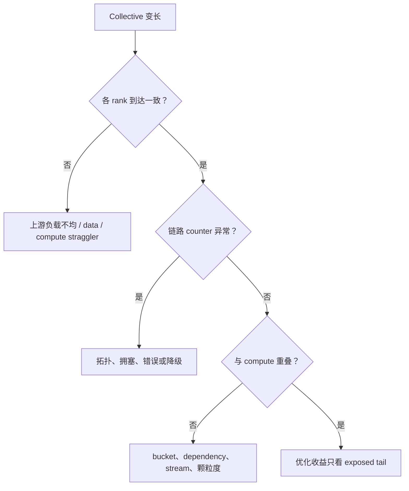

# 04 Megatron 训练框架性能分析

<details>
<summary>本篇分段导航：按首读范围进入，其余二读</summary>

- [1. 先用最少概念理解五种并行](#read-01)
- [2. 定义要测的 step](#read-02)
- [3. 第一次基线：先不抓 trace](#read-03)
- [4. 先定位是哪一种并行问题](#read-04)
- [5. 用 PyTorch Profiler 分析 Megatron](#read-05)
- [6. 用 Nsight Systems 看全局时间线](#read-06)
- [7. 通信 overlap 不能只看“同时出现”](#read-07)
- [8. rank straggler：先找“谁晚到”](#read-08)
- [9. NCCL 的分析顺序](#read-09)
- [10. Megatron OOM 的四个检查点](#read-10)
- [11. 配置 sweep 的安全顺序](#read-11)
- [12. 症状速查](#read-12)
- [本章完成标准](#read-13)
- [参考资料](#read-14)
- [区分通信、等待与 rank 偏斜](#read-15)
- [并行调度在时间线上的证据](#read-16)
- [训练指标的计算口径与扩展效率](#read-17)
- [学习问答：原笔记 §14](#read-18)

</details>

<!-- learning-position -->
> **学习定位**：A3/A6 · 必修。
> **前置**：[通信与 tensor 基础](<../../learn_docs/00_Foundations/06_两卡通信与torchrun.md>)。
> **首读/二读**：step 分解、并行扫描；原理链接 A3，源码定位链接 Megatron。
> **进度与实验**：[学习清单](<../../learn_docs/学习清单.md>) · [总入口](<../../learn_docs/README.md>)。
<!-- /learning-position -->

Megatron 的难点不是 kernel 更多，而是同一个 step 同时包含多种并行通信和流水线调度。分析目标是把 step time 拆成可行动的部分，并找到最慢 rank 的关键路径。


<a id="read-01"></a>

## 1. 先用最少概念理解五种并行

| 并行 | 切分什么 | 典型通信 | 常见性能问题 |
|---|---|---|---|
| DP | 数据副本 | gradient reduce-scatter/all-reduce、parameter all-gather | 跨节点带宽、bucket、overlap |
| TP | 单层 tensor | all-gather/reduce-scatter/all-reduce | GEMM 变小、频繁通信、跨节点 TP |
| PP | 层 | send/recv activation/gradient | pipeline bubble、stage 不均衡 |
| CP | sequence/context | P2P ring、all-gather、all-to-all | 长上下文通信与 attention overlap |
| EP | MoE experts | token dispatch/combine all-to-all | token 不均、跨节点 A2A、小 expert GEMM |

首先画出本次运行的 `TP × PP × CP × EP × DP` 和 rank 到 node/GPU/NIC 的映射。没有拓扑图时，任何通信结论都不可靠。

Megatron Bridge 的 [Parallelisms Guide](https://docs.nvidia.com/nemo/megatron-bridge/latest/parallelisms.html) 给出了组合关系；本仓库的源码导读见 [Megatron 并行策略与拓扑](../megatron_code_walkthrough/02_parallelism/00_strategy_and_topology.md)。


<a id="read-02"></a>

## 2. 定义要测的 step

建议先写成：

```text
T_step =
  T_data_wait
  + T_exposed_forward
  + T_exposed_backward
  + T_exposed_communication
  + T_pipeline_bubble
  + T_optimizer
  + T_checkpoint/logging
```

`exposed` 表示未被其他工作隐藏的部分。某个 NCCL kernel 跑 8 ms，但完全与 12 ms GEMM 重叠，它对 step time 的直接贡献接近 0。

最低指标：

- 稳态 step time 的 p50/p95；
- tokens/s/GPU；
- forward/backward/optimizer/data/checkpoint timers；
- 各 rank 的 min/max，明确最慢 rank；
- allocated/reserved/peak memory；
- loss/grad norm；
- PP microbatch 数与各 stage layer 数；
- MoE 每 expert/rank token 分布。


<a id="read-03"></a>

## 3. 第一次基线：先不抓 trace

### 3.1 固定配置

保存：

- MBS、GBS、sequence length、token packing；
- TP/PP/CP/EP/DP/VPP；
- dtype、FP8、recompute、distributed optimizer；
- overlap、fusion、CUDA Graph；
- 模型层数、hidden、heads、experts；
- 节点、GPU、网络和 commit。

GBS 的常见关系：

```text
GBS = MBS × DP × gradient_accumulation_steps
```

改并行度时要保持 token budget/GBS 不变，否则 step time 和吞吐都无法公平归因。

### 3.2 使用 Megatron timers

Megatron Core 的 `Timers` 支持 `max`、`minmax`、`all` 等跨 rank 汇总，并可在记录前选择 barrier。优先用 `minmax`，因为平均值会隐藏 straggler。不同 Megatron/Bridge 版本的 CLI 或 config 名称不同，先查当前入口的 `--help` 或配置类；timer 语义见 [Megatron Core timers API](https://docs.nvidia.com/megatron-core/developer-guide/latest/apidocs/core/core.timers.html)。

注意：人为加入 barrier 会改变时间线，甚至因参与 rank 不一致造成 hang。只有明确理解进程组时才启用 timer barrier。

### 3.3 建立最小正确配置

新模型或新并行组合先从：

```text
单卡/最小 GPU 数
-> BF16
-> 无高级 overlap
-> 无 FP8
-> 无 CUDA Graph
-> 固定小数据
```

先保证 loss、checkpoint 和恢复正确，再逐个加入 DP、TP、PP、CP/EP、overlap、FP8、graph。性能功能不是 bring-up 的调试工具。


<a id="read-04"></a>

## 4. 先定位是哪一种并行问题

### 4.1 DP

现象：

- backward 尾部出现长 reduce-scatter/all-reduce；
- forward 前 parameter all-gather 暴露；
- 单节点好，多节点明显掉速；
- DP rank 到 collective 的时间差很大。

检查顺序：

1. `nccl-tests` 是否达到合理带宽；
2. GPU-NIC affinity、跨 NUMA、接口选择；
3. bucket 大小是否太小/太大；
4. gradient reduce 与 backward 是否实际 overlap；
5. parameter gather 与 forward 是否实际 overlap；
6. 最慢 rank 是否在 collective 前已落后。

不要看到长 NCCL kernel 就直接调 NCCL 环境变量。先证明网络/通信在关键路径。

### 4.2 TP

现象：

- TP 增大后 GEMM shape 变小，单 kernel TFLOP/s 下降；
- 每层出现频繁 collective；
- TP 跨低带宽节点；
- 低精度加速收益很小，因为 host/communication 主导。

实验：保持 GPU 总数和 GBS 不变，对比 `TP=8, PP=1` 与 `TP=4, PP=2`。同时看 GEMM shape、PP bubble 和通信暴露，不能只看 TP 通信。

### 4.3 PP

现象：

- step 开头/结尾有明显 warmup/flush 空闲；
- 某 stage 一直比其他 stage 晚；
- first/last stage 因 embedding/loss 更重；
- microbatch 太少，bubble 比例高。

检查：

1. microbatch 数；
2. 每 stage 层数和非 Transformer 工作；
3. 每层实际时间，而不是只按层数均分；
4. VPP 是否减少 bubble，却增加过多通信/调度；
5. send/recv 是否与计算 overlap。

PP stage 的负载应按实际 profile 重平衡。NVIDIA 的性能指南指出 embedding/projection 可能使首尾 stage 更重，也说明 VPP 减 bubble 的同时会增加 stage 间通信：[Megatron Bridge Performance Guide](https://docs.nvidia.com/nemo/megatron-bridge/latest/performance-guide.html)。

### 4.4 CP

现象：

- 长 sequence OOM 得到缓解，但 attention 通信暴露；
- 不同 `cp_comm_type` 时间线不同；
- TP+CP 的组合影响 GEMM 与 attention shape。

不要只增大 TP 或 CP。保持总 GPU 数，做 TP×CP 小矩阵 sweep，并记录吞吐、显存和通信暴露。

### 4.5 EP/MoE

现象：

- dispatch/combine all-to-all 很长；
- 某些 rank expert token 多，成为 straggler；
- expert GEMM 很小；
- token drop/rebalance 改变正确性或模型行为。

至少记录每个 expert/rank 的 token 数分布。先验证路由和 correctness，再测试 grouped GEMM、dispatcher/backend、EP placement 和通信 overlap。官方文档强调 EP overlap 的收益与 workload 有关，小 EP 甚至可能持平或变慢：[Megatron Bridge Communication Overlap](https://docs.nvidia.com/nemo/megatron-bridge/latest/training/communication-overlap.html)。


<a id="read-05"></a>

## 5. 用 PyTorch Profiler 分析 Megatron

如果使用 Megatron Bridge，可以配置目标 step 和 rank：

```python
from megatron.bridge.training.config import ProfilingConfig

cfg.profiling = ProfilingConfig(
    use_pytorch_profiler=True,
    profile_step_start=10,
    profile_step_end=13,
    profile_ranks=[0],
    record_shapes=True,
)
```

rank 0 不一定代表瓶颈。选择 rank 时要覆盖：

- PP first/middle/last stage；
- 已知最慢 rank；
- 跨节点通信边界；
- MoE token 最多/最少的 rank。

先每类选 1 个，不要所有 rank 同时开 `with_stack`。官方配置与 memory snapshot 示例见 [Megatron Bridge Profiling](https://docs.nvidia.com/nemo/megatron-bridge/latest/training/profiling.html)。

非 Bridge 或 fork 版本应找到自己的 `ProfilingConfig`/CLI；不要假设同名参数行为一致。


<a id="read-06"></a>

## 6. 用 Nsight Systems 看全局时间线

Megatron Bridge 官方方式：框架配置 step/rank 范围，再由 nsys 监听 CUDA Profiler API：

```python
from megatron.bridge.training.config import ProfilingConfig

cfg.profiling = ProfilingConfig(
    use_nsys_profiler=True,
    profile_step_start=10,
    profile_step_end=13,
    profile_ranks=[0, 1],
)
```

```bash
nsys profile \
  -s none \
  -t cuda,nvtx \
  -o /tmp/megatron_profile \
  --force-overwrite true \
  --capture-range=cudaProfilerApi \
  --capture-range-end=stop \
  python your_train.py
```

确认当前 fork 的训练循环确实调用 start/stop；Slime 对 Megatron 原生 nsys 开关的差异见第 6 章。

时间线阅读：

1. 标出每个 microbatch 的 F/B；
2. 标出 PP warmup、1F1B steady、flush；
3. 标出 TP/CP/EP/DP collective；
4. 计算通信的**暴露区间并集**，不要累加所有 stream duration；
5. 找最晚 rank 的第一个分叉点；
6. 再锁定关键路径中的 GEMM/attention/communication。


<a id="read-07"></a>

## 7. 通信 overlap 不能只看“同时出现”

开启 overlap 后要验证三件事：

1. wall time 是否缩短；
2. 计算 kernel 是否因争抢 SM/带宽而变慢；
3. 新 buffer 是否增加峰值显存。

可能出现：通信与计算重叠了，但两者都变慢，最终 step 没改善。比较时间线中的 exposed interval 与端到端 step，而不是比较 kernel 累计和。

NVIDIA 当前指南中的典型 DP 配置是 `overlap_grad_reduce` 与 `overlap_param_gather`，TP overlap 还需要结合 sequence parallel 和具体 backend；这些不是所有版本、所有硬件的通用默认值。先按当前框架配置文档启用，再 A/B 验证。


<a id="read-08"></a>

## 8. rank straggler：先找“谁晚到”

Megatron Core 提供 `StragglerDetector`，可收集每 rank elapsed、GPU util、clock、温度、功耗等并报告 min/max。API 见 [StragglerDetector](https://docs.nvidia.com/megatron-core/developer-guide/latest/apidocs/core/core.utils.html)。

若自行加低频采样，可 all-gather 每 rank 的阶段时间；不要每 step 大规模同步。找到最慢 rank 后检查：

- host/NUMA/GPU/NIC placement；
- GPU clock、温度、ECC/Xid；
- 数据长度和 dataloader shard；
- PP stage 层数；
- MoE token 数；
- checkpoint writer/存储；
- Python GC 或日志；
- collective 前的第一处分叉。

最后卡住的 NCCL 调用常常只是受害者。


<a id="read-09"></a>

## 9. NCCL 的分析顺序

### 9.1 硬件基线

先跑匹配消息大小的 `nccl-tests`，记录 algbw/busbw。

### 9.2 日志

临时开启：

```bash
NCCL_DEBUG=INFO \
NCCL_DEBUG_SUBSYS=INIT,GRAPH,NET \
NCCL_DEBUG_FILE=/tmp/nccl.%h.%p.log \
python your_train.py
```

不要长期把 debug tuning 环境变量留在生产脚本。当前 NCCL 文档明确区分系统配置项和只用于调试的变量：[NCCL Environment Variables](https://docs.nvidia.com/deeplearning/nccl/user-guide/docs/env.html)。

### 9.3 hang/desync

PyTorch ProcessGroupNCCL 提供 flight recorder 和 desync debug：

```bash
TORCH_NCCL_TRACE_BUFFER_SIZE=20000 \
TORCH_NCCL_DUMP_ON_TIMEOUT=1 \
TORCH_NCCL_DESYNC_DEBUG=1 \
python your_train.py
```

具体变量依 PyTorch 版本，查 [ProcessGroupNCCL Environment Variables](https://docs.pytorch.org/docs/stable/torch_nccl_environment_variables.html)。这是排 hang/correctness 的工具，不是常驻性能开关。


<a id="read-10"></a>

## 10. Megatron OOM 的四个检查点

分别记录：

```text
模型构建后
第一个 forward 峰值
第一个 backward 峰值
optimizer step / parameter all-gather 峰值
```

归因：

- forward：activation、attention workspace、graph capture；
- backward：saved tensor、recompute 临时、grad bucket；
- optimizer：master weights/moments、all-gather、cast buffer；
- 第二步后上涨：异步 handle、cache、Python 引用、碎片。

Megatron Bridge 可用 `record_memory_history=True` 和 `memory_snapshot_path`；或按第 2 章手动 Memory Snapshot。理论估算只用来提出假设，最终以快照验证。


<a id="read-11"></a>

## 11. 配置 sweep 的安全顺序

### 11.1 容量与并行

```text
MBS/sequence packing
-> TP×PP
-> CP（长上下文）
-> EP/dispatcher（MoE）
```

### 11.2 性能功能

```text
fusion
-> distributed optimizer
-> DP overlap
-> TP/PP/EP overlap
-> recompute（显存与算力权衡）
-> FP8
-> CUDA Graph
```

顺序不是绝对，但每次只引入一个可归因变量。对每个候选保存 correctness、吞吐、step 分解、显存和 trace 证据。


<a id="read-12"></a>

## 12. 症状速查

| 症状 | 首查 | 不要先做 |
|---|---|---|
| GPU 周期性空洞 | PP bubble、data、checkpoint、GC | 直接优化 GEMM |
| NCCL 尾部长 | 谁最晚进入、拓扑、消息大小 | 随机设置 NCCL env |
| 小 kernel 极多 | MBS、TP/CP 过分切分、fusion | 直接 ncu 全任务 |
| 首尾 PP rank OOM | embedding/loss、warmup activation | 只看全局平均显存 |
| MoE rank 抖动 | expert token 分布、A2A | 只看 rank0 |
| FP8 提升小 | host/communication bound、shape | 认定 FP8 未生效 |
| overlap 开启但不快 | exposed interval、资源争用 | 看累计通信时间 |


<a id="read-13"></a>

## 本章完成标准

- 能画出并行组和 rank placement。
- 能用 min/max timer 指出最慢 rank 和阶段。
- 能在时间线上区分 PP bubble 与 TP/DP/EP 通信。
- 能说明通信累计时间与 exposed communication 的区别。
- 能设计保持 GBS/token budget 的 TP×PP A/B。
- 能用正确性、吞吐、显存和 trace 共同验收。


<a id="read-14"></a>

## 参考资料

- [Megatron Bridge Performance Guide](https://docs.nvidia.com/nemo/megatron-bridge/latest/performance-guide.html)
- [Megatron Bridge Profiling](https://docs.nvidia.com/nemo/megatron-bridge/latest/training/profiling.html)
- [Megatron Bridge Communication Overlap](https://docs.nvidia.com/nemo/megatron-bridge/latest/training/communication-overlap.html)
- [Megatron Core timers](https://docs.nvidia.com/megatron-core/developer-guide/latest/apidocs/core/core.timers.html)
- [NCCL Troubleshooting](https://docs.nvidia.com/deeplearning/nccl/user-guide/docs/troubleshooting.html)
- [Scaling Language Model Training with Megatron](https://developer.nvidia.com/blog/scaling-language-model-training-to-a-trillion-parameters-using-megatron/)


<a id="concept-09"></a>


<a id="read-15"></a>

## 区分通信、等待与 rank 偏斜

### 1. 三段时间必须分开

对一个 collective：

$$T_{observed}=T_{arrival\ skew}+T_{communication}+T_{queue/dependency}$$

- arrival skew：各 rank 进入 collective 的时间差；
- communication：数据实际经 GPU/link/network 传输和归约；
- queue/dependency：stream、event、前序 kernel 或 runtime 排队。

只从最快 rank 看，它可能在 NCCL kernel 中等了很久；从慢 rank 看 collective 很短。若据此判断网络坏了，会修错对象。


### 2. 证据栈

| 层级 | 工具/信息 | 适合回答 |
|---|---|---|
| Framework | phase/rank timestamp、PyTorch Profiler | 哪个 module 发起什么 collective |
| Process group | Flight Recorder | collective order、start/end、timeout 前事件 |
| NCCL | debug log、RAS、profiler plugin | communicator、algorithm/channel、健康与事件 |
| Timeline | Nsight Systems | NCCL kernel 与 compute overlap、rank arrival |
| Fabric | DCGM/NIC/switch telemetry | NVLink/PCIe/IB/RoCE 吞吐、错误、拥塞 |
| Microbench | `nccl-tests` | 给定 topology/message size 的基线 |

IB = InfiniBand；RoCE = RDMA over Converged Ethernet（融合以太网上的远程直接内存访问）。


### 3. PyTorch Flight Recorder

ProcessGroupNCCL 的 Flight Recorder（飞行记录器）用 ring buffer 保存 collective start/end 等事件。常见诊断设置以当前 PyTorch 文档为准，例如：

```bash
export TORCH_NCCL_TRACE_BUFFER_SIZE=200000
export TORCH_NCCL_DUMP_ON_TIMEOUT=1
export TORCH_NCCL_TRACE_CPP_STACK=1
```

较新版本也提供协调 dump/timeout 与 desync debug 相关开关。不要机械复制变量：先核对 PyTorch 版本、输出路径与 buffer 内存成本。Flight Recorder 的价值是 hang 后回看，而不是用海量 `NCCL_DEBUG=TRACE` 永久淹没日志。


### 5. Timeline 的四种模式




### 6. `nccl-tests` 怎么用才有意义

至少 sweep：

- collective 类型；
- message size，从 KB 到 GB；
- 单节点、跨两节点、目标规模；
- 目标 rank mapping 与 GPU–NIC affinity；
- 并发 communicator/traffic；
- 多轮分布，而非单次最大值。

`algbw` 与 `busbw` 口径不同；应用有效带宽也不同于 microbenchmark。对比必须保持 collective、dtype、rank count、in-place/out-of-place 一致。


### 7. Hang 的分类

- collective order mismatch：不同 rank 调用次序或 shape 不同；
- rank 未进入：上游异常、数据不等长、某 rank OOM/crash；
- network path failure：链路、NIC、switch 或 RDMA error；
- stream dependency cycle：event/stream 等待环；
- timeout 太紧：正常长尾被错误杀死；
- async error 未及时传播：其他 rank 继续等待。

先保存最后成功 collective、每 rank sequence number、tensor shape、process group 与 stack，再重启；只看最后的 watchdog timeout 通常信息不足。


### 8. 量化 exposed communication

定义：

$$T_{exposed}=T_{step,new\ without\ overlap\ loss}-T_{compute\ critical\ path}$$

实践中可从 timeline 标记 communication 与 compute 的 union/intersection，或做受控实验：关闭 overlap 获取上界、缩小/替换通信验证敏感性。不要简单用 NCCL kernel duration 求和，因为 channel 与多个 collective 可重叠。


<a id="concept-10"></a>


<a id="read-16"></a>

## 并行调度在时间线上的证据

### 1. 并行维度的时间线指纹

| 并行 | 常见等待形态 | 关键对照量 |
|---|---|---|
| DDP | backward 中 bucket AllReduce，step 尾部最后 bucket exposed | bucket ready time、grad compute、rank skew |
| FSDP | layer 前 parameter AllGather，backward 后 ReduceScatter | prefetch 距离、full-param peak、compute overlap |
| TP | 每层多次 collective，频率高、消息中等 | GEMM 粒度、跨节点边界、stream dependency |
| PP | stage 间 P2P 与 warm-up/drain 空洞 | micro-batch 数、最慢 stage、schedule |
| CP | attention 内 KV exchange/All-to-All | sequence length、causal imbalance、ring step |
| EP | dispatch/combine AllToAllV + expert compute 长尾 | per-expert token、max/mean、capacity/drop |


### 2. Pipeline bubble

对简单 1F1B（One-Forward-One-Backward，一前向一反向）流水，stage 数 $p$、micro-batch 数 $m$ 时，一个粗略 bubble fraction 是：

$$bubble \approx \frac{p-1}{m+p-1}$$

它假设 stage 等长、通信理想，真实系统还要加 stage imbalance 和 P2P exposed time。增大 $m$ 可摊薄 warm-up/drain，却可能增加 in-flight activation、调度开销与 batch semantics 约束。

#### 怎么从 trace 量

1. 给每个 virtual/physical stage 标注 forward/backward micro-batch ID；
2. 对齐同一 global step；
3. 计算每个 stage 的 active union，而非 kernel duration 求和；
4. 找 bottleneck stage 与其他 stage 等待它的区间；
5. 区分 schedule 固有 bubble、stage imbalance 和通信延迟。


### 3. DDP/FSDP：最后一个 bucket 最重要

大量 gradient communication 可以被 backward 覆盖，但最后生成的 bucket 常落在尾部。优化方向是：

- bucket 划分与 parameter order，使关键梯度更早 ready；
- ReduceScatter/AllReduce 在独立 stream 及时发起；
- 避免过小 bucket 的 latency 开销，也避免过大 bucket 延迟启动；
- 检查 optimizer 是否在全局 barrier 后串行执行；
- FSDP 调整 forward/backward prefetch，但同时检查显存峰值。


### 4. TP：算子变小与通信变频繁

增大 TP degree 会缩小 per-rank GEMM。若从大 GEMM 变成多个低 occupancy 小 GEMM，即使参数能放下，MFU 也会下降。trace 上通常表现为 GEMM duration 缩短、collective 比例和 kernel count 上升、空洞更敏感。

所以 TP 优先留在高速节点内；跨节点是否值得必须用真实 message size 和 GEMM shape 实测。


### 5. CP：平均 token 数不够

causal attention 的早期 query 可见 KV 更少，简单连续切 sequence 会造成各 rank 工作不均。长短样本混合时，固定 CP degree 还会让短样本过度通信。

检查：每 rank query/KV token、有效 attention pair、ring step duration、padding/packing、动态 CP degree。只看总 sequence length 会掩盖 causal 与 packed-sequence imbalance。


### 6. EP：通信与 expert straggler 耦合

Mixture of Experts（MoE，混合专家）中，router 令 token 分布动态变化。记录：

$$imbalance=\frac{\max_e(tokens_e)}{\operatorname{mean}_e(tokens_e)}$$

同时画 dispatch AllToAllV、expert grouped GEMM、combine AllToAllV。一个 hot expert 会让对应 rank compute 变长，并让其他 rank 的 combine 等待；这不是单纯网络问题。


### 7. 组合并行的归因方法

为每个 event 附加：`global_step / micro_batch / layer / parallel_dimension / process_group / bytes / tokens`。多维 process group 不标明时，所有 NCCL kernel 名看起来相似。

建议生成矩阵：行是 rank，列是 phase，颜色是 duration；再按 node、TP group、PP stage、EP group 聚合。这样能一眼区分“同一节点慢”“同一 stage 慢”与“同一 expert group 慢”。


### 8. 优化顺序

1. 修正 rank/stage/expert 负载不均；
2. 确保拓扑 mapping 正确；
3. 调通信颗粒度与发起时机；
4. 建立 overlap；
5. 再调整 parallel degree；
6. 重新核算显存峰值、correctness 与容错。


<a id="concept-11"></a>


<a id="read-17"></a>

## 训练指标的计算口径与扩展效率

### 2. Model FLOPs Utilization 与 Hardware FLOPs Utilization

Model FLOPs Utilization（MFU，模型浮点运算利用率）：

$$MFU=\frac{F_{model\ per\ token}\cdot tokens/s}{N_{gpu}\cdot P_{peak}}$$

Hardware FLOPs Utilization（HFU，硬件浮点运算利用率）使用实际执行 FLOPs 作为分子，activation recomputation 等额外工作会提高 HFU，却不一定提高有效训练进度。MFU 更强调“有用模型工作”，HFU 更接近硬件忙碌程度。

两者没有统一绝对口径。报告必须写：

- model FLOPs 公式是否包含 embedding、attention、MoE routing、loss；
- forward/backward multiplier；
- recomputation 是否计入；
- sparse/MoE 用总参数还是 active 参数；
- peak FLOPs 对应 dtype、稀疏模式、clock；
- step 是否包含 data、optimizer、logging、checkpoint。


### 3. 一个近似例子

常见 dense Transformer 粗估训练 FLOPs 约为每 token $6P$，其中 $P$ 是参数量；长上下文下 attention 项不可忽略，MoE 也应按 active expert 计算。若 70B 模型达到 4,000 tokens/s/GPU，目标 GPU BF16 peak 约 1 PFLOP/s，则粗估：

$$MFU\approx\frac{6\times70\times10^9\times4000}{10^{15}}=1.68$$

得到 168% 说明至少一个口径错了：可能 throughput 是全节点而非单 GPU，peak 未计稀疏/boost，或 FLOPs 公式/单位不匹配。这个 sanity check 很有价值。


### 4. Strong 与 weak scaling

Strong scaling 固定总工作量：

$$E_{strong}(N)=\frac{T_1}{N\cdot T_N}$$

Weak scaling 每 GPU 工作量固定：

$$E_{weak}(N)=\frac{T_1}{T_N}$$

这里 $T_1$ 可是单 GPU，也可选择最小可运行基线 $N_0$，但必须写明。大模型无法单卡运行时：

$$E(N;N_0)=\frac{throughput_N/N}{throughput_{N_0}/N_0}$$


### 5. 为什么模型越大 MFU 可能更高

Megatron-LM 的公开 benchmark 报告 H100 上部分大模型 MFU 可从约 41% 上升到 47–48%，解释是更大 GEMM 有更高 arithmetic intensity；但 strong scaling 到更多 GPU 时通信暴露增加，MFU 会下降。这说明 MFU 同时受 kernel shape 与 distributed critical path 影响。

这些数字只在其明确配置下成立，不是所有 H100 训练的基准线。


### 7. Tail 与长期效率

训练不是只跑 100 个稳态 step。还应报告：

- step p50/p95/p99；
- checkpoint/eval 周期的摊销；
- compilation/autotune/cuda graph capture；
- fault/restart lost work；
- 数据长度和 MoE routing 分布；
- straggler frequency；
- 有效训练时间 / wall time。

一个 benchmark window 排除 checkpoint 可以评估核心引擎，但 capacity planning 必须把 checkpoint、故障和维护放回去。


### 8. 回归门槛示例

```text
steady-state tokens/s/GPU: 不低于 baseline 98%
step p99 / p50: 不高于 1.15
peak HBM: 不增加超过 1 GiB
loss at 100 steps: within tolerance
8→64 GPU scaling efficiency: >= 85%
no new graph breaks / recompiles / Xid
```


<a id="notebook-14"></a>


<a id="read-18"></a>

## 学习问答：原笔记 §14

### 14｜重要 Insight：为什么利用率必须明确口径与工作负载


> **重要 Insight**
>
> 在正常的大规模分布式 LLM 训练中，不要预期有效计算效率接近 90%。如果讨论的是 MFU（Model FLOPs Utilization），在大规模真实训练里做到 40% 以上通常已经是很强的系统效率；优秀系统常落在 40%–50% 左右，而不是 90%。


#### 最重要的口径辨析

- 这里说的“40% 很优秀”，应优先理解为 MFU / 有效 FLOPs 利用率，而不是 nvidia-smi 中的 GPU Util（GPU 是否忙）。

- nvidia-smi 的 GPU Util 可以长期显示 90%–100%，但这不代表 GPU 每个周期都以峰值 Tensor Core FLOPs 做“模型真正需要的有效计算”。

- MFU 更关心：实际模型吞吐，相对于“假设硬件始终以理论峰值 FLOPs 执行模型所需 forward + backward”时的理想吞吐，达到了多少。

#### 为什么很难接近 90% MFU？

- 通信：DP / TP / PP 的 AllReduce、AllGather、ReduceScatter、P2P send/recv 等无法总是被计算完全隐藏。

- Pipeline bubble：部分 stage 在等待依赖或 fill/drain 阶段处于空闲。

- 内存与带宽瓶颈：不是所有算子都能像大 GEMM 一样跑满 Tensor Core。

- 小 kernel / element-wise 算子 / LayerNorm / RoPE 等算术强度较低，容易受 memory bandwidth 或 launch overhead 限制。

- 数据加载、optimizer step、logging、checkpoint、host jitter 等端到端开销。

- 并行规模越大，通信暴露通常越明显；强扩展到更多 GPU 后，单卡 workload 变小，也更难保持峰值效率。

#### 公开系统中的量级参考

| **系统 / 工作**                               | **规模与口径**                                                            | **MFU**                 |
|-----------------------------------------------|---------------------------------------------------------------------------|-------------------------|
| PaLM 540B（Google, 2022）                     | 6144 TPU v4；训练效率                                                     | 46.2%                   |
| Megatron-LM 当前公开 H100 benchmark（NVIDIA） | 数千张 H100；端到端 throughput 包含通信、optimizer、data loading、logging | 约 41%–47/48%           |
| Megatron 强扩展示例（NVIDIA）                 | GPT-3 级模型从 96 H100 扩到 4608 H100                                     | MFU 从约 47% 降到约 42% |

#### 因此更稳妥的经验表述


> **推荐记法**
>
> 大规模训练里，若指标是 MFU，40%+ 已经值得认为系统做得很好；45%–50% 左右是非常有竞争力的水平。不要把它和 nvidia-smi 的 GPU Util 混淆。90%+ MFU 对通用的大规模端到端 LLM 训练并不是一个合理的常规预期。


#### 参考

- PaLM: Scaling Language Modeling with Pathways（2022），论文报告 PaLM 540B 的 MFU 为 46.2%，HFU 为 57.8%。

- NVIDIA Megatron-LM Performance Benchmarking（当前公开基准），报告 H100 集群上最高约 47% MFU，并展示 41%–48% 的典型区间与强扩展下通信暴露造成的下降。
