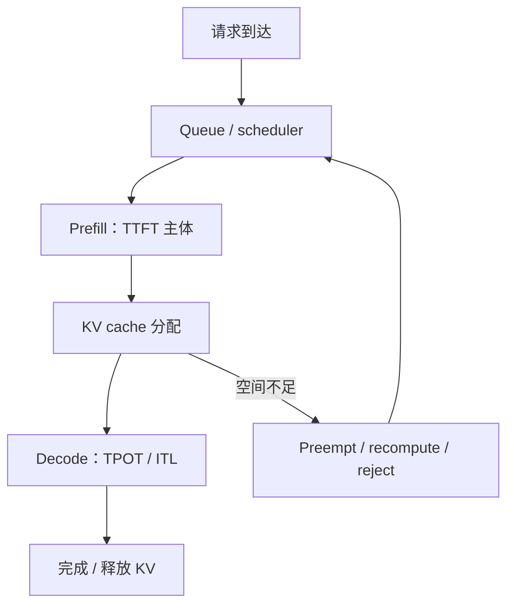

# 05 SGLang 与 vLLM 推理框架性能分析

<details>
<summary>本篇分段导航：按首读范围进入，其余二读</summary>

- [1. 先理解一次请求的阶段](#read-01)
- [2. 四个必须会解释的延迟指标](#read-02)
- [3. 公平 benchmark 的 workload 清单](#read-03)
- [4. 第一次容量 sweep](#read-04)
- [5. SGLang benchmark：一步一步](#read-05)
- [6. SGLang PyTorch Profiler](#read-06)
- [7. vLLM benchmark：一步一步](#read-07)
- [8. vLLM PyTorch Profiler](#read-08)
- [9. vLLM/SGLang 的 Nsight Systems](#read-09)
- [10. 四层观测模型](#read-10)
- [11. 常见症状的逐步排查](#read-11)
- [12. 优化验收](#read-12)
- [本章完成标准](#read-13)
- [参考资料](#read-14)
- [负载、容量与推理指标边界](#read-15)

</details>

<!-- learning-position -->
> **学习定位**：A4/A6 · 必修。
> **前置**：[Transformer 与 KV](<../../learn_docs/00_Foundations/05_Transformer执行与KV基础.md>)。
> **首读/二读**：长度/并发/速率控制、容量曲线、KV 与延迟分布。
> **进度与实验**：[学习清单](<../../learn_docs/学习清单.md>) · [总入口](<../../learn_docs/README.md>)。
<!-- /learning-position -->

推理性能分析必须同时看 workload、调度和 kernel。只跑一个并发、只报 output tokens/s，无法判断服务在真实负载下是否更好。


<a id="read-01"></a>

## 1. 先理解一次请求的阶段

```text
客户端/网络
-> router/HTTP/tokenization
-> waiting queue
-> prefill（处理输入 prompt，产生 KV Cache）
-> decode（逐 token 生成）
-> detokenization/streaming
-> 客户端收到完整响应
```

Prefill 通常是较大的矩阵计算，受输入 token 数影响；decode 每步只为每条 sequence 生成少量 token，更容易受内存带宽、batching、调度和 launch overhead 影响。


<a id="read-02"></a>

## 2. 四个必须会解释的延迟指标

- **TTFT**：请求发出到收到首 token，包含排队、prefill 和服务开销。
- **TPOT**：首 token 后，每个输出 token 的平均处理时间。
- **ITL**：相邻流式 token 间隔，适合观察抖动和长尾。
- **E2E**：完整请求端到端延迟。

还要报告 request/s、input/output/total tokens/s 和 p50/p95/p99。vLLM 与 SGLang 的 benchmark 都提供这些指标；定义可能有边界差异，跨工具比较前先核对公式。


<a id="read-03"></a>

## 3. 公平 benchmark 的 workload 清单

每次结果必须记录：

- 模型、revision、dtype/quantization；
- GPU、数量、TP/DP/EP/PP、backend；
- 框架 commit/版本与完整启动参数；
- 输入/输出长度分布；
- prompt 数、并发上限、request rate/到达过程；
- streaming、ignore EOS、sampling 参数；
- prefix cache 是否开启、预期命中率；
- warmup、CUDA Graph/compile 状态；
- 错误、超时、abort/retract；
- 原始 JSON/JSONL，而不只是终端截图。

若 A 允许提前 EOS、B 强制固定输出长度，两者 tokens/s 不可比。


<a id="read-04"></a>

## 4. 第一次容量 sweep

目标不是找“最高吞吐点”，而是画出吞吐—延迟 Pareto 曲线和容量拐点。

固定模型与长度，依次测试：

```text
并发 1 -> 2 -> 4 -> 8 -> 16 -> 32 -> 64 -> ...
```

每个点：

1. warmup；
2. 发送足够请求覆盖稳态；
3. 保存 p50/p95/p99 TTFT/TPOT/E2E；
4. 保存 input/output throughput；
5. 保存 queue、running batch、KV Cache、GPU 指标；
6. 错误率非零则该点不是有效容量。

吞吐趋平而 queue/TTFT 快速上升的位置就是容量拐点。生产容量应在拐点前留裕量。


<a id="read-05"></a>

## 5. SGLang benchmark：一步一步

### 5.1 启动最小 server

```bash
python -m sglang.launch_server \
  --model-path meta-llama/Llama-3.1-8B-Instruct \
  --host 0.0.0.0 \
  --port 30000
```

模型只是官方文档示例，换成本地可用的小模型。首次启动要等待权重加载、compile 和 CUDA Graph capture 完成。

### 5.2 固定长度压测

```bash
python -m sglang.bench_serving \
  --backend sglang \
  --host 127.0.0.1 \
  --port 30000 \
  --model meta-llama/Llama-3.1-8B-Instruct \
  --dataset-name random \
  --random-input-len 1024 \
  --random-output-len 256 \
  --random-range-ratio 0.0 \
  --num-prompts 200 \
  --request-rate inf \
  --max-concurrency 16 \
  --output-file /tmp/sglang_c16.jsonl \
  --output-details
```

参数会随 SGLang 版本变化，执行前用 `python -m sglang.bench_serving --help` 核对。当前官方指南详细解释了 dataset、arrival rate、concurrency 和输出格式：[SGLang Bench Serving Guide](https://docs.sglang.ai/developer_guide/bench_serving)。

`random-range-ratio=0.0` 代表固定长度的意图；若当前版本约束不同，以 `--help` 为准并检查结果中的实际 input/output lens。

### 5.3 真实数据与 prefix workload

固定长度用于归因，真实 ShareGPT/业务 replay 用于验收。Prefix cache 不能靠随机 prompt 测试；使用 shared-prefix 数据集或请求 dump/replay。

SGLang 支持请求 dump/replay，可把真实请求保存后复现。见 [SGLang Observability](https://docs.sglang.ai/advanced_features/observability.html)。注意脱敏请求内容。


<a id="read-06"></a>

## 6. SGLang PyTorch Profiler

### 6.1 最方便的 bench 方式

```bash
export SGLANG_TORCH_PROFILER_DIR=/tmp/sglang_profile

python -m sglang.bench_serving \
  --backend sglang \
  --model meta-llama/Llama-3.1-8B-Instruct \
  --num-prompts 10 \
  --profile
```

只发少量请求。`with_stack` 和 `record_shapes` 会显著增大 trace；环境变量和接口随版本变化，参见 [SGLang Benchmark and Profiling](https://github.com/sgl-project/sglang/blob/main/docs/developer_guide/benchmark_and_profiling.md)。

### 6.2 HTTP 精确控制

```bash
curl -X POST http://127.0.0.1:30000/start_profile \
  -H 'Content-Type: application/json' \
  -d '{
    "output_dir": "/tmp/sglang_profile",
    "start_step": 5,
    "num_steps": 10,
    "activities": ["CPU", "GPU"]
  }'
```

随后发送受控请求。指定 `num_steps` 时通常自动停止；不指定则：

```bash
curl -X POST http://127.0.0.1:30000/stop_profile
```

PD 分离模式中 prefill 和 decode worker 要分别 profile；不要把两个 trace 的 step 语义混为一谈。

### 6.3 看 trace

先区分 prefill/decode：

- prefill：attention/GEMM shape 与输入长度、chunked prefill 有关；
- decode：batch size、KV length、CUDA Graph 命中、scheduler overhead 更关键；
- CPU 轨道：batch preparation、radix cache、sampling、grammar/tokenizer；
- GPU 轨道：小间隙、attention backend、GEMM、collective；
- memory：KV Cache/static pool/graph workspace。

SGLang v0.4 官方博客用 Nsight Systems 验证调度与 GPU 计算 overlap，展示了为什么“CPU scheduler 是否及时准备下一 batch”会直接影响 GPU 空洞：[SGLang v0.4](https://www.lmsys.org/blog/2024-12-04-sglang-v0-4/)。


<a id="read-07"></a>

## 7. vLLM benchmark：一步一步

当前 vLLM CLI 提供 latency、serve 和 throughput：

```bash
pip install 'vllm[bench]'

vllm serve meta-llama/Llama-3.1-8B-Instruct --port 8000
```

另一个终端：

```bash
vllm bench serve \
  --backend vllm \
  --model meta-llama/Llama-3.1-8B-Instruct \
  --dataset-name random \
  --random-input-len 1024 \
  --random-output-len 256 \
  --num-prompts 200 \
  --max-concurrency 16
```

当前参数以 `vllm bench serve --help` 为准。输出包含 TTFT、TPOT、ITL、throughput；官方说明见 [vLLM Benchmark CLI](https://docs.vllm.ai/en/latest/benchmarking/cli/)。

单 batch latency 适合 kernel/engine 最小复现：

```bash
vllm bench latency \
  --model meta-llama/Llama-3.2-1B-Instruct \
  --input-len 512 \
  --output-len 8 \
  --batch-size 16
```


<a id="read-08"></a>

## 8. vLLM PyTorch Profiler

vLLM v0.13.0+ 的当前官方方式是 server `--profiler-config`，client `--profile`：

```bash
vllm serve meta-llama/Llama-3.1-8B-Instruct \
  --profiler-config '{"profiler":"torch","torch_profiler_dir":"/tmp/vllm_profile"}'
```

```bash
vllm bench serve \
  --backend vllm \
  --model meta-llama/Llama-3.1-8B-Instruct \
  --dataset-name sharegpt \
  --dataset-path /path/to/sharegpt.json \
  --profile \
  --num-prompts 2
```

只发几个请求；停止 profiler 需要 flush 大 trace，可能耗时很久。Profiler 会显著降低推理速度，所以**不能用开启 profiler 后的 latency/throughput 作为性能基线**。配置细节见 [Profiling vLLM](https://docs.vllm.ai/en/stable/contributing/profiling/)。

旧版 vLLM 使用过 `VLLM_TORCH_PROFILER_DIR` 等方式，不要把旧博客命令直接用于当前版本。


<a id="read-09"></a>

## 9. vLLM/SGLang 的 Nsight Systems

推理引擎常用 multiprocessing 和 CUDA Graph。vLLM 当前官方建议：

```bash
VLLM_WORKER_MULTIPROC_METHOD=spawn \
nsys profile \
  --trace-fork-before-exec=true \
  --cuda-graph-trace=node \
  vllm bench latency \
    --model meta-llama/Llama-3.1-8B-Instruct \
    --num-iters-warmup 5 \
    --num-iters 1 \
    --batch-size 16 \
    --input-len 512 \
    --output-len 8
```

Server 动态 capture 需要框架的 CUDA profiler start/stop 与 `--capture-range=cudaProfilerApi` 配合，具体命令随版本变化，以当前 [vLLM profiling 文档](https://docs.vllm.ai/en/stable/contributing/profiling/) 为准。

SGLang 也可通过 profile activity 使用 CUDA profiler，再让 nsys 捕获；或直接包裹最小 offline benchmark。先在单 worker、小请求上验证。


<a id="read-10"></a>

## 10. 四层观测模型

| 层 | 关键指标 |
|---|---|
| API/router | QPS、错误、排队、重试、TTFT/E2E |
| scheduler/KV | waiting/running、batch tokens、cache hit/eviction、retract |
| model/communication | prefill/decode forward、kernel、collective、graph hit |
| system | GPU/CPU/网络/显存/power/clock |

SGLang 可用 `--enable-metrics` 暴露 Prometheus：

```bash
curl http://localhost:30000/metrics
```

指标名会随版本变化，先保存原始 `/metrics`，再建立 dashboard。只有四层沿同一时间窗口对齐，才能区分相关性和因果。


<a id="read-11"></a>

## 11. 常见症状的逐步排查

### 11.1 TTFT 高

1. 看 waiting queue：排队还是执行慢？
2. 看输入长度和 prefix cache hit。
3. 看 prefill batch/chunk 配置。
4. 看 CPU tokenizer/router。
5. 再看 prefill attention/GEMM kernel。

### 11.2 TPOT/ITL 高或抖动

1. 看 decode batch size 随时间变化；
2. 是否混入大 prefill；
3. KV length 是否长尾；
4. CUDA Graph 是否命中；
5. scheduler 是否产生 GPU gap；
6. 多卡 collective/EP token 是否不均。

### 11.3 吞吐低且 GPU 低

1. 请求是否足够、并发是否太低；
2. CPU scheduler/tokenizer/grammar；
3. 网络和客户端是否供给不足；
4. 小 batch + launch overhead；
5. 用 nsys 看真实空洞。

### 11.4 OOM

把显存分成：

```text
model weights
+ KV Cache
+ CUDA Graph pools
+ temporary workspace
+ communication buffers
+ allocator fragmentation
```

不要只调 `mem_fraction`。先记录实际上下文、并发、KV dtype、graph batch sizes，再做单变量测试。

### 11.5 多卡扩展差

1. 单卡/单节点 baseline；
2. TP/EP placement 是否跨慢链路；
3. 每 rank batch/token 是否足够；
4. collective 是否暴露；
5. MoE 路由是否不均；
6. kernel shape 是否因分片变小。


<a id="read-12"></a>

## 12. 优化验收

同一请求集合和 seed，对比：

- 正确性/输出 token 数；
- 错误率；
- TTFT/TPOT/E2E p50/p95/p99；
- output throughput 和 goodput；
- GPU/CPU/显存；
- 在不同长度、并发和 cache 场景是否稳定；
- 冷启动与稳态分开。

不要只报告优化最有利的单点。至少展示低并发延迟点、SLO 附近点和吞吐饱和点。


<a id="read-13"></a>

## 本章完成标准

- 能构造固定长度和真实 replay 两类 workload。
- 能画并发—吞吐—延迟曲线并找容量拐点。
- 能区分 TTFT、TPOT、ITL 和 E2E。
- 能分别 profile SGLang/vLLM 的少量请求。
- 能在 trace 中区分 prefill、decode、scheduler 和 communication。
- 能说明 profiler 开启后的数据为什么不能作为 benchmark 基线。


<a id="read-14"></a>

## 参考资料

- [SGLang Bench Serving Guide](https://docs.sglang.ai/developer_guide/bench_serving)
- [SGLang Benchmark and Profiling](https://github.com/sgl-project/sglang/blob/main/docs/developer_guide/benchmark_and_profiling.md)
- [SGLang Observability](https://docs.sglang.ai/advanced_features/observability.html)
- [SGLang v0.4 性能博客](https://www.lmsys.org/blog/2024-12-04-sglang-v0-4/)
- [vLLM Benchmark CLI](https://docs.vllm.ai/en/latest/benchmarking/cli/)
- [Profiling vLLM](https://docs.vllm.ai/en/stable/contributing/profiling/)
- [vLLM Performance Dashboard](https://docs.vllm.ai/en/latest/benchmarking/dashboard/)


<a id="concept-12"></a>


<a id="read-15"></a>

## 负载、容量与推理指标边界

### 2. 开环与闭环压测

- closed-loop（闭环）：固定并发，请求完成后才发下一个；服务变慢时到达率也下降，容易掩盖 overload。
- open-loop（开环）：按目标 request rate 独立到达；更接近真实流量，可观察 queue 爆炸与拒绝。

至少 sweep concurrency/request rate，画 throughput–latency Pareto curve，而不是只报“最大吞吐”和“最低延迟”两个不在同一工作点的数字。


### 4. Prefill 与 Decode 的证据链



TTFT 突增可能是长 prompt，也可能是 queue 或 chunked prefill 调度；TPOT 突增可能是 batch 变大、KV memory pressure、tensor-parallel communication 或 CPU detokenization。


### 5. Goodput 为什么重要

吞吐 100 req/s，但只有 70 req/s 同时满足 TTFT、TPOT/E2EL 和错误率 SLO，则 goodput 是 70 req/s。AIPerf 的最新文档强调多 SLO 同时过滤和最大 goodput 搜索；这避免通过过载提高总吞吐，却让用户体验崩溃。

应明确 goodput 是：

- `满足 SLO 的请求数 / 秒`，还是
- `满足 SLO 的请求比例`。

二者都常被使用，不能混称。


### 6. Continuous batching 的权衡

更大 running batch 通常提高 decode GEMM 效率和总吞吐，但会：

- 增加每轮 decode duration，推高 ITL；
- 占用更多 KV blocks；
- 让新请求等待调度；
- 在混合长短请求时引入 head-of-line blocking。

所以调度参数必须在固定 SLO 下 sweep，而不是只最大化 batch。


### 7. 线上应该关联的运行时指标

| 用户指标 | 同图关联 |
|---|---|
| TTFT | waiting requests、queue time、prefill tokens、prefix hit |
| TPOT/ITL | running requests、decode batch、KV usage、preemption |
| E2EL | ISL/OSL、termination reason、retry/error |
| throughput | GPU SM/DRAM、request rate、batch/token budget |
| tail spike | compile/cache miss、GC、network、straggler、replica imbalance |


### 8. 工具

- NVIDIA GenAI-Perf：生成式模型 throughput/latency，支持 synthetic 或 dataset 与 concurrency/request-rate load；
- NVIDIA AIPerf：进一步支持多 shape、SLO search、Pareto 与 goodput；
- vLLM/SGLang 内置 benchmark 与 Prometheus metrics：贴近各自 scheduler/KV 内部状态；
- Nsight Systems/PyTorch Profiler：在代表流量窗口定位 runtime 内部关键路径。

结果必须注明 client 与 server 是否同机、network RTT、tokenizer 在 client 还是 server、stream chunking 方式。

RTT = Round-Trip Time（往返时间）。
