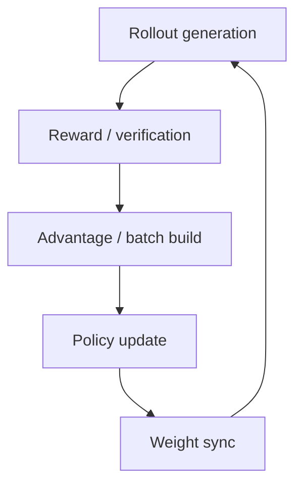

# 专项负载：Mixture of Experts、长上下文与 Reinforcement Learning

<!-- learning-position -->
> **学习定位**：A5/A6/A8 · 分层必修。
> **前置**：[Ray、队列与前置系统](<../../learn_docs/00_Foundations/07_Ray与队列调度.md>)。
> **首读/二读**：RL 角色时间线、queue/lag 与状态先读；MoE/长序列随专项回读。
> **进度与实验**：[学习清单](<../../learn_docs/学习清单.md>) · [总入口](<../../learn_docs/README.md>)。
<!-- /learning-position -->

Mixture of Experts（MoE，混合专家）、长上下文与 Reinforcement Learning（RL，强化学习）三类 workload 的共同点是“工作量动态”：同一个 step/request 的 token 数、通信量、角色状态或 kernel shape 可能不同。只看平均 operator 时间会丢掉根因。

## 1. MoE：以 token routing 为主键

MoE 应为每层记录：

```text
tokens before routing
top-k and capacity factor
tokens per expert: mean / max / p99 / zero-count
dropped / padded / duplicated tokens
dispatch and combine bytes
AllToAllV duration and arrival skew
grouped GEMM M/N/K distribution
```

关键派生量：

$$load\ imbalance=\frac{\max_e n_e}{\operatorname{mean}_e n_e}$$

$$padding\ waste=\frac{\sum_e (n'_e-n_e)}{\sum_e n'_e}$$

其中 $n_e$ 是真实 expert token，$n'_e$ 是为固定 shape/padding 后的 token 数。

### 一个例子

8 个 expert 平均各 256 token，但一个 expert 收到 600，其他约 207。网络总 bytes 没有明显增加，AllToAll 后该 rank 的 expert GEMM 却延长，所有 rank 在 combine 前等待。此时“优化 NCCL”收益有限；应看 router balance、expert placement、capacity、token drop/pad 与 grouped GEMM 对小/不规则 shape 的效率。

## 2. 长上下文：用有效 attention work 分桶

标准 attention 的计算与序列长度近似二次相关，但 FlashAttention 等实现改变 memory traffic；Context Parallelism（CP，上下文并行）又增加 KV exchange。记录：

- actual/padded/packed token；
- 每段 causal 可见 pair 数，而非只看 sequence length；
- prefill chunk size；
- CP degree 与通信类型；
- KV cache residency/offload/hit；
- attention kernel shape、tile 与 recompile；
- 每个 rank 的 query/KV work。

两个 batch 都是 32K token：一个是单条 32K，另一个是 32 条 1K packed，它们的 causal attention work、metadata 与 kernel shape 完全不同。

## 3. 动态 shape 的 profiler 陷阱

若把所有 `attention_fwd` 聚合，平均值可能没有意义。应按 `(batch, q_len, kv_len, heads, dtype, causal, layout)` group；对 `torch.compile` 还要记录 graph ID、guard failure 与 compilation time。

长上下文 p99 有时不是 kernel 慢，而是某个新 shape 第一次编译/autotune。将 cold 与 warm 分开报告。

## 4. RL：角色级时间线

RL 后训练通常包含 actor/rollout、reference、reward、critic 与 trainer。端到端 throughput 由多条流水线和 policy version dependency 共同决定。



同步系统要看最慢角色与 barrier；异步系统还要看 staleness（陈旧度）：trajectory 由哪个 policy version 生成，更新时当前 version 是多少。

## 5. RL 指标

| 层级 | 指标 |
|---|---|
| 用户目标 | accepted/rewarded samples per hour、time-to-quality |
| Rollout | generated tokens/s、TTFT/TPOT、KV usage、early termination |
| Trainer | train tokens/s、MFU、update time、optimizer step |
| Pipeline | queue depth、role idle fraction、sample-to-update latency |
| Policy | version lag、off-policy ratio、weight sync bytes/time |
| Correctness | reward distribution、KL、clip fraction、loss/entropy |

KL = Kullback–Leibler divergence（库尔贝克–莱布勒散度）。只提高 rollout tokens/s 可能产生更多无效/截断样本，甚至降低最终 time-to-quality。

## 6. Colocation 的资源争用

rollout 与 trainer colocate（同卡复用）时，切换可能包含：释放/恢复 KV、权重 reshard、CUDA Graph pool、NCCL communicator 与 allocator cache。观察：

- 角色切换时间与显存峰值；
- sleep/wake 或 offload duration；
- weight synchronization critical path；
- CPU/RDMA/NVLink 是否同时争用；
- profiler 启用是否使本已接近上限的 phase OOM。

## 7. 统一 trace schema

建议所有事件至少带：

```text
job_id, rank, node, role, policy_version,
global_step, micro_batch, request_id_hash,
layer, expert, q_len, kv_len, tokens,
parallel_group, bytes, start, duration
```

`request_id_hash` 应不可逆或仅在短期本地可关联，避免把用户 prompt、reward detail 等敏感数据写入 trace。

## 资料

- [Megatron Core MoE Guide](https://docs.nvidia.com/megatron-core/developer-guide/latest/user-guide/features/moe.html)
- [verl Performance Tuning](https://verl.readthedocs.io/en/latest/perf/perf_tuning.html)
- [并行专题：RL 角色级并行](../../learn_docs/03_Parallelism/13_RL角色级并行.md)
- [通信专题：MoE All-to-All 案例](../../learn_docs/02_Distributed_Communication_Memory/13_案例_MoE-AllToAll.md)
