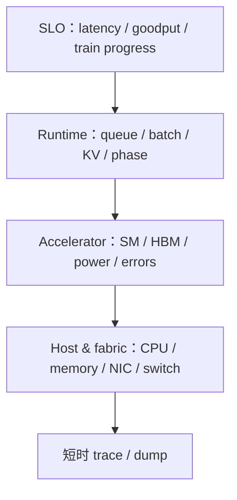

# 线上可观测性

<!-- learning-position -->
> **学习定位**：A7 · 必修。
> **前置**：[对应系统的基础实践](<../../learn_docs/学习清单.md>)。
> **首读/二读**：metric/log/trace、基数、告警与低开销观测，接一个已跑通的小系统。
> **进度与实验**：[学习清单](<../../learn_docs/学习清单.md>) · [总入口](<../../learn_docs/README.md>)。
<!-- /learning-position -->

线上可观测性的目标不是复刻 profiler，而是以可控开销持续回答：谁慢、从何时开始、影响多大、与部署/流量/硬件哪个变化相关，并能触发短时深度采样。

DCGM = Data Center GPU Manager（数据中心 GPU 管理器）；SLO = Service Level Objective（服务等级目标）。

## 1. 四层信号



仅有 DCGM dashboard 看不到 scheduler queue；仅有应用 latency 看不到某节点 NVLink 降级。四层必须用 job、node、GPU、rank/replica 等稳定标签关联。

## 2. Prometheus 指标设计

Prometheus 是时间序列监控系统。常用 metric type：

- Counter：只增计数，如请求、token、错误；
- Gauge：可增减状态，如 queue depth、KV usage；
- Histogram：服务端按 bucket 统计 latency 等分布，可跨实例聚合 quantile；
- Summary：client 计算 quantile，跨实例聚合困难。

延迟优先 histogram；在生态支持时可评估 native histogram。bucket 应围绕 SLO 设计，而不是盲用默认值。

## 3. 命名与基数

```text
llm_request_duration_seconds_bucket{model="...",status="ok",le="..."}
llm_tokens_generated_total{model="..."}
llm_kv_cache_usage_ratio{replica="..."}
```

单位放在 metric name（`_seconds`、`_bytes`），counter 用 `_total`。不要把 request ID、prompt、用户 ID、任意 error text 当 label；它们制造 high cardinality（高基数），会拖垮存储和查询。需要逐请求详情时用采样 trace/log，并做脱敏。

## 4. DCGM Exporter 的位置

`dcgm-exporter` 从 DCGM hostengine 暴露 GPU metric 给 Prometheus。一个重要细节：exporter 常读取 hostengine watch 缓存中的最新样本，scrape 更快不一定得到更高频的新硬件 counter。

标签要能关联 Kubernetes pod/container 或 Slurm job。若 Multi-Instance GPU（MIG，多实例 GPU）启用，还需区分 GPU instance 与 compute instance，不能仅按物理 GPU index 聚合。

## 5. Dashboard 不应只有平均值

建议页面：

| 页面 | 核心图 |
|---|---|
| SLO | request rate、error、TTFT/TPOT/E2EL p50/p95/p99、goodput |
| Scheduler | waiting/running、prefill/decode tokens、batch、preemption、KV |
| Training | tokens/s、step quantile、MFU、checkpoint/eval、straggler |
| GPU | SM/Tensor/DRAM、memory、power/clock/temp、Xid/ECC |
| Fabric | NVLink/PCIe/NIC throughput/error、retransmit/congestion |
| Deployment | version/config/driver/NCCL 与变更事件 |

deploy marker 与配置 hash 是高价值信息：性能突变若与发布精确重合，可快速缩小范围。

## 6. Alert 设计

报警应从用户影响出发，并设置持续窗口：

```text
TTFT p99 > SLO for 10m AND request_rate > minimum
goodput_ratio < 0.95 for 10m
training progress absent for 2 expected steps
Xid increment > 0
KV usage > 0.95 AND preemption rate rising
rank step skew > threshold for 5 consecutive steps
```

GPU utilization 低通常不应单独 page；夜间低流量或 memory-bound workload 都可能正常。可作为诊断信号或与 queue backlog 组合报警。

## 7. 从告警到 trace

推荐触发链：

1. metric 发现 SLO 退化；
2. 保存告警前后 deployment、traffic 与 hardware window；
3. 在少量 replica/rank 触发 5–20 秒轻量 trace；
4. 若是 distributed hang，触发 Flight Recorder dump；
5. 只对可重现热点做 Nsight Compute；
6. trace 设置自动过期与访问控制。

按需 tracing 比永久全量 profiling 更可控，也降低敏感数据和存储风险。

## 8. 观测系统自身 SLO

监控也会失败。记录 exporter scrape error、sample age、dropped trace、time synchronization drift、Prometheus ingestion lag、dashboard query latency。若 GPU metric 停在旧值，不能误当成设备状态稳定。

## 资料

- [Prometheus Metric Types](https://prometheus.io/docs/concepts/metric_types/)
- [Prometheus Histograms and Summaries](https://prometheus.io/docs/practices/histograms/)
- [Prometheus Naming](https://prometheus.io/docs/practices/naming/)
- [DCGM Exporter Installation](https://docs.nvidia.com/datacenter/dcgm/latest/installation/install-dcgm-exporter.html)
- [DCGM Exporter](https://github.com/NVIDIA/dcgm-exporter)
