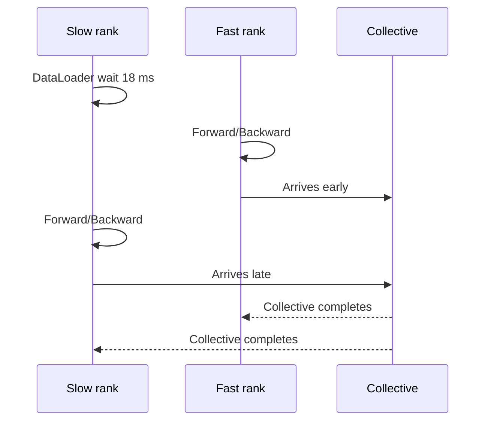

# 案例：GPU 利用率低

<!-- learning-position -->
> **学习定位**：A6 · 必修。
> **前置**：[性能语言与测量](<00_concepts.md>)。
> **首读/二读**：按假设、证据、控制实验理解案例；所有数值为教学构造。
> **进度与实验**：[学习清单](<../../learn_docs/学习清单.md>) · [总入口](<../../learn_docs/README.md>)。
<!-- /learning-position -->

> 教学构造案例：以下节点、耗时和吞吐数字用于演示推理过程，不是本仓库或 H20 的实测报告。

## 现象

一个 64 GPU 训练任务从 190k tokens/s 降到 145k；`nvidia-smi` 显示 GPU utilization 在 55%–95% 波动。最近没有模型代码变更，但换了一批数据 shard。目标不是“把利用率改成 100%”，而是找出吞吐回退的因果链。

## 第 0 步：保护现场

记录并冻结：commit/image、driver/CUDA/NCCL、parallel config、global/micro batch、sequence distribution、节点/GPU/rank mapping、数据版本。确认 loss 与有效 token 口径未变。

如果吞吐按 padded token 统计，新数据有效长度变化本身就可能造成错觉。

## 第 1 步：确定问题范围

从常驻指标看到：

- 只有 node 5 上 8 个 rank 的 GPU utilization 周期下降；
- 其 power/clock/temperature 正常，无 Xid/ECC；
- 全局 step p99 上升，每次慢 step 都与 node 5 对齐；
- network error counter 无明显变化。

暂时降低全局 kernel 回退和热降频的优先级，把假设缩到 node 5 的 host/data/topology 或局部 hardware path。

## 第 2 步：系统时间线

在 node 5 的慢 rank 与另一节点快 rank 同时采 10 个稳态 step 的 Nsight Systems：

快 rank 的 NCCL event 看似长，但多 rank 对齐后发现它早到 18 ms；慢 rank 的 GPU 在 step 开头为空，CPU 卡在 DataLoader。结论：collective 是等待的承载位置，不是根因。

## 第 3 步：切断数据变量

控制实验：

| 实验 | 结果 | 推断 |
|---|---|---|
| GPU 上 synthetic batch | 恢复 193k tokens/s | GPU/kernel/communication 基本正常 |
| 数据预读到 host memory | 仍慢 | 不只是 storage throughput |
| 关闭 tokenizer | 恢复 | CPU preprocessing 是候选 |
| 原数据 shard | 恢复 | 新 shard 特征触发慢路径 |

进一步按样本统计，发现新 shard 含大量超长文档；tokenizer + packing 在一个 worker 上出现长尾，而 DataLoader 顺序等待该 batch。

## 第 4 步：为什么只慢一个节点

比较 CPU/NUMA：node 5 的 worker 被容器限制到与 NIC/其他 daemon 争用的一组 CPU；其他节点 cpuset 更宽。超长文档放大 CPU 长尾，错误 cpuset 使其只在 node 5 成为 straggler。

用相同 shard 在修正 CPU affinity 后复测，DataLoader p99 从 22 ms 降到 6 ms，全局吞吐恢复 188k tokens/s。

## 第 5 步：验证不是“偶然变快”

- 连续 5 次 500-step window；
- 新旧 shard、短/长序列分桶；
- step p50/p99 与 tokens/s/GPU；
- loss/effective tokens；
- node/rank skew；
- CPU utilization、RSS 与 GPU peak memory。

最终吞吐 188–192k，step p99 接近基线，无 correctness 回退。

## 修复组合

1. 修正 pod CPU request/cpuset 与 NUMA affinity；
2. tokenizer/packing worker 数从经验值改为 sweep 后的配置；
3. 超长文档预处理或按成本分桶，避免单 batch head-of-line blocking；
4. 监控每 rank `data_wait_seconds` 与 sequence/packing cost；
5. 添加“rank arrival skew 高且某 rank data wait 高”的诊断告警。

## 如果第 2 步看到的是另一种图形

| 证据 | 下一分支 |
|---|---|
| 所有 rank GPU 都空，CPU 在 `.item()` | 降低同步 logging 频率 |
| GPU 满是 2–5 µs kernel | fusion、compile、CUDA Graph |
| 到达一致但跨节点 NCCL 变长 | `nccl-tests`、GPU–NIC mapping、fabric counter |
| kernel 连续但 SM/DRAM 都低 | Nsight Compute 查 occupancy/dependency |
| KV 使用率高且 preemption 上升 | 降并发/调 KV/调度，不适用本训练案例 |
| 某 PP stage 始终最长 | stage repartition 或 interleaved schedule |

## 本案例的通用教训

- GPU utilization 是线索，不是目标；
- collective 长可能是 arrival skew；
- 新数据能改变 CPU 成本、shape、编译、padding 和 MoE routing；
- synthetic data 是定位数据路径的强控制实验；
- 修复应落到回归 metric，而不止保存一次 trace 截图。

## 延伸阅读

- [CPU 与数据加载](02_pytorch.md#concept-07)
- [分布式通信 Profiling](04_megatron.md#concept-09)
- [线上可观测性](10_observability.md)
