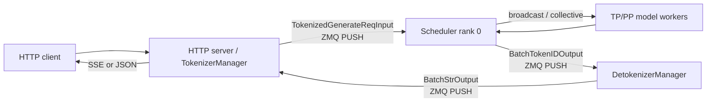
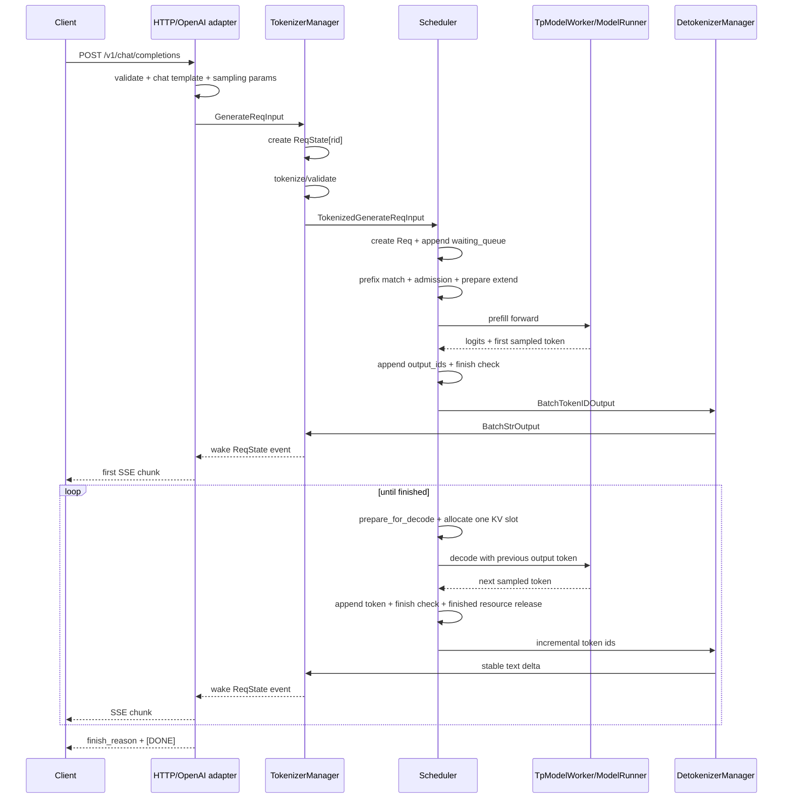

# 1.2 一条 request 进入 SGLang 后如何流转

本文沿着一条普通文本生成请求，解释它从 HTTP 入口进入 SGLang，到 GPU 完成 prefill/decode，再到文本通过 HTTP 返回的完整代码路径。

本文基于本仓库固定的 SGLang 快照 `f5155d960286db25952217f343ee0d3c358f7f77`。源码行号只用于快速定位；后续同步上游代码时，应优先搜索类名和函数名。

## 1. 阅读范围

先固定最容易理解的主路径：

- 单机、单个 HTTP worker；
- 普通 decoder-only 文本生成模型；
- `/v1/chat/completions` 或 native `/generate`；
- 非 PD disaggregation；
- 非 speculative decoding；
- 非 multimodal、非 LoRA、非 grammar；
- normal scheduler，即关闭 overlap 后的逻辑顺序。

这些功能不会完全重写主链路，而是在请求转换、调度、模型执行或返回路径上增加分支。本文最后单独说明这些分支插在哪里。

## 2. 先看完整结论

一条 OpenAI chat request 的主链路是：

```text
POST /v1/chat/completions
  → FastAPI / Pydantic 校验
  → OpenAIServingChat：chat template + SamplingParams
  → GenerateReqInput
  → TokenizerManager：注册 ReqState + tokenize/校验
  → TokenizedGenerateReqInput
  → ZMQ PUSH
  → SchedulerRequestReceiver
  → Scheduler.handle_generate_request
  → Req
  → waiting_queue
  → prefix match + admission + KV/request slot 分配
  → ScheduleBatch.prepare_for_extend
  → TpModelWorker → ModelRunner → model.forward → Sampler
  → prefill 产生第一个 output token
  → running_batch
  → 重复 decode：上一个 token → 新 KV → 下一个 token
  → EOS / stop / max_new_tokens / abort
  → BatchTokenIDOutput
  → DetokenizerManager
  → BatchStrOutput
  → TokenizerManager.rid_to_state[rid]
  → OpenAI response adapter
  → SSE chunk 或完整 JSON response
```

这里最重要的事实是：

1. HTTP request、scheduler `Req`、一次 GPU `ScheduleBatch` 是三个不同层次的对象。
2. prefill 不只计算 prompt KV，也会直接采样第一个 output token。
3. 一条长生成请求会参加许多次 decode batch；batch 每轮都可以变化。
4. scheduler 输出的是 token id 和元数据，`DetokenizerManager` 才负责稳定的增量文本。
5. `rid` 是所有进程关联同一条请求的主键。

## 3. 进程拓扑与 IPC

典型 server 把 CPU 文本处理、GPU 调度和增量 detokenize 拆到不同进程：



主要 IPC endpoint 在 `PortArgs` 中分配，socket 初始化分散在：

- `srt/managers/tokenizer_manager.py:407`：`TokenizerManager.init_ipc_channels()`；
- `srt/managers/scheduler_components/ipc_channels.py:27`：`SchedulerIpcChannels.create()`；
- `srt/managers/detokenizer_manager.py:108`：`DetokenizerManager.init_ipc_channels()`。

主路径上的消息如下：

| 方向 | 消息 | 含义 |
|---|---|---|
| Tokenizer → Scheduler | `TokenizedGenerateReqInput` | 已规范化、已 tokenized 的单请求 |
| Tokenizer → Scheduler | `AbortReq` | client disconnect、显式 abort 或批量取消 |
| Scheduler → Detokenizer | `BatchTokenIDOutput` | 增量 token ids、finish reason、logprobs、usage 等 |
| Detokenizer → Tokenizer | `BatchStrOutput` | 已做增量 decode 的文本片段和原元数据 |
| Scheduler → Tokenizer | `AbortReq` | waiting request 被取消或 scheduler 主动拒绝 |

拆进程的目的不是代码风格，而是隔离不同资源：tokenization/detokenization 是 CPU 工作，scheduler 持有 KV 和请求资源状态，model worker 驱动 GPU。它们之间不能共享普通 Python 对象，只能传递可序列化消息和稳定的 request id。

## 4. 端到端时序图

下面先忽略 overlap、chunked prefill 和 prefix cache hit：



非流式请求的 GPU 路径基本相同，只是 `TokenizerManager` 不把中间结果交给 HTTP coroutine，直到 `finished_reason` 非空才返回完整结果。

## 5. 请求在不同层的对象形态

同一条请求会依次变成多个对象：

| 阶段 | 对象 | 主要持有者 | 关键内容 |
|---|---|---|---|
| OpenAI 协议层 | `ChatCompletionRequest` | FastAPI/OpenAI adapter | messages、model、temperature、stream |
| SGLang API 层 | `GenerateReqInput` | `TokenizerManager` | text/input_ids、sampling dict、rid、附加输出开关 |
| IPC 输入层 | `TokenizedGenerateReqInput` | Tokenizer/Scheduler | input ids、已验证的 `SamplingParams`、rid、time stats |
| 调度请求层 | `Req` | `Scheduler` | input/output ids、finish、KV、prefix、grammar、stream offsets |
| 调度 batch 层 | `ScheduleBatch` | `Scheduler` | 本轮请求集合、forward mode、seq lens、pool indices |
| GPU 执行层 | `ForwardBatch` | `TpModelWorker/ModelRunner` | 真正送入模型和 attention backend 的 tensor metadata |
| scheduler 输出层 | `BatchTokenIDOutput` | Scheduler/Detokenizer | 增量 token ids、decode context、finish reason、metrics |
| 文本输出层 | `BatchStrOutput` | Detokenizer/Tokenizer | 稳定文本 delta、token ids、finish reason、usage |
| HTTP 等待状态 | `ReqState` | `TokenizerManager` | asyncio event、待发送输出、累计文本/token、完成状态 |

不要把这些类型合并理解成“request”。每次类型转换都代表一次所有权边界：协议层不管理 KV，scheduler 不管理 HTTP response，detokenizer 不决定 GPU admission。

## 6. 第一段：HTTP 与 OpenAI adapter

### 6.1 FastAPI 路由

OpenAI chat 入口位于 `srt/entrypoints/http_server.py:1659`：

```python
@app.post("/v1/chat/completions", dependencies=[Depends(validate_json_request)])
async def openai_v1_chat_completions(request, raw_request):
    return await raw_request.app.state.openai_serving_chat.handle_request(
        request, raw_request
    )
```

native 入口位于同文件 `:828` 的 `/generate`。两者的区别主要在协议适配：

- `/generate` 已经接收内部风格的 `GenerateReqInput`；
- `/v1/chat/completions` 先接收 `ChatCompletionRequest`，再转换为 `GenerateReqInput`；
- 转换完成后，两条路径都会进入 `TokenizerManager.generate_request()`。

### 6.2 通用 OpenAI 处理框架

`srt/entrypoints/openai/serving_base.py:73` 的 `OpenAIServingBase.handle_request()` 定义公共流程：

```text
_validate_request
  → request logging
  → _convert_to_internal_request
  → stream ? _handle_streaming_request : _handle_non_streaming_request
```

这里记录 `received_time`，统一把 `ValueError` 映射为 400，把未预期异常映射为 500。

### 6.3 chat template 与内部请求

`OpenAIServingChat._convert_to_internal_request()` 位于 `serving_chat.py:661`。它做三件关键事情：

1. `_process_messages()` 把 role/message/tool/multimodal 内容套入 chat template；
2. `request.to_sampling_params()` 把 OpenAI 参数转换为内部 sampling 字典；
3. 构造 `GenerateReqInput`，写入 `rid`、`stream`、LoRA、DP 路由、logprobs 等字段。

对普通文本模型，chat template 路径通常已经产生 `prompt_ids`，因此 `GenerateReqInput` 会携带 `input_ids`。对 native `/generate` 的纯文本请求，tokenization 常发生在下一层的 `TokenizerManager`。所以“所有 tokenization 都在同一个函数中完成”并不准确。

### 6.4 streaming 与 non-streaming 从这里分叉

- streaming：`serving_chat.py:1177` 创建 `_generate_chat_stream()`，先主动取第一个 chunk，确保输入校验失败时还能返回 HTTP 400，而不是先发 HTTP 200 再把错误塞进 SSE；
- non-streaming：`serving_chat.py:1444` 只取 `TokenizerManager.generate_request(...).__anext__()` 的最终结果，再组装 `ChatCompletionResponse`。

streaming adapter 还负责把内部文本进一步拆成 OpenAI `delta`，并处理 reasoning、tool call、usage 和最终 `[DONE]`。这些属于协议输出层，不改变 scheduler 生成的 token 序列。

## 7. 第二段：`TokenizerManager` 建立异步请求状态

主函数是 `srt/managers/tokenizer_manager.py:630` 的 `generate_request()`。

### 7.1 请求规范化

入口先执行：

```python
obj.normalize_batch_and_arguments()
self._set_default_priority(obj)
self._init_req_state(obj, request)
```

`normalize_batch_and_arguments()` 统一 single/batch 参数形态并生成或整理 `rid`。随后 `_init_req_state()` 在 `rid_to_state` 中建立 `ReqState`：

```python
state = ReqState([], False, asyncio.Event(), sub_obj, time_stats)
self.rid_to_state[rid] = state
```

`ReqState` 位于 `tokenizer_manager.py:172`，它是 HTTP coroutine 与后台 IPC receive loop 之间的桥：

- HTTP coroutine 在 `_wait_one_response()` 中等待 `state.event`；
- 后台 `handle_loop()` 收到 scheduler/detokenizer 输出后写入 `state.out_list`；
- 写入者调用 `state.event.set()` 唤醒等待者；
- `state` 还累计完整 text、output ids、logprobs 和时间指标。

重复 `rid` 会在 `_init_req_state()` 中直接报错。因为 `rid` 同时存在于多个进程，允许两个 active request 复用它会把输出路由到错误的 coroutine。

### 7.2 tokenization 与参数校验

`_tokenize_one_request()` 位于 `tokenizer_manager.py:834`：

```text
input_embeds 已提供 → 使用 embeds 和可选 input_ids
input_ids 已提供    → 直接使用
否则                → tokenizer(text)
```

multimodal 请求还会经过 processor、placeholder/padding 和 feature 处理。普通文本请求随后由 `_create_tokenized_object()` 构造 `TokenizedGenerateReqInput`：

- sampling dict 变成 `SamplingParams`；
- `normalize()` 补齐 tokenizer 相关默认值；
- `verify()` 检查 top-k/top-p/max tokens 等约束；
- input length、vocab 范围、logprob 参数也在这一阶段或 scheduler 入口继续校验。

`GenerateReqInput` 是 API 对象，`TokenizedGenerateReqInput` 才是发给 scheduler 的 IPC 对象。

### 7.3 发给 scheduler

`_send_one_request()` 位于 `tokenizer_manager.py:1373`：

```python
tokenized_obj.time_stats.set_api_server_dispatch_time()
tokenized_obj = wrap_shm_features(tokenized_obj)
tokenized_obj.wrap_pickle_fields()
self._dispatch_to_scheduler(tokenized_obj)
```

`_dispatch_to_scheduler()` 最终调用 `sock_send()`，通过 ZMQ PUSH socket 发往 `scheduler_input_ipc_name`。若启用多个 tokenizer worker，中间还会经过 multi-tokenizer router，并在消息上记录应该把输出送回哪个 HTTP worker。

### 7.4 HTTP coroutine 不阻塞 GPU loop

发出请求后，`_wait_one_response()` 在 `tokenizer_manager.py:1488` 等待 `ReqState.event`。它不是同步轮询 GPU：

```python
await asyncio.wait_for(state.event.wait(), timeout=...)
```

超时只用于周期性检查 client 是否断开；只要请求仍活跃，它会继续等。收到输出后：

- streaming 请求每次 `yield out`；
- non-streaming 请求只在 `state.finished` 后 `yield`；
- finish 时记录 e2e/response 时间并写请求日志；
- disconnect 时向 scheduler 发 `AbortReq`。

## 8. 第三段：scheduler 收到请求并创建 `Req`

### 8.1 rank 0 收消息，再同步给并行 ranks

`SchedulerRequestReceiver.recv_requests()` 位于 `srt/managers/scheduler_components/request_receiver.py:73`。普通路径中：

1. scheduler rank 0 以 non-blocking 方式从 ZMQ socket 拉取尽可能多的消息；
2. TP/PP/DP 模式按拓扑 broadcast 或 point-to-point 同步请求；
3. 解包 pickle/shared-memory 字段；
4. 返回本轮 `recv_reqs`。

因此一个外部 request 只需进入一个 ZMQ socket，但所有需要参与本轮模型执行的 ranks 必须看到一致的控制信息。

### 8.2 类型分发

`Scheduler.process_input_requests()` 位于 `scheduler.py:1708`。它通过 `_request_dispatcher` 按消息类型分发：

```text
TokenizedGenerateReqInput      → handle_generate_request
BatchTokenizedGenerateReqInput → handle_batch_generate_request
AbortReq                       → abort_request
其他 control request           → 对应 handler
```

### 8.3 `TokenizedGenerateReqInput` 变成 `Req`

`Scheduler.handle_generate_request()` 位于 `scheduler.py:2124`。普通非 session 路径构造 `Req`，把下列状态转移到 scheduler：

- `origin_input_ids` 和 input text；
- `SamplingParams`；
- `stream`、logprob、hidden states 等返回选项；
- LoRA、priority、routing key；
- session、multimodal、PD/spec 相关状态；
- 跨进程传来的 time stats。

`Req` 定义在 `srt/managers/schedule_batch.py:713`，它会跨越整条生成生命周期。几个最关键字段是：

```python
self.origin_input_ids = origin_input_ids
self.output_ids = array("q")
self.full_untruncated_fill_ids = array("q")
self.finished_reason = None
self.req_pool_idx = None
self.kv_committed_len = 0
self.prefix_indices = torch.empty((0,), dtype=torch.int64)
```

其中 `output_ids` 是 append-only。retraction、speculative、prefix cache 和 fill ids 更新都依赖这个不变量。

### 8.4 scheduler 再做一次运行时校验

API 层的校验不能代替 scheduler 校验，因为 scheduler 才知道真实的模型容量和运行模式。`handle_generate_request()` 会检查：

- multimodal 展开后的真实输入长度；
- `max_req_input_len` 与 auto truncate；
- logprob 起点是否合法；
- sampling mask 与 PD/spec/backend 的组合是否合法；
- session/PD bootstrap 是否有效；
- grammar 是否需要异步编译。

通过后，请求进入：

```python
self.waiting_queue.append(req)
req.time_stats.set_wait_queue_entry_time()
```

如果带 grammar，它可能先进入 grammar queue，grammar ready 后再进入 `waiting_queue`。PD 模式则进入专用 bootstrap/prealloc queue，不走普通 waiting queue。

## 9. 第四段：scheduler event loop 与 continuous batching

### 9.1 normal loop

`Scheduler.event_loop_normal()` 位于 `scheduler.py:1552`：

```python
while True:
    recv_reqs = self.request_receiver.recv_requests()
    self.process_input_requests(recv_reqs)

    plan = self.get_next_batch_to_run(
        running_batch=self.running_batch,
        last_batch=self.last_batch,
    )
    self.running_batch = plan.running_batch
    batch = plan.batch_to_run

    if batch:
        result = self.run_batch(batch)
        self.process_batch_result(batch, result)
    else:
        self.on_idle()

    self.last_batch = batch
```

continuous batching 的含义就在这里：每轮都先接收新请求，再从 waiting 和 running 状态中拼出下一次 forward。一个 batch 不是固定队列；请求可以在不同 iteration 加入、完成、被过滤或被 retract。

### 9.2 prefill 优先，否则 decode

`get_next_batch_to_run()` 位于 `scheduler.py:2739`，主决策顺序是：

1. 处理 timeout、abort 和上一轮 chunked/prefill 状态；
2. 把上一轮完成 prefill 的请求合并进 `running_batch`；
3. 尝试 `get_new_batch_prefill()`；
4. 如果能组成新 prefill batch，本轮运行 prefill；
5. 否则更新 `running_batch` 并运行 decode；
6. 插入 DP attention、ngram/spec 等模式特有步骤。

这意味着默认策略会在可行时优先安排新 prefill。chunked prefill、prefill delay 和 mixed chunk 会改变 prefill/decode 的交错方式，但不会改变 `waiting → prefill → running decode` 的基本生命周期。

## 10. 第五段：prefix match、admission 与 prefill batch

### 10.1 `Req.init_next_round_input()` 做 prefix match

`get_new_batch_prefill()` 最终遍历 `waiting_queue`。对每个候选请求先调用 `Req.init_next_round_input()`，位于 `schedule_batch.py:1179`：

1. `_refresh_fill_ids()` 得到 `origin_input_ids + output_ids`；
2. 构造带 `extra_key` 的 `RadixKey`；
3. `tree_cache.match_prefix()` 查找可复用的 KV；
4. 写入 `prefix_indices`、`last_node`、host/storage hit 等状态。

最大匹配长度通常最多是 `input_len - 1`。至少保留一个 token 重新 forward，才能得到 next-token logits；要求 input logprob 时还会进一步缩短可复用范围。

### 10.2 `PrefillAdder` 做 admission control

`srt/managers/schedule_policy.py` 中的 `PrefillAdder` 不是简单地“取 waiting queue 前 N 个”。它同时约束：

- 剩余 KV token 数；
- request pool 剩余 slot；
- `max_prefill_tokens`；
- `max_running_requests`；
- running decode 的未来 token 预算；
- chunked prefill 大小；
- priority、LoRA、DP/PP 和 cache policy。

真正需要 prefill 的长度不是 prompt 总长度，而是：

```text
extend tokens ≈ full fill ids - reusable prefix
```

所以 cache hit 会同时影响 TTFT、计算量和 admission 结果。

### 10.3 构造 `ScheduleBatch`

被选中的请求从 `waiting_queue` 移除，然后：

```python
new_batch = ScheduleBatch.init_new(...)
new_batch.prepare_for_extend()
```

`prepare_for_extend()` 位于 `schedule_batch.py:2176`。它设置 `ForwardMode.EXTEND`，整理每条请求尚未计算的 input ids、prefix length、extend length 和 seq length，并调用 `alloc_for_extend()` 分配资源。

这里有两类不同的 pool：

| 资源 | 作用 |
|---|---|
| request pool / `req_pool_idx` | 为每条 active sequence 保存 token→KV 映射表的行 |
| token-to-KV pool | 为每个实际 token 分配物理 KV 位置 |

`req_pool_idx` 不是 KV index；它是请求映射表的 slot。`out_cache_loc` 才描述本轮新 token 写入哪些物理 KV 位置。

## 11. 第六段：从 `ScheduleBatch` 到模型 forward 和采样

`Scheduler.run_batch()` 位于 `scheduler.py:3342`。普通 generation 路径依次进入：

```text
Scheduler.run_batch
  → TpModelWorker.forward_batch_generation
  → ForwardBatch.init_new
  → ModelRunner.forward
  → model.forward / attention backend
  → logits processor
  → ModelRunner.sample
  → Sampler.forward
  → GenerationBatchResult
```

### 11.1 `ForwardBatch` 是执行层对象

`TpModelWorker.forward_batch_generation()` 位于 `srt/managers/tp_worker.py:529`。它先用 `ForwardBatch.init_new()` 把 scheduler metadata 转成 model runner 使用的 tensor 视图，再调用 `ModelRunner.forward()`。

此时关键字段包括：

- `forward_mode`：EXTEND/PREFILL 或 DECODE；
- `input_ids`、`positions`；
- `seq_lens`、prefix/extend metadata；
- request pool indices 和本轮 KV 写入位置；
- sampling、grammar、logprob 配置；
- multimodal/LoRA/DP/PP metadata。

attention backend 根据这些字段建立 paged KV 和 attention metadata。model forward 本身并不知道 HTTP，也不负责请求排队。

### 11.2 forward 之后才 sampling

最后一个 PP rank 得到 `logits_output` 后，`TpModelWorker` 调用 `ModelRunner.sample()`。后者先应用：

- grammar vocab mask；
- custom logit processor 和 logit bias；
- temperature、penalty；
- top-k/top-p/min-p；
- greedy 或随机 sampling；
- 可选 logprobs。

采样实现入口是 `srt/layers/sampler.py:95` 的 `Sampler.forward()`。输出的 `next_token_ids` 与 logits 等一起包装成 `GenerationBatchResult` 返回 scheduler。

### 11.3 prefill 为什么已经有首 token

prefill 把 prompt 中尚未缓存的多个 token 送入模型，最后一个位置的 logits 正好给出“prompt 后的下一个 token”分布。因此 prefill result 已包含第一个 sampled output token。

这时 KV 中已经提交的是 prompt token；刚采样出的第一个 output token 还没有自己的 KV。它将在下一轮 decode 中作为 input，模型计算它的 KV，并采样第二个 output token。

## 12. 第七段：处理 prefill 结果

`Scheduler.process_batch_result()` 位于 `scheduler.py:3619`。EXTEND batch 进入 `SchedulerBatchResultProcessor.process_batch_result_prefill()`，位于 `scheduler_components/batch_result_processor.py:181`。

对普通生成请求，核心顺序是：

```python
req.output_ids.append(next_token_id)
req.update_finish_state()

if req.finished():
    release_kv_cache(req, self.tree_cache)
else:
    maybe_cache_unfinished_req(req, self.tree_cache)

self.output_streamer.stream_output(...)
```

状态变化如下：

| prefill 前 | prefill 后 |
|---|---|
| `output_ids=[]` | `output_ids=[first_token]` |
| `req_pool_idx=None` | 已分配 request slot，未结束时继续持有 |
| 无 prompt KV | prompt 的未命中部分已有 KV |
| 位于 `waiting_queue` | 未结束时等待合并进 `running_batch` |
| `finished_reason=None` | 可能因 max tokens/EOS/stop 直接完成 |

`maybe_cache_unfinished_req()` 会把已经计算的前缀纳入 prefix cache 管理，并更新请求持有的 prefix/lock 状态。它不代表请求结束；请求仍会用 request slot 和可复用 KV 继续 decode。

下一轮 `get_next_batch_to_run()` 会把上一轮完成 prefill、尚未 finished 的请求并入 `running_batch`。

## 13. 第八段：decode 循环

当没有更优先的新 prefill batch 时，scheduler 调用 `update_running_batch()`，位于 `scheduler.py:3192`：

1. `filter_batch()` 移除 finished/retracted 请求；
2. `check_decode_mem()` 检查下一轮 KV 是否足够；
3. 内存不足时 `retract_decode()` 释放部分请求资源并重新排队；
4. `prepare_for_decode()` 构造下一轮 decode metadata。

### 13.1 `prepare_for_decode()` 每轮做什么

`ScheduleBatch.prepare_for_decode()` 位于 `schedule_batch.py:2844`。普通非 speculative 路径：

- 设置 `ForwardMode.DECODE`；
- 为每条请求分配一个新 KV slot；
- `kv_committed_len += 1`；
- `seq_lens += 1`；
- 输入 token 是上轮刚采样的最后一个 output token；
- 更新 penalty/sampling metadata。

随后再次走：

```text
run_batch
  → TpModelWorker
  → ModelRunner.forward
  → Sampler
  → process_batch_result_decode
```

### 13.2 处理 decode result

`process_batch_result_decode()` 位于 `batch_result_processor.py:724`。普通路径每请求只接受一个 token：

```python
req.output_ids.extend(next_token_id)
req.update_finish_state(new_accept_len)
```

speculative decoding 时一次可能接受多个 token，但后续 finish、stream 和 KV 清理仍以“已接受 token”作为提交边界。

未结束请求留在 `running_batch`，下一轮重复 decode。不同请求可在同一轮分别完成、继续或 retract，`filter_batch()` 会在后续 iteration 重建 batch 视图。

## 14. finish 判定的真实优先级

`Req.update_finish_state()` 位于 `schedule_batch.py:1475`。除去“已经 finished 直接返回”，代码顺序是：

1. `to_finish`：延迟提交的 abort/外部 finish；
2. `len(output_ids) >= max_new_tokens`：长度达到上限；
3. 非法或越界 token id；
4. stop string / stop regex；
5. EOS、`stop_token_ids`、tokenizer additional stop ids；
6. grammar FSM terminated。

这个顺序会影响 `finish_reason`。例如同一个 speculative step 同时达到长度上限和 EOS，长度检查先执行；同一步既匹配 stop string 又出现 EOS 时，stop string 优先，以免 speculative 接受的多 token 尾部泄漏 stop 文本。

`finished_len` 记录真正应该暴露给用户的 token 边界。speculative step 可能生成超过停止位置的 token，后续 `output_ids_through_stop` 会裁掉多余部分。

## 15. 第九段：scheduler 输出 token，而不是直接输出字符串

每次 prefill/decode result 处理后都会调用 `SchedulerOutputStreamer.stream_output()`，位于 `scheduler_components/output_streamer.py:93`。

### 15.1 是否本轮真的发送

`_GenerationStreamAccumulator.accept()` 根据请求状态决定是否发送：

- finished：一定发送最终结果，并设置 `finished_output` 防止 overlap 重复输出；
- streaming：按 request/server `stream_interval` 发送；
- non-streaming：只按 `SGLANG_FORCE_STREAM_INTERVAL` 周期性向后端刷新，但 API 层仍只在 finished 时返回用户；
- 若当前文本尾部可能只是 stop string 的前缀，暂缓 streaming，避免先泄漏再无法撤回。

### 15.2 为什么有多个 offset

`Req` 中至少维护：

- `send_token_offset`：哪些 output token 已发送；
- `send_decode_id_offset`：哪些 detokenize 上下文 token 已发送；
- `send_output_token_logprobs_offset`：哪些 logprob 已发送；
- `send_output_sampling_mask_offset`：哪些 sampling mask 已发送。

这些 offset 让 IPC 传增量，而不是每一步复制整个输出历史。最终构造的 `BatchTokenIDOutput` 包含：

- `rids`；
- 增量 `output_ids`；
- 用于稳定增量 decode 的 `decode_ids` 和 `read_offsets`；
- `finished_reasons`；
- prompt/completion/cached token 计数；
- 可选 logprob、hidden states、expert routing、time stats。

## 16. 第十段：`DetokenizerManager` 产生稳定文本 delta

`DetokenizerManager.event_loop()` 位于 `srt/managers/detokenizer_manager.py:169`。收到 `BatchTokenIDOutput` 后，类型分发到 `handle_batch_token_id_out()`。

### 16.1 为什么不能 `decode([new_token])`

token 与字符串不是一一对应：

- 一个 UTF-8 字符可能跨多个 token；
- BPE/SentencePiece 的空格语义可能依赖上下文；
- stop string 可能跨多个 streaming step；
- 单独 decode 新 token 的结果可能与完整序列 decode 不同。

因此 scheduler 的 `Req.init_incremental_detokenize()` 会提供 surrounding token 和 read offset。detokenizer 同时 decode：

```text
surr_text = decode(context before read boundary)
read_text = decode(context + new tokens)
new_text  = read_text[len(surr_text):]
```

`_decode_batch_token_id_output()` 位于 `detokenizer_manager.py:290`，它为每个 `rid` 保存 `DecodeStatus`，并只提交稳定后缀。

### 16.2 不完整 UTF-8 与 stop trim

如果 `new_text` 以 replacement character `�` 结尾，detokenizer 不推进 token read boundary，只发送确认可打印的前缀，下一批 token 到达后重试。

finished 时它会：

1. materialize 累积文本；
2. 根据 `finished_reason.matched` 和 `no_stop_trim` 裁剪 stop string/token；
3. 删除该 `rid` 的 `DecodeStatus`；
4. 输出最后的增量 suffix。

结果被包装成 `BatchStrOutput`，经 ZMQ PUSH 回到 `TokenizerManager`。

如果启动时设置 `skip_tokenizer_init`，scheduler 的输出会绕过 detokenizer，直接以 `BatchTokenIDOutput` 返回 tokenizer/API 一侧，此时调用者只能依赖 token ids。

## 17. 第十一段：回到 `TokenizerManager` 和 HTTP

`TokenizerManager.handle_loop()` 位于 `tokenizer_manager.py:1890`，持续接收：

```python
recv_obj = await async_sock_recv(self.recv_from_detokenizer)
await self._handle_batch_output(recv_obj)
```

### 17.1 用 `rid` 找回 HTTP coroutine

`_handle_batch_output()` 对每个 `rid` 执行：

```python
state = self.rid_to_state.get(rid)
state.append_text(delta_text)
state.output_ids.extend(delta_output_ids)
state.finished = finished_reason is not None
state.out_list.append(out_dict)
state.event.set()
```

这会唤醒第 7 节中等待的 `_wait_one_response()`。

### 17.2 incremental streaming 与累计 streaming

当启用 `incremental_streaming_output`：

- `text` 和 `output_ids` 都是本次 delta；
- 若消费者来不及读取多个 chunk，`_coalesce_streaming_chunks()` 会合并 backlog；
- OpenAI adapter 直接把 delta 转成 SSE。

未启用时：

- 中间 chunk 可以引用累计 output ids；
- text 延迟 materialize，避免每一步重建完整字符串导致 O(n²)；
- OpenAI adapter 用 offset 截取新增部分。

### 17.3 finish 后清理 API 状态

当 `finished_reason` 非空：

- 写 completion/e2e/TTFT 等指标；
- `del self.rid_to_state[rid]`；
- 释放 LoRA request 引用；
- `_wait_one_response()` 返回最终结果并结束 generator。

OpenAI streaming 路径再输出最终 `finish_reason` chunk、可选 usage chunk 和 `data: [DONE]`。non-streaming 路径把完整 text 转成一个 `ChatCompletionResponse`。

## 18. finish 时 KV 和请求资源何时释放

资源释放发生在 scheduler 的 result processing 中，早于 HTTP client 收到最终文本。

普通 finish 路径调用 `srt/mem_cache/common.py:132` 的 `release_kv_cache()`：

1. 根据 `effective_kv_committed_len()` 确认真正可提交的 KV 边界；
2. `tree_cache.cache_finished_req()` 把可缓存前缀插入 radix cache，或在禁用缓存时直接释放；
3. 释放重复/未对齐/过度预分配的 KV slot；
4. 释放 request pool slot；
5. 释放 radix node lock；
6. 把 `req.kv` 清空。

这里区分三件事：

```text
token id 已采样
≠ 该 token 的 KV 已经计算
≠ 该 token 的 KV 已提交给 prefix cache
```

例如 prefill 刚采样的首 token 还没有自己的 KV。若它立刻命中 EOS，finish 时只能缓存 prompt 对应的已提交 KV，不能假设 `origin_input_ids + output_ids` 全都有 KV。`effective_kv_committed_len()` 就是这类边界的保护。

## 19. 一条请求的状态演化示例

假设 prompt token 为 `[P0, P1, P2]`，模型生成 `[A, B, EOS]`，无 prefix hit：

| 阶段 | 模型输入 | `output_ids` | 已提交 KV | 状态 |
|---|---|---|---|---|
| waiting | 无 | `[]` | 无 | waiting |
| prefill | `P0 P1 P2` | `[A]` | `P0 P1 P2` | running |
| decode 1 | `A` | `[A, B]` | `P0 P1 P2 A` | running |
| decode 2 | `B` | `[A, B, EOS]` | `P0 P1 P2 A B` | finished |
| release | 无 | 保留供输出 | 可缓存 committed prefix | request/KV slot 释放 |

EOS 是 decode 2 的采样结果，因此 EOS 自己还没有 KV，也不需要再为它运行一次 decode。

如果 prefix cache 已命中 `P0 P1`，prefill 只需 extend `P2`，但逻辑序列和最终输出不变。

## 20. streaming 与 non-streaming 的真正差异

| 层 | streaming | non-streaming |
|---|---|---|
| Scheduler batching | 基本相同 | 基本相同 |
| Model forward/sampling | 相同 | 相同 |
| Scheduler output | 按 stream interval 发增量 | 可周期刷新后端，finish 才交给 API |
| Detokenizer | 增量维护 `DecodeStatus` | 仍可能增量处理，最终返回完整累计结果 |
| TokenizerManager | 每次 event 都 yield | `finished` 前不 yield 用户结果 |
| HTTP | SSE delta + `[DONE]` | 一个 JSON response |

所以如果相同 seed、sampling 参数和运行模式下 streaming/non-streaming 的 token ids 不同，应优先怀疑请求参数、batching/RNG、grammar/tool parser 或实现 bug，而不是把差异归因于 HTTP 格式。

## 21. client disconnect 与 abort 路径

abort 有两类入口：

1. `_wait_one_response()` 周期检查到 `request.is_disconnected()`；
2. `StreamingResponse` 结束后执行 `create_abort_task()`，延迟发送一次兜底 abort。

`TokenizerManager.abort_request()` 构造 `AbortReq(rid=...)` 发往 scheduler。`Scheduler.abort_request()` 位于 `scheduler.py:4118`，按请求所在位置清理：

- waiting queue：直接 pop，回发 `AbortReq` 让 API 清理 `ReqState`；
- grammar queue：设置 cheap abort 路径；
- running batch：设置 `to_finish`，在安全的 result-processing 边界完成并释放 KV；
- PD/chunked/dLLM：清理专用 queue、metadata buffer 和 transfer 状态。

为什么 running request 不应在任意位置直接删除：GPU forward、KV allocator 或 overlap result 可能仍引用它。`to_finish` 把取消动作推迟到一致的提交边界，避免“HTTP 已取消，但 GPU/KV 状态被中途拆掉”。

scheduler 回发的 `AbortReq` 由 `TokenizerManager._handle_abort_req()` 转成带 `finish_reason={type: abort}` 的最终输出，唤醒原 HTTP coroutine，并删除 `rid_to_state`。

## 22. overlap scheduler 如何改变时间线

生产默认常启用 overlap。`event_loop_overlap()` 让当前 GPU forward 与上一批 result processing/下一批 CPU 调度重叠：

```text
iteration t:
  GPU: run batch[t]
  CPU: process result[t-1]
  CPU: prepare batch[t+1]
```

代码用 `result_queue` 保存 `(batch.copy(), result)`，并使用 stream/event、future token relay 和 WAR barrier 保证：

- result 必须和 launch 时的 batch snapshot 对齐；
- 下一轮可以先分配位置，但不能提前把未知 token 当成已提交值；
- scheduler 对共享 buffer 的写不能覆盖 GPU 尚未读完的数据；
- grammar/stop/finish 仍按实际返回 token 推进。

因此调试 overlap 时，日志中的“当前 batch”和“当前处理 result”可能相差一轮。关闭 overlap 是建立主链路心智模型的好方法，但不能用关闭后的 timing 推断生产性能。

## 23. 高级功能插入主链路的位置

### 23.1 batch request 与 `n > 1`

`TokenizerManager._handle_batch_request()` 会把批请求拆成子请求，每个子请求有独立 `rid` 和 `ReqState`。parallel sampling 会先 cache 公共 prompt，再生成多个新 rid。scheduler 仍然只处理独立 `Req`。

### 23.2 chunked prefill

长 prompt 不在一次 EXTEND 中处理完。`chunked_req` 会多次进入 prefill；中间 chunk 即使产生了临时 sampling result，也不会把它提交到 `Req.output_ids` 或输出给用户。只有最后一个 chunk 的结果会成为首个 committed output token，随后请求才进入正常 decode。

### 23.3 grammar/structured output

请求可能先在 grammar queue 等待编译；运行时 grammar FSM 为 sampler 生成 vocab mask，并随 accepted token 推进。grammar 状态必须与实际提交 token 同步。

### 23.4 speculative decoding

`TpModelWorker` 换成 spec worker 主导 draft/verify，一轮可能接受多个 token。主路径仍是：accepted tokens 写入 `Req.output_ids` → finish check → stream → 下一轮，只是 token/KV 的临时和 committed 边界更复杂。

### 23.5 multimodal

OpenAI adapter 提取 image/video/audio，`TokenizerManager` 的 multimodal processor 生成 feature 和 placeholder，scheduler 可能进一步 pad input ids。实际长度校验必须在展开 multimodal token 后再做。

### 23.6 TP/PP/DP attention

- TP：scheduler request 广播到 TP ranks，所有 rank 参与一个模型 shard 的 forward；
- PP：请求沿 pipeline ranks 传递，最后一个 PP rank 产生 logits/sampling 结果；
- DP attention：不同请求可路由到不同 DP rank，但控制请求和 MLP collective 仍需一致同步。

### 23.7 PD disaggregation

请求不再从普通 waiting queue 直接走完整 prefill/decode，而是在 prefill node 计算 KV、通过 bootstrap/transfer backend 发给 decode node。`rid`、metadata buffer、KV transfer 和 abort 必须跨两个实例保持一致。

### 23.8 multiple tokenizer workers

请求先经 tokenizer worker/router，消息携带 `http_worker_ipc`。detokenizer 根据它把 `BatchStrOutput` 发回原 worker，避免同一个 `rid` 唤醒错误进程中的状态。

## 24. 三本账：读代码时始终对齐

### 24.1 Request 账

| 状态 | 关键字段 |
|---|---|
| API pending | `rid_to_state[rid]`、event、out_list |
| scheduler waiting | `waiting_queue`、priority、wait time |
| running | `output_ids`、finish、grammar、stream offsets |
| finished | `finished_reason`、`finished_len`、`finished_output` |
| aborted | `AbortReq`、`to_finish`、API cleanup |

### 24.2 Batch 账

| 阶段 | 关键字段 |
|---|---|
| admission | can-run list、token budget |
| EXTEND | prefix/extend lens、input ids、out cache loc |
| DECODE | last token、seq lens、每请求一个新 KV slot |
| forward | `ForwardBatch`、CUDA graph/eager、sampling info |
| result | accepted tokens、logprobs、finish/filter |

### 24.3 KV 账

| 状态 | 含义 |
|---|---|
| free | allocator 可分配 |
| allocated | 已为本轮 forward 预留 |
| committed | forward 已完成，可作为请求历史读取 |
| prefix cached | radix tree 持有，可供其他请求复用 |
| locked/protected | active request 正在引用，不能驱逐 |
| evictable/freed | 引用释放后可回收 |

最隐蔽的错误通常是三本账推进不同步：例如 output token 已 append，但 KV 未提交；HTTP state 已删除，但 scheduler 还会发 late output；batch 已 filter，但 allocator slot 未释放。

## 25. 建议的源码阅读顺序

按以下顺序设置断点或日志，比从 `model.forward()` 向外猜更容易：

1. `srt/entrypoints/http_server.py:1659`：`openai_v1_chat_completions`；
2. `srt/entrypoints/openai/serving_base.py:73`：`handle_request`；
3. `srt/entrypoints/openai/serving_chat.py:661`：`_convert_to_internal_request`；
4. `srt/managers/tokenizer_manager.py:630`：`generate_request`；
5. `srt/managers/tokenizer_manager.py:834`：`_tokenize_one_request`；
6. `srt/managers/tokenizer_manager.py:1373`：`_send_one_request`；
7. `srt/managers/scheduler.py:1552`：`event_loop_normal`；
8. `srt/managers/scheduler.py:2124`：`handle_generate_request`；
9. `srt/managers/scheduler.py:2739`：`get_next_batch_to_run`；
10. `srt/managers/schedule_batch.py:1179`：`Req.init_next_round_input`；
11. `srt/managers/schedule_batch.py:2176`：`prepare_for_extend`；
12. `srt/managers/scheduler.py:3342`：`run_batch`；
13. `srt/managers/tp_worker.py:529`：`forward_batch_generation`；
14. `srt/model_executor/model_runner.py:1335`：`ModelRunner.forward`；
15. `srt/model_executor/model_runner.py:1599`：`ModelRunner.sample`；
16. `srt/managers/scheduler_components/batch_result_processor.py:181`：prefill result；
17. `srt/managers/schedule_batch.py:2844`：`prepare_for_decode`；
18. `srt/managers/scheduler_components/batch_result_processor.py:724`：decode result；
19. `srt/managers/scheduler_components/output_streamer.py:93`：scheduler output；
20. `srt/managers/detokenizer_manager.py:290`：incremental decode；
21. `srt/managers/tokenizer_manager.py:1905`：`_handle_batch_output`；
22. 回到 `serving_chat.py` 的 streaming/non-streaming response builder。

## 26. 最小单请求观测实验

用 native `/generate` 发一个确定性短请求：

```bash
curl -N http://127.0.0.1:30000/generate \
  -H 'Content-Type: application/json' \
  -d '{
    "text": "The capital of France is",
    "sampling_params": {
      "temperature": 0,
      "max_new_tokens": 3
    },
    "stream": true
  }'
```

为同一个 `rid` 记录：

```text
timestamp
process/rank
message or function
forward_mode
input/output token length
prefix hit length
req_pool_idx
kv_committed_len
available KV
finish_reason
```

预期看到：

| 时刻 | 预期状态 |
|---|---|
| HTTP receive | `GenerateReqInput`，尚无 scheduler `Req` |
| tokenize finish | 有 input ids 和 `ReqState` |
| scheduler receive | 创建 `Req`，进入 waiting |
| admission | 完成 prefix match，获得 request/KV slot |
| prefill result | `output_ids` 首次从 0 变 1 |
| decode 1 | KV committed length 增 1，再采样一 token |
| decode 2/final | finish reason 非空 |
| output return | Detokenizer 和 Tokenizer 状态删除 |

再把 `stream` 改成 `false`。两次请求的 token ids 应一致，主要差异应出现在 scheduler output interval、API yield 和 HTTP response 组装。

## 27. 卡住或延迟高时如何定位

### 27.1 完全没有输出

按边界逐层确认：

1. HTTP adapter 是否生成了 `GenerateReqInput`；
2. `rid_to_state` 是否存在；
3. `_send_one_request()` 是否成功；
4. scheduler 是否创建 `Req`；
5. 请求在 grammar/bootstrap/waiting 哪个 queue；
6. admission 为什么拒绝：request slot、KV、token budget、LoRA、priority；
7. 是否形成 EXTEND batch；
8. model forward/sample 是否返回；
9. `BatchTokenIDOutput` 是否发送；
10. detokenizer 是否有对应 `DecodeStatus`；
11. `BatchStrOutput` 是否命中正确 `ReqState`。

### 27.2 TTFT 高

把时间拆成：

```text
HTTP validation/chat template
tokenization/MM processing
IPC dispatch
waiting queue
prefix/HiCache load
prefill scheduling
prefill forward
detokenize + HTTP flush
```

只看 GPU utilization 无法区分排队、CPU tokenizer、cache load 和控制面阻塞。

### 27.3 ITL 抖动

重点检查：

- decode batch size 是否剧烈变化；
- 是否被长 prefill/chunked prefill 打断；
- overlap 是否在特定边界同步；
- stream interval 与 HTTP backpressure；
- detokenizer 是否积压，`_coalesce_streaming_chunks()` 是否频繁触发；
- KV 满后是否发生 retract。

### 27.4 文本重复、乱码或 stop 泄漏

重点检查：

- scheduler 的 `send_token_offset`/`send_decode_id_offset`；
- detokenizer 的 `surr_offset`/`read_offset`/`sent_offset`；
- replacement character 恢复路径；
- stop prefix 暂缓发送是否生效；
- TokenizerManager 是否把 incremental delta 当成累计文本，或反过来。

### 27.5 finish 后内存不降

沿资源所有权检查：

- `Req.finished_reason` 是否设置；
- `release_kv_cache()` 是否调用；
- request pool slot 是否 free；
- radix lock ref 是否释放；
- overallocated speculative/KV tail 是否释放；
- `rid_to_state` 和 `DecodeStatus` 是否删除；
- abort 是否只取消 HTTP task，却没发给 scheduler。

## 28. 本章结论

一条 request 在 SGLang 中不是“调用一次 model.generate”。它是一条跨进程、跨多轮 scheduler iteration 的状态机：

```text
协议请求
  → API 等待状态
  → scheduler 请求状态
  → 多次动态 batch
  → KV 分配与提交
  → token 增量输出
  → 稳定文本增量
  → 协议响应与资源回收
```

理解整条链路时，应始终同时回答三个问题：

1. 现在这条请求由哪个进程、哪个对象持有？
2. token、request slot 和 KV 分别推进到了哪个 committed 边界？
3. 当前消息如何通过 `rid` 找到下一层状态，finish/abort 后由谁清理？

掌握这三个问题后，再阅读 scheduler、RadixAttention、CUDA Graph、speculative decoding 和 PD disaggregation，复杂分支都会有明确的插入位置。

## 29. 延伸阅读

- [Scheduler、请求状态机与连续批处理](../02_runtime_core/01_scheduler_and_batch.md)
- [KV cache、Paged KV 与 RadixAttention](../02_runtime_core/02_kv_cache_and_radix_attention.md)
- [ModelRunner、attention backend 与 CUDA Graph](../02_runtime_core/03_model_runner_attention_cuda_graph.md)
- [API、请求规范化与采样](../04_interfaces_and_models/01_api_request_and_sampling.md)
- [Prefill/Decode 分离与 KV transfer](../03_scaling_and_deployment/01_distributed_and_pd_disaggregation.md)
