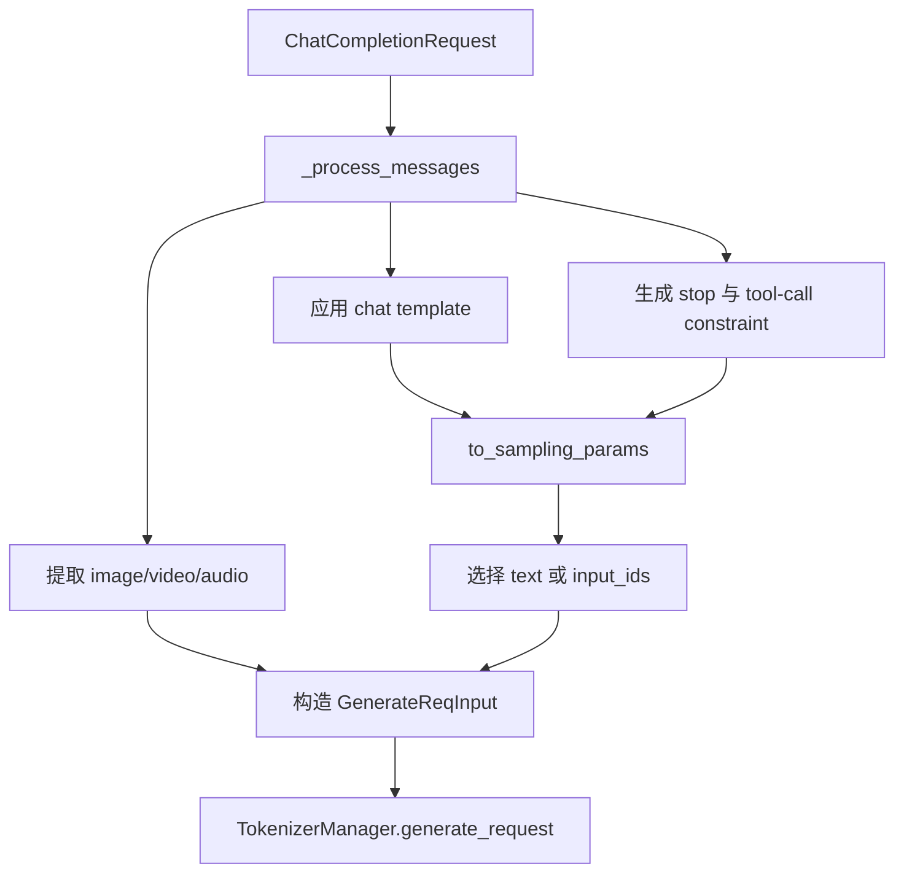
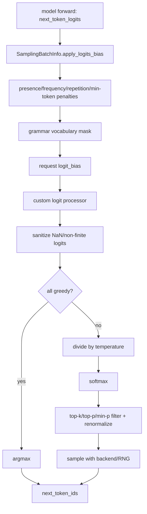

# 4.1 API、请求规范化与采样

本章不重复完整的 scheduler/GPU 调用链；那部分见 [1.2 进程拓扑与请求链路](../01_foundations/02_process_topology_and_request_path.md)。这里集中回答四个问题：OpenAI 请求在哪里变成内部对象，默认采样参数由谁决定，logits 到 token 的变换顺序是什么，以及 streaming/stop 为什么不能只当作返回格式。

## 1. 先看结论

一条 `/v1/chat/completions` 请求至少经历三种数据模型：

```text
ChatCompletionRequest
  -- chat template / tool constraint / protocol defaults -->
GenerateReqInput
  -- batch normalization / tokenize / SamplingParams normalize+verify -->
TokenizedGenerateReqInput
  -- scheduler admission / batching -->
Req + SamplingBatchInfo
```

它们的边界不能混淆：

- `ChatCompletionRequest` 表示外部协议语义；
- `GenerateReqInput` 是 HTTP、native API 和 offline engine 可以汇合的内部入口；
- `SamplingParams` 是单请求的已规范化采样配置；
- `SamplingBatchInfo` 把一批请求的温度、top-k/p、penalty、grammar mask 等整理成设备侧张量。

因此，“请求里写了什么”不能直接回答“GPU 最后用了什么”。调试必须记录规范化后的 prompt token IDs 和 sampling params。

## 2. OpenAI Chat 请求在哪里转换

### 2.1 公共处理骨架

`OpenAIServingBase.handle_request()` 提供公共模板：

1. `_validate_request()` 做协议级校验；
2. `_convert_to_internal_request()` 把协议对象转为内部对象；
3. 根据 `request.stream` 进入 streaming 或 non-streaming handler；
4. `ValueError` 映射为 400，其余未分类异常映射为 500。

Chat 实现在 `OpenAIServingChat._convert_to_internal_request()`：



`_process_messages()` 不只是拼字符串。它还处理：

- 默认和请求级 `chat_template_kwargs`；
- reasoning/thinking 开关；
- tool parser 与 tool-call grammar；
- 多模态消息中的 media 数据；
- 模板附带的 stop 字符串；
- `input_ids` 直通时跳过模板 tokenization 的特殊分支。

### 2.2 为什么 chat template 属于正确性状态

模板决定 role token、assistant generation prompt、工具描述和特殊 token。两个服务即使加载相同权重，只要 tokenizer revision、模板或 `chat_template_kwargs` 不同，输入 token 序列就可能不同。

对准确率或 RL rollout 做可复现记录时，至少保存：

- model/tokenizer revision；
- chat template 或其版本标识；
- `chat_template_kwargs`；
- 最终 prompt token IDs；
- 模板生成的 stop 条件。

只保存原始 `messages` 不能重放同一个模型输入。

### 2.3 `input_ids` 是否完全绕过消息处理

不是完全绕过。当前 Chat 路径在提供 `input_ids` 时跳过模板 tokenization，但仍调用 `_process_messages()`，以便得到 stop token/字符串和 tool-call constraint。随后 `_convert_to_internal_request()` 选择 `input_ids=processed_messages.prompt_ids`。

这意味着调用方承担 token IDs 与当前 tokenizer/model 匹配的责任，同时仍可能受到请求中的 stop/tool 约束影响。

## 3. Sampling 默认值到底来自哪里

`ChatCompletionRequest.to_sampling_params()` 明确实现以下优先级：

```text
请求显式值 > model generation_config > OpenAI/SGLang 默认值
```

其中代码内置的基础默认值为：

| 参数 | 默认值 |
|---|---:|
| `temperature` | `1.0` |
| `top_p` | `1.0` |
| `top_k` | `-1` |
| `min_p` | `0.0` |
| `repetition_penalty` | `1.0` |

`presence_penalty` 和 `frequency_penalty` 的协议字段默认是 `0.0`。`max_new_tokens` 来自 `max_completion_tokens or max_tokens`；这里使用 Python 的 `or`，所以需要特别注意值为 `0` 时的行为。

### 3.1 输出约束如何汇合

`to_sampling_params()` 会把不同协议形式统一为内部约束字段：

| 外部输入 | 内部效果 |
|---|---|
| `response_format.type=json_schema` | 序列化到 `json_schema` |
| `response_format.type=json_object` | 使用 `{"type": "object"}` |
| `response_format.type=structural_tag` | 序列化到 `structural_tag` |
| `regex` / `ebnf` | 原样进入采样参数 |
| tool-call constraint | 无其他约束时写入 grammar 相关字段 |

如果请求已经有 regex/EBNF/structural tag/JSON schema，再生成 tool-call constraint，当前代码会记录“不兼容”的 warning，而不是把两个 grammar 随意相交。

单请求的 `SamplingParams.verify()` 还明确限制 `regex`、`json_schema`、`ebnf` 最多一个非空。结构化输出不是响应层的 JSON 校验，而是在 decode 时形成 vocabulary mask，直接改变每一步可选 token。

## 4. `GenerateReqInput` 规范化解决什么问题

`TokenizerManager.generate_request()` 的第一步是：

```python
obj.normalize_batch_and_arguments()
```

这一层负责把非常宽松的 Python/API 输入整理为稳定形态：

1. 检查输入组合；
2. 判断 single 还是 batch；
3. 处理 `sampling_params.n` 的 parallel sampling；
4. 把标量参数广播或整理成逐请求列表；
5. 生成/展开 `rid`；
6. 检查同一批次内 `rid` 不重复。

### 4.1 `n > 1` 为什么会改变批语义

`_handle_parallel_sampling()` 读取 `sampling_params["n"]`。单输入且 `n > 1` 时，请求会先被转换为 batch 形态，随后为多个样本扩展输入、sampling params 和 request IDs。

因此 `n` 不是 sampler 在一个 logits 向量上简单抽若干 token；它会在请求生命周期和返回聚合层形成多个子请求。排查吞吐或 KV 占用时，应按展开后的有效请求数计算。

### 4.2 源码观察：输入“择一”校验没有想象中严格

`GenerateReqInput` 注释和报错意图是 `text`、`input_ids`、`input_embeds` 三选一。但当前 `_validate_inputs()` 只拒绝：

- 三者全是 `None`；
- 三者同时非 `None`。

它没有拒绝任意“两者同时非空”。后续 `_determine_batch_size()` 又按 `text` → `input_ids` → `input_embeds` 的顺序选择分支，并在前两个分支清空 `input_embeds`。所以客户端不要依赖这种模糊输入组合；服务端若要严格保证三选一，应补充 pairwise 校验和测试。

这是本快照的实现事实，不应在文档中写成“已严格验证 exactly one”。

## 5. `SamplingParams` 何时规范化和校验

请求在 tokenizer 侧构造 `SamplingParams` 后执行：

```text
SamplingParams.normalize(tokenizer)
SamplingParams.verify(vocab_size)
```

### 5.1 `normalize()`

主要做 tokenizer 相关的派生工作：

- 将单个 stop string/regex 统一为列表；
- 估算 stop string token 长度和 stop regex 最大缓冲长度；
- 当功能依赖 tokenizer、但服务以 skip-tokenizer 模式启动时抛错；
- 清掉 wire/API alias，保留内部规范化字段。

### 5.2 `verify()`

关键范围包括：

- `temperature` 有限且非负；
- `top_p` 位于 `(0, 1]`；
- `min_p` 位于 `[0, 1]`；
- penalty 范围合法；
- `min_new_tokens <= max_new_tokens`；
- `logit_bias` token ID 在 vocabulary 范围内；
- regex/JSON schema/EBNF 互斥。

### 5.3 `temperature=0` 实际怎样实现 greedy

`SamplingParams.__post_init__()` 对接近 0 的 temperature 做等价改写：

```text
temperature = 1.0
top_k = 1
```

`top_k=-1` 则被改为代表完整 vocabulary 的 `TOP_K_ALL`。所以设备侧看到的 temperature 未必还是用户请求中的 `0`；greedy 由 `top_k=1`/批级 `is_all_greedy` 表达。

## 6. 从 logits 到 next token 的准确顺序

普通非 speculative 路径的关键顺序是：



源码分布在两个层次：

- `ModelRunner._preprocess_logits()` 更新 grammar mask，并调用 `SamplingBatchInfo.apply_logits_bias()`；
- `Sampler._preprocess_logits()` 应用 custom logit processor，并清理非有限 logits；
- `Sampler.forward()` 选择 greedy、Ascend、RL deterministic 或标准概率采样分支。

### 6.1 penalty、grammar 和 logit bias

`SamplingBatchInfo.apply_logits_bias()` 的当前顺序为：

1. overlap 模式下应用预累计 additive/scaling penalties，或 non-overlap 下调用 penalizer orchestrator；
2. 应用 grammar vocabulary mask；
3. 加上请求级 `logit_bias`。

约束、penalty 和用户 bias 都在 temperature scaling 前作用于 logits。不要把它们理解成 softmax 后的概率修补。

### 6.2 top-k、top-p、min-p 的 backend 差异

标准路径先 temperature scaling 和 softmax，再交给 sampling backend：

- FlashInfer 在需要 `min_p` 时先做 top-k renormalization，再 top-p renormalization，再 min-p sampling；否则使用 joint top-k/top-p kernel；
- PyTorch fallback 使用自身的 top-k/top-p/min-p 实现；
- Ascend 有独立的 logits sampling 路径。

数学意图相近不意味着所有 backend 在浮点边界、RNG 和过滤顺序上 bitwise 相同。跨硬件或 backend 做可复现比较时，应比较 token IDs、最终规范化参数和 backend 配置，而不是只比较请求 JSON。

### 6.3 seed 能否保证全局完全复现

seed 是请求级采样状态，但可复现性还依赖：

- sampling backend 是否支持该 seed 路径；
- deterministic inference 配置；
- 模型/量化/硬件和 kernel；
- prompt tokens 与 batch position；
- speculative、TP 同步和浮点误差。

当前代码在 FlashInfer 的复杂采样分支对某些 seed 组合有明确断言限制。seed 应理解为采样器输入，不是跨所有运行环境的完整复现契约。

## 7. Stop、finish 和 streaming 为什么跨层

停止条件分为 token 级和文本级：

| 条件 | 主要判断位置 | 特点 |
|---|---|---|
| EOS / `stop_token_ids` | scheduler request 状态 | token 产生后即可判断 |
| `max_new_tokens` / context length | scheduler request 状态 | 形成 length finish reason |
| stop string | scheduler + detokenized tail | 需要处理跨 chunk 前缀 |
| stop regex | scheduler 的 decoded tail | 需要保留足够字符窗口 |
| grammar termination | grammar/request 状态 | 与 vocab mask 状态共同推进 |
| abort | TokenizerManager → scheduler | 形成 abort finish/清理路径 |

`Req.check_match_stop_str_prefix()` 会检查当前 tail 是否与 stop string 前缀重叠。Streaming 输出器据此暂缓发送可能属于 stop string 的尾部字符，避免先把半个 stop sequence 发给客户端、下一 chunk 才发现需要裁剪。

Detokenizer 还根据 `finished_reason.matched` 和 `no_stop_trim` 决定最终文本是否裁掉匹配内容。因此 streaming 不是简单地把非流式字符串切块；它持有增量 decode 和安全输出边界状态。

## 8. Streaming 与 non-streaming 应怎样比较

正确性测试至少比较：

- 输出 token IDs；
- 合并后的文本；
- `finish_reason` 和 `matched_stop`；
- usage 中 prompt/completion token 计数；
- tool/reasoning 字段；
- logprobs；
- abort/disconnect 后 `rid`、request slot、KV 是否释放。

“最终文本相同”仍可能掩盖 tokenization、stop trimming、usage 或 finish reason 错误。

## 9. 常见问题定位

### 9.1 参数明明传了但不生效

按以下边界逐层记录：

1. Pydantic 解析后的 `ChatCompletionRequest`；
2. `to_sampling_params()` 返回值；
3. `SamplingParams.normalize()/verify()` 后的字段；
4. `SamplingBatchInfo` 对应行的设备张量；
5. 实际 sampling backend 分支。

如果第 1 层就不同，问题在协议/客户端；第 2～3 层不同，问题在默认值或规范化；第 4～5 层不同，才进入 runtime/sampler 排查。

### 9.2 JSON schema 输出不合法

先区分三类问题：schema 没有成功转换为 grammar、grammar mask 没有随请求推进、文本 parser/stop 在协议返回阶段处理错误。不要只在返回 JSON 上加重试而跳过 token mask 检查。

### 9.3 固定 seed 仍不同

确认 prompt token IDs、sampling backend、greedy 改写、TP/DP、speculative、模型权重版本和 CUDA/kernel 是否一致。连续 batching 本身不应成为模糊解释；应继续定位具体共享状态或数值分支。

### 9.4 首个 streaming chunk 很慢

先拆成 queue、tokenization/media processing、prefill、首 token detokenize 和安全 stop-prefix buffering。只有最后一项属于 streaming 文本边界，其余通常是请求前半程或 GPU TTFT。

## 10. 最小测试矩阵

| 维度 | 用例 |
|---|---|
| 输入 | `messages`、`input_ids`、非法组合、空输入、超长输入 |
| 批语义 | single、batch、`n > 1`、重复 `rid` |
| 采样 | greedy、temperature、top-k/p/min-p、固定 seed、penalties、logit bias |
| 约束 | regex、JSON schema、tool call、冲突约束、非法 schema |
| 结束 | EOS、stop token、跨 chunk stop string、stop regex、max tokens、abort |
| 返回 | streaming/non-streaming、logprobs、usage、token IDs、reasoning/tool fields |

## 11. 源码定位

以下路径相对 `sglang/python/sglang/`：

| 主题 | 路径与符号 |
|---|---|
| OpenAI 协议对象与默认值 | `srt/entrypoints/openai/protocol.py`：`ChatCompletionRequest`、`to_sampling_params()` |
| OpenAI 公共入口 | `srt/entrypoints/openai/serving_base.py`：`OpenAIServingBase.handle_request()` |
| Chat 转换 | `srt/entrypoints/openai/serving_chat.py`：`_convert_to_internal_request()`、`_process_messages()` |
| 内部请求规范化 | `srt/managers/io_struct.py`：`GenerateReqInput` |
| 请求进入 tokenizer manager | `srt/managers/tokenizer_manager.py`：`generate_request()`、`_tokenize_one_request()` |
| 单请求采样参数 | `srt/sampling/sampling_params.py`：`SamplingParams` |
| 批级采样状态 | `srt/sampling/sampling_batch_info.py`：`SamplingBatchInfo` |
| logits 预处理 | `srt/model_executor/model_runner.py`：`_preprocess_logits()`、`sample()` |
| 设备采样 | `srt/layers/sampler.py`：`Sampler.forward()` |
| stop/finish 状态 | `srt/managers/schedule_batch.py`：`Req` 的 finish 检查方法 |
| streaming 安全边界 | `srt/managers/scheduler_components/output_streamer.py` |
| stop trimming | `srt/managers/detokenizer_manager.py` |

## 12. 与其他章节的边界

- scheduler 如何 admission 和 continuous batching：见 [2.1](../02_runtime_core/01_scheduler_and_batch.md)；
- grammar backend 和 speculative：见 [2.4](../02_runtime_core/04_speculative_structured_sampling.md)；
- 完整跨进程返回、abort 和 disconnect：见 [1.2](../01_foundations/02_process_topology_and_request_path.md)；
- 多模态 prompt 的进一步改写：见 [4.2](02_model_support_and_multimodal.md)。
