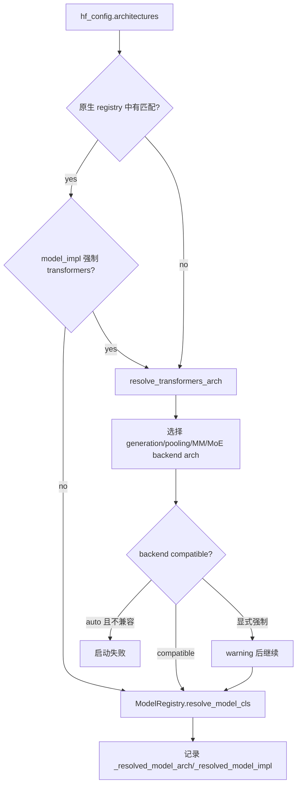
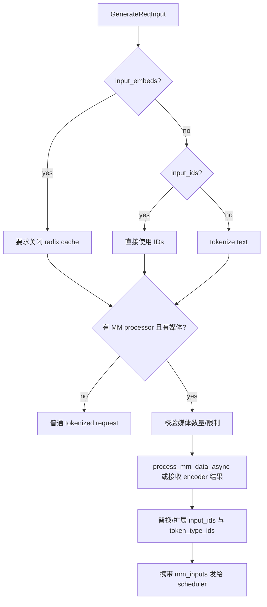

# 4.2 模型支持、多模态与 Transformers Fallback

“SGLang 支持这个模型吗”不是一个布尔问题。至少要分别回答：配置能否识别、最终选择哪个实现、权重能否映射、forward 是否适配 runtime、任务输出是否正确，以及高级优化是否兼容。本章沿着这些决策点阅读代码。

## 1. 先看结论：模型支持是六层能力矩阵

| 层次 | 要验证的问题 | 典型失败 |
|---|---|---|
| Config | `architectures`、task、dtype、quantization 能否识别 | 启动期配置错误 |
| Registry | 选择 SGLang 原生类还是 Transformers backend | fallback 与预期不符 |
| Weight loader | name/shape/shard/quantized weight 是否匹配 | missing/unexpected weight、静默错权重 |
| Forward contract | attention、position、KV、multimodal inputs 是否对齐 | shape 错、首 token 错、decode 错 |
| Task contract | generate/embedding/rerank/classify 输出语义 | shape 或 score 语义错误 |
| Optimization | TP、quantization、CUDA Graph、LoRA、speculative 是否可用 | 能跑但慢，或高级路径崩溃 |

模型被 Hugging Face `AutoModel` 加载成功，只覆盖其中一部分。

## 2. 模型类如何注册

入口是 `srt/models/registry.py` 中的 `_ModelRegistry`。

### 2.1 原生模型如何被发现

启动导入时执行：

```python
ModelRegistry = _ModelRegistry()
ModelRegistry.register("sglang.srt.models")
```

`import_model_classes()` 遍历 package 下的 Python module。模块如果暴露 `EntryClass`，就以类名作为 architecture key 注册；`EntryClass` 也可以是多个类的列表。

因此接入一个原生模型的关键不是仅创建 `model_xxx.py`，还要：

- 暴露正确的 `EntryClass`；
- 类名与 HF config `architectures` 对得上；
- module import 不因可选依赖报错；
- 多类注册不发生同名冲突。

默认注册是非 strict：某个模型 module import 失败会记录 warning 并跳过。结果可能表现为“源码里明明有这个类，但 registry 里没有”。排查时要看启动日志，而不能只 `rg` 类名。

### 2.2 外部模型包如何覆盖

环境变量 `SGLANG_EXTERNAL_MODEL_PACKAGE` 指向的 package 会在内置模型后注册，并使用 `overwrite=True`。这允许外部实现覆盖同名 architecture，也意味着部署环境中的 registry 结果可能与纯仓库源码不同。

记录可复现配置时，应包含该环境变量和外部 package 版本。

## 3. 原生实现和 Transformers fallback 如何决策

核心入口是 `srt/model_loader/utils.py:get_model_architecture()`：



`ModelRegistry._normalize_archs()` 会保留已原生支持的 architecture；只要原始列表里存在不支持项，就把 `TransformersForCausalLM` 放到最后作为候选 fallback。`resolve_model_cls()` 依次取第一个能解析的类。

### 3.1 Fallback 不是一个单一的 causal LM 类

`resolve_transformers_arch()` 会根据 model/task 特征选择 backend architecture，至少区分：

- generation 与 pooling；
- text-only 与 multimodal；
- 普通 dense 与 MoE；
- Hugging Face 本地/remote dynamic module；
- attention backend compatibility。

所以排查时应打印最终 `_resolved_model_arch` 和 `_resolved_model_impl`，不要只看 config 中原始的 `architectures`。

### 3.2 auto 与显式 transformers 的失败语义不同

当原生实现缺失且 Transformers 实现声明不兼容 SGLang backend 时：

- `model_impl=auto` 会拒绝继续；
- 用户显式选择 Transformers 时，代码可能记录“可能无法正确工作”的 warning 后继续。

显式强制代表用户接受风险，不代表 runtime 自动获得兼容性。上线前仍需验证 attention/KV、batch、长上下文和数值结果。

## 4. 如何确认实际加载的是哪个模型类

建议按以下顺序查：

1. 查看 HF config 的 `architectures`；
2. 查看启动参数 `model_impl`、task、quantization；
3. 在 `ModelRegistry.get_supported_archs()` 中确认原生注册；
4. 调用链跟到 `get_model_architecture()`；
5. 记录 `model_config._resolved_model_arch` 与 `_resolved_model_impl`；
6. 查看模型类自己的 `load_weights()` 和 forward 方法。

只依据文件名判断很容易忽略量化特例、fallback 或外部覆盖。

## 5. 一个新原生模型需要满足哪些 runtime contract

具体基类随模型变化，但工程上至少核对：

### 5.1 配置与层结构

- hidden size、head 数、KV head 数、rope 参数；
- tied embedding/lm head；
- MoE expert 数、router 和 expert parallel 规则；
- sliding window、cross attention 或特殊 position encoding。

### 5.2 权重加载

- HF name 到 runtime parameter name 的映射；
- QKV/gate-up 等 packed parameter；
- TP rank 对应 shard；
- replicated parameter；
- quantization scale/zero-point；
- 缺失或多余权重的处理。

最危险的问题不是立即抛错，而是 shape 恰好兼容、语义却映射错误。因此应与参考实现做逐层或 logits 对齐。

### 5.3 Forward contract

模型 forward 需要正确消费 runtime 提供的：

- flattened token representation；
- positions 与 forward mode；
- attention/KV 元数据；
- multimodal embeddings 或其他 override；
- TP/PP 中间张量；
- pooling 或 logits processor 所需输出。

验证不能只跑一条 prefill。至少覆盖 prefill、单步 decode、continuous batch 中请求加入/退出、prefix cache hit 和 context boundary。

## 6. 多模态请求在 tokenizer 侧发生什么

多模态不是“把图片附在 request 上，模型 forward 自己读取 URL”。URL/bytes 解码、processor、placeholder 扩展和特征传输在进入 model forward 前已经形成一条独立流水线。

### 6.1 初始化

`TokenizerManager.init_tokenizer_and_processor()` 在 `model_config.is_multimodal` 时：

1. 注册内置 multimodal processors；
2. 可通过 `SGLANG_EXTERNAL_MM_PROCESSOR_PACKAGE` 注册外部 processor；
3. 创建 HF processor wrapper；
4. 根据配置决定 tensor transport mode；
5. `get_mm_processor()` 选择模型专用 processor；
6. 非 skip-tokenizer 模式从 processor 取得 tokenizer。

processor 与模型类类似，也有 registry/外部覆盖和模型特化，不是所有 VLM 共享一个通用实现。

### 6.2 单请求 tokenization

`TokenizerManager._tokenize_one_request()` 的关键分支为：



对 audio-only 模型，初始 text 甚至可以为空，后续由 multimodal processor 提供 `input_ids`。

### 6.3 processor 做了什么

`BaseMultimodalProcessor` 把工作拆为不同资源池：

- IO executor：URL/base64/file 的加载、image/video/audio decode；
- processor executor：HF processor 或模型专用处理；
- CPU process pool：适合单独进程执行的 CPU 工作。

输入还可以是已经处理好的 `processor_output` 或 `precomputed_embedding`。这会跳过部分加载/处理，但调用方必须保证格式、dtype、shape 和模型版本正确。

`process_mm_data_async()` 由模型专用 processor 实现，典型输出同时包含：

- 展开后的 `input_ids`；
- image/video/audio feature tensors；
- 每个媒体 item 的位置、grid/size/hash 等元数据；
- 某些模型需要的 token type 或 M-RoPE positions。

## 7. 为什么媒体会改变 prompt token 数

消息模板中的 `<image>` 一类占位符通常只是逻辑标记。processor 根据图片尺寸、patch 数、frame 数等把它扩成模型需要的 placeholder token 区间，并生成相应 features。

因此下面三个长度可能不同：

```text
原始消息字符长度
!= 文本 tokenizer 初次得到的 token 长度
!= multimodal processor 扩展后的 origin_input_ids 长度
```

context length、prefill 成本和 KV 占用必须按最终扩展长度估算。

Scheduler 的 `_try_apply_padded_mm_input_ids()` 会在 processor 已给出 `padded_input_ids` 且长度条件吻合时替换对应 token 区间；`_maybe_compute_mrope_positions()` 为缺失的多模态位置编码补算。之后才进入普通 admission/context 检查。

## 8. 多模态状态如何进入 GPU batch

processor 侧输出先包装成 `MultimodalInputs`。构造 `ForwardBatch` 时，每个请求的 `mm_inputs` 被收集，`ForwardBatch.merge_mm_inputs()` 过滤空项并合并有效媒体 item。

概念上模型收到两条对齐的数据：

```text
token path:    padded/expanded input_ids + positions
feature path:  pixel/audio/video/precomputed features + item metadata
                         | 对齐到 placeholder 区间 |
```

模型实现负责在正确 token 位置注入 encoder 结果或 embeddings。placeholder 数量、feature 数量和 position metadata 任一不一致，都会形成 shape 或语义错误。

### 8.1 多模态缓存 key 为什么需要媒体 hash

只有文本 token 不能区分“同一 prompt、不同图片”。`GenerateReqInput.mm_hashes` 和 processor 生成的媒体 hash/pad value 用于让 prefix/cache key 纳入媒体内容。外部 router 若自己计算 hash，需要与 SGLang 产生相同的 namespace/key 语义，否则会路由到错误前缀或降低命中率。

## 9. 多模态性能应该拆成哪几段

至少分开记录：

```text
media fetch
→ decode
→ processor/resize/tiling
→ encoder
→ feature transfer
→ LLM prefill
→ LLM decode
```

总 TTFT 变慢不能直接归因于 scheduler：

- URL 慢通常在 IO；
- CPU resize/tiling 饱和在 processor；
- image patch 数变多会同时放大 encoder 和 LLM prefill；
- encoder disaggregation 会增加传输/等待；
- LLM decode 慢才更接近文本模型常规路径。

多模态 encoder 的 DP/CUDA Graph 与 LLM continuous batching 是不同优化面，应分别验证 shape 集合、batching 和 graph capture 命中。

## 10. Generation、Embedding、Rerank、Classify 怎样分流

这些任务共享 TokenizerManager、scheduler 和部分 model executor 基础设施，但协议转换和结果语义不同。

### 10.1 Embedding

`OpenAIServingEmbedding._convert_to_internal_request()` 将字符串、token IDs 或 multimodal embedding 输入转换成 `EmbeddingReqInput`。多模态 embedding 也可能应用 conversation/Jinja template，再携带 image/video 数据进入 processor。

Scheduler 走 embedding request handler，模型 forward 后输出 pooling 结果而不是 next-token sampling。客户端需要验证向量维度、pooling、归一化和 batch 顺序。

### 10.2 Classification / reward

`OpenAIServingClassify` 同样使用 `EmbeddingReqInput` 进入底层执行，但响应层根据 model config 的 `id2label` 解释输出。服务初始化时缺少 `id2label` 会失败。

这说明“底层复用 pooling forward”和“外部 task 语义相同”是两回事。

### 10.3 Rerank

Rerank 至少有三条路径：

- multimodal decoder-only reranker；
- text decoder-only reranker；
- cross-encoder reranker。

`OpenAIServingRerank._convert_to_internal_request()` 对 cross-encoder 把 query 和每个 document 展开为 `[query, document]` pair，并设置 `is_cross_encoder_request=True`；tokenizer 由此请求 `token_type_ids`。Decoder-only reranker 则保留原请求，按 yes/no 等 token score 路径处理。

所以 rerank 的有效 batch size 通常是 document 数，而不是 API request 数。

## 11. 新模型接入的验证顺序

建议从最小正确性逐层打开能力：

1. 固定 revision、dtype，关闭量化、graph、speculative、LoRA；
2. 确认 resolved architecture 与 model implementation；
3. 单条短 prompt 对齐 reference logits 或 task output；
4. 分别对齐 prefill 最后位置和逐步 decode；
5. 验证 batch、不同长度、prefix hit 和长上下文；
6. VLM 验证不同分辨率、图片数、video/audio 和 placeholder；
7. 再逐一打开 TP/EP/PP、量化、CUDA Graph、LoRA、speculative；
8. 最后跑 serving accuracy 和真实 workload benchmark。

每打开一个高级功能，只改变一个变量，避免“原生实现、量化、TP、graph 同时开启”后无法归因。

## 12. 常见问题定位

### 12.1 源码里有模型类，启动却 fallback

检查 module import warning、`EntryClass`、architecture 类名、`SGLANG_DISABLED_MODEL_ARCHS`、外部 package 覆盖，以及 `model_impl` 是否强制 Transformers。

### 12.2 Prefill 正常，decode 开始错

优先检查 KV head/shard、position 更新、attention backend metadata、sliding window、CUDA Graph replay shape。单次 full-sequence reference forward 无法覆盖这些状态。

### 12.3 VLM 文本正确，换图片输出几乎不变

检查 media 是否真的下载/解码、placeholder 是否扩展、features 是否进入 `MultimodalInputs`、hash/cache key 是否区分媒体，以及模型层是否在相应位置注入 embeddings。

### 12.4 Rerank 分数与 reference 不一致

先确认走 cross-encoder 还是 decoder-only；再对齐 template、pair tokenization、`token_type_ids`、截断方向、score token/pooling 和输出归一化。

## 13. 源码定位

以下路径相对 `sglang/python/sglang/`：

| 主题 | 路径与符号 |
|---|---|
| 模型注册 | `srt/models/registry.py`：`_ModelRegistry`、`ModelRegistry` |
| architecture/fallback 决策 | `srt/model_loader/utils.py`：`get_model_architecture()`、`resolve_transformers_arch()` |
| 模型配置 | `srt/configs/model_config.py` |
| 模型实现 | `srt/models/` 下各 module 的 `EntryClass` |
| tokenizer/processor 初始化 | `srt/managers/tokenizer_manager.py`：`init_tokenizer_and_processor()` |
| 多模态请求入口 | 同文件：`_tokenize_one_request()` |
| processor 基类 | `srt/multimodal/processors/base_processor.py`：`BaseMultimodalProcessor` |
| 多模态数据对象 | `srt/managers/schedule_batch.py`：`MultimodalProcessorOutput`、`MultimodalInputs` |
| scheduler 媒体处理 | `srt/managers/scheduler.py`：`_get_multimodal_inputs()` 等 |
| GPU batch 合并 | `srt/model_executor/forward_batch_info.py`：`merge_mm_inputs()` |
| embedding API | `srt/entrypoints/openai/serving_embedding.py` |
| classify API | `srt/entrypoints/openai/serving_classify.py` |
| rerank API | `srt/entrypoints/openai/serving_rerank.py` |

## 14. 与其他章节的边界

- HTTP/TokenizerManager/Scheduler 完整流转见 [1.2](../01_foundations/02_process_topology_and_request_path.md)；
- ModelRunner、attention 和 CUDA Graph 见 [2.3](../02_runtime_core/03_model_runner_attention_cuda_graph.md)；
- API 参数和 sampling 见 [4.1](01_api_request_and_sampling.md)；
- 生产测试与观测见 [5.1](../05_production_engineering/01_benchmark_profiling_observability.md) 和 [5.2](../05_production_engineering/02_extension_and_correctness.md)。
