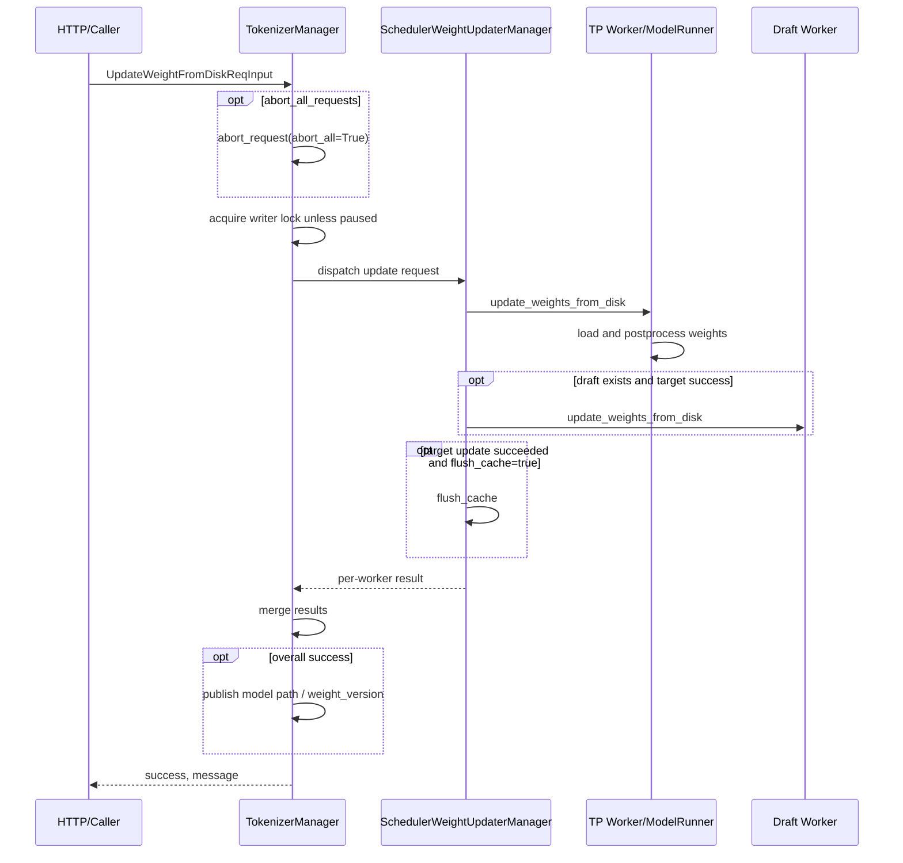
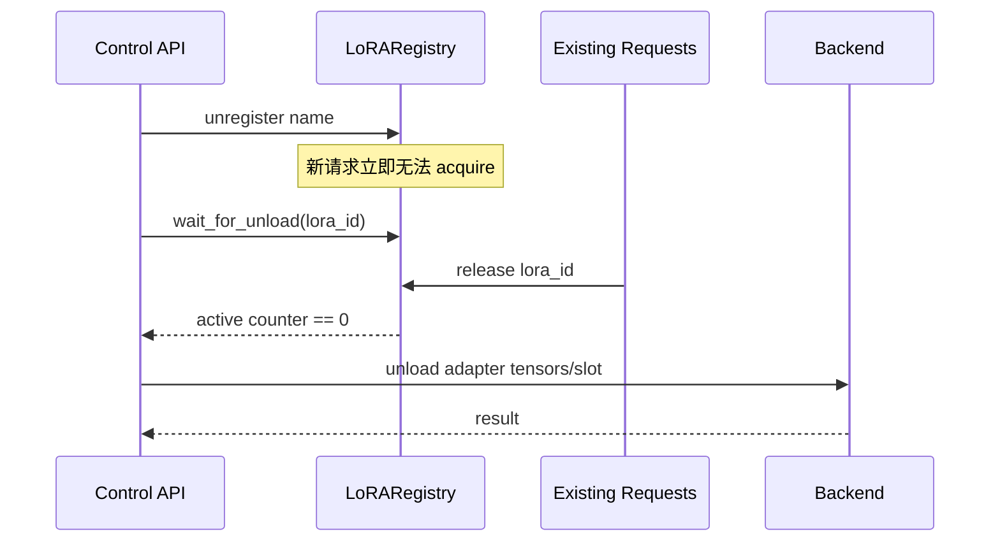

# 4.3 控制面、在线权重更新与后训练

控制面请求会改变整个服务的共享状态，不能按普通 inference request 理解。本章重点回答：换权时在途请求怎样隔离、哪些路径能回滚、KV/Graph 为什么要失效、LoRA 如何安全上下线，以及 RL 系统应如何建立 policy version 闭环。

## 1. 先纠正三个常见误解

### 误解一：控制面 API 成功返回，就等于跨 rank 事务提交

不是。当前实现会汇总 worker 结果，并只在总体成功后更新 tokenizer 侧 `weight_version`；但 distributed/tensor/IPC 更新没有统一的跨 rank rollback 协议。某些 rank 或某些参数已经写入后发生异常，进程可能处于部分更新状态。

### 误解二：拿到 writer lock，就保证所有权重原子切换

writer lock 主要保证请求隔离：更新与 inference request 不并发。它不自动为多个 GPU 上的参数写入提供 undo log、双 buffer 或 two-phase commit。

### 误解三：更新权重后只需要改版本号

权重决定 KV 的语义，部分派生 buffer、draft model 和 CUDA Graph 也可能依赖权重/模型状态。默认换权请求会 flush cache，但 CUDA Graph 只有在对应参数要求且路径支持时才 recapture。

## 2. 控制面入口有哪些

HTTP 路由集中在 `srt/entrypoints/http_server.py`，常见操作包括：

| 操作 | 影响的共享状态 |
|---|---|
| health/readiness/server info | 暴露进程与服务状态，本身通常只读 |
| pause/continue generation | 新请求 admission、scheduler 执行 |
| flush cache | radix/tree cache、request/token pool、grammar、draft cache |
| update weights from disk | 主模型/可选 draft、model path、weight version |
| update weights from distributed/tensor/IPC | 一个或多个 rank 的参数、weight version |
| load/unload LoRA | adapter registry、backend LoRA slots、cache namespace |
| release/resume memory occupation | 权重、KV、graph 等显存状态 |

入口层只负责协议和调用；真正的状态更新跨越 TokenizerManager、scheduler 和 TP worker/ModelRunner。

## 3. 普通 inference 如何与换权隔离

关键机制是 `TokenizerManager.model_update_lock`，一个异步读写锁。

### 3.1 inference 持有 reader lock 多久

`TokenizerManager.generate_request()` 的结构是：

```text
normalize request
→ 建立 rid_to_state
→ 等待非 pause
→ acquire model_update_lock.reader_lock
   → 解析/占用 LoRA
   → tokenize
   → 发给 scheduler
   → 等待并 yield 所有 response
→ release reader lock
```

reader lock 覆盖的不只是入队瞬间，而是请求的 tokenization、scheduler 执行和 response 等待过程。因此正常换权请求取得 writer lock 前，会等待已经进入该区域的 inference 完成；writer 持有期间，新 inference 也无法进入。

这提供了重要的**单请求版本隔离**：正常路径中的一个请求不会在生成一半时被原地换权。

### 3.2 pause 与锁如何配合

`pause_generation()` 先把 `is_pause=True`，新请求在 condition variable 上等待。

- 非 abort mode：把 pause 请求发给 scheduler；
- abort mode：反复触发 abort-all，直到 `model_update_lock` 不再被 reader 持有。

换权函数发现服务已经 paused 时，可跳过重复获取 writer lock；调用者负责保持 pause，避免新请求重新进入。代码中部分路径会在持有 `is_pause_cond` 时更新，以避免 unpause race。

### 3.3 `abort_all_requests` 的实际语义

disk/distributed/tensor request 可要求先 abort 全部请求。它会加速从旧版本清空请求，但 abort 本身仍需经过异步调度和资源回收。不能在发出 abort 后立刻假设所有 GPU work、KV 和 reader lock 已经消失；后续 writer lock/idle 检查才构成真正的同步边界。

## 4. 从磁盘更新权重的完整链路



### 4.1 源码观察：磁盘路径的“rollback”提示不能当成回滚保证

ModelRunner 的 disk updater 直接把新权重 load 到现有 model。更关键的是，它在加载前先执行：

```python
self.model_config.model_path = model_path
```

若 `load_weights_and_postprocess()` 抛异常，异常分支虽然返回 `Rolling back to original weights`，但它再次调用的是 `get_weight_iter(self.model_config)`；此时 `self.model_config.model_path` 已经是**新路径**。当前函数没有保存旧 model path，也没有旧参数副本或 undo log。

所以从这段代码本身只能得出：它会从当前已改成新路径的 config 再尝试加载一次；不能证明它重新加载了旧 checkpoint。这段日志文案比实际机制更强，是一个需要特别警惕的源码边界。

即使未来修正为旧路径重载，它仍只是本地、best-effort 恢复，而非全局事务：

- 已经更新的其他 rank 如何处理，仍取决于各自执行结果；
- 二次加载自身也可能失败；
- target 和 draft 的成功边界不同；
- TokenizerManager 的聚合只判断结果，不持有跨 worker undo log。

生产层在 disk update 返回失败时，应把实例视为权重状态未知，退出 ready 并重建/完整校验，而不是相信该日志继续接流量。

### 4.2 model path 和 version 什么时候发布

TokenizerManager 只有在收到总体成功后才更新 tokenizer 侧 model path 信息；提供 `weight_version` 时也只在 success 后发布。

这保证“控制面元数据不会主动宣布一个明确失败的版本”，但不能反推底层所有参数一定处于旧版本：底层可能已经部分写入而最终聚合失败。

## 5. Distributed、Tensor、IPC 三条路径的差异

| 路径 | 数据来源 | 关键实现 | 失败边界 |
|---|---|---|---|
| distributed | 自定义 process group broadcast | `update_weights_from_distributed()` | 逐 tensor 接收/加载后可能部分更新 |
| tensor | IPC 序列化 named tensors | `update_weights_from_tensor()` | loader 抛错前可能已写入部分参数 |
| IPC | checkpoint-engine 的 ZMQ/CUDA IPC handles | `update_weights_from_ipc()` | extension 内部更新，无通用 rollback |

三类请求默认 `flush_cache=True`；distributed/tensor 也支持 `abort_all_requests`，IPC request 当前没有该字段。

### 5.1 Distributed 路径明确承认部分更新

ModelRunner distributed updater 逐项分配 tensor、broadcast，最后调用模型 `load_weights()`。异常消息明确写出：full weights may be partially updated，并要求 discard whole weights。

因此文档和调用方都不能声称它是 all-or-none。若训练系统要求强一致发布，需要在 SGLang 外或新实现中增加：

- staging/double-buffer；
- 全 rank 校验；
- commit barrier；
- 失败后的进程隔离或确定性重载。

### 5.2 Fan-out 聚合做什么、不做什么

Tokenizer control mixin 通过 communicator 向 worker/DP fan-out，再用 `FanOutCommunicator.merge_results()` 合并 success/message。它解决“收齐结果并决定是否发布版本号”，但没有实现“任何 worker 失败就撤销其他 worker 已写参数”。

### 5.3 Tensor 与 draft model 的选择

Scheduler 的 tensor update 根据 `disable_draft_model` 选择 target worker 或 draft worker；具体语义需要结合调用者用途检查。不要默认一次 tensor update 总是同时更新 target 和 draft。

Disk 和 IPC 路径在 target 成功且存在 draft worker 时会继续更新 draft；最终 success 可能反映后一步结果，但 cache flush 条件又基于 target success。对 speculative 部署要单独验证 target/draft version 配对。

## 6. 为什么换权后要 flush cache

KV cache 是旧权重对历史 token 计算出的派生状态。权重改变后，即使 token IDs 完全相同，旧 KV 通常也不再代表新模型。

各 update request 的 `flush_cache` 默认是 `True`。`SchedulerWeightUpdaterManager.flush_cache_after_weight_update()` 在成功后调用 scheduler flush，并断言成功。

### 6.1 flush 的前置条件

`Scheduler.flush_cache()` 只有在 `is_fully_idle()` 时才执行。成功后清理：

- tree/radix cache；
- request-to-token pool；
- token-to-KV allocator；
- grammar manager；
- runtime metrics；
- draft worker cache pool；
- 可选的 device allocator cache。

非 idle 时返回失败并记录 waiting/running request 数。换权持有请求隔离锁的目的之一，就是让 flush 能在没有在途 inference 的状态下完成。

### 6.2 独立 flush API 的 deferred 模式

`SchedulerFlushWrapper` 支持：

- `timeout_s <= 0`：立即尝试；非 idle 就失败；
- `timeout_s > 0`：非 idle 时登记一个 pending flush，scheduler 之后在 idle 时执行；
- 超时：返回失败；
- 同时已有 pending flush：拒绝第二个请求。

这不是“强制删除仍被请求引用的 KV”，而是等待安全时机。

### 6.3 `flush_cache=False` 的风险

关闭 flush 只有在调用者能证明缓存与更新后权重语义兼容时才安全。普通 RL policy 更新通常不满足这个条件。仅因为参数名只更新了一部分，也不能自动证明所有历史 KV 可复用。

## 7. CUDA Graph 和其他派生状态

Disk update request 有 `recapture_cuda_graph`，ModelRunner 只在该值为真且设备支持时 recapture。默认值是 `False`。

因此正确说法是：

- cache 默认失效；
- graph **不会无条件重抓**；
- 是否必须重抓取决于更新是否改变 graph 捕获依赖的参数地址、shape 或派生 buffer；
- 量化 scales、derived weight cache、draft state 等需要各自检查实现。

当 `weight_cache_mode != off` 时，ModelRunner 明确拒绝原地换权/部分内存操作，因为参数可能是通过 CUDA IPC 与 daemon/其他实例共享的 master copy。绕过该检查会同时污染所有共享者。

## 8. `weight_version` 能保证什么

`weight_version` 是控制面发布和请求追踪所需的元数据。当前换权函数只在 success 后调用 `_update_weight_version_if_provided()`。

它能帮助回答：

- 这条请求被服务声明为哪个 policy version；
- trainer 发来的版本是否按预期前进；
- rollout 数据能否按版本过滤。

它不能单独证明：

- 每个 rank 参数 checksum 一致；
- 失败前没有部分写入；
- tokenizer/chat template 同步更新；
- draft model 与 target model 配套；
- cache/graph 全部符合新版本。

版本号必须与 readback/checksum、health 和部署状态结合使用。

## 9. LoRA 动态加载为什么是另一套协议

LoRA 不替换整个 base model，而是在共享模型上管理多个 adapter。其并发安全由 tokenizer 进程中的 `LoRARegistry` 和 backend adapter slots 协同完成。

### 9.1 `LoRARef` 为什么需要独立 `lora_id`

`LoRARef` 包含 name、path、pinned 和唯一 ID。动态加载默认生成新 UUID；启动参数中的 adapter 可由 name/path 生成跨节点稳定 ID。

ID 的意义是：即使复用相同 name/path，新旧 adapter incarnation 仍可区分，并可进入 radix/cache namespace。只用可复用的 adapter name 做 cache key 容易命中新旧权重混合的前缀。

### 9.2 请求如何取得和释放 LoRA 所有权

`LoRARegistry.acquire(name)`：

1. 在 registry lock 下查找 adapter，并更新 LRU 顺序；
2. 得到 `lora_id`；
3. 增加该 ID 的在途请求计数。

请求结束后 `release(lora_id)` 递减计数。计数与 registry lock 分离，使普通请求不需要在整个推理期间持有 registry writer lock。

### 9.3 Load 是“backend first，publish second”

动态 load 在 `lora_update_lock` 下串行执行：

```text
创建新的 LoRARef/lora_id
→ backend scheduler/worker load
→ backend success
→ register 到 LoRARegistry
→ 新请求才可以查到
```

如果 backend load 失败，registry 不发布该 adapter。这避免请求查到一个尚未在 backend 安装完成的 ID。

### 9.4 Unload 是“unpublish，drain，backend free”

卸载顺序相反：



这是一套真正与 request ownership 对齐的两阶段退役协议：先停止新引用，再等旧引用归零，最后释放 backend 资源。

### 9.5 LRU 和 pinned

当 `max_loaded_loras` 超限，load 路径选择未 pinned 的 least-recently-used adapter，并复用上述安全 unload 流程。若全部可选 adapter 都 pinned，则无法找到 eviction victim，load 返回错误。

当前动态 LoRA load/unload 代码还明确限制 `dp_size == 1`。不要仅因为 registry 设计支持并发，就推断动态操作已经覆盖所有 DP 拓扑。

## 10. RL / 后训练闭环怎样建立

```text
policy version N
→ rollout request acquire reader/version
→ prompt tokens + generated tokens + sampling behavior
→ rewards/advantages
→ optimizer step
→ transfer/load candidate N+1
→ drain or abort old requests
→ update + cache invalidation + validation
→ publish version N+1
```

### 10.1 每条 rollout 至少记录什么

| 类别 | 字段 |
|---|---|
| Model | base checkpoint、weight version、LoRA ID、draft version |
| Input | tokenizer/template revision、prompt token IDs、media hash |
| Sampling | normalize 后的 params、seed、backend、grammar |
| Output | token IDs、logprobs、finish/abort reason、截断 |
| Timing | enqueue、prefill、decode、weight-update window |

训练通常消费 token/logprob，而不是最终字符串。只记录文本会丢失 tokenizer 和 stop trimming 信息。

### 10.2 on-policy 边界

reader/writer lock 能防止单个正常请求跨换权，但训练 batch 是否混入 N 与 N+1 是上层数据管道问题。必须按返回的 version/metadata 分组或过滤，并在 timeout/retry 后重新确认请求实际服务版本。

### 10.3 安全发布建议

当前源码不提供所有更新路径的全局事务时，生产系统应把换权当作一次部署事件：

1. pause 新流量；
2. drain 或显式 abort 旧请求；
3. 更新所有目标 rank；
4. flush 旧派生 cache；
5. 做 checksum/小样本 inference/health 验证；
6. 只在全体通过后向 router 发布 ready；
7. 任一不确定失败则隔离并重建实例。

这是生产建议，不是当前 SGLang API 自动完成的完整协议。

## 11. 故障矩阵

| 故障点 | 当前可观察结果 | 安全动作 |
|---|---|---|
| writer lock 等待很久 | 旧 inference 未完成/未释放 | 查 active `rid`、abort/disconnect 清理 |
| disk load 单 rank 失败 | 返回失败；当前“rollback”分支仍使用已改成新路径的 config | 将状态视为未知，退出 ready 并重建实例 |
| distributed 中途失败 | 错误明确提示部分更新 | 立即退出 ready，丢弃/重建权重 |
| flush cache 失败 | scheduler 非 fully idle 或并发 flush | 查 waiting/running，等待 idle 后重试 |
| version 未变化 | 总体 update 未成功或未传 version | 不要仅手工改元数据掩盖失败 |
| draft 更新失败 | target 可能已更新 | 隔离 speculative 实例，成对重建/校验 |
| LoRA load backend 失败 | registry 不发布新 adapter | 修复权重/path 后重试 |
| LoRA unload 卡住 | 仍有 request counter 未归零 | 定位持有该 `lora_id` 的在途请求 |
| weight cache mode 拒绝换权 | CUDA IPC master copy 正共享 | 以 `weight-cache-mode off` 的隔离实例执行 |

## 12. 源码定位

以下路径相对 `sglang/python/sglang/`：

| 主题 | 路径与符号 |
|---|---|
| HTTP 控制面路由 | `srt/entrypoints/http_server.py` |
| 请求/response structs 与默认值 | `srt/managers/io_struct.py`：`UpdateWeight*ReqInput` |
| inference reader lock、disk update、pause | `srt/managers/tokenizer_manager.py`：`generate_request()`、`pause_generation()`、`update_weights_from_disk()` |
| distributed/tensor/IPC/LoRA 控制 | `srt/managers/tokenizer_control_mixin.py` |
| scheduler 换权协调 | `srt/managers/scheduler_components/weight_updater.py`：`SchedulerWeightUpdaterManager` |
| ModelRunner 参数写入 | `srt/model_executor/model_runner_components/weight_updater.py` |
| cache flush 实体 | `srt/managers/scheduler.py`：`flush_cache()` |
| deferred flush | `srt/managers/scheduler_components/flush_wrapper.py` |
| LoRA registry/引用计数 | `srt/lora/lora_registry.py`：`LoRARef`、`LoRARegistry` |

## 13. 与 slime 后训练代码的衔接

SGLang 说明“服务端如何接收和发布权重”，slime 说明“trainer 如何触发并管理这次同步”。继续阅读：

- [slime server mode rollout](../../code_walkthrough/02_rollout_sglang_server_mode.md)
- [slime 权重同步与显存状态](../../code_walkthrough/04_weight_sync_and_memory.md)

对照时用同一组问题：谁暂停请求、谁选择版本、谁等待所有 rank、失败后谁让实例退出 ready、何时允许下一批 rollout 进入。
