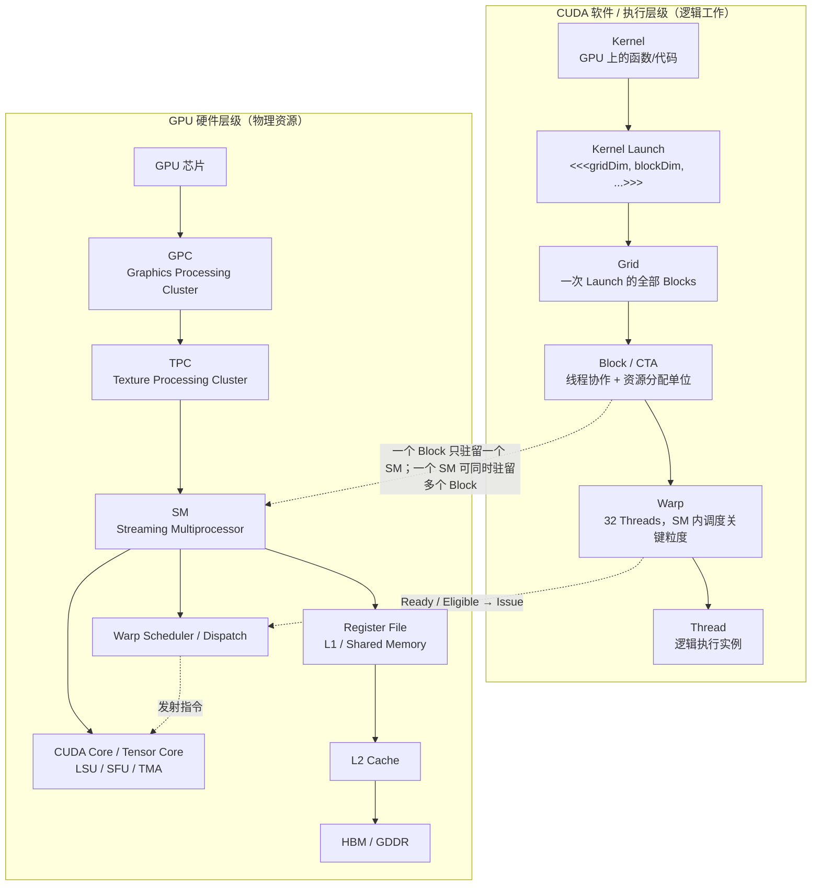

# GPU 执行与内存基础

<details>
<summary>本篇分段导航：按首读范围进入，其余二读</summary>

- [1. 先建立一张总地图：LLM 最终是在一台什么机器上跑？](#read-01)
- [2. CPU 和 GPU 为什么不一样？](#read-02)
- [3. 什么是 HBM？为什么论文天天讨论 HBM？](#read-03)
- [4. GPU Memory Hierarchy：显存并不是只有一层](#read-04)
- [5. “带宽”和“延迟”到底是什么？](#read-05)
- [6. Thread、Warp、Block/CTA、SM：CUDA 的执行层次](#read-06)
- [7. Tensor Core 是什么？为什么矩阵乘法特别快？](#read-07)
- [8. Kernel 是什么？](#read-08)
- [9. Kernel Fusion 为什么有效？](#read-09)
- [10. 什么是 Tiling？](#read-10)
- [11. Arithmetic Intensity / Operational Intensity](#read-11)
- [12. Compute-bound 与 Memory-bound](#read-12)
- [13. Roofline Model 的直觉](#read-13)
- [14. Occupancy 是什么？](#read-14)
- [22. 四篇论文分别在硬件/系统哪一层？](#read-15)
- [23. 读论文时遇到这些词，可以直接这样翻译](#read-16)
- [24. 推荐阅读顺序](#read-17)
- [25. 最值得先记住的 8 个硬件 Insight](#read-18)
- [学习问答：原笔记 §01](#read-19)

</details>

<!-- learning-position -->
> **学习定位**：A1 · 分层必修。
> **前置**：[基础课程](<README.md>)。
> **首读/二读**：先读硬件/内存/执行层级、Kernel 与 tiling；Roofline/occupancy 二读，原长笔记的硬件层级辨析按问题回查。
> **进度与实验**：[学习清单](<../学习清单.md>) · [总入口](<../README.md>)。
<!-- /learning-position -->

> 前置：tensor 与进程。首读硬件层级、带宽/延迟、Kernel 与 tiling，再回读 Roofline/occupancy。预计 4–6 小时分两次学习。本文整编自论文共享基础，保留原有直觉与算例。


<a id="shared-01"></a>


<a id="read-01"></a>

## 1. 先建立一张总地图：LLM 最终是在一台什么机器上跑？


一台典型的 AI 服务器，可以先粗略理解成：

```text
CPU
├── CPU cores
├── CPU cache
└── CPU DRAM
      │
      │ PCIe / NVLink-C2C 等连接
      ▼
GPU
├── 很多 SM（Streaming Multiprocessor）
│   ├── CUDA Cores
│   ├── Tensor Cores
│   ├── Registers
│   └── Shared Memory / L1
├── L2 Cache
└── HBM（GPU 显存）
```

对于这组论文，最重要的不是某一代 GPU 有多少个核心，而是理解三个层次：

1. **计算单元**：Tensor Core、CUDA Core；
2. **执行组织**：thread、warp、thread block/CTA、SM；
3. **存储层次**：register → shared memory/L1 → L2 → HBM → CPU DRAM。

系统优化的本质经常是：

> **让数据尽可能待在更靠近计算单元的地方，并尽量少在慢层级之间搬来搬去。**

这条原则就是 FlashAttention、FlashInfer 等工作的硬件出发点。

---


<a id="shared-02"></a>


<a id="read-02"></a>

## 2. CPU 和 GPU 为什么不一样？


CPU 的设计目标通常是：

> 用少量非常强的核心，把复杂、分支很多、延迟敏感的任务快速完成。

GPU 的设计目标更接近：

> 用大量相对简单的执行单元，同时处理海量相似计算。

例如矩阵乘法：

$$
C = AB
$$

其中每个输出元素：

$$
C_{ij}=\sum_k A_{ik}B_{kj}
$$

不同的 $i,j$ 可以高度并行，因此特别适合 GPU。

所以 Transformer 中的大量 GEMM（General Matrix-Matrix Multiplication，通用矩阵-矩阵乘法）非常适合 GPU。

但是：

> **GPU 算得快，不代表整个程序一定快。**

如果 GPU 每做一点计算，都要等大量数据从 HBM 搬进来，那么计算单元会处于“等数据”的状态。

这就是为什么 AI Infra 必须同时关心：

- FLOPs；
- 显存容量；
- 显存带宽；
- Cache / Shared Memory；
- 数据布局；
- kernel 调度。

---


<a id="shared-03"></a>


<a id="read-03"></a>

## 3. 什么是 HBM？为什么论文天天讨论 HBM？


HBM = **High Bandwidth Memory（高带宽内存）**。

你可以把它近似理解为：

> GPU 自己的大容量主内存，也就是平时 `nvidia-smi` 看到的那几十 GB / 上百 GB“显存”的主体。

例如模型参数、activation、KV Cache 等大量数据，主要都放在 HBM 中。

HBM 的“High Bandwidth”已经比普通 CPU DRAM 快很多，但 GPU 的计算能力增长得更快，因此在很多 workload 里：

> **HBM 仍然相对太慢。**

一个很重要的观念是：

```text
数据在 HBM 里
    ↓ 读取
送到 SM 附近
    ↓
GPU 做计算
    ↓
结果写回 HBM
```

如果一个算法不停：

```text
HBM → compute → HBM → compute → HBM
```

那么即使 FLOPs 并不多，也可能很慢。

FlashAttention 就是从这里开始重新审视 Attention。

---


<a id="shared-04"></a>


<a id="read-04"></a>

## 4. GPU Memory Hierarchy：显存并不是只有一层


可以先记住下面这张简化图：

```text
              更快、更小
                  ↑
             Register
                  │
      Shared Memory / L1
                  │
                L2
                  │
                HBM
                  │
             CPU DRAM
                  ↓
              更慢、更大
```

#### 4.1 Register

Register 是线程直接使用的极小、极快存储。

例如一个线程正在累加：

```text
sum += a * b
```

`sum` 很可能就在 register 中。

特点：

- 极快；
- 每个线程可用数量有限；
- register 用得太多，会影响 GPU 同时容纳多少线程。

这会与后面讲的 **occupancy** 联系起来。

#### 4.2 Shared Memory / SRAM

Shared Memory 是一个 thread block 内线程可以共享的片上存储。

可以理解成：

> 一个 SM 上非常快的小工作台。

典型优化方式：

```text
HBM 中的一块数据
      ↓
一次搬进 Shared Memory
      ↓
很多线程反复使用
```

而不是：

```text
线程 1 从 HBM 读
线程 2 又从 HBM 读
线程 3 又从 HBM 读
...
```

**Tiling（分块）** 的核心意义之一就是制造这种数据复用。

FlashAttention 论文经常把这类片上快速内存统称为 SRAM。

#### 4.3 L2 Cache

L2 是 GPU 上更大、但比 shared memory 更远的一层缓存。

它对多个 SM 可见。

通常你不需要像 shared memory 那样显式地控制所有 L2 行为，但数据是否能命中 L2，会影响实际显存流量。

#### 4.4 HBM

容量大，带宽高，但相对于片上内存仍然远得多。

模型参数和 KV Cache 主要驻留于此。

---


<a id="shared-05"></a>


<a id="read-05"></a>

## 5. “带宽”和“延迟”到底是什么？


这两个词不要混淆。

#### 带宽 Bandwidth

表示单位时间最多能搬多少数据，例如：

```text
TB/s
GB/s
```

类比高速公路：

> 一秒钟能通过多少辆车。

#### 延迟 Latency

表示一次访问从发出请求到拿到数据需要多久。

类比：

> 一辆车从北京开到上海要多久。

AI kernel 经常通过：

- 并发；
- cache；
- prefetch；
- pipeline；

隐藏单次访问延迟，而最终受到总带宽限制。

所以 LLM decode 中经常说：

> **memory bandwidth bound**。

意思不是“显存很慢”，而是：

> 每生成一个 token 需要搬的数据太多，相对于计算量而言，HBM 总吞吐成为上限。

---


<a id="shared-06"></a>


<a id="read-06"></a>

## 6. Thread、Warp、Block/CTA、SM：CUDA 的执行层次


这是以后读 FlashAttention-2 / FlashInfer 必须认识的一组词。

可以从大到小理解：

```text
GPU
└── 很多 SM
    └── 执行很多 Thread Block / CTA
        └── 一个 block 包含很多 threads
            └── threads 以 warp 为基本执行群组
```

#### 6.1 Thread

CUDA 中最小的编程线程。

每个 thread 通常处理矩阵中的某几个元素。

#### 6.2 Warp

NVIDIA GPU 中线程不是完全各自独立执行，而是以 **warp** 为重要执行单位。

经典 NVIDIA 架构中，一个 warp 包含 32 个线程。

可以粗略理解成：

```text
32 个线程
   ↓
一起执行一条指令
```

所以如果同一个 warp 中：

```text
16 个线程走 if 分支 A
16 个线程走 if 分支 B
```

硬件通常不能真正同时执行两条不同路径，而要分开执行，导致效率下降。

这就是 **warp divergence** 的直觉。

#### 6.3 Thread Block / CTA

一组 threads 构成一个 block。

CTA（Cooperative Thread Array）在很多 NVIDIA 文档/论文中基本可以视作 thread block 这一层概念。

一个 block 的线程可以：

- 使用同一块 shared memory；
- 做 block 内同步。

#### 6.4 SM

SM = Streaming Multiprocessor。

可以把 GPU 想成有很多“计算车间”：

```text
SM0
SM1
SM2
...
```

CUDA runtime 会把 thread blocks 调度到不同 SM 上执行。

如果一些 block 工作很快结束，而另一些特别慢，就会出现：

```text
SM0: idle
SM1: idle
SM2: █████████████ still working
SM3: idle
```

这就是 **load imbalance**。

FlashInfer 的动态 scheduler 就是在处理这种问题。

---


<a id="shared-07"></a>


<a id="read-07"></a>

## 7. Tensor Core 是什么？为什么矩阵乘法特别快？


现代 NVIDIA GPU 不仅有普通 CUDA Core，还拥有专门加速矩阵运算的 **Tensor Core**。

它非常擅长类似：

$$
D=A\times B+C
$$

这样的矩阵乘加。

因此：

> 在 AI GPU 上，一个 FLOP 并不总是“成本一样”。

矩阵乘法 FLOP 可以被 Tensor Core 极高效执行，而：

- exp；
- max；
- divide；
- index manipulation；

这类非矩阵运算可能相对昂贵。

FlashAttention-2 的一个重要改进就是：

> 尽量减少 non-matmul FLOPs，把更多时间留给 Tensor Core 擅长的矩阵计算。

---


<a id="shared-08"></a>


<a id="read-08"></a>

## 8. Kernel 是什么？


Kernel 可以理解为：

> CPU 发给 GPU 的一个“并行计算任务程序”。

例如标准 Attention 可能被拆成：

```text
Kernel 1: QK^T
Kernel 2: mask
Kernel 3: softmax
Kernel 4: dropout
Kernel 5: P @ V
```

每个 kernel 往往需要：

```text
从 HBM 读输入
→ 计算
→ 把结果写回 HBM
```

因此多个 kernel 之间的大中间 tensor 会反复进出 HBM。

---


<a id="shared-09"></a>


<a id="read-09"></a>

## 9. Kernel Fusion 为什么有效？


假设有：

```text
A → operation1 → B → operation2 → C
```

分两个 kernel：

```text
Kernel 1:
read A
compute B
write B to HBM

Kernel 2:
read B from HBM
compute C
write C
```

融合以后：

```text
Kernel:
read A
compute B
B 留在片上
compute C
write C
```

省掉：

```text
write B
read B
```

因此 kernel fusion 往往不是为了减少数学计算，而是为了：

> **减少 HBM traffic 和 kernel launch overhead。**

FlashAttention 把多个 Attention 操作融合进一个 kernel，就是经典案例。

---


<a id="shared-10"></a>


<a id="read-10"></a>

## 10. 什么是 Tiling？


假设你需要做一个巨大矩阵运算，但 shared memory 装不下整个矩阵。

最自然的方法是切块：

```text
完整矩阵
┌──────────────┐
│ □ □ □ □ □  │
│ □ □ □ □ □  │
│ □ □ □ □ □  │
└──────────────┘
```

每次只处理：

```text
┌─────┐
│ tile│
└─────┘
```

流程：

```text
HBM
 ↓
加载 tile 到 shared memory/register
 ↓
尽量多做计算
 ↓
必要结果写回 HBM
```

Tiling 的关键不是“把矩阵切小”本身，而是：

> **让同一批从 HBM 搬来的数据，在片上被重复使用很多次。**

FlashAttention 的整个核心算法就是围绕 Attention 设计一个正确的 tiling 方式。

---


<a id="shared-11"></a>


<a id="read-11"></a>

## 11. Arithmetic Intensity / Operational Intensity


这是读系统论文非常重要的指标。

可以粗略定义：

$$
AI=\frac{\text{做了多少计算}}{\text{从内存搬了多少 Byte}}
$$

例如：

##### 程序 A

```text
读 1 GB 数据
只做少量加法
```

Arithmetic Intensity 很低。

##### 程序 B

```text
读 1 GB 数据
做大量矩阵乘法
```

Arithmetic Intensity 很高。

由此产生两个经典瓶颈。

---


<a id="shared-12"></a>


<a id="read-12"></a>

## 12. Compute-bound 与 Memory-bound


#### Compute-bound

程序速度主要受 GPU 计算能力限制。

也就是：

```text
数据已经喂得足够快
Tensor Core 一直满负荷计算
```

此时优化方向通常是：

- 更高 Tensor Core 利用率；
- 更好的 work partition；
- 更少无效 FLOPs。

#### Memory-bound

程序速度主要受数据搬运速度限制。

此时可能出现：

```text
Tensor Core：我算完了，数据呢？
HBM：还在搬。
```

优化方向通常是：

- 少读 HBM；
- 少写 HBM；
- reuse；
- fusion；
- quantization；
- 更紧凑的数据结构。

FlashAttention 和 LLM decode 都非常强调 memory traffic。

---


<a id="shared-13"></a>


<a id="read-13"></a>

## 13. Roofline Model 的直觉


Roofline Model 可以帮助判断一个 workload 应该优化什么。

横轴可以想象成 Arithmetic Intensity，纵轴是实际计算吞吐。

```text
性能
 ↑
 |              __________ 计算上限
 |            /
 |          /
 |        /
 |      /
 |_____/______________________→ Arithmetic Intensity
      内存带宽限制
```

左边：

> memory-bound。

右边：

> compute-bound。

重要 insight：

> **减少 FLOPs 不一定会更快。**

如果程序本来就在左边受内存带宽限制，FLOPs 再少一点可能没有意义；反而减少 HBM IO 更有价值。

这正是 FlashAttention 论文批评很多早期 approximate/sparse attention 工作的出发点之一。

---


<a id="shared-14"></a>


<a id="read-14"></a>

## 14. Occupancy 是什么？


GPU 要隐藏内存延迟，需要同时准备很多可以执行的 warp。

如果一个 warp 在等数据：

```text
warp A: 等 HBM
```

SM 可以切换去执行：

```text
warp B
warp C
warp D
```

所以通常希望 SM 上同时有足够多 active warps。

这种资源占用程度常被称为 **occupancy**。

但 occupancy 受到：

- register 数量；
- shared memory 使用量；
- block 大小；

限制。

因此 tile 越大并不总越好：

```text
大 tile
→ reuse 可能更好
→ 但 shared memory/register 用量变大
→ 同时驻留 block 变少
→ occupancy 可能下降
```

这就是 kernel tuning 中典型的 trade-off。

---


<a id="shared-22"></a>


<a id="read-15"></a>

## 22. 四篇论文分别在硬件/系统哪一层？


可以用下面这张图记住：

```text
Transformer Attention 数学
        │
        ▼
FlashAttention
减少 HBM IO，优化单次 Attention kernel
        │
        ▼
PagedAttention / vLLM
把动态 KV Cache 做成 paged memory
        │
        ▼
RadixAttention / SGLang
在 paged KV 之上管理跨请求 prefix reuse
        │
        ▼
FlashInfer
把越来越多不规则 KV layout / Attention pattern
统一成可编译、可动态调度的 inference kernel/runtime
```

注意：

这并不是“后者淘汰前者”。

它们经常可以叠加：

```text
SGLang
  ↓ runtime / cache policy
Paged KV Cache
  ↓ physical storage
FlashInfer / FlashAttention-like kernels
  ↓ GPU execution
GPU HBM / SM / Tensor Core
```

---


<a id="shared-23"></a>


<a id="read-16"></a>

## 23. 读论文时遇到这些词，可以直接这样翻译


| 术语 | 先这样理解 |
|---|---|
| HBM | GPU 大容量显存 |
| SRAM / Shared Memory | SM 上很快但很小的片上工作区 |
| Register | 单线程极快临时变量存储 |
| SM | GPU 的一个计算车间 |
| Warp | NVIDIA GPU 中一组协同执行的线程 |
| Thread Block / CTA | 被调度到 SM 上的一组线程 |
| Kernel | CPU 发给 GPU 的并行计算程序 |
| Kernel Fusion | 多个操作合成一个 kernel，减少中间 HBM IO |
| Tiling | 把大问题切块，在片上反复 reuse |
| GEMM | 通用矩阵乘法 |
| Tensor Core | 专门做矩阵乘加的硬件单元 |
| Compute-bound | 算力先到上限 |
| Memory-bound | 内存搬运先到上限 |
| Arithmetic Intensity | 每搬 1 Byte 数据做多少计算 |
| Occupancy | SM 上能维持多少活跃线程/warp 的程度 |
| KV Cache | 自回归推理缓存历史 token 的 K/V |
| Page / Block | 固定粒度的内存分配单位 |
| Block Table | logical block → physical block 的映射 |
| Prefix Cache | 复用已有 prompt prefix 的 KV |
| Radix Tree | 压缩前缀树，用于管理多层 prefix sharing |

---


<a id="shared-24"></a>


<a id="read-17"></a>

## 24. 推荐阅读顺序


在 `AI Infra 论文讲解/` 中，建议按照：

```text
00｜共享基础：GPU、显存与 LLM 推理系统硬件基础
        ↓
FlashAttention
        ↓
PagedAttention / vLLM
        ↓
SGLang / RadixAttention
        ↓
FlashInfer
```

原因是这四篇恰好构成了一条非常好的 AI Infra 学习路径：

> **从 GPU IO → 动态显存管理 → KV Cache 复用 → 统一 inference kernel/runtime。**

---


<a id="shared-25"></a>


<a id="read-18"></a>

## 25. 最值得先记住的 8 个硬件 Insight


1. **GPU 很快，但“搬数据”可能比“算数据”更贵。**
2. **HBM 是大仓库；Shared Memory/Register 是计算单元身边的小工作台。**
3. **Tiling 的本质是用一次 HBM 搬运换更多片上 reuse。**
4. **Kernel Fusion 的本质通常不是减少数学计算，而是减少中间结果反复读写 HBM。**
5. **FLOPs 少不等于 wall-clock 更快；必须看 workload 到底 compute-bound 还是 memory-bound。**
6. **Prefill 与 Decode 虽然都叫 Attention，但 GPU workload 特性差别很大。**
7. **KV Cache 是推理中的动态显存对象，因此内存管理会直接影响 batch size 和 throughput。**
8. **AI Infra 的很多经典创新，本质上是在硬件约束之上重新设计数据布局、执行顺序和调度方式。**

---

#### 主要参考资料

- Dao et al., *FlashAttention: Fast and Memory-Efficient Exact Attention with IO-Awareness*, NeurIPS 2022, arXiv:2205.14135.
- Dao, *FlashAttention-2: Faster Attention with Better Parallelism and Work Partitioning*, 2023/ICLR 2024, arXiv:2307.08691.
- Kwon et al., *Efficient Memory Management for Large Language Model Serving with PagedAttention*, SOSP 2023, arXiv:2309.06180.
- Zheng et al., *SGLang: Efficient Execution of Structured Language Model Programs*, arXiv:2312.07104 / NeurIPS 2024.


---


<a id="notebook-01"></a>


<a id="read-19"></a>

## 学习问答：原笔记 §01

### 为什么“一百多个 SM”却能有上万个 CUDA Core？

因为 CUDA Core 是 SM 内部的执行资源，不是 SM 本身。以 H100 SXM 为例，132 个 SM，每个 SM 中包含大量标量执行单元以及 Tensor Core 等资源，因此整卡会呈现上万级别的 CUDA Core 数量。真正做 CUDA 性能分析时，比“总 CUDA Core 数”更重要的是：有多少 SM、有多少 Warp 能持续处于可发射状态、执行管线是否被喂饱。

### 硬件层级与软件层级不要画成同一棵“父子树”



图 1｜硬件是“资源”，Grid/Block/Warp/Thread 是“工作与调度组织”；关键映射是 Block → SM、Warp → Warp Scheduler。

> **最重要的纠正：**不要记成“Thread → CUDA Core 一一绑定”。Thread 是逻辑执行实例；32 个 Thread 组成 Warp，Warp 的指令由调度器发射到合适的执行管线。
