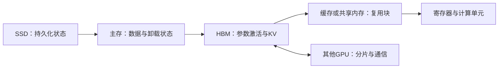

# 计算、存储与通信的交汇：局部性、复用和数据移动

> 类型：跨领域综述。前置：[处理器](计算电路与处理器.md)、[存储层次](存储器件与层次.md)、[链路](通信信号与链路.md)。

## 为一次运算画数据路径

计算必须消费输入并产生输出。用三个问题描述任何优化：状态放在哪里，谁执行计算，依赖满足前需要搬哪些数据。逻辑张量相同，不意味着物理存储或传输路径相同。

这是一张常见数据路径示意，不规定所有硬件都必须逐级经过每一层。DMA、设备直连和缓存策略会改变实际路径。

## GEMM 的复用如何产生

对方阵 $C=AB$，边长为 $N$，计算量约为 $2N^3$ FLOP。理想情况下，每个输入从被考察的存储层读取一次，输出写一次；若每元素 $b$ 字节，流量下界示意为 $3bN^2$，算术强度约 $2N/(3b)$。

这个下界要求足够的近端复用，并忽略旧 C 的读取等条件。实际 Kernel 的分块、缓存、边界和临时状态会增加流量。不能用此式直接代替 profiler 的 HBM 字节数。

一个 $m\times n$ 输出 tile 沿 K 累积，每轮读取 A 和 B 的块。多个输出共享输入，从而减少远端重复读取；但输出累加器会占用寄存器。tile 越大，复用可能越好，同时驻留资源需求也更大。

## 算术强度依赖存储层级

$$I=\frac{FLOP}{bytes},\qquad P\leq\min(P_{peak},B_{level}I_{level}).$$

同一 Kernel 可在 HBM 层有较高强度，却在共享内存或寄存器数据通路上受限。Roofline 的峰值还必须匹配 dtype、指令类型及稀疏条件。小任务可能先受到启动、依赖或并行度限制，而不是落在两个理想上界之一。

示意：$10^9$ FLOP、$10^8$ 字节，强度为 10 FLOP/B；假设可用带宽为 $10^{12}$ B/s，带宽上界为 $10^{13}$ FLOP/s。这个上界不等于预测吞吐。

## 四种常见交换

| 方法 | 减少什么 | 增加什么 | 需要验证 |
|---|---|---|---|
| 缓存 | 重复计算或远端读取 | 驻留状态、淘汰管理 | 命中与一致性 |
| 重计算 | 长期保存的激活 | 额外 FLOP 与读取 | 总时间、随机状态 |
| 分片 | 每设备状态或工作 | 通信与同步 | 布局、所有权、峰值 |
| 压缩与低精度 | 存储和传输字节 | 编解码、元数据或误差 | 质量、解码成本 |

Offload 则把容量压力转移到另一层，同时引入传输和调度。它是否有效取决于传输能否在消费前完成，以及预取窗口能否容纳在途状态。

## 从数据局部性到调度局部性

将共享前缀请求送到同一 worker 可以复用 KV，却可能使该 worker 排队；把任务均匀分散可以降低排队，却降低缓存命中。局部性和负载均衡需要共同优化。

MoE 的专家放置也类似：权重靠近使用者有助于减少传输，但动态路由可能使热专家拥堵。端到端完成时间通常受关键路径和最慢参与者影响。

## 方法演进的分支

当远端流量成为瓶颈，可以增加复用、压缩状态、移动计算或减少访问集合；当计算成为瓶颈，可以改变算子、精度、并行映射或算法。优化一种资源后，应重新测量，而不是假设原瓶颈仍在。

下一层：[Kernel 数据搬运](../05_Kernels/GPU内存编程与数据搬运.md)、[训练显存优化](../09_Training_Systems/训练显存优化.md)、[KV 管理](../10_Inference_Serving/推理内存系统.md)、[通信重叠](../07_Communication/通信计算重叠.md)。

参考：[Roofline 作者技术报告](https://www2.eecs.berkeley.edu/Pubs/TechRpts/2008/EECS-2008-134.html)；[CUDA Best Practices Guide](https://docs.nvidia.com/cuda/cuda-c-best-practices-guide/index.html)。

---

[所属专题](README.md) · [百科总览](../README.md)
