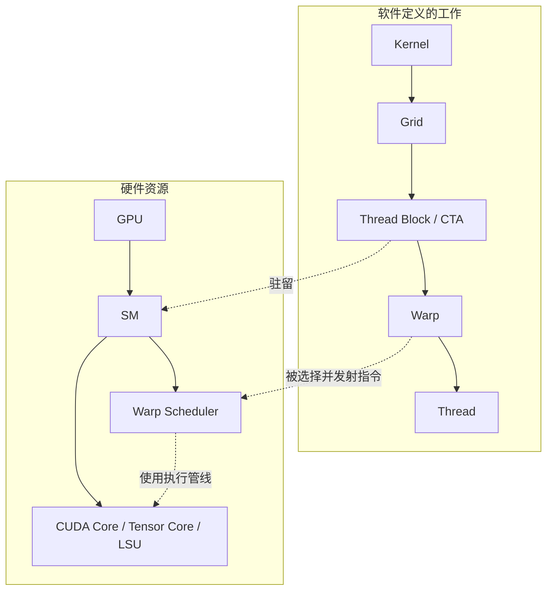
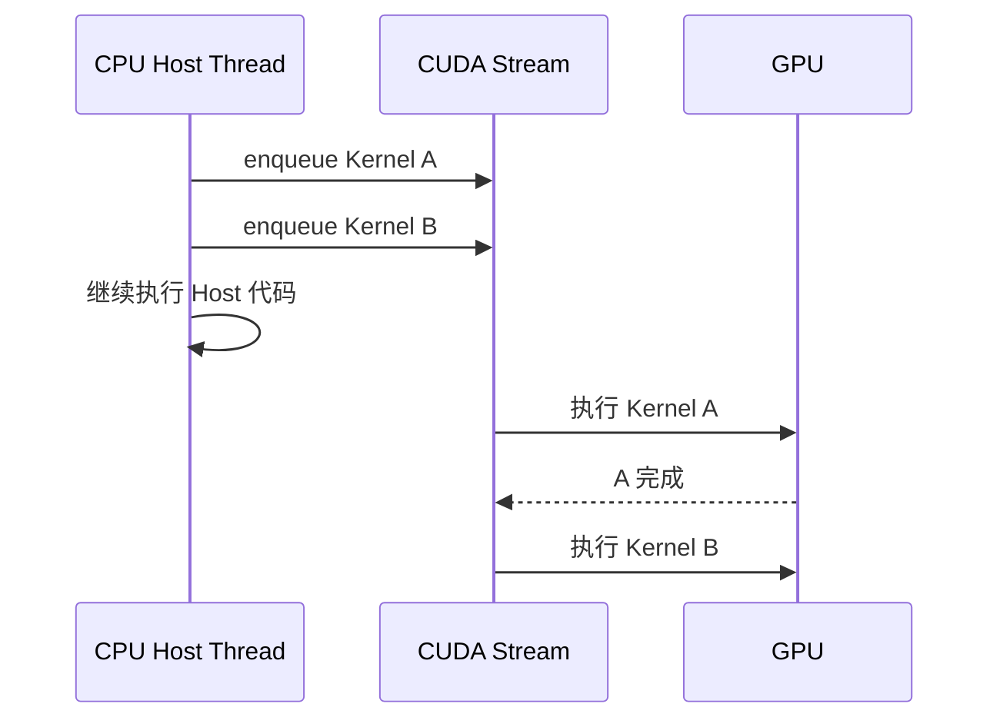

# CUDA 执行模型与调度

<details>
<summary>本篇分段导航：按首读范围进入，其余二读</summary>

- [1. 先区分“工作”与“硬件”](#read-01)
- [2. `vector_add<<<4096, 256>>>` 到底创建了什么？](#read-02)
- [3. 为什么一个 Block 不能拆到两个 SM？](#read-03)
- [4. 三层“调度”不要混淆](#read-04)
- [5. Kernel Launch 为什么通常是异步的？](#read-05)
- [6. Occupancy 是什么？](#read-06)
- [7. Warp Scheduler 为什么能隐藏延迟？](#read-07)
- [8. Warp Divergence](#read-08)
- [9. Hopper/Blackwell 为什么让旧模型变得不够用？](#read-09)
- [10. 常见误区](#read-10)
- [11. 推荐实验](#read-11)
- [12. 资料](#read-12)
- [学习问答：原笔记 §05](#read-13)

</details>

<!-- learning-position -->
> **学习定位**：A1 · 必修。
> **前置**：[基础课程](<../00_Foundations/README.md>)。
> **首读/二读**：Kernel/Block/Warp/SM、异步 launch、Stream/Event；高级调度二读。
> **进度与实验**：[学习清单](<../学习清单.md>) · [总入口](<../README.md>)。
<!-- /learning-position -->

> CUDA 是 NVIDIA 的并行计算平台与编程模型。历史上常展开为 **Compute Unified Device Architecture（统一计算设备架构）**，但 NVIDIA 现代材料通常直接使用 CUDA 这一名称。


<a id="read-01"></a>

## 1. 先区分“工作”与“硬件”

CUDA 软件层描述需要执行多少工作；GPU 硬件层描述有哪些资源可以承载这些工作。



LSU = **Load/Store Unit（加载/存储单元）**。

关键纠正：Thread 不是永久绑定到某个 CUDA Core。Thread 是逻辑执行实例；32 个 Thread 通常组成一个 Warp；Warp Scheduler 从已就绪的 Warp 中选择指令并发射到合适的执行管线。


<a id="read-02"></a>

## 2. `vector_add<<<4096, 256>>>` 到底创建了什么？

```cpp
vector_add<<<4096, 256>>>(a, b, c, n);
```

这里指定：

- Grid 中有 4096 个 Block。
- 每个 Block 有 256 个 Thread。
- 一个 Block 内的 256 个 Thread 通常组成 8 个 Warp。
- 总共有 1,048,576 个逻辑 Thread，但它们不会同时占据一百万个物理核心。

假设 GPU 有 120 个 SM，每个 SM 因寄存器和 Shared Memory 限制只能同时驻留 4 个这样的 Block，那么第一波最多约驻留：

$$
120 \times 4 = 480\ \text{Blocks}
$$

4096 个 Block 会一波一波运行。某个 Block 结束、释放资源后，新的 Block 才能进入该 SM。


<a id="read-03"></a>

## 3. 为什么一个 Block 不能拆到两个 SM？

同一个 Block 的 Thread 可以：

- 访问同一块 Shared Memory（共享内存）；
- 使用 `__syncthreads()` 做 Block 内同步；
- 共享 Block 级生命周期。

如果把 Block 拆到两个 SM，Shared Memory 和低成本 Barrier（屏障同步）就无法维持原有语义。因此经典 CUDA 模型要求一个 Block 的整个生命周期驻留在一个 SM；一个 SM 则可以同时容纳多个 Block。


<a id="read-04"></a>

## 4. 三层“调度”不要混淆

| 层级 | 调度对象 | 谁负责 | 时间尺度 | 开发者能否直接控制 |
|---|---|---|---|---|
| Stream 层 | Kernel、Memcpy、Event | Runtime、Driver、GPU 前端 | Kernel/操作级 | 可以表达顺序和依赖 |
| CTA 层 | Thread Block | GPU Block 调度机制 | Block 生命周期 | 只能通过 Grid、资源量和 Cluster 间接影响 |
| Warp 层 | Warp 的下一条指令 | SM 内 Warp Scheduler | 指令周期级 | 不能逐周期指定 |

Stream = **CUDA Stream（CUDA 流）**，是一条按顺序提交 GPU 工作的逻辑队列。同一 Stream 内操作按序；不同 Stream 只有在依赖、资源和硬件条件允许时才可能并发，不能把“不同 Stream”直接等同于“同时执行”。


<a id="read-05"></a>

## 5. Kernel Launch 为什么通常是异步的？

CPU 发起 Kernel 后，通常只把工作放入某条 Stream，然后继续执行 Host 代码。Host = **主机端，通常指 CPU 侧程序**；Device = **设备端，通常指 GPU**。



只有显式同步、阻塞式拷贝，或后续必须等待结果时，CPU 才需要停下来。调试 CUDA 报错时，经常出现“错误在下一次同步才暴露”，原因就是前一次 Launch 是异步的。


<a id="read-06"></a>

## 6. Occupancy 是什么？

Occupancy 通常描述活跃 Warp 数占硬件允许最大活跃 Warp 数的比例。它受以下因素限制：

- 每个 Block 的 Thread 数；
- 每个 Thread 使用的 Register 数；
- 每个 Block 使用的 Shared Memory；
- 架构允许的最大 Block/Warp 数。

例如，一个 SM 有 65536 个 32-bit Register。如果每个 Thread 使用 128 个 Register，一个 256-Thread Block 需要：

$$
128 \times 256 = 32768\ \text{Registers}
$$

仅从寄存器看，一个 SM 最多只能同时放两个这种 Block。若改成每 Thread 64 个 Register，理论上可能放四个，但还要继续检查 Shared Memory、Warp 和架构上限。

Occupancy 高可以提供更多可切换 Warp，从而隐藏访存延迟；但 100% Occupancy 不是最终目标。某个 Kernel 可能用更多 Register 保存复用数据，虽然 Occupancy 降低，却减少 HBM 访问并获得更高性能。


<a id="read-07"></a>

## 7. Warp Scheduler 为什么能隐藏延迟？

假设 Warp A 发起一次 HBM Load，需要等待很久。SM 不必原地空等，可以发射 Warp B 或 Warp C 的可执行指令：

```text
cycle 0: Warp A 发出 Load，开始等待
cycle 1: Warp B 执行 FMA
cycle 2: Warp C 执行整数地址计算
cycle 3: Warp D 发出 Shared Memory Load
...
```

FMA = **Fused Multiply-Add（融合乘加）**。这种做法隐藏的是 Latency（单次操作延迟），并不会突破 Bandwidth（单位时间最大传输量）。如果所有 Warp 都在持续读取 HBM，最终仍会达到内存带宽上限。


<a id="read-08"></a>

## 8. Warp Divergence

SIMT = **Single Instruction, Multiple Threads（单指令、多线程）**。同一个 Warp 的 Thread 理想情况下执行相同指令。如果一半 Thread 走 `if`，另一半走 `else`，硬件通常需要分阶段执行不同路径：

```cpp
if (threadIdx.x < 16) {
    path_a();
} else {
    path_b();
}
```

这不意味着结果错误，而是两条路径不能完全并行利用 Warp 的 Lane。Lane 可理解为 Warp 中一个 Thread 的位置。


<a id="read-09"></a>

## 9. Hopper/Blackwell 为什么让旧模型变得不够用？

Hopper 引入 TMA（Tensor Memory Accelerator，张量内存加速器）、Warp-group MMA 和 Thread Block Cluster；Blackwell 又加入 TMEM（Tensor Memory，服务 Tensor Core 中间状态的专用片上内存）、更复杂的 MMA 与 Cluster 调度。这使高性能 Kernel 越来越像多个角色协作的流水线：


MMA = **Matrix Multiply-Accumulate（矩阵乘累加）**。这也是为什么现代 DSL 和编译器开始提供 Warp Specialization（Warp 专职化）和软件流水自动生成。


<a id="read-10"></a>

## 10. 常见误区

1. **“一个 Thread 对应一个 CUDA Core。”** 错。Thread 属于逻辑模型，Warp 指令动态使用执行管线。
2. **“Grid 越大，GPU 同时运行的工作越多。”** Grid 只说明总工作量；同时驻留量受 SM 资源限制。
3. **“多 Stream 一定并发。”** 只能说允许并发，还要看依赖与资源。
4. **“Occupancy 越高越快。”** 它只是延迟隐藏能力的一个代理指标。
5. **“Issue 就等于指令完成。”** Issue 是发射，执行、访存和完成可能跨越许多周期。


<a id="read-11"></a>

## 11. 推荐实验

- 改变 Block Size：64、128、256、512，观察 Kernel 时间与 Occupancy。
- 增加局部数组或中间变量，观察 Register Usage 和 Spill。
- 用两个 Stream 执行两个独立 Kernel，比较有无并发。
- 制造 Warp Divergence，比较 Warp 内一致分支与不一致分支。


<a id="read-12"></a>

## 12. 资料

- [CUDA Programming Guide](https://docs.nvidia.com/cuda/cuda-programming-guide/index.html)
- [CUDA C++ Best Practices Guide](https://docs.nvidia.com/cuda/cuda-c-best-practices-guide/)
- [NVIDIA Hopper Tuning Guide](https://docs.nvidia.com/cuda/hopper-tuning-guide/)
- [NVIDIA Blackwell Tuning Guide](https://docs.nvidia.com/cuda/blackwell-tuning-guide/)


<a id="notebook-05"></a>


<a id="read-13"></a>

## 学习问答：原笔记 §05

### 05｜Block 如何占用 SM 资源？Warp 又是如何被调度和 Issue 的？

这一章回答最容易混在一起的三个问题：① 4096 个 Block 不可能同时塞进 GPU，实际怎么分批？② 一个 SM 能同时放几个 Block 是谁决定的？③ Warp Scheduler 说某个 Warp “Issued” 到底是什么意思？

#### 第一层调度：Block / CTA → SM

GPU 会把尚未执行的 Block 分配给“当前资源足够”的 SM。一个 Block 进入 SM 时需要占用多种资源：Thread/warp slots、Register File、Shared Memory、Block slots 等。一个 SM 能同时 resident 多少个 Block，取所有约束中的最小值。


```text
假设（仅用于理解）：
SM 最大 resident threads = 2048
SM 最大 resident warps = 64
Register File = 65536 registers
Kernel: 256 threads / block
32 registers / thread
每 Block：
256 threads
8 warps
256 × 32 = 8192 registers
thread 限制：2048 / 256 = 8 blocks
warp 限制： 64 / 8 = 8 blocks
register： 65536 / 8192 = 8 blocks
若 Shared Memory / block-slot 等也允许，
则最多可 resident 8 blocks / SM。
```


#### Occupancy 的直觉

Occupancy 本质上反映“SM 能驻留多少 Warp，相对于架构上允许的最大 resident Warp 数”。Register 使用过多、Shared Memory 使用过多、Block 太大等，都可能减少同时 resident 的 Block/Warp。高 Occupancy 往往有利于隐藏延迟，但 Occupancy 并不是越高性能就必然越好；最终还要看 memory bandwidth、instruction throughput、dependency、Tensor Core 利用等瓶颈。

#### 为什么 4096 Blocks 会一波一波执行？

假设有 132 个 SM，每个 SM 最多同时 resident 8 Blocks，那么同一时刻最多约 1056 Blocks 驻留。Grid 里的其他 Block 仍是“待执行工作”；当某个 Block 完成并释放 Register/Shared Memory/Warp slots 后，新的 Block 才能进入。可以把 4096 / 1056 ≈ 3.9 理解为大约 4 个 resident waves 的量级。

> **注意：**“Grid 里总共有多少 Block”和“当前同时 resident 多少 Block”不是一回事；同样，“resident Warp”和“这个 cycle 正在执行的 Warp”也不是一回事。

#### 第二层调度：SM 内的 Warp Scheduler

Block 进入 SM 后会被组织成 Warp。Warp Scheduler 不会让某个 Warp 一直霸占执行单元；如果 Warp 在等待 HBM、等待前序指令结果、等待 barrier，它就暂时不能发射下一条指令，调度器可以选择其他 Ready/Eligible Warp。这就是 GPU 用大量并发 Warp 隐藏延迟（latency hiding）的核心思路。

| **状态/术语**          | **含义**                                     | **关键区别**              |
|------------------------|----------------------------------------------|---------------------------|
| Resident / Active Warp | 执行上下文已经驻留在 SM 上                   | 有资源 ≠ 当前能执行       |
| Ready / Eligible Warp  | 下一条指令的依赖与资源条件满足，可以被选中   | 可发射 ≠ 已经发射         |
| Selected Warp          | 调度器在候选 Warp 中选中                     | 调度选择动作              |
| Issued Instruction     | 这条 Warp 指令从调度端被“发射”到对应执行管线 | Issue ≠ 指令已经完成      |
| Executed / Completed   | 指令在流水线中完成并产生结果                 | 可能比 Issue 晚多个 cycle |

#### 为什么 “Issue / Issued” 会表示“发射指令”？

这里的 issue 不是名词“问题”，而是动词“发出/发布”，就像 issue an order（下达命令）。在处理器体系结构里一直使用 instruction issue：当一条指令的依赖和执行资源满足后，调度逻辑把它发送到执行管线。因此更严谨的说法不是“整个 GPU 每个 cycle 只调度一个 Warp”，而是“某个 Warp 的一条指令在某个 cycle 被某个 Warp Scheduler issue 到执行管线”。现代 SM 通常有多个 scheduler / processing partition，同一 cycle 可发生多个 issue，具体能力依架构而异。

#### Issue ≠ Complete：流水线为什么重要？


```text
cycle 100: Warp A 的 MMA 指令被 Issue
cycle 101: execution pipeline stage 1
cycle 102: execution pipeline stage 2
...
cycle N: 结果 ready
```


因此 Nsight 等 profiler 中看到的 Active/Eligible/Issued 其实是在问三个不同层次的问题：SM 上有没有足够多的 Warp？这些 Warp 是否因为 memory/dependency/barrier 而大量 stall？Scheduler 是否能够持续向执行管线发射指令？

#### SIMT、Warp Divergence 与 Thread 为什么不是 CUDA Core 的固定映射

一个 Warp 通常包含 32 个 Thread lane。它们执行同一个 Warp 指令，但每个 Thread 使用自己的数据和逻辑状态，这就是 SIMT（Single Instruction, Multiple Threads）。如果同一 Warp 中线程走不同 if/else 分支，硬件需要用 active mask 分阶段执行不同路径，形成 Warp Divergence。


```cpp
if (i % 2 == 0) {
    C[i] = A[i] + B[i];
} else {
    C[i] = A[i] - B[i];
}
```


因此性能思考常常要从“Thread 视角”提升到“Warp 视角”：分支是否一致、32 个 lane 的内存访问是否连续、Warp 是否有足够多的独立工作可隐藏延迟。

#### Memory Coalescing：为什么连续访问更高效？


```text
较友好：
Thread 0 → A[0]
Thread 1 → A[1]
...
Thread 31 → A[31]
较差的典型模式：
Thread 0 → A[0]
Thread 1 → A[1024]
Thread 2 → A[2048]
...
```


相邻 lane 访问相邻地址时，硬件更容易把 Warp 的请求合并成较少的 memory transactions；跨大步长或不规则访问通常会增加事务数量与带宽浪费。

#### Hopper / FlashAttention 里为什么又出现 Warp Group、TMA、Producer/Consumer？

普通 CUDA 的核心层级仍是 Grid → Block → Warp → Thread。Hopper 上的 WGMMA 等指令会以 Warp Group（通常 4 Warps = 128 Threads）为协作粒度；程序还可以进行 Warp Specialization，让某些 Warp 主要负责 TMA 数据搬运（Producer），另一些 Warp/Warp Group 负责 Tensor Core 计算（Consumer）。这是一种软件/编程模型上的角色划分，而不是“SM 天生有 Producer Warp 硬件模块”。


```text
Producer Warp(s)
│ TMA
↓
Shared Memory
│
↓
Consumer Warp Group
│ WGMMA
↓
Tensor Core
```


#### 这一部分的一句话总图


> Kernel
>
> ↓ launch
>
> Grid
>
> ↓ Blocks
>
> Block / CTA ─────→ 某个 SM（资源足够才进入）
>
> ↓ 32 threads/group
>
> Warps
>
> ↓
>
> Warp Scheduler
>
> ↓ 选择 Eligible Warp
>
> Issue instruction
>
> ↓
>
> FP/INT / Tensor / LSU / TMA ...
>
> ↓
>
> Register / Shared Memory / L2 / HBM


#### 官方资料建议

- NVIDIA CUDA C++ Programming Guide：Execution Configuration、Thread Hierarchy、Hardware Multithreading、Occupancy。

- NVIDIA CUDA Compiler Driver NVCC Documentation：nvcc 的 Host/Device 编译流程。

- NVIDIA Hopper Architecture Whitepaper：SM、Tensor Core、TMA、Warp Group 等架构背景。

- NVIDIA Nsight Compute Profiling Guide：Active / Eligible / Issued Warp、stall reason、memory throughput 等性能指标。
