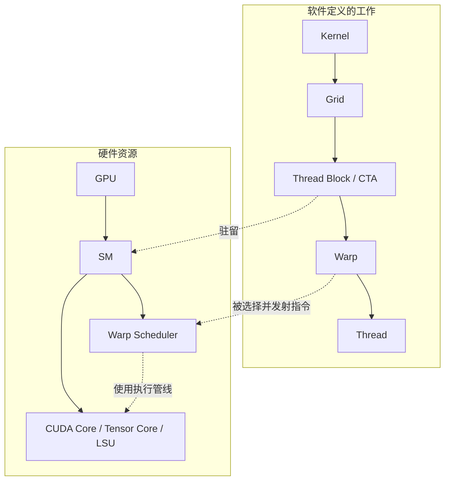
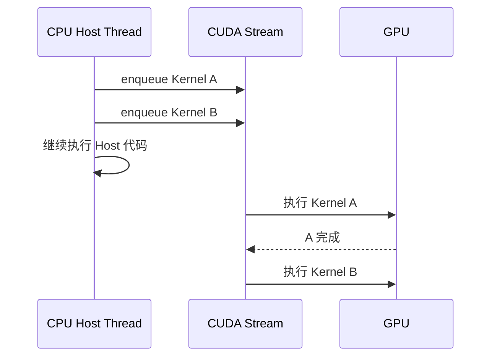

# CUDA 执行模型与调度

> CUDA 是 NVIDIA 的并行计算平台与编程模型。历史上常展开为 **Compute Unified Device Architecture（统一计算设备架构）**，但 NVIDIA 现代材料通常直接使用 CUDA 这一名称。

## 1. 先区分“工作”与“硬件”

CUDA 软件层描述需要执行多少工作；GPU 硬件层描述有哪些资源可以承载这些工作。



LSU = **Load/Store Unit（加载/存储单元）**。

关键纠正：Thread 不是永久绑定到某个 CUDA Core。Thread 是逻辑执行实例；32 个 Thread 通常组成一个 Warp；Warp Scheduler 从已就绪的 Warp 中选择指令并发射到合适的执行管线。

## 2. `vector_add<<<4096, 256>>>` 到底创建了什么？

```cpp
vector_add<<<4096, 256>>>(a, b, c, n);
```

这里指定：

- Grid 中有 4096 个 Block。
- 每个 Block 有 256 个 Thread。
- 一个 Block 内的 256 个 Thread 通常组成 8 个 Warp。
- 总共有 1,048,576 个逻辑 Thread，但它们不会同时占据一百万个物理核心。

假设 GPU 有 120 个 SM，每个 SM 因寄存器和 Shared Memory 限制只能同时驻留 4 个这样的 Block，那么第一波最多约驻留：

$$
120 \times 4 = 480\ \text{Blocks}
$$

4096 个 Block 会一波一波运行。某个 Block 结束、释放资源后，新的 Block 才能进入该 SM。

## 3. 为什么一个 Block 不能拆到两个 SM？

同一个 Block 的 Thread 可以：

- 访问同一块 Shared Memory（共享内存）；
- 使用 `__syncthreads()` 做 Block 内同步；
- 共享 Block 级生命周期。

如果把 Block 拆到两个 SM，Shared Memory 和低成本 Barrier（屏障同步）就无法维持原有语义。因此经典 CUDA 模型要求一个 Block 的整个生命周期驻留在一个 SM；一个 SM 则可以同时容纳多个 Block。

## 4. 三层“调度”不要混淆

| 层级 | 调度对象 | 谁负责 | 时间尺度 | 开发者能否直接控制 |
|---|---|---|---|---|
| Stream 层 | Kernel、Memcpy、Event | Runtime、Driver、GPU 前端 | Kernel/操作级 | 可以表达顺序和依赖 |
| CTA 层 | Thread Block | GPU Block 调度机制 | Block 生命周期 | 只能通过 Grid、资源量和 Cluster 间接影响 |
| Warp 层 | Warp 的下一条指令 | SM 内 Warp Scheduler | 指令周期级 | 不能逐周期指定 |

Stream = **CUDA Stream（CUDA 流）**，是一条按顺序提交 GPU 工作的逻辑队列。同一 Stream 内操作按序；不同 Stream 只有在依赖、资源和硬件条件允许时才可能并发，不能把“不同 Stream”直接等同于“同时执行”。

## 5. Kernel Launch 为什么通常是异步的？

CPU 发起 Kernel 后，通常只把工作放入某条 Stream，然后继续执行 Host 代码。Host = **主机端，通常指 CPU 侧程序**；Device = **设备端，通常指 GPU**。



只有显式同步、阻塞式拷贝，或后续必须等待结果时，CPU 才需要停下来。调试 CUDA 报错时，经常出现“错误在下一次同步才暴露”，原因就是前一次 Launch 是异步的。

## 6. Occupancy 是什么？

Occupancy 通常描述活跃 Warp 数占硬件允许最大活跃 Warp 数的比例。它受以下因素限制：

- 每个 Block 的 Thread 数；
- 每个 Thread 使用的 Register 数；
- 每个 Block 使用的 Shared Memory；
- 架构允许的最大 Block/Warp 数。

例如，一个 SM 有 65536 个 32-bit Register。如果每个 Thread 使用 128 个 Register，一个 256-Thread Block 需要：

$$
128 \times 256 = 32768\ \text{Registers}
$$

仅从寄存器看，一个 SM 最多只能同时放两个这种 Block。若改成每 Thread 64 个 Register，理论上可能放四个，但还要继续检查 Shared Memory、Warp 和架构上限。

Occupancy 高可以提供更多可切换 Warp，从而隐藏访存延迟；但 100% Occupancy 不是最终目标。某个 Kernel 可能用更多 Register 保存复用数据，虽然 Occupancy 降低，却减少 HBM 访问并获得更高性能。

## 7. Warp Scheduler 为什么能隐藏延迟？

假设 Warp A 发起一次 HBM Load，需要等待很久。SM 不必原地空等，可以发射 Warp B 或 Warp C 的可执行指令：

```text
cycle 0: Warp A 发出 Load，开始等待
cycle 1: Warp B 执行 FMA
cycle 2: Warp C 执行整数地址计算
cycle 3: Warp D 发出 Shared Memory Load
...
```

FMA = **Fused Multiply-Add（融合乘加）**。这种做法隐藏的是 Latency（单次操作延迟），并不会突破 Bandwidth（单位时间最大传输量）。如果所有 Warp 都在持续读取 HBM，最终仍会达到内存带宽上限。

## 8. Warp Divergence

SIMT = **Single Instruction, Multiple Threads（单指令、多线程）**。同一个 Warp 的 Thread 理想情况下执行相同指令。如果一半 Thread 走 `if`，另一半走 `else`，硬件通常需要分阶段执行不同路径：

```cpp
if (threadIdx.x < 16) {
    path_a();
} else {
    path_b();
}
```

这不意味着结果错误，而是两条路径不能完全并行利用 Warp 的 Lane。Lane 可理解为 Warp 中一个 Thread 的位置。

## 9. Hopper/Blackwell 为什么让旧模型变得不够用？

Hopper 引入 TMA（Tensor Memory Accelerator，张量内存加速器）、Warp-group MMA 和 Thread Block Cluster；Blackwell 又加入 TMEM（Tensor Memory，服务 Tensor Core 中间状态的专用片上内存）、更复杂的 MMA 与 Cluster 调度。这使高性能 Kernel 越来越像多个角色协作的流水线：


MMA = **Matrix Multiply-Accumulate（矩阵乘累加）**。这也是为什么现代 DSL 和编译器开始提供 Warp Specialization（Warp 专职化）和软件流水自动生成。

## 10. 常见误区

1. **“一个 Thread 对应一个 CUDA Core。”** 错。Thread 属于逻辑模型，Warp 指令动态使用执行管线。
2. **“Grid 越大，GPU 同时运行的工作越多。”** Grid 只说明总工作量；同时驻留量受 SM 资源限制。
3. **“多 Stream 一定并发。”** 只能说允许并发，还要看依赖与资源。
4. **“Occupancy 越高越快。”** 它只是延迟隐藏能力的一个代理指标。
5. **“Issue 就等于指令完成。”** Issue 是发射，执行、访存和完成可能跨越许多周期。

## 11. 推荐实验

- 改变 Block Size：64、128、256、512，观察 Kernel 时间与 Occupancy。
- 增加局部数组或中间变量，观察 Register Usage 和 Spill。
- 用两个 Stream 执行两个独立 Kernel，比较有无并发。
- 制造 Warp Divergence，比较 Warp 内一致分支与不一致分支。

## 12. 资料

- [CUDA Programming Guide](https://docs.nvidia.com/cuda/cuda-programming-guide/index.html)
- [CUDA C++ Best Practices Guide](https://docs.nvidia.com/cuda/cuda-c-best-practices-guide/)
- [NVIDIA Hopper Tuning Guide](https://docs.nvidia.com/cuda/hopper-tuning-guide/)
- [NVIDIA Blackwell Tuning Guide](https://docs.nvidia.com/cuda/blackwell-tuning-guide/)

