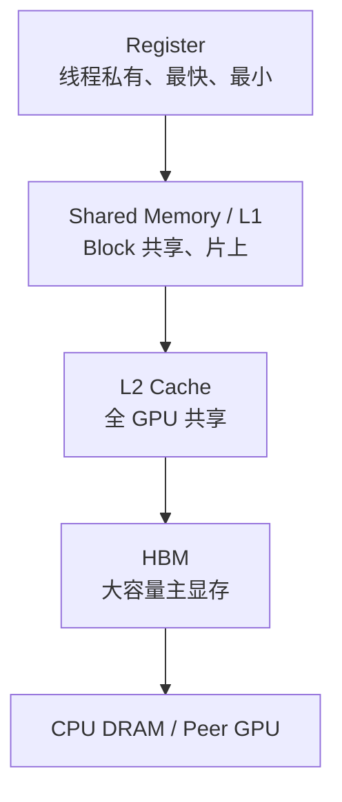
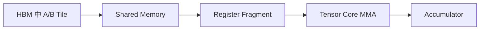
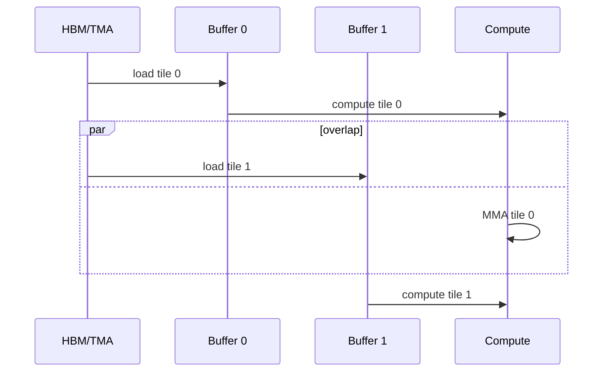

# GPU 内存编程与数据搬运

## 1. 为什么 AI Kernel 经常不是“算得慢”，而是“搬得慢”？

GPU 的 Tensor Core 可以在极短时间完成大量矩阵乘，但数据必须先到达计算单元附近。一个实用的简化层级是：



DRAM = **Dynamic Random-Access Memory（动态随机存取存储器）**。越靠上通常越快、容量越小、越需要程序显式管理；越靠下容量越大，但访问代价更高。

## 2. Bandwidth、Latency 与 Throughput

- Bandwidth（带宽）：单位时间最多能搬多少 Byte。
- Latency（延迟）：发起一次访问到结果可用需要多久。
- Throughput（吞吐）：系统实际完成工作的速率。

增加并发 Warp 可以隐藏单次 HBM Load 的延迟，但不能无限突破 HBM 带宽。类比高速公路：让更多车辆同时上路能掩盖单车行程时间，却不能超过道路每小时最大通行量。

## 3. Arithmetic Intensity 与 Roofline

Arithmetic Intensity（算术强度）表示每搬一个 Byte 做多少计算：

$$
I = \frac{\text{FLOPs}}{\text{Bytes moved}}
$$

FLOPs = **Floating-Point Operations（浮点运算次数）**。Roofline Model（屋顶线模型）给出的近似性能上限是：

$$
P \le \min(P_{peak},\ B_{memory}\times I)
$$

其中 $P_{peak}$ 是峰值计算吞吐，$B_{memory}$ 是内存带宽。算术强度低时，性能沿带宽斜线增长；算术强度足够高后，才触及计算上限。

### 一个具体例子

对长度为 $N$ 的 FP16 向量做逐元素加法：读两个输入、写一个输出，约搬运 $6N$ Byte，只做 $N$ 次加法：

$$
I \approx \frac{N}{6N}=\frac{1}{6}\ \text{FLOP/Byte}
$$

这几乎必然是 Memory-bound（受内存带宽限制）。即使把加法执行单元翻倍，性能也不会明显提高。

## 4. Coalescing：为什么连续地址更快？

Memory Coalescing（访存合并）是指同一 Warp 的多个 Thread 访问相邻地址时，硬件尽量合并为较少的内存事务。

```text
好：thread 0→x[0], thread 1→x[1], ... thread 31→x[31]
差：thread 0→x[0], thread 1→x[1024], ...
```

两种写法都读 32 个元素，但后者可能需要更多 Transaction（内存事务）和 Cache Line，浪费实际带宽。很多性能问题并不是“读了多少有效数据”，而是“为了这些有效数据，硬件实际传输了多少字节”。

## 5. Shared Memory 与 Tiling

GEMM = **General Matrix-Matrix Multiplication（通用矩阵乘法）**。如果每个 Thread 直接从 HBM 读取计算所需的每个元素，同一个矩阵元素会被许多 Thread 重复读取。

Tiling（分块）把矩阵切成片上能容纳的小块：



一块数据从 HBM 搬入一次，却能在多个 FMA/MMA 中复用，从而提高算术强度。

## 6. Shared Memory Bank Conflict

Shared Memory 被划分为多个 Bank。一个 Warp 中的 Thread 若访问不同 Bank，通常可以并行；若许多 Thread 同时访问同一 Bank 的不同地址，请求可能被串行化，这叫 Bank Conflict（存储体冲突）。

矩阵转置是经典例子：按行写、按列读时容易让地址映射产生冲突。常见修复是在 Shared Memory Tile 的一维增加 Padding（填充），例如从 `[32][32]` 改为 `[32][33]`，改变跨行步长与 Bank 映射。

## 7. Register Pressure 与 Spill

Register（寄存器）极快，但总量有限。编译器无法把所有局部值都放入 Register 时，会发生 Spill（溢出），把值放到 Local Memory。名字虽然叫 Local Memory，物理上通常落在 Device Memory 路径上，代价远高于 Register。

因此一个融合 Kernel 可能出现：

```text
减少中间 HBM 写回
        ↓
需要保存更多中间值
        ↓
Register Pressure 上升
        ↓
Occupancy 降低，甚至 Spill
```

这解释了为什么 Fusion 需要测量，不能仅凭“少一个 Kernel”判断一定更快。

## 8. Double Buffer 与 Software Pipeline

Double Buffer（双缓冲）使用两块片上缓冲区：计算当前 Tile 时，预取下一 Tile。



Software Pipeline（软件流水）把加载、计算、Epilogue（尾处理）安排为多个重叠阶段。Hopper 的 TMA 能以较少线程发起多维 Tensor 搬运，使 Producer Warp 负责数据，Consumer Warp Group 负责 MMA。

## 9. TMA、TMEM 与名字陷阱

- TMA = **Tensor Memory Accelerator（张量内存加速器）**，重点是异步搬运多维 Tile。
- TMEM = **Tensor Memory（张量内存）**，是 Blackwell 中服务 Tensor Core 中间状态的专用片上存储。

二者不是同一东西。TMA 更像“搬运引擎”，TMEM 更像“专用工作台”。

## 10. Kernel Fusion 的收益与边界

Fusion 主要减少：

- 中间 Tensor 写回和重读；
- Kernel Launch Overhead；
- Kernel 之间的同步边界。

但可能增加：

- Register/Shared Memory 使用；
- 编译时间与 Autotune 空间；
- 动态 Shape 的代码特化数量；
- 数值与调试复杂度。

适合融合的通常是轻量 Pointwise/Reduction 与主算子 Epilogue；不适合盲目融合的是两个都已经能高效占满 GPU、且融合后资源严重冲突的大 Kernel。

## 11. 2026 年的新趋势：数据移动成为编程模型的一等公民

CUDA 13.3 的 Tile 编程模型让程序员表达 Block-local Tile，编译器负责把 Tile 映射到硬件 Thread；规则 Tile Load 还可能 Lower 到 TMA。CUTLASS 4.x 的 CuTe DSL 则显式暴露 Layout、Copy Atom、MMA Atom 和 Pipeline。两条路线控制粒度不同，但都说明现代性能的中心从“写出并行循环”转向“编排数据移动、计算与同步”。

## 12. 资料

- [CUDA Tile Kernels](https://docs.nvidia.com/cuda/cuda-programming-guide/02-basics/writing-tile-kernels.html)
- [CUDA Best Practices: Memory Optimizations](https://docs.nvidia.com/cuda/cuda-c-best-practices-guide/)
- [CUTLASS 4.x Overview](https://docs.nvidia.com/cutlass/latest/overview.html)
- [Triton Warp Specialization](https://pytorch.org/blog/warp-specialization-in-triton-design-and-roadmap/)

