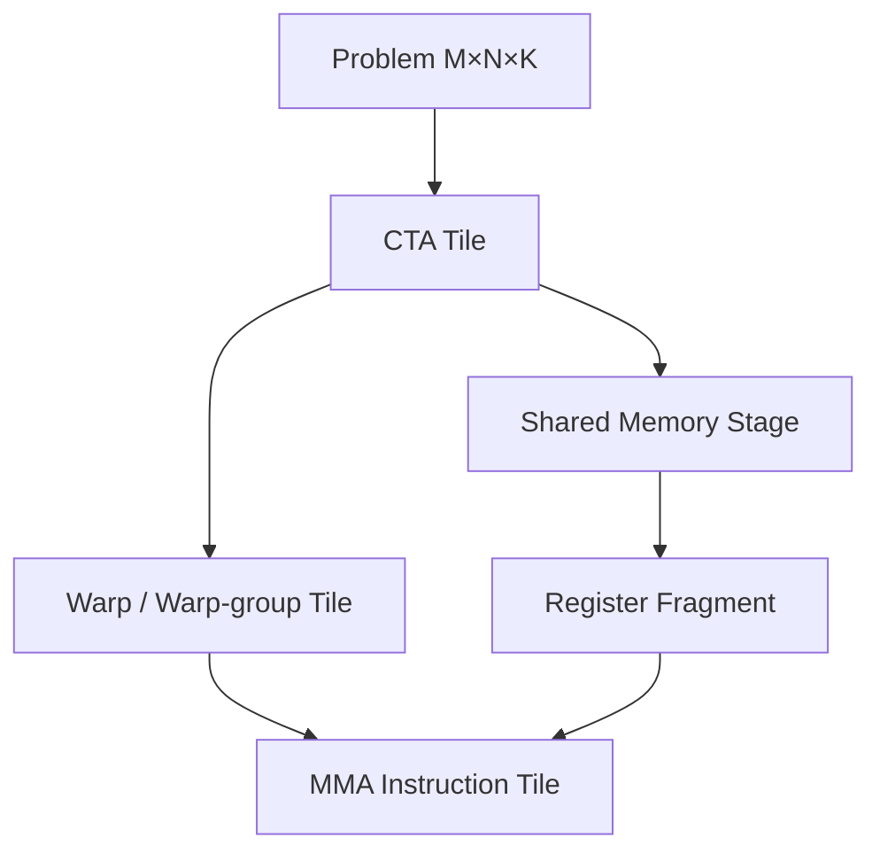
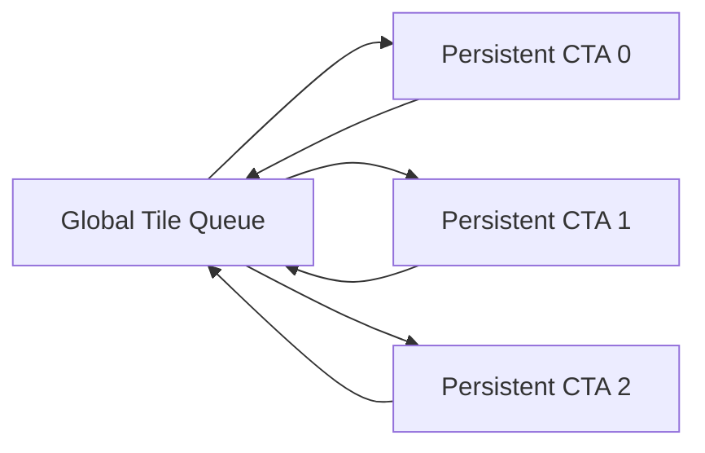

# GEMM、Tensor Core 与高性能 Kernel 设计模式

## 1. GEMM 为什么是 AI Infra 的“发动机”？

GEMM = **General Matrix-Matrix Multiplication（通用矩阵-矩阵乘法）**：

$$
C_{M\times N}=A_{M\times K}B_{K\times N}
$$

每个输出元素为：

$$
C_{ij}=\sum_{k=0}^{K-1}A_{ik}B_{kj}
$$

Transformer 中的 Q/K/V Projection、Attention 输出投影、MLP（Multi-Layer Perceptron，多层感知机）和 MoE（Mixture of Experts，混合专家）专家层，本质上大量是 GEMM。

但“数学上是矩阵乘”不等于“硬件上自动很快”。高性能实现必须同时解决：

- 把输出空间切给 CTA、Warp、Thread；
- 让 A/B Tile 在 Shared Memory 和 Register 中复用；
- 选择 Tensor Core 支持的数据类型与 Layout；
- 隐藏 HBM → Shared Memory 的延迟；
- 平衡 Tile 大小、Occupancy 与并行度；
- 处理尾块、动态 Shape 和 Epilogue。

## 2. 从朴素实现到分层 Tiling

朴素实现中，一个 Thread 计算一个 $C_{ij}$，每轮从 Global Memory 读取 $A_{ik}$ 和 $B_{kj}$。这会重复读取大量相同元素。

高性能 GEMM 通常有多层 Tile：



CTA Tile 决定一个 Block 负责的输出区域；Warp Tile 决定 Warp 或 Warp Group 的分工；MMA Tile 对应硬件矩阵乘累加指令的最小形状。

## 3. Tensor Core 与 MMA

MMA = **Matrix Multiply-Accumulate（矩阵乘累加）**。Tensor Core 并不是替代整个 SM 的“独立 GPU”，而是 SM 内擅长固定形状矩阵乘累加的执行单元。

不同架构的高性能协作粒度不断扩大：

```text
Volta/Ampere：Warp-level MMA
Hopper：Warp-group MMA，典型由 4 个 Warp 协作
Blackwell：TCGen05、TMEM、2-CTA 等更大协作与专用状态存储
```

这条演化线的本质是：Tensor Core 吞吐上升后，单个 Thread 或单个 Warp 很难独立准备足够数据，需要更大的协作域与更专门的数据通路。

## 4. Mainloop 与 Epilogue

一个 GEMM Kernel 可粗分为两段：

1. Mainloop（主循环）：沿 K 维加载 A/B Tile 并不断 MMA。
2. Epilogue（尾处理）：把 Accumulator 转换为输出，常融合 Bias、Activation、Scale、Quantize、Reduction 等操作。

例如：

$$
Y=\operatorname{GELU}(XW+b)
$$

如果 GEMM 把结果先写回 HBM，再启动 Bias Kernel 和 GELU Kernel，会多次搬运 $Y$。把 Bias 和 GELU 融入 Epilogue，可以让 Accumulator 在片上完成处理后只写回一次。

GELU = **Gaussian Error Linear Unit（高斯误差线性单元）**。

## 5. Batched GEMM、Grouped GEMM 与普通 GEMM

| 类型 | Problem Shape | 指针/Stride | 典型场景 |
|---|---|---|---|
| GEMM | 一个 $(M,N,K)$ | 单组矩阵 | 大 Linear Layer |
| Strided Batched GEMM | 多个相同 Shape | 规则固定 Stride | Attention Head、小批矩阵 |
| Grouped GEMM | 多个 Shape 可不同 | 每组独立描述 | MoE 不同专家 Token 数 |

MoE 中专家 $e$ 收到 $T_e$ 个 Token，对应：

$$
Y_e=X_eW_e,\quad X_e\in \mathbb{R}^{T_e\times H}
$$

不同专家的 $T_e$ 不同，于是一批 Shape 为：

$$
(T_0,H,I),(T_1,H,I),\ldots,(T_{E-1},H,I)
$$

这不是规则 Batched GEMM，而是 Grouped GEMM。

## 6. 三种执行 Grouped GEMM 的方式

### 6.1 Sequential GEMM

Host 循环逐专家调用 GEMM。优点是每个大专家可直接使用成熟库；缺点是小专家导致大量 Launch，GPU 并行度不足。

### 6.2 Multi-stream GEMM

把多个专家 GEMM 放入不同 Stream，允许小 GEMM 并发。它可能比一个通用 Grouped Kernel 更快，因为每个 GEMM 都能使用高度优化的库实现；但会增加 Stream 管理、并发资源竞争和调度不确定性。

### 6.3 Single Grouped GEMM Kernel

一次 Launch 内动态把 Tile 分配给不同专家。优点是减少 Launch 并统一调度；难点是元数据访问、Shape 不规则、专家负载不均以及 Tail Tile 浪费。

因此，“Grouped Kernel”不是天然快于“Multi-stream Library GEMM”。真正的判断条件包括专家数、每个专家 Token 数、Shape 分布、数据类型、目标 GPU 和 Kernel 实现质量。

## 7. Persistent Kernel

普通 Kernel 常把一个或少数 Tile 静态分配给 CTA。Persistent Kernel（持久化 Kernel）则让较少、长期驻留的 CTA 循环领取多个 Tile：



它能减少 Launch，并通过动态工作领取缓解不规则负载；但如果 Queue、Atomic 或调度策略设计不当，也会增加开销。Blackwell 的 Cluster Launch Control 与 CUTLASS 动态持久化调度，都是这一方向的硬件/软件协同。

## 8. Stream-K

传统 GEMM 沿 M/N 划 Tile。当 M/N 很小或 Tile 数不能均匀覆盖 SM 时，部分 SM 会空闲。Stream-K 允许进一步切 K 维，把一个输出 Tile 的 K 工作分给多个 CTA，再归并部分和。

收益是更好的负载均衡；代价是额外归并、同步或 Workspace。它体现了常见取舍：用额外通信/同步换更高并行度。

## 9. Warp Specialization

Warp Specialization（Warp 专职化）让不同 Warp 承担不同角色：

- Producer：发起 TMA Load，准备下一个 Tile；
- Consumer：执行 MMA；
- Epilogue Warp：处理归一化、Scale 或 Store。

Hopper/Blackwell 上硬件管线复杂，显式或编译器自动生成的 Warp Specialization 能提高延迟隐藏和专用单元利用率。Triton 2026 年公开的 AutoWS 设计，会做数据分区、软件流水调度和 Warp Partition。

## 10. Kernel Fusion、Persistent、Warp Specialization 的关系

三者解决的不是同一个问题：

| 技术 | 核心目标 | 主要风险 |
|---|---|---|
| Fusion | 减少中间存储与 Launch 边界 | Register/SMEM 压力、代码复杂 |
| Persistent Kernel | 减少反复 Launch、动态领取工作 | 调度与同步开销 |
| Warp Specialization | 让搬运、计算、尾处理重叠 | 角色负载不均、编译复杂 |

它们可以组合。例如 FlashAttention-4 可以既融合 Attention 流程，又使用 Warp/CTA 级流水，还根据架构选择专用实现。

## 11. 选 Kernel 时真正该看什么？

不要只看峰值 TFLOPS。至少记录：

- $(M,N,K)$ 和 Batch/Group 分布；
- Dtype（数据类型）与 Accumulation Precision；
- Alignment（对齐）和 Layout；
- HBM Bytes、L2 Hit、Arithmetic Intensity；
- Kernel Launch 数；
- Register、Shared Memory、Occupancy；
- Tensor Core Active；
- Tail Tile 与 Padding 浪费；
- 端到端是否还有重排、量化、通信开销。

## 12. 资料

- [CUTLASS Overview](https://docs.nvidia.com/cutlass/latest/overview.html)
- [CUTLASS Changelog](https://docs.nvidia.com/cutlass/latest/CHANGELOG.html)
- [Triton Warp Specialization](https://pytorch.org/blog/warp-specialization-in-triton-design-and-roadmap/)
- [PyTorch FlexAttention and FlashAttention-4](https://pytorch.org/blog/flexattention-flashattention-4-fast-and-flexible/)

