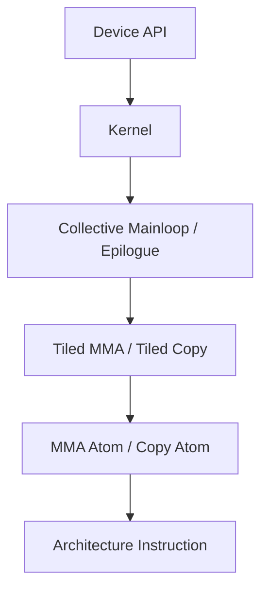

# CUDA 算子库、CUTLASS 与 CuTe

<!-- learning-position -->
> **学习定位**：A8 · 分层必修。
> **前置**：[GPU、tensor 与通信基础](<../00_Foundations/README.md>)。
> **首读/二读**：先区分 CUDA/cuBLAS/CUTLASS 的职责；CuTe layout 和模板实现按热点深入。
> **进度与实验**：[学习清单](<../学习清单.md>) · [总入口](<../README.md>)。
<!-- /learning-position -->

## 1. 不要把 CUDA、cuBLAS、CUTLASS 当成同一层

| 名称 | 全称与定位 | 你交付什么 | 主要控制权 |
|---|---|---|---|
| CUDA | NVIDIA 并行计算平台与编程模型 | 程序、Runtime/Driver API | 从 Host 到 Device 的完整执行 |
| cuBLAS | **CUDA Basic Linear Algebra Subprograms**，NVIDIA 线性代数库 | GEMM 等调用参数 | 库内部选择 Kernel |
| cuBLASLt | cuBLAS Lightweight，面向更灵活 Matmul 描述和 Heuristic | Matmul Descriptor、Layout、Epilogue | 可配置算法与融合，但不手写 Kernel |
| CUTLASS | **CUDA Templates for Linear Algebra Subroutines**，CUDA C++ 模板库 | 组合/实例化 Kernel | Tile、Pipeline、Scheduler、Epilogue 等 |
| CuTe | CUTLASS 中描述 Tensor、Layout、Copy、MMA 的组合抽象 | Layout Algebra 与硬件 Atom | 非常细的布局和硬件映射 |
| CuTe DSL | CUTLASS 4.x 的 Python DSL | Python 写低层 GPU Kernel | 与 CuTe C++ 对齐的细粒度控制 |

最简单的决策顺序通常是：先试成熟 Library；Library 无法满足融合、Shape 或动态调度需求时，再考虑 CUTLASS/DSL/手写 CUDA。

## 2. cuBLAS 为什么常常很强？

cuBLAS 内部包含大量针对架构、Shape、Dtype、Layout 调优的 Kernel。它的优势不是“调用了一条神奇指令”，而是多年积累的：

- Kernel 家族；
- Heuristic（启发式选择）；
- Autotune/Benchmark 经验；
- Tensor Core 数据类型支持；
- 边界 Shape 和数值处理；
- 跨 GPU 代际维护。

所以手写一个数学正确的 GEMM 很容易，持续在多种 Shape 上击败 cuBLAS 很难。

## 3. cuBLASLt 解决什么？

传统 GEMM API 主要表达 $C=\alpha AB+\beta C$。现代 AI 需要更丰富的 Matmul：Bias、Activation、Scale、不同 Layout、算法 Workspace 等。cuBLASLt 使用 Descriptor（描述符）表达这些属性，并允许查询候选算法。

它位于“纯黑盒库”与“自己写 Kernel”之间：你不直接安排 Warp，却能影响 Layout、Epilogue、Workspace 和算法选择。

## 4. CUTLASS 3.x 的分层直觉

CUTLASS 并不是“一份 GEMM 代码”，而是可组合的 Kernel 构建组件。可以从外向内理解：



- Atom：最小硬件操作的抽象，例如某类 MMA 或 Copy。
- Tiled Operation：把 Atom 扩展到 Warp/CTA 的协作布局。
- Collective：Mainloop 或 Epilogue 的完整协作流程。
- Kernel：加入 Problem Shape、Scheduler 和 Grid 执行。
- Device API：Host 侧调用封装。

## 5. CuTe 最难的地方：Layout 不是“行主序/列主序”这么简单

CuTe 把 Layout 视为从逻辑坐标到物理索引的映射。它需要同时描述：

- Tensor 的逻辑 Shape；
- Stride；
- Thread 到数据元素的分配；
- MMA 指令期望的 Fragment Layout；
- Global、Shared、Register、TMEM 间 Copy Layout。

为什么如此复杂？因为 Tensor Core 指令不是接收“一个 PyTorch Tensor”就自动运行，它要求特定线程在特定 Register 中持有特定 Fragment。CuTe 的 Layout Algebra（布局代数）试图让这些映射可组合、可推理。

### 一个小例子

逻辑上同为 $16\times16$ Tile，可以有不同 Thread 映射：

- Thread 0 持有连续 8 个元素；
- Thread 0/1/2…分别持有不同 Row；
- 多个 Thread 协作持有 Tensor Core 所需 Fragment。

三者数学 Shape 相同，但 Coalescing、Bank Conflict 和 MMA 接口可能完全不同。

## 6. CUTLASS 4.x 与 CuTe DSL

CUTLASS 4.0 开始提供 Python-native CUTLASS DSL。CuTe DSL 是首个 DSL，目标是在 Python 中保留 CuTe C++ 的 Layout、Tensor、Copy Atom、MMA Atom 和硬件层级控制。

截至资料核对日，官方文档已进入 CUTLASS 4.8，并列出 Rubin 初步 GEMM 支持；Blackwell 路线已经覆盖 TCGen05、TMEM、Cluster Launch Control、Block-scaled FP4/FP6/FP8、Persistent/Stream-K 调度等。

这带来一个重要变化：

```text
过去：高性能、强控制 ≈ 大量 C++ 模板元编程
现在：高性能、强控制 → 可以通过 Python CuTe DSL 表达
```

但“Python 语法”不代表抽象很高。CuTe DSL 仍要求理解 Layout、Tile、Copy/MMA Atom、Pipeline 与目标架构。

## 7. Blackwell 为什么推动 CUTLASS/CuTe 变得更重要？

Blackwell 引入或强化：

- TCGen05 MMA；
- TMEM；
- 2-CTA/Cluster 协作；
- NVFP4、MXFP4/MXFP6/MXFP8 等 Block-scaled 格式；
- Cluster Launch Control；
- 更复杂的 Persistent Scheduler。

这些能力彼此耦合。一个 Kernel 不仅要做矩阵乘，还要安排 Scale、TMA、TMEM、Barrier、CTA 协作和 Epilogue。CUTLASS 的价值在于把经过验证的架构相关模式做成可组合组件。

## 8. CUTLASS、Triton、TileLang 怎么选？

| 需求 | 常见优先选择 | 原因 |
|---|---|---|
| 标准大 GEMM | cuBLAS/cuBLASLt | 成熟、覆盖广、维护成本低 |
| NVIDIA 极致架构特化 | CUTLASS/CuTe DSL | 控制细，紧跟 Tensor Core/TMA/TMEM |
| 快速写融合算子 | Triton | Block Tensor 模型简洁，PyTorch 生态强 |
| 明确表达 Pipeline/Buffer、多后端 | TileLang | Pythonic Tile 原语，TVM 基础，多后端演进 |
| 算法研究且希望编译器选后端 | PyTorch/Helion 等更高层 | 少写硬件细节，依赖编译器和 Autotune |

这不是绝对结论。同一个 Attention 在不同 Shape、GPU 和版本上，最优实现可能不同。

## 9. 2026 年值得关注的变化

PyTorch 2.14 的 NVGEMM 把 CuTe DSL 生成的 CUTLASS Kernel 带进 Inductor，并与 Triton、ATen 候选一起调优。它说明未来用户可能不直接选择“用 Triton 还是 CUTLASS”，而由编译器根据 Shape 和后端能力选择；Kernel 工程师则负责提供高质量候选实现。

## 10. 资料

- [CUTLASS Latest Overview](https://docs.nvidia.com/cutlass/latest/overview.html)
- [CuTe DSL Introduction](https://docs.nvidia.com/cutlass/latest/media/docs/pythonDSL/cute_dsl_general/dsl_introduction.html)
- [CUTLASS Changelog](https://docs.nvidia.com/cutlass/latest/CHANGELOG.html)
- [cuBLAS Documentation](https://docs.nvidia.com/cuda/cublas/)
- [PyTorch 2.14 Release](https://pytorch.org/blog/pytorch-2-14-release-blog/)


<a id="notebook-07-01"></a>

## 07.1｜先建立软件栈：CUDA、cuBLAS、CUTLASS、Triton 分别是什么？


先看一张总图：

```text
                         上层 Framework
                  PyTorch / Transformer Engine
                            │
                 dispatch / compile / autotune
                            │
          ┌─────────────────┼──────────────────┐
          │                 │                  │
       cuBLAS/Lt         CUTLASS            Triton
      成熟数学库       C++ Kernel模板库      Kernel DSL/Compiler
          │                 │                  │
          │                 │            TTIR/TTGIR/LLVM
          │                 │                  │
          └─────────────────┼──────────────────┘
                            │
                       PTX / cubin
                            │
                           SASS
                            │
                            ▼
                           GPU
```

#### CUDA：平台与编程/运行时基础

CUDA 不是“一个 GEMM 库”，而是一整套 NVIDIA GPU 计算平台，包括：

- CUDA C++ 编程模型；
- CUDA Runtime API；
- CUDA Driver API；
- 编译工具链；
- 各类数学与通信库所依赖的底层运行环境。

#### cuBLAS：NVIDIA 已经帮你优化好的 BLAS 数学库

BLAS = **Basic Linear Algebra Subprograms（基础线性代数子程序）**。

cuBLAS 是 NVIDIA 针对 GPU 提供的高性能 BLAS 实现。最典型的工作就是矩阵乘：

```text
A[M,K] @ B[K,N] → C[M,N]
```

使用者主要表达“我要做什么 GEMM”，而真正的 tile size、Tensor Core 指令、pipeline、memory layout 等大量底层细节由 NVIDIA 的库实现与 heuristic 处理。

#### cuBLASLt：更灵活、以 GEMM 为中心的新接口

`Lt` 可以先理解成更现代、更灵活的 GEMM API。相比传统 cuBLAS，它更方便描述：

- input/output layout；
- dtype / compute dtype；
- workspace；
- algorithm heuristic；
- bias / activation 等 epilogue；
- 新的低精度与 Grouped GEMM 能力。

所以可以粗略理解：

```text
cuBLAS：
“帮我做 GEMM。”

cuBLASLt：
“帮我做这个具体 layout/dtype/epilogue/workspace 约束下的 GEMM，
并从可用 algorithm 中帮我挑合适实现。”
```

#### CUTLASS：不是 CUDA 的下一层，而是构建高性能 Kernel 的模板/抽象库

CUTLASS 是 NVIDIA 开源的高性能 GEMM/相关 Kernel 构建库。它不是 `cuBLAS → CUTLASS → GPU` 这种调用关系。

更准确是：

```text
                  想实现一个 GEMM
                       │
            ┌──────────┴──────────┐
            ▼                     ▼
         cuBLAS                  CUTLASS
   调成熟 NVIDIA 库          用模板/抽象构建 Kernel
            │                     │
            └──────────┬──────────┘
                       ▼
                   GPU machine code
```

CUTLASS 允许 Kernel 工程师控制或组合：

- tile shape；
- warp / warp-group 划分；
- Tensor Core MMA/WGMMA；
- Shared Memory layout；
- TMA / async copy；
- pipeline stages；
- scheduler；
- epilogue。

可以把 cuBLAS 比作“已经调好的赛车”，CUTLASS 更像“提供发动机、变速箱、底盘和大量高性能组件让你造赛车”。

---


<a id="notebook-07-14"></a>

## 07.14｜本章最容易混淆的术语


| 概念 | 类型 | 不要误解成 |
|---|---|---|
| CUDA Runtime | Host 侧运行时 API/软件层 | GPU 指令集 |
| CUDA Stream | operation 有序队列/依赖模型 | SM 内 Warp 调度器 |
| cuBLAS | NVIDIA 高性能 BLAS 库 | 编程语言 |
| cuBLASLt | 更灵活的 GEMM library/API | CUTLASS 的别名 |
| CUTLASS | 高性能 CUDA C++ Kernel 模板/抽象库 | cuBLAS 内部必经的一层 |
| Triton | Kernel DSL + compiler | CUTLASS frontend |
| TileLang | 基于 TVM 的 tile-level Kernel DSL | 默认一定走 CUTLASS |
| PTX | NVIDIA 虚拟 GPU ISA | 最终硬件机器码本身 |
| cubin | GPU binary container | CUDA Runtime |
| SASS | 具体 GPU 真正执行的机器指令 | CUDA C++ 源码 |
| GEMM | 一个矩阵乘 workload | 某个固定 Kernel 实现 |
| Grouped GEMM | 一组可不同 shape 的 GEMM workload | 必须由单个 kernel 实现 |

---


<a id="notebook-07-15"></a>

## 07.15｜官方资料与版本证据（截至 2026-08）


- CUDA Programming Guide：CUDA Stream、异步执行、Thread/Block/Warp execution model。
  - https://docs.nvidia.com/cuda/cuda-programming-guide/
- cuBLAS / cuBLASLt Documentation：GEMM、algorithm heuristic、Grouped GEMM。
  - https://docs.nvidia.com/cuda/cublas/
- CUDA 13.1 Release Notes：cuBLASLt experimental Grouped GEMM。
  - https://docs.nvidia.com/cuda/archive/13.1.0/cuda-toolkit-release-notes/index.html
- CUTLASS Documentation：GEMM、Grouped GEMM、CuTe DSL。
  - https://docs.nvidia.com/cutlass/latest/
- Triton source/compiler：NVIDIA backend 的 TTIR → TTGIR → LLIR → PTX → cubin lowering。
  - https://github.com/triton-lang/triton
- TileLang Targets：`cuda` / `cutedsl` / `hip` 等 backend。
  - https://www.tilelang.com/get_started/targets.html
- PyTorch main docs：`torch.nn.functional.grouped_mm`、`prefer_cublaslt_grouped_gemm`。
  - https://docs.pytorch.org/docs/main/generated/torch.nn.functional.grouped_mm.html
  - https://docs.pytorch.org/docs/main/backends.html
- PyTorch issue #163425：2025-09-20，H200 / BF16 / PyTorch 2.8 / CUDA 12.8 的历史性能问题。
  - https://github.com/pytorch/pytorch/issues/163425
- Transformer Engine 2.18 Grouped GEMM / environment variables / release notes。
  - https://docs.nvidia.com/deeplearning/transformer-engine/user-guide/api/c/gemm.html
  - https://docs.nvidia.com/deeplearning/transformer-engine/user-guide/envvars.html
  - https://docs.nvidia.com/deeplearning/transformer-engine/release-notes/
