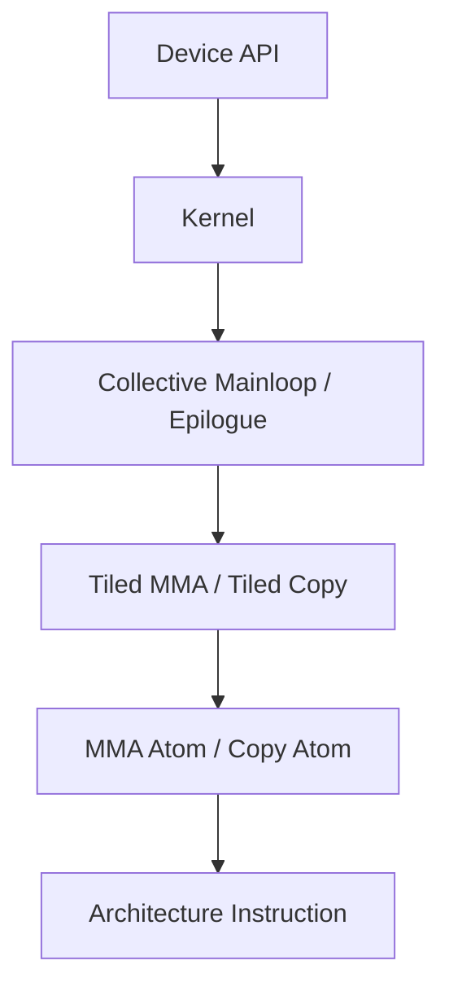

# CUDA 算子库、CUTLASS 与 CuTe

## 1. 不要把 CUDA、cuBLAS、CUTLASS 当成同一层

| 名称 | 全称与定位 | 你交付什么 | 主要控制权 |
|---|---|---|---|
| CUDA | NVIDIA 并行计算平台与编程模型 | 程序、Runtime/Driver API | 从 Host 到 Device 的完整执行 |
| cuBLAS | **CUDA Basic Linear Algebra Subprograms**，NVIDIA 线性代数库 | GEMM 等调用参数 | 库内部选择 Kernel |
| cuBLASLt | cuBLAS Lightweight，面向更灵活 Matmul 描述和 Heuristic | Matmul Descriptor、Layout、Epilogue | 可配置算法与融合，但不手写 Kernel |
| CUTLASS | **CUDA Templates for Linear Algebra Subroutines**，CUDA C++ 模板库 | 组合/实例化 Kernel | Tile、Pipeline、Scheduler、Epilogue 等 |
| CuTe | CUTLASS 中描述 Tensor、Layout、Copy、MMA 的组合抽象 | Layout Algebra 与硬件 Atom | 非常细的布局和硬件映射 |
| CuTe DSL | CUTLASS 4.x 的 Python DSL | Python 写低层 GPU Kernel | 与 CuTe C++ 对齐的细粒度控制 |

最简单的决策顺序通常是：先试成熟 Library；Library 无法满足融合、Shape 或动态调度需求时，再考虑 CUTLASS/DSL/手写 CUDA。

## 2. cuBLAS 为什么常常很强？

cuBLAS 内部包含大量针对架构、Shape、Dtype、Layout 调优的 Kernel。它的优势不是“调用了一条神奇指令”，而是多年积累的：

- Kernel 家族；
- Heuristic（启发式选择）；
- Autotune/Benchmark 经验；
- Tensor Core 数据类型支持；
- 边界 Shape 和数值处理；
- 跨 GPU 代际维护。

所以手写一个数学正确的 GEMM 很容易，持续在多种 Shape 上击败 cuBLAS 很难。

## 3. cuBLASLt 解决什么？

传统 GEMM API 主要表达 $C=\alpha AB+\beta C$。现代 AI 需要更丰富的 Matmul：Bias、Activation、Scale、不同 Layout、算法 Workspace 等。cuBLASLt 使用 Descriptor（描述符）表达这些属性，并允许查询候选算法。

它位于“纯黑盒库”与“自己写 Kernel”之间：你不直接安排 Warp，却能影响 Layout、Epilogue、Workspace 和算法选择。

## 4. CUTLASS 3.x 的分层直觉

CUTLASS 并不是“一份 GEMM 代码”，而是可组合的 Kernel 构建组件。可以从外向内理解：



- Atom：最小硬件操作的抽象，例如某类 MMA 或 Copy。
- Tiled Operation：把 Atom 扩展到 Warp/CTA 的协作布局。
- Collective：Mainloop 或 Epilogue 的完整协作流程。
- Kernel：加入 Problem Shape、Scheduler 和 Grid 执行。
- Device API：Host 侧调用封装。

## 5. CuTe 最难的地方：Layout 不是“行主序/列主序”这么简单

CuTe 把 Layout 视为从逻辑坐标到物理索引的映射。它需要同时描述：

- Tensor 的逻辑 Shape；
- Stride；
- Thread 到数据元素的分配；
- MMA 指令期望的 Fragment Layout；
- Global、Shared、Register、TMEM 间 Copy Layout。

为什么如此复杂？因为 Tensor Core 指令不是接收“一个 PyTorch Tensor”就自动运行，它要求特定线程在特定 Register 中持有特定 Fragment。CuTe 的 Layout Algebra（布局代数）试图让这些映射可组合、可推理。

### 一个小例子

逻辑上同为 $16\times16$ Tile，可以有不同 Thread 映射：

- Thread 0 持有连续 8 个元素；
- Thread 0/1/2…分别持有不同 Row；
- 多个 Thread 协作持有 Tensor Core 所需 Fragment。

三者数学 Shape 相同，但 Coalescing、Bank Conflict 和 MMA 接口可能完全不同。

## 6. CUTLASS 4.x 与 CuTe DSL

CUTLASS 4.0 开始提供 Python-native CUTLASS DSL。CuTe DSL 是首个 DSL，目标是在 Python 中保留 CuTe C++ 的 Layout、Tensor、Copy Atom、MMA Atom 和硬件层级控制。

截至资料核对日，官方文档已进入 CUTLASS 4.8，并列出 Rubin 初步 GEMM 支持；Blackwell 路线已经覆盖 TCGen05、TMEM、Cluster Launch Control、Block-scaled FP4/FP6/FP8、Persistent/Stream-K 调度等。

这带来一个重要变化：

```text
过去：高性能、强控制 ≈ 大量 C++ 模板元编程
现在：高性能、强控制 → 可以通过 Python CuTe DSL 表达
```

但“Python 语法”不代表抽象很高。CuTe DSL 仍要求理解 Layout、Tile、Copy/MMA Atom、Pipeline 与目标架构。

## 7. Blackwell 为什么推动 CUTLASS/CuTe 变得更重要？

Blackwell 引入或强化：

- TCGen05 MMA；
- TMEM；
- 2-CTA/Cluster 协作；
- NVFP4、MXFP4/MXFP6/MXFP8 等 Block-scaled 格式；
- Cluster Launch Control；
- 更复杂的 Persistent Scheduler。

这些能力彼此耦合。一个 Kernel 不仅要做矩阵乘，还要安排 Scale、TMA、TMEM、Barrier、CTA 协作和 Epilogue。CUTLASS 的价值在于把经过验证的架构相关模式做成可组合组件。

## 8. CUTLASS、Triton、TileLang 怎么选？

| 需求 | 常见优先选择 | 原因 |
|---|---|---|
| 标准大 GEMM | cuBLAS/cuBLASLt | 成熟、覆盖广、维护成本低 |
| NVIDIA 极致架构特化 | CUTLASS/CuTe DSL | 控制细，紧跟 Tensor Core/TMA/TMEM |
| 快速写融合算子 | Triton | Block Tensor 模型简洁，PyTorch 生态强 |
| 明确表达 Pipeline/Buffer、多后端 | TileLang | Pythonic Tile 原语，TVM 基础，多后端演进 |
| 算法研究且希望编译器选后端 | PyTorch/Helion 等更高层 | 少写硬件细节，依赖编译器和 Autotune |

这不是绝对结论。同一个 Attention 在不同 Shape、GPU 和版本上，最优实现可能不同。

## 9. 2026 年值得关注的变化

PyTorch 2.14 的 NVGEMM 把 CuTe DSL 生成的 CUTLASS Kernel 带进 Inductor，并与 Triton、ATen 候选一起调优。它说明未来用户可能不直接选择“用 Triton 还是 CUTLASS”，而由编译器根据 Shape 和后端能力选择；Kernel 工程师则负责提供高质量候选实现。

## 10. 资料

- [CUTLASS Latest Overview](https://docs.nvidia.com/cutlass/latest/overview.html)
- [CuTe DSL Introduction](https://docs.nvidia.com/cutlass/latest/media/docs/pythonDSL/cute_dsl_general/dsl_introduction.html)
- [CUTLASS Changelog](https://docs.nvidia.com/cutlass/latest/CHANGELOG.html)
- [cuBLAS Documentation](https://docs.nvidia.com/cuda/cublas/)
- [PyTorch 2.14 Release](https://pytorch.org/blog/pytorch-2-14-release-blog/)

