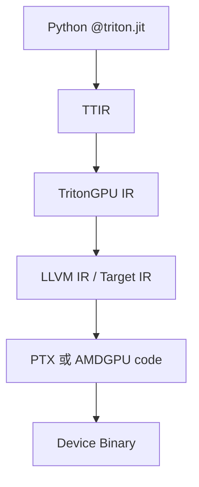
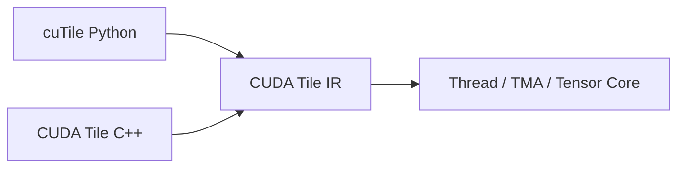

# Triton、TileLang、CUDA Tile、CuTe DSL 与 Helion

## 1. 它们不是简单的“谁替代谁”

这些系统都试图降低高性能 Kernel 的开发成本，但它们把多少决定权交给编译器并不相同。

| 工具 | 主要输入抽象 | 编译基础 | 控制粒度 | 典型优势 |
|---|---|---|---|---|
| Triton | Block Tensor / Program Instance | MLIR、LLVM 及目标后端 | 中等 | 简洁、PyTorch 生态强、适合融合 Kernel |
| TileLang | 显式 Tile、Buffer、Pipeline | TVM/TIR 体系，多后端 Dialect | 中到偏低 | Pipeline 表达直接、算子案例丰富、多后端 |
| CuTe DSL | Layout、Tensor、Copy/MMA Atom | CUTLASS Python + CUDA Toolchain | 低层、控制很细 | 紧跟 NVIDIA 新硬件、接近 CUTLASS C++ |
| CUDA Tile / cuTile | Block-local Tile 与 Tile Operation | CUDA Tile IR | 中等 | NVIDIA 官方 Tile 模型，编译器映射 Thread/TMA/Tensor Core |
| Helion | 接近 PyTorch 的 Tile Loop | TorchInductor；可选择 Triton/CuTe DSL/Pallas 等 | 较高 | 更少硬件细节、自动调优与跨硬件方向 |

MLIR = **Multi-Level Intermediate Representation（多层中间表示基础设施）**；LLVM 是通用编译器基础设施；TVM 是面向 Tensor Program 优化和代码生成的编译栈；TIR = **Tensor Intermediate Representation（张量中间表示）**。

## 2. Triton 的核心心智模型

CUDA SIMT 常从每个 Thread 的索引开始：

```cpp
int i = blockIdx.x * blockDim.x + threadIdx.x;
```

Triton 常从一个 Program Instance 负责的一块数据开始：

```python
pid = tl.program_id(0)
offsets = pid * BLOCK + tl.arange(0, BLOCK)
x = tl.load(x_ptr + offsets, mask=offsets < n)
```

开发者表达 Block Tensor 运算，编译器再决定数据如何映射到 Thread、Warp、Register 和目标指令。这提高生产率，但性能依赖编译器的 Layout、Pipeline 与目标后端能力。

### Triton 编译路线



TTIR = **Triton Intermediate Representation**。实际 Pass 和 IR 名称会随版本演进，但核心思想是逐步把 Tile 语义 Lower 到具体 GPU 的 Layout、共享内存、Barrier 和机器指令。

## 3. Triton 3.8 的信号

截至 2026-08-28，Triton 3.8.0 是 GitHub Release 页的最新版本。值得注意的方向不是单个新 API，而是：

- Multi-CTA、Multicast 和 TMA 支持继续扩大；
- 新增 FpSan 等数值检查工具；
- NVIDIA Rubin 初步支持；
- 后端、Layout 和异步内存分析持续成为核心开发区。

Triton 的优势是抽象简洁和生态，但“简洁”依赖编译器足够理解新硬件。如果编译器暂时无法表达 Blackwell 的深异步 Pipeline、TMEM 或特殊调度，手写/专用 Kernel 仍可能明显领先。

## 4. AutoWS：Triton 正在补齐显式 Warp Specialization

AutoWS = **Automatic Warp Specialization（自动 Warp 专职化）**。Meta/PyTorch 公开路线把它拆成：

1. 数据分区；
2. Software Pipeline 调度；
3. Warp Partition；
4. 分区间 Buffer 创建；
5. Memory Planner；
6. Producer–Consumer Channel 和 Barrier Lowering。

截至 2026 年初，官方文章明确说明该能力仍是实验性的、部分上游，支持 Hopper 和 Blackwell。这个事实很重要：看到某个分支上的 `warp_specialize=True`，不能默认任何 Triton/PyTorch 版本都稳定支持。

## 5. TileLang 的定位

TileLang 是 Pythonic DSL，编译基础建立在 TVM 上，重点面向 GEMM、Dequant GEMM、FlashAttention、Linear Attention 等高性能算子。与 Triton 相比，它更显式地表达：

- Shared/Local Buffer；
- Copy、GEMM 与 Pipeline；
- Layout 和目标相关原语；
- Persistent/动态调度模式。

### 2026 年版本变化

TileLang v0.1.13 于 2026-08-03 发布，Release Notes 强调：

- 多后端 Language Dialect 重构；
- CUDA、ROCm 和 Metal 后端语义重新组织；
- Blackwell SM120 的 NVF4 Block-scaled MMA；
- 更灵活的 TMEM Layout；
- Source Location 进入编译诊断；
- 删除部分 Legacy API，升级需要看兼容说明。

NVF4/NVFP4 是 NVIDIA 的 4-bit 浮点与 Block Scaling 相关格式。这里最重要的工程结论是：TileLang 仍在快速演进，适合研究和快速开发，但生产升级要固定版本、跑正确性回归并重新 Benchmark。

## 6. CuTe DSL：Python 语法，不是高层抽象

CuTe DSL 与 CuTe C++ 的编程模型接近，显式暴露 Layout、MMA Atom、Copy Atom、TMA、TMEM、Pipeline 和 Cluster。它的目标不是让开发者完全忘掉硬件，而是去掉 C++ 模板元编程负担，同时保留硬件控制。

因此它更适合：

- NVIDIA 架构专用的极致 Kernel；
- 需要直接使用最新 Tensor Core/TMA/TMEM 的场景；
- 需要与 CUTLASS Kernel 生态组合的场景。

学习成本仍高于普通 Triton，因为真正困难的是 Layout 和异步流水，而不是 Python/C++ 语法本身。

## 7. CUDA Tile / cuTile：NVIDIA 官方 Tile 模型

CUDA Tile 把 Kernel 内部的思考单位从单 Thread 转为一个 Block-local Tile。CUDA 13.3 起提供 CUDA Tile C++，Python 侧通过 cuTile；两者共用 CUDA Tile IR。



编译器负责把 Tile Operation 映射到 Thread。规则 Tile-space Load 可以 Lower 到 TMA；不规则 Gather/Scatter 则可能采用不同路径。

需要注意，2026 年的 CUDA Tile 生态仍在发展。Triton-to-CUDA-Tile-IR 的 Incubator Backend 已公开，但仓库明确列出无序内存语义、部分操作缺失、小 GEMM 性能等限制。因此“可以编译”与“已经适合替换生产后端”是两回事。

## 8. Helion：再提高一层

Helion 允许开发者使用接近 PyTorch 的运算和 Tile Loop 描述 Kernel，编译器与 Autotuner 决定 Block Size、Loop Order、Stage、Warp Specialization 等配置。

2026 年 PyTorch Foundation 的更新显示，Helion 正在扩展 CuTe DSL 和 TPU Pallas Backend，并探索 LLM-guided Autotuning。它代表另一种路线：

> 让开发者描述算法与 Tile 搜索空间，由系统选择 Triton、CuTe DSL 或其他后端。

这种路线可以提高可移植性，但代价是更大的搜索空间、编译时间，以及对编译器 Cost Model 的更高依赖。

## 9. 社区中常见的三种观点

以下是根据项目设计文档、Release Notes 和维护者文章归纳的观点，不代表社区投票结果。

### 观点 A：Triton 是大多数 AI Kernel 的最佳起点

理由是代码简洁、与 PyTorch/Inductor 集成好、实验迭代快。反方担忧是最新架构能力进入通用编译器需要时间，极限性能仍可能落后于专用实现。

### 观点 B：复杂新 GPU 必须保留低层控制

CUTLASS/CuTe DSL 路线认为 Layout、TMA/TMEM、Cluster 和 Pipeline 不能完全隐藏，否则难以达到架构上限。反方指出这提高学习和维护成本，并强化厂商绑定。

### 观点 C：最终应由更高层编译器和 Autotuner 选择后端

PyTorch Inductor、Helion 等路线希望用户描述语义，由编译器在 Triton、ATen、CuTe DSL 等候选间选择。挑战是动态 Shape、编译成本、正确性和性能回归。

## 10. 实用选型规则

- 先用 PyTorch 原生/编译器生成实现建立正确性基线。
- 标准 GEMM 优先测试 Vendor Library。
- 自定义融合与快速迭代优先尝试 Triton。
- 明确需要手工 Pipeline、TMA/TMEM 或 NVIDIA 最新特性时考虑 CuTe DSL/CUTLASS。
- 需要多后端或已有 TileLang 算子资产时评估 TileLang。
- 无论选谁，都保留 Eager Reference、误差测试、固定 Shape Benchmark 和端到端 Benchmark。

## 11. 资料

- [Triton 3.8 Releases](https://github.com/triton-lang/triton/releases)
- [Triton Warp Specialization Roadmap](https://pytorch.org/blog/warp-specialization-in-triton-design-and-roadmap/)
- [TileLang Documentation](https://tilelang.com/)
- [TileLang Releases](https://github.com/tile-ai/tilelang/releases)
- [CUTLASS CuTe DSL](https://docs.nvidia.com/cutlass/latest/overview.html)
- [CUDA Tile Kernels](https://docs.nvidia.com/cuda/cuda-programming-guide/02-basics/writing-tile-kernels.html)
- [Triton CUDA Tile IR Incubator](https://github.com/triton-lang/Triton-to-tile-IR)
- [PyTorch Foundation: Helion Updates](https://pytorch.org/blog/driving-the-future-of-open-source-ai-an-update-from-pytorch-foundation-projects/)

