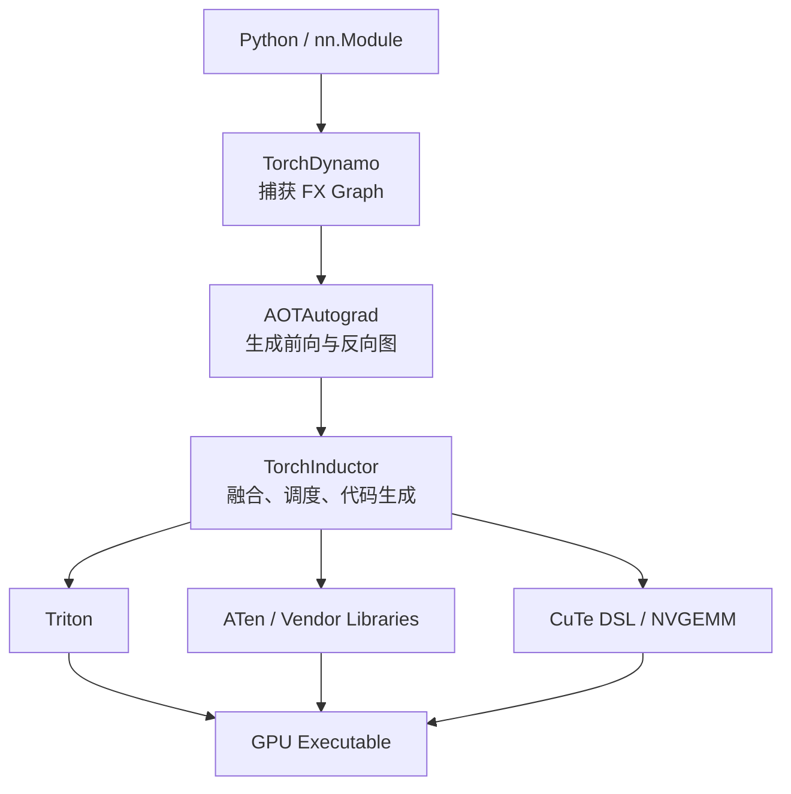

# PyTorch 编译栈：从 Python 模型到高性能 Kernel

<!-- learning-position -->
> **学习定位**：A1→A8 · 分层必修。
> **前置**：[基础课程](<../00_Foundations/README.md>)。
> **首读/二读**：首读 eager/compile、fusion、graph break、冷启动；编译器内部二读。
> **进度与实验**：[学习清单](<../学习清单.md>) · [总入口](<../README.md>)。
<!-- /learning-position -->

## 1. `torch.compile` 编译的不是“整个 Python 程序”

`torch.compile(model)` 的核心目标，是从动态 Python 执行中捕获可编译的 Tensor 计算区域，构造 Graph（计算图），对前向和反向做变换，再交给 Backend 生成或选择高性能实现。



FX 是 PyTorch 用于表示 Python 可追踪计算的图结构；AOT = **Ahead-Of-Time（提前）**。这里的 AOTAutograd 指在执行生成代码前，先把 Autograd（自动微分）需要的前向/反向图捕获出来。

## 2. TorchDynamo：从动态 Python 中抓图

TorchDynamo 利用 CPython Frame Evaluation 机制观察 Python Bytecode，在不要求用户重写模型的情况下，把连续的 Tensor 操作提取为 FX Graph。

它必须同时维护 Guard（守卫条件），例如：

- Tensor 的 Dtype；
- Device；
- Rank 与 Shape 条件；
- 某些 Python 全局/局部值；
- 控制流相关条件。

下次运行 Guard 成立，可以复用已编译代码；Guard 失效，则可能重新编译。

## 3. Graph Break 为什么发生？

Graph Break（图中断）表示 Dynamo 无法或不应继续把后续 Python 放入同一张图，于是先结束当前 Graph，执行一段 Eager Python，再从后面重新捕获。

常见原因：

- Tensor 数据驱动的 Python 控制流；
- 不支持的 Python/C 扩展操作；
- `.item()` 把 Tensor 值取回 Python；
- 难以追踪的副作用；
- 显式禁用编译的函数。

Graph Break 不一定导致错误，但会减少 Fusion、增加 Launch、引入同步，并可能造成 Recompile。

### 例子

```python
def f(x):
    if x.sum().item() > 0:
        return x.sin()
    return x.cos()
```

`.item()` 需要把设备上的结果变成 Python Scalar，通常会形成同步与捕获边界。更适合图编译的表达可能是 `torch.cond` 或 Tensor 化选择，但应根据语义和版本支持判断。

## 4. AOTAutograd：为什么反向图也要捕获？

Eager Autograd 在运行前向时动态记录操作，再逐个执行反向。AOTAutograd 先把前向和反向表示为可编译 Graph，使编译器可以：

- 跨多个反向算子 Fusion；
- 重新决定保存或重算哪些中间值；
- 对前向/反向分别生成 Kernel；
- 将 Custom Backend 用于训练。

这不意味着所有 Activation 自动消失。编译器仍需在保存、重算、显存和计算之间取舍。

## 5. TorchInductor 做什么？

TorchInductor 是默认编译后端，负责：

- Loop/Tensor IR 变换；
- Fusion；
- Layout 与 Buffer 规划；
- 选择 External Kernel 或生成 Kernel；
- Autotune 多个候选；
- 生成 CPU 或 Accelerator 代码。

在 NVIDIA/AMD GPU 上，Triton 长期是重要生成后端，但不能把 Inductor 简化为“Triton 包装器”。Inductor 也会调用 ATen、cuBLAS/cuDNN、Custom Kernel；PyTorch 2.14 又加入 NVGEMM/CuTe DSL 候选。

ATen 是 PyTorch 底层 Tensor Operator Library；cuDNN = **CUDA Deep Neural Network library（CUDA 深度神经网络库）**。

## 6. Fusion 是怎样发生的？

假设 Eager 图为：

```text
Linear → Bias → GELU → Dropout
```

编译器可能：

- 把 Bias/GELU 融合进 GEMM Epilogue；
- 把 Pointwise 操作融合成 Triton Kernel；
- 直接选择已经支持 Fusion 的外部库；
- 因为动态性或资源压力而只做部分 Fusion。

所以“用了 `torch.compile`”并不保证形成一个 Kernel。要查看生成代码、Profiler Timeline 和最终 Launch 数。

## 7. Dynamic Shape 与 Recompile

如果每次输入 Sequence Length 不同，编译器可能：

1. 每个 Shape 特化一份代码，性能好但编译多；
2. 生成带符号 Shape 的通用代码，减少编译但优化空间可能下降；
3. 对 Shape 建立范围或可整除 Guard。

PyTorch 2.14 引入更声明式的 Dynamic Shape 规范，并在 `torch.compile`、`torch.export` 和 `make_fx` 之间共享方向。生产中仍需要统计真实 Shape 分布，而不是简单把 `dynamic=True` 当作万能开关。

## 8. JIT 与 AOTInductor

JIT = **Just-In-Time（即时编译）**：运行时遇到 Graph/Shape 后编译，适合动态研究环境，但首次请求有编译开销。

AOTInductor 则以 `torch.export` 捕获的 Graph 为输入，提前生成部署 Artifact，减少生产环境运行时对 Python 和即时编译的依赖。

两者选择与场景有关：

- 训练/研究：JIT 更灵活；
- 固定模型部署：AOT 更利于启动、封装与版本控制；
- 高动态 Agent/Serving：可能需要 Shape Bucketing、Cache 和部分动态编译的组合。

## 9. PyTorch 2.14 的重要变化

截至 2026-09-02 的 PyTorch 2.14 Release：

- NVGEMM 把 CuTe DSL 生成的 CUTLASS Kernel 加入 Inductor；
- 候选可与 Triton、ATen 一起 Autotune；
- Inductor 增加 Rubin `sm_107` 目标；
- `torch.while_loop` 可被 CUDA Graph 捕获；
- Dynamic Shape 表达继续统一。

这说明 Compiler Stack 正从“Fusion + Triton Codegen”走向“多 Kernel Provider 的选择与组合系统”。

## 10. 调试顺序

遇到 `torch.compile` 性能或正确性问题，按层排查：

1. Dynamo：是否 Graph Break 或频繁 Recompile？
2. AOTAutograd：前后向捕获是否成功？保存了哪些 Tensor？
3. Inductor：Fusion、Layout、Kernel Choice 是否合理？
4. Backend：Triton/Library/CuTe Kernel 本身是否快？
5. Runtime：Compile Cache、Launch、CUDA Graph、同步是否成为瓶颈？

不要一上来只分析最终 PTX；很多问题在 Graph Break 或错误 Kernel Choice 时已经决定。

## 11. 资料

- [PyTorch torch.compiler documentation](https://docs.pytorch.org/docs/stable/user_guide/torch_compiler/torch.compiler.html)
- [PyTorch Compiler Troubleshooting](https://docs.pytorch.org/docs/stable/user_guide/torch_compiler/torch.compiler_troubleshooting.html)
- [AOTInductor](https://docs.pytorch.org/docs/stable/user_guide/torch_compiler/torch.compiler_aot_inductor.html)
- [PyTorch 2.14 Release](https://pytorch.org/blog/pytorch-2-14-release-blog/)
