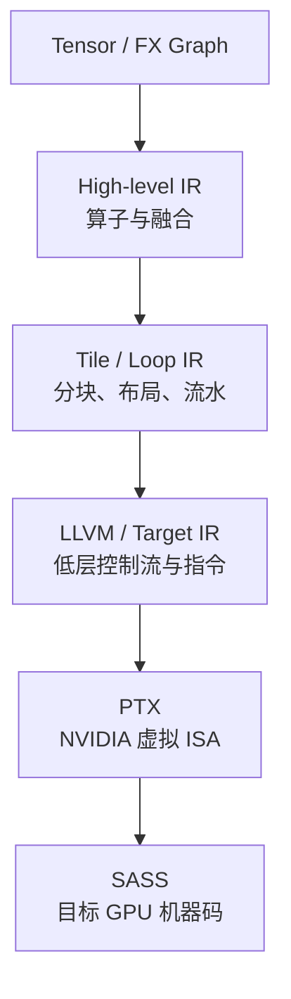

# IR、PTX、SASS 与编译模式

## 1. 为什么需要多层 IR？

IR = **Intermediate Representation（中间表示）**。高层 Graph 适合做算子融合和代数化简；Tile IR 适合做 Layout、Pipeline 和内存规划；低层 IR 适合指令选择与寄存器分配。没有单一 IR 能同时优雅表达所有优化。



ISA = **Instruction Set Architecture（指令集架构）**。

## 2. PTX 不是 GPU 最终直接执行的代码

PTX 是 NVIDIA 定义的虚拟 ISA。它比 CUDA C++ 低层，但通常还需要由 `ptxas` 或 Driver JIT 转成目标 GPU 的机器码。SASS 则是常用工具对 NVIDIA 原生机器指令的表示名称。

因此：

```text
CUDA/Triton/CuTe DSL
        ↓
       PTX
        ↓ ptxas 或 Driver JIT
   cubin 中的 SASS
        ↓
      GPU 执行
```

cubin 是包含 CUDA Device Binary 的容器格式。Fatbin 可以同时包含多个架构的 cubin 和/或 PTX，以便在不同 GPU 上选择或 JIT。

## 3. `nvcc` 做了什么？

CUDA C++ 文件同时包含 Host 和 Device 代码。`nvcc` 是编译驱动：

- 分离/协调 Host 与 Device 编译；
- Host 部分交给系统 C++ 编译器；
- Device 部分经过 NVIDIA 编译流程生成 PTX/cubin；
- 最终链接 Host Runtime Stub 和 Device Code。

所以不是普通 `g++` 独立理解 `<<<grid, block>>>` 语法并生成 GPU Kernel；需要 CUDA 编译工具链参与。

## 4. Compute Capability 与目标架构

Compute Capability（计算能力）用 `sm_xy` 标记 NVIDIA 架构能力，例如 Hopper 常见 `sm_90`，B200/GB200 为 `sm_100`，B300/GB300 为 `sm_103`，不同 Blackwell 产品还可能是 `sm_120/121`。

编译时要区分：

- Virtual Architecture，例如 `compute_90`；
- Real Architecture，例如 `sm_90`。

只带 PTX 可能让未来 Driver JIT，但新架构兼容不等于能自动获得最佳新指令和调度。为目标 GPU 重新编译通常更可靠。

## 5. AOT、JIT 与 Cache

### AOT

AOT = **Ahead-Of-Time（提前编译）**。部署前生成目标代码，启动快、产物稳定，但对未知 Shape/架构适应性较弱。

### JIT

JIT = **Just-In-Time（即时编译）**。运行时根据 Shape、Dtype、Meta-parameter 和目标 GPU 生成代码。Triton 和许多 Python DSL 大量使用 JIT。

### Cache

JIT 通常依赖 Compile Cache。Cache Key 必须包含真正影响代码的参数，例如：

- Kernel 源码和依赖；
- Dtype、Constant、Meta-parameter；
- GPU Architecture；
- Compiler/Driver 相关信息。

Cache Key 不完整可能错误复用；过于敏感则导致 Cache 爆炸。多进程共享网络文件系统上的 Cache 还可能遇到并发写入和一致性问题。

## 6. MLIR 与 LLVM 的关系

MLIR 不是单一固定 IR，而是构建多层 Dialect（方言）和 Lowering Pass 的基础设施。Triton 可在其中定义 TTIR/TritonGPU 等语义，再逐步 Lower。LLVM IR 更接近通用低层优化和目标代码生成。

不要把路线记成永远固定的：

```text
Triton → MLIR → LLVM → PTX
```

更准确的是：Triton 使用 MLIR 基础设施承载若干自定义 Dialect，并根据 Backend 选择 Lowering 路线；NVIDIA 路线可能进入 LLVM/NVPTX 或 CUDA Tile IR 等后端。具体 Pass 会随版本变化。

## 7. CUDA Tile IR 为什么值得关注？

CUDA Tile IR 让前端表达 Tile 语义，由 NVIDIA 编译器进一步映射 Thread、TMA 和 Tensor Core。CUDA Tile Python/C++ 共享这一后端；Triton 也出现独立的 CUDA Tile IR Incubator Backend。

它可能降低每个 DSL 单独追赶新硬件指令的成本，但也引入新的边界：内存模型、支持算子、调优参数和 Debug Tool 是否成熟。截至 2026 年，Incubator 仓库仍明确列出功能与性能限制，因此应把它视为重要方向而非已经统一所有后端的事实标准。

## 8. 编译器到底决定了哪些性能？

- Fusion 边界；
- Tile Shape；
- Thread/Warp Layout；
- Vectorization；
- Register Allocation；
- Shared Memory 规划；
- Software Pipeline Stage；
- Instruction Selection；
- Library/Kernel Candidate；
- 是否使用 TMA、Tensor Core、TMEM 等能力。

但编译器无法改变算法必要的数据量，也无法修复错误的端到端并行策略。Kernel 编译优化只是 AI Infra 性能链的一层。

## 9. 怎样查看中间产物？

不同工具命令会随版本变化，但思路稳定：

1. 保存 Graph/IR；
2. 保存生成的 CUDA/Triton/LLVM/PTX；
3. 使用 `cuobjdump` 或 `nvdisasm` 查看 cubin/SASS；
4. 对照 Nsight Compute 的 Source/Instruction 指标；
5. 把指令层发现重新映射到 Layout、Pipeline 和 Graph Choice。

只看 SASS 很容易陷入细节。除非已经证明单 Kernel 是瓶颈，否则优先从端到端 Timeline 向下钻取。

## 10. 资料

- [CUDA Compiler Driver NVCC](https://docs.nvidia.com/cuda/cuda-compiler-driver-nvcc/)
- [PTX ISA](https://docs.nvidia.com/cuda/parallel-thread-execution/)
- [CUDA Binary Utilities](https://docs.nvidia.com/cuda/cuda-binary-utilities/)
- [Triton Repository](https://github.com/triton-lang/triton)
- [Triton CUDA Tile IR Backend](https://github.com/triton-lang/Triton-to-tile-IR)

