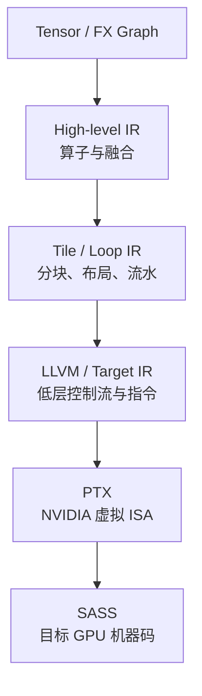

# IR、PTX、SASS 与编译模式

<!-- learning-position -->
> **学习定位**：A1→A8 · 分层必修。
> **前置**：[基础课程](<../00_Foundations/README.md>)。
> **首读/二读**：首读源码→PTX→SASS、JIT/AOT、架构兼容；IR/LLVM 深入参考。
> **进度与实验**：[学习清单](<../学习清单.md>) · [总入口](<../README.md>)。
<!-- /learning-position -->

## 1. 为什么需要多层 IR？

IR = **Intermediate Representation（中间表示）**。高层 Graph 适合做算子融合和代数化简；Tile IR 适合做 Layout、Pipeline 和内存规划；低层 IR 适合指令选择与寄存器分配。没有单一 IR 能同时优雅表达所有优化。



ISA = **Instruction Set Architecture（指令集架构）**。

## 2. PTX 不是 GPU 最终直接执行的代码

PTX 是 NVIDIA 定义的虚拟 ISA。它比 CUDA C++ 低层，但通常还需要由 `ptxas` 或 Driver JIT 转成目标 GPU 的机器码。SASS 则是常用工具对 NVIDIA 原生机器指令的表示名称。

因此：

```text
CUDA/Triton/CuTe DSL
        ↓
       PTX
        ↓ ptxas 或 Driver JIT
   cubin 中的 SASS
        ↓
      GPU 执行
```

cubin 是包含 CUDA Device Binary 的容器格式。Fatbin 可以同时包含多个架构的 cubin 和/或 PTX，以便在不同 GPU 上选择或 JIT。

## 3. `nvcc` 做了什么？

CUDA C++ 文件同时包含 Host 和 Device 代码。`nvcc` 是编译驱动：

- 分离/协调 Host 与 Device 编译；
- Host 部分交给系统 C++ 编译器；
- Device 部分经过 NVIDIA 编译流程生成 PTX/cubin；
- 最终链接 Host Runtime Stub 和 Device Code。

所以不是普通 `g++` 独立理解 `<<<grid, block>>>` 语法并生成 GPU Kernel；需要 CUDA 编译工具链参与。

## 4. Compute Capability 与目标架构

Compute Capability（计算能力）用 `sm_xy` 标记 NVIDIA 架构能力，例如 Hopper 常见 `sm_90`，B200/GB200 为 `sm_100`，B300/GB300 为 `sm_103`，不同 Blackwell 产品还可能是 `sm_120/121`。

编译时要区分：

- Virtual Architecture，例如 `compute_90`；
- Real Architecture，例如 `sm_90`。

只带 PTX 可能让未来 Driver JIT，但新架构兼容不等于能自动获得最佳新指令和调度。为目标 GPU 重新编译通常更可靠。

## 5. AOT、JIT 与 Cache

### AOT

AOT = **Ahead-Of-Time（提前编译）**。部署前生成目标代码，启动快、产物稳定，但对未知 Shape/架构适应性较弱。

### JIT

JIT = **Just-In-Time（即时编译）**。运行时根据 Shape、Dtype、Meta-parameter 和目标 GPU 生成代码。Triton 和许多 Python DSL 大量使用 JIT。

### Cache

JIT 通常依赖 Compile Cache。Cache Key 必须包含真正影响代码的参数，例如：

- Kernel 源码和依赖；
- Dtype、Constant、Meta-parameter；
- GPU Architecture；
- Compiler/Driver 相关信息。

Cache Key 不完整可能错误复用；过于敏感则导致 Cache 爆炸。多进程共享网络文件系统上的 Cache 还可能遇到并发写入和一致性问题。

## 6. MLIR 与 LLVM 的关系

MLIR 不是单一固定 IR，而是构建多层 Dialect（方言）和 Lowering Pass 的基础设施。Triton 可在其中定义 TTIR/TritonGPU 等语义，再逐步 Lower。LLVM IR 更接近通用低层优化和目标代码生成。

不要把路线记成永远固定的：

```text
Triton → MLIR → LLVM → PTX
```

更准确的是：Triton 使用 MLIR 基础设施承载若干自定义 Dialect，并根据 Backend 选择 Lowering 路线；NVIDIA 路线可能进入 LLVM/NVPTX 或 CUDA Tile IR 等后端。具体 Pass 会随版本变化。

## 7. CUDA Tile IR 为什么值得关注？

CUDA Tile IR 让前端表达 Tile 语义，由 NVIDIA 编译器进一步映射 Thread、TMA 和 Tensor Core。CUDA Tile Python/C++ 共享这一后端；Triton 也出现独立的 CUDA Tile IR Incubator Backend。

它可能降低每个 DSL 单独追赶新硬件指令的成本，但也引入新的边界：内存模型、支持算子、调优参数和 Debug Tool 是否成熟。截至 2026 年，Incubator 仓库仍明确列出功能与性能限制，因此应把它视为重要方向而非已经统一所有后端的事实标准。

## 8. 编译器到底决定了哪些性能？

- Fusion 边界；
- Tile Shape；
- Thread/Warp Layout；
- Vectorization；
- Register Allocation；
- Shared Memory 规划；
- Software Pipeline Stage；
- Instruction Selection；
- Library/Kernel Candidate；
- 是否使用 TMA、Tensor Core、TMEM 等能力。

但编译器无法改变算法必要的数据量，也无法修复错误的端到端并行策略。Kernel 编译优化只是 AI Infra 性能链的一层。

## 9. 怎样查看中间产物？

不同工具命令会随版本变化，但思路稳定：

1. 保存 Graph/IR；
2. 保存生成的 CUDA/Triton/LLVM/PTX；
3. 使用 `cuobjdump` 或 `nvdisasm` 查看 cubin/SASS；
4. 对照 Nsight Compute 的 Source/Instruction 指标；
5. 把指令层发现重新映射到 Layout、Pipeline 和 Graph Choice。

只看 SASS 很容易陷入细节。除非已经证明单 Kernel 是瓶颈，否则优先从端到端 Timeline 向下钻取。

## 10. 资料

- [CUDA Compiler Driver NVCC](https://docs.nvidia.com/cuda/cuda-compiler-driver-nvcc/)
- [PTX ISA](https://docs.nvidia.com/cuda/parallel-thread-execution/)
- [CUDA Binary Utilities](https://docs.nvidia.com/cuda/cuda-binary-utilities/)
- [Triton Repository](https://github.com/triton-lang/triton)
- [Triton CUDA Tile IR Backend](https://github.com/triton-lang/Triton-to-tile-IR)


<a id="notebook-04"></a>

## 学习问答：原笔记 §04

### 04｜从 nvcc 编译到 Kernel Launch：CUDA 代码是怎么真正“联通” GPU 的？

问题：为什么 `vector_add<<<4096,256>>>` 普通 C++ 编译器不能直接处理？是不是 nvcc 编译后才“接上 CUDA 环境”？

#### 核心结论

- nvcc 是 CUDA Compiler Driver（CUDA 编译驱动器）。它识别 CUDA C++ 扩展语法，例如 `__global__`、`__device__`、`<<< >>>`，并组织 Host Code 与 Device Code 的编译流程。

- Host 部分通常仍由系统 C++ 编译器（g++ / clang++ / MSVC）处理；Device 部分会生成 PTX 和/或机器代码 cubin，并被打包进最终程序。

- 真正运行时与 GPU 打交道的是 CUDA Runtime / CUDA Driver / NVIDIA 驱动栈。不能把“nvcc”理解成运行时负责 GPU 调度的组件。

- 普通 g++ 通常无法直接编译带 CUDA 扩展语法的 .cu 代码；但也不是世界上只有 nvcc 能编译 CUDA，例如 Clang 也具备 CUDA 编译支持。


```text
CUDA .cu 文件
│
┌───────────┴───────────┐
│ │
Host Code Device Code
│ │
g++ / clang++ / MSVC CUDA device compiler
│ PTX / cubin / fatbin
└───────────┬───────────┘
↓
可执行程序
↓ 运行时
CUDA Runtime API
↓
CUDA Driver
↓
GPU
```


#### PTX / cubin / SASS：编译产物与运行时不要混为一谈

Device Code 不等于“交给 CUDA Runtime 后就直接执行”。更准确的编译/装载关系是：高级 CUDA/Kernel 描述经过编译与 lowering，得到 PTX 和/或面向具体 GPU 架构的 binary；最终 GPU 执行的是架构相关机器指令（SASS）。CUDA Runtime / Driver 负责 Host 侧 API、加载与 launch，而不是 GPU ISA 本身。

```text
CUDA C++ / Kernel DSL
        ↓
PTX（虚拟 GPU ISA，可选中间层）
        ↓ ptxas / Driver JIT
cubin / machine code
        ↓
SASS
        ↓
GPU
```

Triton、TileLang、CUTLASS 与 cuBLAS 的位置会在 07 章统一展开。

#### Kernel Launch 并不是“CPU 创建一百万个 GPU Thread”

CPU 执行 `vector_add<<<4096,256>>>`(...) 时，更接近向 CUDA Runtime/Driver 提交一个紧凑的 Launch 描述：Kernel 是哪个、GridDim 是多少、BlockDim 是多少、参数在哪里、动态 Shared Memory 多大、进入哪个 Stream。GPU 根据这些元数据自行展开和分派 Block。

| **Launch 参数**          | **含义**                                       |
|--------------------------|------------------------------------------------|
| gridDim                  | Grid 中有多少个 Block；可为 1D/2D/3D           |
| blockDim                 | 每个 Block 中有多少个 Thread；可为 1D/2D/3D    |
| dynamicSharedMemoryBytes | 每个 Block 额外申请的动态 Shared Memory 字节数 |
| stream                   | 这次工作进入哪条 CUDA Stream                   |

```cpp
vector_add<<<gridDim, blockDim, dynamicSharedMemoryBytes, stream>>>(...);
```

#### 为什么说 Kernel Launch 通常是异步的？

Host 侧把工作 enqueue 到某个 CUDA Stream 后，CPU 通常可以继续往下执行；GPU 按 Stream 的依赖关系执行。cudaDeviceSynchronize() 才是显式要求 Host 等待此前 GPU 工作完成。注意“入队顺序、Stream 语义、是否同步”与“Block 如何被分配到 SM”是不同层次的问题。

> **完整链路：**编译阶段决定代码形态；Kernel Launch 描述逻辑工作量；Runtime/Driver 把命令入队；GPU Front End/CTA 分配逻辑把 Block 放入有资源的 SM；SM 内 Warp Scheduler 再把 Eligible Warp 的下一条指令 Issue 到执行管线。


<a id="notebook-07-02"></a>

## 07.2｜PTX、cubin、SASS：Kernel 最终到底被编译成什么？


一个容易出现的错误说法是：“Triton 编译成 CUDA Runtime 可以执行的代码。”

更准确的是：**CUDA Runtime 负责 API 与运行时提交，不是 GPU ISA。GPU 最终执行的是架构相关机器指令。**

```text
高级 Kernel 描述
│
▼
PTX
│
▼
ptxas / JIT
│
▼
cubin（包含 GPU machine code 的 binary container）
│
▼
SASS（GPU 真正执行的机器指令）
│
▼
GPU
```

- **PTX（Parallel Thread Execution）**：NVIDIA 的虚拟 GPU ISA / 中间表示，可再针对具体 GPU 架构生成机器代码。
- **cubin**：保存已编译 GPU binary 的容器形式之一。
- **SASS**：具体 NVIDIA GPU 架构真正执行的机器指令。

因此 `CUDA Runtime`、`PTX`、`SASS` 不属于同一类概念：

```text
CUDA Runtime：运行时软件接口
PTX：虚拟 ISA / 中间层
SASS：真实 GPU ISA 机器指令
```

---
