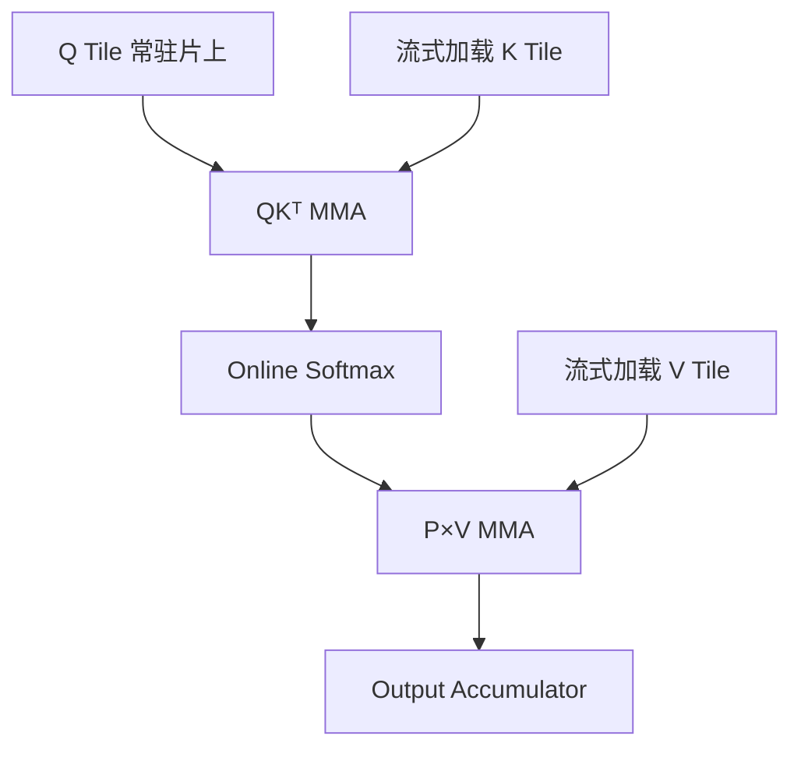
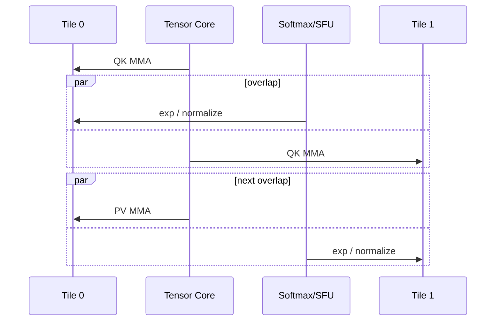
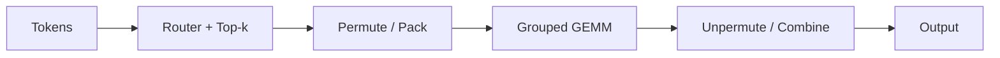

# 案例：FlashAttention 与 MoE Grouped GEMM

这两个案例分别代表规则但数据移动昂贵的 Dense Attention，以及 Shape 不规则、负载动态的 MoE。它们能把本专题的大部分概念串起来。

## Part A｜FlashAttention

### 1. 标准 Attention 的问题不只是 $O(S^2)$ 计算

Scaled Dot-Product Attention（缩放点积注意力）为：

$$
O=\operatorname{softmax}\left(\frac{QK^T}{\sqrt d}\right)V
$$

若按多个独立 Kernel 执行，会物化 $S\times S$ 的 Score/Probability 矩阵，并在 HBM 间反复读写。即使 FLOPs 没变，HBM Traffic 也会成为瓶颈。

FlashAttention 的核心不是“近似 Attention”，而是通过 Tiling 和 Online Softmax，在片上逐块计算并避免保存完整 Score Matrix。

### 2. Online Softmax 为什么允许分块？

对一行 Score $x$，稳定 Softmax 使用最大值：

$$
m=\max_j x_j,\qquad l=\sum_j e^{x_j-m}
$$

$$
\operatorname{softmax}(x_j)=\frac{e^{x_j-m}}{l}
$$

当读入新 Tile 时，可以更新全局最大值和归一化和，并按新最大值重新缩放已有 Accumulator。因此无需一次把整行 Score 放入 HBM。

直觉上像记账：每次只拿到一批商品，也能维护“当前最高价格”和“相对当前最高价格的总权重”；发现更高价格时，把旧账按比例换算即可。

### 3. 数据路径



关键收益来自：

- 不物化完整 $S\times S$ Matrix；
- 融合 QK、Mask、Softmax、PV；
- 在 Register/Shared Memory/TMEM 中复用；
- 让数据搬运、MMA、Softmax 重叠。

### 4. 为什么 FlashAttention-4 需要新的实现思路？

Blackwell Tensor Core 更快，并引入 TMEM 与更完整异步能力。问题是 SFU（Special Function Unit，特殊函数单元）执行 `exp` 等操作的速度没有按同样比例提升，于是 Softmax 相对成本变大。

FlashAttention-4 的设计需要深层异步流水和 Warp Specialization：一组 Warp 编排 Load/MMA，另一组执行寄存器中的 Softmax；通过两组 Tile Ping-pong，让一组做矩阵乘时另一组做指数运算。



PyTorch 2026 年的 FlexAttention 集成说明了另一个趋势：研究者在高层写 `score_mod`/`mask_mod`，系统把修改函数编译为 CuTe DSL，并 JIT 实例化 FlashAttention-4 Kernel。官方报告在 Compute-bound Workload 上相对旧 Triton Backend 有 1.2–3.2 倍提升，但也明确标注仍是活跃开发代码，需要核对 Nightly 与 FlashAttention 版本兼容。

### 5. 这个案例告诉我们什么？

- 算法复杂度相同，不代表 I/O 复杂度相同。
- 硬件一个单元变快后，瓶颈会转移到另一单元。
- 通用 DSL 的表达能力和专用 Kernel 的峰值性能之间存在现实张力。
- 高层可编程性可以通过“生成修改函数 + 实例化专用 Skeleton”与低层 Kernel 结合，而不一定由编译器从零生成所有代码。

## Part B｜MoE Grouped GEMM

### 6. MoE 的计算为何不规则？

MoE = **Mixture of Experts（混合专家）**。Router（路由器）为每个 Token 选择少数专家。若 Batch 中共有 $T$ 个 Token、$E$ 个专家，专家负载为：

$$
T_0,T_1,\ldots,T_{E-1},\qquad \sum_e T_e=kT
$$

$k$ 是每个 Token 激活的专家数。即使平均负载为 $kT/E$，实际 $T_e$ 也可能严重不均。

每个专家执行：

$$
Y_e=X_eW_e
$$

其中 $X_e$ 的第一维就是动态的 $T_e$。

### 7. 完整 MoE 本地计算链



多 GPU Expert Parallelism 中，还会在 Pack 与 GEMM 周围出现 AllToAll 通信。因此只测 Grouped GEMM 可能掩盖 Permute、元数据构建、通信和负载不均。

### 8. 为什么大 GEMM 的最佳策略不能直接用于 MoE？

规则大 GEMM 通常有足够多 M/N Tile 覆盖所有 SM。MoE 的某些专家只有少量 Token：

- $M=T_e$ 很小；
- 不同专家 Shape 不同；
- Tail Tile 浪费明显；
- 静态 CTA 分配可能导致部分 SM 提前空闲；
- 多个小 GEMM 的 Launch 成本占比上升。

因此需要 Grouped Scheduling、Persistent CTA、Stream-K 或 Multi-stream 等策略。

### 9. 一个具体负载例子

假设 8 个专家收到 Token 数：

```text
[512, 480, 33, 29, 18, 9, 5, 2]
```

若 CTA Tile 的 M 是 128，则前两个专家有较多完整 Tile，后六个专家大量 Tail。若静态按专家平均分 SM，处理前两个专家的 SM 会成为 Straggler（拖尾者）。Persistent Kernel 可以让 CTA 完成一个 Tile 后继续从全局队列领取下一个 Tile，从而缓解静态不均。

但如果每次领任务都要 Atomic，且每个 Tile 很小，调度开销也可能明显。更好的实现可能分层处理：大专家使用高效专用 GEMM，小专家合并或放入 Grouped/Persistent 路径。

### 10. PyTorch `grouped_mm` 与 Transformer Engine `grouped_gemm`

接口名相似不代表永远使用同一 Backend 或性能固定。到 2026 年，PyTorch/torchao 已经在探索 MXFP8 Grouped MM 训练，Inductor 也能调优更多 CuTe DSL/NVGEMM 候选。Transformer Engine 则持续提供 NVIDIA 架构和低精度训练优化。

正确对比方法是固定：

- PyTorch、CUDA、Transformer Engine/CUTLASS 版本；
- GPU 型号和功耗/频率；
- 完整 $T_e$ 分布而非只给平均值；
- Dtype、Scale Granularity、Padding；
- 是否包含 Pack/Unpack；
- Warmup 和同步方式；
- 前向、反向、权重梯度分别测量。

### 11. 两个案例的统一结论

| 维度 | FlashAttention | MoE Grouped GEMM |
|---|---|---|
| 主要不规则性 | 序列长度、Mask、Softmax | 专家 Token 数、动态路由 |
| 核心瓶颈 | HBM I/O、MMA 与 Softmax 流水 | 小/不规则 GEMM、调度、通信 |
| 核心手段 | Tiling、Online Softmax、Fusion | Grouped/Persistent Scheduling、Load Balance |
| 新硬件影响 | TMEM、异步 MMA、SFU 相对变慢 | FP4/FP8、TMEM、Dynamic Persistent Scheduler |
| 端到端陷阱 | 只测 Kernel 忽略布局/Mask | 只测 GEMM 忽略 Permute/AllToAll |

## 12. 资料

- [FlashAttention paper](https://arxiv.org/abs/2205.14135)
- [FlashAttention-2 paper](https://arxiv.org/abs/2307.08691)
- [FlashAttention-3 paper](https://arxiv.org/abs/2407.08608)
- [FlexAttention + FlashAttention-4](https://pytorch.org/blog/flexattention-flashattention-4-fast-and-flexible/)
- [CUTLASS Grouped GEMM examples and changelog](https://docs.nvidia.com/cutlass/latest/CHANGELOG.html)
- [PyTorch torchao quantized training](https://docs.pytorch.org/ao/stable/workflows/training.html)

