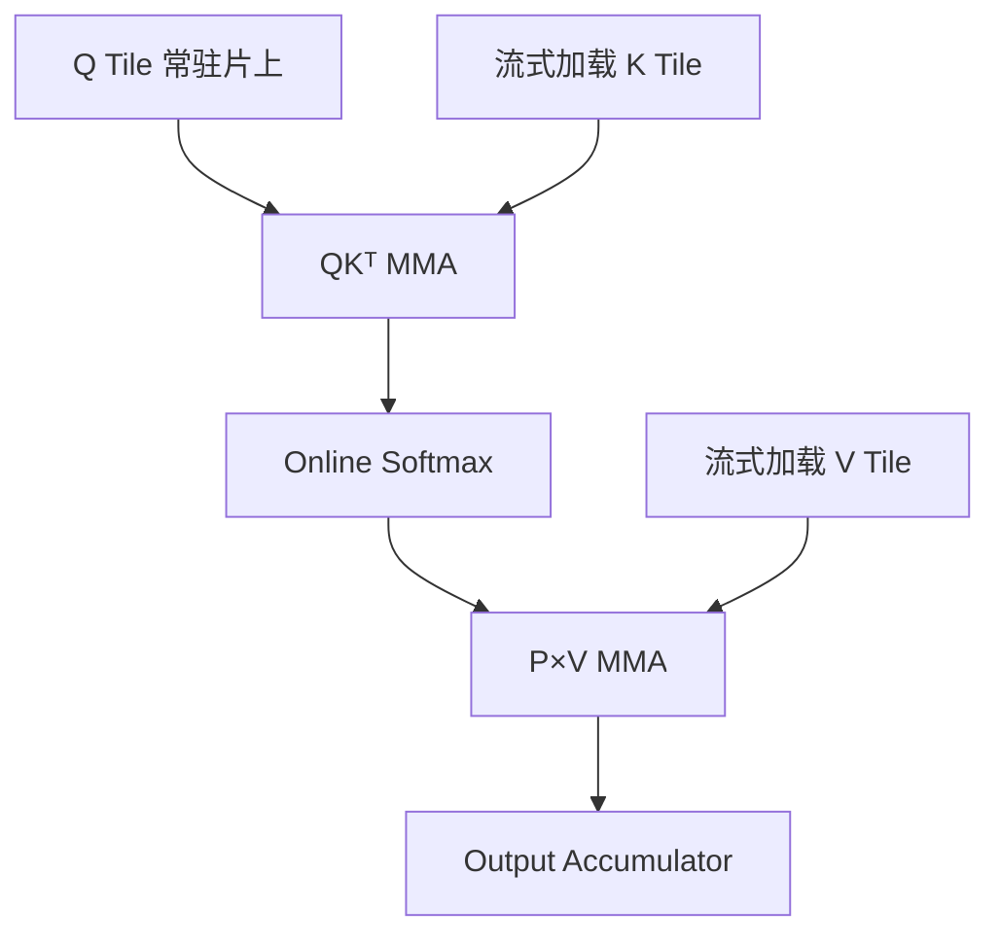
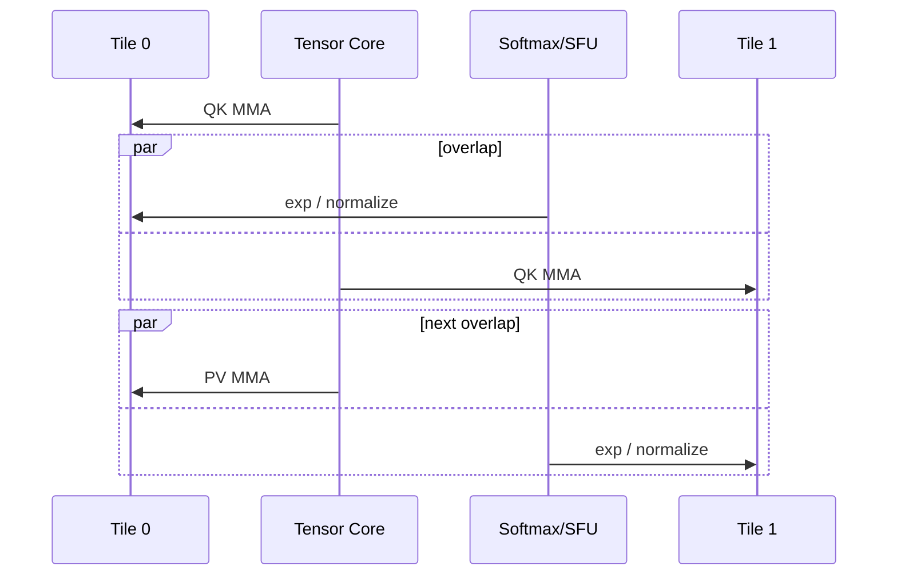
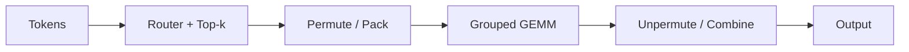

# 案例：FlashAttention 与 MoE Grouped GEMM

<details>
<summary>本篇分段导航：按首读范围进入，其余二读</summary>

- [Part A｜FlashAttention](#read-01)
- [Part B｜MoE Grouped GEMM](#read-02)
- [12. 资料](#read-03)
- [07.7｜MoE 为什么天然需要 Grouped GEMM？](#read-04)
- [07.8｜不用 Grouped GEMM：最朴素是 Sequential GEMM](#read-05)
- [07.9｜第二条路线：Multi-stream GEMM](#read-06)
- [07.10｜第三条路线：真正的单个 Grouped GEMM Kernel](#read-07)
- [07.11｜为什么“一个 Grouped GEMM Kernel”反而可能输给 Multi-stream cuBLAS？](#read-08)
- [07.12｜PyTorch `grouped_mm` vs Transformer Engine `grouped_gemm`：旧结论为什么不能机械延续到 2026？](#read-09)

</details>

<!-- learning-position -->
> **学习定位**：A8 · 专项。
> **前置**：[GPU、tensor 与通信基础](<../00_Foundations/README.md>)。
> **首读/二读**：先完成 A1/A4，再追 FlashAttention 与 Grouped GEMM 的 IO/shape/调度。
> **进度与实验**：[学习清单](<../学习清单.md>) · [总入口](<../README.md>)。
<!-- /learning-position -->

这两个案例分别代表规则但数据移动昂贵的 Dense Attention，以及 Shape 不规则、负载动态的 MoE。它们能把本专题的大部分概念串起来。


<a id="read-01"></a>

## Part A｜FlashAttention

### 1. 标准 Attention 的问题不只是 $O(S^2)$ 计算

Scaled Dot-Product Attention（缩放点积注意力）为：

$$
O=\operatorname{softmax}\left(\frac{QK^T}{\sqrt d}\right)V
$$

若按多个独立 Kernel 执行，会物化 $S\times S$ 的 Score/Probability 矩阵，并在 HBM 间反复读写。即使 FLOPs 没变，HBM Traffic 也会成为瓶颈。

FlashAttention 的核心不是“近似 Attention”，而是通过 Tiling 和 Online Softmax，在片上逐块计算并避免保存完整 Score Matrix。

### 2. Online Softmax 为什么允许分块？

对一行 Score $x$，稳定 Softmax 使用最大值：

$$
m=\max_j x_j,\qquad l=\sum_j e^{x_j-m}
$$

$$
\operatorname{softmax}(x_j)=\frac{e^{x_j-m}}{l}
$$

当读入新 Tile 时，可以更新全局最大值和归一化和，并按新最大值重新缩放已有 Accumulator。因此无需一次把整行 Score 放入 HBM。

直觉上像记账：每次只拿到一批商品，也能维护“当前最高价格”和“相对当前最高价格的总权重”；发现更高价格时，把旧账按比例换算即可。

### 3. 数据路径



关键收益来自：

- 不物化完整 $S\times S$ Matrix；
- 融合 QK、Mask、Softmax、PV；
- 在 Register/Shared Memory/TMEM 中复用；
- 让数据搬运、MMA、Softmax 重叠。

### 4. 为什么 FlashAttention-4 需要新的实现思路？

Blackwell Tensor Core 更快，并引入 TMEM 与更完整异步能力。问题是 SFU（Special Function Unit，特殊函数单元）执行 `exp` 等操作的速度没有按同样比例提升，于是 Softmax 相对成本变大。

FlashAttention-4 的设计需要深层异步流水和 Warp Specialization：一组 Warp 编排 Load/MMA，另一组执行寄存器中的 Softmax；通过两组 Tile Ping-pong，让一组做矩阵乘时另一组做指数运算。



PyTorch 2026 年的 FlexAttention 集成说明了另一个趋势：研究者在高层写 `score_mod`/`mask_mod`，系统把修改函数编译为 CuTe DSL，并 JIT 实例化 FlashAttention-4 Kernel。官方报告在 Compute-bound Workload 上相对旧 Triton Backend 有 1.2–3.2 倍提升，但也明确标注仍是活跃开发代码，需要核对 Nightly 与 FlashAttention 版本兼容。

### 5. 这个案例告诉我们什么？

- 算法复杂度相同，不代表 I/O 复杂度相同。
- 硬件一个单元变快后，瓶颈会转移到另一单元。
- 通用 DSL 的表达能力和专用 Kernel 的峰值性能之间存在现实张力。
- 高层可编程性可以通过“生成修改函数 + 实例化专用 Skeleton”与低层 Kernel 结合，而不一定由编译器从零生成所有代码。


<a id="read-02"></a>

## Part B｜MoE Grouped GEMM

### 6. MoE 的计算为何不规则？

MoE = **Mixture of Experts（混合专家）**。Router（路由器）为每个 Token 选择少数专家。若 Batch 中共有 $T$ 个 Token、$E$ 个专家，专家负载为：

$$
T_0,T_1,\ldots,T_{E-1},\qquad \sum_e T_e=kT
$$

$k$ 是每个 Token 激活的专家数。即使平均负载为 $kT/E$，实际 $T_e$ 也可能严重不均。

每个专家执行：

$$
Y_e=X_eW_e
$$

其中 $X_e$ 的第一维就是动态的 $T_e$。

### 7. 完整 MoE 本地计算链



多 GPU Expert Parallelism 中，还会在 Pack 与 GEMM 周围出现 AllToAll 通信。因此只测 Grouped GEMM 可能掩盖 Permute、元数据构建、通信和负载不均。

### 8. 为什么大 GEMM 的最佳策略不能直接用于 MoE？

规则大 GEMM 通常有足够多 M/N Tile 覆盖所有 SM。MoE 的某些专家只有少量 Token：

- $M=T_e$ 很小；
- 不同专家 Shape 不同；
- Tail Tile 浪费明显；
- 静态 CTA 分配可能导致部分 SM 提前空闲；
- 多个小 GEMM 的 Launch 成本占比上升。

因此需要 Grouped Scheduling、Persistent CTA、Stream-K 或 Multi-stream 等策略。

### 9. 一个具体负载例子

假设 8 个专家收到 Token 数：

```text
[512, 480, 33, 29, 18, 9, 5, 2]
```

若 CTA Tile 的 M 是 128，则前两个专家有较多完整 Tile，后六个专家大量 Tail。若静态按专家平均分 SM，处理前两个专家的 SM 会成为 Straggler（拖尾者）。Persistent Kernel 可以让 CTA 完成一个 Tile 后继续从全局队列领取下一个 Tile，从而缓解静态不均。

但如果每次领任务都要 Atomic，且每个 Tile 很小，调度开销也可能明显。更好的实现可能分层处理：大专家使用高效专用 GEMM，小专家合并或放入 Grouped/Persistent 路径。

### 10. PyTorch `grouped_mm` 与 Transformer Engine `grouped_gemm`

接口名相似不代表永远使用同一 Backend 或性能固定。到 2026 年，PyTorch/torchao 已经在探索 MXFP8 Grouped MM 训练，Inductor 也能调优更多 CuTe DSL/NVGEMM 候选。Transformer Engine 则持续提供 NVIDIA 架构和低精度训练优化。

正确对比方法是固定：

- PyTorch、CUDA、Transformer Engine/CUTLASS 版本；
- GPU 型号和功耗/频率；
- 完整 $T_e$ 分布而非只给平均值；
- Dtype、Scale Granularity、Padding；
- 是否包含 Pack/Unpack；
- Warmup 和同步方式；
- 前向、反向、权重梯度分别测量。

### 11. 两个案例的统一结论

| 维度 | FlashAttention | MoE Grouped GEMM |
|---|---|---|
| 主要不规则性 | 序列长度、Mask、Softmax | 专家 Token 数、动态路由 |
| 核心瓶颈 | HBM I/O、MMA 与 Softmax 流水 | 小/不规则 GEMM、调度、通信 |
| 核心手段 | Tiling、Online Softmax、Fusion | Grouped/Persistent Scheduling、Load Balance |
| 新硬件影响 | TMEM、异步 MMA、SFU 相对变慢 | FP4/FP8、TMEM、Dynamic Persistent Scheduler |
| 端到端陷阱 | 只测 Kernel 忽略布局/Mask | 只测 GEMM 忽略 Permute/AllToAll |


<a id="read-03"></a>

## 12. 资料

- [FlashAttention paper](https://arxiv.org/abs/2205.14135)
- [FlashAttention-2 paper](https://arxiv.org/abs/2307.08691)
- [FlashAttention-3 paper](https://arxiv.org/abs/2407.08608)
- [FlexAttention + FlashAttention-4](https://pytorch.org/blog/flexattention-flashattention-4-fast-and-flexible/)
- [CUTLASS Grouped GEMM examples and changelog](https://docs.nvidia.com/cutlass/latest/CHANGELOG.html)
- [PyTorch torchao quantized training](https://docs.pytorch.org/ao/stable/workflows/training.html)


<a id="notebook-07-07"></a>


<a id="read-04"></a>

## 07.7｜MoE 为什么天然需要 Grouped GEMM？


假设有 4 个 Expert，Router 把 2048 个 token 分配成：

```text
Expert 0 ← 900 tokens
Expert 1 ← 100 tokens
Expert 2 ← 700 tokens
Expert 3 ← 348 tokens
```

每个 Expert 都有自己的 FFN weight。例如第一层 Linear：

```text
Expert 0: [900,4096] @ [4096,14336]
Expert 1: [100,4096] @ [4096,14336]
Expert 2: [700,4096] @ [4096,14336]
Expert 3: [348,4096] @ [4096,14336]
```

这里通常：

```text
K 相同
N 相同
M_i 不同
```

因此普通 Batched GEMM 不再适用；最自然的抽象就是：

```text
C_i = A_i @ B_i
```

其中每个 Expert 的 `M_i` 可以不同。

#### Router 之后为什么经常需要 token permutation / packing？

原始 token 顺序可能是：

```text
t0 → E2
t1 → E0
t2 → E2
t3 → E1
...
```

为了让每个 Expert 的输入在内存中更连续，Runtime 常把 token 按 Expert 重排：

```text
┌─────────────────┐
│ Expert 0 tokens │ M0
├─────────────────┤
│ Expert 1 tokens │ M1
├─────────────────┤
│ Expert 2 tokens │ M2
├─────────────────┤
│ Expert 3 tokens │ M3
└─────────────────┘
       hidden
```

如果：

```text
M = [900, 100, 700, 348]
```

prefix offsets 可以是：

```text
[900, 1000, 1700, 2048]
```

在 PyTorch 中，这类 jagged expert-token layout 可以通过类似下面的接口表达：

```python
torch.nn.functional.grouped_mm(
    mat_a,          # packed tokens
    mat_b,          # per-expert weights
    offs=offsets,   # cumulative expert boundaries
)
```

这类 offset metadata 告诉 Grouped GEMM：连续输入中的哪一段属于哪个 Expert。

> **MoE Grouped GEMM 的核心不是“矩阵乘公式变了”，而是 Router 产生了不规则的多 Expert workload，必须解决“很多大小不同的 GEMM 如何高效调度到同一块 GPU”。**

---


<a id="notebook-07-08"></a>


<a id="read-05"></a>

## 07.8｜不用 Grouped GEMM：最朴素是 Sequential GEMM


最简单实现：

```python
for expert in experts:
    out_e = x_e @ w_e
```

GPU 侧近似看到：

```text
launch GEMM E0
      ↓
launch GEMM E1
      ↓
launch GEMM E2
      ↓
...
```

它的问题是：

1. Expert 多时会有较多 Kernel launch / dispatch 开销；
2. 某些 Expert token 很少，单个 GEMM 太小，无法有效填满整块 GPU；
3. Expert load 往往不平衡，出现大量 irregular shape。

但是它也有一个非常强的优点：**每个 GEMM 可以单独交给成熟的 cuBLAS/cuBLASLt heuristic，为当前 shape 选择非常强的实现。**

---


<a id="notebook-07-09"></a>


<a id="read-06"></a>

## 07.9｜第二条路线：Multi-stream GEMM


既然每个 Expert 的独立 cuBLAS GEMM 可能很强，可以把多个 Expert 分到不同 CUDA Stream：

```text
Stream 0 → Expert 0 GEMM
Stream 1 → Expert 1 GEMM
Stream 2 → Expert 2 GEMM
Stream 3 → Expert 3 GEMM
```

如果单个 GEMM 没有占满 GPU，GPU 就可能让这些 kernel concurrent execution：

```text
时间 ─────────────────────────→
E0: ███████████████████
E1:    █████
E2:       █████████████
E3:          ███████
```

这时前一章的 CUDA Stream 知识就与 Grouped GEMM 直接连接起来了：

> **Multi-stream Grouped workload 并没有强迫多个 Expert 进入同一个 Kernel；它只是利用 Stream 表达“这些 GEMM 可以并发”，然后让每个 GEMM 继续享受 cuBLAS/cuBLASLt 的独立 kernel selection。**

---


<a id="notebook-07-10"></a>


<a id="read-07"></a>

## 07.10｜第三条路线：真正的单个 Grouped GEMM Kernel


另一种思路是：不要 launch 很多个 GEMM，而是 launch 一个可以处理整组 GEMM 的 Kernel。

```text
                Grouped GEMM Kernel
                        │
      ┌─────────────────┼─────────────────┐
      ▼                 ▼                 ▼
 Expert 0 tiles    Expert 1 tiles    Expert 2 tiles ...
```

真正高性能的实现通常不是“一个 SM 固定对应一个 Expert”，而是进一步把每个 GEMM 切成 tile：

```text
Expert 0:
████████
████████
████████

Expert 1:
██

Expert 2:
██████
██████
```

Scheduler 面对的是跨 Expert 的 tile work queue：

```text
E0 tile0
E0 tile1
E0 tile2
E1 tile0
E2 tile0
E2 tile1
...
```

不同 CTA / SM 不断领取可执行 tile，这样可以把多个不规则 GEMM 统一调度起来。

这也把 Grouped GEMM 与前面的 GPU 层级连接起来：

```text
Expert-level GEMM problem
        ↓
拆成 matrix tiles
        ↓
形成 CTA / work tile
        ↓
Block/CTA → SM
        ↓
Warp / Warp Group
        ↓
Tensor Core MMA/WGMMA
```

---


<a id="notebook-07-11"></a>


<a id="read-08"></a>

## 07.11｜为什么“一个 Grouped GEMM Kernel”反而可能输给 Multi-stream cuBLAS？


这是最反直觉、也最值得记住的点之一。

假设 Expert token 极不均匀：

```text
E0: M=5000
E1: M=100
E2: M=2000
E3: M=50
```

一个统一 Grouped Kernel 往往需要共享某些：

- tile shape；
- pipeline strategy；
- scheduler heuristic；
- resource allocation；
- kernel specialization。

适合 `M=5000` 的策略未必适合 `M=50`。

而 multi-stream cuBLAS/cuBLASLt 可以更接近：

```text
E0 shape → heuristic → Kernel A
E1 shape → heuristic → Kernel B
E2 shape → heuristic → Kernel C
E3 shape → heuristic → Kernel D
```

因此核心 trade-off 是：

```text
Grouped Kernel
优势：减少 launch + 跨 problem 统一 tile 调度
代价：可能需要在不同 shape 之间做 compromise

            VS

Multi-stream cuBLAS/Lt
优势：每个 GEMM 可以单独高度优化
代价：更多独立 kernel / stream scheduling 开销
```

所以：

> **“Grouped” 是 workload 的抽象，不等于实现上一定只能有一个 Grouped Kernel。**

这是理解 PyTorch、Transformer Engine 性能差异的关键。

---


<a id="notebook-07-12"></a>


<a id="read-09"></a>

## 07.12｜PyTorch `grouped_mm` vs Transformer Engine `grouped_gemm`：旧结论为什么不能机械延续到 2026？


#### 2025 年的历史证据

PyTorch issue `#163425`（2025-09-20）在 **H200 + BF16 + PyTorch 2.8 + CUDA 12.8** 上测试了 realistic DeepSeek-V3-like workload。当时观察到：

- PyTorch `_grouped_mm` 的 CUTLASS-based grouped kernel 在部分大 batch shape 上甚至会慢于 sequential matmul；
- benchmark 中 Transformer Engine 的 grouped matmul 表现更好；
- 当时 TE 很多情况会 fallback 到 device-level **multi-stream cuBLAS**，只有满足特定条件时才走 Hopper CUTLASS Grouped GEMM fast path。

因此当时可以形成一个近似印象：

```text
PyTorch _grouped_mm
        ↓
CUTLASS Grouped GEMM

      VS

Transformer Engine
        ↓
multi-stream cuBLAS
+ selective CUTLASS fast path
```

**但这只是特定时间、软件版本、GPU、dtype 与 shape 下的历史性能证据。**

当时一个最有代表性的 `B=131072, 32 experts, BF16` 结果是：

| Shape（D） | Sequential Fwd | PyTorch Grouped Fwd | Sequential Bwd | PyTorch Grouped Bwd |
|---|---:|---:|---:|---:|
| `(6144, 2048)` | 5.03 | 5.31 | 10.37 | 10.83 |
| `(2048, 6144)` | 5.14 | 5.48 | 10.33 | 10.79 |

单位沿用原 issue benchmark 输出。它说明在这些大 batch shape 上，**当时的 PyTorch grouped implementation 甚至可能输给逐个 GEMM**，所以“一个 grouped kernel 天生就比 sequential/multi-stream 快”这个直觉是不成立的。

该 issue 引用的 TE commit 中，device-level cuBLAS fallback 使用了 **4 条 cuBLAS Stream**；CUTLASS Grouped GEMM fast path 则要求类似：

- Hopper / SM90；
- FP16/BF16；
- 不使用对应 fused bias / pre-GELU epilogue；
- group 间 K 一致；
- `K % 128 == 0`。

这些条件应当被理解为**当时所引用 TE commit 的历史实现细节**，不是 2026 年所有 TE 版本永久不变的 API 契约。

#### 到 2026 年，PyTorch 路线已经不再只有单一 CUTLASS path

当前 PyTorch 文档已经有正式的：

```python
torch.nn.functional.grouped_mm(...)
```

同时存在 backend preference：

```python
torch.backends.cuda.matmul.prefer_cublaslt_grouped_gemm
```

用于让受支持的 Grouped GEMM 优先选择 cuBLASLt backend。

因此现在不能再简单写：

```text
PyTorch grouped_mm == CUTLASS grouped kernel
```

PyTorch / TorchInductor 也在持续引入更多 backend 与 autotuning 路线，包括 cuBLASLt、CUTLASS、Triton、CuTe DSL 等。

#### CUDA 13.1：cuBLASLt 自己开始原生支持 Grouped GEMM

CUDA 13.1 的 cuBLASLt 引入了实验性的 Grouped GEMM 能力：一组 GEMM 可以拥有各自 shape，并允许 shape metadata 以 device arrays 的方式传入。初始能力重点面向 Blackwell compute capability 10.x/11.0，并支持 BF16/FP16/FP8 等类型。

这意味着技术路线从过去的：

```text
CUTLASS grouped kernel
       VS
N × cuBLAS + multi-stream
```

逐渐增加了第三条重要主路径：

```text
cuBLASLt native Grouped GEMM
```

也就是说，NVIDIA 自己的成熟 GEMM library 开始直接吸收“Grouped”这一 workload abstraction。

#### Transformer Engine 2.18 也已经变化

截至 TE 2.18：

- `NVTE_USE_CUTLASS_GROUPED_GEMM` 默认仍为 `0`；设置为 `1` 才会强制使用 CUTLASS grouped implementation，官方说明某些 Hopper workload 可能因此更快；
- TE 已经改进 `GroupedLinear` 的 cuBLASLt grouped GEMM algorithm selection；
- 新的 `nvte_grouped_gemm` API 面向 Blackwell，要求 cuBLAS 13.2+ / CUDA 13.1+；
- TE 同时继续围绕 FP8 current scaling、grouped quantization、CUDA Graph 等 MoE 端到端路径做系统级优化。

因此 2026-08 更合理的抽象是：

```text
                         Grouped GEMM workload
                                  │
                  ┌───────────────┼───────────────┐
                  ▼               ▼               ▼
              cuBLASLt         CUTLASS        DSL/compiler
           native grouped      grouped        Triton/CuTe...
                  │               │               │
                  └───────────────┼───────────────┘
                                  │
                         framework dispatch
                         / heuristic / autotune
                         ┌────────┴────────┐
                         ▼                 ▼
                      PyTorch              TE
```

#### 当前应该怎么比较性能？

不能再直接说“TE 一定比 Torch 快”。应把 benchmark 条件写完整：

```text
GPU: H100 / H200 / B200 / ...
CUDA version
PyTorch version
Transformer Engine version
BF16 / FP8 / NVFP4 ...
num_experts
Top-K
每个 expert 的 M_i 分布
K / N
是否 torch.compile
是否 CUDA Graph
是否包含 permutation / quantization / communication
```

尤其到了 Blackwell，如果两边最终都 dispatch 到相近的 cuBLASLt Grouped GEMM，那么差异会越来越多来自：

- metadata preparation；
- routing / permutation；
- quantization / scaling；
- workspace；
- algorithm heuristic；
- kernel fusion；
- CUDA Graph；
- memory layout；
- communication overlap。

而不只是“谁的 GEMM kernel 更强”。

> **截至 2026-08 的推荐结论：2025 issue 仍然是理解历史性能问题的好材料，但不能拿它直接推导今天 `torch.grouped_mm < TE grouped_gemm`。Hopper 上应按当前版本重新 benchmark；FP8/NVFP4 等系统级低精度 MoE 路径上，TE 仍然拥有很强的集成优势。**

---
