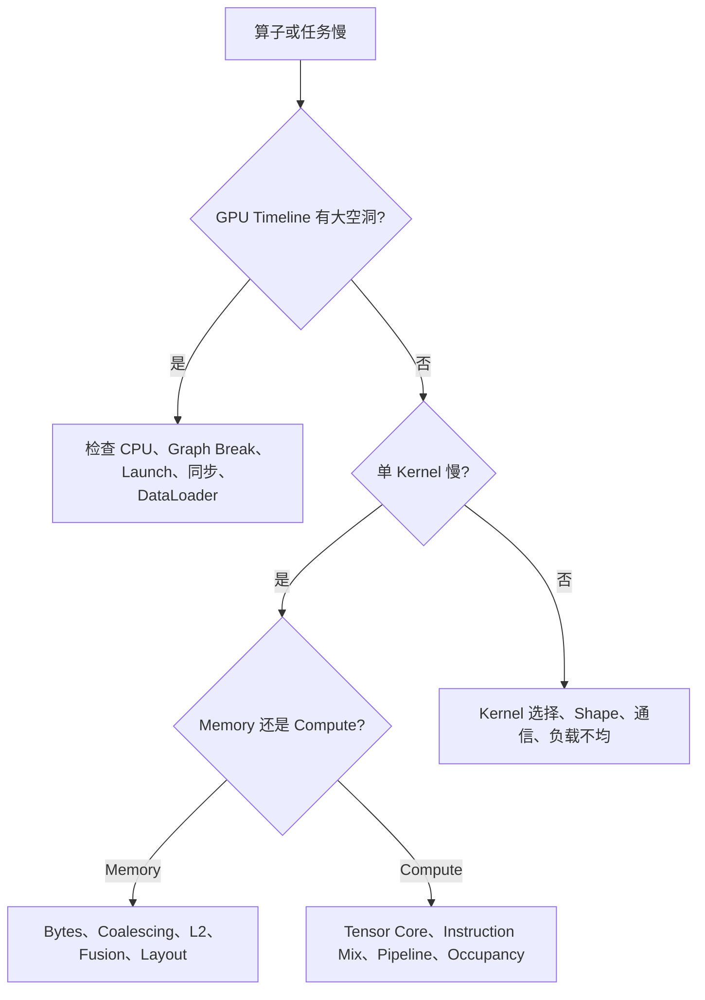

# Kernel 与编译器实验、Benchmark 和排查手册

## 1. 第一原则：先确认测到的是什么

Benchmark = **基准测试**。一次 Kernel Benchmark 至少回答：

- 测的是单 Kernel、一个 Operator，还是端到端 Iteration？
- 是否包含数据准备、编译、Autotune、通信和同步？
- 输入 Shape/Dtype/Layout 是否与生产一致？
- 是否已经 Warmup（预热）？
- 计时前后是否正确使用 CUDA Event 或同步？

CUDA 操作通常异步。如果直接用 CPU Wall Clock：

```python
t0 = time.time()
y = op(x)
t1 = time.time()
```

测到的可能主要是 Launch 时间，不是 GPU 执行时间。应使用可靠 Benchmark 工具或 CUDA Event，并明确同步边界。

## 2. 建立两条基线

### Correctness Baseline

使用 PyTorch Eager 或高精度实现作为 Reference，比较：

- Maximum Absolute Error；
- Maximum Relative Error；
- Mean Error；
- NaN/Inf；
- 梯度误差；
- 多个随机 Seed 和边界 Shape。

### Performance Baseline

至少对比：

- PyTorch Eager；
- `torch.compile`；
- Vendor Library；
- 自定义 Kernel。

如果自定义 Kernel 只比错误配置的 Eager 快，没有与合理库/编译器基线比较，结论价值有限。

## 3. Microbenchmark 模板

记录矩阵：

| 类别 | 必填项 |
|---|---|
| 软件 | PyTorch、CUDA Toolkit、Driver、Triton/TileLang/CUTLASS 版本 |
| 硬件 | GPU SKU、Compute Capability、功耗模式、频率策略 |
| 输入 | Shape、Dtype、Stride、Contiguous、Alignment |
| 测量 | Warmup 次数、Repeat 次数、Median/P95、同步方式 |
| Kernel | Grid、Block、Warps、Stages、Shared Memory、Registers |
| 结果 | 时间、有效带宽、TFLOPS、误差 |

TFLOPS = **Tera Floating-Point Operations Per Second（每秒万亿次浮点运算）**。

## 4. 从现象到层级的排查树



## 5. 常见症状与证据

| 症状 | 可能原因 | 需要找的证据 |
|---|---|---|
| GPU 周期性空闲 | CPU/DataLoader、同步、Graph Break | Nsight Systems CPU/GPU Timeline |
| Kernel 很多且很短 | 未融合、Launch-bound | Kernel Count、平均 Kernel Duration |
| HBM 接近峰值、Tensor Core 低 | Memory-bound | DRAM Throughput、Arithmetic Intensity |
| Tensor Core 低且 HBM 也低 | Shape 小、依赖 Stall、分支、Layout | SM Active、Eligible Warp、Instruction Mix |
| Occupancy 低 | Register/SMEM 过高、大 Block | Register、SMEM、Active CTA |
| Occupancy 高但仍慢 | 带宽饱和或指令依赖 | Memory Throughput、Stall Reason |
| 换 Shape 后突然慢 | Tile 尾块、重编译、算法选择变化 | Kernel Name、Compile Log、Autotune Result |
| 首次请求很慢 | JIT/Autotune/Cache Miss | Compile Time 与后续稳态分开 |
| 多进程偶发编译问题 | 共享 Cache 并发或版本不一致 | Cache 路径、锁、环境 Fingerprint |

## 6. 判断 Compute-bound 与 Memory-bound

不能只看 GPU Util。建议组合：

1. 根据算法估算 FLOPs 与 Bytes；
2. 用 Roofline 判断理论区域；
3. 看实际 HBM/L2 Throughput；
4. 看 Tensor Core/SM Pipeline 利用率；
5. 改变计算量或数据量做对照实验。

例如将同一输入重复做 10 次 FMA 而不增加 HBM Load：如果时间接近不变，原实现大概率受内存限制；如果近似线性增长，则计算逐渐成为主导。

## 7. 判断 Launch-bound

Launch-bound 表示单次 Kernel 太短，CPU/Driver 提交和 Kernel 间边界成本占比过大。典型证据：

- Timeline 上大量几微秒 Kernel；
- GPU 之间有细碎空洞；
- 合并 Batch 或 Fusion 后明显加速；
- CUDA Graph Replay 比普通 Launch 快。

可尝试：

- Kernel Fusion；
- CUDA Graph；
- Persistent Kernel；
- 更大 Batch；
- 减少 Python/Dispatcher 循环。

但 CUDA Graph 要求地址、控制流和资源生命周期满足 Capture/Replay 条件，也会增加内存常驻和调试复杂度。

## 8. `torch.compile` 专项排查

1. 用 Explain/Log 查看 Graph Break。
2. 检查 Recompile 次数与 Guard 原因。
3. 区分 Compile Time 和 Steady-state Runtime。
4. 查看 Inductor 选择 Triton、ATen 还是 External Kernel。
5. 对比 Dynamic/Static Shape。
6. 检查 Fusion 后 Register/SMEM 是否变坏。
7. 对关键 Shape 固定测试，避免只看平均值。

## 9. Triton/TileLang/CuTe DSL 专项排查

- 把 Kernel 缩小到最小可复现输入；
- 固定 Meta-parameter，先关闭大规模 Autotune；
- Dump 各层 IR 和生成代码；
- 检查 Mask 与越界访问；
- 对比多种非整除 Shape；
- 使用 Sanitizer/Interpreter（若后端支持）；
- 检查数值格式、Accumulation Dtype 和 Scale；
- 升级版本前跑完整 Correctness + Performance Regression。

快速演进的 DSL 尤其要注意：Release 可能删除 Legacy API，Compiler Pass 的 Correctness Fix 也可能改变生成代码和性能。

## 10. Grouped GEMM Benchmark 不应只用均匀负载

至少准备四种 Token-to-Expert 分布：

1. 完全均匀；
2. 轻度倾斜；
3. 少数 Hot Expert；
4. 大量极小 Expert + 少量大 Expert。

同时报告平均 Token 数、最大/最小值、P95 和空专家比例。均匀 Synthetic Benchmark 可能完全掩盖生产路由的拖尾问题。

## 11. FlashAttention Benchmark 不应只报一个序列长度

至少覆盖：

- Prefill 长序列；
- Decode 场景；
- Causal/Non-causal；
- MHA/GQA/MQA；
- 不同 Head Dimension；
- Ragged/Variable Length；
- Mask/Score Modification；
- 前向与反向。

MHA = **Multi-Head Attention（多头注意力）**；GQA = **Grouped-Query Attention（分组查询注意力）**；MQA = **Multi-Query Attention（多查询注意力）**。

## 12. 一个完整排查记录模板

```markdown
### 问题
- 现象：
- 影响范围：
- 首次出现版本：

### 环境
- GPU / Driver / CUDA：
- Framework / Compiler / DSL：
- Shape / Dtype / Layout：

### 分层证据
- End-to-end timeline：
- Operator breakdown：
- Kernel metrics：
- Compile/graph evidence：

### 假设与对照实验
1. 假设：
   - 改动：
   - 结果：

### 结论
- 根因：
- 修复：
- 回归测试：
```

## 13. 资料

- [CUDA Best Practices Guide](https://docs.nvidia.com/cuda/cuda-c-best-practices-guide/)
- [Nsight Systems Documentation](https://docs.nvidia.com/nsight-systems/)
- [Nsight Compute Documentation](https://docs.nvidia.com/nsight-compute/)
- [PyTorch Benchmark Utilities](https://pytorch.org/tutorials/recipes/recipes/benchmark.html)
- [Triton 3.8 Releases](https://github.com/triton-lang/triton/releases)

