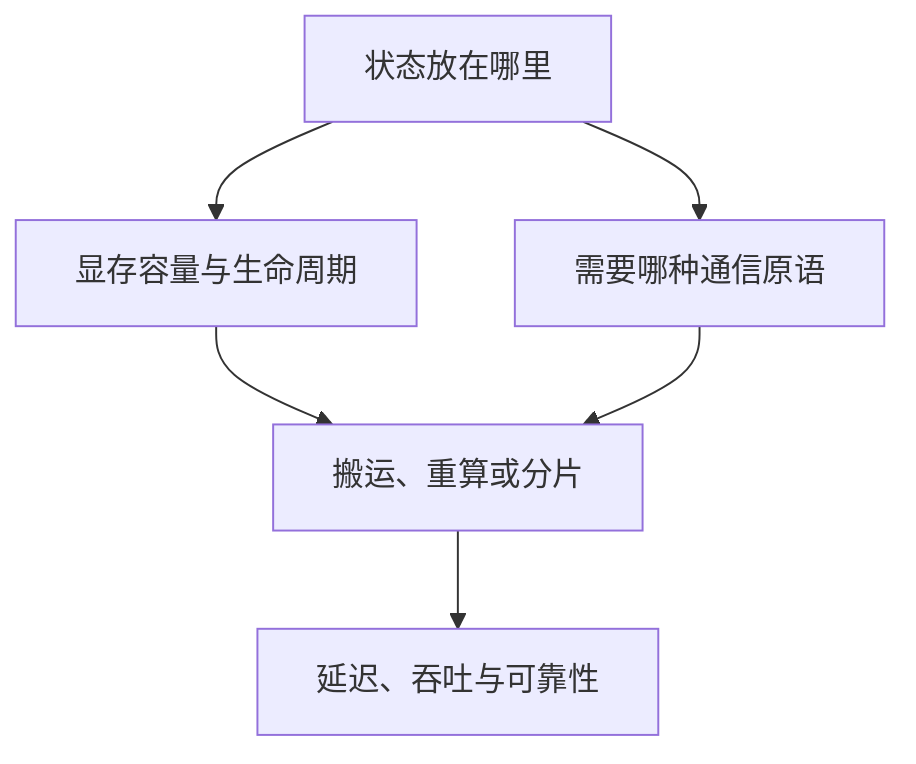

# Distributed Communication 与 Memory System｜专题总览

> 资料核对：2026-09-04。软件版本锚点为 NVIDIA Collective Communications Library（NCCL，英伟达集合通信库）2.31.2、CUDA 13.3 与 PyTorch 2.14；公式和算法原理不依赖这些版本。

## 为什么把通信与内存放在同一个专题

分布式系统表面上在“传数据”，本质上在决定：**哪份状态在何处保存、何时搬运、搬多少、经过哪条路径、搬运期间谁在等待**。ZeRO 把模型状态从复制改成分片，于是节省显存但增加 AllGather/ReduceScatter；专家并行把专家权重留在不同 GPU，于是 token 必须 All-to-All；Prefill–Decode 分离把两种推理负载拆到不同 GPU，于是必须搬运 Key–Value Cache（KV Cache，键值缓存）。

因此本专题不把 NCCL 当作一组 API 背诵，也不把显存优化当作若干开关罗列，而用一条统一主线：

$$
T_{step}=T_{compute}+T_{communication}+T_{memory\ movement}-T_{overlap}+T_{bubble}
$$

这里的 overlap 是真正被隐藏的时间，不能把两个 stream 上“时间重叠”直接当作有效重叠。

## 章节地图

| 顺序 | 文档 | 要回答的问题 |
|---|---|---|
| 1 | [进程、设备与地址空间](01_进程设备与地址空间.md) | rank、进程、CUDA context、IPC 与 peer access 如何对应？ |
| 2 | [GPU 内存组成与显存核算](02_GPU内存组成与显存核算.md) | OOM 前到底有哪些内存，估算为何常不准？ |
| 3 | [通信原语与 Collective](03_通信原语与Collective.md) | AllReduce、AllGather、ReduceScatter、All-to-All 分别改变什么？ |
| 4 | [Collective 通信算法](04_Collective通信算法.md) | Ring、Tree、分层算法为何各有胜场？ |
| 5 | [节点内 GPU 互联](05_节点内GPU互联.md) | PCIe、NVLink、NVSwitch 与拓扑如何影响路径？ |
| 6 | [跨节点网络](06_跨节点网络.md) | InfiniBand、RoCE、RDMA、GPUDirect RDMA 是什么关系？ |
| 7 | [NCCL 软件栈](07_NCCL软件栈.md) | NCCL 如何发现拓扑、选算法、启动通信与诊断故障？ |
| 8 | [通信性能模型](08_通信性能模型.md) | $\alpha$–$\beta$、总线带宽与算法带宽怎样正确使用？ |
| 9 | [通信计算重叠](09_通信计算重叠.md) | stream、chunk、依赖和 SM 竞争怎样决定真实 overlap？ |
| 10 | [训练显存优化](10_训练显存优化.md) | checkpoint、ZeRO、FSDP、offload 分别拿什么换显存？ |
| 11 | [推理内存系统](11_推理内存系统.md) | KV Cache、PagedAttention、prefix cache 怎样共同决定并发？ |
| 12 | [分布式 Checkpoint 与恢复](12_分布式Checkpoint与恢复.md) | 千卡任务如何保存、重分片并恢复？ |
| 13 | [案例：MoE All-to-All](13_案例_MoE-AllToAll.md) | token dispatch 为什么难，DeepEP 在优化什么？ |
| 14 | [案例：Prefill–Decode 分离](14_案例_Prefill-Decode分离.md) | 分离后为何 KV 传输会成为新瓶颈？ |
| 15 | [实验与排查手册](15_实验与排查手册.md) | 怎样从拓扑、microbenchmark 到 timeline 逐层定位？ |

## 三个贯穿专题的判断框架

### 1. 先画状态，再谈通信

对每个 tensor 写出五件事：`shape × dtype × owner × lifetime × consumers`。例如一个 token 的 KV Cache 不是抽象的“缓存”，而是每层的 K、V 两份张量；采用 Grouped-Query Attention（GQA，分组查询注意力）时，KV 头数小于 query 头数，容量公式也随之改变。

### 2. 先看拓扑，再看峰值带宽

同样是 8 张 GPU，可能是经 NVSwitch 全连接，也可能跨 PCI Express（PCIe，高速串行总线）root complex。标称 400 Gb/s 网卡也不等于应用获得 50 GB/s：协议、编码、PCIe、GPU/NIC 亲和性、消息大小和并发都会扣减。

### 3. 优化目标是端到端，而非单一带宽

低延迟算法不一定适合大 tensor；占用 Streaming Multiprocessor（SM，流式多处理器）的高带宽通信 kernel 可能挤压计算；零 SM 的 Copy Engine 路径又可能受复制引擎或链路限制。选择应由消息大小、拓扑、并发负载与 Service-Level Objective（SLO，服务级目标）共同决定。

## 2026 年值得关注的变化

- NCCL 2.28 起公开 device-side API 与 GPU-Initiated Networking（GIN，GPU 发起网络通信），并提供可减少 SM 占用的 Copy Engine collectives；到 2.31 系列继续推进 device API、Parallel Aggregated Tree（PAT，并行聚合树）、Topology Memory Accelerator（TMA，张量内存加速器）与运行时诊断。
- PyTorch 2.14 增加实验性的 `nccl2` backend、可重配置的容错 c10d、one-sided Remote Memory Access（RMA，远程内存访问）窗口，以及面向 Mixture of Experts（MoE，混合专家模型）的 TokenSwitch 接口。
- 推理系统从单机 paged KV Cache 走向跨节点 KV fabric：Prefill–Decode 分离、KV-aware routing、远端缓存与非阻塞 GPU-to-GPU 传输成为系统问题，而不只是 attention kernel 问题。

这些是“截至日期的工程前沿”，不是稳定 API 契约；落地时必须按实际版本复核。

## 核心资料

- [NCCL 2.31.2 User Guide](https://docs.nvidia.com/deeplearning/nccl/user-guide/docs/overview.html)
- [NCCL 2.28 device API 与 Copy Engine collectives](https://developer.nvidia.com/blog/fusing-communication-and-compute-with-new-device-api-and-copy-engine-collectives-in-nvidia-nccl-2-28/)
- [PyTorch 2.14 Release Blog](https://pytorch.org/blog/pytorch-2-14-release-blog/)
- [CUDA GPUDirect RDMA 13.3](https://docs.nvidia.com/cuda/gpudirect-rdma/)
- [PagedAttention 论文](https://arxiv.org/abs/2309.06180)

