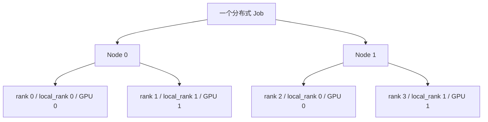
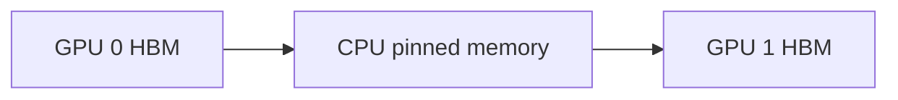

# 进程、设备与地址空间

## 先区分四个容易混淆的对象

| 对象 | 含义 | 常见误区 |
|---|---|---|
| OS process | 操作系统进程，有独立虚拟地址空间 | “一个进程只能控制一张 GPU”——错误 |
| rank | 分布式通信中的逻辑参与者编号 | rank 不天然等于 GPU 编号或机器编号 |
| CUDA context | CUDA 在设备上的执行与资源上下文 | context 有显存和初始化开销，不是免费对象 |
| device | 物理或虚拟 GPU 设备 | `cuda:0` 是当前进程可见设备中的局部编号 |

最常见的训练部署是 **one process per GPU（每张 GPU 一个进程）**，原因是故障隔离、编程模型与 collective 映射都更清晰；但这只是约定。一个进程可以通过多个 context 控制多张 GPU，也可以有多个进程通过 Multi-Process Service（MPS，多进程服务）共享一张 GPU。



`rank` 是全局编号；`local_rank` 只在节点内编号；`world_size` 是 communicator 中的总 rank 数。不要用 `rank % 8` 猜物理设备，容器的 `CUDA_VISIBLE_DEVICES` 映射可能已经重排。

## Unified Virtual Addressing 不等于内存自动共享

Unified Virtual Addressing（UVA，统一虚拟地址）让 host memory 与多个 GPU memory 使用统一的虚拟地址表示，程序可以从指针属性判断位置。但“地址形式统一”不代表任意设备都能直接访问该地址：是否可达仍取决于 peer access、I/O Memory Management Unit（IOMMU，输入输出内存管理单元）、PCIe/NVLink 拓扑与驱动设置。

需要区分：

- `cudaMemcpyPeerAsync`：运行时安排 device-to-device 复制；底层可能走直接 P2P，也可能经过 host staging。
- Peer-to-Peer（P2P，对等访问）：一个 GPU 的 kernel 直接 load/store 另一个 GPU 的 memory。
- CUDA Inter-Process Communication（CUDA IPC，CUDA 进程间通信）：通过可导出的 memory/event handle，让另一进程映射同一块 GPU allocation。
- Managed Memory：CUDA 统一内存按访问需求迁移或映射页面，不等于高性能的共享显存。

## 一个具体例子：为什么同机复制仍可能绕路

GPU 0 和 GPU 1 若位于不同 PCIe root complex 且平台不允许 peer access，`cudaMemcpyPeerAsync` 的语义仍能成立，但路径可能变为：



这会引入两次 PCIe 传输、host buffer 和 CPU/driver 协调。程序“能跑”并不能证明走了理想路径；应同时检查 `nvidia-smi topo -m`、CUDA peer-access 测试与 profiler 中的数据通路。

## IPC 的生命周期陷阱

导出方拥有 allocation；导入方只得到映射。若导出进程先释放或退出，导入方继续使用会产生未定义行为。生产代码还要处理：

1. handle 通过 Unix domain socket、shared memory 或控制平面传递；
2. 导入方打开 handle，并用 event/stream 建立生产者—消费者顺序；
3. 所有使用者停止访问后关闭映射；
4. 最后由 owner 释放 allocation。

这也是为什么上层通常使用 NCCL、NVSHMEM 或框架抽象，而不直接拼 CUDA IPC。

## 排查清单

```bash
nvidia-smi topo -m
nvidia-smi topo -p2p r
nvidia-smi topo -p2p w
```

- 在容器中记录 `CUDA_VISIBLE_DEVICES` 与 PCI bus ID 的映射。
- 用 `cudaDeviceCanAccessPeer` 验证 pair，而不是只看设备型号。
- 进程显存异常时分开看 context、allocator reserved、tensor allocated 与 NCCL buffer。
- 多进程共享一张卡时确认是否启用 MPS，以及 QoS 和故障域是否可接受。

## 资料

- [CUDA Programming Guide：Multi-GPU Systems](https://docs.nvidia.com/cuda/cuda-programming-guide/03-advanced/multi-gpu-systems.html)
- [CUDA Runtime API：Peer Device Memory Access](https://docs.nvidia.com/cuda/cuda-runtime-api/group__CUDART__PEER.html)
- [CUDA Runtime API：Interprocess Communication](https://docs.nvidia.com/cuda/cuda-runtime-api/group__CUDART__DEVICE.html)

