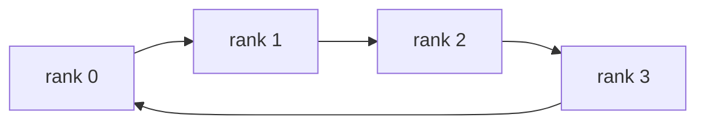
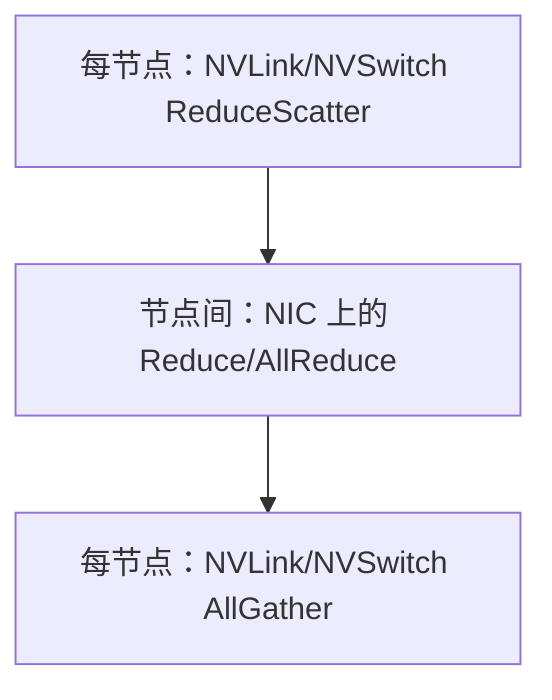

# Collective 通信算法

<!-- learning-position -->
> **学习定位**：A2→A8 · 分层必修。
> **前置**：[两卡通信](<../00_Foundations/06_两卡通信与torchrun.md>)。
> **首读/二读**：先懂 ring/tree 的步骤与开销；PAT/协议内部后读。
> **进度与实验**：[学习清单](<../学习清单.md>) · [总入口](<../README.md>)。
<!-- /learning-position -->

## 入门例子：先画两阶段，再记通信算法名称

把每个 rank 的数组分成 P 个块。Ring AllReduce 可理解为先用 P−1 步边传边规约，让各 rank 持有不同的最终块；再用 P−1 步把这些块传给其他 rank。每一步搬的是约 N/P 字节，N 是每 rank 的完整输入字节数。

在无拥塞、理想单链路模型下，时间近似 2(P−1)α + 2(P−1)N/(P·BW)。P 增大时，固定启动步数增加；这解释小消息为何未必喜欢长环。实际 NCCL 可采用多个 channel 和分层路径，模型用于提出假设，不是逐事件预测。

练习：用 P=4、每卡 [a,b,c,d] 四块画出每轮块的 owner。先确保最终每块包含四个 rank 的规约贡献，再考虑哪个网络路径更快。AllReduce 的数学结果相同，不意味着其物理算法固定。

## 机制与实现

Collective 是语义，Ring、Tree、PAT、NVLS 是实现算法或路径。不能看到 `AllReduce` 就断言“一定走 Ring”。NCCL 会结合拓扑、消息大小、protocol、可用 plugin 与代价模型选择。

## Ring AllReduce

对 $p$ 个 rank、每 rank 输入 $N$ bytes，经典 Ring 分为 ReduceScatter 和 AllGather，每个阶段有 $p-1$ 步，每步传 $N/p$：

$$
V_{per-rank}=2\frac{p-1}{p}N
$$

其优势是大消息时能稳定利用每个环上的链路，传输量接近带宽最优；劣势是步数随 $p$ 增长，小消息容易受每步启动延迟支配。

多 channel 会把 buffer 切片并映射到多个逻辑 ring，因此 profiler 中可能看到多个并发通信 block；“一个 Ring”不是只有一条串行 memcpy。

## Tree AllReduce

Tree 通过上行 reduce、下行 broadcast 完成。平衡树的逻辑深度约为 $O(\log p)$，小消息通常比 $O(p)$ step 的 Ring 更有低延迟潜力；但根附近链路与双向调度、chunk pipeline 会影响大消息带宽。

现实 NCCL tree 可能使用 double binary tree，让不同 chunk 在互补树上流动，不应把课本上的单根二叉树直接等同于实现。

## Recursive doubling 与 PAT

Recursive doubling 每轮与距离为 $2^k$ 的伙伴交换，约 $\log_2 p$ 轮，适合某些小消息和幂次 rank 数。Parallel Aggregated Tree（PAT，并行聚合树）可理解为把多个聚合/分发 wave 并行化，以改善 AllGather/ReduceScatter 的小中消息扩展性。

截至 2026-09，NCCL release notes 已报告分层 PAT kernel：节点内可结合 NVLink SHARP（NVLS，NVLink Switch 上的归约/多播能力），跨节点使用 PAT。是否默认启用和支持哪些拓扑必须按版本检查，不能手工强制后就假设更快。

## 分层算法：先节点内，再节点间

如果每节点 8 GPU、共 16 节点，所有 128 rank 直接组成同质 Ring 会忽略 NVLink 与网络带宽差异。分层 AllReduce 的直觉是：

这样可以聚合节点内流量、减少跨 NIC 的竞争。SHARP（Scalable Hierarchical Aggregation and Reduction Protocol，可扩展分层聚合与归约协议）还可把部分 reduction offload 到网络交换结构；它并不让通信为零，而是改变执行归约的位置与链路占用。

## 算法 × Protocol 是两个维度

NCCL 中 Ring/Tree/NVLS/PAT 是算法维度，Simple/LL/LL128 等是 protocol 维度。Low Latency（LL，低延迟）协议用额外编码或传输粒度换取更低同步延迟；Simple 更适合追求大消息带宽。最终选择同时依赖二者。

## 不要只背“大消息 Ring、小消息 Tree”

这是有用的初始直觉，却不是决策表。下列因素足以反转结论：

- NVSwitch 是否支持 in-network reduction/multicast；
- rank 数、节点数和每节点 GPU 数；
- 多 rail NIC 与 GPU Direct 路径；
- collective 类型——All-to-All 与 AllReduce 完全不同；
- 通信 kernel 是否与计算争抢 SM、HBM bandwidth；
- NCCL 版本的 cost model 与新 algorithm 实现。

正确方法是保留自动选择作为基线，用 `NCCL_DEBUG=INFO`/Inspector 确认实际路径，再对目标 shape 做 sweep。`NCCL_ALGO` 适合诊断和受控实验，不是通用调优秘诀。

## 资料

- [NCCL Environment Variables：NCCL_ALGO / NCCL_PROTO](https://docs.nvidia.com/deeplearning/nccl/user-guide/docs/env.html)
- [NCCL Releases](https://github.com/NVIDIA/nccl/releases)
- [NCCL 2.24：Topology、RAS 与 Buffer Registration](https://developer.nvidia.com/blog/networking-reliability-and-observability-at-scale-with-nccl-2-24/)
