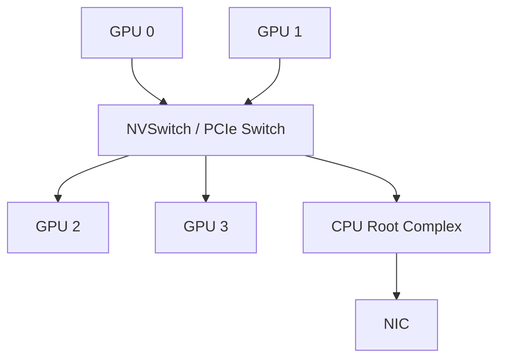

# 节点内 GPU 互联：PCIe、NVLink 与 NVSwitch

<!-- learning-position -->
> **学习定位**：A2 · 必修。
> **前置**：[两卡通信](<../00_Foundations/06_两卡通信与torchrun.md>)。
> **首读/二读**：PCIe/NVLink/NVSwitch、亲和性；用实际 H20 机器结果辨认路径。
> **进度与实验**：[学习清单](<../学习清单.md>) · [总入口](<../README.md>)。
<!-- /learning-position -->

## 先看路径，不先看型号

节点内 GPU 之间并不存在一个抽象的“本地带宽”。实际路径可能经过 NVIDIA NVLink、NVIDIA NVSwitch、PCI Express（PCIe，高速串行总线）、PCIe switch、CPU root complex，甚至因 peer access 不可用而经 host memory 中转。



Network Interface Card（NIC，网络接口卡）也挂在 PCIe fabric 上。跨节点性能不仅由 NIC 速率决定，还取决于“源 GPU 到哪张 NIC 最近”。

## PCIe 的双向与单向口径

PCIe 以 lane 数与 generation 描述。宣传值可能是 raw signaling、单向 payload 或双向 aggregate；比较时必须统一口径。GPU-to-GPU 经 PCIe switch 的 P2P 访问，和经过 CPU socket 间互联的路径，延迟/带宽会显著不同。

工程上要问：

- 两张 GPU 是否在同一个 PCIe switch/root complex？
- Access Control Services（ACS，访问控制服务）是否把 P2P 流量上送 root complex？
- IOMMU 是否影响 peer mapping？
- NIC 与 GPU 的 PCI locality 如何？

## NVLink 与 NVSwitch 的分工

NVLink 是高带宽 GPU 互联 link；NVSwitch 是交换芯片，把多个 NVLink 端口组织成更大的 fabric。拥有 NVLink 不代表任意 GPU pair 都同带宽；有 NVSwitch 的系统则通常提供更对称的多 GPU connectivity，并可支持 multicast/reduction 等 fabric capability。

Blackwell 第五代 NVLink 的官方系统资料给出每 GPU 最高 1.8 TB/s 双向带宽；GB200 NVL72 把 72 张 Blackwell GPU 组成一个 NVLink domain。这个数字不能直接替代 `all_reduce_perf`：collective 还受每 GPU 注入带宽、算法、消息大小、channel、SM 与 HBM 限制。

截至 2026 年，Vera Rubin NVL72 的官方页面已经给出下一代 NVLink Switch fabric 的 3.6 TB/s per-GPU 连接能力。它代表平台演进方向，而不是当前所有部署默认拥有的能力。

## NVLink domain 不等于单一共享内存

即使 72 GPU 处于同一 NVLink domain，每张 GPU 仍有本地 HBM 和一致性/访问语义边界。远端 load/store 的性能、原子操作、地址映射与编程 API 都需要明确。把“acts as a single massive GPU”理解成营销层的可扩展计算域，而不是 CPU 式缓存一致的统一内存。

## 拓扑输出如何读

`nvidia-smi topo -m` 常见标记包括 NV#、PIX、PXB、PHB、NODE、SYS。精确定义随工具版本查官方帮助，但相对关系可用于快速筛查：NVLink 通常优于仅经单个 PCIe switch；跨 host bridge/NUMA node 的路径通常更差。

```bash
nvidia-smi topo -m
nvidia-smi topo -p2p r
nvidia-smi topo -p2p w
nvidia-smi topo -p2p a
```

Non-Uniform Memory Access（NUMA，非一致内存访问）亲和性同样重要：负责 rank 的 CPU thread、pinned memory 和 NIC interrupt 若跨 NUMA socket，可能产生额外延迟。

## 从拓扑到 rank placement

一个实用原则是让高频/大流量通信留在最快 domain：

- Tensor Parallel（TP，张量并行）通常通信频繁，优先放在 NVLink/NVSwitch domain 内；
- Pipeline Parallel（PP，流水线并行）多为邻居 P2P，可跨较慢边界但要评估 activation 大小；
- Data Parallel（DP，数据并行）collective 大而频率相对低，可用分层 AllReduce 跨节点；
- Expert Parallel（EP，专家并行）是动态 All-to-All，placement 还需考虑 token 分布与 NIC 数量。

这不是绝对排序，最终要结合 [Parallelism 专题](../README.md) 的 tensor 形状与 step timeline。

## 资料

- [NVIDIA NVLink](https://www.nvidia.com/en-us/data-center/nvlink/)
- [DGX SuperPOD GB200 Network Fabrics](https://docs.nvidia.com/dgx-superpod/reference-architecture-scalable-infrastructure-gb200/latest/network-fabrics.html)
- [CUDA Multi-GPU Systems](https://docs.nvidia.com/cuda/cuda-programming-guide/03-advanced/multi-gpu-systems.html)


<a id="notebook-10"></a>

## 学习问答：原笔记 §10

### 10｜大模型训练网络为什么变成今天这样：从 PCIe 到 NVLink / NVSwitch，再到 InfiniBand HCA 与 GPUDirect RDMA

**问题：**PCIe、NVLink、NVSwitch、InfiniBand、HCA 看起来都是“通信”，它们为什么会先后出现？今天训练集群里为什么通常同时存在这些东西？


> **先建立最重要的框架**
>
> 不要把它们记成一条简单的“速度排名：NVSwitch > NVLink > PCIe > InfiniBand”。它们并不处在同一层：PCIe / NVLink 是链路；PCIe Switch / NVSwitch 是交换设备；InfiniBand 是跨服务器网络 fabric；HCA 是服务器接入 InfiniBand 的网络端点。今天的训练系统是把这些层叠起来使用。


#### 第一阶段｜GPU 还是“外设”：CPU / GPU 通过 PCIe 连接

早期 GPU 的基本系统结构非常直观：GPU 是挂在主机上的 PCIe 设备。CPU、系统内存、GPU、网卡、NVMe 都围绕 PCIe 这个通用 I/O 体系连接。


```text
CPU / DRAM
│
PCIe Root Complex
│
PCIe / PCIe Switch
├── GPU
├── NIC / HCA
└── NVMe
```


**为什么这时 PCIe 足够？**因为最初 GPU 更像“把一段任务送过去计算，再把结果拿回来”的加速器。PCIe 的优势是通用、标准化、生态成熟；它不是专门为大量 GPU 之间高频 collective 设计的。

| **PCIe 世代** | **原始速率 / lane / direction** | **为什么对 AI 有意义**                                               |
|---------------|---------------------------------|----------------------------------------------------------------------|
| PCIe 3.0      | 8 GT/s                          | 多 GPU / GPU-NIC 通信开始明显受主机 I/O 拓扑影响                     |
| PCIe 4.0      | 16 GT/s                         | 带宽翻倍，但 GPU 算力和多卡通信需求也继续快速增长                    |
| PCIe 5.0      | 32 GT/s                         | x16 单向有效带宽约 64 GB/s 量级；仍是通用 I/O，而不是专用 GPU fabric |

#### 第二阶段｜多 GPU 计算出现：PCIe 开始成为 GPU↔GPU 瓶颈

深度学习从单 GPU 走向多 GPU 后，数据并行、模型并行需要频繁交换 tensor。尤其 TP 的 AllReduce / AllGather / ReduceScatter，是每层都会出现的高频通信。此时问题不再只是“CPU 能不能把数据喂给 GPU”，而变成“GPU 之间能不能像访问本地显存一样高速地交换数据”。

- GPU 算力增长速度非常快，PCIe 是通用 I/O，链路带宽没有按同样速度扩张。

- PCIe 拓扑还可能经过 PCIe switch、Host Bridge、NUMA/CPU interconnect；GPU 对之间的有效带宽和延迟不均匀。

- 模型并行把通信放进了 forward/backward 的关键路径，网络一慢，GPU 就直接等待。

#### 第三阶段｜NVLink 出现：给 GPU 一条“专用高速公路”

**2014 年 NVIDIA 公布 NVLink，随后在 Pascal P100（2016）上落地。**它出现的核心原因，就是 PCIe 越来越难满足高性能 GPU 之间的直接通信需求。NVLink 是面向 GPU/加速器的高速互联，而不是通用外设总线。


```text
PCIe 路径（概念）： GPU0 ─ PCIe ─ [PCIe hierarchy] ─ PCIe ─ GPU1
NVLink 路径： GPU0 ═══════════ NVLink ═══════════ GPU1
```


> **这一阶段解决的核心问题**
>
> “两张或少量 GPU 之间怎么更快地搬 tensor？”——答案是专用的 GPU 高速互联 NVLink。对 TP 这类同步频繁的并行方式，GPU↔︎GPU 带宽直接决定通信能否被计算隐藏。


#### 第四阶段｜NVLink 还不够：GPU 越来越多，于是需要 NVSwitch

只有 point-to-point 高速链路还会遇到拓扑问题：GPU 数量增加后，不可能简单地让每一对 GPU 都独占大量直连线；不同 GPU 对的链路数量也可能不一致。于是需要像网络交换机一样的设备，把大量 NVLink 端口组织成可扩展的 many-to-many fabric。

**2018 年 DGX-2 首次引入 NVSwitch。**第一代 NVSwitch 把 16 张 V100 组织成高带宽、近似统一的 NVLink 交换网络。


```text
GPU0 ══┐
GPU1 ══┤
GPU2 ══╪══ NVSwitch fabric ══ GPU4 / GPU5 / ...
GPU3 ══┤
└── many-to-many NVLink connectivity
```


> **NVLink 与 NVSwitch 的关系**
>
> NVLink 是“路”；NVSwitch 是“立交/交换中心”。数据从 GPU 到 NVSwitch、再到另一个 GPU，实际承载链路仍然是 NVLink。因此不能说 NVSwitch 是一种“比 NVLink 更快的线”。它解决的是连接规模、拓扑一致性和并发交换能力。


#### 第五阶段｜单机再强也装不下模型：必须跨服务器 Scale-out

当模型和训练规模继续增长，单台 8/16 GPU 服务器的 GPU 数、HBM、功耗和散热都有限。训练从“多 GPU”进一步变成“数百、数千甚至更多 GPU 的集群”。此时通信必须跨服务器。

- NVLink/NVSwitch 主要解决 scale-up 域内的 GPU 高速互联；传统大规模集群还需要一个独立的 scale-out 网络把服务器连接起来。

- InfiniBand 并不是为大模型才发明的。它来自 HPC 场景，RDMA 从 1999 年前后的 InfiniBand 体系就已经被用于降低 CPU 开销、提高带宽效率。AI 训练后来“继承”了这套成熟的 HPC 网络思想。

#### InfiniBand + HCA：跨服务器的高速网络

InfiniBand 是一个 switched fabric。每台训练服务器通过 HCA 接入 IB 网络，HCA 再通过线缆连接到 InfiniBand Switch。


```text
Server A Server B
GPU ─ PCIe ─ HCA ══ InfiniBand ══ IB Switch ══ HCA ─ PCIe ─ GPU
```


| **组件**          | **类比**                      | **作用**                                                   |
|-------------------|-------------------------------|------------------------------------------------------------|
| HCA               | 服务器里的“高速网卡/网口端点” | 把主机接入 InfiniBand；执行 RDMA、队列、DMA 等数据移动工作 |
| InfiniBand Link   | 网线/链路                     | 把 HCA 与交换机、交换机与交换机连接起来                    |
| InfiniBand Switch | 数据中心交换机                | 把大量服务器组织成低延迟、高吞吐的 scale-out fabric        |
| RDMA              | 数据搬运机制/编程模型         | 让远端设备直接访问注册内存，减少 CPU 参与和额外复制        |


> **一个非常容易混淆、但必须记住的点**
>
> InfiniBand 并没有“取代 PCIe”。HCA 本身通常就是一块 PCIe 设备：GPU 想把数据送到远端节点，节点内部仍要从 GPU 走到 HCA；真正离开服务器之后，才进入 InfiniBand fabric。所以跨机路径是“本机 PCIe/GPU-NIC 拓扑 + InfiniBand 网络 + 对端 PCIe/GPU-NIC 拓扑”的组合。


#### 第六阶段｜为什么还需要 GPUDirect RDMA？因为“经过 CPU 内存”太浪费

即使有 InfiniBand，如果数据仍必须先从 GPU 显存复制到 CPU DRAM，再由 HCA 发送，跨机通信仍会被 host memory copy、CPU 协调和内存带宽拖慢。


```text
传统 staging：
GPU HBM → CPU DRAM → HCA → IB → HCA → CPU DRAM → GPU HBM
GPUDirect RDMA：
GPU HBM → PCIe → HCA → IB → HCA → PCIe → GPU HBM
↑ HCA 可直接 DMA 读写 GPU memory ↑
```


GPUDirect RDMA 让支持的 HCA 直接对 GPU 显存做 peer-to-peer DMA，绕过不必要的 CPU host-memory staging。NCCL 在拓扑允许时会利用 GPUDirect RDMA，这也是为什么 GPU 到 HCA 的 PCIe / NUMA 距离非常关键。

#### 于是形成今天典型的大模型训练“两层网络”

| **层次**  | **典型技术**                         | **覆盖范围**                                            | **典型通信与目标**                                                         |
|-----------|--------------------------------------|---------------------------------------------------------|----------------------------------------------------------------------------|
| Scale-up  | NVLink + NVSwitch                    | 同机 / 同一高速 NVLink 域；现代系统正把边界向机架级扩展 | TP、局部 EP、强同步 collective；追求极高 GPU↔GPU 带宽与低延迟              |
| Scale-out | InfiniBand + HCA（或 RoCE/Ethernet） | 跨服务器 / 跨机架                                       | DP、PP、跨节点 TP/EP、checkpoint/storage traffic；把很多服务器扩展成大集群 |


```text
┌────────── Server / NVLink scale-up domain ──────────┐
GPU0 ═ NVLink ═╗
GPU1 ═ NVLink ═╬══ NVSwitch ── GPUs
GPU2 ═ NVLink ═╝
│
└─ PCIe ─ HCA ═════ InfiniBand fabric ═════ HCA ─ PCIe ─ ...
└────────────── scale-out ───────────────────────────┘
```


#### 把它和 TP 的 21 GiB/microbatch 例子串起来

前面我们估算过：48 层、TP=8、hidden=8192、seq=4096 的例子中，每卡每个 microbatch 可能产生约 21 GiB 的 TP 通信量。这个数字解释了硬件网络为什么会按上面的路线演化：

- 如果 TP group 在 NVLink/NVSwitch 域内，大量 AllReduce 可以走高带宽的 scale-up fabric。

- 如果 TP 跨节点，collective 必须进入 HCA + InfiniBand/RoCE 的 scale-out 网络；GPU↔HCA 的 PCIe 拓扑和 GPUDirect RDMA 能力立即变成性能关键。

- 因此实际并行策略常常会“顺着物理拓扑切”：把通信最频繁、最同步敏感的 group 尽量放在更快、更近的互联域里。

#### 大模型训练系统需求演化的一句话记忆

注意：这里的箭头表示“大模型训练系统在规模扩张时，新的通信瓶颈依次需要什么技术来解决”，不是技术发明年份的严格排序。InfiniBand / RDMA 的历史早于 NVLink / NVSwitch，只是到了大规模 AI 集群时代，它成为跨节点 scale-out 的关键基础设施。


> **PCIe → NVLink → NVSwitch → InfiniBand/HCA → GPUDirect RDMA**
>
> PCIe 先解决“把 GPU 接进计算机”；NVLink 解决“GPU 之间带宽不够”；NVSwitch 解决“GPU 多了以后 NVLink 怎么扩展成 many-to-many”；InfiniBand/HCA 解决“单台服务器装不下，需要跨节点 scale-out”；GPUDirect RDMA 再解决“跨节点时别让数据无意义地绕 CPU DRAM 一圈”。最后形成“scale-up + scale-out”叠加的现代 AI 集群。


#### 参考（官方资料）

- **NVIDIA：2014 NVLink announcement** [<u>【官方链接】</u>](https://nvidianews.nvidia.com/news/nvidia-launches-world-s-first-high-speed-gpu-interconnect-helping-pave-the-way-to-exascale-computing)

- **NVIDIA：2018 DGX-2 首次引入 NVSwitch** [<u>【官方链接】</u>](https://nvidianews.nvidia.com/news/nvidia-boosts-worlds-leading-deep-learning-computing-platform-bringing-10x-performance-gain-in-six-months)

- **InfiniBand Trade Association：Introduction to InfiniBand for End Users（HCA 定义）** [<u>【官方链接】</u>](https://cw.infinibandta.org/document/dl/7268)

- **NVIDIA CUDA：GPUDirect RDMA Documentation** [<u>【官方链接】</u>](https://docs.nvidia.com/cuda/gpudirect-rdma/)

- **PCI-SIG：PCIe 1.0–5.0 bit-rate evolution** [<u>【官方链接】</u>](https://pcisig.com/what-bit-rates-does-pcie-50-specification-support-and-how-does-it-compare-prior-pcie-generations)
