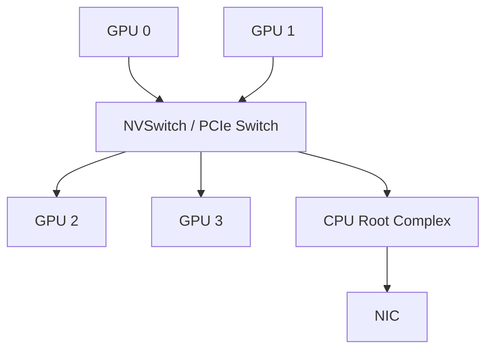

# 节点内 GPU 互联：PCIe、NVLink 与 NVSwitch

## 先看路径，不先看型号

节点内 GPU 之间并不存在一个抽象的“本地带宽”。实际路径可能经过 NVIDIA NVLink、NVIDIA NVSwitch、PCI Express（PCIe，高速串行总线）、PCIe switch、CPU root complex，甚至因 peer access 不可用而经 host memory 中转。



Network Interface Card（NIC，网络接口卡）也挂在 PCIe fabric 上。跨节点性能不仅由 NIC 速率决定，还取决于“源 GPU 到哪张 NIC 最近”。

## PCIe 的双向与单向口径

PCIe 以 lane 数与 generation 描述。宣传值可能是 raw signaling、单向 payload 或双向 aggregate；比较时必须统一口径。GPU-to-GPU 经 PCIe switch 的 P2P 访问，和经过 CPU socket 间互联的路径，延迟/带宽会显著不同。

工程上要问：

- 两张 GPU 是否在同一个 PCIe switch/root complex？
- Access Control Services（ACS，访问控制服务）是否把 P2P 流量上送 root complex？
- IOMMU 是否影响 peer mapping？
- NIC 与 GPU 的 PCI locality 如何？

## NVLink 与 NVSwitch 的分工

NVLink 是高带宽 GPU 互联 link；NVSwitch 是交换芯片，把多个 NVLink 端口组织成更大的 fabric。拥有 NVLink 不代表任意 GPU pair 都同带宽；有 NVSwitch 的系统则通常提供更对称的多 GPU connectivity，并可支持 multicast/reduction 等 fabric capability。

Blackwell 第五代 NVLink 的官方系统资料给出每 GPU 最高 1.8 TB/s 双向带宽；GB200 NVL72 把 72 张 Blackwell GPU 组成一个 NVLink domain。这个数字不能直接替代 `all_reduce_perf`：collective 还受每 GPU 注入带宽、算法、消息大小、channel、SM 与 HBM 限制。

截至 2026 年，Vera Rubin NVL72 的官方页面已经给出下一代 NVLink Switch fabric 的 3.6 TB/s per-GPU 连接能力。它代表平台演进方向，而不是当前所有部署默认拥有的能力。

## NVLink domain 不等于单一共享内存

即使 72 GPU 处于同一 NVLink domain，每张 GPU 仍有本地 HBM 和一致性/访问语义边界。远端 load/store 的性能、原子操作、地址映射与编程 API 都需要明确。把“acts as a single massive GPU”理解成营销层的可扩展计算域，而不是 CPU 式缓存一致的统一内存。

## 拓扑输出如何读

`nvidia-smi topo -m` 常见标记包括 NV#、PIX、PXB、PHB、NODE、SYS。精确定义随工具版本查官方帮助，但相对关系可用于快速筛查：NVLink 通常优于仅经单个 PCIe switch；跨 host bridge/NUMA node 的路径通常更差。

```bash
nvidia-smi topo -m
nvidia-smi topo -p2p r
nvidia-smi topo -p2p w
nvidia-smi topo -p2p a
```

Non-Uniform Memory Access（NUMA，非一致内存访问）亲和性同样重要：负责 rank 的 CPU thread、pinned memory 和 NIC interrupt 若跨 NUMA socket，可能产生额外延迟。

## 从拓扑到 rank placement

一个实用原则是让高频/大流量通信留在最快 domain：

- Tensor Parallel（TP，张量并行）通常通信频繁，优先放在 NVLink/NVSwitch domain 内；
- Pipeline Parallel（PP，流水线并行）多为邻居 P2P，可跨较慢边界但要评估 activation 大小；
- Data Parallel（DP，数据并行）collective 大而频率相对低，可用分层 AllReduce 跨节点；
- Expert Parallel（EP，专家并行）是动态 All-to-All，placement 还需考虑 token 分布与 NIC 数量。

这不是绝对排序，最终要结合 [Parallelism 专题](../README.md) 的 tensor 形状与 step timeline。

## 资料

- [NVIDIA NVLink](https://www.nvidia.com/en-us/data-center/nvlink/)
- [DGX SuperPOD GB200 Network Fabrics](https://docs.nvidia.com/dgx-superpod/reference-architecture-scalable-infrastructure-gb200/latest/network-fabrics.html)
- [CUDA Multi-GPU Systems](https://docs.nvidia.com/cuda/cuda-programming-guide/03-advanced/multi-gpu-systems.html)

