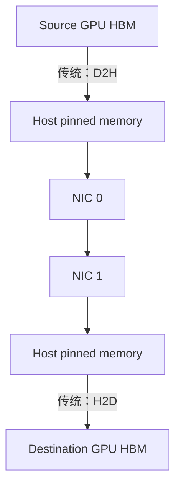

# 跨节点网络：InfiniBand、RoCE、RDMA 与 GPUDirect

## 四个词不是同一层

| 名称 | 层次 | 简要含义 |
|---|---|---|
| InfiniBand（IB） | 网络架构/链路与传输体系 | 面向高性能计算的 lossless fabric，含 subnet management、verbs 等生态 |
| RoCE | RDMA transport over Ethernet | RDMA over Converged Ethernet（融合以太网上的远程直接内存访问） |
| RDMA | 通信语义/能力 | Remote Direct Memory Access，远程直接内存访问，绕过传统 socket 数据路径 |
| GPUDirect RDMA | GPU 与 peer device 能力 | NIC 可直接 DMA 到/从 GPU memory，避免经 CPU bounce buffer |

InfiniBand 能承载 RDMA；RoCE 也能承载 RDMA。RDMA 不是“某种网线”，GPUDirect RDMA 也不是“任何 GPU 到任何 NIC 都直连”。

## 传统路径与 GPUDirect RDMA

GPUDirect RDMA 允许 NIC 的 Direct Memory Access（DMA，直接内存访问）engine 访问注册的 GPU pages，省去两端 host staging。它降低 copy 与 CPU 开销，但控制面仍需要 memory registration、queue pair、completion 与同步；数据也通常仍经过 GPU–NIC 之间的 PCIe/NVLink-C2C 路径。

## 为什么 memory registration 很重要

RDMA 不能对任意虚拟地址随意读写。应用或通信库需要 pin/register memory，建立 address translation 与权限 key。注册本身有固定成本，因此 NCCL 的 user buffer registration、registration cache 与长期复用 buffer 很重要。频繁 allocate/free、地址不断变化会吃掉小消息收益。

## InfiniBand 与 RoCE 的工程差异

InfiniBand fabric 原生提供面向 HPC 的 flow control、routing 和 subnet management。RoCEv2 使用 UDP/IP 封装，更容易复用 Ethernet/IP infrastructure，但无损与拥塞控制需要认真配置：Priority Flow Control（PFC，优先级流量控制）、Explicit Congestion Notification（ECN，显式拥塞通知）、Data Center Quantized Congestion Notification（DCQCN，数据中心量化拥塞通知）、buffer 和 load balancing 任一不当都可能出现 pause storm 或 tail latency。

不要简单写成“IB 一定快、RoCE 一定慢”。相同 link rate 下，拓扑 oversubscription、routing、NIC/PCIe 代际、拥塞控制和运维成熟度往往更决定实际性能。

## 多 rail 与 GPU–NIC 亲和性

一个节点可能有 8 GPU、4 或 8 个 NIC port。Multi-rail 是同时利用多条独立 network rail；理想映射让每个 GPU 使用最近的 NIC，再通过节点内 fabric 聚合。但如果所有 rank 错误绑定同一 NIC，标称总带宽不会自动出现。

检查内容：

- `nvidia-smi topo -m` 的 GPU–NIC 距离；
- `ibdev2netdev`、`ibstat`、`rdma link` 的 port 状态；
- PCIe negotiated width/speed；
- NCCL 实际选择的 HCA（Host Channel Adapter，主机通道适配器）与 GDR level；
- ECMP/adaptive routing 是否把大象流均匀分散。

## SHARP 与 in-network reduction

Scalable Hierarchical Aggregation and Reduction Protocol（SHARP，可扩展分层聚合与归约协议）允许支持的交换网络执行部分 collective reduction。它适合 AllReduce/ReduceScatter 一类可规约操作；All-to-All 的本质是个性化交换，不能靠一次 reduction 消除流量。

## 常见错误观点

- “有 RDMA 就不经过 CPU”：data plane 可绕开 CPU copy，但 CPU/driver/control plane 仍存在。
- “400 Gb/s = 50 GB/s tensor bandwidth”：raw line rate 要扣协议与路径开销，而且 collective 算法还会重复经过链路。
- “ping 通说明 RoCE 正常”：TCP ping 不验证 RDMA verbs、PFC/ECN、GID、MTU 或 GPU Direct。
- “单 pair 跑满说明 1,024 GPU 能线性扩展”：集群瓶颈常在 leaf–spine oversubscription、routing collision 和 incast。

## 资料

- [CUDA GPUDirect RDMA 13.3](https://docs.nvidia.com/cuda/gpudirect-rdma/)
- [NVIDIA Network Operator：RDMA、InfiniBand 与 RoCE](https://docs.nvidia.com/networking/display/kubernetes2570/index.html)
- [NCCL Troubleshooting：GPU Direct](https://docs.nvidia.com/deeplearning/nccl/user-guide/docs/troubleshooting.html)

