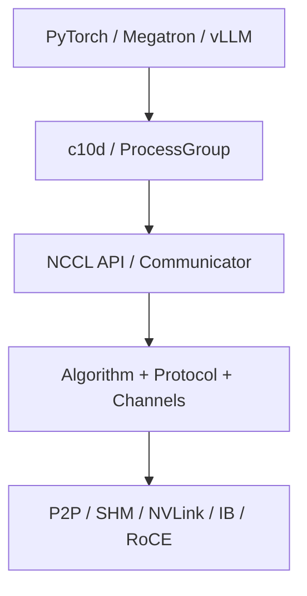

# NCCL 软件栈：从 API 到传输路径

<!-- learning-position -->
> **学习定位**：A2→A7 · 分层必修。
> **前置**：[两卡通信](<../00_Foundations/06_两卡通信与torchrun.md>)。
> **首读/二读**：通信组初始化、传输与 hang 排查；device-side 新能力参考。
> **进度与实验**：[学习清单](<../学习清单.md>) · [总入口](<../README.md>)。
<!-- /learning-position -->

## 入门例子：把初始化、传输与等待分开

一组 worker 先通过 rendezvous 交换建立通信所需的信息，再形成进程组；之后 collective 才能在对应 group 上提交。模型 TP 通信组和训练到推理的换权组可能是不同对象，即便它们包含部分相同 GPU。

例如 rank 0 完成初始化后进入 broadcast，而 rank 1 仍在下载权重，rank 0 的长等待不能直接解释成链路带宽低。先对齐各 rank 最后的进度点，再问传输是否慢。

练习：记录初始化耗时与稳态 collective 耗时为两个指标。遇到 hang，先检查参与者是否全部存活、顺序是否匹配、shape/dtype 是否一致，再查实际传输路径。所有临时环境变量都写进实验配置；没有前后对照的“玄学参数组合”不算结论。

## 机制与实现

NVIDIA Collective Communications Library（NCCL，英伟达集合通信库）是 topology-aware 的 GPU collective/P2P library。它不是 rendezvous service、job scheduler 或完整分布式框架。PyTorch c10d/process group 负责上层语义与 rank 管理，NCCL 负责 communicator 内的数据移动与 reduction。

SHM = Shared Memory（共享内存），这里通常指经 host shared memory 的 transport fallback。

## 初始化发生了什么

1. 所有 rank 通过框架的 store/rendezvous 交换 NCCL unique ID；
2. NCCL 枚举 GPU、PCIe、NVLink、NIC 等 topology；
3. 建立 rank 间 transport connection 与 channel；
4. 根据 collective、count、topology 和 tuning model 选择 algorithm/protocol；
5. host 把通信工作 enqueue 到 CUDA stream，由 kernel/engine 推进。

初始化或首次 collective 较慢不必然是网络差，可能包含 module load、connection setup、memory registration 与 lazy allocation。benchmark 要分开 warmup。

## Channel、Algorithm、Protocol

- channel：把大 buffer 切为多个并行工作流，映射到不同 ring/tree/connection；过少不能吃满链路，过多会增加资源竞争。
- algorithm：Ring、Tree、NVLS、PAT、CollNet 等数据调度结构。
- protocol：Simple、LL（Low Latency，低延迟）、LL128 等传输与同步协议。

NCCL 通常把通信与 reduction 融在一个 GPU kernel 中，而不是先 memcpy 再单独加法。这减少中间写回，但会占用 SM、register 与 HBM bandwidth。

## 2.28 以后的 device-side 路线

NCCL 2.28 公布 device API，使应用 kernel 可在 device side 发起/融合通信。官方区分三种模式：

- Load/Store Accessible（LSA，可用 load/store 访问）：借 CUDA P2P 访问同一 LSA team 内 peer memory；
- Multimem：利用 NVLink SHARP 的 multicast/reduction memory semantics；
- GPU-Initiated Networking（GIN，GPU 发起网络）：跨 NVLink domain 发起网络操作。

同版本还提供 Copy Engine（CE，复制引擎）collective，使某些 AllGather/All-to-All 数据移动不占 SM，从而给计算让出执行资源。零 SM 不代表零干扰：CE、PCIe/NVLink、HBM bandwidth 仍可能竞争。

## 截至 NCCL 2.31 的前沿

- PAT 的分层 AllGather/ReduceScatter 持续增强；
- device API 继续向 legacy Ring/Tree path 统一，roadmap 还提出 custom kernel hook；
- Runtime Reliability, Availability, Serviceability（RAS，运行时可靠性、可用性、可维护性）诊断扩展到 GPU inventory、driver、Error Correcting Code（ECC，错误校正码）和 NVLink 状态；
- NCCL Inspector 可导出 communicator/collective 事件供外部系统观察。

Roadmap 和 release notes 是方向与版本事实，不等于当前框架已经默认使用。

## 环境变量的正确使用方法

环境变量应作为**诊断假设**，而不是永久魔法参数：

| 变量 | 用途 | 风险 |
|---|---|---|
| `NCCL_DEBUG=INFO` | 查看初始化、网络与选路信息 | 日志量大，生产需控制 |
| `NCCL_DEBUG_SUBSYS=...` | 缩小到 INIT/NET/GRAPH/COLL 等子系统 | 子系统名按版本核对 |
| `NCCL_ALGO` / `NCCL_PROTO` | 强制/排除算法协议做 A/B | 可能让某些 collective 无可用组合 |
| `NCCL_SOCKET_IFNAME` | 选择 socket interface | 配错会绕到管理网 |
| `NCCL_IB_HCA` | 选择 HCA/port | 配错会破坏 multi-rail |

先保存默认基线，再一次只改一个变量；记录 NCCL、driver、CUDA、firmware 与 topology。不要复制别人的 env 大礼包。

## Hang 的层级化诊断

1. 应用层：所有 rank 是否以同顺序、同 count/dtype 调 collective？
2. communicator：是否有 rank crash、超时或错误传播？
3. transport：P2P、SHM、IB、RoCE 哪条实际启用？
4. fabric：link、port、GID、MTU、route、congestion 是否正常？
5. hardware：ECC、Xid、NVLink error、PCIe AER 是否出现？

NCCL 2.31 RAS 可以缩短信息收集，但官方明确它不是完整 data-path health test；仍需 microbenchmark 和系统 telemetry 交叉验证。

## 资料

- [NCCL 2.31.2 Overview](https://docs.nvidia.com/deeplearning/nccl/user-guide/docs/overview.html)
- [NCCL 2.28 Device API 与 Copy Engine Collectives](https://developer.nvidia.com/blog/fusing-communication-and-compute-with-new-device-api-and-copy-engine-collectives-in-nvidia-nccl-2-28/)
- [NCCL RAS](https://docs.nvidia.com/deeplearning/nccl/user-guide/docs/troubleshooting/ras.html)
- [NCCL 2026 Roadmap](https://github.com/NVIDIA/nccl/issues/2272)
