# 通信计算重叠：从“两个 Stream”到真实隐藏时间

## 重叠不是自动发生

CUDA stream 是有序 command queue；不同 stream **有机会**并发，但能否并发取决于依赖、硬件资源与 runtime scheduling。把 NCCL collective 放到独立 communication stream 只是必要条件之一。

```mermaid
gantt
    title 理想的梯度分桶重叠
    dateFormat X
    axisFormat %s
    section Compute
    Backward bucket 0 :0, 4
    Backward bucket 1 :4, 8
    Backward bucket 2 :8, 12
    section Comm
    AllReduce bucket 0 :4, 8
    AllReduce bucket 1 :8, 12
    AllReduce bucket 2 :12, 16
```

尾部最后一个 collective 无后续计算可遮挡，形成 exposed communication tail。bucket 太大，通信启动晚；太小，则 $\alpha$、launch 和同步开销占主导。

## 正确的依赖关系

设 backward compute 在 stream C 产出 bucket，通信在 stream N 消费，optimizer 在 C 使用结果：

1. C 完成 bucket 后 record event $E_{ready}$；
2. N wait $E_{ready}$，enqueue AllReduce/ReduceScatter；
3. N 完成后 record $E_{done}$；
4. C 在使用结果前 wait $E_{done}$。

若忘记第 1/2 步，会读到未完成数据；若在 host 立刻 `synchronize()`，则并发机会被抹掉；若过度加入 default-stream barrier，也会隐式串行。

## 三类资源竞争

| 竞争 | 现象 | 对策方向 |
|---|---|---|
| SM / warp | NCCL kernel 与 GEMM 同时抢 SM | 限制 channel/CTA、CE collective、调整优先级 |
| HBM bandwidth | 通信读写 tensor，memory-bound kernel 变慢 | 错峰、fusion、减少字节、布局直消 |
| fabric | TP、DP、EP 同时占同一 NVLink/NIC | collective 排程、分层映射、traffic isolation |

所以 overlap ratio 不能只看彩色条覆盖面积。应比较：单独 $T_c$、单独 $T_m$、并发 $T_{both}$：

$$
\text{hidden fraction}=\frac{T_c+T_m-T_{both}}{\min(T_c,T_m)}
$$

若并发时两者互相减速，timeline 看似重叠，端到端收益可能很小甚至为负。

## 常见模式

### Gradient bucketing

Data Distributed Parallel（DDP，分布式数据并行）在 backward 中按 bucket 启动 AllReduce。参数注册顺序影响梯度 ready 顺序；bucket 设计应与真实 backward 顺序匹配。

### FSDP prefetch

Fully Sharded Data Parallel（FSDP，全分片数据并行）可在计算当前 layer 时 AllGather 下一 layer 参数，在 backward 时预取/ReduceScatter。过度 prefetch 会同时展开多层参数，显存峰值反而上升。

### Pipeline P2P

PP 的 activation send/recv 可与其他 micro-batch compute 重叠，但 pipeline schedule 决定 bubble，通信 stream 不能修复负载不均或错误 stage 划分。

### MoE dispatch/combine

All-to-All 前后还包含 top-k routing、permute、Grouped GEMM、unpermute。高质量实现把 token packing、跨域 forwarding 与 expert compute pipeline 化，而不仅优化 NCCL 调用本身。

## 2026 年的新方向

NCCL device API 允许通信原语更接近 producer/consumer kernel，减少 host launch 与同步边界；GIN 将 GPU-initiated path 扩到网络；CE collective 可在适合的数据移动型操作上释放 SM。PyTorch 2.14 TokenSwitch 则尝试为 MoE dispatch/combine 提供统一接口。这些方向共同指向“通信成为计算图内部的一等操作”。

## 验证清单

- profiler 中是否存在意外 `cudaDeviceSynchronize`？
- 通信开始时间是否紧跟 tensor ready，而非 backward 全部结束？
- 并发后 GEMM 与 NCCL 各自 duration 是否膨胀？
- HBM、NVLink、NIC throughput 是否接近瓶颈？
- exposed tail 是 launch 延迟、最后 bucket 太大，还是 consumer barrier？
- 优化后 step time、MFU 与 tail latency 是否真的改善？

## 资料

- [PyTorch DDP](https://docs.pytorch.org/docs/stable/notes/ddp.html)
- [NCCL 2.28 Device API / CE Collectives](https://developer.nvidia.com/blog/fusing-communication-and-compute-with-new-device-api-and-copy-engine-collectives-in-nvidia-nccl-2-28/)
- [PyTorch 2.14 Release](https://pytorch.org/blog/pytorch-2-14-release-blog/)

