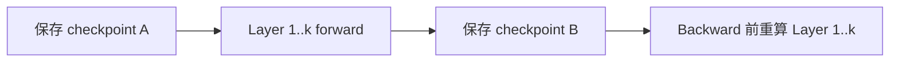

# 训练显存优化：重算、分片与 Offload

<!-- learning-position -->
> **学习定位**：A3 · 必修。
> **前置**：[通信与 tensor 基础](<../00_Foundations/06_两卡通信与torchrun.md>)。
> **首读/二读**：显存账本和优化取舍；FSDP 执行生命周期链接 A3 原理篇。
> **进度与实验**：[学习清单](<../学习清单.md>) · [总入口](<../README.md>)。
<!-- /learning-position -->

显存优化不是一张“省多少 GB”的功能表，而是三个旋钮：**缩短状态生命周期、减少每 rank 的副本、把状态移到更慢层级**。每一种优化都会引入计算、通信、I/O 或工程复杂度。

## Activation Checkpointing：用重算换保存

Activation Checkpointing（激活检查点，也称 activation recomputation）只保存选定边界的 activation，backward 时重新执行被丢弃的 forward 区间。

它减少 saved tensor，但增加 forward FLOPs（Floating-Point Operations，浮点运算次数）。边界太粗显存省得多却重算多；选择性 checkpoint 可只重算 attention/MLP 的高收益部分。随机数状态、dropout 与副作用必须保证重算一致。

## ZeRO 的三个 stage

Zero Redundancy Optimizer（ZeRO，零冗余优化器）沿 Data Parallel（DP，数据并行）group 分片模型状态：

| Stage | 分片内容 | 主要新增通信/峰值 |
|---|---|---|
| ZeRO-1 | optimizer states | update 前后参数同步/分片管理 |
| ZeRO-2 | + gradients | ReduceScatter/梯度 owner 语义 |
| ZeRO-3 | + parameters | layer 级参数 AllGather 与峰值展开 |

“理论每卡除以 DP size”只适用于被分片的静态状态。ZeRO-3 运行某层时仍需 materialize 所需参数；若 prefetch 多层、persistent small parameters 或通信 buffer 大，峰值可能明显高于理想值。

## FSDP 与 ZeRO-3 的关系

Fully Sharded Data Parallel（FSDP，全分片数据并行）与 ZeRO-3 核心思想相近：参数、梯度和 optimizer state 分片，计算前 AllGather，之后 reshard，梯度用 ReduceScatter。区别在 API、module wrapping、state dict、prefetch、mixed precision 与 runtime 细节，不能把配置名一一机械映射。

PyTorch FSDP2 的 `fully_shard` 以 DTensor（分布式张量）表达分片参数，便于 optimizer、gradient clipping 与 checkpoint 组合；实际项目仍要测试 mesh、reshard policy 和编译器兼容性。

## CPU / NVMe Offload

Offload 把参数、optimizer states 或 activation 移到 CPU DRAM，甚至 Non-Volatile Memory Express（NVMe，非易失性高速存储）设备。

$$
T_{offload}\approx\max(T_{compute},T_{transfer})+T_{unhidden}
$$

只有搬运被计算遮住且 host/NVMe 带宽足够，offload 才“便宜”。Pinned host memory 能支持异步 DMA，但过量 pin 会挤压操作系统可分页内存。NUMA placement、PCIe contention、prefetch distance 与 queue depth 都会决定结果。

## 组合策略的优先顺序

1. 先确认是否是泄漏/碎片/异常峰值，而不是模型本体太大；
2. 开 mixed precision、memory-efficient attention 与算子 fusion；
3. 用 checkpoint 控制 activation；
4. 用 ZeRO/FSDP 分片模型状态；
5. 再考虑 CPU/NVMe offload；
6. 最后根据端到端吞吐调 bucket、prefetch 与 persistence。

这不是绝对规则：长序列可能 activation 第一，超大模型可能参数分片第一。

## 一个选择例子

70B 模型在 8×80GB 上 OOM：

- 如果静态 model states 已超过总显存，checkpoint 无法解决，必须 TP/PP/ZeRO-3/FSDP 或 offload；
- 如果短序列可跑、长序列 OOM，优先查 activation 与 attention implementation；
- 如果只在 optimizer step OOM，查 master weights、foreach optimizer temporary 与 state 初始化；
- 如果第一个完整 step 后 OOM，查 gradient/optimizer lazy materialization；
- 如果运行数百 step 后缓慢增长，查 tensor reference/graph retention，而不是立刻调 allocator。

## 评价维度

同时报告 peak HBM、tokens/s、Model FLOPs Utilization（MFU，模型浮点运算利用率）、network/PCIe traffic、CPU usage、checkpoint time 与恢复时间。只报告“可训练”会掩盖 3 倍吞吐损失。

## 资料

- [DeepSpeed ZeRO](https://www.deepspeed.ai/tutorials/zero/)
- [PyTorch FSDP2 Tutorial](https://docs.pytorch.org/tutorials/intermediate/FSDP_tutorial.html)
- [PyTorch `fully_shard`](https://docs.pytorch.org/docs/stable/distributed.fsdp.fully_shard.html)
- [torchtune Memory Optimizations](https://docs.pytorch.org/torchtune/stable/tutorials/memory_optimizations.html)

## 学习问答：原笔记 §12

### 12｜分布式训练：单卡也保存激活值，TP / PP 到底额外多了什么？

**问题：**单机单卡训练本来就需要保存 activation。那多卡 Tensor Parallel（TP）和 Pipeline Parallel（PP）相比单卡，究竟额外保存了哪些 activation？

#### 核心结论

- “训练显存远大于参数量”并不是分布式训练才有的现象。单卡训练本身就要保存参数、梯度、优化器状态、反向传播需要的激活值，以及临时 buffer。

- TP 的额外代价主要来自：部分 activation 在多个 TP rank 上复制（replication），以及 collective communication 需要的通信 buffer。

- PP 的额外代价主要来自：pipeline boundary tensor、通信 buffer，以及为了让流水线保持并行而同时保留多个尚未 backward 的 microbatch activation（activation stashing）。

#### 为什么单卡也必须保存 activation？

以线性层 Y = XW 为例，反向传播计算 dL/dW 时需要 forward 阶段的输入 X。 因此 forward 结束后不能把所有中间结果立即释放；autograd 会保留 backward 所需的 tensor。

#### TP：参数被切开，但某些 activation 仍然复制

以 Column Parallel Linear 为例：W 按列切到多个 GPU，但输入 X 往往需要在 TP group 的每个 rank 上都可见。

| **项目**          | **单卡**         | **TP=2（示意）**                                        |
|-------------------|------------------|---------------------------------------------------------|
| 参数 W            | 1 × W            | W/2 + W/2（全局仍约等于 W）                             |
| 输入 activation X | 1 × X            | GPU0: X；GPU1: X（全局可能是 2 × X）                    |
| 跨卡通信 buffer   | 无 TP collective | AllReduce / AllGather / ReduceScatter 等需要额外 buffer |

因此，TP 并不是“多出一种 activation”，而是原本单卡的一些 activation 在多 rank 上被复制，或者为 collective communication 产生额外的中间 buffer。Sequence Parallel（SP）的一个重要目的，就是减少这类在 TP rank 间重复保存的 activation。

#### PP：关键是多个 in-flight microbatch 的 activation stashing

如果只有一个 microbatch，PP 只是把不同层放到不同 GPU，上游 stage 的输出跨设备发送给下游 stage；从全局 activation 总量看并不一定显著增加。

但真正高效的 pipeline 会同时让多个 microbatch 处于流水线中。某个较早的 stage 可能已经完成 MB1、MB2、MB3、MB4 的 forward，却还没等到对应 backward，于是必须同时保留这些 microbatch 的激活值。

> **记忆公式（概念级）**
>
> PP 某个 stage 的 activation 峰值 ≈ 每个 microbatch 的 activation × 同时尚未完成 backward 的 microbatch 数量。

#### 术语：Pipeline Bubble（流水线气泡）

Bubble 指 pipeline 中因为数据依赖、流水线填充（fill）和排空（drain）等原因，某些 stage 暂时没有可执行工作而处于空闲的时间片。Bubble 越大，设备越多时间在等，pipeline 利用率越差。

- GPipe、1F1B、Interleaved 1F1B、Zero-Bubble 等 schedule，本质上都在不同程度地优化“什么时候做 forward / backward”，以减少 bubble。

- 优化 schedule 不只影响吞吐，也会影响 activation stashing：越多 microbatch 同时悬而未决，显存压力通常越大。

#### 一句话记忆

> **TP vs PP**
>
> TP：重点记“activation replication + collective buffer”。
>
> PP：重点记“pipeline boundary + 多 microbatch activation stashing + bubble”。
