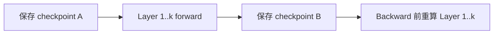

# 训练显存优化：重算、分片与 Offload

显存优化不是一张“省多少 GB”的功能表，而是三个旋钮：**缩短状态生命周期、减少每 rank 的副本、把状态移到更慢层级**。每一种优化都会引入计算、通信、I/O 或工程复杂度。

## Activation Checkpointing：用重算换保存

Activation Checkpointing（激活检查点，也称 activation recomputation）只保存选定边界的 activation，backward 时重新执行被丢弃的 forward 区间。

它减少 saved tensor，但增加 forward FLOPs（Floating-Point Operations，浮点运算次数）。边界太粗显存省得多却重算多；选择性 checkpoint 可只重算 attention/MLP 的高收益部分。随机数状态、dropout 与副作用必须保证重算一致。

## ZeRO 的三个 stage

Zero Redundancy Optimizer（ZeRO，零冗余优化器）沿 Data Parallel（DP，数据并行）group 分片模型状态：

| Stage | 分片内容 | 主要新增通信/峰值 |
|---|---|---|
| ZeRO-1 | optimizer states | update 前后参数同步/分片管理 |
| ZeRO-2 | + gradients | ReduceScatter/梯度 owner 语义 |
| ZeRO-3 | + parameters | layer 级参数 AllGather 与峰值展开 |

“理论每卡除以 DP size”只适用于被分片的静态状态。ZeRO-3 运行某层时仍需 materialize 所需参数；若 prefetch 多层、persistent small parameters 或通信 buffer 大，峰值可能明显高于理想值。

## FSDP 与 ZeRO-3 的关系

Fully Sharded Data Parallel（FSDP，全分片数据并行）与 ZeRO-3 核心思想相近：参数、梯度和 optimizer state 分片，计算前 AllGather，之后 reshard，梯度用 ReduceScatter。区别在 API、module wrapping、state dict、prefetch、mixed precision 与 runtime 细节，不能把配置名一一机械映射。

PyTorch FSDP2 的 `fully_shard` 以 DTensor（分布式张量）表达分片参数，便于 optimizer、gradient clipping 与 checkpoint 组合；实际项目仍要测试 mesh、reshard policy 和编译器兼容性。

## CPU / NVMe Offload

Offload 把参数、optimizer states 或 activation 移到 CPU DRAM，甚至 Non-Volatile Memory Express（NVMe，非易失性高速存储）设备。

$$
T_{offload}\approx\max(T_{compute},T_{transfer})+T_{unhidden}
$$

只有搬运被计算遮住且 host/NVMe 带宽足够，offload 才“便宜”。Pinned host memory 能支持异步 DMA，但过量 pin 会挤压操作系统可分页内存。NUMA placement、PCIe contention、prefetch distance 与 queue depth 都会决定结果。

## 组合策略的优先顺序

1. 先确认是否是泄漏/碎片/异常峰值，而不是模型本体太大；
2. 开 mixed precision、memory-efficient attention 与算子 fusion；
3. 用 checkpoint 控制 activation；
4. 用 ZeRO/FSDP 分片模型状态；
5. 再考虑 CPU/NVMe offload；
6. 最后根据端到端吞吐调 bucket、prefetch 与 persistence。

这不是绝对规则：长序列可能 activation 第一，超大模型可能参数分片第一。

## 一个选择例子

70B 模型在 8×80GB 上 OOM：

- 如果静态 model states 已超过总显存，checkpoint 无法解决，必须 TP/PP/ZeRO-3/FSDP 或 offload；
- 如果短序列可跑、长序列 OOM，优先查 activation 与 attention implementation；
- 如果只在 optimizer step OOM，查 master weights、foreach optimizer temporary 与 state 初始化；
- 如果第一个完整 step 后 OOM，查 gradient/optimizer lazy materialization；
- 如果运行数百 step 后缓慢增长，查 tensor reference/graph retention，而不是立刻调 allocator。

## 评价维度

同时报告 peak HBM、tokens/s、Model FLOPs Utilization（MFU，模型浮点运算利用率）、network/PCIe traffic、CPU usage、checkpoint time 与恢复时间。只报告“可训练”会掩盖 3 倍吞吐损失。

## 资料

- [DeepSpeed ZeRO](https://www.deepspeed.ai/tutorials/zero/)
- [PyTorch FSDP2 Tutorial](https://docs.pytorch.org/tutorials/intermediate/FSDP_tutorial.html)
- [PyTorch `fully_shard`](https://docs.pytorch.org/docs/stable/distributed.fsdp.fully_shard.html)
- [torchtune Memory Optimizations](https://docs.pytorch.org/torchtune/stable/tutorials/memory_optimizations.html)

