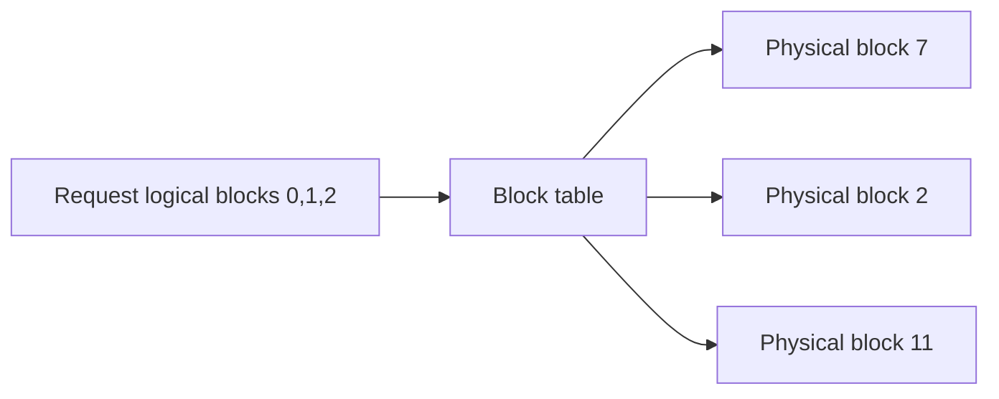

# 推理内存系统：KV Cache、Paging 与复用

## 为什么 decode 常是 memory-bound

Large Language Model（LLM，大语言模型）自回归生成每次只产生少量新 token，但每层 attention 要读取此前 token 的 Key–Value Cache（KV Cache，键值缓存）以及大量权重。矩阵维度小、复用低，使 decode 常由 HBM bandwidth 与 KV 容量限制；prefill 对整个 prompt 做大矩阵运算，更容易利用计算吞吐。

KV 每 token 公式见 [显存核算](02_GPU内存组成与显存核算.md)。这里关注其动态生命周期：请求长度未知、持续增长、完成后骤然释放，并发请求长度不一。

## PagedAttention 的核心不是“把 KV 放到磁盘”

PagedAttention 借鉴操作系统 paging：逻辑连续的 token block 可映射到不连续的物理 KV block。它解决为请求预留最大连续空间造成的外部碎片和过量 reservation。

block 太大会增加尾部内部碎片；太小会增加 block table、调度与 kernel 索引开销。PagedAttention 不压缩真实 K/V，也不保证跨请求复用。

## Prefix cache 与 prompt cache

若多个请求共享完全相同的 token prefix，可以让逻辑 block 指向同一只读 physical block，并用 copy-on-write 处理分叉。收益取决于命中率、prefix 长度和调度器能否把命中请求送到持有 cache 的 worker。

关键限制：文本看起来相同不等于 token/模型上下文相同；model revision、adapter、RoPE 配置、prompt template 和 cache dtype 都应进入 cache key。

## KV 的四种优化方向

| 方向 | 示例 | 代价 |
|---|---|---|
| 减少头数 | MQA/GQA | 需模型结构支持，可能影响质量 |
| 降低精度 | FP8/INT8 KV | 量化开销与精度验证 |
| 稀疏/淘汰 | sliding window、token eviction | 可能丢失长程信息 |
| 分层/远端存储 | CPU、NVMe、remote KV | 传输延迟、cache miss 与一致性 |

不要只报告容量节省；KV 压缩若导致输出 token 变长或 kernel 不支持高效读取，端到端 latency 可能更差。

## Chunked prefill 与 continuous batching

- Continuous batching（连续批处理）在请求完成/到达时动态重组 batch，提高 decode 利用率；
- Chunked prefill（分块预填充）把长 prompt 切块，避免一次 prefill 阻塞所有 decode；
- Scheduler 需要在 Time to First Token（TTFT，首 token 延迟）、Time Per Output Token（TPOT，每输出 token 时间）、throughput 与 cache pressure 间权衡。

显存水位接近上限时，调度器可减少新 prefill、preempt request、swap KV 或 recompute。所谓“引擎吞吐”很大一部分来自这个 memory-aware scheduler，而不仅是 attention kernel。

## KV Cache 的观测指标

- usable blocks、used blocks、内部碎片与 eviction rate；
- prefix hit rate，最好同时报告复用 token 数而非仅请求命中数；
- preemption/recompute/swap 数量；
- per-request KV bytes 与生命周期分布；
- HBM/CPU/remote tier 的 hit latency；
- 因 cache pressure 拒绝或排队的请求。

## 资料

- [PagedAttention 论文](https://arxiv.org/abs/2309.06180)
- [vLLM Paged Attention Design](https://docs.vllm.ai/en/stable/design/paged_attention/)
- [NVIDIA Dynamo Glossary：Block 与 KV Cache](https://docs.nvidia.com/dynamo/reference/glossary)

