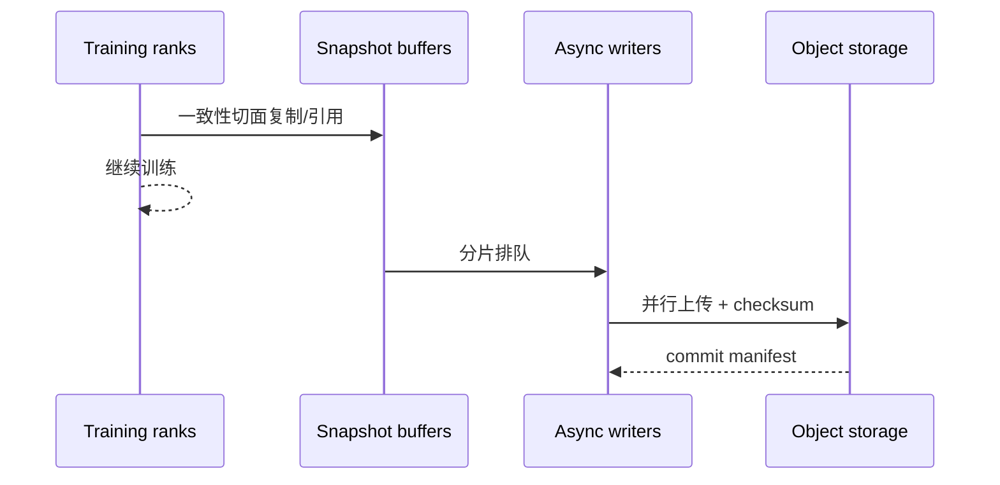

# 分布式 Checkpoint 与恢复

<!-- learning-position -->
> **学习定位**：A3/A7 · 必修。
> **前置**：[通信与 tensor 基础](<../00_Foundations/06_两卡通信与torchrun.md>)。
> **首读/二读**：状态完整性、一致性切面、重分片；中断恢复不能只检查加载成功。
> **进度与实验**：[学习清单](<../学习清单.md>) · [总入口](<../README.md>)。
<!-- /learning-position -->

## 入门例子：用中断前后两张状态表定义恢复

假设 step 100 已完成 optimizer update，但保存过程只写完部分 rank 文件就中断。存在目录不等于存在可恢复的一致 checkpoint；完成标记和全局 metadata 应在所需状态就绪后才代表提交成功，具体协议以框架实现为准。

| 状态 | 为什么要保存 | 只恢复模型可能出现什么 |
|---|---|---|
| 模型、优化器、学习率进度 | 确定下一次更新 | 更新轨迹改变 |
| RNG 与数据迭代位置 | 确定后续随机性与样本 | 重复/遗漏样本 |
| 并行布局 metadata | 解释每个 shard | 改卡数后装错分片 |
| RL 特有 buffer/版本状态 | 确定轨迹是否仍可消费 | 用错旧样本或重复消费 |

实验在独立小任务中进行：连续跑一段作为对照，再保存、重启并比较接续的样本 id、step/LR、参数和指标。需要 bitwise、容差内数值一致还是统计可接受，应在实验前定义。

## 机制与实现

Checkpoint（检查点）不是简单的 `torch.save(model)`。大规模任务要同时解决：分片状态一致性、并行写入、存储峰值、拓扑变化后的 reshard、版本兼容与故障恢复时间。

## 需要保存什么

| 状态 | 是否通常需要 | 说明 |
|---|---|---|
| model parameters/buffers | 是 | 可能按 TP/PP/DP/EP 分片 |
| optimizer states | 训练恢复需要 | 通常比参数更大 |
| learning-rate scheduler | 是 | 否则训练轨迹变化 |
| random number generator state | 精确恢复需要 | CPU/CUDA/data pipeline 均可能有 RNG |
| data loader progress | 通常需要 | 避免重复/跳过样本 |
| gradient scaler | mixed precision 需要 | 影响 loss scaling |
| topology/metadata | 是 | 用于解释 shard 与版本 |

## 一致性切面

所有 rank 必须对“保存的是哪一个 step”达成一致。若某些 rank 已 optimizer step、另一些尚未，文件即使完整也不可恢复。常用办法是在安全点 quiesce，或构建 copy-on-write snapshot 后让训练继续、异步落盘。

最后写 manifest/commit marker 很重要：恢复端只加载已经原子提交的版本，避免把半套 shard 当成有效 checkpoint。

## Sharded checkpoint 与 reshard

Sharded checkpoint 让各 rank 并行保存本地 shard，避免 rank 0 聚合导致 OOM 与单点 I/O。恢复时若 world size 或 mesh 改变，需要 load-time reshard：读取逻辑全局 tensor metadata，把旧 shard 映射成新 shard。

PyTorch Distributed Checkpoint（DCP，分布式检查点）支持多 rank 并行 save/load 和 load-time reshard。兼容性仍取决于 state dict 结构、tensor key、dtype、planner 和应用版本，不能只依赖文件扩展名。

## Checkpoint 频率的期望成本

若故障平均间隔为 $M$，一次 checkpoint 花费 $C$，经典近似的最优周期与 $\sqrt{2CM}$ 同阶。直觉是：太频繁浪费 I/O，太稀疏则故障后重算多。大集群的系统级 Mean Time Between Failures（MTBF，平均故障间隔）会随组件数量增长而下降，因此 checkpoint 必须进入吞吐模型。

## 可靠性验证

一个“成功写完”的 checkpoint 仍可能不可用。必须定期做：

1. checksum 和 manifest 完整性验证；
2. 在独立 job 中实际 load；
3. 改变 DP size 的 reshard 演练；
4. 至少跑若干 step 比较 loss/optimizer continuity；
5. 注入 rank failure、storage timeout、部分文件缺失；
6. 测量 Recovery Time Objective（RTO，恢复时间目标）与 Recovery Point Objective（RPO，恢复点目标）。

## Silent Data Corruption

Silent Data Corruption（SDC，静默数据损坏）不会总以进程 crash 呈现。ECC、checksum、梯度/权重统计、loss anomaly、冗余验证与 checkpoint lineage 共同构成防线。NCCL RAS 能诊断部分 hardware/communicator 状态，但不验证模型 tensor 数值正确性。

## 资料

- [PyTorch Distributed Checkpoint](https://docs.pytorch.org/docs/stable/distributed.checkpoint.html)
- [DeepSpeed Universal Checkpointing](https://arxiv.org/abs/2406.18820)
- [NCCL RAS](https://docs.nvidia.com/deeplearning/nccl/user-guide/docs/troubleshooting/ras.html)
