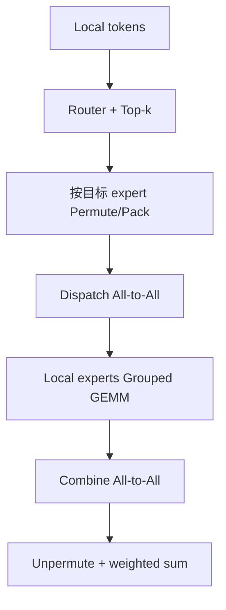

# 案例：MoE 的 All-to-All 为什么难

<!-- learning-position -->
> **学习定位**：A8 · 专项。
> **前置**：[GPU、tensor 与通信基础](<../00_Foundations/README.md>)。
> **首读/二读**：逐步走 dispatch→expert→combine；用真实 token 分布解释通信。
> **进度与实验**：[学习清单](<../学习清单.md>) · [总入口](<../README.md>)。
<!-- /learning-position -->

## 入门例子：四个 token、两个 expert 的路由账

rank 0 和 rank 1 各持有两枚 token；expert E0 在 rank 0，E1 在 rank 1。若 rank 0 的两枚都去 E1、rank 1 的两枚都去 E1，则 E1 必须处理四枚，E0 没有工作。通信正确也无法消除 expert 计算长尾。

top-k>1 时一枚 token 可产生多个 expert assignment，combine 再按原 token 和权重合并。通信量应按实际 assignment 和 dtype 计，而不是仅按原 token 数。pack/unpack、padding 与路由排序同样有成本。

练习：手写 token id、源 rank、目标 expert、目标 rank、返回位置五列；先检查 combine 后顺序正确，再比较均匀与倾斜路由。不要为了均衡擅自丢弃 token；drop/capacity 会改变模型语义。

## 机制与实现

Mixture of Experts（MoE，混合专家模型）让每个 token 只经过少数 expert，从而以较低 active FLOPs 扩大参数量。但 expert 分散在不同 rank 后，router 选择会立即变成动态通信问题。

## 一次 MoE layer 的数据流

Grouped General Matrix Multiplication（Grouped GEMM，分组矩阵乘）处理不同 expert 的多个小矩阵。通信和计算共同受 token distribution 影响：某个 expert 过热时，不仅接收流量增加，GEMM 工作也变长，形成 straggler。

## 通信量心算

设本 rank 有 $T$ 个 token，hidden size 为 $H$，activation 每元素 $b$ bytes，top-k 为 $k$。忽略 metadata，一次 dispatch payload 约：

$$
V_{dispatch}\approx T\times H\times b\times k
$$

combine 还要传回 expert output，量级类似。实际字节还包含 routing index、scale、padding、低精度对齐与 duplicated token。若 expert 与 token 在同一 rank，本地部分无需出网络，因此跨节点比例取决于 placement。

## 为什么普通等长 All-to-All 不够

- 每个目的 rank 的 token 数动态变化，需要 AllToAllV 或先交换 count；
- capacity factor/padding 可把变长转定长，却浪费 bandwidth 与 compute；
- top-k 会复制 token 到多个 expert；
- 节点内 NVLink 与节点间 RDMA 带宽不对称；
- low-latency decode 与 high-throughput training/prefill 需要不同 kernel。

## DeepEP 在优化什么

DeepEP（Deep Expert Parallel）是 DeepSeek 开源的 expert-parallel communication library，提供 MoE dispatch/combine 的高吞吐与低延迟 GPU kernel，并支持 FP8（8-bit floating point，8 位浮点）等低精度传输。其设计强调节点内 NVLink 与跨节点 RDMA 的不对称 forwarding、SM 数量控制，以及面向 decode 的 low-latency mode。

截至 2026-09，DeepEP 主线文档已经把早期基于 NVSHMEM 的 V1 标为 legacy，并在 V2 扩展到 pipeline/context parallel experimental primitives 与 remote memory。项目 benchmark 是特定 H800/CX7、message shape 和配置下的证据，不能直接外推到任意 RoCE/Blackwell 集群。

PyTorch 2.14 还引入 TokenSwitch 抽象，把 token dispatch/combine 与 backend 解耦，首个 backend 为 TokenSwitchNCCL。社区的共同方向是让 EP communication 成为框架一等接口；但 DeepEP、NCCL EP/TokenSwitch 的成熟度、硬件覆盖和 API 稳定性仍需逐版本评估。

## 优化顺序

1. 先测 router balance：per-expert tokens 的 max/mean、p99；
2. 确认 expert placement 与节点边界，统计 local/intra-node/inter-node token 比例；
3. 分别测 pack、dispatch、Grouped GEMM、combine、unpack；
4. 观察并发后 SM/HBM/network contention；
5. 尝试低精度通信、token drop/capacity、expert replication 或 load-balancing loss；
6. 用最终模型质量、tokens/s 和 tail expert time 验证。

### 反例

把 dispatch 从 2 ms 降到 1.4 ms，但占用更多 SM，使 Grouped GEMM 从 3 ms 升到 4 ms，端到端反而从约 5 ms 变 5.4 ms。通信库的单项 benchmark 胜出不等于 MoE layer 胜出。

## 排查信号

- `max tokens/expert ÷ mean` 持续偏高：router imbalance；
- 节点内快、跨节点断崖：NIC/GDR/placement；
- 大 batch 快、decode 慢：kernel 追求 throughput 而非 latency；
- 通信快但 layer 慢：permute/unpermute 或 expert GEMM；
- 偶发 hang：变长 count 不一致、rank error、NVSHMEM/NCCL ordering 或网络问题。

## 资料

- [DeepEP Repository](https://github.com/deepseek-ai/DeepEP)
- [DeepEP V1 Legacy Notes](https://github.com/deepseek-ai/DeepEP/blob/main/docs/legacy.md)
- [PyTorch 2.14：TokenSwitch](https://pytorch.org/blog/pytorch-2-14-release-blog/)
