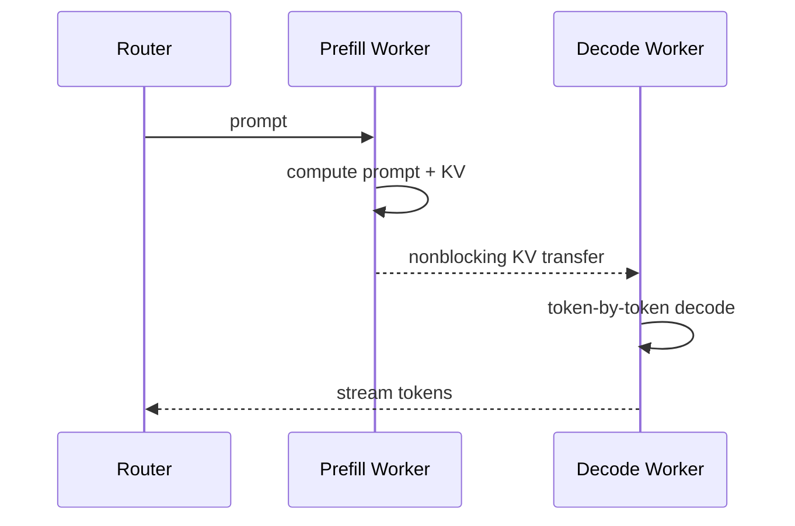

# 案例：Prefill–Decode 分离与 KV Cache 传输

## 为什么要分离

Prefill（预填充）一次处理整段 prompt，通常是大矩阵、compute-bound；Decode（解码）逐 token 执行，通常更受 HBM bandwidth、KV Cache 和调度影响。把两者 colocate 在同一 GPU pool 会互相干扰，也让资源比例和并行策略绑死。

Prefill–Decode disaggregation（预填充—解码分离）让两种 worker 独立扩缩，但产生一个新依赖：prefill 生成的 KV 必须传给 decode。

## 何时值得分离

DistServe 论文把目标定义为在 TTFT（Time to First Token，首 token 延迟）和 TPOT（Time Per Output Token，每输出 token 时间）约束内的 goodput。分离可消除 phase interference，并分别选择 prefill/decode parallelism；代价是 KV transfer、额外 queue、routing 和故障域。

一个粗略判据：

$$
T_{KV\ transfer}+T_{extra\ queue}<T_{interference\ saved}+T_{placement\ gain}
$$

若 prompt 短、网络慢、同机资源已足够，聚合部署可能更简单更快。分离不是无条件先进。

## KV 传输量

如果 prompt 有 $S$ token，每 token KV 为 $m$ bytes，则一次请求要搬约 $Sm$。以每 token 320 KiB、32K prompt 为例，KV 接近 10 GiB；即使 400 Gb/s 链路的应用有效吞吐达到 40 GB/s，纯传输下限也约 250 ms，还未算排队和竞争。这说明长上下文 P/D 分离必须依赖高带宽路径、分块/流水化、缓存命中或减少 KV 字节。

## NVIDIA Dynamo 的当前实现视角

NVIDIA Dynamo 当前文档使用 NIXL（NVIDIA Inference Xfer Library，NVIDIA 推理传输库）把 KV 从 prefill GPU VRAM 非阻塞传到 decode GPU VRAM，并结合 KV-aware routing。跨节点生产部署建议 RDMA/等价高速 fabric；若回退 TCP，KV transfer 可能成为 TTFT 与 throughput 的主瓶颈。

Topology-aware KV transfer 会优先让 P/D worker 落在同一 zone/rack 等 domain，减少慢速跨域搬运。这说明 router 的目标不能只有“最空闲 GPU”，还要联合 cache locality、queue 和 network locality。

## 流水化机会

- layer-wise transfer：前几层 KV 生成后即开始传，而非等待全模型 prefill 完成；
- chunked prefill：每个 prompt chunk 计算/传输流水化；
- push 与 pull：由 prefill push，或 decode 按需 pull；
- prefix locality：若 decode/prefill 一侧已有共享 prefix，避免重复传输；
- remote KV tier：把复用价值高的 KV 放入共享 cache，但要控制一致性与尾延迟。

## 关键风险

1. KV 已传完但 request metadata/ownership 未原子提交；
2. decode worker 失败后留下 orphan KV blocks；
3. model/adaptor/version 不一致导致 cache 语义错误；
4. 多个大 KV transfer 发生 routing collision，压垮同一 uplink；
5. 传输与 decode 竞争 HBM bandwidth，所谓 nonblocking 仍拖慢 token loop。

## 该怎么 benchmark

至少分为：

- aggregated baseline；
- 同节点 P/D；
- 同 rack RDMA；
- 跨 rack/zone；
- cold cache 与 warm prefix cache；
- 短/中/长 prompt × 短/长 output。

同时报告 TTFT、TPOT/Inter-Token Latency（ITL，token 间延迟）、goodput、KV transfer bytes/time、queue time、cache hit rate 与 network p99。只报平均吞吐会掩盖分离对 tail SLO 的影响。

## 资料

- [DistServe Paper](https://arxiv.org/abs/2401.09670)
- [NVIDIA Dynamo Disaggregated Serving](https://docs.nvidia.com/dynamo/dev/kubernetes/disaggregated-serving/overview)
- [Dynamo：Topology-Aware KV Transfer](https://docs.nvidia.com/dynamo/knowledge-base/kubernetes/multinode/topology-aware-kv-transfer)

