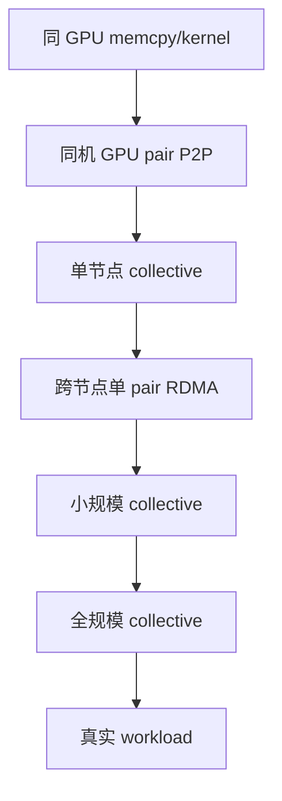

# 实验与排查手册

<!-- learning-position -->
> **学习定位**：A2/A7 · 必修。
> **前置**：[两卡通信](<../00_Foundations/06_两卡通信与torchrun.md>)。
> **首读/二读**：拓扑→P2P→Collective→多机，分别记录显存与带宽证据。
> **进度与实验**：[学习清单](<../学习清单.md>) · [总入口](<../README.md>)。
<!-- /learning-position -->

本章目标是把“通信慢/显存高”变成可证伪的层级假设。不要一上来调几十个 NCCL 环境变量。

## 0. 固化实验身份

记录：GPU/NIC/switch 型号、firmware、driver、CUDA、NCCL、PyTorch、container digest、节点列表、拓扑、环境变量、tensor shape/dtype、warmup/iteration、时钟与功耗策略。没有这些信息的 benchmark 很难复现。

## 1. 拓扑与健康

```bash
nvidia-smi topo -m
nvidia-smi -q
ibstat
ibdev2netdev
rdma link
```

确认 GPU–NIC affinity、NVLink 状态、PCIe width/speed、HCA port 与 Error Correcting Code（ECC，错误校正码）/Xid。RoCE 还需由网络侧确认 Priority Flow Control（PFC，优先级流量控制）、Explicit Congestion Notification（ECN，显式拥塞通知）、MTU 与 counters。

## 2. 建立带宽阶梯

按下面顺序运行，首次失败的层就是优先调查边界：



`nccl-tests` 至少 sweep 8 B 到数 GiB，并分别测 AllReduce、AllGather、ReduceScatter、All-to-All。记录 algbw/busbw、p50/p99 和 correctness error。

## 3. 最小 NCCL 基线

```bash
NCCL_DEBUG=INFO ./build/all_reduce_perf -b 8 -e 8G -f 2 -g 1
```

多节点启动方式依集群而定。先不强制 `NCCL_ALGO`、`NCCL_PROTO`、HCA 或 channel；保存默认选路后，再一次只改一个变量。若强制后变快，问题可能是 cost model/topology discovery；也可能只对一个 size 有效。

## 4. 显存证据

PyTorch 中同时记录：

```python
torch.cuda.reset_peak_memory_stats()
# run target region
print(torch.cuda.memory_allocated())
print(torch.cuda.memory_reserved())
print(torch.cuda.max_memory_allocated())
print(torch.cuda.memory_summary())
```

复杂 OOM 使用 memory snapshot；同时取 `nvidia-smi`，因为 NCCL/CUDA context 等 non-PyTorch allocations 不一定出现在 PyTorch allocator snapshot 中。

## 5. Timeline 证据

用 Nsight Systems 或 PyTorch Profiler 回答：

- tensor ready 到 collective launch 相隔多久？
- collective 在哪个 stream，前后有哪些 event/barrier？
- NCCL 与 GEMM 并发时各自 duration 是否变长？
- 空洞发生在 CPU、CUDA launch、data loader、communication 还是 pipeline bubble？
- 最后一个 exposed collective 占 step 多少？

Nsight Compute 适合单 kernel 的 SM/HBM/occupancy 深挖，不适合先回答全局“谁在等谁”。

## 故障症状矩阵

| 症状 | 高概率层次 | 第一证据 |
|---|---|---|
| 所有 rank 同步 hang | collective mismatch / rank failure / fabric | per-rank stack + NCCL RAS/log |
| 跨节点慢、节点内正常 | GDR、NIC affinity、routing/congestion | pair RDMA + topo + counters |
| 小消息慢、大消息正常 | $\alpha$、launch、步骤数 | size sweep、Tree/PAT A/B |
| 大消息平台期过低 | link/injection/HBM/channel | busbw、link counters、timeline |
| 只有 MoE 慢 | imbalance、pack、AllToAllV | per-expert tokens + phase timing |
| reserved 很高但 allocated 低 | allocator cache/fragmentation | memory summary/snapshot |
| 并发后通信计算都变慢 | SM/HBM/fabric contention | isolated vs concurrent duration |

## 最小复现实验模板

每份性能结论应包含：

1. 问题：例如 64 MiB AllReduce 跨 8 节点低于预期；
2. 假设：所有 rank 错用了同一 HCA；
3. 控制变量：相同节点、版本、size、算法；
4. 干预：只改变 GPU–HCA binding；
5. 结果：p50/p99、busbw、port counters；
6. 结论边界：只对该 topology/版本成立；
7. 回归保护：加入持续 benchmark 或告警。

## 生产检查

- 不把 debug/强制 env 永久写进全局镜像；
- 为 NCCL timeout 配合 rank-level error propagation，避免僵尸 job；
- 监控 NVLink/PCIe/NIC error counters、retransmit、congestion 与 GPU Xid；
- 定期做 checkpoint restore drill；
- benchmark 需要与模型关键消息分布一致，而非只有 1 GiB 大包；
- 变更 driver/NCCL/firmware 后自动跑通信和显存回归。

## 资料

- [nccl-tests](https://github.com/NVIDIA/nccl-tests)
- [NCCL Troubleshooting](https://docs.nvidia.com/deeplearning/nccl/user-guide/docs/troubleshooting.html)
- [NCCL RAS](https://docs.nvidia.com/deeplearning/nccl/user-guide/docs/troubleshooting/ras.html)
- [PyTorch Understanding CUDA Memory Usage](https://docs.pytorch.org/docs/stable/torch_cuda_memory.html)
