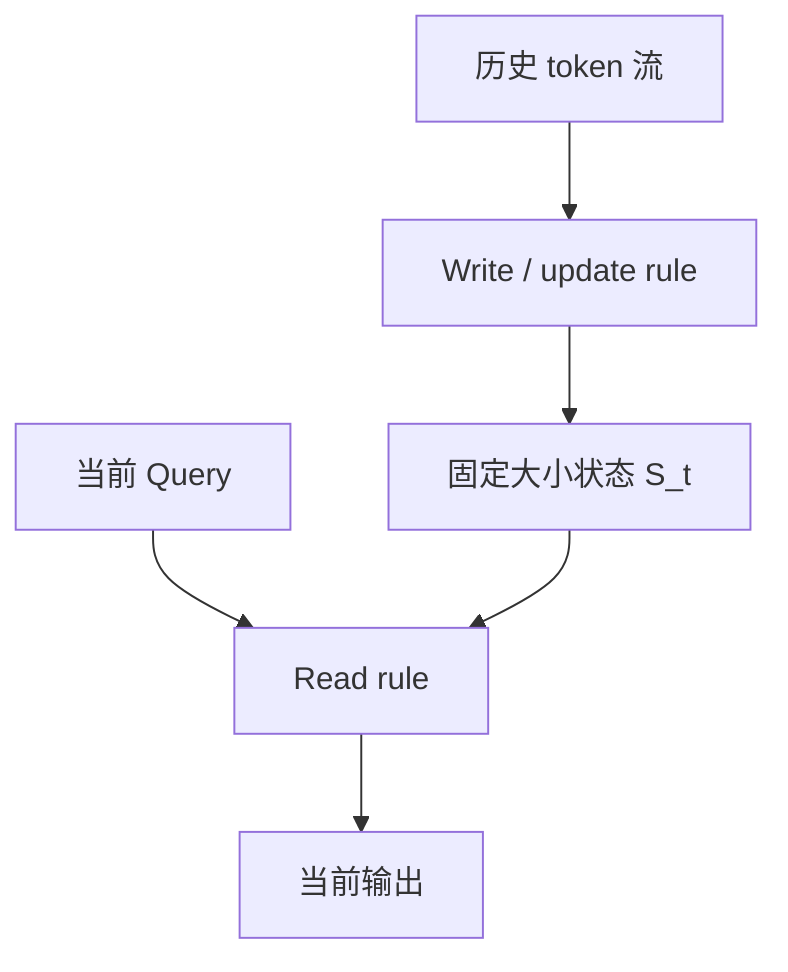

# 基本定义与状态记忆

> 类型：专题详解。所属：[专题总览](README.md)。涉及模型版本、API 和性能数字的旧稿内容尚未逐条重新核验，见[版本与验证范围](../../版本与验证范围.md)。

<a id="read-01"></a>

## 缩写与术语

| 缩写 | 全称 | 中文解释 |
|---|---|---|
| LA | Linear Attention | 线性注意力；本文狭义上指可用结合律改写为线性复杂度的 Attention |
| RNN | Recurrent Neural Network | 循环神经网络，通过递推状态处理序列 |
| FWP | Fast Weight Programmer | 快速权重编程器，把序列状态看成在线更新的权重矩阵 |
| SSM | State Space Model | 状态空间模型，用状态转移描述序列动态 |
| GLA | Gated Linear Attention | 带门控的线性注意力 |
| GDN | Gated DeltaNet | 将 forget gate 与 delta rule 组合的线性递推结构 |
| KDA | Kimi Delta Attention | Kimi 的细粒度 gated delta attention |
| SSD | State Space Duality | 状态空间对偶，把 SSM 与结构化 Attention 联系起来 |
| DPLR | Diagonal Plus Low Rank | 对角加低秩矩阵结构 |
| KV | Key-Value | Attention 中保存历史 Key/Value 的状态 |
| MLA | Multi-head Latent Attention | 多头潜变量注意力，用 latent KV 压缩 Cache |
| DSA | DeepSeek Sparse Attention | DeepSeek 的可学习动态稀疏注意力 |
| GQA / MQA | Grouped-Query / Multi-Query Attention | 分组查询 / 多查询注意力，通过共享 KV 降低 Cache |
| MoE | Mixture of Experts | 混合专家网络，每个 token 只激活少量专家 |
| RoPE / NoPE | Rotary Position Embedding / No Position Encoding | 旋转位置编码 / 不使用显式位置编码 |
| HBM | High Bandwidth Memory | GPU 高带宽显存 |
| SRAM | Static Random-Access Memory | GPU 片上共享内存/缓存语境中的高速存储 |
| TTFT | Time To First Token | 首 token 延迟，通常由排队和 prefill 主导 |
| ITL / TPOT | Inter-Token Latency / Time Per Output Token | 连续输出 token 间延迟 |
| CP / TP | Context / Tensor Parallelism | 上下文并行 / 张量并行 |

这里的 “Linear” 指对序列长度 $L$ 的时间复杂度近似为 $O(L)$，不是“这一层只有 Linear/全连接算子”，也不代表所有维度上的成本都是常数。

---


<a id="read-02"></a>

<a id="0-先给结论linear-attention-把历史从-token-列表变成了一个程序状态"></a>

## 先给结论：Linear Attention 把历史从 token 列表变成了一个程序状态

标准 Attention 的历史记忆是：

```math
\mathcal M_t^{\text{softmax}}
=\{(k_1,v_1),(k_2,v_2),\ldots,(k_t,v_t)\}.
```

每生成一个 token，都对这张不断增长的 token-level memory 做一次查询。即使使用 MLA 压缩每条 KV record，状态仍随 $t$ 增长。

Linear Attention 的历史记忆是：

```math
S_t=f(S_{t-1},k_t,v_t,g_t),
\qquad
y_t=r(q_t,S_t).
```

新 token 不只是“追加到 Cache”，而是对有限大小的状态执行一次写操作；Query 则从该状态读出结果。



因此它最诱人的性质是：

| 阶段 | Softmax Attention | Linear/Recurrent Attention |
|---|---:|---:|
| Training/Prefill 计算 | $O(L^2d)$ | 通常 $O(Ld^2)$ 或 $O(Ld_kd_v)$ |
| Decode 单步序列成本 | $O(Ld)$ | 与 $L$ 无关 |
| 序列方向 Cache | $O(Ld)$ | 相对 $L$ 为 $O(1)$ |
| 历史表示 | 每个 token 独立保存 | 多个 token 叠加在有限 state |
| 精确随机访问 | 强 | 天然受限 |

但这里的“固定状态”会把新的瓶颈暴露出来：

1. **容量冲突**：越来越多关联写进同一个矩阵；
2. **遗忘策略**：什么该保留、什么该清除；
3. **写入规则**：如何覆盖同一个 Key 的旧 Value，而不是只叠加；
4. **Prefill 并行性**：递推看似必须逐 token 执行；
5. **状态带宽**：decode 每步仍要读写完整 matrix state；
6. **精确检索**：有限状态不能无损容纳无限 token identity；
7. **回滚与分支**：speculative decoding 不能只截断一个 KV page table。

所以 Linear Attention 的完整演化不是“把 softmax 换成 kernel trick”，而是：

```math
\boxed{
\text{Associative factorization}
\rightarrow
\text{Fast-weight memory}
\rightarrow
\text{Decay / Delta update}
\rightarrow
\text{Hardware-efficient chunking}
\rightarrow
\text{Linear + exact Attention hybrid}
}
```

---


<a id="read-03"></a>

<a id="1-先划清边界哪些结构可以叫-linear-attention"></a>

## 先划清边界：哪些结构可以叫 Linear Attention

今天“Linear Attention”常被用作三个不同层次的词。

<a id="11-狭义kernelized-linear-attention"></a>

### 1 狭义：Kernelized Linear Attention

把相似度函数写成 feature map 内积：

```math
\operatorname{sim}(q,k)=\phi(q)^\top\phi(k),
```

再利用矩阵乘法结合律把 $(QK^\top)V$ 改写为 $Q(K^\top V)$。Linear Transformer、Performer 属于这条主线。

<a id="12-中义matrix-state-linear-rnn--fast-weight-model"></a>

### 2 中义：Matrix-state Linear RNN / Fast-weight model

状态通常为矩阵：

```math
S_t\in\mathbb R^{d_k\times d_v}.
```

每个 token 通过 outer product 或 delta rule 更新它。GLA、DeltaNet、Gated DeltaNet、KDA 属于这条主线，也是现代 Hybrid LLM 最直接采用的结构。

<a id="13-广义线性时间-recurrent-token-mixer"></a>

### 3 广义：线性时间 recurrent token mixer

RetNet、RWKV、S4/Mamba、Hyena 也具有线性或近线性序列计算、固定 recurrent state 或卷积等价形式，工程讨论中常与 Linear Attention 放在同一类比较。但它们并不都来自同一个 kernel factorization。

本文会纳入这些里程碑工作，因为它们共同推动了：

- parallel training 与 recurrent inference 的双重形式；
- selective forgetting；
- scan/chunk kernel；
- Hybrid Attention 架构。

但公式会明确标注属于 LA、RNN、SSM 还是 convolution 路线。

---


<a id="read-04"></a>

<a id="2-为什么-softmax-attention-不能直接交换乘法顺序"></a>

## 为什么 Softmax Attention 不能直接交换乘法顺序

标准因果 Attention：

```math
a_{t,s}
=\frac{\exp(q_t^\top k_s/\sqrt d)}
{\sum_{j\le t}\exp(q_t^\top k_j/\sqrt d)},
\qquad
y_t=\sum_{s\le t}a_{t,s}v_s.
```

矩阵形式：

```math
Y=\operatorname{Softmax}(QK^\top)V.
```

如果没有 Softmax，结合律允许：

```math
(QK^\top)V=Q(K^\top V).
```

两种计算顺序的中间张量是：

| 顺序 | 中间张量 | 大小 |
|---|---|---:|
| $(QK^\top)V$ | $QK^\top$ | $L\times L$ |
| $Q(K^\top V)$ | $K^\top V$ | $d_k\times d_v$ |

当 $L\gg d_k,d_v$ 时，后者显著更小。但 row-wise Softmax 依赖每个 Query 对全部 Key 的 logits，不能简单穿过括号：

```math
\operatorname{Softmax}(QK^\top)V
\ne
Q\operatorname{Softmax}(K^\top V).
```

Linear Attention 的关键是换一种可分解的相似度，或者设计一个能以递推状态实现的 token mixer。

---


<a id="read-05"></a>

<a id="3-kernelized-linear-attention-的完整推导"></a>

## Kernelized Linear Attention 的完整推导

设非负相似度：

```math
\operatorname{sim}(q,k)=\phi(q)^\top\phi(k),
\qquad
\phi(x)\in\mathbb R^{d_\phi}.
```

则：

```math
y_t
\mathrel{=}
\frac{
\sum_{s\le t}\phi(q_t)^\top\phi(k_s)v_s
}{
\sum_{s\le t}\phi(q_t)^\top\phi(k_s)
}.
```

利用结合律定义两个前缀状态：

```math
S_t
=\sum_{s\le t}\phi(k_s)v_s^\top
\in\mathbb R^{d_\phi\times d_v},
```

```math
z_t
=\sum_{s\le t}\phi(k_s)
\in\mathbb R^{d_\phi}.
```

输出为：

```math
y_t
=\frac{\phi(q_t)^\top S_t}
{\phi(q_t)^\top z_t+\epsilon}.
```

<a id="31-recurrent-form"></a>

### 1 Recurrent form

```math
S_t=S_{t-1}+\phi(k_t)v_t^\top,
```

```math
z_t=z_{t-1}+\phi(k_t),
```

```math
y_t=\frac{\phi(q_t)^\top S_t}
{\phi(q_t)^\top z_t+\epsilon}.
```

每个 token 只更新固定大小状态。这正是 2020 年 **Transformers are RNNs** 的核心洞察：线性化 Attention 可以用 RNN 形式做自回归推理。

<a id="32-parallel-form"></a>

### 2 Parallel form

对非因果场景：

```math
S=\Phi(K)^\top V,
\qquad
Y=\Phi(Q)S.
```

因果场景要用 prefix sum 或 chunkwise causal mask：

```math
S_t=\operatorname{PrefixSum}_t
\left(\phi(k_t)v_t^\top\right).
```

所以 Linear Attention 同时具有：

- 训练/prefill 的批量矩阵形式；
- decode 的 recurrent 形式。

这叫 **sequential-parallel duality**：同一个算子既能并行处理长序列，又能以常数状态逐 token 更新。

<a id="33-状态到底有多大"></a>

### 3 状态到底有多大

对于 $H$ 个 state heads：

```math
N_{state}
=H(d_\phi d_v+d_\phi).
```

若 $H=32$、$d_\phi=d_v=128$，仅矩阵状态元素数为：

```math
32\times128\times128=524,288.
```

BF16 大约：

```math
524,288\times2\text{ B}=1\text{ MiB/layer/request}.
```

它与 context length 无关，但绝不是“状态很小”。40 个 Linear Attention 层、batch 1 就可能约 40 MiB；若状态用 FP32，翻倍。

---


<a id="read-06"></a>

<a id="4-feature-map线性化-softmax-的代价在哪里"></a>

## Feature Map：线性化 Softmax 的代价在哪里

<a id="41-简单正值-feature-map"></a>

### 1 简单正值 feature map

Linear Transformer 常用：

```math
\phi(x)=\operatorname{ELU}(x)+1,
```

保证 feature 非负，使归一化分母更稳定。

它不等价于 Softmax kernel：

```math
\exp(q^\top k)
```

与：

```math
\phi(q)^\top\phi(k)
```

具有不同归纳偏置。效率来自改变 Attention，而不是免费重排同一个 Softmax。

<a id="42-performer-与-favor"></a>

### 2 Performer 与 FAVOR+

Performer 使用 FAVOR+（Fast Attention Via positive Orthogonal Random features），用正交随机特征近似 Softmax kernel：

```math
\exp(q^\top k)
\approx
\phi(q)^\top\phi(k).
```

它的重要里程碑意义是：

- 尝试保留 Softmax kernel 的性质；
- 给出近似误差与方差方面的理论保证；
- 不依赖预定义 sparsity pattern；
- 时间和空间随 $L$ 线性增长。

但 random feature dimension 越小，近似误差越大；越大，状态 $d_\phi\times d_v$ 和每 token 计算越贵。

<a id="43-linear-attention-的低秩视角"></a>

### 3 Linear Attention 的低秩视角

隐式 Attention matrix：

```math
A=\Phi(Q)\Phi(K)^\top.
```

其 rank 不超过 $d_\phi$：

```math
\operatorname{rank}(A)\le d_\phi.
```

当 $L\gg d_\phi$，所有 token-to-token 交互被限制在低维 feature subspace 中。这既是效率来源，也是表达瓶颈。

---


<a id="read-07"></a>

<a id="5-从-attention-到-fast-weight-programmer"></a>

## 从 Attention 到 Fast Weight Programmer

2021 年 **Linear Transformers Are Secretly Fast Weight Programmers** 给出了非常有用的解释：

```math
S_t=S_{t-1}+k_tv_t^\top
```

不是普通 hidden state 更新，而是在在线编程一个“快速权重矩阵”。

<a id="51-写入"></a>

### 1 写入

outer product：

```math
\Delta S_t=k_tv_t^\top
```

表示“把 Key pattern $k_t$ 映射到 Value $v_t$”。

<a id="52-读取"></a>

### 2 读取

```math
y_t=q_t^\top S_t.
```

Query 与多个 Key pattern 的相似度决定从矩阵中读出哪些 Value 成分。

<a id="53-为什么叫-fast-weight"></a>

### 3 为什么叫 fast weight

- 模型参数 $W_Q,W_K,W_V$ 通过训练慢慢更新，是 slow weights；
- 序列内的 $S_t$ 每个 token 都更新，是 fast weights；
- 输入 token 生成对 fast weights 的读写指令。

这把 Linear Attention 与 test-time learning 联系起来：模型不是只做一次前向，而是在上下文中持续执行一个受学习控制的在线学习算法。

<a id="54-容量冲突"></a>

### 4 容量冲突

若两个 Key 相似：

```math
k_a^\top k_b\approx1,
```

那么它们写入的 Value 会相互干扰。读 $k_a$ 时可能得到：

```math
S^\top k_a
\approx v_a+(k_b^\top k_a)v_b+\cdots.
```

状态是 superposition memory，不是哈希表。随着 token 增加，collision 和 interference 自然累积。

---


<a id="read-08"></a>

<a id="6-vanilla-additive-update-为什么不够"></a>

## Vanilla additive update 为什么不够

最简单的更新：

```math
S_t=S_{t-1}+k_tv_t^\top
```

有三个核心问题。

<a id="61-不会忘"></a>

### 1 不会忘

所有 token 永久同权叠加。长序列中无关信息越来越多，状态幅度和干扰增长。

<a id="62-不会覆写"></a>

### 2 不会覆写

若上下文先出现：

```text
key = city, value = Beijing
```

后来出现：

```text
key = city, value = Shanghai
```

加法更新会把两个 Value 都叠加，不能自然表达“最新映射替换旧映射”。

<a id="63-写入强度不可控"></a>

### 3 写入强度不可控

每个 token 都以同一种方式写入。噪声 token 与关键 token 竞争有限状态容量。

后续结构的演化几乎都围绕三种操作：

| 操作 | 问题 | 结构工具 |
|---|---|---|
| Forget | 清除无关或陈旧状态 | decay / forget gate |
| Correct | 覆写某个 Key 对应的旧映射 | delta rule |
| Route | 把不同信息写到不同通道/状态 | channel gate、heads、slots、mixture memory |

---

---

[所属专题](README.md) · [百科总览](../../README.md)
