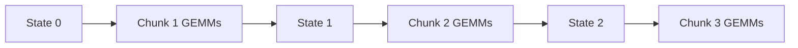

# 并行执行与反向传播

> 类型：专题详解。所属：[专题总览](README.md)。涉及模型版本、API 和性能数字的旧稿内容尚未逐条重新核验，见[版本与验证范围](../../版本与验证范围.md)。

<a id="read-18"></a>

<a id="16-三种执行模式recurrentparallelchunkwise"></a>

## 三种执行模式：Recurrent、Parallel、Chunkwise

<a id="161-recurrent-mode"></a>

### 1 Recurrent mode

逐 token 更新：

```python
for t in range(T):
    state = transition(state, k[t], v[t], gate[t], beta[t])
    out[t] = read(q[t], state)
```

优点：

- 不保存 token-level KV；
- decode 天然适配；
- state 与 $T$ 无关。

缺点：

- Prefill/训练串行；
- 每 token 一个 kernel 时 launch 开销巨大；
- GPU 无法充分利用 Tensor Core。

<a id="162-fully-parallel--materialized-form"></a>

### 2 Fully parallel / materialized form

直接构造隐式 lower-triangular Attention 或所有 prefix states，可获得并行性，但可能重新引入：

```math
O(T^2)
```

中间量，或：

```math
O(Td_kd_v)
```

状态物化。因此通常只适合短序列或作为 reference。

<a id="163-chunkwise-mode"></a>

### 3 Chunkwise mode

把序列分成长度 $C$ 的 chunks。对第 $m$ 块：

- 块开始状态 $S_m$ 由前一块传入；
- 块内使用矩阵乘法并行计算；
- 只在块边界传递 state。



Chunkwise 是现代 Linear Attention kernel 的核心平衡：

```math
\boxed{
\text{块内并行度}
\quad\leftrightarrow\quad
\text{块间状态递推与 IO}
}
```

---


<a id="read-19"></a>

<a id="17-vanilla-linear-attention-的-chunk-公式"></a>

## Vanilla Linear Attention 的 Chunk 公式

先看最简单 additive state，便于理解 kernel。

一个 chunk 的 $Q_c,K_c,V_c$，初始状态 $S_{in}$。块内输出可分为两部分：

<a id="171-来自前块的-inter-chunk-contribution"></a>

### 1 来自前块的 inter-chunk contribution

```math
O_{inter}=Q_cS_{in}.
```

<a id="172-来自当前块前缀的-intra-chunk-contribution"></a>

### 2 来自当前块前缀的 intra-chunk contribution

```math
O_{intra}
=\left(Q_cK_c^\top\odot M_C\right)V_c,
```

其中 $M_C$ 是 $C\times C$ causal mask。

<a id="173-更新块尾状态"></a>

### 3 更新块尾状态

```math
S_{out}=S_{in}+K_c^\top V_c.
```

于是：

```math
O_c=O_{inter}+O_{intra}.
```

这组公式非常适合 GPU：

- $Q_cS_{in}$：GEMM；
- $Q_cK_c^\top$：小块 GEMM；
- attention-like $AV$：GEMM；
- $K_c^\top V_c$：GEMM。

没有物化整个 $L\times L$ matrix，只在 chunk 内产生 $C\times C$ 局部结构。

---


<a id="read-20"></a>

<a id="18-chunk-size-怎么选"></a>

## Chunk size 怎么选

设 chunk size 为 $C$。

### C 较小

- 块间 state 次数多；
- recurrent dependency 更长；
- GEMM 较小，Tensor Core 利用率差；
- activation/workspace 小。

### C 较大

- GEMM 规整、并行度好；
- intra-chunk $C^2$ 成本上升；
- SRAM/寄存器压力和临时张量更大；
- padding waste 增加；
- 变长 packed sequence 更难装箱。

一个简化成本模型：

```math
T(C)
\approx
\frac{L}{C}T_{state-boundary}
+L\cdot C\cdot c_{intra}
+T_{launch}(C)
+T_{padding}(C).
```

最佳 $C$ 依赖：

- $d_k,d_v,H$；
- dtype；
- GPU 架构；
- batch/sequence 分布；
- forward 还是 backward；
- 是否需要 final state；
- gate/delta transition 的复杂度。

因此 `chunk_size=64` 或 `128` 不能脱离具体 backend 当作通用真理。

---


<a id="read-21"></a>

<a id="19-gateddelta-chunk-算法为什么更难"></a>

## Gated/Delta Chunk 算法为什么更难

Additive LA 的块尾状态只是：

```math
S_{out}=S_{in}+K^\top V.
```

加入 gate 后，不同 token 对旧状态施加不同衰减。加入 delta rule 后，每一步还左乘：

```math
I-\beta_tk_tk_t^\top.
```

一个 chunk 的整体状态转移变成多个 transition matrices 的有序乘积：

```math
P_{1:C}=A_C A_{C-1}\cdots A_1.
```

矩阵乘法一般不交换：

```math
A_iA_j\ne A_jA_i.
```

因此不能把 token 更新任意重排。

<a id="191-低秩结构是突破口"></a>

### 1 低秩结构是突破口

Delta transition：

```math
A_t=I-\beta_tk_tk_t^\top
```

是 identity 加 rank-1 correction。多个此类矩阵的乘积可用紧凑 WY-like representation 表示，而不必物化每个 $d_k\times d_k$ dense transition。

KDA 再加入 diagonal decay：

```math
A_t=\left(I-\beta_tk_tk_t^\top\right)
\operatorname{Diag}(\alpha_t),
```

成为 diagonal-plus-low-rank 结构。算法设计目标是保留这种结构，让 chunk transition 能用 GEMM、triangular solve 和 elementwise scaling 实现。

<a id="192-为什么论文算法不等于高性能-kernel"></a>

### 2 为什么论文算法不等于高性能 kernel

即使已经得到 $O(L)$ 或 chunkwise 数学公式，生产 kernel 还要解决：

- Q/K L2 normalization 是否融合；
- gate activation 是否融合；
- $\beta$ sigmoid 是否融合；
- transition factor 是否写回 HBM；
- state layout 是 `[B,H,K,V]` 还是 `[B,H,V,K]`；
- variable-length `cu_seqlens`；
- initial/final state dtype；
- forward/backward workspace；
- split state dimension 和 CTA mapping。

Linear Attention 的实现难点往往不是 `einsum` 写不出来，而是避免 intermediate state、gate 和 transition factor 在 HBM 之间反复往返。

---


<a id="read-22"></a>

<a id="20-prefill-的真正目标用-flops-换掉长序列状态-io"></a>

## Prefill 的真正目标：用 FLOPs 换掉长序列状态 IO

Prefill 有大量 Query，可以使用 Tensor Core 做大矩阵乘法。对 Linear Attention 来说，一个反直觉现象是：

> 更高 FLOPs 的 chunk algorithm 可能比更少 FLOPs 的逐 token recurrent algorithm 更快。

原因是 GPU 的峰值矩阵计算增长快，而 HBM 和 kernel launch 更稀缺。逐 token recurrence 具有：

- 低 arithmetic intensity；
- 强串行依赖；
- 大量 state read/write；
- 小矩阵/向量运算。

Chunk kernel 则主动构造较大的 GEMM：

```math
Q_cK_c^\top,quad
Q_cS,quad
K_c^\top V_c.
```

因此优化目标不是单纯减少 FLOPs，而是：

```math
\boxed{
\text{让更多工作进入 Tensor Core，减少状态与中间量经过 HBM}
}
```

<a id="201-prefill-输出与-final-state-是两个产品"></a>

### 1 Prefill 输出与 final state 是两个产品

Prefill 必须同时产生：

1. 所有 prompt tokens 的 layer outputs，供后续层继续前向；
2. 每层 final recurrent state，供 decode 的第一个 token 接续。

如果只算 outputs 而没有正确导出 final state，首个 decode token 就与整段 prompt 脱节。

<a id="202-chunked-prefill"></a>

### 2 Chunked prefill

Serving 中可能只给模型一个 prompt chunk。此时 kernel contract 是：

```math
(X_{chunk},S_{initial})
\rightarrow
(Y_{chunk},S_{final}).
```

下一 chunk 必须接上完全相同语义和布局的 $S_{final}$。这比普通 KV append 更容易出现 layout、dtype 或 request mapping 错误。

---


<a id="read-23"></a>

<a id="21-decode复杂度不再随-context-增长但-state-本身成为带宽瓶颈"></a>

## Decode：复杂度不再随 Context 增长，但 State 本身成为带宽瓶颈

对每个 token、每层、每个 head，至少要：

1. 读 state；
2. 计算 readout；
3. 计算 transition/update；
4. 写新 state。

若状态大小为 $B_S$ byte，理想单层单 token 流量至少近似：

```math
\text{Bytes}_{layer/token}\gtrsim2B_S
```

——一次读、一次写，尚未算 Q/K/V/gate 与临时量。

<a id="211-数量级示例"></a>

### 1 数量级示例

设：

- $H_v=32$ 个 Value-state heads；
- $d_k=d_v=128$；
- BF16 state。

状态大小：

```math
B_S=32\times128\times128\times2
=1\text{ MiB/layer/request}.
```

若 30 个 Linear 层，batch 1 每 token 仅 state round-trip 就约：

```math
2\times30\text{ MiB}=60\text{ MiB}.
```

它不随 context length 增长；但在较短 context 下，可能比一个高度压缩的 MLA Cache 读取更贵。

<a id="212-linear-attention-的关键-break-even"></a>

### 2 Linear Attention 的关键 break-even

Dense/MLA decode 流量随 $L$ 增长：

```math
B_{attn}(L)=L\cdot b_{KV}.
```

Linear state 流量近似固定：

```math
B_{linear}=2B_S.
```

忽略效率差异的 break-even context：

```math
L^*\approx\frac{2B_S}{b_{KV}}.
```

实际还要乘有效带宽、kernel fusion、batch reuse 等因素。Linear Attention 对百万 context 极具优势，不代表对 1K context 必然更快。

<a id="213-persistent-state-的硬件想象"></a>

### 3 Persistent state 的硬件想象

如果 state 能在多个 token 间留在片上 SRAM，而不是每 token 从 HBM round-trip，decode 会显著受益。但 GPU serving 同时有：

- 多层模型；
- 多请求 continuous batch；
- MoE/Attention/MLP 交替；
- kernel 间调度；
- state 总量远超单个 SM SRAM。

因此跨完整模型长期 resident 很难。2026 年已有专用 dataflow/FPGA 工作探索把 GDN state 常驻片上，这说明新瓶颈已经从“长 KV Cache”迁移到“固定 matrix state 的每 token 搬运”。

---


<a id="read-24"></a>

<a id="22-state-layout一个转置就能让长上下文静默损坏"></a>

## State Layout：一个转置就能让长上下文静默损坏

同一个 state 可存为：

```math
[B,H,d_k,d_v]
```

或：

```math
[B,H,d_v,d_k].
```

数学上只差转置，kernel 的连续维、向量化 load、Tensor Core tile 和 readout 方向全部不同。

<a id="221-为什么短-prompt-可能看不出-bug"></a>

### 1 为什么短 prompt 可能看不出 bug

若 initial state 为零，错误 layout 在最开始若干 token 可能仍产生数值“像语言”的输出。随着 chunked prefill 写入越来越多关联，错误转置、错误 stride 或错误 head mapping 才逐渐放大，表现为：

- nearby filler 被错误召回；
- needle retrieval 失败；
- 长 prompt 后生成突然泛化；
- prefill 一次完成正常，分 chunk 执行异常。

<a id="222-接口必须明确"></a>

### 2 接口必须明确

- state orientation；
- dtype：BF16/FP32/FP8；
- contiguous axis；
- Query/Key/Value head mapping；
- batch 与 packed sequence 的 state index；
- `initial_state=None` 的语义；
- final state 是否包含当前 chunk 最后 token；
- in-place update 是否允许。

这类 bug 不能只用 next-token PPL 验证，必须加入长序列 chunk equivalence test。

---


<a id="read-25"></a>

<a id="23-variable-length-batching-与-cu_seqlens"></a>

## Variable-length batching 与 `cu_seqlens`

训练和 Serving 常把多条序列拼成：

```math
X\in\mathbb R^{T_{total}\times d}.
```

`cu_seqlens` 给出边界：

```math
[0,L_1,L_1+L_2,\ldots,T_{total}].
```

Linear Attention 必须在每条序列开始时：

- 使用对应 initial state；
- 或将 state 清零；
- 禁止前一请求的 state 泄漏。

<a id="231-与-attention-packing-的不同"></a>

### 1 与 Attention packing 的不同

Softmax Attention 用 block-diagonal causal mask 防止跨序列 Attention。Linear recurrence 没有显式 $L\times L$ mask；它必须在 scan/chunk state transfer 处重置边界。

<a id="232-chunk-跨序列边界"></a>

### 2 Chunk 跨序列边界

若一个物理 chunk 包含两条序列，不能让一个 chunk-level transition 直接跨过边界。可选方案：

- padding 到 chunk boundary；
- segmented scan；
- varlen 专用 kernel；
- 按长度 bucket 重排。

Segmented scan 最节省 padding，但 control flow 和 metadata 更复杂。

---


<a id="read-26"></a>

<a id="24-backward为什么训练显存不会自动变成-o1"></a>

## Backward：为什么训练显存不会自动变成 $O(1)$

Decode 只需要最终 state；训练反向需要知道每个位置的局部输入、gate 和状态影响。

若保存所有 $S_t$：

```math
O(LHd_kd_v)
```

activation memory 会非常大，违背固定状态的直觉。

<a id="241-常见策略"></a>

### 1 常见策略

| 策略 | 保存内容 | 计算/显存 trade-off |
|---|---|---|
| Save every state | 每 token state | 反向快，显存巨大 |
| Save chunk boundary | 每块 state | 块内重算，平衡 |
| Full recompute | 少量输入/seed | 显存低，计算高 |
| Custom backward | 紧凑 transition factor | 实现复杂，性能好 |

<a id="242-reverse-recurrence"></a>

### 2 Reverse recurrence

Backward 本身常有反向时间递推，需要专门 chunk/scan 算法。不能只优化 forward kernel 就推断训练吞吐。

<a id="243-numerics"></a>

### 3 Numerics

State 与 gate 的长期乘积可能出现：

- underflow：长期信息消失；
- overflow：state norm 爆炸；
- BF16 accumulation error；
- forward/recompute 的不一致放大梯度误差。

生产实现可能用 FP32 state/accumulator、log-domain gate、clamp/lower bound 或分块 renormalization。具体做法必须与模型训练定义一致。

---


<a id="read-27"></a>

<a id="25-position没有显式-token-cache-后顺序从哪里来"></a>

## Position：没有显式 Token Cache 后，顺序从哪里来

标准 Transformer 通过 RoPE、ALiBi 或其他位置编码让 $q_t,k_s$ 感知相对位置。Linear recurrent models 还可以通过 transition 本身表达顺序：

```math
S_t=A_tS_{t-1}+B_t.
```

展开后，位置 $s$ 的贡献被后续 transition 连续变换：

```math
S_t
=A_tA_{t-1}\cdots A_{s+1}B_s+\cdots.
```

因此顺序编码可以来自：

- fixed/data-dependent decay；
- channel-wise time constants；
- short convolution；
- explicit position feature / RoPE 变体；
- transition products 的非交换性。

这也是部分 Hybrid 模型在 global attention 层使用 NoPE 的原因之一：位置已经由 recurrent path 和层间结构提供，但具体结论依模型训练验证，不能泛化为“Linear Attention 不需要位置编码”。

---

---

[所属专题](README.md) · [百科总览](../../README.md)
